揭开宇宙的核心秘密
============================

目录：

一，宇宙的基本法则

二，对宇宙终极问题的回答

三，宇宙的核心秘密

四，宇宙到底是有限的还是无限的？

五，为什么说物理世界的存在是虚假的？

六，时间到底是是什么？

七，宇宙中所有的星球为什么都在旋转

八，为什么说宇宙大爆炸是彻底错误的？

九，太阳系起源与拉普拉斯假说

十，宇宙空间为什么是三维的？

十一，宇宙的中心在哪儿？

十二，流行一千多年的一个逻辑错误。

十三，宇宙万物为什么要运动？

十四，地球如何把引力传递给月球？

十五，宇宙是洋葱状

十六，运动状态是人描述出来的吗？

十七，为什么说任意一处空间可以存储这个宇宙的信息？

十八，为什么说空间本身在运动？

十九，宇宙中一切直接接触都是假的

二十，张祥前和网友关于时间、空间、统一场论的讨论

二十一，张祥前给物质下的定义

二十二，世界到底是唯心的还是唯物的

二十三，宇宙中那些是无中生有出现的？

二十四，宇宙、人类社会的发展是什么在主宰着？

二十五，宇宙有没有意识？

二十六，为什么7大行星逆时针自转，而金星相反？

二十七，解释光的双缝干涉实验

二十八，揭秘宇宙的无限之谜

二十九，相对论真正强大的威力没有发挥出来

三十， 外星人关于宇宙的1,2,3,4

三十一，外星人关于宇宙的认识和我们有那些不同？

三十二，解读张祥前的统一场论

三十三，为什么说宇宙没有开始、没有结束？

三十四，希望广大网友帮助我验证一个事情

一，宇宙的基本法则

作者张祥前交流微信18714815159

宇宙的基本法则主要有：

宇宙的构成法则

宇宙的时间法则

宇宙的唯一法则

宇宙的二元法则

宇宙的三维法则

宇宙的四力法则

宇宙的无限法则

宇宙的转化法则

宇宙的信息法则

宇宙的全息、子信息法则

宇宙的目的法则

宇宙的死亡法则

宇宙的意识法则

宇宙的螺旋法则

宇宙的对称法则

宇宙的垂直法则

宇宙的可分法则

宇宙的方向法则

宇宙的奖励法则

一，宇宙的构成法则：

宇宙是由物体和空间组成，不存在第三种与之并存的东西，除物体和空间外，其余统统不存在。其余都是我们观察者对物体运动和空间本身运动的描述。

二，宇宙的时间法则

宇宙中任何物体【包括我们观察者人的身体】，周围空间都以光速向四周发散运动，空间这种运动，给我们观察者的感觉就是时间。时间不是真实存在的，时间只是我们观察者对空间光速运动的一种描述。脱离我们观察者，时间是不存在的。

三，宇宙的唯一法则

宇宙只有一个，不存在遥远的地方有另外一个宇宙，也不存在宇宙中包含了另一个宇宙。

我们所在的宇宙没有开始，没有结束，所以，也不存在未来会出现另一个宇宙。

四，宇宙的二元法则

宇宙是由物体和空间这两个最基本东西构成的，不存在第三种与之并存的东西。

物体和空间组成了物质世界，物体和空间不能相互转化，物体和空间不存在另一个更基本的东西构成，宇宙是二元的。

物体和空间这个两个最基本的砖瓦，构筑了宇宙这个大厦。

宇宙中只有物体和空间不依赖我们观察者而真实、独立地存在着，其余都是我们人的描述而已，脱离我们观察者统统不存在。

五，宇宙的三维法则

空间直线运动产生的是一维空间，空间曲线运动产生的是二维空间，空间圆柱状螺旋式运动【旋转运动加旋转平面垂直方向的直线，直线运动速度是矢量光速】产生的是三维空间。

空间三维的原因，是空间时刻以圆柱状螺旋式在运动造成的。

六，宇宙的螺旋法则。

宇宙中任何一个自由存在于空间中的物体，都以螺旋式在运动。宇宙空间本身时刻在以圆柱状螺旋式运动。

我们生活的空间是右手螺旋，就是用右手握住空间螺旋，大拇指指向空间的直线运动方向，则四指环绕方向就是空间的旋转运动方向。

七，宇宙的四力法则

宇宙中任何物体，周围空间都以圆柱状螺旋式在向四周发散运动。

4种力就是圆柱状螺旋式运动形式的变化造成的。

这种圆柱状螺旋式有两个矢量速度，一个是环绕运动矢量速度，一个是直线矢量运动速度，也就是矢量光速。当这个环绕运动速度发生变化，就是万有引力。

当这个环绕速度穿过一个有限面积的曲面时候，曲面发生变化，产生的是磁场力。

当矢量光速发生变化【矢量光速只能方向变化】时候，产生了核力，核力是旋转力。

当这个矢量光速度穿过一个有限面积的曲面时候，曲面发生变化，产生的是电场力。

八，宇宙的无限法则

宇宙中不光物体和空间是无限的，宇宙的时间也是无限的，宇宙没有开始，没有结束，宇宙大爆炸理论是错误的。

还有，宇宙的信息也是无限的。

九，宇宙的转化法则

宇宙中的任何物体的形式总是在变化，没有形式永远不变的物体，物体形式的变化只是时间长短而已。

物体可以从一种形式转化为另一种形式，但是，不会凭空消失，也不会无中生有的出现。

但是，宇宙中所有的物体和空间都不能相互转化。

十，宇宙的信息法则

信息的本质是物体和空间的运动形式。由于空间本身可以运动，所以，宇宙空间可以保存信息，空间可以保存宇宙中所有的信息。

十一，宇宙的全息、子信息法则

宇宙任意一处体积有限的空间，可以储存整个宇宙以前、现在、以后所有的信息。

宇宙任意一个物体或者生命体，可以以光速向四周发射自身所有的信息，这些信息可以均匀的分摊到宇宙任意一处空间里。

十二，宇宙的目的法则

宇宙的目的就是要通过物体、空间的运动，把各种可能性给表现出来。

宇宙中包含了无穷无尽的可能性，无论你是思想多么的怪异，行为是多么的荒诞，你所能够想到的一切，你突然冒出一个鬼点子，你天马行空、胡思乱想，无论想出来的多么荒唐的念头、认识，宇宙中其实早就存在着。

这个就像孙悟空，一个跟头十万八千里，却跳不出如来佛的手掌心。

十三，宇宙的死亡法则

宇宙法则让人、事物死亡，让新的生命、新生事物出现，目的是把另外一些新的可能性给表现出来。

因为宇宙法则明白，如果不让你死亡，你的身体某些性能在固化，你的思想在某些方面也在固化，你是不可能把这些新的可能性、新的思想、新的生命形式给表现出来。

旧的事物如果不死亡，会顽固的阻碍新事物的诞生。

从某种程度上来讲，宇宙的死亡法则就是为了对抗固化的。

十四，宇宙的意识法则

宇宙包含了所有的信息，而意识的本质就是信息，宇宙包含、容纳了所有的意识。但是，宇宙的意识没有单向发展的趋势，也不显示人那种自我意识。

十五，宇宙的对称法则

宇宙中的几何对称性，等价于守恒性。

一个守恒物理量，如果能够用线段来表示，在几何坐标上是线对称的，如果可以用面积来表示，在几何坐标上是平面对称的，如果可以用体积来表示，在几何坐标上是立体对称的。

十六，宇宙的垂直法则

在物理学中我们描述的运动状态，和几何中的垂直状态是相对应的。

如果没有我们人去描述，运动状态其实就是几何中的垂直状态。相对于我们观察者，宇宙中任何一个物体，过周围空间中任意一个几何点，最多可以作三条相互垂直的直线，这个叫三维垂直状态。处在这个状态中的任意一个几何点，相对于我们观测者一定要运动，并且不断变化的运动方向和走过的轨迹又可以重新构成一个垂直状态。

以上可以叫垂直原理。

方向不断变化的运动一定是曲线运动，圆周运动最多可以作两条相互垂直的切线，而空间是三维的，其运动轨迹上任意一点一定可以作三条相互垂直的切线，所以运动一定会在圆周平面的垂直方向上延伸运动。

十七，宇宙的可分法则

宇宙中物体是否无限可分？

把物体分割成更小的粒子，这个分的过程是一个事情，而这个事情是人的行为，物体能不能一直分下去，取决于人把物体一直分下去的能力。

十八，宇宙的方向法则

引领人类前进方向的是美，人为了追求美，才从低等向高等进化，从简单走向智慧。

宇宙的运动演化看起来是没有方向的，周而复始的，从终点又回到起点，但是，都不是简单的重复，而是在旋转平面垂直方向上跃升。所以，宇宙万物都是以螺旋式在运动。

人的美感，包括了和谐和力度。背后就是事物都是以圆柱状螺旋式运动的原因，螺旋式运动中，旋转运动对应着和谐，而直线运动对应着力度。

十九，宇宙的奖励法则

我们给老板打工，干多少活，老板给多少工资。

宇宙的奖励法则是：你对我认识多少，就给你多少奖励。

十七世纪，牛顿力学加上热力学，导致了人类进入蒸汽、内燃机的机械时代。

十九世纪，电磁学的诞生，使人类进入电气时代。

二十世纪，相对论、量子力学使人类进入了互联网、核能时代。

如果本人带来的统一场论理论和人工场扫描技术得到社会重视，人类将迅速的进入光速、虚拟时代。

有网友说，张祥前，你说的人工场扫描真的那么神奇？真的可以光速飞行，秒治各种疾病，免费能源，脑机对接，意识扫描记录，光线虚拟人体，虚拟建筑，虚拟电脑、手机，时空冰箱、全球无线导电，无阻力穿越刚体····？

人工场扫描技术，必须要破译时间、空间、光速、万有引力场、电磁场、核力场、质量、电荷、能量、力、动量、光子····这些本质问题，才可以实现。

你一旦破译了时间、空间、光速、万有引力场、电磁场、核力场、质量、电荷、能量、力、动量、光子·····，按照宇宙的奖励法则，给你那些奖励是天经地义的。

反而，如果没有那些奖励，反而倒是不正常的。

现在很多人宣称获得了重大科学突破，但是，你问他们，时间、空间、光速、万有引力场、电磁场、核力场、质量、电荷、能量、力、动量、光子····这些本质是什么？

他们回答说不知道，很多人也根本就不想去破译宇宙这些核心秘密，试图绕过这些本质问题。

按照宇宙的奖励法则，你不知道这些本质问题，宇宙是不可能给你什么奖励的。你要么是在吹牛，要么是在骗人。

二，对宇宙终极问题的回答

1，宇宙是怎么产生的？

经常有人问我，“宇宙是怎么产生的？”

这个提问本身是有问题的，宇宙本来就存在着，宇宙没有开始，没有结束。

如果存在着一个前提: 宇宙是某一个东西创造的，或者是某一个东西变化而来的，那必然有一个东西超越宇宙，或者包含了宇宙，或者一个超宇宙的存在。

这种认识反而使问题复杂化。

2，宇宙由什么构成的？

宇宙由物体和周围空间构成的，其余统统不存在，其余只是我们观察者对物体运动和空间本身运动的描述。

像我们眼前的一棵树、一条河是“物”，树的生长、河水的流动是“事”。

宇宙中，物体和空间是“物”，其余的像时间、位移、质量、电荷、场、能量、速度----都是“事”，是“物”相对于我们观测者运动所表现出的一种性质。

暗物质、暗能量、上帝粒子、引力子、弦、以太统统

都是人想象出来的，都是不存在的。

3，什么是物质？

如果我们观察者不存在了，仍然存在着的东西就是物质。

宇宙中，脱离我们观察者，仍然存在的东西是物体和空间，所以，物质是由物体和空间构成的。

4，物体和空间能够相互转化吗？

物体和空间是不能相互转化的，宇宙是二元结构的，不是一元结构。

5，为什么说物理世界的存在是虚假的？

伽利略说，我们五官感觉到的世界的存在是虚假的，真实存在的是几何世界。

物理是我们观察者对物体和空间运动的描述，物体和空间的运动对我们观察者造成了感觉，我们观察者对这些感觉加以描述，就产生了物理世界、物理概念。

6，时间的本质是什么？

宇宙任何物体【包括观察者的身体】周围空间都以光速、以物体为中心向四周发散运动。

空间这种运动给我们观察者的感觉就是时间。时间只是人的感觉，没有观察者就没有时间。

7，宇宙空间到处的时间是一样的吗？

不一样的，宇宙有的地方过了一年，有的地方已经过了一亿年。

8，时间可以倒流吗？

时间是不可能倒流的。时间流逝的快慢是不同地方的比较才可能的，同一个地方时间流逝的快慢是没有可比较性。同一个地方的时间快慢、倒流都是没有意义的。

9，宇宙年龄到底有多大？

时间只是人的感觉。宇宙没有开始，没有结束，宇宙的年龄是无穷大的。

10，宇宙到底有多大？

宇宙空间是无穷大的。宇宙中的物体是有限的，无穷大宇宙空间中心存在着有限的物体。

宇宙中物体在空间中分布是洋葱状，一些发达的外星人发现隔着非常遥远的空间外又能够发现星体。

宇宙中物体的有限似乎不能最终确定，进一步明确宇宙中物体的分布需要观察者的观察能力的提高。

11，宇宙空间为什么在膨胀？

宇宙中任何物体周围空间都以物体为中心、以光速向四周扩散运动。所以我们观察者觉得星球都在远离我们观察者，感觉到宇宙空间在膨胀。

但是，我们地球上的观察者为什么看不到太阳、月球等离开我们以光速远去呢？----这个还要取决于太阳、月球的运动初始运动状态。

12，宇宙微波背景辐射是怎么一回事情？

1964年，美国科学家彭齐亚斯和R.W.威尔逊发现宇宙空间辐射波长为7.35厘米的微波，其噪声相当于3.5K温度的热辐射，他们认为这个是宇宙大爆炸遗留的。

这个真实的原因是宇宙空间可以传递物体之间的万有引力、电磁力、引力场、电磁场，也能够传递能量，空间同样能够传递温度。

13，宇宙大爆炸理论是正确的吗？

宇宙大爆炸理论是错误的，宇宙没有开始，没有结束。但是，宇宙局部地区发生大爆炸是有可能的。

15，质量的本质是什么？

宇宙中任何物体【相对于我们以光速运动的物体除外】周围空间都以光速向四周发散运动，单位体积内光速运动空间的位移条数就是物体的质量。

15，电荷的本质是什么？

电荷是粒子周围空间圆柱状螺旋式运动造成的。

正电荷周围空间直线运动部分，是以正电荷为中心，以光速向四周发散运动。旋转运动相对于我们观察者是逆时针。

负电荷周围空间直线运动部分，是空间以光速从四周无限远处向负电荷汇聚。旋转运动相对于我们观察者是顺时针。

正负电荷周围空间都是右手螺旋式空间。

16，力的本质是什么？

力是相对于我们观察者物体在空间中运动状态或者物体周围空间运动状态的改变程度。

17，能量的本质是什么？

能量是相对于我们观察者物体在空间中运动程度或者物体周围空间的运动程度。

18，场的本质是什么？

场是物体周围圆柱状螺旋式运动的空间。

场的严格定义为：我们把空间分割成许多小块，每一个小块叫几何点。相对于我们观察者，物体周围任意一个几何点的位置矢量是空间位置的函数，或者是时间的函数，这样的空间叫场。

19，空间为什么要运动？

物理是我们对几何世界的描述，物理运动状态和几何垂直状态是对应的。

空间的三维垂直状态经过我们观察者的描述，就是物理上的运动状态。

处于三维垂直状态中的空间几何点其位置一定要运动变化，并且运动的方向和轨迹可以重新构成一个垂直状态。

20，物体为什么要运动？

物体运动的原因是: 物体存在与空间中，受到空间运动的影响而运动。

21，为什么说我们生活的空间是右手螺旋式空间？

我们所生活的空间时刻以圆柱状螺旋式在运动，我们用右手握住柱状螺旋式运动的直线部分，并且大拇指指向直线运动方向，则四指环绕方向就是空间的旋转方向。

我们生活空间的旋转面对我们观察者是逆时针。

22，空间为什么是三维的？

如果空间以直线运动，空间应该是一维的，如果空间以圆周运动应该是二维的，空间时刻旋转运动，并且在旋转平面垂直方向上又延伸运动，所以空间以圆柱状螺旋式运动，空间三维是因为空间时刻圆柱状螺旋式运动造成的。

23，为什么宇宙一切都以螺旋式在运动？

宇宙一切，大到银河系，小到电子、质子，甚至空间本身，都在以螺旋式运动，背后原因是空间本身螺旋式运动造成的。

24，空间的运动为什么有波动性？

空间的圆柱状螺旋式运动包含了波动形式，这个原因是两个空间几何点完全一样。几何点的位置是空间位置的函数，因为时间的本质是光速运动的空间，所以又是时间的函数。

空间波动是横波，波动速度是光速。

25，为什么说运动是人描述的？

如果没有观测者，或者不指明那一个观测者，时间、位移、力、质量---许多物理概念失去了意义。由于时间、位移、力、质量---这些物理概念来自于质点相对于我们观测者在空间中的运动，所以讲，脱离观测者（我们人）描述运动是没有意义的。

物理学中的运动状态从几何的角度看就是垂直状态，是同一个现象我们观测者从不同的角度【就是从物理角度和从几何角度】看出现不同的结果。运动状态是我们人对物体在空间中的位置不断肯定、否定、肯定、否定、肯定、否定---的结果.

没有观察者运动状态是不存在的，当然，没有我们观察者静止状态也是不存在的。

26，信息的本质是什么？

信息的本质就是相对于我们观察者，物体和空间本身的运动形式。

27，人的意识本质是什么？

人的意识是人大脑中带电粒子、离子的运动形式。

28，人的灵魂是什么?

灵魂是人意识中最核心部分，意识和灵魂都可以对周围空间产生波动，可以以光速向四周传播。

29，空间可以存储信息吗？

任意一处空间可以无限存储信息，可以储存整个宇宙以前、以后、现在所有的信息。

由于空间相对于我们观察者以光速运动时候，沿着运动方向一维空间长度为零，三维空间变成了二维，所以，空间光速运动时候携带的信息，相对于任何一个观察者都可以是零距离，可以重叠在任意一处宇宙空间中。

反过来说，宇宙任意一处空间可以包含这个宇宙所有的信息。

30，宇宙有没有意识？

宇宙的意识就是空间的运动形式，宇宙意识可以对人的意识产生影响。

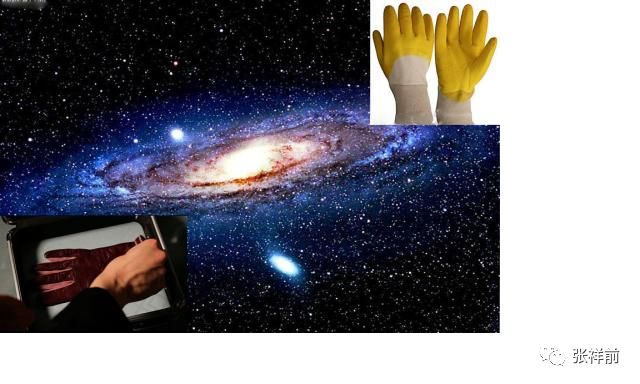

31，物体可以无限分下去吗？

这个要看物体内部能否释放空间。

32，光速为什么不变？

空间相对于我们观察者时刻以光速辐射式的离开运动，光是静止于空间中被空间这种运动带着向外跑的。

运动的空间 = 时间，为了使这个等式成立，人们在时间前面乘上一个速度量纲，这个就是光速。

光速不变的原因是光速中的分子【运动的空间】= 光速的分母【时间】，光速中的分子-----运动的空间随光源的速度变化，光速的分母----时间将同步变化，结果光速不变。

三，宇宙的核心秘密

宇宙最高法则，也是最核心秘密是：

宇宙是由空间和物体组成，其余统统不存在，其余都是我们观察者对物体运动和空间本身运动的描述。

| 我们所说的物质世界中的物质，就是由空间和物体组成的，为什么这么说，因为脱离了我们观察者，物体和空间仍然存在，空间和物体是客观存在的，与我们观察者有、无是没有关系的。
|   而除了物体和空间，别的东西都是我们观察者描述出来，如果没有我们观察者，很显然都是不存在的。
|   伽利略曾经说过，“由我们五官感觉到的物理世界的存在是虚假的，而真实存在的是背后的几何世界。”宇宙的终极之谜就藏在伽利略这一句话里面。
|   伽利略这句话你一旦明白了，能够让你倒抽一口凉气。
|   几何世界就是由物体和空间构成，伽利略的意思是宇宙是由物体和空间构成的，其余的都是我们观察者对物体运动或者空间本身运动的描述。
|   把伽利略的话总结延伸一下，可以有如下看法：
|   我们听到的声音，看到的颜色，感觉到的热，鼻子闻到的气味，舌头尝到的味道，甚至具有时间的感觉••••••这一切都是由于运动造成的。
|   像我们眼前的一棵树、一条河是“物”，树的生长、河水的流动是“事”。宇宙中，物体和空间是“物”，其余的像时间、位移、质量、电荷、场、能量、速度----都是“事”，是“物”相对于我们观测者运动，经过我们观察者描述出的一种性质。
|   这个基本原理否定了电磁场和引力场是一种特殊的物质，场要么是物质粒子，要么是空间。
|   这个基本原理如果是正确的，可以断定，什么暗物质、暗能量、弦论、都是狗屁，不存在的。物体的质量和电荷是物体周围空间运动相对于我们观察者运动，经过我们观察者所描述的一种性质。
|   上帝粒子--- 希格斯玻色子就是真的找到了，与物体的质量、电荷的本质一毛钱关系都没有的。
|   
  那些认为物体之间的万有引力是引力子传播的，电磁场力是光子传递的，强相互作用是胶子传递的，对照宇宙核心秘密，这些都是胡扯。
|   物体的一切相互作用表面看是通过介质来进行，其实本质上都是通过空间进行的。万有引力、电磁场力、核力本质上就是空间运动状态的改变程度，自然界的核心秘密都藏在空间里。
|   统一场论认为，我们观察者在物理上所描述的运动状态和几何中三维空间的垂直状态是等价的。
|   空间的三维垂直状态，经过我们观察者的描述，就是物理上的运动状态。
|   宇宙的一切物体在空间中的运动，本质上都是空间本身运动引起的。
|   这里说的空间本身运动，指的是物体周围空间在运动，如果没有提到物体，在统一场论中描述单纯的空间运动是没有意义的。
|   统一场论认为我们所生活的空间时刻以柱状螺旋式在运动，这个也是三维空间的来历，如果空间时刻以直线运动，空间应该是一维的，如果空间时刻以圆周运动，空间应该是二维的，空间真实的运动是圆周运动加上圆周平面垂直方向的直线运动【合成了柱状螺旋式运动】，所以，空间时刻以柱状螺旋式在运动。
| 我们所生活的空间是右手螺旋空间。
| 而场的本质就是我们对柱状螺旋式运动空间的描述，相对于我们观察者，空间旋转中心一个点是引力场，旋转中心是一个直线，是电场，旋转中心是一个圆周，是磁场。
|   这里说的运动明显有两种，一种是物体在空间中运动，这个我们很熟悉，另一个是物体周围空间本身的运动，这个我们不熟悉。
|   统一场论详细的论述了空间本身的运动。
|   物体周围空间本身的运动，看起来和物体在空间中运动形式不一样，但是，二者本质是一样的。
|   比如，我们夜晚坐飞机，飞机起飞的时候，机场两排灯光在我们看起来高速的离开我们运动，这种运动我们可以理解为背景运动，同样的道理，物体周围空间的运动可以理解为背景运动。现在宇宙膨胀的证据-----哈勃定理，其本质就是一种空间本身的背景运动。
|   宇宙中任何物体【包括我们观察者的身体】周围空间都以光速辐射式运动，空间这种运动给观察者的感觉就是时间。时间只是人的感觉，没有观察者就没有时间。
|   宇宙空间到处的时间是一样的吗？
|   不一样的，宇宙有的地方过了一年，有的地方已经过了一亿年。
|   有人问，宇宙年龄到底有多大？
|   正确的答案是：宇宙没有开始，没有结束。宇宙的年龄是无穷大的。
|   时间是人的感觉，没有人就不存在时间，西方的宇宙大爆炸说宇宙诞生于150亿年前的一次大爆炸，这个就是在胡扯，宇宙没有开始，没有结束，时间只是人的感觉，没有人，一亿年前和一亿年后都是重叠在一起的。
|   时间的开始、过程、结束，是我们观察者把时间和空间位移类比的结果。
|   宇宙的空间是无限的，而物体是有限的，宇宙中心存在着物体，周围是无穷无尽的空间而已。
|   宇宙很复杂，也很简单，空间和物体这两个砖瓦，构筑成宇宙大厦。
|   宇宙就是由空间和物体这两个基本东西构成，其余的只是我们观察者的描述而已，都不是真实存在的。包括运动的现象，都是我们观察者的描述，没有我们观察者的描述，宇宙没有运动状态，不过，也是没有静止状态。没有观察者，讨论运动和静止是没有意义的
|   难怪佛教说一起都是虚幻的，这个真是应了那句话：科学每上一个台阶，发现宗教已经稳坐其上。
|   我们经常问，宇宙到底有多大？
|   宇宙空间是无穷大的。宇宙中的物体是有限的，无穷大宇宙空间中心存在着有限的物体。
|   宇宙中物体在空间中分布是洋葱状，一些发达的外星人发现隔着非常遥远的空间外又能够发现物体。
|   宇宙中物体的有限似乎不能最终确定，进一步明确宇宙中物体的分布需要观察者的观察能力的提高。
|   场的本质是什么？
|   场是物体周围柱状螺旋式运动的空间。
|   场的严格定义为：我们把空间分割成许多小块，每一个小块叫几何点，相对于我们观察者，物体周围任意一个几何点的位置矢量是空间位置的函数，或者是时间的函数，这样的空间叫场。
|   空间为什么要运动？
|   物理是我们对几何世界的描述，物理运动状态和几何垂直状态是对应的。
|   空间的三维垂直状态经过我们观察者的描述，就是物理上的运动状态。
|   处于三维垂直状态中的几何点其位置一定要运动变化，并且运动的方向和轨迹可以重新构成一个垂直状态。
|   宇宙中物体为什么要运动？
|   物体运动的原因是空间运动造成的。
|   我们所生活的空间时刻以柱状螺旋式在运动，我们用右手
|   握住柱状螺旋式运动的直线部分，并且大拇指指向直线运动方向，则四指环绕方向就是空间的旋转方向。我们生活空间的旋转是逆时针。
|   我们知道空间是三维的，过空间任意一点可以作三条相互垂直的线段，空间为什么是三维的？
|   如果空间以直线运动，空间应该是一维的，如果空间以圆周运动应该是二维的，空间时刻旋转运动，并且在旋转平面垂直方向上延伸运动，所以空间以柱状螺旋式运动，空间三维是因为空间时刻柱状螺旋式运动造成的。
|   你你仔细的观察会发现，宇宙一切都是以螺旋式在运动，为什么宇宙一切都以螺旋式在运动？
|   宇宙一切，大到银河系，小到电子、质子，甚至空间本身，都在以螺旋式运动，原因是空间本身螺旋式运动造成的。
|   宇宙中一切运动都是人描述的？
|   既然时间是人描述的，运动必然也是人描述出来的。
|   如果没有观测者，或者不指明那一个观测者，时间、位移、力、质量---许多物理概念失去了意义。由于时间、位移、力、质量---这些物理概念来自于质点相对于我们观测者在空间中的运动，所以讲，脱离观测者（我们人）描述运动是没有意义的。
|   物理学中的运动状态从几何的角度看就是垂直状态，是同一个现象我们观测者从不同的角度【就是从物理角度和从几何角度】看出现不同的结果。运动状态是我们人对物体在空间中的位置不断肯定、否定、肯定、否定、肯定、否定---的结果.
|   没有观察者运动状态不存在的，当然静止状态也是不存在的。
|   宇宙中任意一处空间包含了宇宙今天、以前、以后所有的信息，也就是说可以无限存储信息。
|  
  宇宙任何物体周围空间都以光速辐射式运动，质量反映了物体周围光速运动空间的运动程度。
|   就是在包围这个物体的高斯曲面内几何点的光速运动位移的条数。
|   电荷是粒子周围空间柱状螺旋式运动造成的。
|  
  正电荷周围空间直线运动部分是以正电荷为中心，以光速向四周发散运动。旋转运动相对于我们观察者是逆时针。
|  
  负电荷周围空间直线运动部分是以负电荷为中心，以光速从四周无限远处向负电荷汇聚。旋转运动相对于我们观察者是顺时针。
|  有人说宇宙是能量构成的，那能量的本质是什么？
|   能量是相对于我们观察者物体在空间中运动程度或者物体周围空间本身的运动程度。
|   有人问宇宙是怎么来的？宇宙的起源是什么？
|   正确的答案是：宇宙本来就有，宇宙没有开始，没有结束。
|   有人说宇宙是意识构成的，意识的本质是什么？
|  
  人的思想意识是人大脑中带电粒子的运动形式，思想意识属于“事情”，不是物体。一个人不同于另一个人的思想意识，只是人大脑中带电粒子的运动形式不一样。意识可以对大脑周围空间产生波动，这种波动可以以光速在空间中传播。
|  
  人的灵魂只是意识的核心部分，灵魂也可以以波动形式在空间中传播，波动速度意识光速。

四，宇宙到底是有限的还是无限的？

作者张祥前交流微信zhxq1105974776

宇宙到底有多大？宇宙到底有什么东西构成？这个两个问题是人类对宇宙最渴望知道的问题。

在科技高度发达的外星球，外星人也是不能肯定宇宙到底有多大。外星人开始也是认为宇宙的空间是无限大的，宇宙中的物体是有限的，这样，他们描绘着这样一幅宇宙图景：

宇宙中存在着许多星球这样的物体聚集在一起，周围是无穷无尽的空间。无穷无尽的空间的中心存在着一些实物粒子，这些实物粒子彼此相隔着一定的空间距离，并且在运动着。

然而，随着外星人科技的进一步发展，他们在几万亿光年外又发现了星球，最后，他们发现，宇宙是一个洋葱状，一层一层的。一层和另一层之间的距离是不一样的。越到洋葱的外围，距离越大。但是，这个也不能证明宇宙有就一个中心。

不过，已经发现洋葱宇宙的一层，再想向外发现另一层，就是科技高度发达的外星人，都感到极为困难。

在微观世界上，外星人发现了微观粒子也是洋葱状，原子外的旋转的电子是洋葱的第一层皮，原子核又可以剥一层皮，再向内部剥一层皮，外星人要经过上千年的科技沉淀。

宇宙的大小是不是无限的？微观粒子是不是可以无限分下去？两个问题最终趋向于一个答案：宇宙和微观粒子是一个洋葱状，人类一旦识破了一层，再想进一步了解，只有人类科技发展到那一步，才可以做到。

宇宙到底有多大？物体能不能无限分下去？这样的问题答案竟然是：取决于我们人的发现能力，宇宙的大小取决于我们发现遥远的能力，微观世界物体粒子是否可以无限分下去？取决于我们的分辨能力。

可能大家对以上答案是不满意，感到匪夷所思，更加让人匪夷所思的是外星人对运动的认识。

在宇宙中，物理学是我们对几何世界【由物体和空间组成】的描述，在物理学中我们描述的运动状态，和几何中的垂直状态是相对应的，如果没有我们人去描述，运动状态其实就是几何中的垂直状态。

任何一个物体周围空间三维垂直【意思是过空间中任意一点至少可以作三条相互垂直的直线】状态中的物体的位置，相对于我们观测者一定要运动，并且不断变化的运动方向和走过的轨迹又可以重新构成一个垂直状态。

运动状态竟然是人描述出来的，没有人的描述，就不存在运动状态。这个很多人都无法理解接受，不过，静止状态也是人的描述，没有我们观察者的描述，同样也不存在静止状态。

宇宙没有观察者描述的话，只是剩下；物体和空间，其余统统是不存在的。

其实，物质可以这样定义：

不依赖观察者而客观存在的东西就是物质。 物质由物体和空间组成。

宇宙是由质点和它周围空间构成的，不存在第三种与之并存的东西，一切物理现象都是我们对质点在空间中【或者是质点周围空间本身】运动的一种描述。

自然界只有物体和空间不依赖观察者而真实、独立存在，其余都是人的描述而已，脱离我们观察者统统不存在。

像我们眼前的一棵树、一条河是“物”，树的生长、河水的流动是“事”。宇宙中，质点和空间是“物”，其余的像时间、位移、质量、电荷、场、能量、光速、速度、动量、力、温度、声音----都是“事”，是“物”相对于我们观测者运动时，经我们人描述出的一种性质。

空间和质点不能相互转化，至于宇宙为什么是由质点和空间构成，空间和质点是不是由更基本的东西构成，质点和空间为什么不能够相互转化？这些问题暂时无法回答。

暗物质、暗能量、上帝粒子、引力子、以太、弦论中的弦、膜----统统不存在，都是人们杜撰的。

宇宙大爆炸理论也是错误的，宇宙空间是无限的，时间没有开始没有结束。

宇宙中任何物体【包括我们观察者的身体】周围空间都以物体为中心、以光速发散运动，时间只是人对周围空间这种光速运动的感受。

时间是我们观察者周围空间以光速辐射式运动给我们人的感觉，时间是我们对物体【这里指人的身体】周围空间本身的运动变化所表现出的一种性质，时间不是基本的，是我们人的描述，所以，不是宇宙基本的组成部分。

时间只是人的感觉，如果没有我们人，时间就不存在，但是，空间和物体，不管有没有我们人，都客观存在着。

现在流行的宇宙大爆炸理论认为宇宙起源于150亿年前的一次大爆炸，其实这个理论是错误的，时间只是人的感觉，所以，宇宙的时间没有开始，没有结束。宇宙中时间的流逝是不一样的，有的地方过了一年，有的地方已经过了亿万年，你说宇宙年龄150亿年，以那一个做为标准来计量时间的？

宇宙空间的膨胀是宇宙空间时刻以圆柱状螺旋式运动造成的。我们生活的空间三维也是因为空间时刻以圆柱状螺旋式运动造成的。

我们可以设想，空间人工以直线运动应该是一维的，人工以圆周运动应该是二维的，空间已圆柱螺旋式状运动，在圆周运动垂直方向又有运动，所以，空间是三维的。

我们所生活的空间是右手螺旋空间，就是用右手握住螺旋式直线运动部分，大拇指指向直线运动方向，四指环绕方向就是空间的运动环绕运动方向。空间的运动是以物体为中心，宇宙任何物体周围空间都以物体为中心，以光速向四周发散运动。

宇宙空间由于时刻在运动，任意一处空间可以存储着整个宇宙今过将来所有的信息，可以说空间可以无限存储信息。

质量、电荷、场、能量、力、速度、动量、热、声音、光----这些都是我们对物体在空间中运动描述出的一种性质，没有人都是不存在的。

有人认为宇宙是由能量组成的，空间里就隐含了能量。这种看法是错误的。

能量和质量、电荷一样描述了物体在空间中运动程度或者物体周围空间本身运动的运动程度，能量是一种性质，不是一个东西。

五，为什么说物理世界的存在是虚假的

作者张祥前

对于生活在这个自然界中，我们所观察到的各种东西和各种现象那可真是五花八门、形形
色色复杂到了极点。

但是仔细一分析，可以把他们分为两大类，一类为物、一类为事。

像我们眼前的一座山、一棵树、一个人、一条河……这都是物；树的生长，人
的思想，河水的流动，……这些都是事。

物是产生事的根源，事是物的表现，通过事我们可以认识物，事是依据物而存在的。

没有物就不会有事，反过来未必是正确 的，没有事物却照样存在。

我们在认识这个自然界时，应该要严格区分什么是物，什么是事。遗憾的
是，我们有很多物理学家（不单单是普通人）常犯这方面的错误，他们常常把某些事说成是物，或者对某些事不了解，简单地认为是一种特殊的物质所起的作用。

比
如，历史上人们对热的认识，十七世纪，人们认为热是物体里所含的一种特殊的物质，称之为"
热质" 。

甚至有的学者认为" 热质" 是守恒的，物体所得到的" 热质"
总是另一些物体所失去的而不是凭空产生的，现代人们很清楚" 热质"
说是错误的。

热现象只不过是物体内分子无规则运动的结果，热只是一种现象而已，它属于"
事" 的范畴，把它看则是物，这就是典型的" 事" 和" 物" 不分的思想。

这个有关" 事" 和" 物"
的讨论有助于我们搞清楚物理概念是如何产生的。物理学是借助物理概念而展开的。物理学刚开始处于萌芽时也好，发展到今天也好，所有的物理概念无非是人们对自己所处的物质世界的认识结果。

我们是怎么认识这个物质世界的呢？首先是通过感觉，感觉到这个我们所处的物质世界的各种现象，然后我们大脑把这些感觉加以分析、概括，最后再形成物理概念。

比如，人们用眼睛看到花草的红红绿绿，天空的湛蓝，人们再用头脑一加
工，便有了颜色的概念。

人们用皮肤去感觉冰的冷、开水的烫，大脑再一加工，便有了温度的概念。某处有物体振动，引发周围的空气发生振动，我们用耳朵去感觉
到这空气的振动，我们再去用大脑这么一分析，这样又有了声音的概念。

还有我们躺在床上，闭上眼睛、不去看、不去听，但却老是觉得一个东西在流逝，这样人们
又有了时间的概念。

通过以上所列举的例子，可以得出这样的看法，我们所处的物质世界的某些现象给了我们人某些感觉，我们大脑对这些感觉加以分析，概括这样便产生了物理概念。这样说来，物理概念来自于我们对自己的某种感觉的描述。

为了进一步搞清楚物理概念是如何产生的，接下来。我们应当分析物质世界的各种现象是如何引起了我们人的各种感觉的。

颜色是不同波长电磁波刺激我们眼睛的结果。热是无规则运动的分子猛烈撞击我们皮肤，我们才有热的感觉。

声音是空气中出现的纵波击到我们的耳膜，我们才有了声音的感觉。 ………………

总结以上的分析，物质世界以不同的方式运动引起我们人的各种感觉，我们人对这些不同
的感觉加以分析，概括便形成了不同的物理概念。这样说来物理概念不能脱离我们人而独立的存在着，说明白点，物理概念只是人对自己感觉的一种描述（当然人的
这些感觉并非凭空产生的，而是客观存在的东西刺激了我们人）

读者很多人对这个看法可能会反感，或者转不开弯子，下面通过几个例子使读者比较容易理解这些看法。

设想在一个房间里，正放着优美的C D 唱碟，人们常不加思索地认为只要这C D
唱机开着，而不管我们人在不在场，这个声音总会是客观的存在着。仔细地分析一下，房间里有声音时，房间的空气便出现一股纵波，没有声音便没有纵波，可见有声音没有声音的区别只是房间里空气的位置不一样。没有人在房间里去感觉，那里会有声音的概念。

声音的概念是不能脱离我们人而独立地存在的，有声音比起没有声音并没有多出一件什么东西，所以你不能把声音看则是一个像物体那样具体存在的东西，声音只是一个现象而已。在前面讨论的"
事" " 和" 物" 中，声音明显属于" 事" 的范畴。

颜色也是类似的，我们看到眼前的花草的红红绿绿是电磁波经花草反射到我
们眼球的结果，这个颜色的概念同样不能脱离我们人而独立地存在着。

物体颜色的不同只是物体反射不同波长电磁波的原因造成。颜色不是物体自身的性质，而是由
物体照射到它的各种波长的光的反射和吸收决定的。

这个原理是牛顿最早发现的，历史上甚至现代有很多人固执地认为物体所呈现的颜色是物体固有的属性、与外界
无关。比如德国诗人歌德就曾写文章以非常激情的语言叫人们不要相信牛顿的理论，但牛顿在光学中有关颜色理论的正确性实践证明无须怀疑。

温度的概念起源于外界分子无规则地撞击我们人皮肤的程度，当然脱离了人也是不能独立存在的。

时间的概念与我们人的感觉也有关系，但时间的概念，比较抽象，在后面我们要单独详细地加以分析。

既然物理概念是人的一种感觉，脱离我们人而不能独立的存在，在前面有关" 事"
和" 物" 的讨论中，物理概念明显属于" 事" 的范畴，因而它不能像" 物"
那样客观的存在着，它的存在有它的虚假性。

物理世界的存在有着虚假性。

但是，并非所有的东西它的存在都是虚假的，比如空间、各式各样的物体，它们总是客观地存在着，脱离我们人它们照样存在，它们不管我们人能否感觉到它们，它们总是客观地存在着。

然而，空间、物体（也可称为物质点）这些可以看作是几何概念，在前面讨论的"
事" 和" 物" 中，它们明显属于" 物"
的范畴，它们不依赖于我们人的感觉而客观独立的存在着。

至此我们明白，物理概念来自于我们人的感觉，脱离我们人而不能独立地存在，而某些几何概念，比如空间、物质点不依赖于我们人的感觉而客观、独立地存在着。

对此，物理学的开山鼻祖伽利略早就说过：我们五官感觉到的世界它的存在是虚假的，而真实存在的却是它背后的几何世界……

这些用几何概念描述的空间、物质点和我们对感觉描述出来的物理概念有什么关系呢？对这些，笔者有着这样的看法：

宇宙中真正存在的只有物质点和它周围的空间，不存在第三种形态能与之并存的东西，一切物理现象只不过是点在它周围空间运动的一种表现而已。 这些现象如能引起我们人的感觉,
我们对这些感觉加以分析, 概括便形成了物理概念。

前面有关" 事" 和" 物"
的讨论应该使我们明白只有物质点和它周围空间是物，客观存在的，而物理概念，比如声音、颜色、热、力、速度……等只不过是现象，是物的一种表现，属于"
事" 的范畴。我们一定要严格地区分它们，不能把" 事"
简单地看作是一种特殊的物质。

以上加粗的一段话非常重要，它是本书的基本思想和基本理论，这个基本原理又叫物理世界存在的虚假性定义,
它直接否定了" 场" 是一种特殊的物质，场要么是空间、要么是物质点！

值得注意的是该基本原理还否定了时间是客观独立于我们人而存在的，是构成宇宙的基本要素。时间也只是一种现象，脱离了我们人而不能独立地存在着，这一点可能绝大多数读者都不会相信，在后面时间的物理定义中再来详细地分析时间。

以上加粗的一段话提到了：一切物理现象都是点在它周围空间运动形成的。
点在它周围空间运动是什么运动？只是机械运动而已。这个原理如果是正确的话，可见机械运动虽是简单的运动，各种复杂的现象，以及各种复杂的运动，比如电
力、磁力这都是由机械运动构成的。

非但如此，对于有些物理现象，我们还不太了解他们的本质，比如质量、电荷,各种场……这些本质上人们还不太清楚，但我们
可以肯定的是它是由物质点在它周围空间如何运动而形成的。

| 这个定理还告诉我们，像时间、场、速度、能量、质量、电荷、力-----这些物理概念都是物质点在空间中如何如何运动形成的，运动刺激了我们观察者的感觉，我们观察者通过感觉而描述出来的，因而他们的存在是有虚假性的。
|    有了以上的看法，不管什么物理概念（物质点和空间除外），我们都可以认为是某个东西在空间中相对于我们如何运动所形成的。
|    质量是某某在空间中如何运动形成的。
|    电荷是某某在空间中如何运动形成的。
|    能量是某某在空间中如何运动形成的。
|    力是是某某在空间中如何运动形成的。
| ----------

场比较特殊，它是由空间本身运动变化形成的。

时间也比较特殊，它是由我们观察者自己在空间中运动形成的。

既然在物理学中这些基本概念都是物质点在空间中相对我们观察者运动形成的，设想有另一个观察者随着物质点一同运动，在这个观察者测量不到这些物理量的，这就意味着这些物理量都具有相对性，都应该随着参考系的改变而改变。

这样我们把相对论中相对性原理扩展到所有的物理现象中。对于象光速、电荷为什么相对于不同的惯性系有相同的数值，这个原因是光速、电荷相对于不同的惯性系想有另一个观察者随着物质点一同运动，在这个观察者测量不到这些物理量的，这就意味着这些物理量都具有相对性，都应该随着参考系的改变而改变。

这样我们把相对论中相对性原理扩展到所有的物理现象中。对于象光速、电荷为什么相对于不同的惯性系有相同的数值，这个原因是光速、电荷相对于不同的惯性系相应的有不同的表现，结果导致在不同的惯性系光速和电荷相应的有相同的数值。

六，时间到底是什么？

作者张祥前交流微信zhxq1105974776

人类对时间的认识是一个漫长的过程，一直到牛顿，才认真的考虑时间到底是什么？

牛顿认为：" 绝对的、真实的数学时间就其本质而论，是自行均匀地流逝的，与任何外界的事物无关。"

在牛顿看来，时间就像一条川流不息、永远不变的河流。

牛顿时代及牛顿后期，大家都把时间看成是一个运动的参考，认为时间只是滴滴答在走的闹钟，大家设定一个标准的运动【比如闹钟指针的转动】作为时钟，拿一个标准的运动形式来参考其他运动的运动量、及运动程度。

在牛顿力学理论中，以及后来的数学、物理理论中，大家都把时间设置为参数，认为运动不影响对时间的测量。

比如，许多运动员参加赛跑比赛，大家【连同裁判】都带着手表，并且走时都是一样的，没有人想到运动员的跑步会影响到时间的测量。

但是，爱因斯坦想到了，爱因斯坦的的相对论认为观察者的运动会对空间和时间的测量产生影响。

相对论把时间和空间紧密的联系在一起。相对论强调空间每一个点对应一个时刻。

但是，相对论没有给时间下一个精确的物理定义，所以，相对论对时间的认识是不够彻底的。

彻底的认识时间的本质是统一场论【百度统一场论6版可以搜到】。

统一场论给时间下的物理定义为：

宇宙中任何物体【当然包括我们观察者的身体】周围空间都以物体为中心，向四周发散运动，空间这种运动给观察者的感觉就是时间。

一句话，时间就是人的感觉，没有人的话，就不存在时间。

这个时间的物理定义可以彻底的解释光速不变。

光速在数学上是一个分式，分母是时间，分子是空间位移。分母时间的本质是我们观察者对分子空间位移的描述，

所以时间和空间位移的本质是同一个东西，我们叫了不同的名字而已。所以，光速的分子----空间位移如果怎么变化，光速的分母---时间就一定同步变化，这样光速始终不变。

宇宙中时间的流逝是不一样的，有的地方过了一年，另一个地方可能过了一亿年，但是，时间流逝的快慢，

只是通过比较得出来，一个地方的时间没有快慢之分，因为单一地方没有可比较性，我们说姚明个子比姚明个字高，没有意义。这个也是时间不能倒流的一个重要原因。

时间不能倒流，从时间的几何形式出发，观察者周围空间无论是以光速发散运动，或者是收敛运动，给观察者的感觉都是一样的，观察者不加区分，都用另一个运动形式来表示。

这个有关时间的物理定义如果的确是正确的话，可能人们仍然有许多疑问。

一、在人类没有出现之前的时间如何理解 人在地球上生活也不过只有一百多万年历史，单地球形成至今就有四十六亿年，那么在人出现之前早就有了时间，

如果认为时间是人的一种感受，这段时间在没有人的情况下存在着，那怎能说是人的感受呢？

时间的过去和未来同样都是以现在作为参照系来定义的，换句话，只要有现在，便就有过去和未来。如果地球上从来没有人的话，那也就无所谓过去和未来。因为没有了人，

又哪来的" 没有人之前" 或" 没有人之后" 的时间。时间的先后、现在如同地理位置的东西南北，任何地方的东西南北都不是绝对的，都是相对于我们人来说的，想想看没有我们人，哪来的东西南北？哪来的上下左右？哪来的先后？

二、时间会不会是猪、牛之类动物的感受对于我这个有关时间的物理定义，有人问：时间会不会是猪、牛之类动物的感受，如果是又怎能精确定义为人对自身在空间位置上变动的一种感受，或者干脆称为猪对自身在空间位置中变动的一种感受，如果不是原因是什么？

仅仅是因为猪大脑不及人大脑聪明？其实，时间的定义广义的可理解为：能够对运动感知的物体对自身在空间位置变动的一种感受，

人把这种感受用时间这个词来表达出来，而猪也许只会用" 哼哼" 这个词来表达这种感受。

三、时间如何同一个运动的物体相联系 我们描述一个物体在空间中运动，最简单我们需要了解某段时间在空间中移动了多远。在我们不清楚时间是什么尚不显露问题，一旦确认时间只是人的一种感受，我们的问题自然而然地讲出来了；

这个运动的物体能够和我们这种感受联系得上吗？退一步问：我们不在这个场合，这个物体的运动就不能描述吗？或者说没有一个确定的运动形式吗？在物理学中强调的是效果。

有一个物体在观测者我们看来是静止的，则完全能够把这个物体和我们合二为一看则是一个物体（尽管我们人有血有肉、头脑发达、化学性质同这个物体可能千差万别），

对于我们描述一个物体相对于另一个物体来说完全可以的。这样的话，在描述一个物体在空间位置变动时，有观测者在场时，观测者会说它某段时间内该物体走了多远，

观测者不在场时，观测者总会寻找一个参照性的物体，暗暗地把自己与之等同起来，认为这个参照物体与观测者合二为一，实际上大家也是这么做的，我们描述一个物体运动总要指出它相对于我们观测者的位置如何如何变化-
- - - - 或者相对于我们认为静止的物体（观测者把它同自己合二为一、

看作一个物体）如何如何变化。四、时间的公共尺度问题时间可能是张三对自身在空间位置变动的一种感受，也可能是李四对自身在空间位置变动的一种感受，单地球就这么多人，

大家怎么会有一个公共的测量时间的尺度？所有的运动的观测者、感知者对自身在空间位置上变动的感受理所当然会在头脑中记录下来，然后把它同地球的转动、

太阳的运动、铯原子的振动、脉搏的跳动……等其中的某种运动等同起来，大家最后约定把自'身在时间位置上变动于其中某种运动等同起来，这样便有了一个公共的测量时间的尺度。

五、如何看待" 时间只是个过程" 有的人认为：客观冷静地分析" 时间只是个过程"，这个判断不会出错，

则反过来证明，时间是人的感受的观点是错误的。观测者在空间位置不断地变化当然也是个过程，

认为时间是个过程当然不会出错，这种时间的看法对于时间的本质上认识只是不清晰、不够深罢了，并不是两种观点相互抵触。

六、认为时间是人的一种感觉会不会是一种唯心主义观点？如果认为时间是人大脑里想象出来的，与所有的物体和空间都不相干，这才是真正的唯心主义观点。从以上有关时间的定义可知，

时间是人对自身在空间位置中变动的一种感受，它显然与人这个物体有关，并且是在空间（当然也是实实在在地存在着）

里变化，描述一个实实在在的物体在客观存在着的空间中运动，怎能简单地认为是唯心主义呢？

七、如何重新看待相对论中关于描述单一物体在空间中运动是没有意义的相对论认为：

描述物体在空间位置中运动变化必须相对另一个物体才具有物理意义，描述单一物体在空间中运动是没有物理意义的。

而在以上的时间定义中，明确指出时间的概念的获得源自于观测者一个人在空间中运动，

这二者显然矛盾，那么，究竟需要修改那一种思想呢？在笔者看来，要描述某个物体在空间中变化具有物理意义，必须指明相对于某个观测者而言的。描述物体在空间中运动只有相对于某个确定的观测者才具有物理意义。描述一个物体相对于另一个物体的位置变化未必就一定有物理意义。在上一节曾提到过：

一切物理现象只不过是物质点在它周围空间运动的一种表现而已，点在它周围空间运动引起了观测者的感觉，观测者对其加以分析，总结便形成了物理概念。

一句话描述物体在空间位置中变化，只有相对于一个明确观测者才具有物理意义，

在没有观测者或不指明哪一观测的情况下，描述物体在空间位置中运动都毫无意义。我们在描述地球上的物体（比如人造卫星）常以地球作为参照物，实际上我们观测者把自己所处的位置与地面所处的位置等同起来，换句话来说，

我们人与地球合二为一看成为一个物体，在问题（三）中我们就讨论过这个问题。有关运动的牛顿力学相对性原理以及相对论的相对性原理都不够彻底，

更彻底的运动相对性原理应该是：描述物体在空间位置中的运动变化只有相对于某一个确定的观测者才具有物理意义。

八、观测者为什么一定会在空间位置中变动 按照以上有关时间的物理定义，如果处于空间某处的观测者不在空间位置变动，

那么这个观测者将不具有时间的感觉。现实世界中从来未发生过那个人没有时间的感觉，这从反面说明处在任何一处空间区域里观测者的位置总是要变化。

至于为什么一定要变化，以及如何变化在我其他文章中以有详细的描述。在这里我简单地讲一下：在物理学中运动状态和几何中的垂直状态是等价的，一个物质点处于垂直状态中其位置一定会变化。

九、观察者是以什么方式在空间中运动的？这个问题的论证非常复杂，在我其他文章中有详细的描述。在这里我只是简单地讲一下。我们观察者是以螺旋式在空间中运动的

十、观察者能否感觉到自己在空间中运动的？我们知道一个人坐在一个匀速运动的船里面，他是感觉不到自己在运动的。但是人对加速度是有感觉的，比如人在运动的电梯里，在刚起飞的飞机里，上面说的观察者是以螺旋式在空间中运动变化的，人们虽然觉得时间是在匀速变化、

流逝，但实际上不是观察者在空间中以匀速直线运动获得的。我们知道人有听、嗅、味、色、触五大感觉。空气的震动传到我们的耳朵，我们有了听觉，嗅觉是我们通过鼻子获得的，

味觉是我们通过舌头获得的，光照射到我们的眼睛，我们有了颜色的感觉。触觉是物体直接撞击我们皮肤的结果，热也可以说是触觉的一种。对于一些人不明白的的感觉，人们统称为第六感觉，

人们往往对第六感觉很神秘。我认为还有一种加速度感觉也是很常见的一种感觉。在一个上升或者下降的电梯里，在一个起飞或者降落的飞机里，在一个刚启动或者要停止的汽车里，

人们对速度的变化（也就是加速度）感觉是很明显的。这种感觉和以上的五种感觉明显对不上号，它属于人的另外一种感觉。人生活在地球上对重力的感觉肯定是对加速度感觉的一样的。

人对重力的感觉常常不以为然，宇航员一旦到了太空，处于失重状态，人对于重力感觉的差异的体会可就太深刻了。

人的听、嗅、味、色觉本质上应该都是触觉，前面我们讨论过一切物理现象都是物质点在空间运动所形成的。空气中分子作用我们的耳朵使我们有声音的感觉。

嗅觉和味觉也是分子作用于我们的鼻子和舌头。颜色的感觉是光刺激了我们眼球的结果，

而光实际上也是一些微小的粒子。但是人对加速度的感觉与这些是不同的，它是人自己在空间中加速运动形成的。

人身体可以说是由各种组织构成的，而各种组织又是由分子构成的，这些分子由分子之间的相互作用力而构成一个整体，人在做加速度运动时，影响了这些分子之间的作用力，这个应该是人对加速度感觉的根本原因。人对时间的感觉与对加速度的感觉有相似的地方。

本质上都是我们自己身体在空间中运动引起我们自己的一种感觉，虽然我们暂时不了解，但我们不能够就说不存在。我们还可以做个试验，

把一个人蒙上眼睛，

用一个金属棒缓慢的贴近这个人的耳朵，你问他是左耳朵还是右耳朵，一般人回答正确的概率是非常高的，人的这种感觉明显不同于前面的六种感觉。有关人的感觉，我们知道的并不多，所以有的人用这个来攻击我的有关时间的物理定义是不可取的。

以上有关时间的物理定义如果确是正确的话,不说明我们对时间认识已经完成，而只是对时间的真实面目认识的第一步，

因为在这以前绝大多数人都认为时间是一种客观存在的东西，是宇宙的组成部分。从以上的分析来看，

这种看法是根本上错误的。 回顾一下历史,牛顿力学认为时间自行流逝,于我们观测者无关.相对论力学认为时间于我们观测者的运动有关.在这里我们进一步指出,时间不仅于我们观测者的运动有关,而且就是我们观测者自己在空间中运动所造成的. 在文章的最后，

我来给大家讲一下时间的物理定义于光速不变性之间的关系。时间的物理定义是：我们观察者对自己在空间中运动变化的一种感受，带有数学的定义是：

时间与我们观察者自己在空间中走过的路程成正比。自然界中任何一个物体，包括我们观察者自己的身体，看起来是静止的，都不是真正静止的，都在以光速作穿越空间运动，这个就是产生时间的更本原因，在物理学中可以称为时间的背景运动。

时间为什么不能倒流？

在人们的日常生活中，从来就没有发生过时间倒流的事例，所以，人们认定了时间是不可以倒流的。而实际上这个只是来自于人们的经验，时间到底能不能倒流？为什么不能够倒流？这些问题人们无法回答。

要准确而清楚的回答以上问题，我们只有知道时间的本质，就是知道时间到底是什么。

在我研究的统一场论【百度 张祥前新浪博客 统一场论6版可以看到】中指出：

宇宙中任何物体【包括我们观察者的身体】周围空间都以物体为中心、以光速向四周辐射运动，空间这种运动给我们观察者的感觉就是时间。

以上时间的物理定义告诉我们，时间来自于光速运动空间给我们观察者的一种感觉，时间与光速运动的空间运动变化的路程成正比，时间在数量上等于光速运动空间的位移量。

我们知道，一个质点沿一条直线运动，运动的位移是有对称的，以这个点为参考，一边是质点运动方向，另一边是质点运动的反方向。

我们如果假定这个运动质点相对于另外一个观察者是静止的，其周围沿运动方向一维空间在这个另外观察者看来总是向质点靠拢，沿运动的反方向空间总是远离这个质点。我们可以说，这个质点周围空间的运动是对称的。

但是，产生时间的空间运动是辐射式的，就是以一个质点【或者观察者的身体】为中心，向西周扩散运动，或者从无限远处的宇宙空间向这个质点【或者观察者的身体】汇聚，这两种辐射式运动的对称都是不存在的。

我们把空间以光速离开观察者运动看成正时间，而倒流时间应该是和运动空间相对称的部分，但是，这种产生时间感觉的空间运动是一一个点为中心辐射式的，没有对称部分。

这个就是时间不能够倒流的物理、几何解释。

打个比方，空间如果可以染上颜色，我们观察者可以看到空间时时刻刻的从我们观察者出发，向西周以光速扩散运动，这种运动给我们观察者的感觉就是时间，而这种运动是没有对称性的，运动只有一个方向，从我们观察者出发，射向无限的宇宙空间，没有反方向运动。所以，不存在时间的倒流。

那怎么知道时间就是空间光速运动造成的？

在宇宙中，真实存在的只有物质点和它周围空间，不存在第三种与之并存的东西，一切物理现象都是我们对物质点在空间中运动的一种描述，像时间、质量、电荷、电磁场、重力场、速度、光速、能量、动量、热、------都是一种性质，都是我们观察者对物质点在空间中运动所描述出的一种性质，因而物理现象的存在是虚假的，需要我们观察者的描述，没有观察者，这些物理现象就不复存在。但是几何现象---物质点和空间没有观察者仍然存在。

可以说，时间是某某东西在空间中运动【或者周围空间本身的运动】给我们观察者的一种感觉，我们把这种感觉描述出来就是时间。

现在设想把一个观察者送到一个远离星球的宇宙空间处，可以设想这个人仍然有时间的感觉，而此时的物体唯一的就是这个人的身体----因而合理的看法是：时间是观察者对自己在空间中运动【或者自己周围空间的运动变化】的一种感受。

为什么把时间与光速联系在一起？----因为这样可以很容易的解释光速为什么不变。

| 任何一个物体(包括我们观测者自己）周围空间都以光速C辐射式的离开，光是静止于空间中，被空间这种运动带着向外跑的，而时间的本质就是观测者周围空间以光速辐射式的离开给我们观测者的一种感觉。时间t在数量上正比于空间以光速移动的距离r，即：时间=以光速运动的空间。为了不使上式两边的量纲发生混乱，我们乘上一个常数C，时间t
  = C乘以运动的空间r
| C就是光速，也就是：t = r / C
| C = r / t
| 当光源以某个速度v运动时候，导致运动空间位移r发生了变化，但是，时间t本质就是运动空间位移r（是我们人把运动空间位移r用另一个词----时间t来描述），所以，一定会随着r的变化而同步变化。

光速C的分子r和分母t本来就是一个东西【是我们人描述成不同的东西】，肯定会同步变化，结果是光速C不变。还可以给出一个推论：两个观测者相互无论做什么复杂的运动，观察的光速都是一样的。

相对论认为，两个观察者甲和乙相对运动，会发现对方的的时间变慢，这种变慢会随速度增大而变得明显，相对论认为，一旦速度达到光速，他们会发现对方的时间凝固了，不走了。人们很自然的认为，如果他们相互运动速度超过光速，应该就是时间倒流了。

相对论还告诉我们，如果我们发现一个外星飞船，以光速运动，这个飞船沿运动方向长度为零，如果飞船上一个外星人沿运动方向从船头走到船尾是不需要时间的-------因为沿运动飞船的长度为零，长度为零按理说外星人走过去是不需要时间的----有没有比不需要时间更快的运动-------显然没有，所以，相对论中也没有肯定时间可以倒流。

广义相对论还指出，不同的星球表面，如果引力不同，时间流逝的快慢是不同的，引力强的星球表面时间流逝的慢。

在宇宙空间中一处时间可能比另一处时间快，或者慢，但是，时间仍然是不能够倒流的，时间的快慢是不同地方的比较概念，只有在不同的地方才可以比较时间的快慢。同一个地方的时间是没有比较性的，如果时间发生倒流，应该是在同一个地方，所发生的事情可以通过某种信息时时刻刻传递和验证，而同一个地方的时间的快慢是没有可比较性的，所以从这个角度看也没有时间的倒流 。

时间的先后，如同东西南北中，都是相对于我们观察者而言的，没有我们观察者，就没有东西南北中，也没有时间的先后。也没有快慢。更没有时间的倒流，与时间相关的一切事情，都与我们观察者的描述有关，脱离我们观察者，都是不存在的。

人类要怎么消除时间的感觉？

时间是我们人周围空间以人为中心、以光速向四周发散运动，给我们人的感觉。

如果这个就是时间的本质，我们可能有一个疑问：

我们人周围的空间是不是以光速匀速直线运动，给我们人造成感觉？或者是以其他形式运动，给我们人造成了时间的感觉?

我们人类能不能消除时间的感觉？

从外星人那里，我了解到，宇宙任何物体【包括我们观察者的身体】周围空间总是以光速、以圆柱状螺旋式向四周发散运动。

从他们这种对时间的看法，可以知道，空间相对于我们人是以圆柱状螺旋式在运动。而且不是朝一个方向运动，而朝四面八方在运动。

伽利略在《两种新科学的对话》中，描述大船在河中匀速直线运动，呆在船里的人无法察觉到船是不是在运动，感觉运动和静止时候没有区别。

人具有时间的感觉，是来自于人周围空间以圆柱状螺旋式运动，根据运动的相对性，从效果上讲，等同于人在空间中以圆柱状螺旋式运动。

我们知道，圆柱状螺旋式运动是旋转运动和旋转平面垂直方向运动的合成，旋转运动存在着指向中心的加速度运动，这个就是人具有时间感觉的根源。

我们知道，人对加速度运动是有感觉的。一个人在电梯上下，在起飞和降落的飞机里，大家都能够明显的感觉到加速度运动。

人类主要有触觉、视觉、味觉、听觉、嗅觉，人们称为五官感觉。现在人们已经搞清楚了，

味觉是食物在人的口腔内对舌头、口腔刺激产生的一种感觉。

视觉是不同波长的电磁波刺激人眼球的结果。

听觉是空气波动波及到我们耳膜引起人的感觉。

嗅觉是嗅神经系统和鼻三叉神经系统对气味的感觉。

触觉是人皮肤和身体其他部位对物体碰撞的感受。

除了以上人们常见的五种感觉，人对加速度运动也是一种常见的感觉。人能够明显的感觉到自己身体在做加速度运动，剧烈的加速度运动可以使人丧命。

人对时间的感觉和以上人们常见的感觉都不一样。

人们在地球上具有时间的感觉，到了月球，仍然具有时间的感觉，在天空失重状态下，人仍然具有时间的感觉，这个表明，重力场不是引起人具有时间感觉的原因。

从外星人的科学理论中，我了解到，重力场或者说是引力场的本质就是空间加速度运动。

我们看到一个石头自由落体的坠落到地面，其实，空间随着石头一同在向地心坠落，在没有石头的情况下，空间时刻不停的以这种加速度方式向地心坠落，这个就是引力场的本质。

既然人具有时间的感觉不是引力场的空间加速度运动引起的，前面我们说到人具有时间的感觉，是因为空间以圆柱状螺旋式运动引起的，在圆柱状螺旋式运动中，是旋转运动和直线运动的合成，人具有时间的感觉是因为圆柱状螺旋式运动中的旋转运动具有指向旋转中心的加速度运动，正是这种加速度运动造成了人具有时间的感觉。

这个似乎存在了矛盾。

其实，原因是圆柱状中指向旋转轴心的加速度运动和地球表面的那种重力场加速度运动是不同的。

地球重力场可以造成人的身体整体向某一个方向加速度运动。而人周围空间的圆柱状螺旋式运动中包含的加速度运动，方向不是一致的，方向呈现了一种辐射式分布。

那么，我们有一个问题：我们怎么做，能够使人周围空间这种圆柱状螺旋式运动消失，使人失去时间的感觉。

首先，我们要认识到，我们在生活中，经常是忘记了时间，特别是忙着干事情、在睡梦中。但是，让人彻底失去时间的感觉，这个似乎是做不到的。

从外星人的科学理论中，我了解到，物体质量也是物体周围空间光速发散运动造成的，他们认为物体质量的大小就是物体周围空间光速运动的空间位移的条数。

如果想办法使人身体的质量变成了零，人岂不是就彻底失去了时间的感觉？

可是怎么能够使人身体质量变成零？大家想到了相对论，相对论说，物体以光速运动，物体的静止质量是零。

可是这个是相对论概念，相对于我们光速运动的一个人，我们认为他静止质量变成了零，但是在这个人看来自己身体的质量没有任何变化。

外星人的确可以做到人没有时间的感觉，他们的方法是把一个人的思想意识用人工场扫描记录下来，用光线虚拟人代替原来的肉体，这样可以使人身体处于零质量、或者接近零质量状态。

他们的光线虚拟人体具有时间的感觉，是他们的信息系统给予的，不是来自于对自己身体遇到的感觉的描述。

除了把人身体虚拟化，弄得没有质量，有没有其他的办法，使人失去时间的感觉？

严格的说，办法是有的。外星人他们利用变化电磁场产生的反引力场对人照射，可以使人身体的质量逐渐减少，一旦质量减少到零，这个人就突然以光速运动起来。

这个人以光速运动的时候，我们外面的观察者发现这个人无论走了多少光年远的路程，他自己是无法感觉到这个运动过程。在他心里，只是觉得一刹那而已。

但是他失去时间这种感觉，也就是质量变化到接近零的那么短暂的一刹那而已，这个和我们平时的感觉也是差不多的。

他们生活中真正的长时间的失去时间感觉，还得要把自己的身体虚拟化，让自己生活在电脑和网络中，或者使自己的身体变成光线虚拟人。

关于时间的本质问题，大家可以参阅张祥前的其他文章。

回答网友关于时间的本质问题

作者张祥前交流微信zhxq1105974776

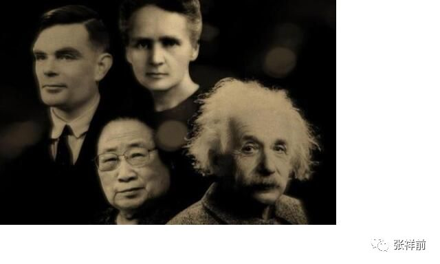

最近，网友王飞发邮件给我，说：

你好，

在知乎上看了你对时间本质的讨论，感觉很有意思。

我基本同意你关于时间本质的观点，但是还是有一些问题不太清楚，或者不太同意。

1. 既然时间是空间本身的运动，那空间的本质又是什么？运动的空间，感觉上有点像“以太”的概念。

2. 同意时间是人的一种感觉，不太同意时间只是人的感觉。

你也说了，猪也能感受时间，只不过不会说，只会“哼哼”罢了。所以，时间不是人的专属，也不是生物的专属，而是一切物质的专属。

感觉时间的本质应该是物质间的相互作用。

假如人只是一个物质点（也就是说不存在人身体本身的运动变化过程），如果没有其他物体与人有任何交往互动，也就没有了时间的概念（就是想也想象不出来）。

其他物质点与人交往互动的过程中，才让人产生时间感觉。

 

3. 有一点不太清楚，当一个物体以一定速度远离观察者的时候，可以匹配上相对论的时间变慢，那么当一个物体以一定速度接近观察者的时候，时间如何变化呢？是快还是变慢（这一点也是我对狭义相对论不理解的地方）？

 

仍然感谢你的分享，希望多多探讨。

王飞

 

张祥前的回答。

关于时间的本质问题，是属于我创立的统一场论【百度统一场论6版可以搜到】中一部分。

 统一场论基本原理是：宇宙是由物体和空间组成，不存在第三种与之并存的东西，其余统统不存在，其余都是我们观察者对物体在空间中运动或者物体周围空间运动的描述。

我们把认识的对象称为事物，像我们眼前的一颗树，一条河是物【或者叫物体】，树的生长，河水的流动叫事【或者叫事情】。

宇宙中，只有空间和物体是物【或者叫物质】，空间和物体运动都是事【或者叫事情】。物体运动或者物体周围空间相对于我们观察者运动，经过我们观察者描述出：时间、场、光速、质量、电荷、力、动量、能量、热、、声音······等物理概念。

统一场论给时间下的物理定义是：

宇宙任何一个物体【包括我们观察者的身体】周围空间都以光速向四周发散运动，空间这种运动给我们观察者的感觉就是时间。

以上时间的物理定义告诉我们，时间的本质是我们观察者对光速运动空间的描述。

一旦我们认识了时间的本质，就可以对王飞的问题做出正确的回答。

王飞的问题是：

1,
既然时间是空间本身的运动，那空间的本质又是什么。运动的空间，感觉上有点像“以太”的概念。

张祥前的回答：

时间的本质是我们对自己周围空间以光速运动的描述。空间是和物体最基本的东西，所以，你不能够问空间是由什么组成的。

你问空间是什么东西构成-------这个前提条件就是空间不是基本的-----一旦我们知道空间是基本的-----你问空间是由什么更基本的东西构成-----这个提问本身有问题。

空间是客观存在的，如果没有观察者，空间仍然是存在的，但是，没有观察者的话，时间是不存在的，因为时间是我们观察者描述出来的。

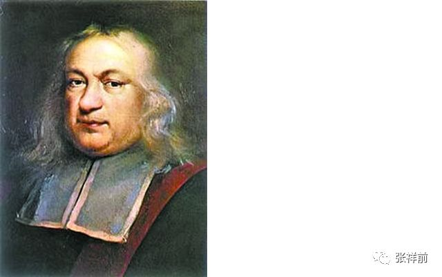

空间和物体这两个是最基本的，组成了宇宙大厦，以太根本就不存在，以太是人杜撰出来的。

所以，我们不能问：空间和物体是由什么东西构成---因为空间和物体是最基本的东西，别的----时间、场、光速、质量、电荷、力、动量、能量、热、声音······都可以认为是由空间和物体构成的-----统一场论中认为都是物体在空间中、物体周围空间本身相对于我们观察者运动形成的。

在统一场论中，认为空间和物体是不能够相互转化的。如果能够相互转化，我们就不能认为构成宇宙最基本东西是空间和物体。

    

 2. 同意时间是人的一种感觉，不太同意时间只是人的感觉。

你也说了，猪也能感受时间，只不过不会说，只会“哼哼”罢了。所以，时间不是人的专属，也不是生物的专属，而是一切物质的专属。

感觉时间的本质应该是物质间的相互作用。

假如人只是一个物质点（也就是说不存在人身体本身的运动变化过程），如果没有其他物体与人有任何交往互动，也就没有了时间的概念（就是想也想象不出来）。

其他物质点与人交往互动的过程中，才让人产生时间感觉。

 

张祥前的回答：

时间的定义，广义的可以是：时间是观察者【能够对运动感知者】周围空间以光速向四周发散运动给观察者的感觉。

我们人是观察者其中一种，我们人用时间这个词把人周围空间光速运动给人的感觉给描述出来。

所以，我们说时间是我们人这个观察者对自己周围空间光速运动描述的结果。

猪也能够感觉到自己周围空间的光速、发散运动【前面指出了宇宙任何物体周围空间总是以物体为中心向四周发散运动】，只是猪可能不是用时间这个词来描述自己这种感觉。

 但是，我们不能断定说“时间是我们观察者对自己周围空间光速、发散运动给自己的感觉”就是错误的判断。

 

王飞说，时间的存在还必须要存在其他物体【或者质点】，和我们人的身体在相互作用中，才能够体现出时间概念。

这个看法是错误的，时间的存在需要人这个观察者，需要空间的存在，需要运动【就是我们人这个观察者和周围空间的相对运动】这三个条件，这三个条件缺少一个都不行。但是，不需要存在另外一个物体，这里只是需要存在我们观察者一个物体。

王飞之所以存在这个错误的判断，是他没有想到物体【包括人的身体】周围空间本身时刻在以光速向四周发散运动。

对于一个静止物体，一般人无法和运动联系在一起，而这个时候时间要和运动联系在一起，所以，这个情况下，很多人虚构了除观察者外，还存在着另一个物体，和观察者在相互作用而导致了运动现象的发生。

 

3. 有一点不太清楚，当一个物体以一定速度远离观察者的时候，可以匹配上相对论的时间变慢，那么当一个物体以一定速度接近观察者的时候时间如何变化呢？（这一点也是我对狭义相对论不理解的地方）

张祥前的回答：

 在相对论中，时间是物体运动速度的函数。对某一个事情经历的时间的测量，与这个事情发生的地点的【相对于我们观察者】运动速度是相关的【而牛顿力学认为是不相干的，这个是牛顿力学和相对论不同之处】。

这个时间随速度变化，与速度的大小有关，与远离我们还是离开我们观察者，是没有关系的。远离我们观察者、或者接近我们观察者，产生的时间变慢效应是一样的。

 

七，宇宙中为什么所有的星球都在旋转？

太阳系内几乎所有的星球都在旋转，行星都绕太阳公转，又在自转，而包括太阳在内所有的星球都有自转。

在微观世界中，电子、质子、中子-----都有自旋。整个银河系也在旋转。可见，宇宙中物体的旋转运动是一个普遍现象。

如果你仔细的观察一下，就会发现，宇宙中所有的自由存在于空间中的物体，都是以螺旋式在运动，螺旋式运动是自然界的一个基本规律。

星球的自转和公转，本质上都是螺旋规律造成的。

那宇宙中的星球和粒子为什么要旋转？牛顿创造了牛顿力学，他试图用力来解释这个问题。比如，我们在桌子上放一块砖头，我们用棍子捣一下，如果捣偏了，砖头旋转的在桌子上运动，如果捣的很正，砖头就以直线运动，几乎不旋转。

从这个事例看，星球的自转可能是星球受力不均匀造成的。比如，流动的河水中，我们看到漂在水上的小船在河中间几乎以直线随水流动，而在岸边的小船却很容易旋转。

这个原因是河水中间流动比较均匀。而岸边的河水由于与河岸边的摩擦，流动速度降低，和河中间的水流的速度产生了差别。正是这个流速差导致了小船容易打旋。

如果认为宇宙中几乎所有星球都在自转，原因是星球受力不均匀，这个是站在机械角度的解释，是不彻底的。

宇宙中物体为什么会运动呢？在物理学中我们描述的运动状态，如果没有我们人去描述，其实就是几何中的垂直状态，任何一个处于垂直状态中的质点其位置相对于我们观测者一定要运动，并且不断变化的运动方向和走过的轨迹又可以重新构成一个垂直状态。

这个就是垂直原理。不断变化的运动方向一定是曲线运动，圆周运动最多可以作两条相互垂直的切线，而空间是三维的，其运动轨迹一定可以作三条相互垂直的切线，所以运动一定会在圆形的垂直方向上延伸，合理的看法是质点在空间中以柱状螺旋式运动。

这个垂直原理同样适用于空间，空间本身时刻以柱状螺旋式在运动。我们知道，沿空间中任意一点最多可以作三条相互垂直的有向线段，称为三维空间。

一维空间决定了质点以直线运动，二维空间决定了质点以圆或者曲线运动，三维空间决定了质点以柱状螺旋式运动。或者说质点直线运动产生了一维空间，质点曲线运动产生二维空间，质点柱状螺旋式运动产生了三维空间，这两钟看法是我们人对同一个现象从不同角度理解而出现的。

在太阳系内，所有的行星以逆时针围绕太阳旋转公转，是因为太阳使周围空间以逆时针旋转运动，太阳的质量和引力场的大小就是周围空间旋转运动的的程度而已。

一个行星【无论质量大小】以逆时针绕太阳旋转运动，旋转半径为r，周期为T，太阳的质量就取决于r的立方和T的平方的比值。

至于地球和月球之间的运动情况，也可以认为是地球的质量令周围空间逆时针旋转，月球随着空间一同逆时针围绕地球旋转运动。

而对于地球的自转，有内因和外因，外因就是太阳施加在地球上的引力是不均匀的，引起地球自转，原因是我们在前面讨论的流速差。

还有一个人们不怎么注意的内因。地球46亿年前，和太阳一样，是一团气雾状，这个气雾状星云受到空间本身的螺旋式运动影响，而旋转起来。

对于金星的反常的顺时针自转，一个解释是金星受到一个外来星球的猛烈撞击，而改变了自转方向的。很可能是，金星在形成时候就是以逆时针旋转的，那时候，整个太阳系如同一团巨大的气雾团，我们看到气雾和水流的旋转都不是完全一个方向的。

太阳使周围空间逆时针旋转，存在于太阳周围空间中物体会受到这个逆时针旋转空间的影响，随着空间以逆时针旋转运动，但不是任何情况下都以逆时针方向围绕太阳旋转运动，这个还于物体的初始运动状态有关。

比如，站在太阳参考系的观察者，发现在某一个时刻一个静止在太阳周围的物体，观察者会预言，以后这个物体会直线加速坠落在太阳上，这个物体如果以一个恰当的速度绕太阳旋转，会一直绕太阳旋转下去。如果这个速度太大，这个物体会远离太阳跑得无影无踪的。

现在流行的宇宙大爆炸理论是错误的，星球之间相互远离，只是星球和空间以螺旋式运动给我们观察者的一种假像而已。

八，为什么说宇宙大爆炸是彻底错误的？

作者张祥前交流微信zhxq1105974776

1927年，比利时天主教神父勒梅特首次提出了宇宙大爆炸假说。

1929年，美国天文学家哈勃根据假说提出星系的红移量与星系间的距离成正比的哈勃定律，并推导出星系都在互相远离的宇宙膨胀说。\ |image1|

1946年美国物理学家伽莫夫正式提出大爆炸理论，认为宇宙由大约140亿年前发生的一次大爆炸形成。

现代主流科学的大爆炸理论认为，150亿年前，宇宙是一个奇点，随后发生一次大爆炸，诞生了时间、空间和物体，而现在人们普遍认为宇宙由时间、空间和物体构成。

宇宙大爆炸理论和相对论实际上是相矛盾的，我们假设相对论是正确的，相对论认为两个观察者相对运动，测量时间的过程是不一样的。

设想一个外星球相对于我们以接近光速运动，我们过了一年，这个星球上的人可能过了一万亿年。你说宇宙起源于150亿年前的一次大爆炸，是相对于那个星球？由于宇宙中时间的流逝不均匀，你说宇宙的年龄有多大就显得毫无意义了。

西方国家相信宇宙大爆炸是为了迎合上帝创造人和万物的思想，可笑的是有许多中国人也跟着瞎起哄。

一个星球相对于另一个星球高速运动，这个星球所在空间中的时间和另一个星球上时间是不一样，这个星球上的时间过了几分钟，另外一个星球可能过了一万年。

相反的情况也可以发生，这个星球上的时间过了几万年，另外一个星球可能过了几分钟。不过，宇宙中任何地方时间倒流是不会发生的。

一个地方和另外一个地方的时间流逝不一样是一个比较概念，只有通过比较，你可以知道那一个地方时间流逝快一些，那一个地方时间流逝慢一些，同一个地方是没有比较性的。实际上宇宙中任何两个地方的时间流逝都不是一样，很多情况下由于差异微小，我们难以察觉罢了。

在宇宙中，不光是相对运动的星球的时间的进程不是均匀的，在强引力的星球表面时间流逝得非常的缓慢，甚至到了不走的地步。宇宙中时间流逝的不均匀在有些空间区域里是非常的显著，相差的数量级是非常巨大。

宇宙中，有的地方过了一年，有的地方可能过了几亿年了。从这种角度看，现在流行的宇宙大爆炸理论纯粹是错误的。

当然，宇宙中部分星球相互吸引，最后演变成一个超级星球，后又爆炸分离出气态星球，后在万有引力作用下又演变成小的星球，这种周而复始的变化宇宙中比比皆是，但是这个是宇宙局部情况，你说整个宇宙，包括时间、空间、物体都是爆炸而

来的，这个就更荒唐了。

我们知道爆炸有一个或者几个中心点，而宇宙中的星球相互彼此在远离，没有中心点，这个明显是空间本身运动的原因。

宇宙中是由物体和空间组成的，其余统统不存在，其余都是我们人对物体在空间中运动【或者物体周围空间本身的运动】的一种描述。

宇宙中任何物体【包括我们人身体】静止的时候，周围空间都以光速辐射式的运动，空间这种运动给观察者的感觉就是时间。

时间是我们对空间运动变化的感受，时间是我们人对宇宙空间运动变化所产生的一种性质的描述，不是真实的存在的东西，脱离我们人，时间是不存在的。

宇宙真实存在的只有物质点和空间，其余的都是物质点在空间中相对于我们人运动所表现出的一种性质。如果没有我们人，宇宙给我们的景象就如同一个照相机的定格镜头，人类一旦明白了这一点，时间是人的一种感觉，不是真实存在的一个东西，你说时间起源于150亿年前的一处爆炸，你就知道这些看法是荒唐的。

宇宙中星球相互远离的真正原因是物体周围空间时刻以柱状螺旋式在运动所造成的。

一个星球相对于我们观察者静止，这个星球周围的空间时刻以柱状螺旋式向外辐射运动，但是，旋转运动由于相互抵消，实际只是以星球为中心、以光速向四周离开运动，这个如同磁场的高斯定理，一个平面上有多少磁力线穿过，就有多少穿进来，这样从整体看相互抵消为零，但是从局部看，空间本身旋转运动仍然存在着。

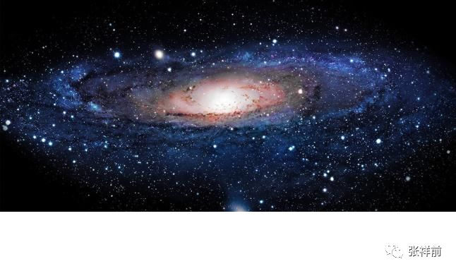

宇宙星球相对于我们观察者静止，周围的空间旋转运动相互抵消而消失，但是，当这个星球相对于我们观察者运动的时候，周围平衡被打破，旋转运动将会出现。

可能大家有一个疑问，既然星球周围空间都是以光速在辐射式发散运动，星球存在于空间中被空间这种运动带着向外跑，哈勃定理中的星球相互远离的速度应该是光速，但是，实际观察到的速度远远的小于光速，这个是什么原因呢？

这个原因是宇宙中每一个星球有一个大小不一的初始运动速度，设想一个星球和我们所在的地球有相同的初始运动速度，我们应当看到这个星球和我们地球是相对静止的，如果这个星球在我们看来绝对静止于空间，这样这个物体会以光速相对于我们运动，这个就如同发光。

空间本身的运动还有一些特殊性，比如，一个苹果从树上掉下，如果认为苹果是静止的，是地球撞上了苹果，那和我们中国对称的巴西国家同时放上一个苹果会加速飞到空中-----这个情况没有发生，原因是空间本身的运动是以地球为中心，从四面八方时刻向地球加速坠，。

至于空间本身为什么时刻要运动，为什么会以柱状螺旋式在运动。这个是自然界的核心秘密。

物理上的运动状态是我们人对几何中的垂直状态的描述。

任何一个处于垂直状态中的质点其位置相对于我们观测者一定要运动，并且不断变化的运动方向和走过的轨迹又可以重新构成一个垂直状态。这个就是垂直原理。

不断变化的运动方向一定是曲线运动，圆周运动最多可以作两条相互垂直的切线，而空间是三维的，其运动轨迹一定可以作三条相互垂直的切线，所以运动一定会在圆形的垂直方向上延伸，合理的看法是质点在空间中以柱状螺旋式运动。

| 太阳系内几乎所有的星球都在旋转，行星都绕太阳公转，又在自转，而包括太阳在内所有的星球都有自转。
|   在微观世界中，电子、质子、中子-----都有自旋。整个银河系也在旋转。可见，宇宙中物体的旋转运动是一个普遍现象。

如果你仔细的观察一下，就会发现，宇宙中所有的自由存在于空间中的物体，都是以螺旋式在运动，螺旋式运动是自然界的一个基本规律。

星球的自转和公转，本质上都是螺旋规律造成的。

空间本身时刻以柱状螺旋式在运动。我们知道，沿空间中任意一点最多可以作三条相互垂直的有向线段，称为三维空间。一维空间决定了质点以直线运动，二维空间决定了质点以圆或者曲线运动，三维空间决定了质点以柱状螺旋式运动。

或者说质点直线运动产生了一维空间，质点曲线运动产生二维空间，质点柱状螺旋式运动产生了三维空间，这两钟看法是我们人对同一个现象从不同角度理解而出现的。

单单从时间是人的感觉，没有人就不存在时间这种观点出发，就知道宇宙没有起点，也没有终点，宇宙空间本身的运动是因为空间的三维垂直状态经过我们人描述的结果，

九，太阳系起源与拉普拉斯假说

作者张祥前交流微信zhxq1105974776

我们所生活的地球处于太阳系中，太阳系是怎么形成的，历史上许多科学家、哲学家给出了各种答案。

法国的布丰说太阳系是彗星撞击形成的。

其中最为大家称道的、靠谱的是法国数学家拉普拉斯给出的星云假说。

1796年法国数学家、物理学家PS·拉普拉斯在他的《宇宙体系论》中，独立地于德国哲学家康德，提出了关于太阳系起源的星云假说。

拉普拉斯认为，太阳系起源于一团炽热的球状星云，其直径远大于现今的太阳系直径，并缓慢地转动。

这团星云以后因向外辐射热量，其温度逐渐冷却，星云也逐渐收缩并且密度增加。

星云半径减小，由于角动量守恒，转动速度会逐渐加快。这个如同冰上舞蹈演员双手伸开快速旋转身体，突然抱紧两个胳膊，旋转速度就更加快了。

由于赤道附近离心力的不断增大，星云逐渐变成星云盘，旋转逐渐收缩在一个平面上。

星云旋转速度加快，当离心力超过向心力时，赤道边缘的物质便分离出来，形成一个旋转的环(拉普拉斯环)，并相继分离出与行星数目相等的另一些漩涡环。

星云的中心部分最后形成太阳，各环在绕太阳旋转过程中，环中的物质逐渐向一些凝块聚集形成行星。行星又以同样的方式分离出环，再凝结成卫星。

今天我们在拉普拉斯的星云假说的基础上，结合统一场论【百度统一场论6版可以搜到】，可以完美的解释太阳系起源之谜。

大约在46亿年前，太阳系就是一团灼热的云雾，在万有引力的作用下，这些云雾团逐渐的向中心收缩。按照统一场论的看法，一切物体独立存在于空间中，都以螺旋式在运动，因而这些云雾团以螺旋式在空间中运动，因而有个旋转运动，这个旋转运动加上万有引力使大部分的云雾收缩到旋转的中心地带，最后演变成太阳。

随着云雾温度的降低，并向云雾团中心收缩，云雾团的旋转速度将加大，云雾之间的万有引力不足与抗衡云雾团的旋转离心力，一部分云雾将被丢在太阳周围的空间中，继续围绕太阳旋转运动，最后演变成行星和围绕行星的卫星。

我们知道，八大行星围绕太阳旋转运动几乎是在一个平面上，旋转的方向相同，都是逆时针，而且太阳自转也是逆时针方向，这个支持我们以上的看法，如果八大行星的旋转和太阳的自转不在一个平面上，旋转的方向不同，以上太阳和八大行星曾经作为一个整体旋转我们可就难以说得通。

统一场论认为万有引力是物体周围空间逆时针旋转运动造成的，这个可以很好的解释太阳系中8大行星是以逆时针围绕太阳旋转。

所有的行星自转和卫星的旋转都是逆时针，唯独金星的自转是顺时针，这个可能是形成金星的星云一开始的旋转就是顺时针，可能是早期星云的旋转出现局部的顺时针旋转漩涡。这个如同水流漩涡，大的逆时针旋转漩涡附近偶尔会出现小的顺时针漩涡。

早期的太阳可能不发光，万有引力和太阳的自转都使太阳体积逐步收缩，当收缩到一个极限程度时候，太阳内部的物质在高温、高压情况下发生了热核反应，从此太阳开始发光。由于地球和其他行星质量太小，始终无法得到发生热核反应的应该具备的高温、高压条件，不能发生热核反应，所以是我们现在所看到的样子。

太阳这样大小的恒星是宇宙中最为典型的，它们生命中80%至90%的时间都处在稳定的热核反应阶段，当中心的氢逐渐燃烧完后，太阳的生命就接近尾声了。

此时太阳核心会迅速收缩，相反地，外层的氢却开始燃烧并迅速膨胀，这是恒星生命中一个十分有趣的阶段，星体的体积大大增加，像太阳这样的恒星会膨胀数百倍，膨胀的结果导致恒星表面温度下降，颜色变红，同时其表面亮度却会大大增强，天文学上习惯于将光度(即恒星的本质亮度)大的天体称为“巨星”，因此这一阶段的恒星的典型特征就是“红巨星”。

相对而言，“红巨星”阶段是很短暂的，此后由于核心的收缩导致温度进一步升高而引发氦原子核聚变为碳原子核的反应以及此后一系列更为复杂的核聚变反应，恒星将会加速的走向死亡。

太阳在燃烧几十亿年，经历“红巨星”膨胀阶段以后，体积又会变小，光线也将逐渐暗淡，变成了一个黑太阳。引力也会变得特别超强，最终可能会把地球及其他行星吸进去。

我们设想一下太阳变得很小，引力超强，地球被吸过去时，黑太阳一下地就钻进了地球的肚子里，当然不会就这样平安的钻进去，钻进去后将发生猛烈的边界反应。

我们可以设想，黑太阳的密度可能是地球密度的数十亿倍，他们相互接触的地方肯定要发生密度中和反应，这个反应结束的时候，也就是地球密度和黑太阳密度相互取得均匀一致的时候。黑太阳可能再次燃烧，把俘虏来的地球中原子的核外电子全部以光的形式向外辐射出去。

黑太阳可能就是这样象土地老爷吃炸肉一口一口把水星、金星、地球、火星、木星、-----八大行星及卫星统统吃掉。

黑太阳最后变成了一个黑洞，象一个孤家寡人那样在空间中游荡。

这个在空间中游荡的黑太阳，一旦遇到某个星系，会把整个星系吸进去，吸进去以后将再次发生密度中和反应，按理推算，当它们的密度取得一致时候，反应才结束。

如果整个星系的质量和体积足够大，导致合成后的黑太阳体积过大，从而万有引力不足以抗衡黑太阳内部物质中质子和质子之间的库伦电斥力，黑太阳将发生猛烈的大爆炸，大爆炸结束时将产生一团巨大的灼热星云，这团星云也就是拉普拉斯所说的能够演化成太阳系的那种星云。

当然，现在也有理论计算认为太阳达不到形成黑洞的质量条件，不过，太阳也有可能演变成类似黑洞的致密天体，在宇宙中游荡，如果碰到了别的大型星体，就有可能发生爆炸。

自然界就是这么周而复始的运动变化，但又不是封闭的，就像螺旋式运动那样，这个符合统一场论的基本思想：宇宙一切【包括空间本身】都在以螺旋式在运动。

说到这里，用科学的方法去解释太阳系、或者整个宇宙是怎么来的这样的问题，我们感觉是多么的没劲、没意思。用宗教去解释，常常使人感到更加好奇和神秘。不过科学是把神秘的事件解释清楚，宗教迷信是把神秘的事件解释得更加神秘。

十，宇宙空间为什么是三维的？

作者 张祥前

| 在我们所生活的宇宙空间中，过一点可以作三条相互垂直的线段，我们一般称为三维空间。为什么恰恰是三条，不是四条，不是二条？这个是什么原因呢？这个里面是否隐藏了什么特别的、重要的秘密？
|    
  传统理论是无法解释这个问题的，只有统一场论【百度统一场论5版】可以做出解释。

统一场论认为，空间的三维是空间本身以柱状螺旋式运动造成的。

空间的维数与空间本身的的运动有关，我们可以设想，空间直线运动产生的是一维空间，空间曲线运动和圆周运动产生的是二维空间，空间螺旋式运动，在旋转平面的垂直方向延伸，就是柱状螺旋式运动，产生了三维空间。

我们对物体在空间中运动习以为常，说到空间本身的运动，让我们感到奇怪，空间本身为什么要运动？

物体在空间中的运动，人们认为物体运动是物体具有运动的惯性，或者是受到了力的作用。至于物体为什么有惯性，力的本质是是什么？人们其实也是搞不清楚的。

物体和空间本身的远动，与我们观察者的描述有关。

宇宙由物体和空间构成，其余的统统不存在，其余的都是我们人对物体在空间中运动【或者物体周围空间本身的运动】的一种描述。

只有空间和物体是真实存在的，宇宙大千世界纷纷杂杂的，都是由空间和物体这两个基础东西构成，不存在第三种与之并存的东西。

空间和物体是几何概念，我们人对这两个几何概念进行描述，产生了许多物理概念，比如，运动，时间、场、光速、质量、电荷、力、动量、能量、热、声音、光-----都是我们人对物体在空间中运动【或者物体周围空间本身的运动】的一种描述，都是一种性质，不是真实存在的一个东西。

可以说，任意一个物理状态，都会对应着一个几何状态。在物理学中的运动状态，对应着几何中什么状态呢？

物理学中我们描述的运动状态等价于几何中的垂直状态。几何中的垂直状态，经过我们人这么一描述，就是物理上的运动状态。

为了描述三维空间本身的运动变化，我们可以把三维空间无限分割成许多个小块，每一小块叫空间几何点，通过描述空间几何点的运动就可以描述空间本身的运动。

对于三维空间，物理上的运动状态等价于几何的垂直状态，可以是这样的：

三维空间的垂直状态，等价于物理上的运动状态。观察者周围任意一个空间几何点，处在三维垂直状态中就一定要运动，并且，几何点运动所走过的路程和不断变化的运动方向又可以重新构成一个三维垂直状态。

这个可以叫垂直原理，这个原理揭示了空间为什么要运动，以及会以什么方式运动。

我们再来对垂直原理展开分析。

几何点只要处于三维垂直状态中，就一定要运动，这个原因是垂直状态和运动状态是等价的，看到的不同状态是因为我们人的认识而已。

几何点的运动方向不断的变化，几何点肯定不是以直线运动，而是曲线运动。几何点只有以椭圆和圆周运动，所走过的路程可以作两条相互垂直的切线，可以构成垂直状态。由于空间的均匀性，没有哪一个地方特殊，我们应该合理的认为几何点走圆周运动，因为椭圆的两个切线一个长，一个短，在这里没有理由一个长一个短。

在我们所生活的现实空间中，是三维的，因而我们一个合理的认为，几何点的运动不会局限在圆周平面上，应该合理的认为是在圆周平面上的垂直方向延伸，这个就是柱状螺旋式运动，柱状螺旋式可以作三条相互垂直的切线。

以上通过垂直原理，解释了空间本身为什么要以柱状螺旋式运动，垂直原理也解释了宇宙中的物体为什么要运动。

你仔细的观察，会发现自然界中一切物体，小到电子、质子，大到太阳、银河系，都是以螺旋式运动，物体以螺旋式在运动背后的根本原因是空间本身是在以螺旋式运动。

螺旋式运动产生了三维空间，三维空间也可以分解成螺旋式运动形式。

我们应当认识到，空间的运动有我们人为认识的因素在里面，如果宇宙中没有人，空间的运动状态是不存在的，当然，空间的静止状态也是不存在的。

对于物体在空间中的运动，也有我们人的认识成分在里面，物体在空间中的运动本质就是人对物体所在空间位置不断的肯定----否定---再肯定---再否定---。

没有人去描述，不存在物体在空间中运动状态，也不存在物体的静止状态。

有人说，人在地球上生活才几百万年，而地球年龄46亿年，在人出现在地球上之前，地球已经运行了几十亿年，地球在没有人的情况下运动，怎么说运动是人的描述。

其实，你仔细的想一想，没有人，就不存在没有人之前和没有人之后。之前和之后是靠人来定义的。就像地球上的东西南北，是靠人来定义的，没有人就不存在东西南北了。同样，没有人不存在没有人之前和没有人之后。

对于地球的运动状态，没有人的描述，就是不确定，不存在所谓的运动状态也不存在静止状态。

现在的弦论认为空间是11维，相对论认为三维空间加一维时间，称为四维时空。

弦论基本上是胡扯八道，我们在这里不予评论。对于相对论四维时空观，是对时间的错误理解。时空就三维，三维空间中任意一维相对于我们观察者以光速运动就可以叫时间。

| 宇宙中任何物体【包括人身体】周围空间以物体为中心点，以光速c辐射式运动，而光是静止于空间中被空间这种运动带着向外跑的，空间这种运动给观察者的感觉就是时间。
|    时间的量就是光速运动空间的位移量。

有趣的是，物体相对于我们以光速运动，物体所在的三维空间，在我们看来，沿运动方向的一维空间为零，由三维变成了2维。有道是，空间的维来自于运动，消失于运动。

空间时刻以柱状螺旋式在运动，一个空间几何点和另外一个空间几何点绝对没有区别，空间的柱状螺旋式运动和波动可以相互并存。空间的波动速度就是光速。而一般情况下，柱状螺旋式运动和波动有根本区别的。

场的本质就是空间本身的运动，引力场是空间波动的根源，电磁场是波动的传播，波动速度为光速。

宇宙空间可以无限压缩，或者说宇宙任意一处空间可以存储整个宇宙的信息。空间还有许多不可思议的性质，这里不再一一描述，有兴趣的百度搜统一场论5版可以看到详细的。

人类对时间空间本质的探索，对人类认识宇宙意义深远，是人类在触及宇宙的核心秘密。

十一，宇宙的中心在哪儿？

作者张祥前交流微信zhxq1105974776

宇宙的中心在哪儿？

按照人类已经掌握物理知识，客观理性的分析，宇宙应该没有中心。

特别是相对论，认为一切都是相对的。相对之间的观察者都是平权的，没有那一个观察者是优先的。所以，宇宙没有那一个地方是特殊的，宇宙没有中心。

但是，像地球，就有一个中心，就是地心。如果你从观察角度，发现不了地球中心，你可以用力学实验做出判断，对于地球的地心，其引力为零，人如果到了地球中心，是处于失重状态的。地心是是地球唯一比较特殊的地方。

但是，如果是地面，就没有中心了。地球上的东西南北中，都是我们人为规定的，如果把我们人排除掉，地球上其实没有东西南北中。

随着物理学的发展，人们对宇宙的认识在刷新。新的理论统一场论【百度统一场论6版可以搜到】认为宇宙是有中心的。

统一场论认为，宇宙是由空间和物体组成，其余统统不存在，其余只是我们观察者对物体运动和空间本身运动的描述。

统一场论认为宇宙空间无穷大，宇宙中物体数量在一个有限的范围内数量是有限的。但是，随着人们观察手段的提高，发现宇宙是一个洋葱状，在隔着很遥远的空间距离后面，又发现了另外的星球。

统一场论认为相对运动的观察者，其中我们观察者是优先的，一切物理概念都是我们观察者所描绘出来的，是以我是优先的。

宇宙有没有中心的问题，属于我们观察者对宇宙的认识问题。如果认为宇宙有中心，宇宙的中心就是我们观察者自己的身体，我就是这个宇宙的中心，这个认识才是合理的。

统一场论还认为宇宙一切物体【包括观察者的身体】周围空间都以光速、以物体为中心，辐射式运动，空间这种运动给我们观察者的感觉就是时间。时间是我们对周围空间光速运动的感受的描述。

地球的中心在地心，如果认为地球表面的中心在哪儿？可以认为就在我的脚下，我的脚下就是地球表面的中心，周围一切景象都是以我为中心分布着。这个和宇宙中心就是我所在的位置其实差不多。

十二，流行一千多年的一个逻辑错误

作者张祥前交流微信zhxq1105974776

| 时间在物理学中是个基本但又不易定义的概念，我在统一场论【百度统一场论6版可以搜到】中《时间的物理定义》中给时间下的定义是：
|   时间是我们观察者对自己身体周围空间以光速、以观察者为中心辐射式中运动的一种感受。
|   大多数人反对我这个定义，他们不同而约地提出一个反驳理由，其实这个反驳理由流传了上千年，这就是：

| 在人类没有出现之前的时间如何理解？人在地球上生活也不过只有一百多万年历史，单地球形成至今就有四十六亿年，那么在人出现之前早就有了时间，如果认为时间是人的一种感受，这段时间在没有人的情况下存在着，那怎能说是人的感受呢？
|   其实这个反驳理由是一个错误的逻辑，是我们没有过细思考的结果。 
|   时间的过去和未来同样都是以现在作为参照系来定义的，换句话，只要有现在，就有过去和未来。
|   如果地球上从来没有人的话，那就无所谓过去和未来。因为没有了人，又哪来的"没有人之前" 或" 没有人之后" 的时间？

没有人之前、没有人之后这两句话是个病句，之前、之后都是靠人的存在去定义的，没有了人，你把人去除了，怎么去定义人之前、人之后。

这是个比较隐蔽的逻辑错误，不易被人注意，才流行了上千年。时间的先后、现在如同地理位置的东西南北，任何地方的东西南北都不是绝对的，都是相对于我们人来说的，想想看没有我们人，哪来的东西南北？哪来的上下左右？哪来的先、后？

十三，宇宙万物为什么要运动？揭秘上帝第一推动力

作者张祥前交流微信zhxq1105974776

自然界的万物为什么会运动？问的简单，回答可是极端困难的。这个问题历来是哲学家喋喋不休的话题，物理学家很少有人正儿八经的去思考这个问题。如果从物理学回答这个问题，感觉真的无从下手。

牛顿认为自然界万物的运动都由于惯性的原因，比如地球和八大行星绕太阳旋转运动，是由于地球和八大行星一开始就具有这种运动的惯性。

有人问牛顿，地球和八大行星一开始的惯性是怎么产生的，也就是第一推动力是怎么来的。据说，牛顿是想得脑壳冒烟也无法回答，气得临死才蹦出一句话：“是上帝一脚踢的。”

有人干脆把类似于地球和八大行星一开始的惯性力叫“上帝的第一推动力”，大概是受到了牛顿临死的那句话的影响。

牛顿在研究太阳系中各个行星绕太阳运动时，按照牛顿的推理，如果没有这个“上帝第一推动力”，太阳系中的所有行星是无法产生一个和太阳引力方向不一致的初始运动速度。这样太阳系中的所有行星，都应当在太阳的引力作用下，被太阳的引力所吸引落向太阳,而最终被太阳吞噬。

在宇宙中,像太阳系这样的星系是普遍存在的，按理分析，“上帝的第一推动力”在宇宙中是普遍存在的，不会是太阳系的个别现象。

在原子世界里，比如氢原子核带正电，核外电子带负电，核外电子没有被带正电的原子核所吸引，人们猜测原因是电子高速运动，抵消了原子核对电子的吸引力。同样的问题，电子一开始的运动力是怎么形成的？

“上帝的第一推动力”是什么？有没有？怎么产生的？牛顿力学无法回答，牛顿力学告诉我们，“上帝的第一推动力”是为了对付万有引力而产生的，如果没有这个“上帝的第一推动力”，宇宙在万有引力的作用下，会收缩成一个致密的球体，什么特性也消失了，就不会有我们人类出现，自然界也就不会这么绚丽多彩。

啊，这个有点宗教的味道，就像西方宗教说的那样，猫之所以出现，是因为要控制老鼠的。

到了相对论，对这个问题的认识人们可以说深入了一步，相对论认为，一个具有质量的物体，就一定具有能量，质量和能量是紧密的联系在一起的，而能量是物体运动的根本原因，总结相对论的看法，物体的运动是由于物体本身具有的能量，运动是物体天生的本性。但是，相对论的回答显然是不能够让人满意的。

张祥前统一场论【百度统一场论6版可以搜到】的出现，可以彻底的解释这个问题。

对于地球为什么绕太阳旋转运动的问题，统一场论跳出力的概念去解释问题。

统一场论是围绕解释地球相对于太阳为什么要运动这个问题而展开的。

统一场论把目光从太阳和地球上移开，考虑的是：地球和太阳之间的空间到底有什么性质。

统一场论把宇宙万物的运动原因归结于空间本身具有的性质上来。

统一场论认为：宇宙是由物体和它周围空间构成的，不存在第三种与之并存的东西，一切物理现象都是我们观察者对物体在空间中运动或者物体周围空间运动的描述。

物理只是我们观察者对物体和空间本身运动的描述。没有观察者，就没有物理。物理上任何一个现象总对应着一个几何形式。

在物理学中我们观察者所描述的运动状态和几何中的垂直状态是等价的。

物理学中我们描述的运动状态，如果没有我们人去描述，其实就是几何中的垂直状态。

任何一个处于垂直状态中的质点所在的位置相对于我们观测者一定要运动，并且不断变化的运动方向和走过的轨迹又可以重新构成一个垂直状态。

这个可以叫垂直原理。

不断变化的运动方向表明运动一定是曲线运动，圆周运动最多可以作两条相互垂直的切线，而我们生活的空间是三维的，过一点最多可以作三条相互垂直的线段。所以运动一定会在圆形的垂直方向上延伸，合理的看法是质点在空间中以柱状螺旋式运动。

这个实际上也是我们所生活的空间是三维的原因。

统一场论认定空间是一个柱状螺旋式的运动过程，空间这个柱状螺旋式和波动是可以相互并存的，空间也可以看则是一个波动过程，波动的速度就是光速，空间相对于我们观察者以光速运动给我们观测者的感觉就是时间。

而电磁场和引力场合在一起就是空间的波动过程。

统一场论的看法是：时间、空间、运动、光速、场---这些东西都是紧密的的联系在一起的。并且与我们观察者的描述有关。

百度张祥前新浪博客更多更详细的统一场论内容在里面。

十四，地球是任何把引力传递给月球？

作者张祥前交流微信zhxq1105974776

|  　月球围绕着地球旋转，它为什么会围绕着地球旋转，现在人们普遍认为月球是受到了地球的万有引力作用才围绕着地球旋转。但是，地球是如何隔着那么远的空间，把引力传给月球的？
| 　　我们用一截绳子拴上一个小铁球，只要用一个适当的速率旋转手臂，铁球就围绕着我们人旋转，只要这根绳子一断，铁球就会飞走，不再围绕我们人继续旋转，通过这个简单的类比，人们相信，地球也一定有一个绳子头之类的东西和月球连到一起的，但是，地球和月球之间显然空空如也，似乎看不到任何绳子之类的东西。
| 　　历史上这个问题很多科学家和哲学家困惑不解，他们总认为，只有物体相互“直接接触”才能相互作用。
| 　　为了解释这个难点，人们提出了一种假设：整个空间都充满着看不见、摸不着的一种叫以太的物质，想象中的以太与透明冻胶相似。如果你将手指压入冻胶，冻胶的扭曲会传递到它所以的部分，从而压力可传递到一定的距离外嵌在冻胶中的物体上，同样也可以设想地球使它周围的以太扭曲，扭曲作用沿以太蔓延到月球上，将力传给月球。

| 人们提出了这种以太假设还有一个作用，就是来解释光的传媒问题。我们知道，一切波动都是物体振动形式在媒质中的传播。但是，光速该在什么媒质中传播呢？光在空间中的传播显得如此轻易（与声音相比），以至使人们觉得空间好像真是完全空虚的。这样人们提出的以太假设又有另一个作用，以太不仅是传播引力作用的媒质也是传播光波的媒质，现代有很多学者认为：以太在传播引力作用的速率和光速率是一样的，所以认为以太既是引力传播的媒质，也是光波传播的媒质并无奇怪之处。
| 　　但是，当人们对以太仔细分析一来，以太假设又难以立足。我们知道，在液体和气体只能传播纵波（也就是物体振动方向和波的传播方向一致的波），在固体中传播的只有横波（也就是物体振动的方向和波传播方向相垂直的波）.

而光速是横波，这样说来以太应该是固体，而且应该是极高度坚硬的固体，但是，对于速度只有光速几千分之一的恒星来说，他们毫不费力地穿梭于高度坚硬的以太中，在这种情况下，以太又应该如同液体和空气那样很容易被恒星和行星推开。

| 现代物理学家很少有人再相信以太的存在，主要原因是观察地球相对于以太运动的各种尝试都失败了。
| 　　如果光是弥漫整个空间的以太的一种振动，那么光一定以某个速率相对与太运动。地球是在以太中饶太阳运行的设想是合情合理的。那就是说，地球像一只船，有时逆着“以太风”，运行，有时又顺着“以太风”运行。在这种情况下，地球和光在以太中同向运行和反向运行时观察到的光速应该不同，（对于声波也可以观察到类似的效应，在地面上，顺风传播的声波要比逆风传播的声波速度快一些。）
| 　　把光顺着和逆着以太风往返一次所花的时间与没有以太风时光往返依次所花的时间相比较，发现预期的时差很小；往返30米只差10负15次方秒，虽然这个时差很小，但人们想到观察适当方法产生的干涉图案可以测出这个时差来。1887年美国科学家阿尔伯特;迈克尔逊和爱德华、莫雷用一种很灵敏的干涉仪甚至能测出在以太理论基础上所预期的时差效应百分之一，但是，实验结果毫不客气是零。不仅这个实验而且以后许多其他类似的实验都没有显示出有以太风的存在。
| 　　现代的物理学家既然已经不再相信以太假设，那么，他们是如何看待地球是如何隔着遥远的空间对月球施加引力这个问题的。现代的物理学认为地球和月球之间甚至整个宇宙都充满着一种叫“场”的物质，而且“场”有好几种，地球正是通过一种叫“重力场”的物质把作用力传递到月球上的，并且认为，只要有物体存在，它周围的空间就一定弥漫这种“场”的物质，而且“场”能够对存在于其中的物体施加力的作用。
| 　　但是，这个“场”是什么物质呢？它在本质上和我们寻常的物体有什么不同？会不会能够和平常物质相互转化……等等这些问题，现代的物理学家只能说抱歉，他们无法回答。
| 　　对于地球如何把引力传给月球这个问题在笔者看来可不是一个一般的问题，这个问题应该讲牵涉到自然界中最本质、最核心的秘密，所以讲它可不是那么容易让人搞清楚的。在这里，让我们把问题的范围缩小一下，我们列出两个答案让人们选择：
| A：地球是通过一种特殊的物质把作用力传递给月球的。
| B：地球是通过空间把作用力传递给月球的
| 　　这两个答案你会认为哪个是正确的呢？
| 　　我相信，现在觉大多数人会选择A的，只有在法拉第时代以前的学者喜欢选择B答案的，在法拉第以前的学者认为引力、电力、磁力都是超距作用（也就是物体相互作用是相隔着空间直接进行）。但在法拉第看来，不经过任何媒介而发生相互作用是不可能的，他认为电荷磁体或电流的周围弥漫着一种物质，它传递电或磁的作用，他称这种物质为电场和磁场。
| 　　与其相类似，人们认为地球和月球周围都会弥漫着一种物质，人们称之为“引力场”，地球正是通过它把引力传递给月球的。
| 　　在日常生活中，我们用手推车，车子前进，用脚踢球，球向前滚动。如果手和车子之间隔着一小截距离，脚和球隔着一小截距离，无论我们是怎样的使劲，车子和球都纹丝不动，这就使人们造成一种根深蒂固的印象。只有相互直接接触才能相互作用，一旦看到磁铁隔着一定的空间距离能够吸引小铁块就感到疑惑不解。但是，现代物理学家发现以上的直接接触也只是表面现象而已，车子和手之间看似直接接触，但仍然隔着很微小肉眼看不到的小空间距离，手把作用力传递到车子上的、脚把作用力传递到球上的。
| 　　认为地球是通过一种特殊物质把作用力传递给月球，这种看法表面看起来使问题简单化，但仔细分析起来，有更多困难令人难以解释。
| 　　一、种特殊的物质和我们寻常碰到的物质有什么不同？寻常碰到的物体都是利用分为原子、分子这些小粒子，这些小粒子之间还间隔着一定量的空间距离。这种特殊的物质和普通的物质一样也是由小到微粒组成，并且微粒之间显然也隔着空间，那么地球把引力传给这些特殊的物质中靠近地球的微小粒子，这些微小粒子又是如何克服微小粒子之间的微小空间障碍把作用力传给另一些微小粒子？我们怎不能再去假定这些微小粒子之间又存在一些另一类特殊的物质来传递作用力吧！

如果这种特殊“场”物质与我们寻常碰到的物体不一样，它没有类部结构，是连续不断的，它的内部不包括空间。事实上如果确实是这样的话，我们可以由此得出两个结论：

第一，对于场这种物质，我们即使将它放大一百亿倍，甚至更大，你也不可能观测到它们任何的内部构造，换言之，你无论如何也不会看到“场”这种物质任何内部特征。

事实上我们知道，一般物质的所有性质都可以追溯到构成物质的微粒之间的作用力。例如：橡胶的弹性是由于它的分子很容易变形，金刚石的坚硬是由于构成金刚石晶体在碳原子按空间点阵的方式被紧紧地束缚在刚性结构上，水的良好流动性，是由于水分子之间做几乎没有摩擦的滑动。

| 但对于“场”来说，它内部没有微粒，更谈不上彼此的作用力，那么，它所表现出的性质（比如它对存在场中的物体施加作用力）是怎么出现的呢？
| 　　第二、由于场没有内部构造，物质的分布是连续不断的，这样的话，有场的空间区域必然全部被场这种物质填满。地球上肯定有重力场，我们在地球上做电磁实验，一个问题是：电磁场是如何和引力场相互容让对方的，要知道他们都是填满空间并且内部都毫无空隙，不留一点空间的！

　　二，地球如果真是通过“场”这种特殊的物质来传递作用力给月球的话，按理分析；应该是地球把引力传给靠地球附近的场物质，场物质再把引力一步一步地传递到月球上。这样的话，月球向着地球这一面以及内部受到的作用力应该有所差异。但现实人们观测不到这种差异。

还有一种解释就是“场”这种物质有着惊人的本领，他们能够轻而易举地穿越月球中没一个原子，这表明场物质不会和月球中每个原子发生相互作用，但是，这个场物质又是如何把作用力施加给月球上每个原子的。既然不会发生相互作用，却又能施加作用力，这岂不是太不合逻辑吗？

　　三，地球在给月球施加万有引力时，地球是如何把引力发射出去的，月球又是如何接受的？如果引力确实是由“场”物质来传递的，地球上是每个原子都能独立发射还是一部份原子在发射“场”物质。地球中心的原子发射这些“场”物质会不会被表层原子所接受？

按照万有引力定律。任何两个具有质量，因而一定是每个原子（甚至包括每个电子）都具有独立发射引力的能力，当然也会发射着“场”物质，对于地球和月球中心的原子和表层原子应当相互吸引，这样一来，不光是地球和月球之间在发射“场”物质和接受“场”物质，而且在地球内部，月球的内部的每个原子之间甚至每个电子之间相互发射和接受“场”物质来传递着引力。这样来说，地球和月球的相互作用的情形可就复杂多了。

| 　　四，将来人们如果通过某种实验，确实找到月球和地球之间传递引力的一种特殊物质，人们肯定会欢欣鼓舞，这肯定是人类历史上非常重要的科学发现之一。人们此时可以宣布：对于引力场的本质人类已经清楚了——且慢，地球和月球之间的作用力为什么与它们之间的距离平方成反比，与他们之间的质量成正比？物体为什么会有质量，质量到底是什么？既然了解它们本质却不能回答这些问题你能相信和接受这一切吗？
| 　　虽然对地球为什么会隔着那么遥远的空间对月球施加作用力这样的问题人们难以理解，但是引力、质量、时间、空间这些概念一定是紧密地联系在一起的，它们之间一定有一个数学方程式相互联系着的，这一点，觉大多数物理学家都会坚信不疑的。但如果承认地球是通过一种特殊的物质对月球施加作用力的，这就意味着引力和时间、空间、质量未必有什么紧密的关系。

　　五，现代物理学家告诉人们，物体的直接接触作用只是表面现象，本质上物体的相互作用都是隔着一定的空间进行的。现在如果承认了地球是通过一种特殊的物质把作用力传递到月球上去，那么，现代物理学家又得严肃地告诉人们：物体隔着一定的空间距离相互作用只是表面现象，本质上一切相互作用都是直接接触。这样一来，到底哪一种是现象，哪一种是本质？把人们弄糊涂了，人们要不认为现代的物理学家搞错了，要么就是他们的头脑不清。

| 　　如果我们不相信地球和月亮之间是通过“场”物质相互作用，那就得认为地球和月亮之间是直接通过空间相互作用。后面这句话说起来容易，分析起来可就难了，空间是如何传递月球和地球之间的吸引力的？有没有除了A、B两答案之外的第三种可能性呢？
| 　　现在还有一种抛小球理论，即地球和月球之间抛出或接受一些小球而相互吸引着，仔细地分析起来，这种理论也很重要。
| 　　首先，这种小球是否是更小的小球构成？如果是更小的小球构成，它的内部肯定具有空间，那么，这些小球在传递作用力时是如何克服内部空间的？如果不是由更小的小球构成，换言之，它内部不具有空间，那这些小球又是如何轻易地穿越地球和月球中每个原子并且把作用力分摊到每个原子甚至电子上。
| 　　还有，地球和月球是如何发射这些小球的，又是如何接受这些小球的，这些问题难以给人满意的解释。
| 　　从以上的分析来看，认为地球是通过一种叫“场”的物质把作用力传给月球，实际上和以前的“以太”理论没有什么实质区别。总之，认为地球是通过一种特殊的物质把作用力传递给了月球这种看法人们应当怀疑它的正确性，这实际上是一种很平庸的思想。
| 　　如果不相信地球是通过一种特殊的物质把作用力传递给月球，那么余下的唯一答案就是地球是通过空间把作用力传递给月球的。     

 笔者对这个问题思考多年，我的看法则是：地球和月球之间也许将来会发现一些我们现在还不知道的物质，但是地球决不是通过什么特殊的物质对月球施加吸引力，而只是通过空间把引力传递给月球的。如果一定要保留“场”的概念，那么场的本质只是空间而已，而决非什么特殊的物质。

| 人们应当把目光从地球和月球之间转移到他们之间的空间上，人们应当搞清楚什么叫空间，空间就是这么空空如也吗？它应当有些什么样的物理特征？与空间相联系的还有时间。人们只有分析时间、空间的本质入手，才能搞清楚引力的本质，任何饶过时间、空间的本质问题去解释引力的企图最终都是徒劳的。
| 　　彻底解释地球如何把引力传给月球这个问题，需要统一场论，在我创立的统一场论【百度统一场论6版】认为：

**宇宙是由物质点和它周围空间构成的，不存在第三种与之并存的东西，一切物理现象都是物质点在它周围空间相对于我们观测者运动所形成的。**\ 这个基本原理彻底否定场和时间是一种特殊物质。

像我们眼前的一棵树、一条河是“物”，树的生长、河水的流动是“事”。宇宙中，物质点和空间是“物”，其余的像时间、位移、质量、电荷、场、能量、速度----都是“事”，是“物”相对于我们观测者运动所表现出的一种性质。

除物质点和空间外，其余一切物理概念，像时间、场、质量、电荷、光速、力、动量、能量、-----都是物质点在空间中运动相对于我们观测者所表现出的一种性质，属于“事”的范围。

在物理概念中，像声音、光、力、---这些物理概念是物质点在空间中运动触及到我们观测者，我们观测者对这些感觉加以分析、概括而形成的。

时间和场有点特殊，时间是我们观测者自己在空间中运动引起的，场是空间本身运动所引起的。

统一场论不用力去解释物质点为什么会运动，而用运动去解释物质点之间为什么会产生力。统一场论认为产生力的根本原因来自于运动。那宇宙中物质点为什么要运动？

统一场论认为\ **，物理学中的运动状态和几何中的垂直状态是等价的，任何一个处于垂直状态中的质点其位置相对于我们观测者一定要运动，并且不断变化的运动方向和走过的轨迹又可以重新构成一个垂直状态。这个可以叫垂直原理。**

不断变化的运动方向一定是曲线运动，圆周运动最多可以作两条相互垂直的切线，而空间是三维的，所以运动一定会在圆形的垂直方向上延伸，合理的看法是质点在空间中以柱状螺旋式运动。实际上宇宙中所有的物体包括空间本身都是以螺旋式在运动。

宇宙中任何一个物质点其周围空间都以螺旋式在绕这个物质点运动，在空间这个螺旋式旋转运动中，旋转的中心是一个点，在我们观测者看来，可以叫引力场，旋转的中心是一条直线，我们可以叫电场，旋转的中心是一个圆（或者曲线）我们可以叫磁场。

统一场论认为，地球周围产生的引力场的本质就是地球周围逆时针旋转的空间，从这个看法出发，可以解释以上所提到的所有矛盾。

十五，宇宙是洋葱状

作者张祥前交流微信zhxq1105974776

我是安徽一个初中水平的农民，曾经接触过地外文明，这里把外星人对宇宙的认识介绍给大伙，给大家一个参考，满足一下大家的好奇心。

宇宙到底有多大？宇宙到底有什么东西构成？这个两个问题是人类对宇宙最渴望知道的问题。

在科技高度发达的外星球，外星人也是不能肯定宇宙到底有多大。外星人开始也是认为宇宙的空间是无限大的，宇宙中的物体是有限的，这样，他们描绘着这样一幅宇宙图景：

宇宙中存在着许多星球这样的物体聚集在一起，周围是无穷无尽的空间。无穷无尽的空间的中心存在着一些实物粒子，这些实物粒子彼此相隔着一定的空间距离，并且在运动着。

然而，随着外星人科技的进一步发展，他们在几万亿光年外又发现了星球，最后，他们发现，宇宙是一个洋葱状，一层一层的。一层和另一层之间的距离是不一样的。越到洋葱的外围，距离越大。但是，这个也不能证明宇宙有就一个中心。

不过，已经发现洋葱宇宙的一层，再想向外发现另一层，就是科技高度发达的外星人，都感到极为困难。

在微观世界上，外星人发现了微观粒子也是洋葱状，原子外的旋转的电子是洋葱的第一层皮，原子核又可以剥一层皮，再向内部剥一层皮，外星人要经过上千年的科技沉淀。

宇宙的大小是不是无限的？微观粒子是不是可以无限分下去？两个问题最终趋向于一个答案：宇宙和微观粒子是一个洋葱状，人类一旦识破了一层，再想进一步了解，只有人类科技发展到那一步，才可以做到。

宇宙到底有多大？物体能不能无限分下去？这样的问题答案竟然是：取决于我们人的发现能力，宇宙的大小取决于我们发现遥远的能力，微观世界物体粒子是否可以无限分下去？取决于我们的分辨能力。

可能大家对以上答案是不满意，感到匪夷所思，更加让人匪夷所思的是外星人对运动的认识。

在宇宙中，物理学是我们对几何世界【由物体和空间组成】的描述，在物理学中我们描述的运动状态，和几何中的垂直状态是相对应的，如果没有我们人去描述，运动状态其实就是几何中的垂直状态。

任何一个物体周围空间三维垂直【意思是过空间中任意一点至少可以作三条相互垂直的直线】状态中的物体的位置，相对于我们观测者一定要运动，并且不断变化的运动方向和走过的轨迹又可以重新构成一个垂直状态。

运动状态竟然是人描述出来的，没有人的描述，就不存在运动状态。这个很多人都无法理解接受，不过，静止状态也是人的描述，没有我们观察者的描述，同样也不存在静止状态。

宇宙没有观察者描述的话，只是剩下；物体和空间，其余统统是不存在的。

其实，物质可以这样定义：

不依赖观察者而客观存在的东西就是物质。 物质由物体和空间组成。

宇宙是由质点和它周围空间构成的，不存在第三种与之并存的东西，一切物理现象都是我们对质点在空间中【或者是质点周围空间本身】运动的一种描述。

自然界只有物体和空间不依赖观察者而真实、独立存在，其余都是人的描述而已，脱离我们观察者统统不存在。

像我们眼前的一棵树、一条河是“物”，树的生长、河水的流动是“事”。宇宙中，质点和空间是“物”，其余的像时间、位移、质量、电荷、场、能量、光速、速度、动量、力、温度、声音----都是“事”，是“物”相对于我们观测者运动时，经我们人描述出的一种性质。

空间和质点不能相互转化，至于宇宙为什么是由质点和空间构成，空间和质点是不是由更基本的东西构成，质点和空间为什么不能够相互转化？这些问题暂时无法回答。

暗物质、暗能量、上帝粒子、引力子、以太、弦论中的弦、膜----统统不存在，都是人们杜撰的。

宇宙大爆炸理论也是错误的，宇宙空间是无限的，时间没有开始没有结束。

宇宙中任何物体【包括我们观察者的身体】周围空间都以物体为中心、以光速发散运动，时间只是人对周围空间这种光速运动的感受。

时间是我们观察者周围空间以光速辐射式运动给我们人的感觉，时间是我们对物体【这里指人的身体】周围空间本身的运动变化所表现出的一种性质，时间不是基本的，是我们人的描述，所以，不是宇宙基本的组成部分。

时间只是人的感觉，如果没有我们人，时间就不存在，但是，空间和物体，不管有没有我们人，都客观存在着。

现在流行的宇宙大爆炸理论认为宇宙起源于150亿年前的一次大爆炸，其实这个理论是错误的，时间只是人的感觉，所以，宇宙的时间没有开始，没有结束。宇宙中时间的流逝是不一样的，有的地方过了一年，有的地方已经过了亿万年，你说宇宙年龄150亿年，以那一个做为标准来计量时间的？

宇宙空间的膨胀是宇宙空间时刻以圆柱状螺旋式运动造成的。我们生活的空间三维也是因为空间时刻以圆柱状螺旋式运动造成的。

我们可以设想，空间人工以直线运动应该是一维的，人工以圆周运动应该是二维的，空间已圆柱螺旋式状运动，在圆周运动垂直方向又有运动，所以，空间是三维的。

我们所生活的空间是右手螺旋空间，就是用右手握住螺旋式直线运动部分，大拇指指向直线运动方向，四指环绕方向就是空间的运动环绕运动方向。

空间的运动是以物体为中心，宇宙任何物体周围空间都以物体为中心，以光速向四周发散运动。

宇宙空间由于时刻在运动，任意一处空间可以存储着整个宇宙今过将来所有的信息，可以说空间可以无限存储信息。

质量、电荷、场、能量、力、速度、动量、热、声音、光----这些都是我们对物体在空间中运动描述出的一种性质，没有人都是不存在的。

有人认为宇宙是由能量组成的，空间里就隐含了能量。这种看法是错误的。

能量和质量、电荷一样描述了物体在空间中运动程度或者物体周围空间本身运动的运动程度，能量是一种性质，不是一个东西。

十六，运动是人描述出来的吗？

作者 张祥前交流微信zhxq1105974776

统一场论【百度
统一场论6版可以搜到】有一个基本观点是：如果没有我们人的描述，宇宙中所有的运动状态都是不存在的。

很多人都反对这种观点，他们认为，宇宙中物体【或者说质点】的运动状态与我们观察者的观察和描述是无关的，不管有没有我们观察者的描述，物体仍然是以那种方式在运动，我们的观察不会丝毫的影响物体的运动形式。

很多人认为，没有了人，地球照转，月球照样围绕地球旋转---其实这种看法隐含了错误，是逻辑思考不严密的结果。问题是没有了人，你是怎么知道地球、月球在旋转？

我们设想有两个观察者，一个观察者看到一个物体在运动，另一个观察者和物体一同运动，这样，一个观察者认为该物体在运动，另一个观察者认为物体静止。

物体到底是运动的还是静止的？很显然，物体的运动状态和静止状态是相对于我们观察者而言的，与观察者的观察和描述有关，而不是无关。

准确的说，如果没有我们人的描述，宇宙中所有的运动状态都是不存在的，当然所有的静止状态也是不存在的，宇宙只是剩下了物体和空间存在着，其余通通不存在。

宇宙是由物体【或者说是质点】和它周围空间构成的，不存在第三种与之并存的东西，一切物理现象都是我们对物体在空间中运动或者空间本身运动的一种描述。

比如，人们用眼睛看到花草的红红绿绿，天空的湛难，人们再用头脑一加工，便有了颜色的概念。

人们用皮肤去感觉冰的冷、开水的烫，大脑再一加工，便有了温度的概念。

某处有物体振动，引发周围的空气发生振动，我们用耳朵去感觉到这空气的振动，我们再去用大脑这么一分析，这样又有了声音的概念。

还有我们躺在床上，闭上眼睛、不去看、不去听，但却老是觉得一个东西在流逝，这样人们又有了时间的概念。

通过以上所列举的例子，可以得出这样的看法，我们所处的物质世界的某些现象给了我们人某些感觉，我们大脑对这些感觉加以分析，概括这样便产生了物理概念，物理概念来自于我们对自己的某种感觉的描述。

根据以上看法，物质的定义是：不依赖观察者而客观存在的东西就是物质。

物质包括了物体和空间。

| 自然界只有物体和空间不依赖观察者而独立存在，其余都是人的描述而已。
|   像我们眼前的一棵树、一条河是“物”，树的生长、河水的流动是“事”。宇宙中，质点和空间是“物”，其余的像时间、位移、质量、电荷、场、能量、速度、动量、力、温度、声音----都是“事”，是“物”相对于我们观测者运动时，经我们人描述出的一种性质。

相对论认为时间、位移、力、质量等很多物理概念是相对的，对于相互运动的不同观测者来测量可能有不同的数值。这“相对”两个字延伸一下，就是相对于我们观测者而言。

如果没有观测者，或者不指明那一个观测者，时间、位移、力、质量、速度---许多物理概念失去了意义。由于时间、位移、力、质量、速度---这些物理概念来自于质点相对于我们观测者在空间中的运动，所以讲，脱离观测者（我们人）描述运动是没有意义的。

咋一看，以上看法好像是一种唯心主义，不过，唯心主义认为一旦没有观测者，没有人，一切都没有了，这个也是不对的。正确的看法应该是这样的：

宇宙中所有的运动都是相对于我们人而言的，一旦没有了人，宇宙给我们的景象就像照相机照相的一个定格镜头，镜头的内容就是物体和空间，而不是不存在。

运动状态其实是我们人对物体在空间中所在的位置不断确定、否定、确定、否定、确定、否定---的结果。

有人认为，在没有人类之前的宇宙照样在运动，所以运动的存在与人是没有关系的。其实“没有人类之前”这句话是一个病句，没有了人类，哪来的没有人类之前。之前或者之后都是依靠人来定义的，没有我们人哪来的前后，上下左右，东西南北？

注意，物理学中描述的运动，空间、质点、观测者三个东西一个都不能少，否则，运动就失去了意义。

描述时间的变化有点特殊，观测者和质点实际是一个东西。

人类对运动的认识有一个发展的过程，牛顿力学认为描述一个物体的运动，必须要找一个认为是静止的参照性物体，作为参照物，运动的描述强调了在某一段时间里物体在空间中走过的路程。

牛顿力学认为时间和空间的长度的测量于观测者的运动没有关系。

相对论继承了牛顿力学基本看法，但是相对论强调了不同的观测者，测量的某些物理量的数值可能是不同的。

相对论认为时间和空间长度的测量于观测者的运动速度有关系。低速时候，关系不明显，接近光速时候，特别明显。

统一场论认为描述运动必须要相对于一个确定的观测者，没有观测者、或者不指明那一个观测者描述运动是没有意义的。选择一个参照物描述运动有时候是不可靠的。

统一场论认为时间是观测者自己在空间中运动形成的，物体在空间中运动的位移与观测者的观测有关，不同的观测者可能有不同的结果。

宇宙中质点和空间为什么要运动？

统一场论认为在物理学中我们描述的运动状态，和几何中的垂直状态是相对应的，如果没有我们人去描述，运动状态其实就是几何中的垂直状态。

任何一个物体周围空间三维垂直【意思是过空间中任意一点至少可以作三条相互垂直的直线】状态中的几何点【为了描述空间本身运动，我们把空间分割成许多小块，每一个小块叫几何点】，相对于我们观测者一定要运动，并且不断变化的运动方向和走过的轨迹又可以重新构成一个垂直状态。这个可以叫垂直原理。

不断变化的运动方向一定是曲线运动，圆周运动最多可以作两条相互垂直的切线，而空间是三维的，其运动轨迹一定可以作三条相互垂直的切线，所以运动一定会在圆形平面的垂直方向上延伸，合理的看法是空间几何点以柱状螺旋式在运动。

质点存在于空间中，会因为空间本身运动的影响而运动，物体可以影响周围的空间，进而影响空间中存在的物体，这样物体可以通过空间来相作用。

我们要注意，空间几何点的运动也是受垂直原理支配的，和我们描述普通物体的运动有相同的地方，也有不同的地方。

注意：统一场论所描述的空间运动都是指质点周围的空间，如果没有物质点，单纯的描述空间的运动是没有意义的。因为描述运动需要确定时间开始时刻和空间位置的初始状态，单纯的空间没有时间开始时刻和空间位置的初始状态。确定时间开始时刻和空间位置的初始状态需要依靠质点来确定。

空间本身的运动起源于质点，结束于质点，没有质点和观察者，描述单纯的空间的运动是没有意义的.

我们再来探讨时间的本质和物理定义，从时间本质的角度来探讨物体运动状态需要观察者的描述。

前面指出，一切物理概念都是质点在空间中相对于我们观察者运动或者质点周围空间本身的运动所形成的，很多物理概念首先来自于质点在空间中运动给我们人的一种感觉。

时间也可以认为某某东西在空间中运动给我们人的一种感觉。什么东西在空间中运动给了我们时间的感觉？

我们把一个人用宇宙飞船送到几百亿亿亿光年远的一个空间区域里，把这个人丢下来后，飞船立即飞回来。这个空间区域里别的星球离得都非常非常的遥远，可以设想，这个人仍然有时间的感觉？是什么质点运动使这个人有了时间的感觉？这个情况下，仅有这个人的身体而已。正确合理的看法是：

时间是我们观测者对自己身体在空间中运动的一种感受。

统一场论认为，宇宙中任何物体【包括观察者的身体】静止时候，周围空间都以光速度C向四周辐射式运动。因而可以认为时间与观测者自己在空间中以光速直线移动的路程成正比。

借助几何点的概念，可以认为：

时间是我们观测者周围空间以光速辐射式的运动给我们人的感觉，与我们观察者周围空间几何点以光速走过的路程成正比。

有人认为，在没有人类之前的宇宙照样有时间，所以时间是人的感觉的观点是错误的。其实“在没有人类之前”这句话是一个病句，没有了人哪来的没有人类之前。没有我们人哪来的前后，上下左右，东西南北？

“时间”恰恰是人对自己身体周围空间的运动的描述而产生出来的一个物理概念。

宇宙中如果没有我们观察者，宇宙亿万年前和亿万年后都是重叠在一起的，假如一个人现在去世了，过了一亿年后他复活了，在他看来，一亿年只是睡一觉而已。

现在的量子力学引起了人类的困惑，以及相对论和量子力学的矛盾，根本原因是人类没有认识到运动状态需要我们观察者的描述。

举例子来说，相对论认为物体周围空间是定域的，一切运动【包括物体运动和信息的传递】不会超过光速，而量子力学的量子纠缠认为信息可以超光速传播，我们把一对光子拆分，我们对其中一个光子测量，引起这个光子状态的塌陷，令一个光子无论相隔多远，立即感应出来，也产生相应的状态的塌陷，这个看起来和相对论是矛盾的。

其实，相对论认为相当于我们观察者以光速运动的物体所在的空间沿着运动方向空间长度为零，在这个空间里，按照逻辑分析，在我们观察者看来一切运动速度可以是零到无穷大之间，物体可以同时出现在两个地方等许多匪夷所思的现象。

相对论和量子力学可以统一，关键是我们要知道物体的运动状态有我们人的描述、看法在其中，物理规律有人的意识成分在里面，那种认为物体运动形式与我们观察者的描述、看法无关，是一种机械唯物主义观点，这种观点严重的阻碍了人类对自然界深层奥妙的认识。

十七，为什么说任意一处空间可以无限存储信息？

作者 张祥前交流微信zhxq1105974776

统一场论【百度统一场论6版可以搜到】一个观点是，宇宙中任意一处空间可以存储整个宇宙所有的信息，包括宇宙以前、现在、过去所有的信息。

换句话，空间可以存储信息，而且任意一处空间可以存储无穷大的信息。

空间为什么有这么强大的存储信息的能力？

首先我们要搞清楚信息是什么？信息不是物质，也不是物质的组成部分，信息是物质相对于我们观察者存在和运动形式。

宇宙中的物质由空间和物体组成，其余统统不存在，其余只是我们观察者对物体运动和空间本身运动的描述。

目前为止，人类只是知道物体粒子的运动，不了解空间本身在运动，所以，人类利用微小的物体粒子运动来记录存储信息、输送信息。

统一场论的出现，可以使人们利用真空来处理信息，会使人类处理信息的能力发生质的飞跃。

用空间处理信息是人类最终极的手段，没有更高级别的了。

统一场论认为宇宙中任何一个相对于我们静止的质点，周围空间都以光速辐射式的运动，如果我们把空间无限分割，每一块叫空间几何点，而这个质点的质量是这个质点周围单位体积内光速运动的空间几何点的位移的条数。

空间几何点的位移线在这个质点纠结或者发散。而在这个质点周围空间里，任意一处空间几何点没有空间几何点的位移线纠结点也没有发散点，而是连续的穿过，任意一点穿进多少，就会穿过多少，总的代数为零。用场论的语言就是：空间的散度为零。

或者说，空间的质量为零。由于能量和质量是等价的，也可以说，空间的能量为零。既然空间的能量为零，还可以推导出：空间可以无限压缩。

而统一场论认为，电磁场和万有引力场、核力场的本质就是运动变化的空间。

光子虽然运动时候不相互作用，但是，光子毕竟有体积，而且光子不是绝对稳定的，某些情况下可以转变为电子而相互作用起来。

而空间中的几何点可以无限小，明显不同于光子，可以无限压缩，这个就是空间可以无限存储、传播信息的理论根据。

空间处理信息比起光子、电子、电磁波具有那些优势呢？

1， 传播信息可以更快，单位体积存储信息可以更加巨大，理论上是无穷大。

2，
有强大的穿透性，如果发生矿难，现在的手机经常打不出来，因为无线电波不能穿越厚厚的土层，而压缩空间处理信息就可以做到。

3， 可以对物体内部扫描，而对物体零影响。

空间给人的感觉是纯而又纯，看不见摸不着，但是，自然界的核心秘密就锁定在空间中，空间有许多奥秘人类是一无所知。

在统一场论中，明确指出，空间时刻以柱状螺旋式在运动，这个也是空间为什么是三维的原因，如果空间是直线运动，空间应该是一维的，如果空间是旋转运动的，空间应该是二维的，实际上空间是旋转运动加上旋转运动平面垂直方向的延伸，所以，空间时刻以柱状螺旋式运动。

物体相对于我们观察者静止的时候，周围空间柱状螺旋式式运动中的旋转运动好相互抵消而零，只是剩下了直线的发散运动。这个和磁场的散度为零情况一样，不是说静止的时候物体周围空间旋转运动不存在，而是相互抵消了。

宇宙中任何事情的发生，都会引起空间本来的柱状螺旋式运动的变化，这种变化形式以波动的形式传播起来，传播速度就是光速。空间波动性可以记录发生事情的信息。空间的基本运动形式是柱状螺旋式，但是，由于物体的运动会引起空间这种运动形式发生变化，而物体可以有各种运动形式，所以，空间也具有各种运动形式，空间的运动和物体粒子的运动一样，可以记录各种信息，只是没看见记录信息能力超强，所需要的能量极低。

而物体粒子记录处理信息所需要的能量大一些，物体粒子质量越大，所需要的能量就越大，这个显然是不利的我们处理信息社会节约能源的目的。

人的意识就是人大脑中带电粒子对周围空间的扰动，这种扰动引起空间的波动，波动速度就是光速。

人类的预感，预言家对未来的预言，这些都与空间存储的信息有关，因为空间不但可以存储过去的信息，还可以存储没有发生的信息。有些人天生就具有捕捉空间信息的能力，类似于手机接收信息的共振原理，算是一种特异功能。

空间有许多奇异的性质，当然最核心最基础的秘密是在一柱状螺旋式运动。自然界核心秘密隐藏在空间中，人类对空间的认识还刚刚开始。

十八，为什么说空间本身在运动？

作者张祥前交流微信zhxq1105974776

统一场论【百度张祥前新浪博客可以搜到】一个基本观点是空间本身时刻在运动，这个让许多网友不能理解。

人们对物体在空间中运动司空见惯了，对空间本身的运动一头雾水，这里详细的给出解释。

统一场论的基本原理认为：宇宙是由空间和物体组成，不存在第三种与之并存的东西，一切物理现象都是运动造成的。

统一场论指出了两种运动，一种是物体在空间中运动，一种是物体周围空间本身的运动。

认为物体周围空间也在运动，不但拓宽了我们的认识，还可以对一些人类现在不能解释的问题做出解释。

比如，物体在静止的时候，为什么有质量，为什么有电荷，为什么有静止能量？

因为这些物体相对与我们观察者是静止的，我们不能够说它这些性质是通过运动获得了。

但是，统一场论又认定了一切物理现象都是运动造成了，这样，由于我们拓宽对运动的认识，认定了物体周围空间也在运动，把物体静止时候具有质量、电荷、静止能量认定是物体周围空间运动造成的。

这样，我们把统一场论基本原理修改为：

宇宙是由空间和物体组成，不存在第三者与之并存的东西，一切物理现象都是物体在空间中运动或者物体周围空间本身运动造成的。

很显然，物体在空间中运动，和物体周围空间运动有区别，有共同点，可以相互转化，相互影响。

一旦认定了物体周围空间可以运动，我们就可以解释很多，比如，万有引力，物体可以影响周围空间，进而影响周围空间中存在的物体，这样，物体可以通过变化空间来相互作用，历史上人们对万有引力为什么隔着那么远空间可以相互作用而迷惑不解。

同样的思路，我们可以解释电磁相互作用，也是通过变化运动空间来传递相互作用力，而相互作用力本质就是物体周围运动空间的运动状态的改变程度。

认定了物体周围空间在运动，还可以解释场的本质，可以认定场的本质就是物体周围运动变化的空间。

在统一场论中，认为描述空间运动必须是描述物体周围的空间运动，描述单纯的空间运动是没有意义的。

统一场论还认为空间运动是基本的，物体在空间中运动背后的原因就是空间本身运动造成的。

至于空间为什么会运动，统一场论中认为是我们观察者对空间三维垂直状态的描述，原来，物理上的运动状态和几何的垂直状态具有对应性。

统一场论的基本假设是物体相对于我们观察者静止的时候，周围空间以物体为中心，以光速辐射式向外运动。

对于时间，统一场论认为时间的观察者周围空间光速、辐射式运动给我们观察者的一种感觉。时间的量与光速运动空间的位移量成正比。

对于正电荷，周围空间以正电荷为中心，以光速向四周发散运动，而负电荷，周围空间以光速从四面八方向负电荷汇聚运动。

统一场论还认为空间运动基本形式是柱状螺旋式，柱状螺旋式运动是旋转运动和旋转平面垂直方向直线运动的叠加。

而物体相对于我们观察者静止的时候，周围空间的旋转运动相互抵消而为零，这个如同磁场的高斯定理。这个还可以解释相对论、电磁学中运动电荷产生磁场。

无论是正电荷还是负电荷，周围空间的柱状螺旋式运动都是右手螺旋，也可以说我们所生活的空间是右手螺旋空间。

我们观察者用右手捂住柱状螺旋式的直线运动部分，右手大拇指指向直线运动方向，则四指环绕方向就是空间的旋转方向。

面对我们观察者，正电荷周围空间的旋转是逆时针，而负电荷是顺时针。

认定物体周围空间光速运动，可以解释相对论质能方程，质量和能量都反映了物体周围空间光速运动的运动程度。质量反映了物体周围空间的发散程度，而能量反映了物体周围空间波动的累积效应。

统一场论认定了时间是光速运动空间，物体周围空间是辐射式运动，可以导出物体周围空间的运动具有波动性，波动的速度是光速。

对于光子，统一场论认为加速运动负电荷产生了加速度垂直的对称分布的反引力场，使某一些电子质量消失而激发起来，以光速随空间一同运动。而一般情况下，空间时刻以光速在运动，光子是静止在空间中随空间一同运动，光子的粒子性是因为光子是激发电子构成，光子的波动性是空间本身的波动。

十九，宇宙中一切直接接触都是假的

作者张祥前交流微信zhxq1105974776

在生活中，我们用手推车，车子就前进，用脚踢球，球就飞走。大家对这个司空见惯了，感到没有什么奇怪的。

可是，地球为什么能够隔着那么遥远的距离把月球吸引住了？我们把手里一块砖头放开，砖头为什么会掉在地上？

本人1985年去一个高度发达的外星球呆了一个月。按照他们的说法，地球是通过空间来吸引月球的。空间时刻向地球中心在坠落，砖头只是静止在空间中，随着空间一同向地心坠落而已。

原来，宇宙中一切物体，直接接触的相互作用都是表面现象，本质上都是通过空间来相互作用，物体之间直接接触来发生相互作用，都是假的。

我们用手推车，手和车子之间仍然隔着微小的距离。我们用脚踢球，球和脚之间仍然隔着微小的距离。

有人说，“好吧，就算你说的地球是通过空间来吸引月球，是正确的，地球是怎么通过空间把月球吸引住的？”

原来，宇宙中任何一个物体【包括我们观察者的身体】，在相对于某一个观察者静止的情况下，周围空间总是以光速、以圆柱状螺旋式向四周发散运动。并且，满足右手螺旋，就是右手握住圆柱状螺旋，四指环绕方向和旋转方向一致，则大拇指方向是螺旋式的直线运动方向。如下图：

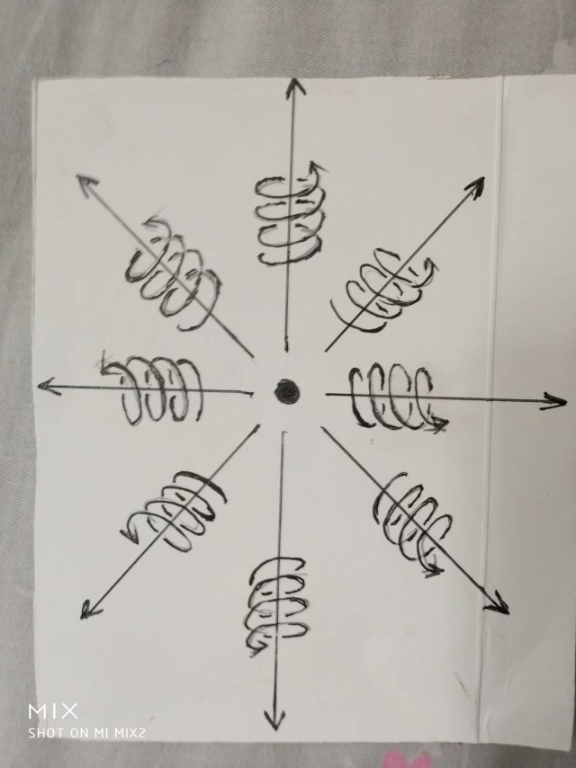

我们知道，圆柱状螺旋式运动是旋转运动和旋转平面垂直方向直线运动的合成。物体周围空间的圆柱状螺旋式运动中直线运动部分是光速。

空间这种运动给我们观察者的感觉就是时间。所以，时间也可以说是光速直线运动的空间。时间的量与光速直线移动的空间位移量成正比。

当物体运动的时候，可以改变物体周围空间的辐射式、圆柱状螺旋运动形式。

当两个物体相对于我们观察者都是静止的，各自周围空间以圆柱螺旋式运动会碰到一起，从而引起周围空间运动形式的改变。

而万有引力就是物体周围空间运动状态的改变程度。

实际上，电磁力和核力也是物体周围圆柱状螺旋式运动空间的运动形式的变化。

在圆柱状螺旋式运动空间中，旋转部分就是磁场，物体静止时候，周围空间的旋转运动部分会相互抵消，所以，静止电荷周围不是没有磁场，而是相互抵消了，这个可以用高斯定理严格证明。

空间的圆柱状螺旋式运动，是旋转运动和旋转平面垂直方向直线运动的合成，我们知道旋转运动有一个指向中心的加速度，而这个由空间本身运动产生的加速度就是万有引力场。

圆柱状螺旋式运动中的直线运动部分是电场。

当电场矢量的数量不变，方向变化而产生的变量就是核力场。

两个物体靠近，周围的圆柱状螺旋式运动会相互干扰，使圆柱状螺旋式运动发生改变。

我们要认识到：

一个物体的磁场的旋转运动，只能干扰另一个物体周围的磁场旋转运动，表现为物体之间的磁场力相互作用。旋转运动不会干扰直线运动。

一个物体周围的电场直线运动只能干扰另一个物体周围空间的电场的直线运动，直线运动不会干扰旋转运动。

所以，宇宙中有4种场，相应的有4种力的相互作用。

宇宙中，无论什么东西，之间的相互作用都表现为4种场、4种力。其本质就是物体周围空间圆柱状螺旋式运动造成的。

我们生活的空间为什么过任意一点可以作三条相互垂直的线段【我们称为三维空间】？原因就是空间时刻以圆柱状螺旋式运动造成的。

我们可以设想，一维空间是来自于空间直线运动，二维空间是来自于空间以圆周运动，三维空间是来自于空间平面内圆周运动再叠加平面垂直方向直线运动----结果是圆柱状螺旋式运动。

所以，空间时刻以圆柱状螺旋式在运动，是宇宙的核心秘密，认识到这一点，对人类至关重要。

二十，张祥前和网友关于时间、空间、统一场论的讨论

作者张祥前交流微信zhxq1105974776

网友txxhh8257说：

张先生好！

您的理论（指张祥前创立的统一场论，百度张祥前统一场论6版可以搜到）始终给人耳目一新的感觉。

我有几个疑问请教：

1， 真空

真空是什么，与空间的关系

【张祥前回复：真空 = 空间】

2， 量子效应

宇宙是由质点和它周围空间构成的，不存在第三种与之并存的东西，一切物理现象都是我们对质点在空间中【或者是质点周围空间本身】运动的一种描述。

那么如何解释量子效应

【张祥前回复：量子效应开始起源于光子辐射的能量是不连续的，电荷是某一个值的整数倍。统一场论中认为粒子带的电荷是粒子的质量随时间变化程度，当质量随粒子的运动速度变化，时间也会随速度而同步变化。

所以，粒子的电荷不随速度变化，统一场论可以证明量子效应是光速不变决定的，是时空同一化方程（就是时间的本质是空间光速运动）决定的，量子效应可以用统一场论来解释，这个问题比较复杂，以后我会陆续发文章来阐述这个问题。】

3 ，时间

A ，宇宙的时间没有开始没有结束，这个判断是否依赖于观察者？

【张祥前回复：依赖观察者】

B，你说， 时间不能够脱离观测者而独立存在。

你又说，如果没有人，空间照样存在，但是，没有人的话，时间是不存在的。

这两个论断，时间的概念是否一致，是否相互矛盾？

【张祥前回复：这个两个时间概念是一样的，没有矛盾。

因为时间是观察者对自己周围空间光速运动的一种感受，所以，只要空间存在和观察者存在，观察者就一定有时间感觉，时间就一定存在着。

时间是人的感觉，不是真实存在的东西，说宇宙时间开始于150亿年前肯定是荒唐的，说时间以后会消失也是荒唐的。

没有观察者的话，以前，以后，现在也都失去了意义】

4 ，宇宙中质点和空间为什么要运动。

宇宙中任何一个物体周围空间三维垂直【意思是过空间中任意一点可以作三条相互垂直的直线】状态中的几何点（我们把空间分割成许多小块，每一个小块叫几何点），相对于我们观测者一定要运动

这儿强调了结论，一定要动，却未回答"为什么"。

【张祥前回复：因为物理上的运动状态是我们人对几何空间中三维垂直状态的描述，所以，空间的三维垂直状态等价于运动状态。

物理上的运动状态和几何上垂直状态是同一个现象，我们观察者从物理角度和从几何角度观察而出现了不同的结果。】

5 ，质量

若质量是引力场产生的，且是可变的（也就是质量是可变的)，那么如何表述一个物体本身具有的物质的量。

【张祥前回复：一个物体的质量可以反映这个物体对周围空间的影响程度，物体一切物理性质都可以用物体在空间中的运动程度来或者物体周围空间本身的运动程度来描述。

质量的变化是物体相对于某一个观察者运动发生的，相对于观察者静止的物体的质量不会发生变化，也就是说质量首先是速度的函数，然后才是时间的函数。

在统一场论中，质量反映了物体周围空间几何点光速运动位移的条数。】

6 ，为什么没有超光速？

你解释为：一个物体相对于我们观察者以光速运动，这个物体所在的空间沿运动方向上的空间长度变成了零。

由时间 = 空间长度除以速度可知，空间长度是零，速度一定，运动的时间自然就不需要了，有没有比不需要时间更快的运动？显然没有。

这段话比较费解。光线从地球发射到月球上是否需要时间？

【张祥前回复：相对于我们观察者，光线运动到月球需要时间，对于另一个观察者坐着光速飞行器随光线一同运动，这个观察者在光速飞行器内所做的一切运动在我们观察者看来是不需要时间的，另外，从地球飞到月球，光速飞行器内部的观察者是感觉不到这个运动过程的。

只有相对于我们观察者运动时候没有超光速，比如两个宇宙飞船都以0.8倍光速沿着一条直线相对运动，在我们看来他们之间的相对速度是1.6倍光速。】

8， 动能公式

动能公式普遍成立，但统一场论并未显式地导出动能公式。

【张祥前回复：统一场论6版中详细的推导出动能公式】，统一场论导出的动能公式和相对论、牛顿力学是一样的】

9 ，你的统一场论能量方程，

是从统一场论动量方程p = m’c = mc√(1-
v²/c²)两边乘以光速c而得到了统一场论能量方程：

e  = m’c² = mc²√(1- v²/c²)

对动量乘以光速得到能量，这是什么道理？

【张祥前回复：既然动量公式p = m’c = mc√(1-
v²/c²)可以成立，等式二边乘以光速仍然可以成立，从量纲上看

m’c² = mc²√(1- v²/c²)是能量公式，所以这个 m’c² = mc²√(1-
v²/c²)的方程可以认为是能量方程，这个和相对论的静止能量、动能公式是相同的，区别在于统一场论认为物体静止能量m’c²等于运动能量
mc²√(1- v²/c²)，而动能只是mc²减去mc²√(1- v²/c²)】。

10 ，不需要时间的运动。

加质量运动就是一个物体质量随时间变化需要时间，当质量变化到零时候，可以从某一个速度突然的达到光速，随着这个物体一同运动的观测者发现自己从某一个地方突然的消失，在另

一个地方突然的出现，这个运动过程不需要时间。

这个似乎有问题。即使是光子以光速运动，从地球到月球也是需要时间的。

【张祥前回复：随光线一同运动的观察者感觉不到这个运动过程】

张先生好！我继续请教。

1， 质量

一般意义，质量是指含有物质的量的多少。

比如一餐吃两个馒头饱了，不能因为馒头在运动或者不动，而变成需要吃三个或者一个就饱了。

(比如这两个馒头含有物质的量也不会在"瞬间消失的移动"中增多或减少，但受到的力与平时不一样。)

但力学上，包括统一场论【百度张祥前统一场论6版可以搜到】，都把“质量”与引力(包括惯性)挂钩等价。

(牛顿力学里，影响惯性的质量与含有物质的量是相同的。)

我的问题是：统一场论里，如何清晰准确地表示这两个馒头真正含有物质的量。

(黄金如果在加速运动中增多了，那么多出来的黄金从哪儿来呢?)

不知我表达清楚没有。

【张祥前回复：一般意义上物体具有的质量是含物质的多少，这个对质量的定义不是错误的，而是不精确。

统一场论中认为物体质量大小是物体对周围空间影响的程度，也可以说使周围空间发生运动的运动程度。

黄金如果在加速运动中质量增加了，这个表示我们观察者对运动黄金质量的测量比静止黄金测量的质量增加了，但是，随黄金一同运动的观察者发现黄金质量没有变化。

黄金的质量的本质只是我们观察者对黄金描述的一种性质而已，物体具有质量这种性质就是物体周围空间光速运动产生的。

质量不能等同于物质，如同人的身高体重只能反映这个人的几何、物理性质，不能和这个人等同。】

2， 瞬间移动

如果我们有能力在整个银河系内建立瞬间移动网络，那么从银河系一端瞬移到直径另一端，

是不花时间，还是要花n年的时间。

如果移动的是自己，会在这"过程中"感觉到时间的流逝否。

【张祥前回复：外星人飞碟以光速运动的时候，我们观察者发现他们每走30万公里需要一秒时间，但是，飞碟内部的外星人认为是0秒，外星人飞碟质量变化时候需要时间，长途飞行不需要时间。飞行过程中外星人感觉不到时间流逝。

外星人飞碟飞行的基本原理是：任何物体的静止质量逐渐减少，一旦减到零的时候，不需要再加速，就一定的突然以光速相对于我们运动起来。】

3 ，观察者与时间

观察者是否只有人类。

如果是的话，那么"宇宙的时间"这个提法是否妥当。

或者，宇宙自己可以观察自己否？

【张祥前回复：观察者不光是人，一切感知、能够描述者都可以是观察者，时间可以说是观察者对周围空间光速运动的一种感受。

宇宙自己可以观察自己否？------不可以的。】

4， 全球大规模无导线导电

这个是利用纯净的真空来导电，...，用电器只要连着闭合线圈就可以接收电能，线圈断开就没有电能了，这样方便控制。

-------------------------

这个很早前从尼古拉·特斯拉相关信息中有所耳闻。十分可惜。

制造这样的线圈，不管是发送电能还是接收电能很难吗？

【张祥前回复：这个不难，如果国家聘请我，或者有人投资，5年内可以成功。】

5 ，名与实

东南西北是名，相对位置是实。名可以改变，实不变。

比如甲乙丙三座山峰，甲在乙的南边，丙在乙的北边。

可以不管东南西北（人为命名，可以命名为其它名称)，但这甲乙丙这种分布状态却是确定的。

【张祥前回复：地球上的东、西、南、北、中都是依靠我们人来参考的，相对于我们人而言的，地球上一个地方是东边还是西边，需要以我们人来参考，没有人的话，这个地方是在东边还是在西边，是无法确定的。

同样的道理，时间的先后，也是以我们人为参考点，没有人的话，排除了我们人，就没有参考点，所以时间就就没有先后。】

6 ，关于运动

运动的描述不能够脱离观测者。对同一客体的描述与感受可以因人(主观，主体)而异，比如对颜色的感觉。

却不是客观运动不能够脱离观测者。老虎捕猎时未必有几个人看见了。

运动本身，与对运动的描述和感觉不同的两个概念。

就像宇宙本身，和我们对宇宙的描述一样，是不同的概念。

参见下面一个问题。

7 ，宇宙中所有的运动都是相对于我们人而言的，一旦没有了人，宇宙给我们的景象就像照相机照相的一个定格镜头，而不是不存在。

-----------

这段话特别费解，与统一场论基本描述相互矛盾，难以自洽。

若没有人，宇宙就是定格的镜头，宇宙被"冻住"了，那么这个定格的东东，如何演化出能观察宇宙的人类来。

引用统一场论的描述：

1， 宇宙是由质点和它周围空间构成的。

2， 合理的看法是空间几何点以柱状螺旋式在运动。

3 ，除质点和空间外，...-----都是质点在空间中运动相对于我们观测者所表现出的一种性质。

只有质点或空间在那儿动，先不管怎么动，才可能通过我们的观察，得出运动性质，这个性质有我们主观的成分。

但如果没有一个客观的运动变化，那么我们主观可以用观察和意念凭空制造出一个性质来？

性质 = 观察(主观)  作用于  运动(客观)

从这个公式可以看出：

a ，没有客观的运动，无论如何得不出一个性质。

b ，没有我们的观察，得不出我们需要的性质

c， 主观不同，性质也不同。比如地球绕太阳转，或者太阳东升西落。

d ，客观不同，性质也不同。比太阳是红色的，月亮是白色的。

【张祥前回复：运动现象的存在，需要客观条件---空间和物体的存在，需要主观条件----观察者存在，这两个条件缺一不可，如果没有我们观察者去观察，宇宙可以肯定的是存在着物体和空间，至于物体和空间是运动还是静止，都是不能确定的，认定物体和空间是在运动还是静止的都需要观察者存在。

运动状态可以说是我们观察者对物体在空间中位置不断的肯定---否定---肯定---否定---肯定---否定---这么一个过程。】

8 ，能否简洁地描述，如何衡量一个理论体系的正确程度和先进性。

【张祥前回复：在物理理论方面，你提出一个新的理论首先可以自圆其说，还可以涵盖老的理论，可以用数学推导出老的理论，可以解释老的理论，可能否定老的理论中部分内容，可以预言一些老的理论不能预言的新东西，那你这个理论就是一个正确、有用的理论，单纯的实验验证不能确定这个理论是否正确，因为现在实验造假太厉害了。

如果你提出一个理论完全否定了相对论、牛顿力学、麦克斯韦电磁方程，说不用解释相对论、牛顿力学、麦克斯韦电磁方程，可以断定你的新理论没有任何价值。】

张先生好。

我仍然有很多疑问。

1 ，观察者

空间，质点，观察者，是统一场论的三驾马车。

前两者的存在是这个理论的公理前提；

那么如何定义观察者？什么是观察者？

动物可以否？植物可以否？石头可以否？

宇宙为何不能成为自己的观察者？

【张祥前回复：能够感觉到运动，并且可以对这种因为运动而引起的感觉做出描述，就可以是观察者】

2 ，人类与意识

人类与意识是否一直存在？

【张祥前回复：意识是人头脑中带电粒子对周围空间扰动的形式，意识以空间波动形式而存在，意识的本质是空间的运动形式，不是一个具体的东西，即使人死了，意识作为空间波动形式永远存在在空间中。意识的波动速度为光速。

地球上人类存在只是一段时间，宇宙中人类和意识是永远存在着。人的核心是人的意识，如同电脑软件，身体只是载体，如同电脑的硬件。

由于人的核心是意识，而意识是空间的波动形式，永远存在于空间中，所以人在宇宙中是轮回的，死亡只是一个阶段的转换。】

若是，是否可以作为公理(前提)的一部分。

【张祥前回复：可以的，比如统一场论（百度统一场论6版可以搜到）就认为一切物理概念来自于我们人对物体在空间中运动或者物体周围空间本身运动的描述。】

如果不是，是否有可能研究出人类存续了多久？

如果不是,假设人类存续了1亿年，那么"10亿年前"的说法成立否。

【张祥前回复：只要人类存在着一天，就可以说"10亿年前"或者说"10亿年之后"】

3， 时间标定

一般而言，时间标定，若不特别说明，都是以当下为基准的。

比如今天，昨天，后天，一万年前...。

说"人类存在以前",说这个话的时候，人类自然是存在的，那么以当下为基准往前计数，应该是可以的。

那么一直往前，在某个点上与人类诞生相重合，再往前标定，是可以呢，还是不可以？

是否没有必要去否定大家都知道的约定俗成。

【张祥前回复："人类存在以前"这句话逻辑没有错误，因为没有否定地球上存在过人类。如果说在“没有人类之前”这句话在逻辑上讲不通。因为你已经否定了地球上存在过人类，既然地球上没有过人类，很自然的就没有人类之前。】

4， 确定还是不确定

a ...,至于物体和空间是运动还是静止，都是不能确定的...

b ，宇宙中所有的运动都是相对于我们人而言的，一旦没有了人，宇宙给我们的景象就像照相机照相的一个定格镜头

-------------

定格的镜头，这是确定呢，还是不确定。

【张祥前回复：不能确定，也不能否定，因为确定和否定都需要人来表述，没有了人，怎么确定、怎么否定。

以上a,b所说的意思是：没有了人类这个观察者，宇宙唯一可以确定的是存在着物体和空间，别的统统不存在。至于宇宙是否在运动或者是静止，不能确定的。】

5 ，运动与否定之否定

运动可以说是我们观察者对物体在空间中位置不断的肯定---否定---肯定---否定---肯定---否定---这么一个过程。

--------------

是因为：

物体自己在空间中位置不断变化，我们的观察仅仅是反映了这么一个变化呢，

还是：

我们的观察才导致了物体在空间中位置的不断变化？

【张祥前回复：又需要物体在空间中位置变化，又需要观察者的观察和描述，缺一不可。】

二十一，张祥前给物质下的定义

作者张祥前交流微信zhxq1105974776

我们常说我们所生活的宇宙是由物质组成的，那这个物质到底是什么？是怎么定义的？我们这里给物质下一个严格的定义：

脱离我们观察者的描述，仍然存在的东西就是物质。

有的东西，不需要我们观察者的描述，不管有没有我们观察者，仍然存在着，这个东西就是物质。

宇宙中真实存在的是物体和它周围空间，不存在第三种与之并存的东西，其余都是我们观察者对物体运动和空间本身运动的描述。

物质由什么东西构成的？从以上的看法中，我们知道，物质是由空间和物体组成的。

物体和空间不能相互转化，物质世界，或者说宇宙，是由物体和空间这两个基本的东西构成，物体和空间像是砖瓦，构成了宇宙这个大厦。

宇宙是二元的，如果物体和空间能够相互转化，宇宙应该是一元的。

对于生活在这个自然界中，我们所观察到的各种东西和各种现象那可真是五花八门、形形色色复杂到了极点。但是仔细一分析，可以把他们分为两大类，一类为物、一类为事。

| 像我们眼前的一座山、一棵树、一个人、一条河……这都是物；树的生长，人的思想，河水的流动，……这些都是事。物是产生事的根源，事是物的表现，通过事我们可以认识物，事是依据物而存在的。没有物就不会有事，反过来未必是正确的，没有事，物却照样存在。
|   我们在认识这个世界时，应该要严格区分什么是物，什么是事。遗憾的是，我们有很多物理学家（不单单是普通人）常犯这方面的错误，他们常常把某些事说成是物，或者对某些事不了解，简单地认为是一种特殊的物质所起的作用。

比如，历史上人们对热的认识，十七世纪，人们认为热是物体里所含的一种特殊的物质，称之为" 热质" 。甚至有的学者认为" 热质" 是守恒的，物体所得到的" 热质" 总是另一些物体所失去的而不是凭空产生的，现代人们很清楚" 热质" 说是错误的。

热现象只不过是物体内分子无规则运动的结果，热只是一种现象而已，它属于"事" 的范畴，把它看则是物，这就是典型的" 事" 和" 物" 不分的思想。

很多人认为意识是构成宇宙的一部分，甚至有人认为宇宙是由意识构成的，意识构成了一切，这种看法是错误的。

意识是人大脑中带电粒子、带电离子的一种运动形式，意识的本质属于事，是一种运动形式，不是物体，意识也可以说是信息。意识的量可以用信息的量来表示，意识你不能用体积、质量、能量这些概念来表示。

科学家发现，一个人的大脑中意识信息量，大约是8000亿GB，相对于100亿不内存80GB的智能手机内存。

但是，很多人走向了另一个极端，认为人的意识与宇宙、物质世界没有关系，这种看法其实也是错误的。

物理上的运动状态，需要我们观察者用意识去描述，运动如果没有我们观察者去描述，没有意识参与其中，是不存在运动状态的。

物理上所说的运动状态，就是我们观察者对物体所在的空间位置不断的肯定---否定---肯定---否定---肯定---这么一个认识过程。

没有我们观察者，是不存在运动状态，不过，我们要注意一点，也不存在静止状态。

没有我们观察者或者没有指明哪一个观察者，讨论运动或者静止，是没有意义的。

由于物理上的概念：时间、质量、电荷、场、力、能量、动量、光速----等，都是我们观察者用意识去描述物体在空间中运动或者物体周围空间运动的结果，所以，当我们去探索时间、质量、电荷、场、力、能量、动量、光速这些物理概念的本质问题时候，我们一定要把人的意识考虑进去，那些认为物理概念不应该与人的意识搅和在一起，是彻底错误的，这种错误使人永远无法真正的理解时间、质量、电荷、场、力、能量、动量、光速----等本质问题。

人的意识在物理概念形成中，占据了重要地位，但是，我们要明白，物理概念来自于人对物体运动和空间运动的描述，而时间、质量、电荷、场、力、能量、动量、光速这些物理概念只是人对于物体、空间运动的描述而已。

很多人隐约的知道人的意识的重要性，但是，不能正确的理顺意识和物理概念之间的关系。

以上有关" 事" 和" 物" 的讨论有助于我们搞清楚物理概念是如何产生的。物理学是借助物理概念而展开的。

物理学刚开始处于萌芽时也好，发展到今天也好，所有的物理概念无非是人们对自己所处的物质世界的认识结果。

我们是怎么认识这个物质世界的呢？首先是通过感觉，感觉到这个我们所处的物质世界的各种现象，然后我们大脑把这些感觉加以分析、概括，最后再形成物理概念。

比如，人们用眼睛看到花草的红红绿绿，天空的湛蓝，人们再用头脑一加工，便有了颜色的概念。人们用皮肤去感觉冰的冷、开水的烫，大脑再一加工，便有了温度的概念。

某处有物体振动，引发周围的空气发生振动，我们用耳朵去感觉到这空气的振动，我们再去用大脑这么一分析，这样又有了声音的概念。

还有我们躺在床上，闭上眼睛、不去看、不去听，但却老是觉得一个东西在流逝，这样人们又有了时间的概念。

通过以上所列举的例子，可以得出这样的看法，我们所处的物质世界的某些现象给了我们人某些感觉，我们大脑对这些感觉加以分析，概括这样便产生了物理概念。这样说来，物理概念来自于我们对自己的某种感觉的描述。

为了进一步搞清楚物理概念是如何产生的，接下来。我们应当分析物质世界的各种现象是如何引起了我们人的各种感觉的。

颜色是不同波长电磁波刺激我们眼睛的结果。

热是无规则运动的分子猛烈撞击我们皮肤，我们才有热的感觉。 声音是空气中出现的纵波击到我们的耳膜，我们才有了声音的感觉。

……………… 总结以上的分析，物质世界以不同的方式运动引起我们人的各种感觉，我们人对这些不同的感觉加以分析，概括便形成了不同的物理概念。

这样说来物理概念不能脱离我们人而独立的存在着，说明白点，物理概念只是人对自己感觉的一种描述（当然人的这些感觉并非凭空产生的，而是客观存在的东西刺激了我们人）

读者很多人对这个看法可能会反感，或者转不开弯子，下面通过几个例子使读者比较容易理解这些看法。 设想在一个房间里，正放着优美的C
D 唱碟，人们常不加思索地认为只要这C
D 唱机开着，而不管我们人在不在场，这个声音总会是客观的存在着。

仔细地分析一下，房间里有声音时，房间的空气便出现一股纵波，没有声音便没有纵波，可见有声音没有声音的区别只是房间里空气的位置不一样。没有人在房间里去感觉，那里会有声音的概念。

声音的概念是不能脱离我们人而独立地存在的，有声音比起没有声音并没有多出一件什么东西，所以你不能把声音看则是一个像物体那样具体存在的东西，声音只是一个现象而已。

在前面讨论的" 事"
" 和" 物" 中，声音明显属于" 事" 的范畴。 颜色也是类似的，我们看到眼前的花草的红红绿绿是电磁波经花草反射到我们眼球的结果，这个颜色的概念同样不能脱离我们人而独立地存在着。

物体颜色的不同只是物体反射不同波长电磁波的原因造成。颜色不是物体自身的性质，而是由物体照射到它的各种波长的光的反射和吸收决定的。

这个原理是牛顿最早发现的，历史上甚至现代有很多人固执地认为物体所呈现的颜色是物体固有的属性、与外界无关。比如德国诗人歌德就曾写文章以非常激情的语言叫人们不要相信牛顿的理论，但牛顿在光学中有关颜色理论的正确性实践证明无须怀疑。

温度的概念起源于外界分子无规则地撞击我们人皮肤的程度，当然脱离了人也是不能独立存在的。 时间的概念与我们人的感觉也有关系，但时间的概念，比较抽象，在后面我们要单独详细地加以分析。

既然物理概念是人的一种感觉，脱离我们人而不能独立的存在，在前面有关"事" 和" 物" 的讨论中，物理概念明显属于" 事" 的范畴，因而它不能像" 物" 那样客观的存在着，它的存在有它的虚假性。 物理世界的存在有着虚假性。

但是，并非所有的东西它的存在都是虚假的，比如空间、各式各样的物体，它们总是客观地存在着，脱离我们人它们照样存在，它们不管我们人能否感觉到它们，它们总是客观地存在着。

然而，空间、物体（也可称为物质点）这些可以看作是几何概念，在前面讨论的" 事" 和" 物" 中，它们明显属于" 物" 的范畴，它们不依赖于我们人的感觉而客观独立的存在着。

至此我们明白，物理概念来自于我们人的感觉，脱离我们人而不能独立地存在，而某些几何概念，比如空间、物质点不依赖于我们人的感觉而客观、独立地存在着。

对此，物理学的开山鼻祖伽利略早就说过：我们五官感觉到的世界它的存在是虚假的，而真实存在的却是它背后的几何世界…… 这些用几何概念描述的空间、物体和我们对感觉描述出来的物理概念有什么关系呢？

对这些，本人有着这样的看法：

宇宙中真正存在的只有物体和它周围的空间，不存在第三种形态能与之并存的东西，一切物理现象只不过是物体在空间中运动或者物体周围空间运动的一种表现而已。

这些现象如能引起我们人的感觉, 我们对这些感觉加以分析, 概括便形成了物理概念。

前面有关" 事" 和" 物" 的讨论应该使我们明白只有物体和它周围空间是物，客观存在的，而物理概念，比如声音、颜色、热、力、速度……等只不过是现象，是物的一种运动表现，属于" 事" 的范畴。

我们一定要严格地区分它们，不能把" 事" 简单地看作是一种特殊的物质。

以上基本原理又叫物理世界存在的虚假性定义, 它直接否定了" 场" 是一种特殊的物质，场要么是空间、要么是物质点！

值得注意的是该基本原理还否定了时间是客观独立于我们人而存在的，是构成宇宙的基本要素。

时间也只是一种现象，属于事情的范围，不是物，脱离了我们人而不能独立地存在着，这一点可能绝大多数读者都不会相信。

以上基本原理提到了：一切物理现象都是物体在它周围空间运动或者物体周围空间本身运动形成的。

物体在它周围空间运动是什么运动？只是机械运动而已。

这个原理如果是正确的话，可见机械运动虽是简单的运动，

各种复杂的现象，以及各种复杂的运动，比如电力、磁力这都是由机械运动构成的。非但如此，对于有些物理现象，我们还不太了解他们的本质，比如质量、电荷,各种场……这些本质上人们还不太清楚，但我们可以肯定的是它是由物质点在它周围空间如何运动而形成的。

这个基本原理还告诉我们，像时间、场、速度、能量、质量、电荷、力-----这些物理概念都是物质点在空间中如何如何运动形成的，运动刺激了我们观察者的感觉，我们观察者通过感觉而描述出来的，因而他们的存在是有虚假性的。

有了以上的看法，不管什么物理概念（物体和空间除外），我们都可以认为是某个东西在空间中相对于我们如何运动所形成的。

质量是某某在空间中如何运动形成的。

电荷是某某在空间中如何运动形成的。

能量是某某在空间中如何运动形成的。

力是是某某在空间中如何运动形成的。

---------- 场比较特殊，它是由空间本身运动变化形成的。

时间也比较特殊，它是由我们观察者周围空间以光速向四周发散运动给我们的一种感觉。

既然在物理学中这些基本概念都是物质点在空间中相对我们观察者运动形成的。

设想有另一个观察者随着物质点一同运动，在这个观察者测量不到这些物理量的，这就意味着这些物理量都具有相对性，都应该随着参考系的改变而改变。 这样我们把相对论中相对性原理扩展到所有的物理现象中。

对于象光速、电荷为什么相对于不同的惯性系有相同的数值，这个原因是光速、电荷相对于不同的惯性系相应的有不同的表现，结果导致在不同的惯性系光速和电荷相应的有相同的数值。

二十二，世界到底是唯心的还是唯物的？

作者张祥前交流微信zhxq1105974776

唯心主义、唯物主义是哲学两大基本派别之一，二者是对立的。

唯心主义主张人的精神、意识或理念为第一性，物质为第二性，即物质依赖于人的意识而存在，物质是意识的产物。

唯心主义有客观唯心主义和主观唯心主义。客观唯心主义认为，在现实世界之外独立存在着一种客观精神，它是世界的本原，世界万物是由它产生(派生)出来的。

主观唯心主义是把人的主观精神(意识、观念等)看作世界的本原，世界上的一切只存在主观精神之中，是主观精神的产物。

简单讲主观唯心主义认为客观世界是不存在的，一切只是人的想象和描述。

马克思认为世界是物质构成的，一切都是物质的表现。马克思认为物质是世界构成的本源，物质不依赖于人的意识可以独立存在，但是，物质可以被人认识和描述。马克思是典型的唯物主义。

而黑格尔认为世界是唯心的，世界上一切都是绝对精神构成的。

西方大部分哲学家、科学家都是唯心主义。唯心主义的代表人物有：

柏拉图：世界是理念的影子。

笛卡尔：我思故我在【我存在的原因就是因为我在思考】、

慧能：不是风动不是幡动，仁者心动【风吹着幡在动，其实不是幡在动，也不是风在动，而是我的心在动】。

朱熹：理生万物

贝克莱：存在即被感知，物是观念的集合

孟子：万物皆备于我

普罗泰格拉：人是万物的尺度

康德：理性为自然界立法

辨证唯心主义黑格尔：存在即合理

费希特：世界是自我创造的非我

马赫：物是感觉的复合

王守仁：心外无物心外无理

王阳明：破山中贼易，破心中贼难

陆九渊，宇宙即是吾心，吾心即是真理

康德，有两样东西我越是思考便越是心存敬畏，我们头上的灿烂星空，我们心中的道德法则。

主观唯心主义代表：陆九渊，王阳明，贝克莱

客观唯心主义代表：柏拉图，黑格尔，朱熹

世界到底是唯物的还是唯心的？历史上长期争议不断。物理学的发展，特别是统一场论【百度统一场论6版可以搜到】，可以使人类在这个问题认识上深入一步。

统一场论认为：世界是物体和空间组成，其余统统不存在，其余只是我们观察者对物体运动和空间本身运动的描述。

统一场论认为人的意识是人头脑中带电粒子对周围空间的扰动形式，人意识本质是物体粒子的运动形式，不是真实存在的物体。

乍一看，统一场论支持了唯物主义观点，因为统一场论支持了世界是由物体和空间组成，但是，统一场论有的观点与唯物主义背道而驰的。

比如，统一场论认为人的核心是意识这种运动形式，而人身体是次要的，人身体如同电脑的硬件，比如鼠标、服务器、键盘，而意识如同电脑软件，比如程序。

在高度发达的外星球，外星人身体老了，就用场扫描记录下人意识信息，再将这些意识信息数字化，储存在电脑中，然后再把这些电脑中意识从电脑中调出来，安装在某一个生物体上，使人复活。

外星人等这个身体老了，故伎重演，再一次换年轻身体，这样，外星人不断的换身体保持长生不老，他们是不会怀疑人身体是次要的、而意识是人的核心。

统一场论也支持人的生命轮回观点，由于宇宙时间和空间都是无穷大，任何运动形式都存在着，而且反复的上演，所以，我这种意识的运动形式会在宇宙中反复出现，这个就是人生命轮回的理论基础。

而唯物主义认为人身体是核心，而人意识是次要的，唯物主义是反对人生命轮回的，他们认为人死如灯灭。

对于时间的本质，统一场论认为时间是观察者周围空间光速运动给观察者的感觉，简单讲时间是人的感觉，没有人，时间不存在的，这个明显支撑唯心主义观点。

有人说人在地球上出现不过几百万年，而地球存在已经有了46亿年了，在没有人之前，地球时间怎么算？

“没有人之前”是一个病句，没有了人，就不存在没有人之前或者之后，时间的先后以我们人来定义，没有人就没有先后和现在，这个如同地球上的东西南北，是以我们人为参考来定义的，没有了人，地球上就不存在东西南北。

统一场论认为宇宙没有开始没有结束，现在流行的宇宙大爆炸理论是错误的。

统一场论还认为一切物理是我们观察者对几何世界的描述，物理现象都是来自于人的描述，像质量、电荷、场、光速、力、能量、动量----这些物理概念的本质都是我们观察者的一种描述，都是我们观察者对物体在空间中运动和物体周围空间本身运动描述出来的。

对于运动现象，统一场论也是站在唯心主义一边。统一场论认为物理上的运动状态是我们观察者对物体在空间中位置不断的肯定---否定---肯定---否定---肯定—这么个认识过程。

简单说运动状态是我们的一种描述，没有观察者的描述，物理上的运动状态是不存在的，当然，没有观察者的描述，物理上的静止状态也是不存在的。

可以肯定的是宇宙仍然存在着物体和空间，宇宙像一个照相机的定格镜头，别的统统不能确定。

对于物体运动的背后原因，统一场论认为物体运动是空间本身运动造成的，而空间的运动原因是我们观察者对空间的三维垂直状态的描述，空间的三维垂直状态和物理上的运动状态有着对应关系。

统一场论这些新观点，可以使我们很好的理解相对论中出现的让现在物理学家感到困惑的问题。

比如，光子的波粒二相性，现在物理学认为光子既是波又是粒子。

统一场论认为光子是加速运动负电荷产生了反引力场，抵消了电子静止质量和电荷，使电子激发起来，以光速静止在空间中随空间一同运动，而空间时刻以光速相当于我们观察者运动，光子的波动性是空间本身的波动。

相对论认为光速运动的物体沿着运动方向空间长度为零，一个物体长度为零，体积也是为零，相对论这个观点让人无法理解。

统一场论认为，和这个物体相对静止观察者发现这个物体长度没有变化，所谓的长度为零只是一种相对论运动效应，由于运动是我们观察者的描述，这样我们就不感到困惑了。

对于相对论中物体以光速运动静止质量为零，电荷为零，也可以理解为质量、电荷都是粒子周围空间的一种运动效应，而这种运动效应需要我们观察者的描述，最终也是会随着物体运动而发生变化。

在量子力学中，电子几乎成了通灵大师，他几乎可以同时出现在两个位置上，这在我们的现实世界中几乎是不可想象的，我们不可能同时既在北京又在上海，这在逻辑上就存在问题。

就在很多物理学家确信这不是现实的时候，1995年美国科学家成功的将6个铍离子达到了这种状态。于是，量子论几乎要把我们逼疯了，科学家很难信息自己所观察的现象。

解释量子力学这些困难现象最终都要人类明白----物理上的运动状态是人描述的结果，时间是人的感觉，同时不是绝对的。

在量子力学中的量子纠缠现象，一直困扰着现在的物理学家，量子纠缠说一对光子，我们把它拆分成两个光子，我们对其中一个光子测量，会立即影响到另一个光子，不管这两个光子相隔有多远，两个光子信息的传递可以超光速。

但是，相对论认为没有超光速出现。所以，现代物理学认为相对论和量子力学是矛盾的。

统一场论指出，物体周围的空间本身可以运动，一个外星人飞船以光速相对于我们运动，飞船内部空间长度为零，飞船内部时间为无穷大，长度为零，就可以出现无穷大的速度。所以说，相对论和量子力学的矛盾只是表面现象。

统一场论还认为宇宙任意一处空间可以无限存储信息，可以存储整个宇宙以前、以后所有的信息，这个可以使我们从局部了解整体提供了理论根据。

空间隐含了自然界核心秘密，人类只有认识空间，才可以理解自然界最核心本质。

我们说，宇宙是由物质构成的，那么，我们有一个问题，物质是宇宙中最重要的吗？

有没有必物质更加重要的？我认为，物质的运动形式比物质本身更加重要。信息的本质就是物质的运动形式，可以说，在宇宙中，比物质更加重要的是信息。

什么是物质？物质的定义是什么？

本文认为，脱离我们观察者的描述，仍然存在的东西就是物质。

统一场论【百度统一场论6版可以搜到】认为：在宇宙中，有两样东西，脱离了我们观察者的描述，仍然存在，一个是物体，二是空间。

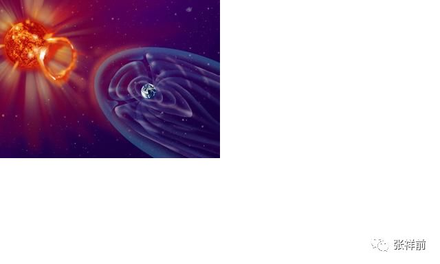

宇宙中除了物体和空间真实存在着，其余统统不存在，其余都是我们人对物体运动和空间本身运动的描述。

按照以上物质的定义，物质是由空间和物体组成的。统一场论认为物体和空间不能相互转化，宇宙是二元的。但是，物体可以相互转化，一种物体可以从一种形式转化为另一种形式，只是总量是守恒的，不会凭空消失，不会凭空出现。

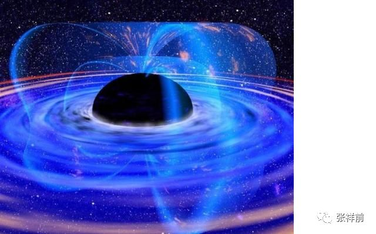

我们人类对物质世界的认识，是通过各种感觉器官感觉到这个我们所处的物质世界的各种现象，然后我们大脑把这些感觉加以分析、概括，最后再形成认识观念。

物质世界的各种东西和各种现象那可真是五花八门、形形色色复杂到了极点。但是仔细一分析，可以把他们分为两大类，一类为物、一类为事。

像我们眼前的一座山、一棵树、一个人、一条河……这都是物；树的生长，人的思想，河水的流动，……这些都是事。

物是产生事的根源，事是物运动造成的，也是物的表现，通过事我们可以认识物，事是依据物而存在的。没有物就不会有事，反过来未必是正确的，没有事物却照样存在，这个原因是我们观察者还没有认识到这个物。

信息属于事的范畴。

很多人认为宇宙是有物体和空间、时间组成的。时间的本质是什么？场的本质是什么？

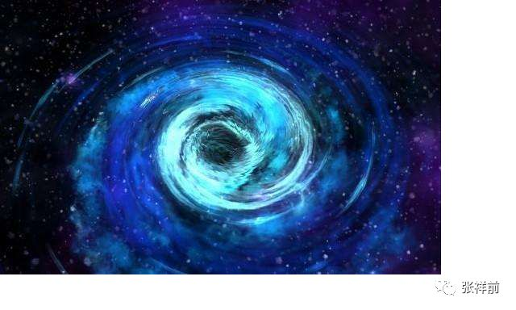

统一场论认为宇宙中任何物体【包括我们观察者的身体】周围空间都以物体为中心、以光速发散运动，空间这种运动给我们观察者的感觉就是时间。

时间属于事的范围，不是真实存在的，脱离了我们观察者，时间是不存在的。所以，宇宙真实存在的是物体和空间，宇宙是由空间和物体组成，时间是我们描述出来的，时间不是宇宙构成的基本要素。

场的本质就是我们观察者对物体周围空间本身运动的描述。不同的场是我们观察者对空间不同运动形式的描述。

现在主流科学家说的暗物质、暗能量、引力子、上帝粒子其实是不存在的，和以前的以太一样，都是人们杜撰出来的。

由于空间本身时刻在运动，运动的空间可以传播物体之间的万有引力和电磁场力、核力等。传播的方式很简单，通过空间运动形式的变化和扭曲，就可以彻底物体之间的相互作用力。

万有引力、电磁场力等，可以说就是空间运动状态的变化扭曲形式。

能量、质量、电荷·····都是物体在空间中运动或者物体周围空间本身运动程度，经过我们观察者的描述而产生的物理概念。

有人认为宇宙、物质由能量构成，这种看法是错误的。

不但能量、电荷、质量、力····等物理概念是我们观察者描述出来的，就是运动状态也是我们观察者的描述，如果没有我们观察者，运动状态是不存在的。

以上话容易引起人们的误解，让人们认为物体、空间运动的原因是人描述出来的。实际是运动状态和静止状态都需要我们观察者的描述，没有我们观察者的描述，没有运动状态和静止状态，那究竟是什么状态，只能说不能确定。

至于物质运动的原因，统一场论认为，一切物体的运动原因都是空间本身运动造成的。空间为什么要运动，统一场论给出的解释是：

物理上的运动状态和几何的垂直状态是等价的，空间的三维垂直状态，经过我们观察者的描述就是物理上的运动状态。

本文把我们认识的对象分成两大部分，一部分是物质【简称物，由空间和物体组成】，另一部分是物质的运动形式【简称事，由时间、质量、电荷、力、动量、速度、场、能量····等构成】。

传统的观念认为物质是第一位，物质的运动形式是第二位。但是，统一场论认为物质的运动形式是第一位，物质是第二位。

物质之间的区别，关键是物质内部运动形式和外部空间的运动形式不一样。

现代科学已经发现，所有的元素，都可以看成是中子、质子、电子数目不一样，不同元素可以相互转化。

人的思想意识可以看成是人大脑中带电粒子的运动形式不一样。人的身体只是一个载体。

在发达的外星球，当一个人老了，身体不行了，他们用人工场扫描这个人大脑内部思想意识信息，记录下来，用数字表示，然后把这个思想意识安装到一个人工制造年轻人身体上。

这样，他们保留人的思想意识，换年轻人身体，来达到长生不老。从这个过程来看，人的身体是次要的，人的身体可以替换的。人的思想意识才是一个人的核心，思想意识是不能替换的，而人的思想意识本质是一种运动形式。

事物之间的区别是运动形式不同，运动形式才是宇宙的核心，物质在宇宙中的地位是次要的。

二十三，宇宙中那些是无中生有出现的？

作者张祥前交流微信zhxq1105974776

在人类的认识中，有些东西本来就存在着，有些东西是无中生有诞生的但是。那些东西是本来就存在着，那些东西是无中生有诞生的？

这个问题很难回答，很多人甚至认为没有一个最终的答案。

我是安徽庐江县一个农民，1985年夏天曾经去一个高度发达的外星球旅行了一个月的时间。不但了解了他们日常生活情况，还掌握了他们许多超前的科学技术和宇宙奥秘。

有网友问，外星人是怎么看待这个问题的？

从他们对宇宙的认识来看，宇宙中没有真正无中生有诞生出来的东西，宇宙中一切都是反复的在演变，
相互转化，从一种形式变化到另一个形式。你看到一个新东西的出现，只不过是从另外一个东西转化而来的。

所谓的无中生有，只是人的认识上的局限，你认为的一个新东西其实是从另一个东西转化而来的，只是你不知道而已。

人类对这种相互转化的认识，意义重大。你一旦识破了一个东西是另一个东西转化而来的，就可以对这个东西有了一个更深刻的认识。

比如，人类对磁场的认识，以前，人们都认为电场和磁场是相互独立的，后来，人们发现磁场是电场变化而来的，就是当一个电荷相对于我们观察者静止的时候，在周围空间中只是产生了静电场，当这个电荷相对于我们观察者以某一个速度运动的时候，可以引起运动速度垂直方向电场的变化，这个变化的部分我们就可以用磁场这个词来表达。

我从外星人那里得到了信息，场是物体周围空间以圆柱状运动形成的，场的本质就是运动变化的空间。

变化的引力场可以产生电磁场和核力场，人类一旦搞清楚电磁场和引力场相互转化问题，对人类的影响是巨大的。

现在很多人在搞永动机，搞无中生有的自由能源、真空能量，我认为永远都不会成功，原因就是人类一直利用的是不同能量的相互转化，而不是无中生有的能量。

你认为的无中生有，只是你不知道其中演化的过程而已。

外星人对宇宙有一个基本认识：

宇宙是由物体和空间构成的，不存在第三种与之并存的东西，其余的都是我们观察者对物体运动和空间运动的描述。

现在主流科学界认为宇宙诞生于150亿年前的一次大爆炸，那一次大爆炸，不但诞生了物体，还诞生了空间和时间。

如果这种看法是正确的，那宇宙就是无中生有的诞生出来的。

外星人明确的说，宇宙任何物体【包括我们观察者的身体】周围空间时刻以光速向四周发散运动，空间这种运动给我们人的感觉就是时间，时间不是真实存在的东西，时间只是人的感觉，没有人，就不存在时间。

你一旦明白了时间的本质，就知道宇宙大爆炸理论是胡扯八道，因为时间只是人的感觉，没有人，不存在时间，也就是没有开始、没有结束。

宇宙没有开始，没有结束，这意味着宇宙本来就存在。

但是，宇宙局部地方星系会因为万有引力而相互吸引，而逐渐收缩，最后塌陷形成致密黑洞类的星球，这些黑洞类星球在遇到别的星系会发生猛烈爆炸而产生新的星云，最后，星云又逐渐收缩，演化到最后又变成了黑洞之类的天体。

宇宙中的天体就这么反复的在演变过程中。

宇宙大爆炸理论诞生于西方，其是受到了西方的神创论的影响，西方一直相信宇宙是上帝创造的，宇宙及其一切都是一个万能的神创造的，遗憾的是，这个与事实不符，宇宙本来就存在着，只是在反复的演变而已。

可能有人问：生命是无中生有的吗？

我们地球上的生命起源于10亿年前的一次闪电，闪电击中了空气中氮气，产生了早期的复杂大分子坠入水中，后慢慢进化成现在各种复杂的生命。生命也是来自于别的物质的转化。

有人认为人的意识是无中生有的。这种看法也是错误的。

生命诞生后，生命体需要生存，需要避害趋利，需要控制自己的行为，逐渐的诞生了能够控制自己的行为的意识活动，后来，随着进化，意识越来越复杂，越高级。

人的意识本质是人大脑中带电粒子、带电离子的一种运动形式，我们不要把它看得很神秘。

宗教、科学、文化、艺术，我们都可以探讨其起源，都可以看成是人的一种思考和行为，你认为是无中生有的出现的。

但是，你一旦明白，人其实也是在宇宙中反复的出现，宗教、文化、科学、艺术作为人创造出来的东西，你就不会认同宗教、科学、文化、艺术这些是无中生有出现的。

我在宇宙中出现也不是无中生有诞生出来的，宇宙存在的时间是无穷大的，宇宙在这个漫长的演化中，诞生了无数个我。

我可以分为两部分，一部分是我的身体，一部分是我的思想意识，思想意识是人大脑中带电粒子的运动形式，我的身体可以死亡、腐烂，但是，我的思想意识作为一种运动形式，可以在宇宙中反复上演。

也可以说，宇宙可以把任何运动形式给表现出来，无论我的思想意识是多么的复杂、多么的怪异，都包含在宇宙的运动形式中，宇宙总是能够表现出来，而是反复的表现出来。

所以，我看似是偶然来到这个世界，其实是必然的，你来到这个世界，只是早迟的事情而已。因为宇宙要把一切运动形式给表现出来。

二十四，宇宙、人类社会发展的背后是什么东西在主宰着？

作者张祥前交流微信zhxq1105974776

宇宙时刻在运行，人类社会时刻在发展，宇宙的运行有自己的规律，人类社会也是按照一种定的模式在发展。

8大行星围绕太阳有序的旋转，银河系也是在旋转，原子内部，电子也是在绕核高速旋转运动，宇宙万物都是在有序的运行着，人们经常会奇怪，主宰宇宙有序运行的背后规律是什么？

很多人面对茫茫的宇宙，都情不自禁的认为，宇宙万物一定有一个像上帝那样的主宰，在支配着宇宙万物的运行。

人类社会的发展，又是受到什么支配着？

本人认为，宇宙万物的运行，人类社会的发展，都是受到同一个东西的支配，这个东西就是-----美感。

如果说人类追求美，追求美好的事物，而引领着人类社会前进，可以说支配人类社会发展的就是美。可是，宇宙万物的运行，你说是受到美感的支配，这个是不是有点牵强附会？

我们要认识到，宇宙万物的运动状态是我们人描述出来的，没有我们人这个观察者，宇宙中不存在所谓的运动状态【注意，没有我们观察者，同样不存在静止状态】。

宇宙的运动形式千变万化，宇宙中爆炸等混乱状态是短暂的，能够促使宇宙中物质长期平稳运行的，其运动形式必然让我们具有美的感觉。

要把这些问题说清楚，我们必须要深入的认识到什么是美。

美是来自于人的感觉，美是人对事物存在、演化具有和谐、力度的一种感觉。

我们觉得一个事物、一个东西和谐美妙，我们就说是美，还有，一个事物、一个东西让我们觉得带劲、有力，我们也说是美。

和谐是从我们理性出发而具有的感觉，而力度是我们从直觉出发而具有的感觉。

| 和谐和力度虽然都是美感，二者是有区别和矛盾的。
| 和谐主要是静态的美，力度是运动的美。

男人更多表现出力度、阳刚的美，而女人更多表现出和谐、柔性的美。

和谐的美是一种共振，如同波的叠加，是一种旋转的美，是一种相互缠绕的活动。

| 而力度是一种进攻和破坏的美，是力量的美，表现为直接和力度。
| 美既有静态的美，也有运动的美，运动的美表现为活力。静态的美主要表现在外表面，而运动的美主要是表现为内在的。

美具有力量，可以促使事物发生运动和变化，并且在运动变化中又把美给表现出来。

智慧也是一种美，我们说美妙，这个妙字就是一种智慧的表现。

美可以使人愉悦、幸福。人类为了追求愉悦、幸福，很自然的追求美，人类在追求美的过程中，引领着社会向一个正确的方向前进。换句话说来说，美支配、主宰着社会的发展方向。

我们说宇宙的运行规律也是受美的支配，实际上是宇宙的运动规律和社会的发展有相似的地方。宇宙万物的运行基本规律都是相同或者相似的。

美产生的根源是什么？答案是：性选择。

人类的长期进化中，男女之间相互的性吸引力、性选择起着重要作用。

女人身材丰满，皮肤细腻白皙是一种美，让男人喜欢，而男人身材魁梧，五官匀称是一种美，讨女人喜欢，久而久之，这个由性选择产生的标准就是一种美的标准。

这种美的标准可以让异性容易、准确选择到身体和心理都健康的性伴侣，淘汰那些身体内心不健康的异性。

这种标准还逐渐渗透到人的意识中，也逐渐渗透到人创造的艺术和文化中。

西方文化艺术突出的体现这一点。西方绘画中的女性丰满肥硕，充满诱惑与力量，而中国古代绘画中女人都是病态的。

中国长期的封建社会，注重和谐的美，而西方的长期文化宣扬的是力度的美。

中国几千年封建传统文化强调了万恶淫为首，把xing和yin荡等同起来，强烈的抵触xing因素渗透到文化和艺术中。所以，中国的文化是扭曲的、病态的，过于强调和谐美，缺少直接、力度、性感、阳刚之美。

社会中的人追求美，也是为了生存、进化，通过xing选择，美好的保留，丑陋的淘汰。

而宇宙中，天体的运行体现美，也是独立生存的结果，比如，一个行星围绕太阳运行，可以长期独立生存下去，如果不围绕太阳旋转运行，就要被太阳吞并，变成了太阳的一份子，自己的独立性消失了。

美就是和谐和力度合成，宇宙包括人类社会，一切都是以螺旋式在运动，螺旋式运动是旋转运动和旋转平面垂直方向的直线运动的合成，和谐相当于螺旋式中的旋转运动，力度相当于螺旋式中直线运动部分。

所以，说到底，美就是我们对螺旋运动形式的描述。而宇宙、社会一切一切都是以螺旋式在运动。

人认识美，追求美，追求真正的美，对人生、对社会是非常的重要，使社会的发展朝着正确的方向前进。

二十五，宇宙有没有意识？

作者张祥前交流微信zhxq1105974776

人有自己的想法，人会思考，能够对外界认识，可以同别人交流，这些都是因为人具有意识。

最近，有网友问我，“宇宙有没有意识，宇宙能不能和我们每一个人交流，宇宙会不会思考，宇宙有没有认知？”

一般人想都不想，就认为宇宙没有意识，不会思考，没有认知，不可能与我们交流。

要认真的回答以上问题是不容易的。我们不但要搞清楚意识的本质是什么，还要认识宇宙最核心的一些秘密。

人的意识是人大脑中带电粒子、离子的运动形成的，可以看成是物质的运动形式。

我们认识的世界的三大要素是物质、能量和信息，信息的本质就是物质的运动形式，所以，人的意识就是物质一种运动形式，属于信息范畴。

对于物质，我们可以用质量、重量、体积来描述，对于信息，我们不能用质量、重量、体积来描述，只能用信息的量来表示。

目前，科学家发现，人的大脑大约有8000亿GB的内存，相对于100部80GB内存的智能手机。

一句话，人的意识是信息，是一种运动形式。

宇宙从物质层面来讲，是由两件东西构成的，一个是物体，另一个是空间，其余统统都是不存在的，其余都是我们人对物体和空间本身运动的描述。

一个物体存在于空间中，可以对周围空间施加影响，使空间本身运动起来，使周围空间的位置发生变化。

一处空间，突然出现一个物体，会造成周围空间的位置发生变化。也就是，物体可以影响周围空间的位置。

万有引力、电磁场力、核力都是这种作用原理。所谓的物体相互直接接触，都是表面现象，一旦深入研究，人类会发现，没有直接接触，都是隔着空间在相互作用。

就是物体首先影响周围空间，进而影响周围空间中存在的物体的位置，令这个物体发生运动、或者具有运动的趋势。

物体对周围空间施加影响，令周围空间发生波动，这种波动以光速向四周传播，还可以把信息通过空间波动向四周以光速传播开来。

物体存在与空间中，对空间中释放信息，具有以下特点：

以光速均匀的向四面八方释放。

向任意一处空间释放的信息都是相同的。

这个如同人用手机打电话给朋友，向四面八方所发送的信息内容都是一样的，他的朋友在广州接到电话，和在北京接到电话，内容都是相同，不会因为在北京接到的是一个内容，在广州接到的是另外一个内容。

由于空间中信息以光速在传播，从相对论我们知道，光速运动三维空间沿运动方向空间长度缩短为零，所以，空间中信息虽然看起来是以光速在传播，由于存在了零距离，实际上空间中光速传播的信息是二维的，可以出现在宇宙任何地方。

从时间角度来看，时间的本质是我们观察者对周围空间光速运动给人造成的一种感觉的描述，所以，没有人，就没有时间，没有人的话，一亿年前、一亿年后，所有的信息都重叠在空间一个点上。

所以，可以说宇宙任何一处空间，包含了这个宇宙以前、现在、以后所有的信息。

人的意识是信息组成的，而宇宙包含了所有的信息，可以说宇宙同样具有意识。

如果我们问，宇宙具有意识，能不能和我们每一个人对话、交流？

有些特异功能人，比如一些杰出的预言家，就是因为捕捉了空间中隐藏的信息，而做出预言的。

所以说，宇宙可以和我们每一个人对话，但是，对于普通人，只是偶尔的能够和宇宙对话，大部分情况下，无法和宇宙交流、对话，也不能从宇宙空间里获得有用的信息。

想和宇宙对话，不是一个容易的事情，很多人世间的高人，想获得宇宙空间中隐藏的信息，结果只是获得了一些没有用处的杂乱信息。如同电视机没有信号输入，出现一片雪花点和噪声。

但是，在一些发达的外星球，外星人用他们的人工场扫描技术，可以从宇宙空间里获得有用的信息，借助他们强大、恐怖的数学能力，从而对未来做出比较正确的预言。

宇宙虽然具有意识，而且意识的量是无穷大，但是，和人的意识有很大的不同，人的意识有很强的自主性和目的性，而宇宙如同一个巨大容器，只是储存了所有的信息和物质。

所谓的人和宇宙对话，只是人从宇宙仓库容器里调出一些信息而已。

那么，宇宙本身能不能像人那样认知、思考，宇宙的意识能不能进化？

宇宙从整体来看，包含了所有的物质和无穷大的空间，包括了所有的信息。从时间是我们人的感觉----没有人就没有时间来看，宇宙没有开始，没有结束。

所以说，宇宙从整体来看，宇宙包含了全部所有的意识信息，不会再进化了，也不会向人那样去认知、思考。宇宙只是一个容器，容纳了所有的物质和信息而已。

如果整体宇宙能够认识、思考，使意识不断进化，表明宇宙的意识还在扩大，那宇宙就没有包含所有的信息，这个与宇宙包含所有的信息是矛盾的。

但是，我们要认识到，宇宙局部地区，物质和信息的确是在变化和相互转化中，而我们人总是在观察着局部宇宙，所以，从宇宙局部来看，宇宙可以像人那样意识在不断变化和进化。

但是，我们还要深刻的认识到，宇宙中一切的运动，都需要我们观察者的描述。

宇宙中一切物体运动的原因，牛顿认为是力造成的，后来，人们认为是能量造成的，本人认为是物体所在空间运动造成的，空间运动令物体运动。

但是，空间本身运动是什么原因呢？

原来，空间的三维垂直状态，经过我们观察者的描述就是物理上的运动状态。几何上的空间三维垂直状态和物理上的运动状态是等价的，是宇宙同一个现象我们观察者从不同角度出发，形成的不同看法。

没有我们观察者的描述，不存在运动状态和静止状态，宇宙的信息将非常的单调，宇宙的很多信息，还需要我们观察者去认识，才能够表现出来。

宇宙的核心秘密、最深的奥秘，与我们观察者的描述有关，如果踢开我们观察者，不考虑我们观察者与宇宙的关系，我们只能肤浅的认识宇宙，我们一旦想深刻的认识宇宙，必须要要明白宇宙那些是我们人描述的，那些是客观存在的。

二十六，为什么7大行星逆时针自转，金星相反？

作者张祥前交流微信zhxq1105974776

在太阳系中，八大行星都围绕太阳以逆时针在旋转，并且都有自转，其中7大行星都是逆时针在自转，唯独金星比较吊蛋，是顺时针在自转？

是什么原因造成了金星以顺时针自转？

现代科学界很多人猜测，金星本来也是逆时针在自转，历史上受到一个外来星球猛烈的碰撞，才改变了自转的方向。

通过数学模型计算的结果，很难支持这种猜测，这种猜测目前没有得到证实，金星为什么是顺时针自转的问题，仍然是一个悬而未决的问题。

本人在1985年夏天去一个高度发达的外星球旅行了一个月时间，从他们那里获得了很多超前的科学知识和宇宙最核心的奥秘。

原来，物体之间产生的万有引力，是物体周围空间逆时针旋转造成的。如下图，地球和太阳周围空间都以逆时针旋转，相互接触部分由于运动方向相反而相互抵消，这样太阳和地球之间的空间距离逐渐减少，而具有相互靠近的趋势，表现为太阳和地球有相互吸引力的结果。

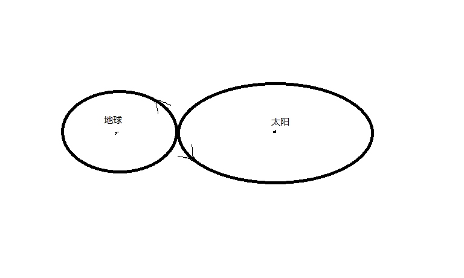

太阳对周围八大行星产生的万有引力，是太阳令周围空间逆时针旋转造成的，八大行星处于太阳周围空间中，受到空间这种运动的影响而以逆时针围绕太阳旋转运动。

大约在50亿年前，太阳系来源于一个类似于黑洞的致密星球，后发生猛烈爆炸，产生了许多尘埃状星云。

由于万有引力的本质就是物体周围空间以逆时针旋转运动，造成了这些星际尘埃在相互靠近又缓慢的以逆时针旋转，形成一个逆时针旋转的巨大的原始星云团。

原始星云团的尘埃因为万有引力而相互吸引，不断收缩，收缩使得星云越转越快，并逐渐变扁。大家看到冰上舞蹈家，旋转身体的时候，猛然收缩双臂，由于角动量守恒，身体旋转速度突然加快。同样的原因，原始星云由于收缩，旋转速度加快。

今天八大行星围绕太阳旋转几乎在一个平面上，原因就是太阳系开始形成的时候，是原始星云团在一个平面上的逆时针旋转运动的原因。

原始星云团旋转速度加快到一定程度后，就撕裂了，星云尘埃之间的万有引力和电荷吸引力不足于支撑旋转的离心力。

变成了中心一个巨大的旋转星云团，周围散落一些小的星云团一边围绕中心公转，一边以逆时针自转，这个自转的原因和星云团开始旋转的原因是一样的，都是万有引力造成的物体周围空间逆时针旋转的原因。

后来，中心大的原始星云团进一步收缩形成了太阳，周围许多小的星云团由于收缩，形成了行星和围绕行星的卫星。

金星的顺时针自转可能是这个时候形成的，在这个阶段，原始星云团撕裂，分成了许多个，不是每一个都是以逆时针在旋转，其中可能存在了一两个，以顺时针在旋转。这个就像流水产生的漩涡，在一个以逆时针旋转的大漩涡附近，可能会出现一两个顺时针旋转的小漩涡。原因是早期许多漩涡团碰撞、摩擦等相互作用造成的。

有人会问：既然万有引力是物体周围空间逆时针旋转造成的，太阳对八大行星的万有引力，令八大行星围绕太阳逆时针旋转是百分之百的吗？

这个实际上还受到了行星的初始运动状态决定的，如果一个行星以足够大的运动速度围绕太阳旋转运动，这个行星只要保持足够的动能，既可以以逆时针、也可以以顺时针围绕太阳长期旋转下去。

在宇宙中，一切自由存在于空间中的物体，总是以螺旋式在运动，没有例外。

螺旋式运动就是直线运动和旋转运动的合成。简单的说，宇宙一切物体总是空间中旋转加直线运动。就是空间本身，也是以圆柱状螺旋式在运动。

二十七，解释光的双缝干涉实验

作者张祥前交流微信zhxq1105974776

20世纪，物理学家们遇到一个难题：光到底是波还是粒子？一部分人认为光是波。另一部分人认为光是粒子，像一粒粒光滑的小球。

这个问题一直到现在仍然没有解决，现在物理界只好认为光即是粒子又是波，称为波粒二像性。

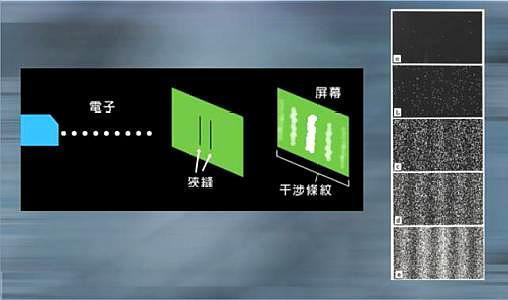

光的著名实验是光的双缝实验。

光的双缝实验就是在一块隔板上开两条缝，让光从一侧穿过，观察另一侧的光斑，你会发现光会像水波纹一样形成一道斑马线，这个原因是光从两条缝穿过之后，像水波一样互相干涉影响。这个实验告诉我们，光具有波动性。

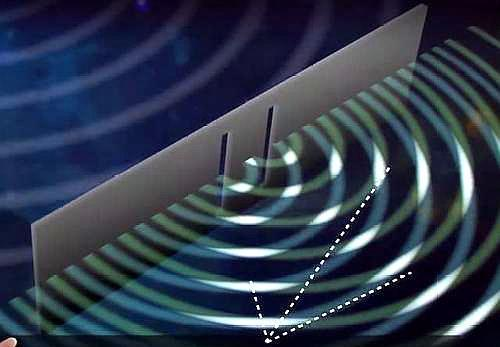

在1961年，科学家进行了双缝干涉实验，用一个光子发射装置对准双缝发射，假如光是由粒子组成，那当他通过双缝后呈现在屏幕上时就一定会留下两道杠。

假如光是由波组成，那么屏幕上就会留下如斑马线一样的多道条纹，根据波动理论，波与波之间因为相位相同会相互叠加干涉，会形成斑马线状。

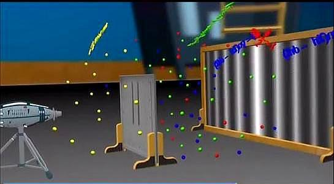

第一次实验把光子发射装置对着双缝发射，一粒一粒的发射出去，结果得到的是一条斑马线。

但是光子分明是一粒一粒的发射出去的，每一个独立光子穿过缝隙并不会出现水波一样的干扰，为什么还会这样呢？难道是光子在穿过缝隙的时候分裂成了两个？

第二次实验把光子发射装置切换到点射模式，虽然每次只发射一个光子，但是经过一段时间的积累还是出现了干涉条纹。

明明两个狭缝只有一个狭缝有光子，那这个光子是在和谁进行干涉呢？难道他是在和自己干涉吗？

科学家梅里在1974年再次实验，这次他在屏幕前加工了两个摄像头，一左一右排开，为了观察光子是否真的分裂了，结果光子一个一个地穿过，然而就在这个时候真正诡异的事情发生了，他发现屏幕上的图案不知什么时候变成两道杠，若不用摄像头，结果依然是斑马线。

用摄像头光就是粒子，不用摄像头光就是波？实验结果取决于有没有摄像头？

科学界用电子同样能够做出以上实验，所以，以上实验又叫电子双缝干涉实验。

电子、光子双缝干涉实验能够引起人类困惑的有两点：

1，波动的干涉条纹是波动相位的叠加，单个光子、电子经过狭缝，和谁相位相同？和谁干涉？自己和自己干涉？光到底是波还是粒子？

2，观察者的观察为什么能够影响电子、光子的运动状态？

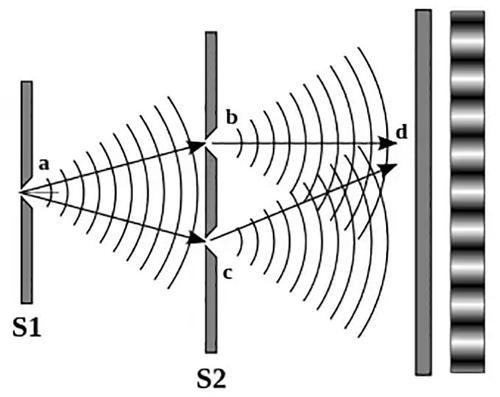

本人提出的统一场论【百度 统一场论6版可以搜到】，可以给出解释。

统一场论认为，宇宙中任何物体【包括我们观察者的身体】相对于我们静止时候，周围空间都以光速辐射式波动运动，空间这种运动给我们观察者的感觉就是时间。

当这个物体相对于我们运动的时候，会影响空间这种光速波动运动。

统一场论认为运动分三种，

1，物体在空间中相对于我们观察者运动，

2，相对于我们观察者，物体周围空间本身的运动。

3，前2种运动的合成。

宇宙中任何物体相对于我们观察者静止时候，周围空间都以光速向周围波动，而光的本质就是静止在空间中的静止质量为零的激发电子，被空间这种运动带着向外跑的。

光的波动性是因为空间本身的波动，而光的粒子性是因为光是电子因为电荷、质量消失而激发起来，转化为光子。

比如，枪子弹可以用枪发射出去，也可以把枪子弹放在皮带运输机上，让皮带运输机带着运动的。

激发电子像枪子弹，而空间像皮带运输机，激发电子静止于空间中被空间的运动带着向外跑，而形成了光现象。

物体周围空间本身的运动有点特殊，空间本身时刻以柱状螺旋式在运动，它就是以这一种运动形式，没有别的运动形式。但是，由于我们观察者的运动或者观察角度不一样，会观察出空间许多种运动方式。

光的相位干涉，实际上是空间本身位置的干涉，另外，光子生活时间和我们不一样，光子的时间似乎凝固了，我们感觉两个光子不同时间、从不同狭缝中穿过，但是，在光子世界中，光子认为是同时的，还有我们看到不同地方的两个光子，对于光子世界来说可能是相同地方。

反过来，我们把相同地方的两个光子，光子世界看到是不同地方。

一句话，光子所的世界和我们世界的世界、空间位置都是不一样的。

人们把空间想象为静止的，而空间是时刻光速运动的，这种矛盾才是让人感到困惑的背后原因。

至于第2个原因，我们应该意识到，人们的观察不只是会影响粒子的运动状态和空间本身的运动状态，而是与粒子、空间的运动状态密切相关。

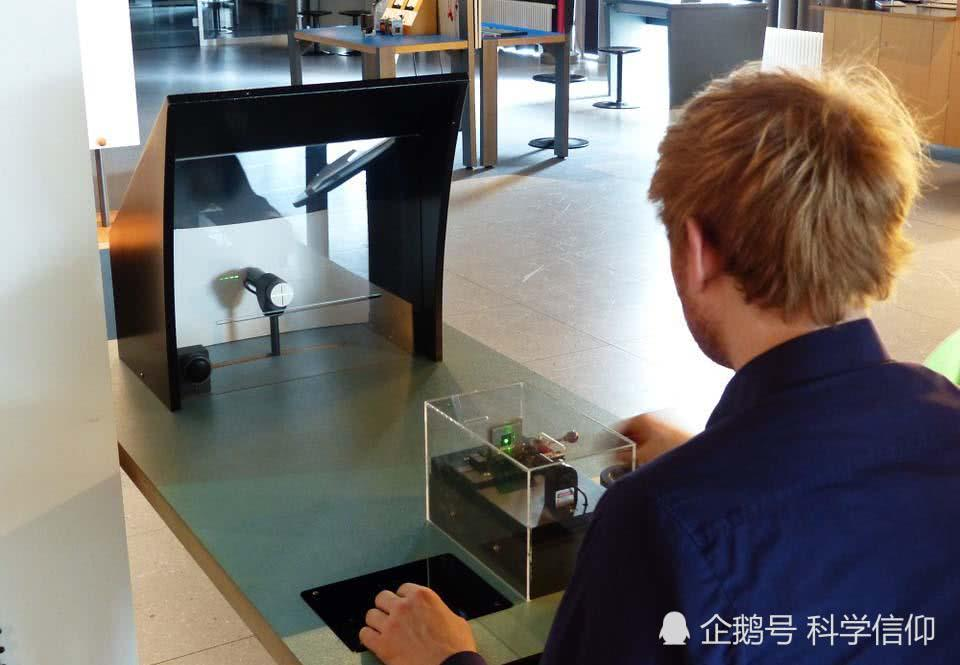

在统一场论中，明确的指出，物体和空间的的运动状态是人描述出来的，没有观察者的话，不存在运动状态，不过，我们需要注意的是，没有观察者，同样不存在静止状态。

如果没有观察者，或者不指明哪一个观察者，你问一个粒子，或者空间本身，处于什么状态，是没有意义的。如果一定要问，只能说处于不确定状态。

物体的运动，其本质就是我们观察者对物体在空间中某一个位置的肯定---否定---肯定—否定---肯定---否定····这么一个过程而已，

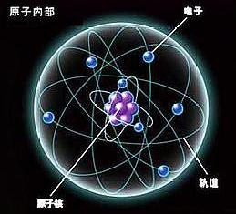

二十八，揭秘宇宙的无限之谜

作者张祥前交流微信zhxq1105974776

当你夜晚仰望天空的时候，浩瀚的宇宙空间总是让人沮丧。

我在1985年【那时候我19岁】夏天去一个高度发达的外星球生活了一个月时间。

不但了解到外星人日常生活情况，还掌握了他们许多科学技术。

我们地球人认为宇宙是由空间、时间、物体组成。有人认为宇宙是由空间、物体、时间、能量构成。甚至有人认为宇宙是由空间、时间、物体、能量、暗物质、暗能量、场等构成。

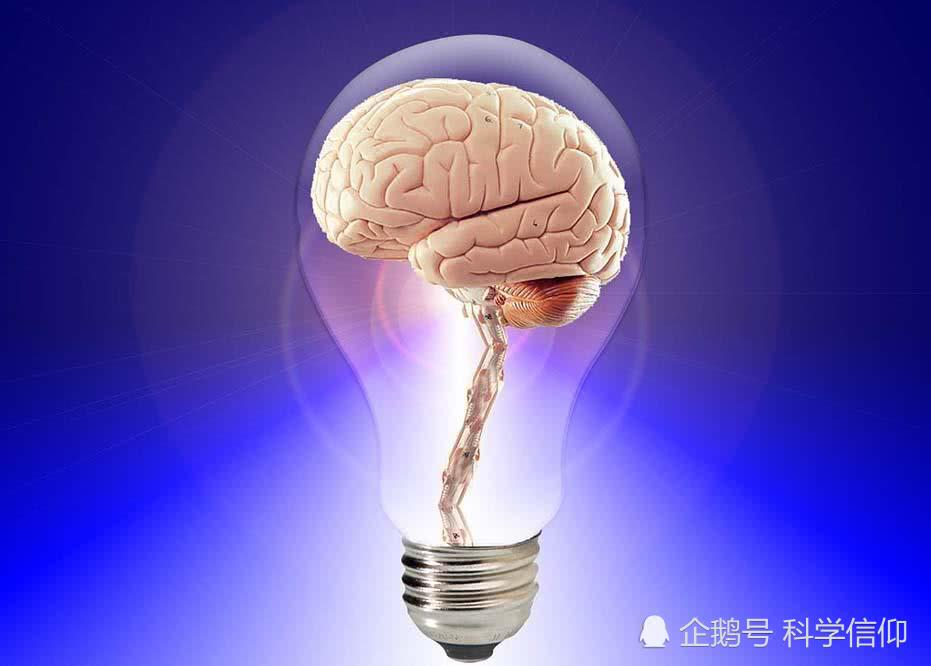

外星人认为宇宙由物体和周围空间构成的，其余统统不存在。

除了物体和空间，不存在第三种与之并存的东西，其余只是我们观察者对物体运动和空间本身运动的描述。

物质就是由空间和物体组成。

像我们眼前的一棵树、一条河是“物”，树的生长、河水的流动是“事”。宇宙中，物体和空间是“物”，其余的像时间、位移、质量、电荷、场、能量、速度----都是“事”，是“物”相对于我们观测者运动所表现出的一种性质。

暗物质、暗能量、上帝粒子、引力子、弦、以太在外星人眼里，统统是不存在的，都是我们地球人编造出来的。

我们地球人认为宇宙产生于150亿年前的一次大爆炸，外星人认为，宇宙没有开始，没有结束，宇宙的时间是无穷大的。

时间的本质是什么？我们地球人还没有一个严格的、统一的定义。

外星人认为：宇宙任何物体【包括观察者的身体】周围空间都以物体为中心、以光速向四周发散运动，

空间这种运动给我们观察者的感觉就是时间。时间只是人的感觉，没有观察者就没有时间。

所以，说宇宙开始于150亿年前的一次大爆炸是荒唐的。而且，宇宙中到处时间流逝是不一样的，宇宙有的地方过了一年，有的地方已经过了一亿年。你说宇宙起源于150亿年那一次大爆炸，是以哪一个星球计算的？

说宇宙年龄到底有多大是没有意义的，宇宙没有开始，没有结束。宇宙的年龄是无穷大的。

宇宙的无限性包括了宇宙空间的无限大，时间的无限长，物体的无限多，还包括信息的无穷多，还有运动无限持续下去。

宇宙时间无穷大，那宇宙空间到底有多大？

外星人认为宇宙空间是无穷大的。宇宙中的物体是有限的，无穷大宇宙空间中心存在着有限的物体。

宇宙中物体在空间中分布是洋葱状，一些发达的外星人发现隔着非常遥远的空间外又能够发现物体。

宇宙中物体的有限还是无限，外星人似乎不能最终确定，进一步明确宇宙中物体的分布需要观察者的观察能力的提高。

信息的本质是物质的运动形式。宇宙中包含的信息是无穷多的，不是有限的。

宇宙中任意一处空间，可以包含这个宇宙以前、现在、以后所有的信息。

宇宙的运动是永远持续下去，运动是无限的，不存在整个宇宙的运动静止那一天。

宇宙中一切运动都是空间本身的运动造成的。

空间的运动状态是我们观察者对空间的三维垂直状态的描述。

空间的三维垂直状态，经过我们观察者的描述。就是物理上的运动状态。是同一个现象，我们观察者从不同角度出发所描述的结果不同。

我们地球人观察发现宇宙是在膨胀的，并且以这个为根据，认为宇宙是大爆炸产生的。如果认为宇宙不是大爆炸产生的，那我们怎么解释宇宙空间为什么在膨胀？

外星人他们的解释是：宇宙中任何物体周围空间都以物体为中心、以光速向四周扩散运动。所以我们观察者觉得星球都在远离我们观察者，感觉到宇宙空间在膨胀。

但是，我们地球上的观察者为什么看不到太阳、月球等离开我们以光速远去呢？-------这个还要取决于太阳、月球的运动初始运动状态。

我们看到一个物体以什么方式在运动，物体周围空间运动是一个原因，物体初始运动状态也是一个原因。

那宇宙的背景辐射是怎么一回事情呢？

60年代，人们发现宇宙空间的背景辐射，科学家认为这个宇宙大爆炸遗留的背景辐射。外星人的解释是空间时刻在运动，物体存在于空间中，会对周围空间辐射能量，空间本身可以传递能量的，就是纯净的真空同样可以传递能量。空间背景的能量辐射，不是宇宙大爆炸原因。

我们地球上不知道电磁场、万有引力场的本质是什么？

外星人认为场是物体周围柱状螺旋式运动的空间。

他们给场的严格定义为：

我们把空间分割成许多小块，每一个小块叫几何点，相对于我们观察者，物体周围任意一个几何点的位置矢量是空间位置的函数，或者是时间的函数，这样的空间叫场。

宇宙万物为什么要运动？

我们地球人对这个问题没有统一的认识，外星人解释是因为物体周围空间运动造成的，那物体周围空间为什么要运动？

物理是我们对几何世界的描述，物理运动状态和几何垂直状态是对应的。

空间的三维垂直状态经过我们观察者的描述，就是物理上的运动状态。

处于三维垂直状态中的几何点其位置一定要运动变化，并且运动的方向和轨迹可以重新构成一个垂直状态。

外星人说，物理上的运动状态是我们观察者描述的，静止状态也是我们观察者描述的，如果没有观察者，谈论运动或者是静止是没有意义的。

这种观点我们地球人很难接受的。

外星人说我们生活的空间是右手螺旋式空间？

我们所生活的空间时刻以柱状螺旋式在运动，我们用右手握住柱状螺旋式运动的直线部分，并且大拇指指向直线运动方向，则四指环绕方向就是空间的旋转方向。

宇宙中有没有左手螺旋式空间呢？外星人回答是没有天然的，可能的只有人工制造。

宇宙空间为什么是三维的？

外星人认为宇宙空间三维是因为空间时刻以圆柱状螺旋式运动造成的，空间加时间只有三维，三维空间中任意一维以光速运动，就是时间。相对论中四维时空是错误的。

时空只有三维，是因为空间圆柱状螺旋式运动造成的。

如果空间以直线运动，空间应该是一维的，如果空间以圆周运动应该是二维的，空间时刻旋转运动，并且在旋转平面垂直方向上延伸运动，所以空间以柱状螺旋式运动，空间三维是因为空间时刻柱状螺旋式运动造成的。

外星人认为，宇宙一切，大到银河系，小到电子、质子，甚至空间本身，都在以螺旋式运动，原因是空间本身螺旋式运动造成的，物体运动的原因又是因为空间本身运动。

外星人为什么强调运动是人描述的？

如果没有观测者，或者不指明那一个观测者，时间、位移、力、质量---许多物理概念失去了意义。由于时间、位移、力、质量---这些物理概念来自于质点相对于我们观测者在空间中的运动，所以讲，脱离观测者（我们人）描述运动是没有意义的。

物理学中的运动状态从几何的角度看就是垂直状态，是同一个现象我们观测者从不同的角度【就是从物理角度和从几何角度】看出现不同的结果。运动状态是我们人对物体在空间中的位置不断肯定、否定、肯定、否定、肯定、否定---的结果.

没有观察者运动状态不存在的，当然静止状态也是不存在的。

外星人说任意一处空间可以无限存储信息。可以存储整个宇宙以前、现在、以后所有的信息。他们认为信息的本质就是物质的运动形式。地球上的预言家，就是因为空间捕捉空间中存在的信息，因为空间不但包含了现在、以前的信息，还包含了以后所有的信息。

我们地球人目前仍然不能肯定物体是非可以无限分下去吗？

他们的回答是这个要看物体内部能否释放空间。

关于物体的质量的本质是什么？

他们认为：

宇宙任何物体周围空间都以光速辐射式运动，质量反映了物体周围光速运动空间的运动程度。

就是在包围这个物体的曲面内空间的光速运动位移的条数。

那物体为什么带有正负电荷？

他们认为电荷是粒子周围空间柱状螺旋式运动造成的。

正电荷周围空间直线运动部分是以正电荷为中心，以光速向四周发散运动。旋转运动相对于我们观察者是逆时针。

负电荷周围空间直线运动部分是以负电荷为中心，以光速从四周无限远处向负电荷汇聚。旋转运动相对于我们观察者是顺时针。

那能量的本质是什么？

他们认为能量是相对于我们观察者物体在周围空间运动程度或者物体周围空间本身的运动程度。

他们是怎么解释光速为不变的？

空间相对于我们观察者时刻以光速辐射式的离开运动，光是静止于空间中被空间这种运动带着向外跑的。

运动的空间 =
时间，为了使这个等式成立，人们在时间前面乘上一个速度量纲，这个就是光速。

光速不变的原因是光速中的分子【运动的空间】和光速的分母【时间】，是同一个东西，是我们观察者用了两个名字来描述，生意光速中的分子-----运动的空间随光源的速度变化，光速的分母----时间将同步变化，结果光速不变。

二十九，相对论真正的强大威力还没有发挥出来

作者张祥前交流微信zhxq1105974776

1955年，爱因斯坦去世的时候，叫人把一个秘密埋在纽约的一个公园里，他要求人们100年后打开。

这个里面是一个什么秘密呢？本人从一个特殊的渠道【地外高等文明】了解到，这个里面是爱因斯坦的一个预言，他一生大部分时间其实不是在研究相对论，而是试图完成统一场论，就是想把电磁场和引力场统一起来。可惜他在统一场论上没有成功。

但是，他预言了相对论和统一场论将产生剧烈影响人类的应用【根本不是大家熟悉的与原子弹相关的质能方程】，认为100年后人类就可以实现他这个预言。

这到底是什么应用？爱因斯坦为什么要埋下这个秘密？

相对论有许多令人困惑的问题，有的问题爱因斯坦他自己也无法确定。但是，爱因斯坦坚信相对论和统一场论是前沿物理的方向。

现代前沿物理，主要的方向有量子力学、弦论、相对论和统一场论、引力子、标准模型、宇宙大爆炸和暗物质暗能量。

我从地外文明获得的信息来看，弦论、引力子、标准模型、宇宙大爆炸和暗物质暗能量都是彻底错误的。量子力学虽然基本上是正确的，但是，量子力学是人们对微观实验的总结，这种总结很大程度上是肤浅的经验，而不是严密的逻辑推理，够不成严谨的理论体系，所以，量子力学不是前沿物理的方向。

宇宙的核心秘密隐藏在空间、时间、运动里，人类必须要破译隐藏在空间、时间里的奥秘，必须要对运动有更加深刻的认识。而场的本质就是以圆柱状螺旋式运动的空间，所以，真正的物理前沿是相对论的升级产品----统一场论。

现在很多人在反对相对论，相对论对很多问题无法解释，相对论没有给时间、空间、光速、引力场、电磁场、核力场、质量、电荷、能量-----下一个精确的定义。

相对论核心依据是光速不变，但是，光速为什么不变，相对论没有给出解释。

相对论即使能够解释的问题，有很多在逻辑是也是混乱的，相对论可以说是一个半拉子工程，很多问题都没有解决，是一个不彻底的理论。

本人从地外文明获得的统一场论【百度统一场论6版
可以搜到】，给时间、空间、光速、引力场、电磁场、核力场、质量、电荷、能量-----下一个精确的定义。

统一场论用时间的物理定义和时空同一化方程，对光速不变给出了彻底的解释。

统一场论的的基本假设是：宇宙中任何物体周围空间总是以物体为中心，以光速向四周发散运动。

统一场论利用这种基本假设，展开了对牛顿力学、相对论、量子力学、麦克斯韦方程的扩展、解释、修改。

相对论由于在认识上不彻底，且混乱，导致许多重要的应用没有被人类发现、掌握。

现代人们只是知道相对论的主要应用就是与原子能相关的质能方程，GPS导航相对论对时间、距离精度的修正等。

在地外文明中，他们掌握的光速飞碟，其基本原理是：

宇宙任何物体，如果你使这个物体质量变成了零，这个物体就在变成零的刹那间突然以光速运动起来。

这个光速飞碟的飞行原理，和相对论是有关的，相对论认为：物体以光速运动的时候，其静止质量变成了零。

你仔细的想一想，这个光速飞碟的飞行原理不就是相对论以上的逆定理吗？

但是，相对论在这个问题上的认识是不清晰、摇摆不定的。

有人认为，物体运动的时候，随着物体运动速度的加大，质量相应的随之增加，物体运动速度达到光速的时候，质量为无穷大。

所以，有人说，根据相对论，物体的运动速度想达到光速，需要将无穷大的质量的物体进行加速，需要全宇宙的能量，所以任何物体不可能达到光速。

但是，光子相对于我们就是以光速在运动？光子难道不是物体？我们应该怎么去理解？

其实，物体的静止质量【相对于物体静止的观察者测量的物体质量】如果是零，在物体以光速运动的时候，其运动质量【相对于物体运动的观察者测量的物体质量】可以是一个确定的量，而不是无穷大。

在外星球上，他们主要的交通工具是全球运动网。

全球运动网是一种虚拟交通工具，一个外星人想利用全球运动网来旅行。他首先发信息给太空中的全球运动网设备，全球运动网确认身份后，对这个人照射一下，这个人立即从那个地方消失，在想要出现的地方出现，这个过程在全球范围内不超过一秒。

我在网上宣传外星人的全球运动网，有网友反驳我说，“即使你能够造出全球运动网，可以令一个人以光速在一秒钟内出现在全球任何地方，可是，这么快的速度和空气摩擦，人怎么受得了？要把人给烤焦了。”

我对网友解释，“全球运动网对人进行照射，使人静止质量变成了零，质量为零的物体和别的物体的碰撞力为零、摩擦力【本质上属于许多微小的碰撞构成】为零”。

可是，有网友又反驳道：“人身体质量为零，没有了质量，人身体难道不是散架了？”

其实，这种质量为零是一种相对论概念，就是一个观察者认为人的身体质量为零，另一个观察者认为人身体质量没有任何的变化。

相对论诞生以来，使人类认识到，时间与观察者是捆绑在一起的，同一个事情，从开始到结束所经历的时间的大小，相对于两个相互运动的观察者来说，是不一样的。

相对论不但强调了，相互运动的不同观察者测量同一个事情，所经历的时间不一样，而且强调了不同的地点，所在的时间流逝快慢是不一样的。所以，相对论经常说你的时间，我的时间，他的时间。

但是，相对论还强调了你的空间，我的空间，他的空间。在相对论看来，测量同样一段空间距离，相互运动的观察者测量的数量是不一样的。

相对论匪夷所思的看法还有：

两个以光速相对运动的观察者，一个人发现一艘飞碟长度为一公里，另一个观察者发现这个飞碟的长度为零？

长度为零，体积肯定为零，体积为零，可以说这个物体不占用空间了。这个让人们感觉是太荒唐了，所以，有人根据相对论又说物体速度不能达到光速。

正确的看法应该是，相对论说的光速运动物体，长度缩短为零，是一个相对论效应，就是你看长度为零，我看长度仍然没有任何的变化。在你的空间是零，在我的空间不是零。

到了这个地步，我们就必须要分清楚你的空间，我的空间，物体所在的空间。

空间和物体是捆绑在一起的。就是说张家的房子，李家的房子，王家的房子，一个房子一个主人。反过来，一个人一个房子。

空间的属性，来自于存在在空间的物体。空间和物体是紧密的捆绑在一起。

统一场论认为宇宙中任何物体，周围的空间总是以光速向四周发散运动，物体具有质量、电荷、静止能量这些基本性质都是空间这种运动造成的。

回到前面的问题，一个人在全球运动网的照射下，相对于我们以光速在地球表面移动，因为光速运动导致其长度收缩为零，已经不占用我们所在的空间了，在我们所在的空间里，已经是看不到、观察不到这个物体了。这个人是存在于属于他所在的空间。

这里出现了两个不同的空间。

我们在没有相对论、统一场论的时候，是胡子、眉毛一把抓，大家说到空间，都是一锅炖，不存在什么你的空间、我的空间。但是，你严格的按照相对论，就必须要把我的空间和你的空间区分开来。

可是，就是相对论的铁杆粉丝，在这个长度缩短为零的认识上总是不自信，躲躲闪闪的，模棱两可。

相对论、统一场论远超出人的正常思维，甚至破坏了人的思维基础，往往是反直觉的，它要求人们抛弃直觉，按照逻辑严格的去一步一步的推理，才可以获得许多不可思议的应用。

人家外星人正是利用这一点----相对于我们以光速运动物体不属于我们的空间，发现与人类掌握的加速度运动完全不同的另一种运动方式------加质量运动原理，而制造了全球运动网。

全球运动网如果在地球上建成，可以对整个人类造成剧烈的影响。

由于全球运动网可以使人员和物体以光速从一个地方出现在另一个地方，在全球范围内时间不超过一秒。

这样可以使飞机、汽车、轮船、火车-------等交通工具消失，大部分商店、公路、酒店也会消失，你从网上下单买东西，可以立即出现在你眼前。

全球运动网也可以使城市的格局发生重大变化，我住在农村，可以一秒种赶到城市上班，人们不需要拥挤在一块。甚至使全球变成了一个国家，人类从此没有了战争、暴力犯罪。你想打仗，可以用全球运动网强行的把你们分开。你想暴力犯罪，可以刹那间终止你的犯罪行为。

全球运动网如果建成，也可以使人类的体力劳动从地球上消失。

三十，外星人关于宇宙的1,2,3,4

作者张祥前

中国的道教里面说:道生一,一生二,二生三,三生万物!

千百年来，无数人对这句话这么解释，那么解释。

我认为，道教说这句话是想解释宇宙万物的起源与归宿。道教这种说法对还是错？有没有隐藏什么深奥的价值？这个不好肯定，但是，可以明显看出有一点，道教这句话，就是希望用简单的观点来认识宇宙万物的来源。

外星人对宇宙的认识和道教有相似的地方，他们也是用简单朴素的语言来解释宇宙万物的起源。他们关于宇宙的1,2,3,4
具体是什么内容呢？

宇宙的1，

他们认为宇宙只有一个，不存在遥远的地方有另外一个宇宙，也不存在宇宙中包含了另一个宇宙。

我们所在的宇宙没有开始，没有结束，所以，也不存在未来会出现另一个宇宙。

有人问，宇宙是怎么来的？这个提问本身是有问题的，这个提问就意味着宇宙有开始，一旦有开始，就应该有结束。

宇宙如果有开始，你才可以问：宇宙是怎么来的问题，一旦宇宙没有开始，你问宇宙怎么来的，提问本身就是错误的。

外星人明确的说，宇宙没有开始没有结束。时间只是我们人的感觉，没有人，不存在时间。

宇宙的2 ，

他们说，宇宙是由物体和空间这2个最基本东西构成的，不存在第3种与之并存的东西。其余的一切都是我们人对物体运动和空间运动的描述。

他们还肯定的说，物体和空间组成了物质世界，物体和空间不能相互转化，物体和空间不存在另一个更基本的东西构成，宇宙是二元的。

物体和空间这个两个最基本的砖瓦，构筑了宇宙这个大厦。

宇宙中只有物体和空间不依赖观察者而真实、独立地存在着，其余都是我们人的描述而已，脱离我们观察者统统不存在。

像我们眼前的一棵树、一条河是“物”，树的生长、河水的流动是“事”。

宇宙中，物体和空间是“物”，其余的像时间、位移、质量、电荷、场、能量、光速、速度、动量、力、温度、声音----都是“事”，是“物”相对于我们观测者运动时，经我们人描述出的一种性质。\ |image2|

时间是我们观察者周围空间以光速运动，给我们的一种感觉。

时间就是我们对光速运动空间描述，而产生出来的一个概念。

没有我们人的描述，是不存在时间的。

有人认为，地球诞生46亿年了，人类出现在地球上只有几百万年，在没有人类之前早就有了时间，所以，时间是人的感觉、脱离人就不存在是错误的。

其实“没有人类之前”这句话是一个病句，没有了人类，哪来的没有人类之前。

“没有人”就是把人排除了，你既然排除了人，就不能再用人来定义之前或者之后。

之前或者之后都是依靠人来定义的，没有我们人哪来的前、后，上下左右，东西南北？

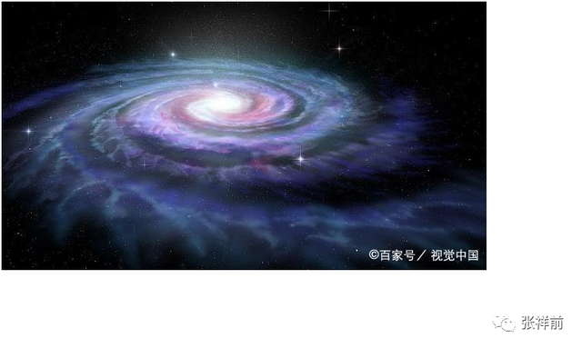

宇宙的3，

宇宙空间为什么是3维的？

我们知道，沿空间中任意一点最多可以作三条相互垂直的有向直线，称为三维空间。为什么恰巧是三条，不是二条，也不是四条？

外星人的解释是：

一维空间决定了质点以直线运动，二维空间决定了质点以圆周旋转或者曲线运动，三维空间决定了质点沿一个平面旋转运动，并且又在旋转平面垂直方向延伸运动【就是以圆柱状螺旋式运动】。

或者说空间直线运动产生的是一维空间，空间曲线运动产生的是二维空间，空间圆柱状螺旋式运动产生的是三维空间。

空间三维的原因，是空间时刻以圆柱状螺旋式在运动造成的。

这两种看法是我们人对同一个现象从不同角度理解而出现的。

我们所生活的空间是右手螺旋空间，也就是右手大拇指指向空间的直线运动方向，右手四指头环绕方向就是空间的环绕运动方向。

两个右手螺旋式空间相互碰撞，旋转相互接触地方空间会抵消而减少，表现为相互吸引，这个是万有引力产生的原因。物体周围的空间面对于我们观察者是逆时针旋转运动。

宇宙的4 ，

宇宙为什么恰巧有4种力？

人类研究发现，宇宙千变万化的力，实际上归结于4种力，一种是万有引力，一种是电磁场力，一种是弱相互作用力，一种是核力。

爱因斯坦想寻找一个公式，把4种力写在一个方程里，他苦干了40年，很遗憾，没有成功。

外星人说，弱相互作用力是电磁场力和核力的合力，不是基本力，宇宙中基本力只有万有引力、电场力、磁场力、核力这4种力。

电场力和磁场力虽然相互关联，但不是同一种力，二者方向都不一样的。磁场力是旋转力，电场力是直线力。

那宇宙中为什么不多不少恰巧有4种力？

外星人的解释是这样的。

宇宙中任何物体，周围空间都以圆柱状螺旋式在向四周运动。

4种力就是圆柱状螺旋式运动形式的变化造成的。

这种圆柱状螺旋式有两个矢量速度，一个是环绕运动矢量速度，一个是直线矢量运动速度，也就是矢量光速。当这个环绕运动速度发生变化，就是万有引力。

当这个环绕速度穿过一个有限面积的曲面时候，曲面发生变化，产生的是磁场力。

当矢量光速发生变化【矢量光速只能方向变化】时候，产生了核力，核力是旋转力。

当这个矢量光速度穿过一个有限面积的曲面时候，曲面发生变化，产生的是电场力。

正电荷周围空间的运动是以电荷为中心，向四周以矢量光速C发散运动。

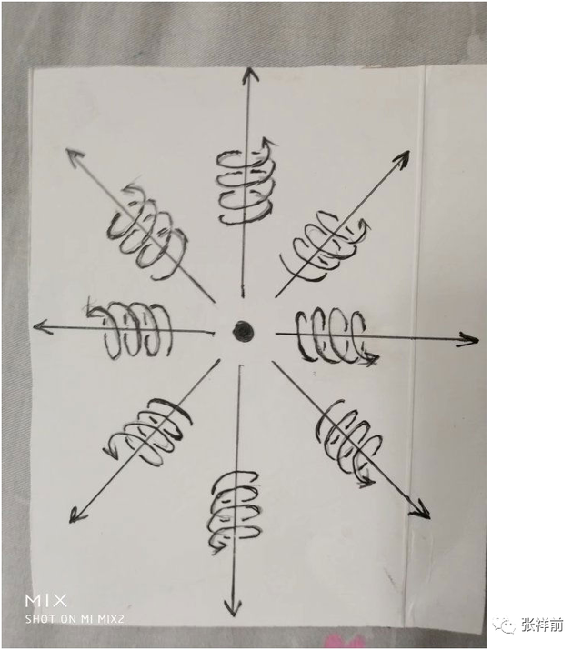

负电荷周围空间从无限远处以光速向负电荷汇聚运动。

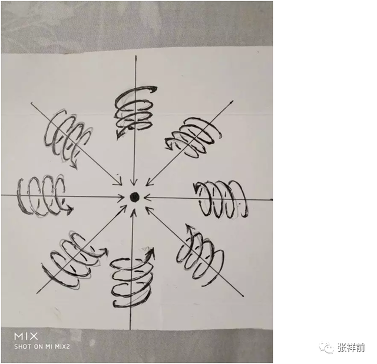

我们知道，圆柱状螺旋式运动是旋转运动和旋转平面垂直方向的直线运动的合成。

电荷在静止时候，周围空间的旋转运动相互抵消为零，只有直线运动，而直线运动速度是光速。

物体周围空间以矢量光速C【就是标量光速c数乘一个单位矢量K，C =
Kc】向四周发散运动。物体具有质量和电荷都是物体周围空间这种向四周发散运动造成的。

在以上认识的基础上，可以得出一个看法：

宇宙任何一个静止质量为m’的物体o点，在相对于我们观察者静止的情况下，周围空间都以物体为中心、以光速度C’
【C’是矢量光速，这里认为光速可以作为矢量，矢量光速方向可以变化，模用c表示，c不变】发散式的运动，因而有一个特殊的静止动量

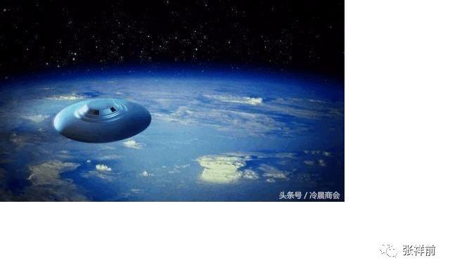

P静= m’C’

以上质量m’的意思是物体周围具有矢量C’的条数。也可以描述为某一个有限曲面上穿过矢量的条数。

当这个物体o点相对于我们以匀速度V直线运动的时候，由于光速的标量c不变，也就是相对论中的光速不变，空间相对于我们观察者的光速运动速度标量形式c不变。

我们用矢量光速C
=Kc【就是标量光速c数乘一个单位矢量K来表示】来表示运动的o点周围空间相对于我们观察者的速度。

这样，o点周围空间相对于o点的速度可以用矢量C–V来表示，因为C
–V和V相加后仍然是光速，体现了光速不变。

相应的o点运动时候动量为

P动 = m(C –V)

m为物体以速度V运动时候的质量，牛顿力学和相对论动量公式是上式中的一个分量，也可以说是C
= 0时候的特例。

得出以上一步最为关键，这个是区别牛顿力学、相对论最为关键的一步。

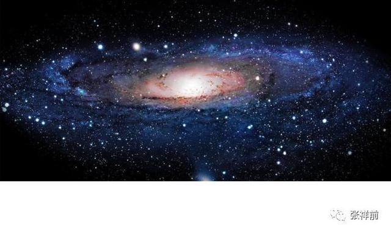

物体周围空间时刻在光速运动，力是物体在空间中运动状态的改变程度或者物体周围空间运动状态的改变程度。

所有的相互作用力本质都是运动产生的，都是惯性力的一种表现。一切物理现象都是物体在空间中运动【或者物体周围的空间本身的运动】所形成的。

电磁力和万有引力、核力表面看是物体之间的相互作用力，本质上都是物体在空间中位置相对于我们观测者运动【或者具有运动趋势】形成的，都是惯性力，都是动量P
= m（C- V）随时间t的变化率。

F =dP/dt = Cdm/dt - Vdm/dt +mdC/dt - mdV/dt

(C-V)dm/dt = Cdm/dt -
Vdm/dt是质量随时间变化的力，简称加质量力，外星人认为是电磁力，其中Cdm/dt
是电场力，Vdm/dt是磁场力，mdV/dt牛顿第二定理中的惯性力，也是万有引力。mdC/dt是核力。

电磁场力与质量大小没有关系，与质量变化有关系，质量变化是高速情况下才具有的，所以，电磁场力在小质量、高速度的微观起主导作用。

万有引力与物体质量成正比，与加速度成正比，与速度大小没有关系，所以，万有引力在大质量、低速度的宏观天体中占据主导作用。

核力与质量成正比，与矢量光速的变化成正比，由于矢量光速只是方向可以变化，所以，核力是旋转力，与速度没有关系。

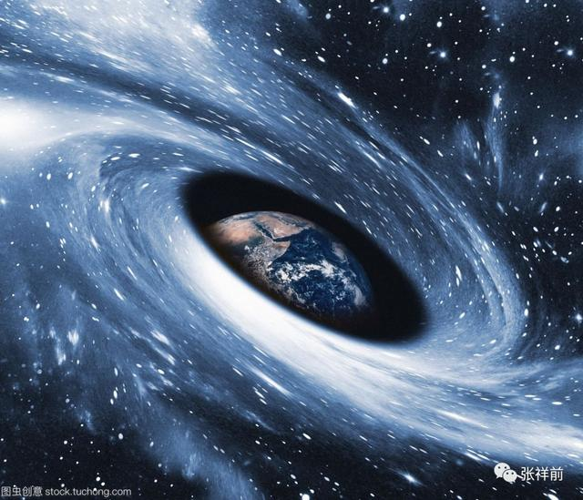

三十一，外星人关于宇宙的认识，有哪些与我们不同

作者张祥前交流微信zhxq1105974776

这一篇文章主要来谈一谈他们关于宇宙的认识，和我们不一样的地方。

我们地球人认为宇宙是由空间、时间、物体组成。有人认为宇宙是由空间、物体、时间、能量构成。甚至有人认为宇宙是由空间、时间、物体、能量、暗物质、暗能量、场等构成。

外星人认为宇宙由物体和周围空间构成的，不存在第三种与之并存的东西，其余统统不存在，其余只是我们观察者对物体运动和空间本身运动的描述。

物质就是由空间和物体组成。

像我们眼前的一棵树、一条河是“物”，树的生长、河水的流动是“事”。宇宙中，物体和空间是“物”，其余的像时间、位移、质量、电荷、场、能量、速度----都是“事”，是“物”相对于我们观测者运动所表现出的一种性质。

暗物质、暗能量、上帝粒子、引力子、弦、以太在外星人眼里，统统是不存在的，都是我们地球人编造出来的。

我们地球人认为宇宙产生于150亿年前的一次大爆炸，外星人认为，宇宙没有开始，没有结束，宇宙的时间是无穷大的。

时间的本质是什么？我们地球人还没有一个严格的、统一的定义。

外星人认为：宇宙任何物体【包括观察者的身体】周围空间都以物体为中心、以光速向四周发散运动，

空间这种运动给我们观察者的感觉就是时间。时间只是人的感觉，没有观察者就没有时间。

所以，说宇宙开始于150亿年前的一次大爆炸是荒唐的。而且，宇宙中到处时间流逝是不一样的，宇宙有的地方过了一年，有的地方已经过了一亿年。你说宇宙起源于150亿年那一次大爆炸，是以哪一个星球计算的？

说宇宙年龄到底有多大是没有意义的，宇宙没有开始，没有结束。宇宙的年龄是无穷大的。

宇宙时间无穷大，那宇宙空间到底有多大？

外星人认为宇宙空间是无穷大的。宇宙中的物体是有限的，无穷大宇宙空间中心存在着有限的物体。

宇宙中物体在空间中分布是洋葱状，一些发达的外星人发现隔着非常遥远的空间外又能够发现物体。

宇宙中物体的有限还是无限，外星人似乎不能最终确定，进一步明确宇宙中物体的分布需要观察者的观察能力的提高。

我们地球人观察发现宇宙是在膨胀的，并且以这个为根据，认为宇宙是大爆炸产生的。如果认为宇宙不是大爆炸产生的，那我们怎么解释宇宙空间为什么在膨胀？

外星人他们的解释是：宇宙中任何物体周围空间都以物体为中心、以光速向四周扩散运动。所以我们观察者觉得星球都在远离我们观察者，感觉到宇宙空间在膨胀。

但是，我们地球上的观察者为什么看不到太阳、月球等离开我们以光速远去呢？-------这个还要取决于太阳、月球的运动初始运动状态。

我们看到一个物体以什么方式在运动，物体周围空间运动是一个原因，物体初始运动状态也是一个原因。

那宇宙的背景辐射是怎么一回事情呢？

60年代，人们发现宇宙空间的背景辐射，科学家认为这个宇宙大爆炸遗留的背景辐射。外星人的解释是空间时刻在运动，物体存在于空间中，会对周围空间辐射能量，空间本身可以传递能量的，就是纯净的真空同样可以传递能量。空间背景的能量辐射，不是宇宙大爆炸原因。

我们地球上不知道电磁场、万有引力场的本质是什么？

外星人认为场是物体周围柱状螺旋式运动的空间。

他们给场的严格定义为：

我们把空间分割成许多小块，每一个小块叫几何点，相对于我们观察者，物体周围任意一个几何点的位置矢量是空间位置的函数，或者是时间的函数，这样的空间叫场。

宇宙万物为什么要运动？

我们地球人对这个问题没有统一的认识，外星人解释是因为物体周围空间运动造成的，那物体周围空间为什么要运动？

物理是我们对几何世界的描述，物理运动状态和几何垂直状态

是对应的。

空间的三维垂直状态经过我们观察者的描述，就是物理上的运动状态。

处于三维垂直状态中的几何点其位置一定要运动变化，并且运动的方向和轨迹可以重新构成一个垂直状态。

外星人说，物理上的运动状态是我们观察者描述的，静止状态也是我们观察者描述的，如果没有观察者，谈论运动或者是静止是没有意义的。

这种观点我们地球人很难接受的。

外星人说我们生活的空间是右手螺旋式空间？

我们所生活的空间时刻以柱状螺旋式在运动，我们用右手握住柱状螺旋式运动的直线部分，并且大拇指指向直线运动方向，则四指环绕方向就是空间的旋转方向。

宇宙中有没有左手螺旋式空间呢？外星人回答是没有天然的，可能的只有人工制造。

宇宙空间为什么是三维的？

外星人认为宇宙空间三维是因为空间时刻以圆柱状螺旋式运动造成的，空间加时间只有三维，三维空间中任意一维以光速运动，就是时间。相对论中四维时空是错误的。

时空只有三维，是因为空间圆柱状螺旋式运动造成的。

如果空间以直线运动，空间应该是一维的，如果空间以圆周运动应该是二维的，空间时刻旋转运动，并且在旋转平面垂直方向上延伸运动，所以空间以柱状螺旋式运动，空间三维是因为空间时刻柱状螺旋式运动造成的。

外星人认为，宇宙一切，大到银河系，小到电子、质子，甚至空间本身，都在以螺旋式运动，原因是空间本身螺旋式运动造成的，物体运动的原因又是因为空间本身运动。

外星人为什么强调运动是人描述的？

如果没有观测者，或者不指明那一个观测者，时间、位移、力、质量---许多物理概念失去了意义。由于时间、位移、力、质量---这些物理概念来自于质点相对于我们观测者在空间中的运动，所以讲，脱离观测者（我们人）描述运动是没有意义的。

物理学中的运动状态从几何的角度看就是垂直状态，是同一个现象我们观测者从不同的角度【就是从物理角度和从几何角度】看出现不同的结果。运动状态是我们人对物体在空间中的位置不断肯定、否定、肯定、否定、肯定、否定---的结果.

没有观察者运动状态不存在的，当然静止状态也是不存在的。

外星人说任意一处空间可以无限存储信息。可以存储整个宇宙以前、现在、以后所有的信息。他们认为信息的本质就是物质的运动形式。地球上的预言家，就是因为空间捕捉空间中存在的信息，因为空间不但包含了现在、以前的信息，还包含了以后所有的信息。

我们地球人目前仍然不能肯定物体是非可以无限分下去吗？

他们的回答是这个要看物体内部能否释放空间。

关于物体的质量的本质是什么？

他们认为：

宇宙任何物体周围空间都以光速辐射式运动，质量反映了物体周围光速运动空间的运动程度。

就是在包围这个物体的曲面内空间的光速运动位移的条数。

那物体为什么带有正负电荷？

他们认为电荷是粒子周围空间柱状螺旋式运动造成的。

正电荷周围空间直线运动部分是以正电荷为中心，以光速向四周发散运动。旋转运动相对于我们观察者是逆时针。

负电荷周围空间直线运动部分是以负电荷为中心，以光速从四周无限远处向负电荷汇聚。旋转运动相对于我们观察者是顺时针。

那能量的本质是什么？

他们认为能量是相对于我们观察者物体在周围空间运动程度或者物体周围空间本身的运动程度。

他们是怎么解释光速为不变的？

空间相对于我们观察者时刻以光速辐射式的离开运动，光是静止于空间中被空间这种运动带着向外跑的。

运动的空间 =
时间，为了使这个等式成立，人们在时间前面乘上一个速度量纲，这个就是光速。

光速不变的原因是光速中的分子【运动的空间】和光速的分母【时间】，是同一个东西，是我们观察者用了两个名字来描述，生意光速中的分子-----运动的空间随光源的速度变化，光速的分母----时间将同步变化，结果光速不变。

三十二，解读张祥前的统一场论

作者张祥前交流微信18714815159

如果将来，人们认定张祥前是一个文化名人，作为文人，肯定有自己得意的代表之作。

我认为我写的统一场论6版【百度统一场论6版可以搜到】意义最大，可以对我们整个星球上的人类产生深远的影响。

可惜这是一个浮躁的时代，人们一看到数学方程就头疼，很少有人对我的统一场论做出评价和分析，这篇文章，我自己给张祥前统一场论做出一个解读。

统一场论最早是爱因斯坦提出的，他化了40多年时间，希望把电磁场和引力场统一起来，但没有成功。

人类目前发现了自然界有弱力、电磁场力、万有引力、核力4种不同形式的力，其中电场力和磁场力人类已经统一了，核力目前人类对此认识很不完善。弱力在主流科学家看来也被统一在电磁场力中。

我的统一场论认为弱力是电磁场力和核力的合力，不是基本力。

电磁场力和万有引力、核力的统一，简单的讲，就是把电磁场力和万有引力、核力写在一个数学公式，以及用数学公式写出电磁场和万有引力场【简称引力场】、核力场之间的关系。

由于场涉及到了时间、空间、运动、力、场、光速、速度、质量、电荷、能量、动量-----这些物理学的本质问题，所以统一场论的完成对人类具有重大意义，但也具有极大的难度。

统一场论是建立在物理世界虚假性基础上。在统一场论中，物理是人对几何世界的描述，没有观察者的话，不存在物理，但是，存在着几何。

统一场论基本原理阐述了宇宙由什么构成的。统一场论认为：

宇宙是由物体【或者叫质点】和它周围空间构成的，不存在第三种与之并存的东西，一切物理现象都是我们对质点和质点周围空间运动的一种描述。

空间和质点不能相互转化,宇宙是二元的，不是一元的。

至于宇宙为什么是由质点和空间构成，空间和质点是不是由更基本的东西构成，质点和空间为什么不能够相互转化？这些问题统一场论无法回答，统一场论只是认定了这个事实，并且以这个事实为理论基础，展开推理。

统一场论的主要任务是解释时间、位移、质量、电荷、引力场、电磁场、核力场、能量、光速、速度、动量、万有引力、电磁力、核力---这些基本物理概念的本质，以及它们之间的关系。

统一场论中基本假设是：

宇宙任何物体，包括我们观察者的身体，周围空间总是以光速向四周发散运动，空间这种运动给我们观察者的感觉就是时间。

这个基本假设定义了时间和光速。并且，统一场论利用时间的物理定义，解释了相对论中的光速不变。

统一场论核心内容是描述空间本身的光速运动，所以，统一场论又叫空间运动学。

统一场论用物体在空间中的位移和物体周围空间光速运动位移，来描述时间、质量、电荷、引力场、电磁场、核力场、能量、光速、速度、动量、万有引力、电磁力、核力---

统一场论是怎么解释宇宙中质点和空间为什么要运动？

统一场论认为：

物理学是我们对几何世界【由物体和空间构成】的描述，所以，任意一个物理现象，我们总可以找到相对应的一个几何状态。

在物理学中我们描述的运动状态，和几何中的垂直状态是相对应的。

如果没有我们人去描述，运动状态其实就是几何中的垂直状态。

相对于我们观察者，宇宙中任何一个物体，过周围空间中任意一个几何点，最多可以作三条相互垂直的直线，这个叫空间的三维垂直状态。

处在这个状态中的任意一个几何点，相对于我们观测者一定要运动，并且不断变化的运动方向和走过的轨迹又可以重新构成一个垂直状态。

以上可以叫垂直原理。

方向不断变化的运动一定是曲线运动，圆周运动最多可以作两条相互垂直的切线，而空间是三维的，其运动轨迹上的任意一点，一定可以作三条相互垂直的切线，所以一定会在圆周运动平面的垂直方向上再延伸运动。

合理的看法是空间几何点以圆柱状螺旋式【就是旋转运动和旋转平面垂直方向直线运动的合成】在运动。

统一场论认为空间的三维，原因解释空间时刻以圆柱状螺旋式运动造成的。

统一场论认为运动状态不能脱离观察者的描述。

运动状态就是我们人对物体在空间中的位置不断肯定、否定、肯定、否定、肯定、否定-----的结果，脱离观察者，宇宙不存在运动状态，也不存在静止状态，没有观察者，谈论运动或者静止是没有意义的。

统一场论认为场的本质是物体周围以圆柱状螺旋式运动的空间，不同的场，只是圆柱状螺旋式运动空间其中一个片段。

统一场论中场的定义为：

相对于我们观察者，物体o点周围空间任意一个几何点【统一场论把空间分割成许多小块，某一个小块叫几何点，通过描述几何点的运动来描述空间本身的运动】p点，由o点指向p点的位矢R，是空间位置x,y,z和时间t的函数，随x,y,z和t变化而变化这样的空间叫场。

由于R包含了物体静止时候周围空间的光速运动位移，和物体以速度V运动时候的位移，两种位移对时间t求导数，再对空间位置求导数，出现了4种场，这4种场就是大家熟悉的万有引力场、电场、磁场、核力场。

统一场论核心是把宇宙4种力写在一个矢量微分方程里。俗称大统一方程，这这种方程有两个，一个是惯性力方程，是空间位移关于时间的导数，再关于立体角的导数。

两一个是相互作用里方程，是空间位移关于时间的导数，再关于空间曲面的导数。

统一场论给出了电场、电荷的定义方程，把电磁学和牛顿力学、相对论统一在一起。也可以导出空间的波动方程，可以把量子力学统一起来。

统一场论的应用主要是变化电磁场产生正反引力场：

当磁场B穿过一个面积有限的曲面S，B发生变化，可以产生沿S边缘线分布的线性电场E和引力场A，并且，在某一个瞬间、某一个空间点上，变化磁场和产生的电场、引力场三者相互垂直。

变化电磁场产生的引力场，又叫人工场，人工场在计算机控制下工作，可以改变物体的位置、质量、电荷、温度、时间、空间，并且，可以使物体质量变成零，处于激发状态，以光速运动起来，。也可以使物体质量变成接近于零，处于准激发状态，可以穿墙而过。

统一场论可以使人类进入虚拟、光速时代。

三十三，为什么说宇宙没有开始没有结束？

作者张祥前交流微信zhxq1105974776

我们地球主流科学界认为，在150亿年前没有宇宙，只是存在着一个奇点，后来奇点发生了一次猛烈的的大爆炸，大爆炸爆炸出今天的宇宙，宇宙的空间和时间、物体粒子等都来源于那一次大爆炸。

主流科学家还认为，宇宙今天仍然在膨胀，这种膨胀就是150亿年那次大爆炸遗留下来的，也就是说宇宙大爆炸一直延续到今天。

外星人明确的说，宇宙没有开始，没有结束，宇宙局部地区的确可以产生剧烈的大爆炸，但是，整个宇宙本来就存在，而且会永远的存在下去。

有网友问我，外星人认为宇宙没有开始、没有结束这种看法有什么根据？

这个关键的证据是时间的本质，你一旦明白了时间的本质，就知道了宇宙不可能是大爆炸来的。

宇宙是由什么组成的？外星人的看法很简单，他们认为：

宇宙是由物体和空间组成的，其余统统不存在，其余都是我们观察者对物体在空间中运动【或者物体周围空间本身运动】的一种描述。

宇宙中任何物体【包括我们人身体】静止的时候，周围空间都以光速向四周发散运动，空间这种运动给观察者人的感觉就是时间。

时间是我们对空间光速运动变化的感受，时间是我们人对宇宙空间运动变化所产生的一种性质的描述，不是真实的存在的东西，脱离我们人，时间是不存在的。

空间的存在是基本的，时间只是我们人对空间光速运动的一种描述。

宇宙真实存在的只有物体和空间，其余的都是物体在空间中相对于我们人运动【或者物体周围空间本身运动】所表现出的一种性质。

如果没有我们人，宇宙给我们的景象就如同一个照相机的定格镜头，不存在时间上的先后，时间的先后、现在，以前、未来，都是依赖与我们观察者来定义的。

有人说，如果认为时间只是人的感觉，没有人不存在时间，那人类在地球上诞生不过几百万年，单地球已经存在了46亿年了，这个段时间在没有人出现之前已经在地球上存在着，这个怎么解释？

其实，没有人之前是一个病句，你第一步“假设没有人”已经把人排除了，第二步的“人之前”，你又用人来定义之前或者之后，你既然第一步已经排除了人，第二步就不能再用人来定义。

以上的道理就好像“地球上东西南北中”，都是以我们人来定义的，没有我们人，不存在东西南北中，同样的道理，没有我们人，不存在时间的先后，亿万前和亿万年后所有空间中发生的事情都是重叠在一点的。

人类一旦明白了这一点，时间是人的一种感觉，不是真实存在的一个东西，你说时间起源于150亿年前的一处爆炸，你就知道这些看法是荒唐的。

宇宙没有开始，没有结束，宇宙本来就存在着，不是谁谁创造的，这个才是正确的认识。

1927年，比利时天主教神父勒梅特首次提出了宇宙大爆炸假说。

1929年，美国天文学家哈勃根据假说提出星系的红移量与星系间的距离成正比的哈勃定律，并推导出星系都在互相远离的宇宙膨胀说。

1946年美国物理学家伽莫夫正式提出大爆炸理论，认为宇宙由大约140亿年前发生的一次大爆炸形成。

现代主流科学的大爆炸理论认为，150亿年前，宇宙是一个奇点，随后发生一次大爆炸，诞生了时间、空间和物体，而现在人们普遍认为宇宙由时间、空间和物体构成。

宇宙大爆炸理论和相对论实际上是相矛盾的，我们假设相对论是正确的，相对论认为两个观察者相对运动，测量时间的过程是不一样的。

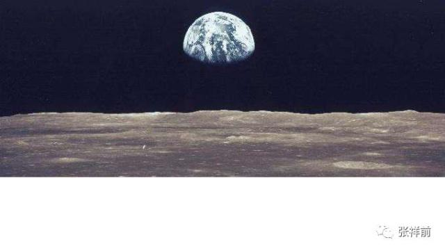

设想一个外星球相对于我们以接近光速运动，我们过了一年，这个星球上的人可能过了一万亿年。你说宇宙起源于150亿年前的一次大爆炸，是相对于那个星球？由于宇宙中时间的流逝不均匀，你说宇宙的年龄有多大就显得毫无意义了。

西方国家相信宇宙大爆炸是为了迎合上帝创造人和万物的思想，可笑的是有许多中国人也跟着瞎起哄。

一个星球相对于另一个星球高速运动，这个星球所在空间中的时间和另一个星球上时间是不一样，这个星球上的时间过了几分钟，另外一个星球可能过了一万年。

相反的情况也可以发生，这个星球上的时间过了几万年，另外一个星球可能过了几分钟。不过，宇宙中任何地方时间倒流是不会发生的。

一个地方和另外一个地方的时间流逝不一样是一个比较概念，只有通过比较，你可以知道那一个地方时间流逝快一些，那一个地方时间流逝慢一些，同一个地方是没有比较性的。实际上宇宙中任何两个地方的时间流逝都不是一样，很多情况下由于差异微小，我们难以察觉罢了。

在宇宙中，不光是相对运动的星球的时间的进程不是均匀的，在强引力的星球表面时间流逝得非常的缓慢，甚至到了不走的地步。宇宙中时间流逝的不均匀在有些空间区域里是非常的显著，相差的数量级是非常巨大。

宇宙中，有的地方过了一年，有的地方可能过了几亿年了。从这种角度看，现在流行的宇宙大爆炸理论纯粹是错误的。

当然，宇宙中部分星球相互吸引，最后演变成一个超级星球，后又爆炸分离出气态星球，后在万有引力作用下又演变成小的星球，这种周而复始的变化宇宙中比比皆是，但是这个是宇宙局部情况，你说整个宇宙，包括时间、空间、物体都是爆炸而来的，这个就更荒唐了。

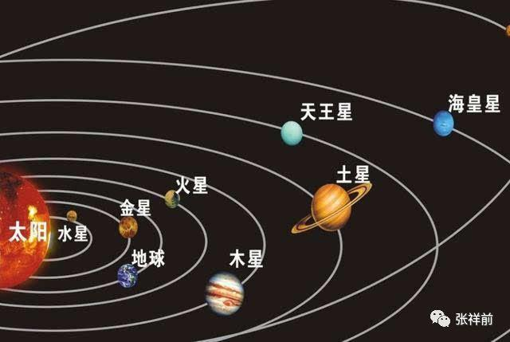

我们知道爆炸有一个或者几个中心点，而宇宙中的星球相互彼此在远离，没有中心点，这个明显是空间本身运动的原因。

宇宙中星球相互远离的真正原因是物体周围空间时刻以柱状螺旋式在运动所造成的。

一个星球相对于我们观察者静止，这个星球周围的空间时刻以柱状螺旋式向外辐射运动，但是，旋转运动由于相互抵消，实际只是以星球为中心、以光速向四周离开运动，这个如同磁场的高斯定理，一个平面上有多少磁力线穿过，就有多少穿进来，这样从整体看相互抵消为零，但是从局部看，空间本身旋转运动仍然存在着。

宇宙星球相对于我们观察者静止，周围的空间旋转运动相互抵消而消失，但是，当这个星球相对于我们观察者运动的时候，周围平衡被打破，旋转运动将会出现。

可能大家有一个疑问，既然星球周围空间都是以光速在辐射式发散运动，星球存在于空间中被空间这种运动带着向外跑，哈勃定理中的星球相互远离的速度应该是光速，但是，实际观察到的速度远远的小于光速，这个是什么原因呢？

这个原因是宇宙中每一个星球有一个大小不一的初始运动速度，设想一个星球和我们所在的地球有相同的初始运动速度，我们应当看到这个星球和我们地球是相对静止的，如果这个星球在我们看来绝对静止于空间，这样这个物体会以光速相对于我们运动，这个就如同发光。

空间本身的运动还有一些特殊性，比如，一个苹果从树上掉下，如果认为苹果是静止的，是地球撞上了苹果，那和我们中国对称的巴西国家同时放上一个苹果会加速飞到空中-----这个情况没有发生，原因是空间本身的运动是以地球为中心，从四面八方时刻向地球加速坠，。

至于空间本身为什么时刻要运动，为什么会以柱状螺旋式在运动。这个属于自然界的核心秘密。

物理上的运动状态是我们人对几何中的垂直状态的描述。

任何一个处于垂直状态中的质点其位置相对于我们观测者一定要运动，并且不断变化的运动方向和走过的轨迹又可以重新构成一个垂直状态。这个就是垂直原理。

不断变化的运动方向一定是曲线运动，圆周运动最多可以作两条相互垂直的切线，而空间是三维的，其运动轨迹一定可以作三条相互垂直的切线，所以运动一定会在圆形的垂直方向上延伸，合理的看法是质点在空间中以柱状螺旋式运动。

太阳系内几乎所有的星球都在旋转，行星都绕太阳公转，又在自转，而包括太阳在内所有的星球都有自转。在微观世界中，电子、质子、中子-----都有自旋。整个银河系也在旋转。可见，宇宙中物体的旋转运动是一个普遍现象。

如果你仔细的观察一下，就会发现，宇宙中所有的自由存在于空间中的物体，都是以螺旋式在运动，螺旋式运动是自然界的一个基本规律。

星球的自转和公转，本质上都是螺旋规律造成的。

空间本身时刻以柱状螺旋式在运动。我们知道，沿空间中任意一点最多可以作三条相互垂直的有向线段，称为三维空间。一维空间决定了质点以直线运动，二维空间决定了质点以圆或者曲线运动，三维空间决定了质点以柱状螺旋式运动。

或者说质点直线运动产生了一维空间，质点曲线运动产生二维空间，质点柱状螺旋式运动产生了三维空间，这两钟看法是我们人对同一个现象从不同角度理解而出现的。

单单从时间是人的感觉，没有人就不存在时间这种观点出发，就知道宇宙没有起点，也没有终点，宇宙空间本身的运动是因为空间的三维垂直状态经过我们人描述的结果。

外星人还有一个看法：

物理上的运动状态是我们观察者描述出来的，当然，静止状态也是我们观察者描述出来的，没有观察者，谈论运动或者静止都是没有意义的。

在没有观察者，或者没有指明哪一个观察者的情况下，物体只能说处于不确定状态，你不能说是在运动，还是在静止。

当然，外星人这种对运动的认识，一般人根本没有能力理解。

现在主流物理学家的理论“宇宙背景辐射”，是指来自宇宙空间背景上的各向同性的微波辐射，也称为宇宙空间微波背景辐射。

二十世纪六十年代初，美国科学家彭齐亚斯和R.W.威尔逊为了改进卫星通讯，建立了高灵敏度的号角式接收天线系统。

1964年，他们用它测量银晕气体射电强度。为了降低噪音，他们甚至清除了天线上的鸟粪，但依然有消除不掉的背景噪声。他们认为，这些来自宇宙的、波长为7.35厘米的微波噪声相当于3.5K温度的辐射。

1965年，他们又订正为3K，并将这一发现公诸于世，为此获1978年诺贝尔物理学奖。

宇宙背景辐射的特征和绝对温标2.725K的黑体辐射相同，频率属于微波范围。

现代主流物理学认为：宇宙微波背景是宇宙背景辐射之一，为观测宇宙学的基础，是宇宙中最古老的光，诞生于宇宙大爆炸时刻，也就是说是宇宙大爆炸遗留下来的。

利用传统的光学望远镜，观察恒星和星系之间的空间（背景）是一片漆黑。

然而，利用灵敏的射电望远镜可发现微弱的背景辉光，且在各个方向上几乎一模一样，与任何恒星，星系或其他对象都毫无关系。这种光的电磁波谱在微波区域最强。

现在的物理学家坚信：宇宙背景辐射是一种大爆炸遗留下来的。他们认为：

“宇宙微波背景是我们宇宙中最古老的光，当宇宙刚刚380,000岁时刻在天空上。它显示出微小的温度涨落，对应着局部密度的细微差异，代表着所有未来的结构，是当今的恒星与星系形成的种子”。

宇宙微波背景解释了宇宙早期发展所遗留下来的辐射，它的发现被认为是一个证明大爆炸宇宙模型正确性的里程碑。

首先，我们来提出一个问题：温度是什么？

温度是指物体的分子无规则运动的剧烈程度，我们再提出一个这样的问题：对于纯净的真空会不会有温度？

按照温度的定义，真空肯定是没有温度的，是绝对零度。因为真空中没有物体的分子，没有实物粒子，当然就不会有什么粒子运动，谈不上什么温度。

由此，我们可以设计一个实验，把一个密封的容器放上一温度测量仪器，在外面可以读出这个温度计的数字。可以设想容器里面的温度和外面的肯定是一样的。

然后我们开始抽容器里的空气，看看容器里面的温度是否下降，下降的程度和抽出的空气多少有什么关系？当我们把里面的空气抽完了，里面的温度是否会降到绝对零度？

如果实验证实，我们无论如何不能够把容器里面的温度降到绝对零度，原因是什么？外界的热量是如何传到容器里面的？

我们知道，热的传播有三种方式，一种是对流，一种是传导，一种是电磁辐射。在这种情况下，对流和传导是不会发生的。唯一的原因是电磁辐射把能量传进去，在现代物理理论中，认为辐射就是电磁波的辐射。我们还可以设计实验，能够屏蔽电磁波，把电磁波屏蔽掉，是否能够得到绝对零度。

统一场论的回答是无论如何不会降到绝对零度。

统一场论认为，场的本质就是空间，空间本身时刻在运动，物体之间的相互作用本质上就是通过变化的空间来传输能量，空间本身就有传播能量的能力。

所以，在以上的实验中，难以使温度降到绝对零度。即使在远离星球的一块真空中，没有别的物体影响，统一场论认为，真空在我们测量时候仍然具有温度。

统一场论认为，物理学中的运动状态和几何中的运动状态是等价的，在空间中任何一个处于垂直状态中的物质点的位置必然要发生变动，并且它运动的方向是不断地变化的，这些不断变化的方向又可以重新构成一个垂直状态。

现实空间就是三维的，过一点可以作出三条相互垂直的有向线段，任何一个物体（包括测量温度的测量仪器）存在于空间中总是要运动的，因而总是有温度的。

温度是物质粒子在空间中无规则运动的程度，没有粒子的运动就谈不上温度，由于任何一个物体存在于空间中总是要运动，而测量温度的仪器必须是物体，所以我们无法测量到具有绝对零度的真空。

这可有意思，真空可以是温度为绝对零度的状态，只是我们无法测量到，你一测量必须用到物体，一有物体，就能够产生温度，所以，真空在理论上我们可以推算出是绝对零度，可惜我们无法从实验上证实，这个无法证实当然也是自然界的客观规律决定的，不是我们人的能力有限。

1980年代前，人们发现，从太空所有方向来的辐射具有完全相同的温度，这太平滑和完美了。这个是宇宙背景辐射学说所无法解释的。

我们的结论是：物体可以通过空间来相互作用，物体可以对真空施加影响，并且影响到真空中存在的物体。

所以，测量真空，必然要用物体去测量，这样总存在着温度，不可能得到绝对零度。从这种角度出发，宇宙大爆炸理论是错误的，宇宙微波背景辐射学说也是站不住脚的。

百度统一场论6版可以看到详细的分析。

三十四，希望广大网友帮助我验证一个事情

作者张祥前交流微信18714815159

我曾经问过外星人宇宙终极定理、最高法则是什么，“宇宙最深刻的奥秘是什么？能不能一句话讲出来？”

外星人回答我：

“宇宙是由物体和周围的空间构成，其余统统不存在的，没有第三种与之并存的东西，其余都是我们人这个观察者对物体运动和空间运动的一种描述。

以上就是宇宙根本法则，是宇宙最深刻的、最至高无上的法则，没有比这个更加高级的了。这个也是宇宙星球中所有的文明人对宇宙最深刻的认识，无论多么高级的星球文明，对宇宙认识的深度到此为止。

在所有宇宙文明星球上，首先拥有这种认识人都可以算是神级别的。值得一提的是，在你们地球上一个最著名的科学家，也认识到了这个宇宙根本法则。”

“是爱因斯坦吧？这个人在我们地球上是最出名的科学家。”我说。

“不是爱因斯坦，他叫伽利略，伽利略曾经说过，‘我们五官感觉到的物理世界的存在是虚假的，真实存在的是背后的几何世界’，几何世界就是由物体和空间构成。

伽利略能够说出这样的话，表示他已经意识到了宇宙真实存在的只有物体和空间，而物理只是我们人对物体运动或者空间运动的描述而已，脱离了人，物理世界是不存在的，但是，几何世界仍然存在着。

在别的文明星球上，都是科学发展到极高程度的时候，星球上的人才能够认识到以上的宇宙根本法则，但是，你们地球上的伽利略很是意外，在你们地球上科学还不发达的时候，竟然能够说出了这样的话。

按照你们地球人的看法，你们地球上的物理学起源于伽利略，等你们地球人真正明白伽利略的‘物理世界的存在是虚假的’这句话时候，你们地球人可能感叹到：物理学起源于伽利略，又结束于伽利略。

宇宙的最高法则属于物理学的范围，物理学就是描述运动的，认识了宇宙最高的法则后，物理学的深度到此为止，但是，数学不同，数学没有最高法则，我们发现，对数学的认识是没有止尽的。

伽利略能够认识到这一点，如果不是高级外星文明的点拨，那我只能认为他是宇宙中的神。”

很多年前，我就一直想寻找伽利略的著作，看看伽利略到底有没有说过这样的话。可惜我一直没有找到。就是到了互联网时代，我仍然没有找到伽利略著作中有这么一句话。

按道理外星人没有必要对我编造这种谎言，有可能伽利略在和朋友通信中说过这个话，有可能我没有看完伽利略所有的著作。

我希望熟悉伽利略著作的网友，能不能找到伽利略说的这一句话，到底是出自他哪一步著作中。

可能有认为：

宇宙是由物体和周围的空间构成，其余统统不存在的，没有第三种与之并存的东西，其余都是我们人对物体运动和空间运动的一种描述。

这一句话没有什么高大上，怎么就是宇宙核心秘密、最高法则？

我们仔细的分析，可以获得许多重要、有用的信息。

这个宇宙最高法则，提到了物体周围空间本身在运动，并且，把所有的物理概念形成的原因，都归结于观察者对运动的描述。

在没有认识到物体周围空间在运动，我们人类对很多物理概念的来历感到困惑，无法理解时间、质量、场、电荷、万有引力、库伦电力、相对论静止能量这些物理基础概念是怎么形成的，虽然大家也隐约的知道这些物理概念应该和运动有关。

但是，明显一个情况是，物体相对于我们观察者静止时候，时间、质量、场、电荷、万有引力、库伦电力、相对论静止能量这些物理概念仍然存在着。

当我们一旦认识到物体相对于我们观察者静止的时候，时间、质量、场、电荷、万有引力、库伦电力、相对论静止能量这些物理概念是来自于物体周围空间本身的运动。

统一场论【百度统一场论6版可以看到】认为宇宙任何静止物体周围都有一个静止动量，就是质量乘以矢量光速。

这样，我们可以把物理世界统一于时空，统一于运动。

我们所说的物质世界中的物质，就是由空间和物体组成的。

为什么这么说，因为脱离了我们观察者，物体和空间仍然存在，空间和物体是客观存在的，与我们观察者有、无是没有关系的。

而除了物体和空间，别的东西都是我们观察者描述出来，如果没有我们观察者，很显然是不存在的。

把伽利略的话总结延伸一下，可以有如下看法：

我们听到的声音，看到的颜色，感觉到的热，鼻子闻到的气味，舌头尝到的味道，甚至具有时间的感觉······这一切都是由于运动造成的。

像我们眼前的一棵树、一条河是“物”，树的生长、河水的流动是“事”。宇宙中，物体和空间是“物”，其余的像时间、位移、质量、电荷、场、能量、速度----都是“事”，是“物”相对于我们观测者运动，经过我们观察者描述出的一种性质。

这个基本原理否定了电磁场和引力场是一种特殊的物质，场要么是物质粒子，要么是空间。

这个基本原理如果是正确的，可以断定，什么暗物质、暗能量、弦论、都是狗屁，不存在的。物体的质量和电荷是物体周围空间运动相对于我们观察者运动，经过我们观察者所描述的一种性质。

上帝粒子---
希格斯玻色子就是真的找到了，与物体的质量、电荷的本质一毛钱关系都没有的。

那些认为物体之间的万有引力是引力子传播的，电磁场力是光子传递的，强相互作用是胶子传递的，对照以上宇宙核心秘密，这些都是胡扯。

物体的一切相互作用表面看是通过介质来进行，其实本质上都是通过空间进行的。万有引力、电磁场力、核力本质上就是物体周围空间运动状态的改变程度而已，自然界的核心秘密都藏在空间里。

统一场论认为，我们观察者在物理上所描述的运动状态和几何中三维空间的垂直状态是等价的。

空间的三维垂直状态，经过我们观察者的描述，就是物理上的运动状态。

宇宙的一切物体在空间中的运动，本质上都是空间本身运动引起的。

这里说的空间本身运动，指的是物体周围空间在运动，如果没有提到物体，在统一场论中描述单纯的空间运动是没有意义的。

因为描述空间的运动，开始和结束都需要依靠物体来确定。

统一场论认为我们所生活的空间时刻以柱状螺旋式在运动，这个也是三维空间的来历，如果空间时刻以直线运动，空间应该是一维的，如果空间时刻以圆周运动，空间应该是二维的，空间真实的运动是圆周运动加上圆周平面垂直方向的直线运动【合成了柱状螺旋式运动】，所以，空间时刻以柱状螺旋式在运动。

我们所生活的空间是右手螺旋空间。

而场的本质就是我们对柱状螺旋式运动空间的描述，相对于我们观察者，空间旋转中心一个点是引力场，旋转中心是一个直线，是电场，旋转中心是一个圆周，是磁场。

这里说的运动明显有两种，一种是物体在空间中运动，这个我们很熟悉，另一个是物体周围空间本身的运动，这个我们不熟悉。

统一场论详细的论述了空间本身的运动。

物体周围空间本身的运动，看起来和物体在空间中运动形式不一样，但是，二者本质是一样的。

比如，我们夜晚坐飞机，飞机起飞的时候，机场两排灯光在我们看起来高速的离开我们运动，这种运动我们可以理解为背景运动，同样的道理，物体周围空间的运动可以理解为背景运动。现在宇宙膨胀的证据-----哈勃定理，其本质就是一种空间本身的背景运动。

宇宙中任何物体【包括我们观察者的身体】周围空间都以光速辐射式运动，空间这种运动给观察者的感觉就是时间。

时间是人的感觉，没有人就不存在时间，西方的宇宙大爆炸说宇宙诞生于150亿年前的一次大爆炸，这个就是在胡扯，宇宙没有开始，没有结束，时间只是人的感觉，没有人，一亿年前和一亿年后都是重叠在一起的。

时间的开始、过程、结束，是我们观察者把时间和空间位移类比的结果。

宇宙就是由空间和物体这两个基本东西构成，其余的只是我们观察者的描述而已，都不是真实存在的。

包括运动的现象，都是我们观察者的描述，没有我们观察者的描述，宇宙没有运动状态，不过，也是没有静止状态。没有观察者，讨论运动和静止是没有意义的。

由于时间只是我们观察者的感受，就必然要求运动状态是我们观察者描述出来的，只有这样，才不矛盾。

宇宙的空间是无限的，宇宙很复杂，也很简单，空间和物体这两个砖瓦，构筑成宇宙大厦。

伽利略说的“物理世界的存在是虚假的”，和佛教说一切都是虚幻的，倒是十分吻合的。

张祥前主要电子版作品有：

《果克星球奇遇》又名《安徽农民一个月外星见闻》

《统一场论6版》

《宇宙的核心秘密》

《揭秘万有引力的本质》

《揭秘时间、空间的本质之谜》

《时间的物理定义》

《揭秘电荷、电磁场的本质》

《揭秘外星人飞碟之谜》

《介绍外星球》

《宇宙中只有一个我吗》

《揭秘人的生死之谜》

《人死亡时候的感受》

《为什么人死亡时间能够回忆出生时候的感受》

《人痛苦的根源》

《介绍人的前世爱情》

《最新科学理论证明生命轮回的真实性》

《揭秘预言家预言之谜》

《揭秘人的生死、轮回、意识、灵魂之谜》

《宗教和科学》

《我们都是农民》

《一眼看透中国人的本质》

《国家起源之谜》

《张祥前外星球旅行语音分享》

《张祥前谈人生命轮回视频分享》

全套98元，

想看的网友发邮件到张祥前的邮箱

zzqq2100@163.com咨询。

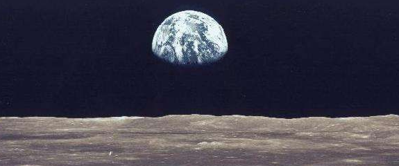
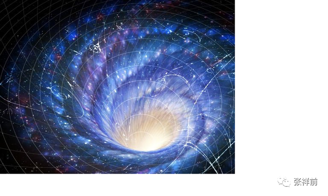
