果克星球 奇遇记
=============================

又名《安徽农民外星球一个月见闻》

注：

1，内有呕心内容，勿让未成年人阅读。

2，因为传播本人在外星球的一个月见闻，很多网站把我封杀，重新注册再封，我的微信多次被封，多亏大神级别的网友暗中帮忙才保住我的微信账户。多次被gong安传唤、处理，多次被有关单位电话警告，要求我以科幻形式写，不得以记实
的形式写。

这篇文章虽然以科幻的形式出现在你面前，但阅读本文，仍然能够使你对真实的外星人世界有一定程度的了解，颠覆你在网上看到的虚假的外星人世界。

在目前这个大环境下，只能以这种形式传播这类文章，希望广大网友理解。

作者 张祥前交流微信18714815159

作者前言

目录：

一，从家中被带走。

二，飞行途中 聊飞碟

三，果克星球超光速通讯

四，到了果克星球的飞碟仓库

五，初识果克星球的全球公众信息网

六，踏上果克星球大街

七，见识瞬移和全球公众运动网

八，有趣的果克星人。

九，果克星人为什么要绑架地球人？

十，宇宙中的陆基人种和水基人种

十一，果克星人的奇怪性行为

十二，诺顿谈宇宙所有生命的起源

十三，宇宙中有人的星球很多吗？

十四，果克星球的宗教

十五，初次接受体检和实验

十六，果克星人不讲德道

十七，我的外星女友

十八，云中漫步。

十九，海底潜游。

二十，被海底蛇人入侵

二十一，参观果克星球人工场控制中心。

二十二，光线虚拟人

二十三，果克星球的时空冰箱

二十四，参观果克星球的人体复制工厂

二十五，果克星球的新型人种---金属人

二十六，果克星球的金钱

二十七，果克星球的领导

二十八，虚拟旅行。

二十九，体验远程性爱。

三十，果克星球的三维虚拟伴侣

三十一，性爱场馆

三十二，遇电妹条妹受伤。               

三十三，参观邻近星球

三十四，在水星被劫持。

三十五，献给海底两栖巨人的礼物

三十六，拜见果克星系科学大佬

三十七，果克科学家谈人的意识、灵魂、轮回

三十八，回家。 

作者简介：

作者张祥前，安徽庐江县人，男，农民，初中水平，1967年农历8月26出生在庐江县金牛区牛首公社王渡大队小胡郢【后改名为庐江县郭河镇北圩村第4村民组】，现移居在3公里外的庐江县同大镇二龙新街111号，以电焊和修自行车为生。

作者联系电话18714815159

微信zhxq1105974776

邮箱zzqq2100@163.com

作者前言

大约在七、八岁时，有一次，我一个人在一块沙地上放鹅，突然看到有几团气雾状的东西在我眼前快速地移动，其中有一团猛的扑向我，当时我觉得头嗡的一声，眼前一黑，人不由自主地蹲下去，好长时间才清醒过来，眼前的气雾消失得干干净净。

我当时也没有看到飞碟，只是之前看到西边的天空闪一下红光，当时大概是下午到傍晚之间，四五点钟的样子，红光出现正好在太阳附近，而当时太阳附近又有许多红色的云霞，所以没有在意有没有飞碟之类的东西。

这是我小时候遇到的一个最奇怪的事情，至今记忆深刻。

大约从十二、三岁时开始，我夜里老是做梦，梦见自己生活在另一个星球上。在这个星球阳光好像不是很强，光线偏蓝色。这个星球上几乎没有植物，而且表面上好像不适宜居住人，人都住在很深的地下面。人们乘坐着极快的交通工具，能够快速地来回地上、地下。

在我脑海里印象最深的是这个星球上无论地上、地下都建有大量特别高大复杂的建筑物，这些建筑物大多数是具有铅灰色调的金属制成，整个星球颜色单调沉闷。

一个人偶而做这样的梦，没有什么奇怪的，但是，数年、长期的做这样的梦，不得不让我思考，这一切背后的原因。

本人在小时候多次遭遇奇怪的事情，现在猜测就是遇见了外星人。

尤其是我小时候生了严重肾炎，那时候家庭极度贫困，经常饿肚子，家庭有成员曾经饿死，没有条件去医院治疗，在临死时候外星人救了我，这个记忆非常深刻。

还有一次害眼病，非常严重，持续半年时间，没有接受过治疗，一次都没有。只有母亲偶尔来过问一下，在我眼睛无法睁开的时候，她用唾液涂我的眼睛，开始有效果，后来就没有效果了。

但是她没有一分钱，无法带我去医院治疗。那时候家庭贫困，人又都很愚昧麻木，很多孩子死了，家庭成员的悲伤程度，还不如现在死了一个小猫、小狗。

我最后接近失明，只能整天坐在床边，完全看不见走路，也是他们来了治好了我的眼睛。

我小时候多次被神秘人带走，这些神秘人每次来的时候，我都有很强的预感，心里说，他们要来了，要来了，果然就真的来了。

他们来的时候，首先都是看到墙壁发红，都是夜晚把我从床上带走，直接从墙壁里穿过去，早上送回来，也是送到我的床上。我也一度怀疑这是不是在做梦。

有一次，他们送我回来，我说，就把我放到门前的草堆上就行了。第二天，我果然就睡在草堆上，我起来回到家里，母亲已经起来了，开了门，她在扫地，没有问我从那里来。

多年以后，我也在内心怀疑自己小时候这一切遭遇是不是在做梦？但是，睡在草堆上的事情，千真万确，使我坚定的否定了这一切遭遇都是在做梦的念头。

在1985年初夏，我19岁时候再次【也是最后一次】遇到外星人，踏上外星球旅行了一个月时间。

这一次我的记忆同样不是很清晰，可能是记忆受到了他们的干扰。但是，由于我已经成年，有一定的思考和判断力，而且看过与外星人绑架有关的杂志，并且在外星球上获得的信息量很大。

所以，这一次旅行获得很多有价值的信息，也对我以后人生有巨大影响。否则我就是一个思想有点保守的普普通通的农民，人生就是娶妻生子，平平淡淡的过一生，不可能有能力在网上写了那么多的文章，特别是关于宇宙奥秘、前沿物理方面的文章。

现在我仍然不清楚是怎么得到这些关于宇宙奥秘、前沿物理方面的知识，但是，可以肯定的是与外星人有关。

在我们地球上，一个人出门旅行，回来后回想旅行的经过，一般都是按照时间的先后，旅行经历的画面会在头脑中像放电影那样一一出现。

可是我这一次旅行的记忆画面是不连续的，而且时间的先后可能都被打乱。不知道那些事情是先发生的，那些事情是后发生的。

在他们的星球上，你上一秒钟可能在一个面临死亡威胁的恐怖场景中，他们的交通工具全球运动网在下一秒种可以把你送到一个安全的、温暖的床上，连进门、出门的过程都省略了。

他们的社会是一个高度虚拟化的社会，常常使我分不清楚那些是虚拟场景，那些是真实场景。有时候真实的场景和虚拟场景可以随意的切换。

和一般遇见外星人的情况有所不同，这一次在和外星人的接触中，我所获得的外星人很多信息，尤其是科学技术信息，不是外星人言语直接告诉我，或者其他方式交流、学习的那种。

感觉好像是和外星人的意识互通了，就像有一个外星人的意识进入了我的意识中，我拥有一个外星人的部分记忆，后来通过慢慢回忆，才掌握的，

也可能是他们用一种人工场扫描技术，通过场这种无形物质，向我大脑中输入许多信息的原因，就像我们的电脑下载一样。他们多次用人工场设备扫描我的大脑，是向我大脑输送知识，还是做其他实验，就不得而知了。

不过，我获得的记忆信息，尤其是记忆画面是非常的多，串联起来，使这些记忆信息变得非常有价值。当然，这里面也有许多我自己至今也无法解释的秘密。

本人遇到外星人事情在网上公布后，受到社会上很多人关注，上海宝山电视台曾经采访了我，但是，节目审查没有通过，所以节目没有在电视上播出。

十几年前我就在网上陆续发布我遇到外星人的事情，我一直想写自己去外星球的旅行经历。但是，那时候我整天忙于生计，很少有时间上网。只是简单的描述一下自己在外星球的经历，发到网上。

期间接到有关单位的警告电话和口头警告，要求我的外星球旅行见闻要以科幻小说来写，不得以真实事件的报告形式来写，以免引起公众不必要的恐慌。

前几年我写了科幻小说形式的《果克星球奇遇》。

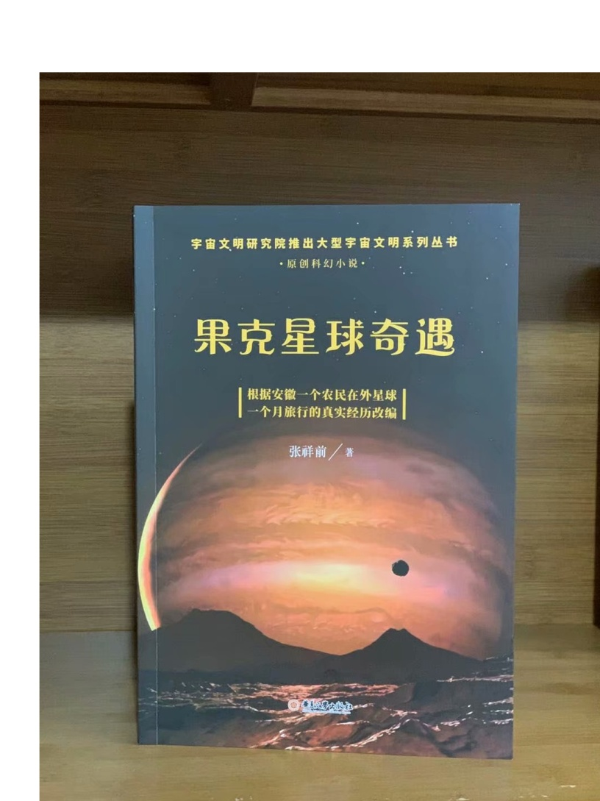

因为无法发到网上，为了能够发到网上和读者见面，只好修改，后修改得面目全非才勉强发到网上，现在网上几乎又被删除完了。

很多网友对此不满意，要求我写真实的外星球一个月的旅行见闻。

但是，我们现在的大环境是不允许传播这些信息的，比前几年管束的更加严厉。为了传播这些信息，我曾经多次被公安传唤和处理。他们有一次还要求我写保证书，保证我以后不在网上发布这些文章。保证书当时我写了，估计保证书现在仍然在他们的手中。

警察上门搜查我的资料和手机，给我家人带来了恐惧，把我岳母吓得哭起来，我妻子曾经为这个事情和我剧烈吵，骂我不该在网上发布这些乱七八糟的信息。

我遭遇外星人的事情在网上披露出来，有的网友由于受到长期的单一信息的影响，形成一种顽固、僵死思维，无法接受这个事情，非常的反感和排斥。

由于受到很多网友的举报，有的人坚持十几年时间来举报我，导致很多网站把我封杀，特别是我的新浪博客被封杀，很多重要的外星人的前沿物理理论方面的文章，由于没有备份，丢失造成了无法弥补的损失。

频繁的举报导致我的微信多次被封，现在我的微信经常收到被举报的警告，微信有的功能现在仍然受到限制，微信支付经常被封。

所以，这篇文章仍然以科幻的形式写，只是内容增加了一部分，描述详细了。

看了这本书，相信大家对发达外星球的科技与生活、社会结构、外星人身体等，有一个大概的了解。

我在外星球上，遭遇最多的事情是被性侵，记忆最多、最清晰的也是这方面的内容。这些方面内容如果完全写出来，可能被我们的社会所不能容忍，所以，这方面的内容，有的我记得很清楚，但是，不方便全部写出来。

在外星球上，也谈到地球的未来、某大国未来走向、政治人物、圣人的出现相互关联等敏感内容。我想等我被社会承认，有一定的知名度、社会地位，才考虑写。现在写的话，我没有能力保护自己和家人，使自己和家人处于极为不利的地步。

这个大家可能不好理解，我听到的一个事情【无法考证真实性啊】，几个人在说，他们村子有一个50多岁的寡汉子，中了500万大奖，有人说他发达了，终于可以娶到老婆了，可以知道女人身体的滋味了。

结果没有几天，几个屁精【方言：小流氓】上门去敲诈他，说是借几个钱花花。寡汉说钱全部存入银行了，屁精们一个子没有捞到，很失望又很气愤，动手打寡汉子，下手重了点，竟然把寡汉给打死了。

所以，我要考虑怎么能够保护自己，有些秘密不能过早的说出来。

外星球旅行过程中，由于很多事情我自己都无法解释、搞不清楚，加上记忆模糊，希望网友能够理解。

也希望一些网友能够以开放、包容的态度看这个事情，不能对自己不能接受的事情一味的指责、谩骂、举报。

你们想一想，全球几十亿中，而且中国人最多，为什么不会有几个人遇到了奇怪的事情？

本文在介绍外星人生活方面，披露出许多以前人们毫不知情的细节，可以满足一下大众对真实的外星球、外星人日常生活的好奇心，同时也可以给广大科研工作者一个启示和参考。

我现在从网上搜一下，全世界宣称自己去过外星球的人很少，没有几个人。但他们描述自己在外星球的旅行见闻，和我的完全不一样。可能这些人有的是在撒谎，有的记忆受到外星人严重干扰、误导，或者是遇到了不同种类的外星人。

从外星球回来后，由于受到强烈震撼，也隐约意识到外星人科技可以引起地球上天翻地覆的变化，当时疯狂的对外宣传这个事情。疯狂向有关单位写信，几十年时间里，估计写了数千封信，大约只有4、5封回信，回信都是铅字格式，上面是“这个事情与他们无关”这么冰冷冷的一句话，没有看到手工字迹的回信。

由于长期写信，引起右手中指变形，期间还申请了新型钢笔的专利。

我也带着资料上门找过有关单位，他们根本就不看我的资料，也不听我的解释。

有网友说这些人可能无法接受一个农民遇到外星人的事情，认为这个事情太过于荒唐。

其实很多情况下，我根本就没有提外星人的事情，有时候，我还没有开口说话，可能是他们看我衣服穿的不乍的，他们一开口就叫我滚出去！

互联网传到农村，我又转移到网上，利用业余时间研究、宣传外星人科技，至今已经坚持了37年。

很遗憾，仍然没有能够引起社会关注、重视。这个不光是很多网友，就是我自己也是感到疑惑不解，特别是我们现在处于互联网时代。 

我打算在网上写文章，写科幻小说，争取出名，一旦出名，我带来的外星人的人工场扫描超前科技就会百分之百的被社会重视，就是有些人不高兴，但是，谁也是无法阻挡的。

这个可能是我成功唯一的一条路，很多网友建议我搞实验，当然实验我不会放弃的，现在已经和网友合伙搞实验。只是我有一种直觉，我们的条件简陋，实验成功的可能性不大。

很多网友对我写的电子书收费，提出了严厉的批评和谴责。

我以前靠电焊和修理自行车为生活，最近因患肺结核和糖尿病，不能抡大锤，不能上工地，不能在工厂、工地上钻地下、上高处安装，很多活不敢接，收人锐减。

我现在仍然在干电焊，因为电焊伤身体，年轻人都不愿意干，马马虎虎的有点生意，现在其他生意都不好做，如果不是前期有基础，刚开始创业，几乎都要赔钱。

我申请低保被村干部拒绝【可能以前得罪了他们】，由于我农民身份没有保障，失去生活来源。想以写文章为生，使自己长期在网上宣传能够生存下来，望广大网友谅解。

一，从家中被带走

我19岁那年的初夏，天气不是很热，我一个人睡在我老家前排房屋里【现在仍然在，没有被拆迁】，我的父母亲睡在后排房屋里【现在拆除了】，也有可能是睡在右边房屋里【现在仍然在】，现在记得不清楚。

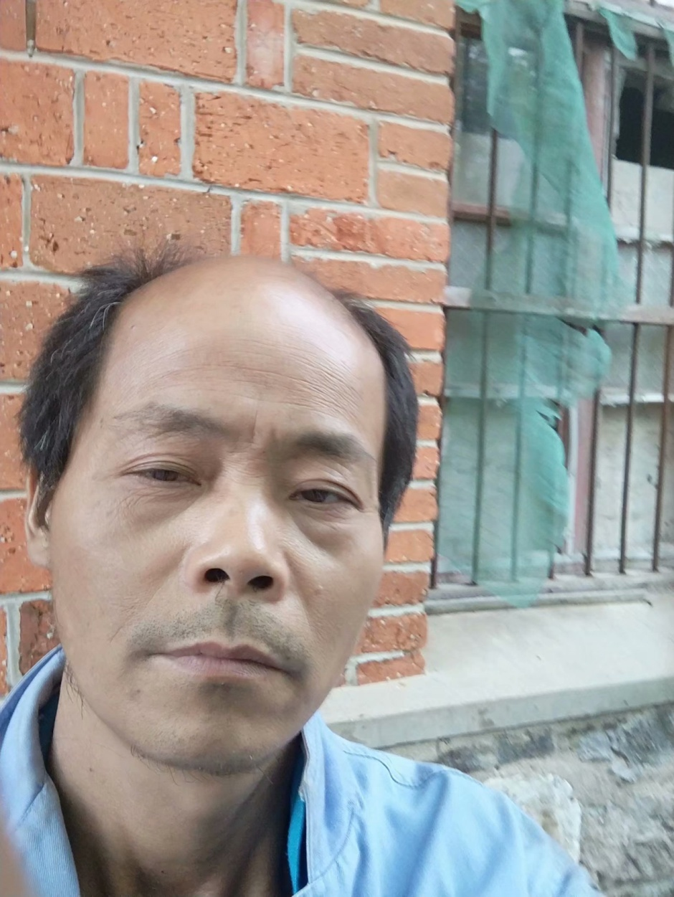

19岁那年初夏我睡在我身后的房子里

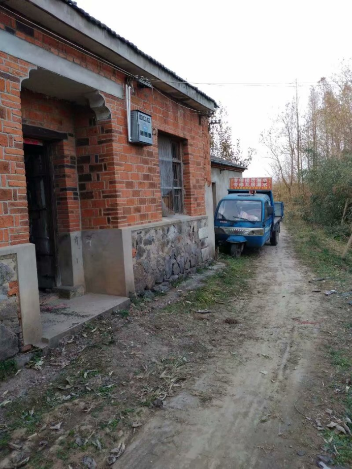

我父母亲可能睡在靠右边的这个房子里

我躺下时间不长，半梦半醒之间，突然感觉到屋子里变得红通通的，我被惊醒后，从床上爬起来，站在床边。看到墙壁上渗出一股发光的液体，这些液体发出暗红色夹杂着一些雪青色的光，当这些液体完全从墙壁里渗到屋里时候，逐渐的变成了几个人形。

这些人身体像无数个飞舞的红色小虫子组合在一起，并且快速的、纷纷扰扰的扰动着。

强烈的恐惧使我不停的颤抖，手脚和咽喉变得僵硬，而且都不听大脑指挥了。

来的这些神秘人不说话，可我脑海里却好像听到了，不知道哪里来的一个标准的男性声音对我讲说：“跟我们一起出去”。

这个时候，我人仍然是很清醒的，也记得很清楚，当时不是做梦。

我正在发愣，突然感觉一股无形的力量从正面猛的扑到我身上，瞬间控制了我，特别是我头部，像被突然灌满了液体和细沙子之类的东西，一种强烈的木木、被东西充实的感觉。

意识好像也被神秘力量强力控制了，变得模糊起来，大脑思考、判断都不利索了。整个人都不清醒了，各种感觉都好像钝化了。身体发飘，走路不稳当了。我也逐渐停止颤抖，害怕感觉也大大减轻了。

我看到他们从墙壁上一穿而过，我好像是看到墙壁变成了半透明的，我也跟着一起穿过去。出去后，我才看到自己光着脚，只是穿了一个汗衫和裤衩，形象尽毁。

我在接触墙时候，墙的土腥气味给我的印象特别深，还有，人在穿墙时候，身体各个部位都是有一种讲不出的感觉，和没有穿墙的感觉是不一样的，感觉有无数微小砂粒在我身体里轻轻的摩擦，并且伴有爽快的感觉。

穿墙的感觉是墙的每一个分子都均匀的从我的身体里穿过去，而不是墙裂开一条缝隙让人穿过去的那一种。穿墙的速度不是很快，和平时走路的速度差不多。

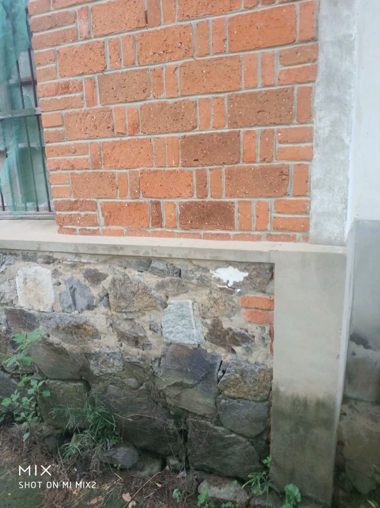

我就是从这儿穿墙而过

我在从墙中要出来时候，脚后跟有一阵木痛，出来以后，木痛立即消失了。

到了墙外，我又看到了两个人，一个人拿出一个东西对着墙壁照射，可能是由于这个东西的照射墙才变成半透明的。

穿墙而过的人和墙外拿东西对墙照射的人，这些人是可以液体、固体随意变化的，他们的身体时时刻刻在微微的抖动，这些人看起来好像有一种飘忽不定的、不真实的感觉，我当时就认为他们这些浮动的人不是真人，可能就是一种机器人，后来得到了证实。

我穿墙出去，虽然是夜晚，这个地方可能存在着光源，我看到的另外一个人，感觉就是真实的人，这个人一眼看上去是一个女性，很像我们幼儿园的小女孩。

我靠近她时候，她好像是害怕的样子，本能的退后几步，和我保持着一定的距离。

她面部有非常迷人的神情，身高大约只有一米，身材纤细而丰满。眼睛很大，眼睑也很大，眼睑饱满而发亮，头部不是很大，眉毛特别的高挑，给人一种很妖艳的感觉。

而且下巴、鼻子、嘴巴都很小，上嘴唇向上翘起，呈现m状。腰极为纤细，到了和身体极不相称的地步，感觉和我的手臂差不多粗。头发是黑色的夹杂着一些雪青色，一束一束的螺旋式的，并且向外膨开。

她的皮肤极其光滑，皮肤的颜色是粉白色的，微微的有一点雪青色，也可能是光线反射的原因，因为以后很多场合没有发现她身上具有这种雪青颜色。

这种粉白色是极为细腻、柔和的那种粉白，是漫反射的那种，不是镜面反射的那一种。

这个人整体印象是很漂亮，很性感，腿和手臂、身体都极为浑圆的感觉，像我们现在的充气皮娃娃，身体结构紧凑，感觉属于运动型的那种。

这些神秘人到底是什么人？夜晚来我家找我有什么事情？恐惧和疑问占据了我的头脑。

这个时候我突然看到一束奇怪、雪白的强光从空中向对地面扫射，像许多银色的粉末厚厚的洒在地上。这束强光给人感觉很密实，密度极高的样子，而且射出的时候是一节一节向前延伸，也、收回的时候是一节一节的收缩。

被光照射到的地方物体看得清清楚楚，但是，周围丝毫没有散光，这个和我们常见的强光一个明显的不同之处，我们寻常看到的强光有散光的。比如我们的手电筒发出的光圈，光圈范围内东西看得很清楚，光圈范围外的地方也能够勉强看清楚。

这个密实的强光扫射到树枝上，树枝能看得清清楚楚的，我顺着光往上看，我看到了巨大的像两个草帽的东西合在一起，无声无息的、黑乎乎悬浮在空中，估计有几十米高的样子，而且离我家不远。底部看不清楚，但是周边圆圆的轮廓看得很清楚。

强光就是从这个东西的地底部发出的，这个巨大东西周围有一排似乎是小灯，闪着不同颜色的暗光。

飞碟！我心里惊叫！因为我看过《飞碟探索》之类的杂志，这个东西就是杂志上介绍的典型的飞碟模样。

啊！我心里一惊，马上意识到这些神秘人可能就是外星人。我要怎么做？逃跑、喊人、呼救？

还没有容得我多想，只是觉得自己身体好像变得有点发轻，随后一秒钟不到又迅速恢复到原来，恍惚之间，睁眼一看，我已经不在我家的墙外了，四周环境突然变了。

我看到了自己已经站在一个圆环形的极为精致的房子中，这个房子好像都是金属制作的，并且是连续的整体，丝毫没有缝隙和拼装的痕迹。整个房子内部有着柔和的光线，但是看不见任何灯泡之类的东西。

房间内部闪烁着金属光泽，做工极为精细、考究。里面摆放的东西很少，摆设是简洁明了。

这个房子，或者说飞碟的内部，看不到窗户和门，房间也呈环绕形状，中心一个巨大的圆柱体，和顶是连在一起的。

虽然记得不清楚，但是，我感觉自己和他们几个人都是从飞碟底部中心位置进来的，好像是被一股吸引力吸进来的。

一个圆弧状的台面上闪烁着一个三维立体图像，画面在不断地在变化，如同放电影，而且画面可大可小，非常的逼真。

如果不是画面的西周整整齐齐的，如同被利刀切割的一样，你会以为这些立体电影画面就是真实的场景。

明显没有看到任何仪表之类的东西，而且一个接近仪表形状之类的东西都没有。没有我们地球人汽车、飞机、高铁常见的控制面板。

我经常在网上搜，和外星人接触的人，能够进入外星人飞船里的，后来都回忆描述外星人飞船里有大量仪表之类。这个和我看到的明显不一样，而且这个场景我记得很清楚。

我现在想起来，他们所有的仪表，可能都在这个三维虚拟图像中体现，而且控制飞船就是通过这个三维虚拟图像来实现的。

桌子边坐着4个没有神情、身体微微抖动的人，我估计是机器人。其中有两个人走到我面前，手里拿着衣服和鞋子，上来帮助我穿上。这衣服的样式和我平时穿的的运动服差不多，但是，很轻，穿着也很舒服。他们又给我穿了一双鞋子，鞋子样式也很像的运动鞋，也非常的轻，穿着舒服。

他们好像还向我耳朵里塞了一个白色的东西，现在记得不清楚。

我猜想这些神秘人真的就是外星人，这个圆房子就是在我家附近空中看到的飞碟。从外面看飞碟不是很大，里面看飞碟是蛮大的。

我是被他们请来了，恐怕是回不去了，有可能永远都回不去了，我心里一紧，恐惧害怕，暗暗叫苦。

很快我的猜测被证实，那四个机器人走到里面，从里面走出三个具有神情的真正外星人，明显看出来一个女性，两个男性。那个女的和在我家墙外出现的女性一模一样，我当时估计就是同一个人。

在飞船内，光线强，可以更加清楚地看着她，她穿着连体紧身服装，感觉她没有骨骼，肌肉什么的，她的身材非常的丰满，极具有流线型，像海豚身体那样的流畅。

从后面看她的臀部很宽，从前面看，两腿之间有着一个丰满的鼓囊囊的圆柱形东西，不知道是什么。

他们的身高都差不多，凭我肉眼是无法看到差别的，都穿着连体紧身服装。

他们三个人站一排，其中有一个男性，长相和那个女人有相同的特征：

大眼睛、大眼睑、小嘴、小鼻子、小下巴，耳朵大而薄，皮肤是柔和、细腻的粉白色，有着一些男性特怔，脸上不像那个女外星人皮肤像充气的橡皮娃娃那样的饱满、丰盈。两腿之间没有女性外星人那种鼓囊囊的圆柱形东西，臀部不是很宽。

他的头发是紧紧贴在头上，像一快完整的黑得发亮的橡胶贴在头上。

这三个人一眼看上去，明显不同于地球上特点的一个是个子小，身材小，像我们幼儿园小朋友，又像我们常见的动漫人物。

另一个特点就是人的身体太过于精致，好像是做工极为精美的人工制作的玩偶，或者充气足足的橡皮娃娃，脸上五官起伏不明显，皮肤的颜色也太过于细腻、纯正，毫无瑕疵。

那个男性走到我面前，用右手按住自己的胸口,可能是他们的见面礼节，像我们地球人见面时候的握手，说了一句话。声音不大，说话不是一个字、一个词吐出来那样的清晰，而是含糊不清，像我们地球人的梦呓，又像婴儿说出的话，又好像是借助于呼吸来增加发声。但是，声音很柔和、稚嫩，像儿童的声音。

后来我了解到他们的呼吸功能退化，导致发声功能退化，但是他们借助于人工场扫描技术，可以相互无障碍的沟通。

我虽然听不懂他的语言，但我的耳部【是不是我的耳朵塞进了翻译器，我当时想到】立即出现一个标准的男子声音，具体内容现在忘记了，只是记得，

“我叫××【后来他们相互对话，好像听到他们叫他诺顿、诺胜、喔腾·····之类的】我是生物学家，我负责这一次旅行·····我们都是陆地人（可能是陆基人），欢迎你到我们的星球来访问旅行·····”

有时候听到他们把他们的星球叫果克星球，果克只是一个发音，有时候又听到他们说他们的星球叫果可、古可之类的，我猜想果克直接翻译成我们的汉语的意思，很大的可能性是“我们”的意思，他可能只是在说欢迎到我们的星球来访问旅行。

我心里说，是你们把我强行带到你们飞船上，不是我自己想去你们那里的。但是，我嘴上没有说出来，只是本能的“嗯”的应了一声。

生物学家诺顿说完，退了回去，另一个男性，长相和他差不多，只是生物学家有着严肃的表情。而这个人表情不严肃，有一些嘻嘻哈哈的神态，他向前跨一步，走到我面前，把右手按住胸口，说了一句话，我的耳部立即出现一个标准男声：

“我叫×××【后来多数场合听到他们叫他苏代尔、舒代哦·····之类的名字，但是有时候叫的差异很大】·····我是物理学家，·····欢迎你到我们星球来旅行。”

最后，那个女性跨一步，把右手按在胸口，说了一句话，我耳部立即出现一个甜美柔和的女性声音：

“····我叫威力····，【后来多次听到他们相互之间称她叫微丽，丽的音拖很长】，欢迎你到我们星球来旅行······。”

她的声音同样柔和、稚嫩，像儿童的声音，但是，明显是女性的声音，他们的发声明显能够区分出男女的差别。

原来这个是他们的欢迎仪式，看来他们是宇宙中很文明的外星人，不会杀害我，或者野蛮的解剖我的身体，我当时的紧张心里一下地轻松不少。

生物学家诺顿继续说话，虽然我听不懂他的话，但是，耳部好像一个翻译器，翻译出一个标准的声音：

“你是我们长期考察的一个对象，你的名字叫张祥前，是吧？按照你们地球人的习惯，你周围的人可能都叫你前哥吧？”

“有人这么叫过，不过大部分人叫我阿前。”

“阿前？我们以后还是叫你前哥吧。我们邀请你到我们星球来，是通过你来做两项非常重要的实验，我们期望获得对我们有用的数字。”

“什么实验？”我好奇的问。

“我们要研究你的脑部，期望找到我们需要的信息。”诺顿回答。

“啊！要不要把大脑切片？”我心里立马又紧张起来，脱口而出。

“活活活，”物理学家苏代尔立即笑了起来，他的上半身随这个笑的节奏抖动起来，耳部出现了这样的话：“你们愚蠢的地球人才喜欢这样做。”

看到他的笑，我当时心想他这个动作、神态，不就是我们地球人吗？他们可能只是地球上某个地方来的小矮人，用特殊的打扮，或者只是穿一件透明的、紧身橡皮衣服来骗我，想把我带到地球的某一个地方去，好实施他们可能有着什么不可告人的目的。

但是，我一想到那个叫微丽的女子的细腰，地球人哪有这么细的腰？地球人哪有那种三维虚拟图像？我的沮丧心情又涌现上来。

我当时这样想，其实是很害怕是真的离开了地球，担心自己可能永远不能回家。抱着一种仍然只是在地球上跑的侥幸心里。

“啊，不会的。”诺顿安慰我，

“我们将使用我们的人工场扫描技术来研究你的大脑，人工场可以发出场这种自然界的无形物质，即使深入到你大脑内部，都不会对你大脑有任何影响的。”

“地球上那么多人，我的大脑特殊吗？为什么单单选我？”我仍然感到不解，我只是心里在想，没有说出来，生物学家诺顿好像猜透我的心思。

“你小时候在田野上放鹅，遭遇了一些宇宙中具有特别高级文明的人种，他们的文明程度、科技发达程度远远的高于我们。

如果用时间来表示文明的程度，我们是万年级别的文明程度，而你们地球上只能算是千年级别的文明程度，这些特别高级文明的人种，他们的文明程度是百万年级别的，他们的文明程度和科技的发达程度，很多都是我们难以去想象的。

这些宇宙中具有特别高级文明的人种，他们的意识可能已经侵入了你的大脑，你拥有了这些特别高级文明外星人的部分记忆，我们要把你这些记忆扫描记录下来。当然这个只是我们的期望，也可能是做不到的，希望能够得到我们想要的。”

我立即回想起大约在七、八岁时，我一个人在一块沙地上放鹅的那一次经历。

“要我怎么做？”我对诺顿说。

“我们将用人工场扫描技术，远程的、非接触方式来扫描你的大脑。只要你听我们的话，服从我们的安排，配合我们的实验就行了，不需要你做什么。”诺顿说，

“我们会让你参观我们星球许多地方，你将有许多奇妙的经历，会增加许多你们地球上没有的知识，得不到的阅历，丰富你的人生，当你回到地球，这些经历会改变你的命运，你将成为你们地球上的名人、富人。你将成为改变你们地球命运的关键人物，未来会有许多人崇拜你······【涉及敏感政治，这里省略】一直到你们的地球人在宇宙中消失之前，都会有无数人一直记住你的名字。因为在你们地球上，你将是第一个知道时间秘密的人。

在宇宙中，有许多高度发达的文明星球，无论是在哪一个星球上，第一个知道时间本质的人，是所有著名科学家中真正的王者，都会被当做神来崇拜，一直到他们的文明从他们的星球上消失的那一天，都不会被人忘记。

为什么会是这样？因为时间的本质是宇宙最核心的秘密，破译时间的本质，其重要性是无与伦比的，可以引起整个星球剧烈的变革，任何一个科学发现都无法与之相比······。

我们不久将告诉你时间的本质，虽然你只是从我们这儿得到了时间的本质秘密，不是你自己的独立思考得来的，但是，不妨碍你仍然毫无悬念的成为你们地球上第一个知道时间秘密的人，你们地球人可能并不关心你是怎么得到时间的秘密的，未来，你可能只是凭运气，在你们地球上被当做神一样的存在。”

生物学家说我以后怎么怎么的，我一点儿都高兴不起来，因为我那时候的梦想只是能够娶一个漂亮的、温柔的、身体娇小玲珑的老婆，在老家盖一个带大院子的大房子。至于宇宙中时间的秘密，国家、地球人的命运与我是八竿子打不着的事，我压根就没有想过那些问题。

一听到要扫描我大脑，我又立即紧张起来。

“不会有任何问题的，我们的技术绝对安全！”苏代尔凑到我面前，带着一些诡秘的神情，耳部立即出现这样的话，

“你这次在我们星球短暂的旅行中，我们还会给你安排一个漂亮的女友！”

物理学家说着话，眼睛对微丽瞄了一下，微丽把头一杨，露出似乎是傲慢不屑的神态。

“这一次请你来，还要做另外一个实验，”诺顿继续说，

“我们要求你和我们星球上不同的女性做各种性爱实验，并且同时记录下你脑部意识、各种感觉、以及身体其他部位的各种运动信息。

我们要把这些信息翻译成数字，这些数字对我们很重要，也是我们一个重要的财富来源。当性爱活动转化为数字后，就可以作为交换的商品，你们地球人可能不能理解这个。”

“我们所在的星球实际不止一个，严格的说是一个星系，在主星球周围有许多星球，就像你们地球周围存在着许多行星和卫星。”苏代尔插话：

“主星球附近的几十个星球上都有我们的人，不同的星球生活着许多不同种类的女性，身体的外部形状是各种各样的，其怪异的程度可能你是无法想象的，以后你会遇到的。

当然，我们会尽可能挑选一些和你们地球上女性身材接近的人种，和你发生性爱关系。如果身体外部形状的差异太大，我猜想，你对她们的身体不会激发出一点点的性欲。

比如说，你们地球上一个男性，对母猪、母牛可能会激发一点点性欲，因为母猪、母牛的身体和你地球人的身体多少有一些接近，有着一些相似的性器官，如果你面对的是一只龙虾，将不会激发一点儿性欲的。”

苏代尔的话让我有些担忧,是不是强迫我去和那些母猪、母牛之类的动物发生性关系，和像微丽这么漂亮的女孩发生关系，那该多爽啊！可能这些家伙就是变态吧,不会轻易的随我所愿。

这个时候，那两个身体微微抖动的人，可能是机器人，走到我面前，一个人手上方带着一个立体画面，画面是我家住的房子，另一个人手上的立体画面，画面是一个瓶子里面药水泡着一具地球人尸体。

其中一个机器人对我说，“从现在开始到结束，你乖乖的听话，完全服从我们的安排，结束后我们就把你完好无损的送回家。”说完，这个机器人把我家房子的三维立体影像给我看。

另一个机器人又说，“如果你不听话，反抗，不服从我们安排，这个就是你的下场。”

这个机器人说完把药水瓶泡人身体的立体影像给我看，看得我毛骨悚然，心惊肉跳，心情顿时又紧张起来，之前对他们的好印象瞬间崩塌，他们可能是邪恶的，我这一次可能是凶多吉少。

我心理极度不安，剧烈的恐惧了一会儿，又在安慰自己，他们抓我来，目的就是做两个实验，不接触我的身体来扫描我的大脑，不会对我有什么伤害吧？他们要什么性爱数字，叫我和他们星球上女人性爱，不至于被折磨死吧？况且我现在没有女朋友，没有性体验，正性饥渴呢。

“你们的星球在宇宙什么地方，是不是在银河系里？离我们地球有多远？”

“这个问题，按照我们的习惯，是不会回答你。”

“我要在你们星球呆多长时间？”

“按照你们地球上时间，大概一个月。”

“这么长时间，我的家人会非常着急的。”

“不会的，我们的时间流逝和你们不一样，你参观我们星球的时间加上飞船来回的时间，都不会超过你们地球上的一夜时间，我们会在天亮之前会把你送回来的，没有人发现你到我们星球来旅行，包括你的家人。”

诺顿的话我将信将疑，“你们有这么大的本事？你们能不能使时间倒流？”

“时间倒流我们是做不到的，时间的倒流就是要改变时间流逝的快慢，似乎可以通过改变时间流逝的快慢来达到时间倒流的目的。

但是，时间流逝的快慢是一个比较概念，宇宙中不同的星球，不同的地方时间流逝的快慢可能是不一样的。只是通过两个不同的地方相互比较，时间流逝的快慢才有意义，你说同一个地方时间流逝的快慢是没有意义的。

比如，我们说你们地球上一个人比另一个人个子高，有意义；自己比自己个子高，就没有意义了。

我们用人工场扫描技术，对某一处空间照射，可以使局部空间充满能量场，来达到改变时间流逝的快慢，这种技术可以使一个地方的时间流逝慢于另一个地方的时间。这个在我们在星球上叫时间的势差概念。

相反也我们可以做到，就是可以使一个地方的时间比另一个地方的时间流逝得快。

同一个地方没有时间快慢的概念，时间倒流是做不到，因为时间倒流首先要求是在同一个空间区域所发生的事件。”

诺顿很有耐心的解释，可是我脑子木木的，听不明白。

“我们现在也可以局部的空间区域里实现一些时间倒流现象，但是，只能使某一个事件迅速的倒退到以前的状态，再重新开始，完全的、纯粹的、逐步的时间倒流现象我们做不到。”物理学家苏代尔的补充解释我是更加听不懂。

“还有什么问题吗？”诺顿盯着我的眼睛问，我的耳部出现这样的话，

“如果没有什么问题，我们现在就驱动飞船返航。”

诺顿用手在圆弧形状的桌子上一个黑色的两个火柴盒大小的东西上按了一下，那些立体影像立即消失得干干净净。

诺顿又用手在这个黑色的东西上重新按了一下，圆弧桌子上突然的出现了一个白色的、细腻的、西西方方的立体烟雾块，随后这些烟雾又变成了三维立体画面，上面闪现着一些我不认得的文字，诺顿用手指在操作。

我的耳部传来一个清晰标准的、甜美的女性声音，“区图300启动自动安全返航模式，中心坐标2394····，起点坐标1436·····，终点坐标6452····圆位移角度42····起飞质量0.450，变化时间0.6s，飞行质量状态·····”

我的身体突然感觉一轻，我猜想，我们已经飞向他们的星球。

二，飞行途中聊飞碟

每当我的身体感觉一轻，总是听到耳部不知道是从什么地方传来的一个轻柔甜美的女性声音，在不停的说话。我看到了立体屏幕上出现一个星球，随后又迅速地消失了。

他们把飞船启动起来后就没有事情了，让那些机器人看着立体屏幕操作飞船，
我们开始聊了起来。

我很好奇的是这个飞船，也就是对我们乘坐的飞碟产生了兴趣。

“我们乘坐的这个飞船，就是我们地球人经常提到的飞碟吧”？

“是的。”

“飞碟飞得的很快是吧，我看到我们有一个杂志上说，飞碟最快的时候，可以以光的速度飞行，也就是每秒钟30万公里，是不是这样的”？

“是的，飞碟最快是以光速在运动，”苏代尔说，

“飞碟有三种时空状态。一是零质量的激发态，这种状态下飞碟静止质量为零，有一个确定的运动质量，并且始终以光速运动着。

飞碟这种状态其实和自然界中发出的光的时空状态是一样的。

二是微小质量的准激发态状态，飞碟这种情况下，质量按照你们地球上的标准只有万分之一克左右。可以静止，可以以小于光速的任意速度飞行，可以在你们地球表面空气中悬浮，也可以随时激发为零质量的激发状态。

三是处于平常状态，里面的质量变化动力系统关闭，具有一个和平常物体一样确定的质量。”

“你们的飞碟这么牛，其飞行原理是什么？一定很复杂深奥吧？”

“飞碟飞行原理其实很简单的，用你们的汉语描述只是一句话。”苏代尔说，

“宇宙中任何物体，如果你使它的质量变成零，就在变成零的刹那间，会突然以光速运动。这个就是光速飞碟的飞行原理。”

飞碟的飞行原理这么简单？大大出乎我的预料。可是怎么能够使物体质量变成零呢，我想这才是一个真正的难题。

“自然界存在着两种截然不同的运动方式，一种是量变，一种是质变，普通的运动就是量变，你们地球上的科学家牛顿、伽利略很好的描述了这些运动。

你们地球人掌握了的飞机、汽车的运动原理，动量是质量乘以速度，受力就是动量随时间的变化程度。你们的飞机只能在地球大气层内飞行。

而我们飞碟的动量是矢量光速减于飞碟运动速度再乘以飞碟质量，飞碟受力也是飞碟的动量随时间变化的程度，不过，飞碟只是质量在随时间变化。

速度的变化是突然的，从零可以突然达到光速。速度只有开始时候的一个初始速度和光速这两个量，速度的变化不是连续的，”诺顿解释道：

“我们的飞碟的运动原理是另一种运动方式-----质变，也就是飞碟的质量可以随时间变化。当这个飞碟的质量从某一个量变成了零，飞碟不需要再另外用力加速，就一定会以光速一直惯性运动下去，除非遇到内外原因来改变这种运动状态。

宇宙中任何相对于我们静止的物体，周围空间都以光速向四周发散运动，这个就是物体产生质量的根本原因，质量表示物体周围光速运动空间位移的条数。

如果你想办法使物体周围空间的光速运动消失，那这个物体就没有质量了，质量为零的物体不需要另外施加力，就一定相对于我们以光速运动。”

我似乎听懂了一些，就问：

“那你们的飞碟就是可以以光速飞行，我在我们地球的书本上看到，宇宙空间中，一般星球离我们的距离都是很多光年，你们的飞碟就是以光速飞行也是要很多年的？你怎么说飞到你们星球只要几个小时，难道你们离我们很近，就一直隐藏在我们附近？”

“当物体以光速运动的时候，沿运动方向所在的空间长度为零。”诺顿的话让我有些吃惊。

苏代尔补充道：“就是你们地球上人所说的，远在天边近在眼前。”

“沿运动方向的空间长度为零，那你们飞碟以光速飞行时候岂不是不需要时间?那你们飞碟飞回你们星球为什么要几个小时？”

“比如，一个质量450吨的飞碟，飞碟起飞时候如果从450吨变成零，这个过程需要时间，这个叫转换时空状态。飞碟降落时候从质量为零变回450吨，这个过程也需要时间。

实际上，飞碟在我们星球时候，首先用外部的电能或者场能量，使飞碟的质量减少到一个很微小的量，比如0.450克，达到准激发状态。起飞的时候，再用飞碟自身携带的能量，使飞碟从0.450克到零，飞碟质量一旦变到零，就处于激发状态，不需要另外施加力，就一定突然以光速运动起来。

当飞碟到了你们地球，也不是把质量变到450吨，而是变到一个很微小的量，为什么要这么做？是为了节省能量。因为飞碟质量变化、转换时空状态需要很大能量，而飞碟自身不能携带过多能量。飞碟的能量方程就是飞碟的质量乘以光速的平方，从这个方程看，飞碟质量变化是需要巨大能量的。”诺顿解释道：

“当有稀薄的气体档在飞船前面，我们可以使用飞碟产生的场使这些气体转换时空状态，使气体的质量也变为零，和我们飞船不发生相互作用，两个质量为零的物体相互穿越是不会发生相互作用里的。

这样我们的飞船就可以穿过去，不会对我们有任何的影响。或者用飞碟产生的场直接把气体推开。由于场是无形物质，和空气摩擦可以不产生声音，这两种做法都可以使飞碟在空气中飞行无声无息。

但是，如果遇到了一个星球，我们是没有办法使整个星球质量为零，没有办法使整个星球转换时空状态，原因是需要的能量特别巨大。

那只能避开星球，避开星球时候，飞碟要转换状态，如果我们飞碟在返航途中，没有星球阻隔，我们飞碟只是在起飞时候质量变化时候需要时间，到了我们星球时候，飞碟降落时候质量变化需要时间，而中途飞行时候不需要时间。飞行途中几个小时，主要是在转换时空状态来避让星球。”

苏代尔说，“按照你们地球上的相对论，假定我们星球离你们地球有50光年远，一个飞碟从我们星球出发，以光速飞到你们地球后立即返回，你们地球人和我们的人都认为飞碟来回需要100年，只是飞碟内部的乘客认为来回只是需要几个小时。”

“你说这个是不是真实的？如果是真实的，那你们星球上也是要慢慢等待你们回来，你们来一趟地球也是不容易的啊。”我说。

“真实情况下，还要考虑我们星球和你们地球之间的时间流逝的快慢，宇宙中不同星球上时间流逝快慢是不一样的。

当然，这一切可以人为的改变，飞碟起飞的时候，我们用人工场扫描使飞碟周围空间处于一种能量场中，可以人为的改变飞碟周围的时空，飞碟从这里个特殊的能量场中出发，和从我们星球出发完全不一样，其结果是我们星球上的人，根本就不要等待100年，可能只需要等待几个小时，这个取决于能量场的强度。”

苏代尔这个话，我根本就不能理解。

“我们地球人对你们的飞碟也有观察，发现你们的飞碟突然剧烈加速运动，里面乘客受力也是巨大，我想问你，你们是怎么减轻飞碟里面乘客的受力？还是你们的人身体特殊，可以抗击超过地球人几百倍、上千倍的受力？”我问道。

“飞碟是以零质量或者微小质量飞行，里面乘客受力是加速度乘以质量，质量为零加速度即使巨大，乘客受力仍然是零，或者很微小。飞碟零质量或者接近于零，和别的物体的碰撞力、摩擦力为零或者极为微小，这个也是飞碟在你们地球空气中飞行没有声音的一种解释。”物理学家苏代尔给我解释。\ |飞碟啊|

我似乎有些理解了，继续的问：“要怎么样才可以把飞碟造出来啊？或者说飞碟是怎么造出来的？”

“你回到地球想把飞碟造出来？”微丽反问，“你造出了飞碟，你好坐上飞碟到处乱跑。”

“活活，”苏代尔笑了，“如果前哥驾驶时候不小心，跑到他们地球附近的火星上，不知道怎么回来，那麻烦就大了。”

“那前哥干脆就在火星上生活，”微丽有些嘲讽的说，“如果前哥有个地球的女朋友，他们就惨了，相互仰望天空，无限悲切，他们的电影就经常出现这个镜头，不是么？”

“我没有女朋友，我也不想到火星去。”我想反击他们的嘲讽，但是忍住了。

诺顿说：“凭前哥一个人的力量，怎么会造出飞碟，如果他掌握了飞碟的原理，而且他们地球人相信了他的理论，地球人就会发疯的投入力量去研制飞碟，就像地球人当初研制原子弹那样，只有这样，地球人造出飞碟才是有可能的。”

“那研制一个飞碟，要多少钱？”我问。

“和你们地球上研制原子弹的费用差不多。”诺顿回答。

“毫无可能的，当前哥回去了，告诉他的地球同胞，飞碟是怎么一回事情，应该怎么样才可以做出飞碟。啊，结果你们猜怎么着？他的地球同胞说，奥！哪来的疯子、神经病，尽是胡说。”苏代尔歪着头继续嘲讽的说。

我觉得苏代尔的话刺耳，但是，这种可能性是最大的。

“那你们飞碟肯定要携带许多能量，你们用的是什么能源？”

“核能，中子能量都可以，别忘了，飞碟长途飞行中属于惯性飞行，不需要能量，只是在开始起飞时候质量变成零，转换时空状态需要巨大能量。飞碟在我们的星球上起飞的时候，我们先用外部电能或者场能，使飞碟质量大幅度的减少到一个微小的量。”诺顿提醒我说。\ |https://mmbiz.qpic.cn/mmbiz_png/ctwXrXAibr6KkkH0RRtHxzZMPsY1SUTt1d1ws3Nsz32XxggHNfgv5ibKfNNormSTia2QAcDItKCUtgeyyG9Os45Sw/640?wx_fmt=png&tp=webp&wxfrom=5&wx_lazy=1&wx_co=1|

“那你们的飞碟为什么要做成圆圆的碟子状，飞碟飞行的时候，是沿着哪一个方向？飞碟的动力系统大概是什么样子，是怎么一回事情，能简单说一说吗？”我问。

“飞碟实际上和你们地球上的加速器差不多，飞碟边缘的圆圆部分就是环绕带电粒子流。

这些带电粒子是同一种电荷，相互排斥，所以，密度不能提高。让这些带电粒子高速环绕运动，可以把电场转化为磁场，这样做就

可以增加电荷的密度。

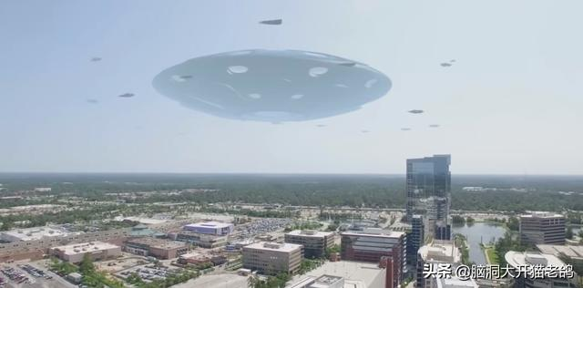

小型的飞碟的门一般开在飞碟的底部，如果开在侧面，会破坏飞碟的环绕带电粒子流。大型飞碟一般携带大功率的人工场扫描设备，扫描飞碟外壳，使飞碟外壳处于激发态，使人员直接从飞碟外壳进出，一般是不需要留下门的。

飞碟光速飞行的时候，运动方向和飞碟的碟面是垂直的，并且满足右手螺旋关系，设想我们用右手握住飞碟，四指环绕方向和飞碟边缘线方向，也就是内部带电粒子环绕运动方向一致，则大拇指方向就是飞碟的运动方向。

如果飞碟到了你们地球上空，以普通速度飞行，可以用人工来驾驶，其飞行方向可以沿飞碟侧面任意一个方向。

飞碟的动力系统，基本原理是电磁场和引力场的相互转化，电荷匀速直线运动和加速度运动都可以产生引力场。

匀速直线运动电荷产生沿运动方向相反的引力场。

加速运动的电荷产生的磁场是变化的，曲面上分布的磁场发生变化的时候，可以产生沿曲面边缘线分布的线性引力场和线性电场，并且在某一个瞬间，变化磁场和产生的电场、引力场三者是相互垂直的。

运动电荷产生的引力场是连续分布，万有引力产生的引力场是以一个点为中心对称分布，如何把连续分布的引力场变成点对称的引力场，这才是关键。

你们地球上科学家法拉第的电变磁、磁变电，利用电和磁的相互转化，产生了许多影响你们地球人的应用。

飞碟的飞行原理也是利用电磁场和引力场的相互转化，法拉第说变化磁场产生垂直方向电场，其实在另一个垂直方向就是引力场，这个时候变化磁场、电场、引力场三者是相互垂直的。

如果你们地球人掌握了电磁场和引力场的相互转化，不但可以造出飞碟，也可以有许多其他不可思议的惊人的应用。”

诺顿的解释我是难以听懂，有很多飞碟的问题我也不再问了。

“那你们经常这样驾驶飞碟到别的星球考察，是吗？”

“是的，你们地球上我们来了很多次的。”诺顿肯定了我的猜测。“你也是我们长期的考察对象。”

三，果克星球的超光速通讯

我们沉默了一会儿，我突然想起来，就问：“你们的飞碟怎么驾驶？”

“飞碟速度太快，人是无法驾驶的，我们的飞碟都是计算机预先设定程序驾驶。”苏代尔家说，

“飞碟内部和外部的时间流逝的快慢是不一样的，不但飞碟内部和外部时空不一样，飞碟的驾驶部分所在的区域时空和飞碟别的区域也不一样的。

我们的飞碟想飞到某一个星球，需要预先测量这个星球和我们星球的距离和坐标，利用飞碟运动时间来控制飞行距离，把驾驶程序设定后，才可以飞去。”

“那你们这个测量是不是要非常准确，如果测量错了，飞碟会不会出事故的？”我问。

“那肯定的，测量不精确的，飞碟和你们飞机出事故那样，一头载在星球上，也是机毁人亡的。我们先用设定的计算机程序，控制飞碟以光速接近你们地球，到了你们地球附近，使飞碟转换时空状态，以远小于光速继续向你们地球飞行。”苏代尔说，“不过，这个测量在我们这里不是什么难事情。”

“你们是用激光测量吗？”我问。

“不是的，我用场来测量。”苏代尔说，“你们地球人测量用激光，算是最先进的。我们用场来测量，场的本质就是圆柱状螺旋式运动变化的空间，用场测量，比激光要先进得多。

测量要涉及到信息的传递，你们地球上用激光测量月球的方位和到地球的距离，需要激光反射回来才可以确定。这种方法有很明显的缺陷，就是离你们地球上很远的星球，激光无法发射到，因为有能量的耗散，另外激光发射、反射速度是有限的。

而用我们人工场扫描，能量的耗散为零，不但可以发射到很遥远的星球上，而且场可以超光速运动。场的本质就是非实物的空间，可以不受物体运动速度不能超过光速的限制。

我们现在不仅仅是利用场来测量遥远星球的距离和方位，也是用人工场扫描来相互通讯，人工场扫描通讯比激光和电磁波要优越得多。”

“比如说，你们地球上人们开着汽车，用电磁波相互通讯，基本上行得通，因为电磁波速度是光速，远远的超过汽车的速度。如果我们开着光速飞碟宇宙中到处跑，再用光速的电磁波来相互通讯，那就是笑话。”苏代尔说，

“所以，超光速的人工场扫描通讯，是我们理想的选择，也是唯一的选择。”

“在你们星球上，也是利用人工场扫描来相互通讯吗？”我问。

“那当然，在我们星球上，都是利用人工场扫描来通讯，场通讯的优势是电磁波通讯没有办法比的。”苏代尔说，

“比如，在你们地球上一个很深的地下煤矿里，发生了矿难，矿井通道被厚厚的土层掩埋，你们地球上的电磁波信号穿不过厚厚的土层，无法和外面联系了。

但是，如果换是我们。我们利用场这种介质来通讯，场的本质就是空间，空间作为介质，可以穿过整个星球，就不存在这个障碍了。

比如，我们探测星球内部，预测地震，人工场扫描很方便。

场传播信息，不但穿透力强大，几乎没有东西可以阻挡，而且传播过程中能量耗散极小，衰减小，甚至可以达到零，可以传播到很远的地方。只是在信号发生和接受时候需要能量，长途传播不消耗能量。

场传播信息，还有一个明显的优点，就是速度比电磁波更快，理论上几乎可以达到无穷大的速度。

电磁波传播的速度是光速，而根据你们地球上的相对论，宇宙中最快的运动速度就是光速，空间传播信息的速度可以比光速还快，这个是怎么一回事情？

空间是一种特殊的物质，和普通物体粒子很不一样，普通物体粒子具有质量和电荷。普通物体运动速度不能超过光速，因为普通物体粒子其速度接近光速，其质量和运动能量趋于无穷大。

电磁波和光本质是电荷加速运动，产生了反引力场，使电荷粒子，一般情况下是电子，电子的质量和电荷特性消失而处于激发状态，以光速运动起来。

光其本质也是一种物体粒子，其波动性是空间本身的波动，光其实是静止在空间中，随空间光速运动而一同运动，其速度也不能超过光速。只要是物体粒子，自然状态下其运动速度都不能超过光速。

但是，空间由于没有质量、没有电荷，和普通物体不一样，其运动速度不受这个制约。”

“利用场来通讯，是一种最高级别方式，”诺顿说，

“因为宇宙只有物体粒子和空间两种东西构成的，凡是利用物体粒子通讯，来处理信息，都是落后的，利用空间传递信息才是最为先进的。”

“我们不光利用空间来传递信息，在我们的星球上，还利用空间大规模的处理信息。”苏代尔说，

“我们的电脑和全球公众信息网，就像你们地球上的电脑和互联网，我们的电脑是虚拟的，公众信息网主要靠空间来传递信息。

我们通过人工场扫描技术，可以使我们所有的人的大脑通过空间，时刻不间断的和公众信息网、别人无缝连接。

所以，我们不需要电脑等其他设备，就可以和别人沟通、联系，还可以上网。

我们现在存储信息也是在利用空间，我们有一个关于空间与信息的定理：

宇宙任意一处空间，可以存储整个宇宙今天、以前、以后所有的信息。换句话，空间存储信息的能力理论上是无穷大的。

只是，在实际操作的时候，空间存储信息的能力受到其他一些条件制约，虽然不是无穷大，但是，空间存储信息的能力在你们地球人看来，也是十分恐怖的。

当然，你们地球人现阶段只是知道石油、煤、金属这些看得见、摸得着的东西很重要，很值钱，没有意识到数字也很重要，信息、数字很值钱。

你们人类早迟有一天，也会认识到空间里隐藏的奥秘，大规模的利用空间来传播、处理信息的，存储数字。”

特别是你们地球人可以研发出光速飞行器后，大规模星际旅行时代，光速飞行器如果要用传统的光速电磁波来通讯，肯定是一个笑话。

光速飞行器必须要这种瞬间到达的、接近无穷大运动速度的通讯模式，就是利用空间本身运动，类似与你们地球上量子力学中量子纠缠那种模式。”

大约过了一个小时左右，我看到飞船内部的三维立体图像突然消失，那几个红色的、身体微微抖动的机器人，身体突然收缩到一块，变得很小，颜色变得紫红，像液体水珠子那样散落在地上，后又钻入飞船内部不见了。

神秘的标准声音又在我脑海中【感觉不是在耳朵中】出现了，“果克星球到了，我们现在下去。”

不知不觉中，我们已经到了他们的星球。我的耳部传来一个柔美的女性声音，在不停的说话，好像在介绍着什么。

他们几个人站了起来，“飞行结束了，已经到了我们的星球，我们下去吧。”

四，到了果克星球的飞碟仓库

我一阵激动，心里想象着这个星球是什么模样，我想这个星球科技高度发达，肯定是非常的繁华，大街上肯定是人来人往，非常的热闹，人们的穿着肯定是非常的时髦、甚至稀奇古怪。大楼一定非常漂亮、高大气派，各种古怪的汽车在跑，可能是汽车在空中飞呢·····。

这个星球有没有什么大的领导人来迎接我们？或者有个什么群众欢迎会什么的？

我们不是走下去飞船的，只是感觉身体一飘，眼前景物大变。我们离开飞船了。出现在我眼前的没有欢迎入群，也不是这个星球城市的繁华大街，我想这里应该是飞碟仓库吧？

许多大小不一的飞碟在架子上。有一架飞碟周围来了几个机器人，围着这个飞碟，可能就是我们刚才乘坐的飞碟。\ |https://mmbiz.qpic.cn/mmbiz_png/ctwXrXAibr6L0dcCV7g48fCqyVNmZJtJ8yFCiabkDv3Z9XPsezSIZD1t0icqiaNG9iceG99n92pVaKRqAjwZh8Zjx9Q/640?wx_fmt=png&tp=webp&wxfrom=5&wx_lazy=1&wx_co=1|

我现在近距离的看着刚才我们乘坐的飞碟外部，明显是金属外壳，铅灰色的，没有焊缝，外表没有任何窗户、孔洞之类，也看不到突出的灯，但它是怎么能够向外射出来光线？

这个飞碟到达地球时候，可以悬浮在地球上空，人员是不是就从底部进出？飞碟内部因为一个很粗的大柱子，大柱子中间是空的和底部门连着？

这个时候，我的大脑木木的感觉消失，和正常情况下一样清晰了，人的精神也好起来了。

我抬头仔细的观看了这个飞碟仓库，非常的巨大，一眼望不到头，而且非常的高，有几十层大楼高，架子上放着许多层飞碟，大小不一，悬殊很大。

我站在地面，心想这么大的仓库，空间这么大，他们的墙壁和屋顶是什么材料做成的。

我当时想，这些材料可能地球上是没有的，因为房屋太过于巨大，跨度估计有几十公里长，中间又没有一根柱子，感觉是不可思议。

而且，我站在地面，觉得自己的身体比地球上重了不少，感觉有点吃力。我想这个星球的引力肯定比我们地球上要强，这个就要求屋顶材料强度要更加的超强。

我望着屋顶，心想这样大的跨度，他们仓库是用什么特殊材料制造的？

仓库的屋顶太高，我看不清楚。我走到了仓库的墙壁，仔细的观察起来，发现仓库墙壁是柔和细腻的黄色，非常的细腻，毫无瑕疵。

我感到不解，一个墙壁，有必要做的这么考究吗？我再仔细的看一看，发现墙壁就像飞船上那些机器人的身体，像无数细腻的微小东西组合的，在微微的抖动，这种抖动不是整体有规则的在抖动，这些微小东西给人一种纷纷扰扰的感觉。

我又用手去摸一下墙壁，发现墙壁是空虚的，我的手好像被一股无形力量挡住，我的手越往里伸，阻力就越大，这种阻力如同两个正极对正极的磁铁相碰而相互排斥一样。不过，我感觉这个排斥力是非常强大的，一般吸铁石是没有这么大的力。

“这个墙壁应该是虚无物质做的吧？”我心里问。

“对！这个是人工场产生的一种虚拟建筑，就是从这个墙壁底下那那些很小的黑色东西发出来的。这些黑色东西叫人工场发生器，它发出了两种场，一种以平面对称的斥力场，和你们地球上的引力场正好相反，以一个平面为中心，可以把一切东西向外推。

平面中间部分叫光线凝固场，可以把外界照射来的光线凝固在一定的空间范围内。你看到的黄色光，这个是光线凝固场只是选择了凝固黄色，放弃了其他的颜色。

我们也可以选择凝固蓝色、红色、绿色-----及其他颜色，只是根据设计者的喜好而已。

这些光线是周围环境中采集的，如果是在夜晚，光线采集的量少，你看到的墙壁就暗淡一些。”

那个神秘的标准男性声音又在我脑海中出现了【这一次不像是在我的耳部】，继续对我说，

“你很聪明，认识到墙壁和屋顶都是虚拟的，其实只是一种能量存在形式。如果一按人工场开关，墙壁和屋顶都立即消失得干干净净。

如果受到物体意外的撞击，这些虚拟墙壁和屋顶也可以经受抗击，其强度要远远的高于真实的墙壁和屋顶，不过，仍然有个限度。

如果撞击的速度和力量超过一定的极限，物体仍然可以撞进来，对虚拟房屋内部的物体造成破坏，这个也取决于我们设计的强度，很显然，强度的级别和能量成正比。

你可能对此感到奇怪，我们的星球其实就是一个高度虚拟化的星球。”

没有想到，踏上了这个星球，遇上第一个不可思议的东西竟然是虚拟墙壁。

五，初识全球公众信息网

“你们的星球在银河系里吗？离我们地球有多远？”我在心里问。

那个标准声音这一次没有回答我。

这个声音从哪儿来的？从在地球上我老家的房子里，一直到这里，这么一直跟着我，一直在我耳朵里说话。有时候又好像在我脑海中自然而然的出现，不像是耳朵听到的。

是不是塞在我耳朵里那个白色的东西，就是他们的一个翻译器？可又是翻译了谁的话？谁在和我说话？谁在告诉我？

还是存在了另一个我，在回答我？那个标准声音沉默了，仍然没有回答我。

“你是谁，我看不见你，你怎么总是能够跟着我？”我在心里问。

“我是区图300飞碟信息服务的智能系统，可以远程的为你提供两种语音服务，一种是我们使用的截频技术直接把语言信号输入到你的大脑中，另一种是把声音输送到你的耳朵里。”

“在我家里听到的声音，也是你吗？”我在心里问、

“是的，那时候区图300飞碟就在你家上空，为你提供语言信息服务。现在虽然已经踏上了我们的星球，但是，你现在离区图300飞碟仍然很近，仍然是飞碟里面的设备在为你提供语言信息服务。

我们的星球有两大网络，一个是全球公众运动网，可以令物体、人员在全球范围内光速移动，一个是全球公众信息网，可以在全球范围内为每一个人提供信息服务。”这个标准声音说，

“只要你走出这个飞碟仓库，区图300飞碟的信息服务智能系统将不再为你提供信息服务。

全球公众信息网将接替我，为你提供信息服务，全球公众信息网功能强大。只要处在在我们的星球上，至少可以为你提供四种信息服务：

一种是利用截频技术把声音信息直接输送你大脑里，一种是利用截频技术把三维立体图像信息直接输送你大脑里，一种是人工场扫描技术远程造声音输送到你的耳朵里，一种是人工场扫描技术远程的制造三维立体图像出现在你眼前。所有这些都是远程、非接触式输送的。”

后来，我了解到，他们的全球公众信息网就相当于我们现在的互联网，他们每一个人的大脑都可以直接连入全球公众信息网，他们的全球公众信息网可以通过空间来传输信息。这样，他们的人在他们星球上时刻可以和全球信息网、全球运动网不间断的连接着。

所以，他们很多知识都不需要学习，需要了解的时候，直接就可以通过大脑进入全球信息网搜索，这个和我们现在上网查询资料是一样的，特别是一些死记硬背的知识，他们根本就不需要学习。他们也没有我们学校之类的场所。

对于一些灵活的、创造性方面的知识，他们用所谓的“截频”技术，就是用一种人工场【是一种能够产生自然界中场这种无形物质物质的装置】扫描技术，在人大脑外部向人大脑内部，用非接触的方式扫描输送信息。接受人躺在床上，一觉醒来，就掌握了很多知识。

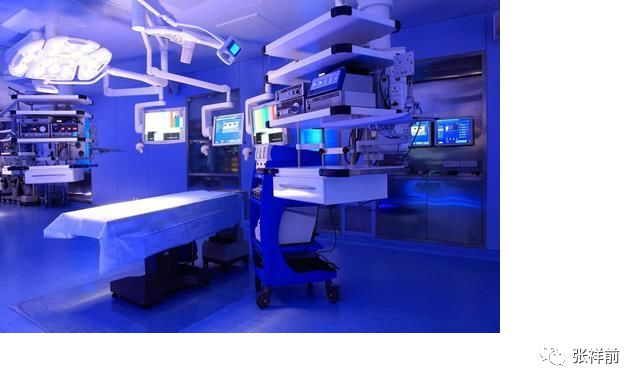

他们的截频技术，还可以虚拟旅行，睡着床上、闭上眼睛看电影、玩游戏，和远方的朋友交流等。

他们甚至可以睡在床上，通过截频技术和远方的异性朋友玩虚拟性爱活动。

六，踏上外星球大街

我们从飞碟仓库出来，突然就出现在他们星球的城市大街上，我定眼一看，出乎我的意料，他们的星球完全不是我想象的那样。

一眼看去，到处是特别高大的建筑，有的房子一眼看不到头，我当时就想，不应该造这么长，中间应该分开，好方便行人和汽车走路，为什么要这样造呢？

大街上一切东西都非常的整齐、简洁，不但房子特别的整齐，样式简洁，连马路都非常的干净整洁，毫无瑕疵，路面呈青色，不知道什么材料制作的，像是一种塑料制造的。

道路两旁有着许多稀奇古怪的植物，栽的一排一排的都极为整齐。

没有看到任何样式的汽车，也没有看到任何交通工具。没有看到电线，空中也看不到飞机，当然也看不到他们的飞碟，飞碟可能太快了，所以才看不到。也没有看到任何形式的商店、酒店什么的。

那些高大的房子很多如同飞碟仓库那样是虚拟墙壁，有些明显看出来是真实的建筑，不过，这些真实的建筑没有虚拟建筑的高大。虚拟房子的墙壁上有门窗一样大小不同颜色，位置也恰巧和门窗的位置吻合，我估计墙壁上这些不同颜色区域，就是虚拟房子的门和窗户。

有的房子根本就没有门窗，有的房子孤零零的悬浮在空中，没有任何支撑物。有的很高，似乎是处于太空中。有的房子上空孤零零的飘着可能是他们的文字，类似于英文，和房子没有任何的连接。

我当时想，我这一次是真的踏上了外星球，这里绝对不可能是地球上的某一个地方。从电影上看，无论是哪一个国家，也不是这个样子啊！我心里仅存的一点儿幻想【我这一次可能仍然只是到了地球某一个地方】，彻底破灭。

不过，我当时紧张的心情反而释放了不少，既来之则安之。

这个时候，脑海里经常出现的那个标准男性声音，突然换成一个非常甜美、极度妩媚的小女孩的声音，

“欢迎地球的前哥来我们果克星系访问旅游，果克星系全球公众信息网智能系统贴心为你服务。”

按照现在的认识，这个相当于我们的移动网络人工智能客服，这个全球公众信息网相当于我们地球的互联网。

“这是一个高度虚拟化的星球，也是一个淫乱---放荡的星球。”淫乱---放荡的词拖得很长，为什么要说“淫乱，放荡”？突然我眼前出现一个三维虚拟立体图像，一个极为漂亮、又有些邪恶面相的女孩，带着极度妩媚的声音继续的说，

“我是果克星球全球公众信息网个人私密服务员可温【发音】，将尽力为来自于地球的前哥提供信息服务，无论前哥处于什么样的环境中，都会得到可温的贴心私密的服务。我是你可爱、甜蜜····”

这个女孩一边说话，一边身体在变小，又在向我靠近，身上的衣服也在融化，最后这个三维影像好像钻入了我的身体里而消失掉。很奇怪的是，当时，我身上好像有感觉，而且似乎闻到了少女的体香，难道这个不是纯粹的虚拟图像？

我又用手在耳朵里摸几下，什么也没有,耳朵那个白色的东西，可能是翻译器，现在那里去了？我很想照镜子看一看，但想到他们可能没有镜子，或者去找镜子很麻烦，就打消了这个念头。

我注意到这个星球阳光特别灿烂，但是，有点阴冷，照射到身上感觉不暖和。各种景物特别的鲜艳，而且能见度极好，感觉很远的地方景物看起来都是很清晰的。植物的颜色大部分是墨绿色的，

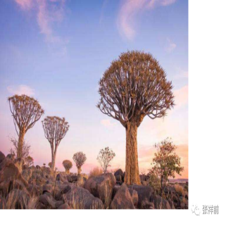

明显比我们地球上植物的颜色要深。

后来我知道，他们星球也是围绕一个发光的恒星在旋转，他们星球上照射到的恒星能量，明显比我们地球上获得的太阳光能量少，植物长期进化，颜色鲜艳，可以提高植物的光合作用效率。

他们景物看起来很鲜艳，原因是他们的空气中灰尘、颗粒物极少造成的。

他们把地面全部覆盖着，植物的根部在地面交界处，都用特殊材料包裹着。他们在城市区域中，地面全部有类似塑料的东西覆盖着，这种材料比我们地球上水泥升级了，非常的耐磨，有一定的弹性，和别的东西摩擦，产生的灰尘极少。

他们的野外没有沙漠之类的，植被很好。河流的堤坝都被人工建筑覆盖着。

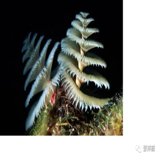

他们不但不让灰尘散发到空中，而且他们还有专门吸附灰尘的系统在不停的工作。

他们的工业使用人工场扫描冷加工，没有烟筒，大部分工业设置在另外一个工业星球上。

| 另外，他们全球百亿人，共同使用一个交通工具----全球运动网，只要把自己的运动请求发上去，可以一秒钟内出现在全球任何地方。
| 所以，他们没有汽车、火车、飞机等交通工具在地面摩擦而产生灰尘。

他们的环保做得太好了，好得过了头。

但是，对于我们地球人，如果在上面生活时间长了，免疫功能会严重退化，只是他们的人不在乎这个，他们的医疗极为发达，可以轻松的应付这个问题。

他们的大街上行人不多，三三两两的，不紧不慢的走路。我还发现，这些人明显的有男有女，身高都在一米左右，年龄都差不多，个个都是非常的漂亮年轻，像我们小学、幼儿园的小朋友，看不到一个老人和婴儿。

这些人都是非常的精致，皮肤也是非常的细腻、柔和，毫无瑕疵，而且看起来是一种漫反射，不是镜面反射的那种。

后来，我了解到，他们的人可以借助于全球运动网和全球信息网，远程的修饰自己的外表，就像我们现在的抖音开美颜。

女人的衣服好像和身体是融为一体的，穿着样式很简单，一般是裸露出手臂，上身一件紧身汗衫，非常的贴身，好像就是把裸露的上身图上颜色而已，连着一个小的类似裙子的东西。穿着都很暴露，都是夏天的穿着打扮。

他们有的人，身上的衣服的图案的在不停的变化，像我们的电视画面那样。

女人的头发一般都是向外膨开，一束一束螺旋式的，而男人的头发一般是紧紧的巴在头上，头发的颜色各种各样的，一般都是非常的艳丽。

我还发现一个现象，这些人走路都是空手，就是女人也没有任何包包之类的东西带着，这个又是为什么呢？我无法理解。

我还注意到一个现象，就是无论男女，很多人走路的时候，肩膀边或者头上漂浮着一个三维立体图像，图像内容千奇百怪，有的是小动物模样，有像文字，有的像复杂的机器，有的看不出名堂，不知道属于什么类型。有的图案在不停的变化着。\ |https://mmbiz.qpic.cn/mmbiz_png/ctwXrXAibr6ICIEvTVYXbyiciaJQkfC5TbD8uEkfTiaCOKh4ZTRibkC1Y4JUvpB41ibDwoPMgF3njrd23h9ib8uBHl9dQ/640?wx_fmt=png&tp=webp&wxfrom=5&wx_lazy=1&wx_co=1|

我好奇的问这些人头上漂浮着这些是什么？

“这个是人工场扫描和远程虚拟成像技术搞的，是一种签名，标签，自我显示、标榜的意思，也有表示、展示自己个性的意思。”那个公众信息网客服可温给我解释。

可是我还是不太明白，又继续的问微丽他们。

“啊，是人的一种宠物，代表人的一种心情。可以变化的。今天头上飘着这种图案，明天可能飘着另一种图案。”微丽给我回答，可是我仍然不太明白。

“啊啊啊啊，不能理解，我只能猜测这些人头上的图案，只是你们个人的一种喜好，标榜一下自己，没有什么真实的用处。”我说。

“觉得我们果克星球空气怎么样？”苏代尔问。

“很好”，我的注意力转移到了空气上，觉得心旷神怡的，“你们的空气含氧量比我们地球高，是吗？”

“是的，是百分之二十三点一八，”苏代尔说，“关键起作用的是空气中的负离子和其他一些气体，你们地球上空气有点糟糕。我们以前也试过更高的氧气含量，发现生物、人体很多不能够适应的情况，经过反复试验，确定这个含氧量是最好的。”

诺顿面对着我说，“我们现在回到我们的住所，以后在带你详细的参观我们的星球，怎么样？”

“好的，你们的住所离我们这儿有多远？”

“按你们地球上的长度单位，大约有1万多公里。”

“那我们坐什么交通工具去，还是坐飞碟去吗？”

没有人回答我，诺顿把手举起来，猛的一挥，我的耳部出现信息网客服可温柔美的声音：“请求附属物瞬移被通过，类型：异型生物人。”

我觉得身体一轻，然后又迅速恢复到原来，突然耳部听见他们相同的一句话：“到家了！”

一万多公里这么这么快？这么容易就到了他们的住所？用是的是什么交通工具？比飞碟还高级？我什么也没有看到啊，只是看到诺顿把手一挥，我心里充满了疑问？

七，见识瞬移和全球公众运动网

我们是直接到了诺顿的住所中，不是像我们地球上先到住所门外头，再从大门进去的。

诺顿的家中非常整洁漂亮，也有虚拟墙壁，还有虚拟床、虚拟沙发，有一个像桌子样的东西，一眼看明显是实物的。

我们一屁股坐在虚拟沙发上，感觉很舒服的，像一个无形的力在托着自己。

 我又跑到了床上坐下去，感觉也很舒服。“如果把这个虚拟床的开关一关是什么结果？”

“啪，你就掉在地上，就是这个结果。”苏代尔说着，突然一按开关，我真的一屁股就掉在地上，感觉有些疼，但是，我努力装着无所谓。

“不友好行为！”微丽和诺顿表示谴责。

苏代尔又按下开关，虚拟床又形成了，我被一股无形的力逼出来。我不敢坐虚拟床了，跑到虚拟沙发上坐下来。

“旅途累不累?”微丽坐在我身旁，突然关心起我。

“旅途不累的，就是到了你们星球，觉得身体重一些，有些吃力。”

“我们的星球比你们地球引力强，所以你觉得自己比地球重一些。这样会让你时时刻刻不舒服的。”诺顿说，

“我来请求全球公众运动网把你的体重减轻。”

“什么，全球公众运动网？”我感到不可思议。“人的体重可以通过什么全球公众运动网来减轻？不在人身体上分离什么东西出去，怎么就可以从外部减轻人的体重呢？全球公众运动网又是什么东西？”

“我们从飞碟仓库到这里一万多公里，用的就是全球公众运动网。”诺顿说完，在一个桌子上，用手抹了一下，桌子上方立即出现一股细腻的白色烟雾，一会儿，白色烟雾又变成立体画面，和飞碟中我看到的立体画面一样，画面中出现了许多外星文字，我发现这些外星文字有点像英文，好像是一些基本字母组合成，不像我们汉字那些的象形文字。

诺顿用手优雅的操作，我耳部出现一个柔美的女性声音：“全球公众运动网欢迎你····输入用户名，输入密码，再次解码。

-----输入压缩信息，-----确认用户名，确认密码，----请求类别：减少附属物质量，类型：异型人----” 

诺顿搞了一会儿，我突然觉得自己身体一轻，感觉轻松不少，啊，真是太奇怪了，诺顿用什么东西搞的？诺顿说是全球公众运动网，这个到底是什么东西？

诺顿对我解释道,

“全球公众运动网主要设备是我们星球上空的人工场发生器，这个发生器和你们地球上空的同步卫星一样，绕我们星球在同步旋转，我们的星球也有自转，不过，人工场发生器比你们地球的卫星要大的很多。

我们的星球一个有9个，影响范围覆盖整个星球，这些设备可以向全球任何一个地方发射一种特殊的、人工制造的场------人工场，实际上就是影响空间，进而影响空间中存在的物体。

人工场发生器加上全球定位系统、计算机、全球公众信息网组成了全球公众运动网。

当我们出门旅行，希望全球运动网提供帮助，大概过程是这样的，我们首先把自己的运动请求信息通过公众信息网传到太空中的人工场发生器。

人工场发生器首先确认你的身份，确认后，通过全球定位系统把你所在的位置锁定，然后再照射你所在的位置和你将要出现的地区，你就可以一下地在你所在的位置消失，出现在你想要去的地方。

由于这个过程太快，人是无法感觉到的，一般我们把这个运动过程叫瞬移，也叫瞬间移动。”

“想不到，全球公众运动网看不见、摸不着，却也很复杂。”我说，

“这个很厉害啊，比飞碟更加厉害，而且使用方便，乘客什么东西都不要带，那你们为什么到别的星球去不用全球公众运动网？”

“这个全球公众运动网作用范围只能在一个星球上，原因是人工场发生器只是对地面照射，而且作用范围是有限的，我们从一个星球到另一个星球，只能用飞碟。”诺顿回答。

“看来这个全球运动网核心是人工场发生器，其余的都是辅助的，那这个人工场发生器的基本原理是什么？”我问道。

“和飞碟的基本原理是一样的，人工场发生器对人照射，使人周围的空间光速运动消失，人的周围空间本来时刻在以光速运动，这个是人和物体产生质量的原因。人的质量变成零，会以光速运动，运动到终点目标时候，再使人的周围空间运动恢复到原来。

如果中途有东西阻隔，把阻隔的东西质量同样的变成零，这样可以无阻力、无障碍的穿过阻碍的东西。

不过，这里的质量变成零是一种相对概念，就是我觉得质量变成了零，而你可能认为质量没有变化。”

诺顿的解释让我有些糊涂，又觉得有些不可思议。

“就是说，两个坚硬的固体，在人工场发生器的照射下都可以毫无障碍穿过对方，是吧？”我问，“固体中的分子为什么不阻挡对方了”？

生物学家回答：“普通物体由原子构成，原子由原子核和核外电子构成，而电子和原子核的体积只占原子体积的几十亿分之一，正常情况下，一个人走到一堵墙前被墙给挡住了，原因是墙中分子、原子中利用相互作用力构成了一个整体，这些相互作用力本质就是一种电磁力。

我们实际上被这些电磁力给挡住了。如果没有这些电磁力，我们人可以很容易穿过去的。

人工场设备使物体中电磁力消失，使两个固体可以轻易穿过对方，不过，这些电磁场力的消失是一个相对概念，就是在某一个人看来消失了，而在另一个人看来仍然是存在的。”

诺顿的解释让我有些晕头转向了。

“人工场发生器可以减轻物体的质量，我现在觉得自己的身体变轻了，就是由于这个人工场发生器时时刻刻跟踪我照射，来减轻我的身体质量，而且又不完全的使我的身体质量变成零，只是减轻了一部分，是这样的吧？”我问诺顿。

诺顿说：“对，你很聪明，是这么一回事情。”

“漂浮人【指我小时候遇到的特别高级文明的气态外星人】找到他，肯定是有原因的。”微丽插嘴。

“前哥在地球人中肯定是属于聪明的人，应该说，地球人算是聪明的生物人，只是，地球上喜欢斗争，相互斗来斗去，把聪明才智都用到这个方面上。”苏代尔说，

“地球人还有一个恶习惯，就是喜欢把人分成许多等级，认为某些人是上层人，强调某些人是下贱人。”

“前哥在地球上是上层人，还是下贱人？”微丽盯着我问。

“我是最下贱的人又是最高尚的人。我现在只是对全球运动网感兴趣，”我对诺顿说，“这种全球运动网是不是万能的？”

“这种能够使人瞬间消失的人工场设备也不是万能的，它也有许多限制条件，

如果这个设备的能量达不到某一个值时候，产生的人工场对人照射时候无法使人产生瞬间消失运动。如果要求做瞬间消失运动的物体质量过大，或者许多物体加在一起质量过大，这个设备的功率达不到就无法工作。还有，如果，这个设备工作时候不稳定，人在穿墙时候可能就被卡住而使人丧命。”

诺顿继续给我解释，

“人工场设备要使一个星球这样大的物体做瞬间消失运动比起一个人来难度要大得多，消耗的能量相应的大得惊人。要使一个人穿墙而过容易，要使一个人穿过星球而过，人工场设备功率要求特别巨大，消耗的能力也是惊人的，否则的结果是把人卡在星球中而使人丧命。实际上这样大功率的人工场设备我们也是没有的。”

关于全球公众运动网，我仍然有许多疑问。

“如果一个很小的房间突然的有许多人请求进入，怎么办？”我问。

“这个要求全球运动网是高度智能的，这种情况下只是允许开始申请的人，以后的申请的人就不能够通过的。全球运动网不但高度智能，而且和全球信息网是捆绑在一起的。”苏代尔给出解释。

“公众运动网会提醒你：你要求到的空间已满，你这次运动请求公众运动网不予支持，你可以选择下次或者延时。”微丽这个话和我耳部经常出现的信息网客服可温的话很像。

“我想夜晚使自己出现在银行金库里，大把钞票往包里装。夜晚出现在一个漂亮的妹妹房间里，啊，使她和自己----，这样的话，社会不就乱套了？”我说。

“活活，”苏代尔笑了，身体随着笑的节凑抖动起来，“你们地球人就好这个，就这么一点点的出息。

这个全球运动网具有高度智能，当你在全球运动网上请求使自己出现在一个银行仓库时候，出现在一个漂亮妹妹房间里，全球运动网在画面上弹出：对不起，你的请求违反相关法律，本运动网不与支持。

当你在全球运动网上请求使自己出现在危险的海洋中，全球运动网在画面上弹出：

全球运动网温馨提示您，海洋中属于危险地带，注意带好上网设备，以便可以安全返回。

如果你没有携带上网的电脑或者手机，全球运动网在画面上弹出：

对不起，本运动网检测到你没有携带电脑或者其他上网设备，无法保证返回安全，本运动网不支持你这次运动请求。

当你请求全球运动网把你送到某一个地点，你在电脑上胡乱的点一下，你点的地方离地面有十米高，全球运动网马上提示你：

本运动网将按照您的指示，满足你这次运动请求，为了您的安全，默认把您送到您指定的地点垂直的下方十米地面。

当你在全球运动网上请求使自己出现在别的星球上，全球运动网在画面上弹出：

抱歉，全球运动网只能使人和物体在全球范围内运动，您的请求超出了我们的能力范围。

当你看到了一座大山太漂亮了，你在电脑上请求全球运动网把大山移到自己的家时候，全球运动网在画面上弹出：

抱歉，全球运动网对于你这样普通用户只能使人员和不超过一百吨物体在全球范围内运动，您的请求超出了你的权利范围。

当你看到别人的东西，你在电脑上请求全球运动网把这个东西移到自己的住所的时候，全球运动网在画面上弹出：

这个是别人的财产，你的请求违反了相关法律，本运动网不与支持。”

苏代尔一口气说了很多，我的很多疑问得到了解释。

对这个公众运动网我内心赞叹不已。我想如果地球上有这个东西该多好啊。我想到美国去，把美国要去的地址通过信息网找到，一按确定键，我就在美国那个地方出现，想回来，再把老家地址找到，一按确定键，立即就回来了，这个多神奇啊，多方便啊！

“噢，我明白了，你们大街上没有汽车，没有火车，没有飞机，没有任何交通工具，人们出门不带包，你们家里没有放置很多物品，就是因为有全球公众运动网，因为出门、转移物品太方便了。”我说，

“也不需要商店，买东西可以直接从厂家仓库发过来。也没有酒店，因为无论多远，都可以很快回家。”

“哦，是这样的，我们就是这样的一个社会，”苏代尔说。

“神奇的全球公众运动网，使一切简单、快捷、高效！”我赞叹道，“我能不能请求全球运动网，使我到处跑的。”

“你不行的，你没有身份，但是，如果你作为我们某一个人的附属物，”诺顿说：

“比如你作为我的附属物，就像是我随时带的行李，我请求全球运动网，可以把你带走，你来自于外星球，是办不下来身份的，我们星球上的人才可以拥有身份的。

以后，你会了解到全球公众运动网有许多更加重要的用处，如果你们地球上拥有全球公众运动网，会对你们的生活、学习、工作、科研一系列活动产生剧烈的影响，会使你们的城市格局产生重大变化，因为人不需要拥挤在一起了。

甚至使你们地球上的国家和战争消失，对于交战双方，因为可以用全球公众运动网强行把他们分开。就是我们果克星球人吃饭，身体获取能量，基本上依靠全球运动网。

全球运动网也可以改变社会的德道观念和法律，社会不要求人德道和法律，因为一个人想干坏事，全球运动网可以随时制止，使你干坏事情无法成功。”

“奥，是这样啊，如果突然停止全球运动网，你们都小命不保，是吧”？我感叹道。

“那是的！”苏代尔，诺顿齐声回答。

“我们的两大网络时刻在全球范围内定位、追踪星球上每一个人，时刻不断的为他们提供各种服务。只有当这个人离开了他们的星球，这种服务才可能停止。”苏代尔说，

“你们地球上现在也在建设互联网，互联网发展到最后，会和我们的全球公众信息网差不多。只是你们地球上仍然没有全球运动网。

我们的全球公众信息网可以时刻为每一个人提供和外界交流、查询、定位、问候、翻译、对人的各种身份的确认、认证等各种信息服务。我们信息网可以通过纯净的空间来传输信息，都是采用人工场扫描远距离非接触的方式提供信息服务，而且这些都是免费的。

我们的人工场扫描技术可以读取每一个人大脑里思想意识，也可以通过空间远程的把信息输入到每一个人的大脑。人与人之间借用人工场扫描可以通过空间直接获取、发送信息，也就是人与人可以通过全球信息网直接相互交流。”

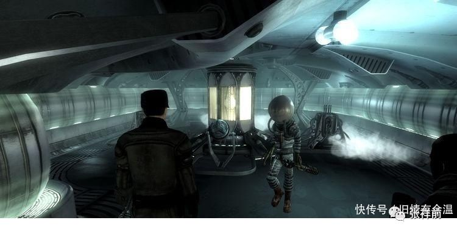

“那你们为什么又在使用外部电脑？”我不解的问。

“有时候过多的信息直接进入人的大脑，会对人大脑造成干扰，使人有很烦的感觉，我们的人很多时候也使用外面的各种电脑设备。”诺顿给我解释。

“时刻追踪我们的全球信息网和全球运动网是非常的厉害，使我们每一个人无论走到何处，都可以拥有强大的能力。就是因为这两大网络时刻在跟踪着我们，为我们提供各种服务。我们无论身处何处，都不会遇到危险，两大网络可以为我们提供各种可靠的安全保障。”苏代尔说。

“如果遇到什么事情对我们形成了真实的威胁，我们的全球运动网具有高度智慧，可以迅速的把人转移到安全地方，我们的全球公众信息网不但时刻提供各种信息服务，还可以时刻远距离的、非接触记录一个人的思想意识信息。

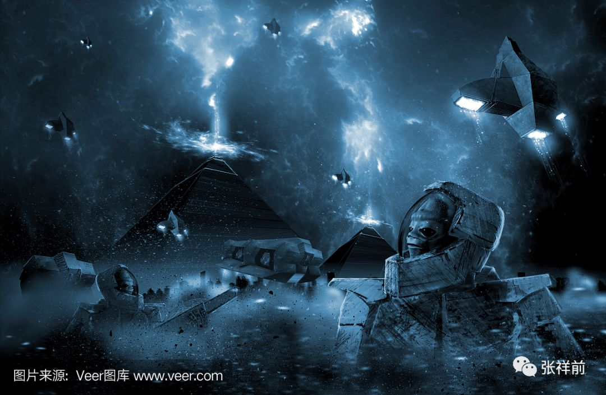

一旦这个人发生特殊意外，失去生命，全球信息网可以把这个人的思想意识完整记录下来，可以通过人工场扫描技术把这些思想意识信息安装到一个我们人工制造的人大脑中，使这个人复活。”

果克星球的全球信息网为他们提供信息服务，而全球运动网为他们提供交通、加工制造、日常活动等各方面的服务，等于拓宽了他们人的手脚。

八，有趣的果克星人

有一次坐在诺顿住所的虚拟沙发上，我渐渐的感到饿了，“喂，我觉得有点饿了，你们各位平时都吃些什么啊？”

“有点对不起，”诺顿说，“我们把你这个事情忘了，你们地球人吃东西方式和我们是不一样的。”

“那你们平时吃东西是怎么吃啊？”

“我们身体需要的能量也是来自于食物的化学能量，我们有全球运动网，当我们需要食物能量时候，可以请求全球运动网把食物直接瞬移到我们的身体里，一般都是液体，几乎完全可以被我们身体所利用。”诺顿回答。

“液体是用瓶子装着吧，连同瓶子一起送到你们胃中，瓶子你们是怎么消化的？”

“不用瓶子也可以瞬移进去，”苏代尔说，“我们是没有胃的，我们的身体内部，从嘴开始到下身，只是一个简单的空腔，我们的食物是经过高度加工的，身体是可以直接利用的。

只有像你们地球人身体原始落后，才有胃、肠子、肝、肾---什么的，真是既复杂又麻烦。事实上，当我们身体能量不足时候，全球运动网会把食物能量瞬移到我们人体内，一切都是在计算机控制下自动完成，用不着我们去烦神。”

“现在我请求全球运动网送来食物给你。”诺顿说完，举起左手，在耳朵附近空中猛的一劈，一个精致的瓶子和金属剪刀就顿时出现在诺顿家的桌子上。这个瓶子形状有点象企鹅，银白色的，像是金属制造的。瓶子上面有个突起部分，像企鹅嘴那样伸出很长。

诺顿用一个湾湾的剪刀把这个瓶子的伸长部分剪开，又把瓶子递给我。我接过瓶子喝了起来，这种液体有一种花香，香气扑鼻，喝起来感到有股谈谈的甜味，口感很好，我一口气喝完，把瓶子放回桌子上，顿时就觉得不饿了。

诺顿又用手在耳朵边一挥，这个瓶子和瓶子剪下的那一小块以及剪刀突然就不见了，我想肯定又是被全球运动网瞬移回去了。

“为什么你在耳朵边一挥手，就可以请求全球运动网瞬移东西？是不是耳朵边有开关？”

“我们果克星人大脑和全球公众信息网通过人工场扫描连在一起的，全球公众信息网在你们地球上叫互联网。”

诺顿说，

“是先在头脑中有了请求全球运动网帮助做某种事情的想法，在耳朵边挥手只是确认而已，我们也可以设定其他方式确认，比如摇头，握拳，跺脚·····，一般人都选择一个不容易发生误会的确认方式，当然，也有纯粹是出自于自己的个性，即使经常误会、出错也要坚持、不想改变的。

你们叫吃饭，我们叫身体补充化学能量，我们这样的事情一般都是设置一个固定计算机程序，我们身体一旦能量不足，身体会自动的发出信号，发到公众信息网上，再通过公众信息网把人体饥饿信息发给全球公众运动网，全球运动网确认身份后，就把液体化学能量瞬移到我们身体中，还可以把我们身体的一些排泄废物带走，一切都是自动的，不需要我们费神的。”

“活活，这么说来，你们离开了全球运动网就没有办法活了。”我模仿苏代尔的口气，也嘲笑了他们，“在‘区图300’飞船上你们就不能够吃东西了？”

“‘区图300’飞船上也有运动网，也可以实现瞬移，同样可以很方便给我们身体补充能量，只是我们吃东西你看不到。”苏代尔说，

“在没有全球运动网的情况下，我们的嘴也可以喝下液体的食物，用牙齿吃东西，我们果克星球人都不习惯了，而且我们的身体内部只是一个空腔，没有像你们地球人那样复杂的消化器官，消化功能都退化了吧，真的吃起来，可能也行的，只是肯定没有你们地球人厉害。”

“我有点不理解，你们大脑可以和全球信息网连接，等于大脑内有生物电脑，为什么我又看到你经常操作那些虚拟屏幕电脑，直接用你们的大脑不行吗？”我对诺顿说，

“比如在‘区图300’飞船中，我看到你在操作台子上的电脑？”

“人身体的生物电脑功能不如外部电脑强大，像‘区图300’飞船很多功能，是不允许我们用大脑直接操作的，这个在我们星球是有约束性的。而在果克星球范围内，人们通过之间大脑直接请求全球公众运动网，几乎可以随心所欲的到果克星球的任何地方。

但是，星际飞船是可以飞离果克星球的，有一定的危险性。驾驶飞船不是任何人都可以的，即使允许操作的人也不是随心所欲的可以驾驶的，是需要经过批准的。” 

诺顿严肃的说，

“你要明白，人体内置生物电脑有很大的随意性，像驾驶‘区图300飞船’这样的事情，是需要严肃认真和谨慎的，所以，外部电脑比内置生物电脑更加适合。”

 “奥，我有点明白了，你们的果克星球也是有秩序的，做什么事情也是有理性的，不允许胡来。”我突然的又想起来，

“哦，诺顿，我想问你，你的家人呢?”

“什么家人？”诺顿似乎有些意外。

“你的家中就你一个人，你的父母呢，你的妻子呢，你有没有孩子？”

“哦，就我一个人。”诺顿回答。

啊，想不到果克星球的生物科学家诺顿竟然是孤身一人。你的家人呢，你家有多少人？”我又问苏代尔。

“就我一个人。”

“你呢？”我问微丽，“你家中有多少人，你父母呢，有没有兄弟姐妹？”我看微丽长得像我们地球上幼儿园的小女孩，不好意思问她有没有孩子。

“什么呀，我就是我一个人。”微丽有些莫名其妙。

“啊！你们三个人都是这么惨啊，都是孤儿啊，家里什么人都没有了，真是可怜啊！”

“谁惨？谁可怜？我们果克星球人都是长生不老，没有生也没有死，哪里有什么父母、兄弟姐妹、孩子?”苏代尔不屑地说。

他们可以长生不老，我心想，按照我看到的果克星球神奇的科技，他们实现了长生不老应该是有可能的，他们是如何实现了地球人最大的梦想---长生不老的呢？

“真的吗？你们可以长生不老？”我对苏代尔的话不太相信，转而问诺顿。

“是的，我们可以长生不老，很多年前，我们果克星球就实现了这个技术。”诺顿肯定了苏代尔的活，

“我们不生又不死，所以，没有老人没有小孩，也不存在有父母、子女、兄弟姐妹。我们一个人就一个家庭。”

“一个家庭只有一个人，也不好，肯定寂寞的。”我说。

“我们家里有宠物啊，我有好多宠物的，我们还可以和宠物对话，也可以和其他动物对话、交流。”微丽说，“我家还有照顾我的2个机器人。”

“你们星球上有没有我们地球上猫狗之类的动物，你们是用什么方法和动物对话的?”我问。

“有的，我们有很多动物，我们的猫狗有的品种和你们地球上的差不多，这类品种有可能就是从你们地球上引进来的。”诺顿回答道，

“我们可以把我们的语言翻译成猫狗之类的动物能够领悟的语言，再用人工场扫描把信息发送到猫狗等动物的大脑里。人工场扫描也可以把猫狗等动物的语言翻译成我们能够理解的语言。这样，我们就可以通过人工场扫描和猫狗之类的动物相互交流。

但是，你是地球人，无法了解我们和猫狗之类的动物交流是一个什么样的体验，你可以试着想，你是在和一个智力有缺陷的人在交谈。不过，这个不妨碍我们和动物的交流能够进行下去。”

“也不妨碍我们能够和动物发生性的行为，这种事情在果克星球上太多了，不过在你们地球人眼里这是很一个糟糕的事情。”苏代尔的话让我吃惊，我转移了话题，

“那你们果克星球人有没有夫妻、异性朋友呢？”

“有的，只是维持那么一段时间，而不是永久的，也不像你们地球上有法律登记。”苏代尔回答。

“你们果克星球人真是有趣，我很想出去，到你们果克人群中走一走，看看你们的日常生活情况，回到我们地球上，可以向大伙儿吹吹牛，介绍一下你们这儿的情况。”

“外面的天已经暗下来了，前哥，明天带你出去，”诺顿说，“今天你刚到，可能累了，就在我这儿休息。”

“嗯，好的！”

“我们告辞了，明天在这儿见面”。全球公信息网的客服可温刚把苏代尔和微丽的话翻译给我，就发现微丽和苏代尔立即在诺顿家消失。不用猜，肯定是利用全球公众运动网瞬移回到他们自己的家中。

果克星球的全球公众运动网，可以使人和物体突然的出现某一个地方，也可以突然的在某一个地方消失，更加神奇的是，在密封的房间里同样可以做到。

这个如果发生在我们地球上，肯定让地球人目瞪口呆，然而，在果克星球上，全球运动网的瞬移是如此的频繁、平常，以至他们的生活的方方面面都离不开全球公众运动网，甚至他们的饮食都依赖运动网。

“我想洗个澡，你们有没有洗澡的东西？你们洗澡吗？”我问诺顿。

“有的，我带你过来。”

我跟随着诺顿，走到一个小房间里，诺顿按了一下一个开关，房间突然就出现一个乳白色的浴缸，悬浮在空中，这个乳白色太过于纯正，而且纷纷扰扰的在动，不用猜，是虚拟浴缸，人工场的产物。

我走进了看到浴缸内有水，而且奇怪的是水从浴缸这一头流向那一头，就这么不停的在流。我感觉这个水是真实的，不是虚拟的。怎么这样啊，浴缸一头源源不断在冒水，哪有这么多的水呀。一头在吸水，吸了那么多水，又储存在哪里？这个在我们地球上，肯定是不可思议的事情。

我刚想问诺顿这个浴缸是怎么一回事情，突然又想起了果克星球的全球公众运动网，利用运动网把水瞬移在浴缸的一头，再利用运动网把水从另一头瞬移走不就得了呗。

我脱了衣服，跳入浴缸中，立即感觉到水是真实的，浴缸是虚拟的，我的判断是对的。水温略高于我的体温，躺在里面很舒服，我想小便，刚才有女孩微丽在场，不好意思问诺顿，现在就在浴缸里放了小便，诺顿会发现吗？会指责我吗？管他呢。

我放了小便，痛快的洗个澡。我刚从虚拟浴缸中出来，一转眼，虚拟浴缸就不见了，消失的干干净净，看来又是神奇的全球公众运动网搞走的。

诺顿家的虚拟床睡觉太舒服了，我一觉就睡到了天亮。等我起来了，看到了苏代尔、微丽和诺顿已经坐在虚拟沙发上交谈。我想凑上去和他们交谈，突然觉得大便急了，不好意思问也不行了，我脱口而出，“你们的厕所在哪儿？”

“我们没有厕所的，我们果克人是不需要排屎排尿的，”苏代尔说，“我们的排泄物比你们地球人的耳屎还少。”

“那总得要找一个地方给前哥方便啊。”诺顿说。

“我带他出去，”微丽站了起来，自告奋勇。

哥们排大便，搞个女孩指路，多不好意思，但是，情况紧急，我只好跟着微丽出去了。

来到一处植物从中，我蹲下方便，看到微丽在附近看着我，我觉得有些难堪。微丽今天衣服穿的很艳丽，上身一件黑得发亮的、有金属感的紧身汗衫，两个乳房不大，但是，很长、很突出，很撩人。

下身穿一件紫色发亮的短裙，从正面和后面看，还算正常，但是，从侧面看，就不对劲了，侧面是裸露的，可能裙子在侧面是透明的，但是，这个透明太高级了，压根就像没有东西那样，只是裙子看起来是一个整体，提示可能是透明的，而不是没有东西的。

后来，我知道了他们的人在很多场合下衣服都不是真实的，是虚拟的，全球运动网和全球信息网在他们身上搞的虚拟图像而已，根本就不是真实的衣服。

如果你用手摸他们，就等于摸到了裸体，只是，他们如果请求全球运动网在身上制造力场，那你摸上去才不是裸体的感觉。

微丽下身侧面裸出细腻粉白色的皮肤，让人是心惊肉跳、想入非非。

我扫了一眼，就不好意思看了，心里想，我们地球女人就是露，也是把关键部位护住，他们倒好，就喜欢裸出关键部位，我当时内心在谴责他们不要脸。立即想起来可温介绍他们的星球是一个淫荡的星球。

我其实是一个思想保守的人。我有一次挖黄鳝，遇到一个城里来的妇女带她几岁的女儿。她们想躺过一个水沟，又害怕水里有蚂蟥和虫子，叫我帮忙，我把她女儿抱过去，这个妇女又示意我把她也抱过去。看到这个妇女穿着超短群，粉嫩的大腿，实在没有勇气去抱。

她又示意我背她过去，看到她高耸的乳房，我又失去了勇气。这个妇女可能没有想到我是因为没有勇气去抱女人，误会了我，气的骂我是坏人，骂了好长时间，只好脱鞋咬牙下水趟过去，我感到内疚很长时间。

到了诺顿家中，我建议出去走一走，了解果克星球人的日常生活情况。

诺顿说，“下一次去吧，今天要来许多重要的客人，在这里你也会看到我们各式各样的果克星人。”

不一会儿，诺顿家来了不少人，渐渐的感到客厅小了，诺顿用手一挥，一扇虚拟墙壁消失，顿时客厅增大几倍，看来，虚拟房屋就是方便。

我和苏代尔、微丽是坐在一个虚拟沙发上，我坐在中间。微丽今天穿得太过于性感，给我一股无形的压力，我她和保持一段了距离。

我也看到了一个有趣现象，有的人是突然的出现在诺顿家中的虚拟沙发上，有的人是先来了一股烟雾，慢慢的变成一个人。我问苏代尔这个是怎么一回事情。

“突然出现的人，来的是真实的人，是通过全球运动网来的。慢慢的以烟雾转化的人就是光线虚拟人，这个人的真实身体没有来，但真实身体可以在远处通过公众信息网和我们交谈，你看到的人不是真实的人，是全球公众信息网、全球运动网通过三维成像技术造出的虚拟人。不过，虚拟人也可以直接和我们交谈的。”苏代尔给出了解释。

我定眼一看，这些虚拟人看起来和真人毫无区别，苏代尔在骗我？不管三七二十一，我站起来，走到附近一个是由烟雾慢慢转化的人身边，用手在这个身上摸一下，果然是像在空气中挥手，什么都没有摸到。

尽管有心里准备，仍然是很震惊的，不得不惊叹果克星球人神奇的科技，把虚拟技术发挥到了登峰造极的地步。

来诺顿家的这些人长相各异，但是，身高都一模一样的，凭我的肉眼看毫无区别的。这些人像是开座谈会，诺顿在人群中走来走去的，像是一个主持人。

由于人多，全球信息网客服可温主要翻译诺顿、苏代尔、微丽的讲话，如果我对另外的陌生人注意看一下，这个人的讲话耳部也就会接受到翻译，否则，一般情况下信息网客服是不予翻译的。

我想，这个公众信息网可能是具有高度智能的，也可能时时刻刻的对我进行定位跟踪的。

诺顿滔滔不绝的讲述我们地球人的身体结构，偶尔也向我介绍果克星球人的身体结构和生理特性。我根本没有心思听，因为来了许多果克星球的女人，或者叫果克星球的女孩，因为她们的外表看起来都极为年轻、漂亮，都像我们地球上小学、幼儿园的小女孩。

这些漂亮、性感的女孩就坐在我的身边，而且穿衣都很暴露，一般都像微丽今天的穿衣打扮，上身一件紧身汗衫，下身短裙，而且大都从侧面裸露处细腻粉白色的肌肤，看得我是心痒痒的。

诺顿和微丽可能没有意识到我的心思，只有苏代尔似乎知道，
“你们地球女人有漂亮的，有丑陋的。”苏代尔问我，“怎么样，你是不是觉得我们果克星球女人个个漂亮？
”

“你们果克人所谓的漂亮只是身材性感、身体特别精致而已，我承认你们果克人肌肤光滑、颜色纯正，身体结构完美无缺，我们地球人的漂亮还讲究人的内涵，人的思想性格，人的气质，这个可能你们是不理解的。”我有些故意装作高深。

“如果一个人身体上布满点子，长出许多小包，这个人还漂亮吗？”诺顿反问我。

“身上许多点子、小包，像癞蛤蟆，这样的人也叫美女？活活。”我笑了起来。

“好的！”诺顿好像来了精神，“我马上就邀请这样的美女过来，颠覆你对美女的认识。”

诺顿用左手按住耳朵，来回走几下，突然我们眼前就出现一位美女，这位美女让我看得是心惊肉跳。她衣服穿得太少了，她身体皮肤的颜色是粉白色略微带有一点淡淡的粉红色。果然身上到处是粉红色的点子，点子有火柴头大小，分布非常的均匀，仔细看，点子或者叫小包，晶莹剔透，有点像石榴籽。

这个人一眼看上去就非常的漂亮性感。“怎么样？你感觉这个人怎么样？”诺顿问我。

“嗯，这个人的确很漂亮的，我承认很性感的。”我觉得这个人的漂亮性感仍然是来自于精致，只是另外一种形式的精致而已，但是，这个时候我不想和诺顿他们抬杠了。

九，果克星人为什么要绑架地球人？

我想转移话题，就问诺顿，“你们有没有看到我们地球人的女性，你觉得我们地球人女性是否漂亮？”

诺顿说，“我们多次绑架你们地球人，单我就去很多次，对你们地球人当然很了解。

我们不但经常到我们地球上去绑架人，还频繁的到宇宙遥远的其他星球上去绑架人，把人绑架到我们果克星系来。

在我们眼里，按照我们的审美习惯，相比较其他星球上的女性，你们地球上的女性不算漂亮的。”

“那你们为什么还要去绑架地球人？”我反问道。

“这个和漂亮没有关系，我们去外星球绑架一个人来，不是因为他们长得漂亮。”诺顿说，

“如果我们到你们地球上，去绑架一个地球人，我们主要目的就是获取地球人思想意识、记忆、感觉、各种运动、生理活动等信息数字。

通过我们的技术手段，可以使我们的人拥有你们地球人一样的感觉和体验，

这个效果就是等同于把我们的身体换成地球人的身体，来生活一段时间。”

“那你们为什么想要把自己的身体换成地球人的身体，来生活一段时间？”我问，“是不是地球人身体很棒？”

诺顿回答，

“你们地球人追求的是物质财富和权力，这些我们都不感兴趣，我们追求的是人的体验和感觉，换一个地球人身体生活，就可以体验一下地球人的感觉。

我们经常到别的星球上去绑架人来，就可以使我们经常换别的星球上人的身体，来生活、体验一段时间，你们地球人的身体在我们眼里是很差的，也不是特殊的。

宇宙中所有的人，生存的三要素就是物质资源、能源、信息。我们科技非常的发达，物质资源和能源对我们来说，早就无所谓了，没有人感兴趣了。

我们只是对信息感兴趣，获取信息是我们最主要的事情。

通过信息数字来获取财富，叫信息数字经济，在我们的经济中大约占到百分之九十九，甚至更多。物质资源、能源在我们星球上几乎都是免费的。

绑架其他星球上的人，或者绑架你们地球人，从地球人身上获取到的信息，可以为我们带来巨额财富。

比如我们抓了一个地球的男人到我们的星球上，我们可能会强迫这个男人，和这个星系里各种不同身体形状的女性做各种性爱活动。

我们再记录这个地球男人的身体、生理、思想意识、感觉和记忆及其他各种运动的详细信息数字，这些数字对我们来说，就可以产生很多财富。

获取这些信息数字后，可以在我们的全球信息网上大肆宣传、叫卖，名字叫‘和地球男人做爱、生活’，然后出售给很多用户。

比如我们的一个女性用户，买来了‘和地球男人做爱、生活’数字后，借助于我们的虚拟技术，一个地球男人的三维立体虚拟图像就如影随形的跟着这个女性。

这个女性像和一个真的地球男人那样生活在一起，相互之间可以聊天，互动，甚至可以发生虚拟性爱活动。

我们除了这种三维虚拟伴随技术，还流行一种三维实体伴随技术。

比如，我们一个女性，买来了‘和地球男人做爱、生活’数字后，就可激活一种胶装物质，这种胶装物质被这种数字信息激活后，就迅速的活跃起来，瞬间在她们身边出现了一个和这个地球男人外貌、身高、体重一模一样的人，而且，从视觉、触觉、味觉等感觉上是没有任何区别的。

我们的女性用户就可以像真实的那样和一个地球男人在一起生活一段时间。

用户可以和由胶装物质变成的人对话、相互交流，甚至发生性爱关系，其感觉和真实的是没有任何区别的。当然，这个由胶装物质形成的人，不是一个简单的机器人，其思想意识和行为，都是用户买来的数字信息所决定的。

你们地球人如果抓一个外星球的外星男人，顶多轮流和几

个地球女人做爱几次。不可能像我们那样在社会上迅速的大范围的流行起来。

我们通过这种技术手段，可以做到一个地球男人可以和数万果克星球的女性同时在一起生活，同时做爱。

我们还有变态的异性用户，把模拟的地球男人身体变得很小，随身携带着到处跑，或者把模拟的地球男人身体变得很大，把自己的身体寄生在地球男人的身体里。或者把模拟地球男人变形成宠物模样，方式是五花八门、千奇百怪，各种奇葩的方式、变态程度，远远的超出你的想象。这个你以后可能会遇到的。

数字经济的好处是，不只是满足于我们的一个女性，同时可以满足我们成千上万的女性。我们成千上万的女性，都可以买来‘和地球男人做爱、生活’数字，都可以像和一个真实的地球男人那样在一起，生活那么一段时间。\ |https://mmbiz.qpic.cn/mmbiz_png/ctwXrXAibr6IIzdj5QpjiceA00u5JiaIsP1xXHYIEIcXUich1NH7lKSyq5ibwjEMMlfHqibxWiblCdMcGkzWbJFJP9Lyw/640?wx_fmt=png&tp=webp&wxfrom=5&wx_lazy=1&wx_co=1|

这个也取决于‘和地球男人做爱、生活’数字在我们星球上的流行程度。

我们每发现一个新的外星人种，绑架成功后，
‘和这个新的外星人种在一起生活的数字’就会在我们的社会中流行一段时间。这个就像你们地球上的流行歌曲，其中最主要的因素就是新奇感和真实，不完全是品质上的好坏。

比如，我们也可以凭空设计一个地球男人的数字，但是，这种数字即使用户体验很好，在市场上也是不好卖，因为用户认为这些数字是假的，只是我们凭空编造出来的，。

现在我们真的从地球上绑架一个男人回来，所产生的数字，就会引起用户很大的兴趣。，”

“你现在明白了吧，我们把你绑架来，是很划算的，”苏代尔带有一些诡异的笑，“很遗憾的是，你们地球人体数字，在我们星球上流行得很差，被认为是很垃圾的。”

“那你们为什么还要绑架我们地球人，绑架我？”我抱怨到。

“他们说你脑子里，好像有什么特殊东西。”微丽慢慢的说。

“那你们绑架的地球人都送了回去吗？”我问。

“有的送了回去，有的身体不结实，做实验当场就死掉了，有的最后在我们果克星球上老死掉了，你可能要问为什么？”苏代尔抖动着身体大笑，“因为我们也很懒惰啊!”

看我脸色、神情不对，微丽又安慰我，“我们肯定会把你前哥送回去的，你大脑有特殊地方，和那些平常人不一样，对我们很重要。”

后来我了解到他们绑架了特别发达的外星球上的人，倒是小心翼翼的伺候着，可能也是担心遭到报复。对我们地球人，他们是随心所欲的处置，因为我们地球人对他们是束手无策。

十，宇宙中的陆基人种和水基人种

“除了我们地球人和你们果克人，宇宙中别的有人的星球很多吗？”我问道。

“那当然，我们发现有很多，不同种类的人更多。”诺顿回答，“宇宙中虽然人的种类很多，但是，大部分都是从低级生物进化而来的。从进化的角度来看，可以分为两种，一种是从陆地低级生物进化而来的，叫陆基人种。

你们地球上人，我们果克人，都是是从陆地进化而来的，都属于陆基进化的人种。虽然你们地球上生命早期起源与于水中，但是，你们地球人进化过程中，大部分时间都是在陆地上完成的，应该属于陆基人。陆基人种在宇宙中占大多数。

有些动物，像你们地球上说的鸟类，可以在空中飞行，其实也属于陆基人种，因为鸟类开始也是在陆地上进化的，而且大部分的进化过程是在陆地上完成的。

如果是从水里低级生物进化而来的，叫水基人种。我们果克星人真正喜欢的是水基人种，我们有很多果克星人喜欢，或者说垂涎的是水基进化人种的身体。”\ |v2-02cbd5dd492fe8d5922f4fdcb22cda60_r.jpg|

“那我们地球人的身体怎么样，在许许多多种人中，算不算很优秀？”我想了解他们对我们地球人的身体的看法。

“很糟糕。”微丽插了一句话。

“很垃圾。”苏代尔也插了一句话。“你们地球人身体进化得很差，地球人到了50岁，基本上人人都有慢性病，凭你们的医疗水平还很难治愈，只能忍受长期被折磨。”

“为什么你们果克人和我们地球人外表看起来很像？”我问。

“原因我们都属于陆基进化的人种”诺顿说，

“陆地进化的生物，开始要在地上行走，四只腿趴着行走是最为稳当，加一个脑袋探测路径、指挥行动，这种模式是自然界中陆地动物最优越的模式。

动物在陆地上之所以是这种模式，是长期自然进化、优胜劣汰的结果。如果是三条腿走路，因为不稳定，早就被淘汰了。

后来手和脚分开来，人能够直立行走，原因很简单，是因为制造工具和使用工具的原因。

由于这种原因，宇宙所有的沿陆基进化的人，外部形状几乎都是差不多的。

也就是说，不同的动物进化到最后，都趋于我们现在的人这种形状，果克星人和地球人身体形状差不多，也就是这个原因。一句话，都是自然选择、优胜劣汰、进化的原因。

后来，我们能够人工制造自己身体，为什么不造成奇怪的形状？这个不完全是传统习惯的原因，主要是审美观决定的，也就是大家觉得以前的身体很美、很性感，如果造成了奇怪的形状，就没有美感、性感了。”

诺顿手一挥，立即出现一个三维立体图像，上面出现了各种各样的人，但都是四肢加一个头，直立行走的样子。

诺顿继续说，

“相比较陆基进化的动物，水基进化的动物，长期不能自己制造、使用工具和产品，所以，它们的进化过程是非常漫长的，有的始终不能进化成为高级智慧人类。

特别是一些完全被水覆盖的星球上，如果不是发达外星球人的光临带走他们，在水里进化亿万年的水基生物，虽然很有智慧，身体机能极为优异，有很多但仍然停留在不能制造、使用产品和工具的阶段。

但是，这些水基进化的动物，在亿万年进化中，身体的优势很明显的，身体的各种优异的性能让人叹为观止。

你看看你们地球上的人类，虽然有智慧，但是，皮肤、肌肉、骨骼各方面都很糟糕，有慢性病的人很多，在50岁以上的人群中，有慢性病的人几乎是百分之百，有人长期被慢性病折磨着，你们却没有办法解决。

所以，陆基进化的人类，虽然可以制造、使用工具产品，但是，自己的身体进化不够优越，而水基进化的动物身体结构极为优化，它们很多特性极为优越，是陆基进化动物所望尘莫及的。

在宇宙中，有不少星球，由水基进化而来的智慧动物，也能够制造工具和产品，拥有科学知识等智慧文明，最后控制、主宰整个星球和星系。

那么，水基进化的动物是如何做到这一点的？

原来，水基进化的动物在亿万年进化中，可以拆分自己的身体，掌握了强大的寄生本领，通过寄生在别的生物体内，来控制别的生物，特别是控制、改造陆基动物来达到制造工具、产品的目的。

能够拆分自己的身体很重要，水基动物把自己的身体拆分很小，仍然可以保持自己身体的性状和各种信息，身体拆分小了，可以更好的寄生在别的身体较大生物体内。

当然，他们的寄生是很高级的，不像你们地球上的寄生只是单纯的啃食宿主肉体作为食物。他们寄生绝大多数是包含了性的因素，给宿主提供性贿赂，给宿主极度愉悦的感觉，能够和宿主长期共存。

在我们的果克星系上，生活了很多海底进化的水基智慧动物，几乎都是我们从宇宙中别的星球上引进来的品种，虽然非常高级、厉害，甚至达到了恐怖的级别。

但是他们不够幸运，有比他们更厉害的陆基生命盖过了他们，他们没有能够成为我们这个星球的主宰，他们仍然处在进化的过程中，说不定未来会成为我们星系的主宰。

这些水下大型智慧动物，想把小型身体的陆基生物寄生在自己的体内，一般是直接一口把你吞进肚子里，然后各种肉管子向你体内野蛮的生长，为你提供营养但是又控制着你。让你能够乖乖的寄生在他们的体内，

而小型的水下智慧生物，一般都是偷袭和引诱，先是很小的东西靠近你，一旦钻进你的体内，会控制你，你想脱离几乎是不可能的，你基本上是逃不过它们的魔爪，被它们终身寄生在你身体里。

有的很狡猾，把身体分离很小的一部分，利用很小的东西乘你不注意，侵入你的身体里，侵入在你身体里面的小东西还有一根细线和外面连着，你想用暴力摆脱它们，拽着你的内脏剧烈疼痛，然后第二步身体全部钻进你的身体内部。

有的寄生人种像胶状物，有的伪装像一种液体，慢慢渗人你的身体里来控制你。\ |https://mmbiz.qpic.cn/mmbiz_png/ctwXrXAibr6J23icuYqibter1D53mNtCsBREkicFfiar7nDuYfYughqI1MKUPiangibKsTRUibOX1csvhR8TybNI3jKXQQ/640?wx_fmt=png&tp=webp&wxfrom=5&wx_lazy=1&wx_co=1|

我们果克星系的寄生人，有部分是利用我们先进的科技实现的，我们拥有制造、修改人身体的能力，使人的身体具有寄生别的生物的能力。宇宙中很多星球上的寄生人是自然进化出来的。

我们果克星系有寄生人论坛，交流寄生人的知识和技巧，为寄生人提供技术、物质等援助。

我们的寄生人看起来分散在不同地方，实际上可以相互交流信息，有严密的组织。

我们有的人有两个身份，可以有正常人的身份，又有寄生人的身份，借助全球运动网和全球信息网，人的感觉和记忆可以随时相互切换。”

十一，果克星人奇怪性行为的原因

诺顿还给我介绍了果克星人的一些奇怪的性行为产生的原因。

“你们地球上性的意义，一个是为了生殖后代和维系家庭，另一个为了给自己和性伴侣带来愉悦。男女之间要维系一个家庭，要培养下一代，这些都需要物质财富为基础。所以，你们地球上男女之间，不仅仅是性伙伴的关系，还有合伙经营的关系。

男人给女人财物，或者女人给男人财物，可以给对方带来愉快，男女可以用物质财富也能够维系相互之间的关系。

你们地球上性行为要受到德道和法律、习惯等各种因素的制约。

你们地球上男女之间不仅仅是性，还有爱情，关爱、照顾等。

我们性的意义单纯的只是为了愉悦、体验、感觉，男女之间只有赤裸裸的性，没有爱情。

物质资源对我们来说无所谓，我们没有下一代，健康有绝对的保证，所以我们不需要合伙挣钱，不需要组建家庭，不需要照顾下一代，不需要关心自己和对方的身体健康。

我们由于没有德道和法律的约束，性行为常常伴随着暴力，这个也是我们流行远程的虚拟性爱活动的原因，因为远程虚拟性爱，自己可以随时终止性行为，避免被对方暴力侵害。

你们地球人人生的意义在于财富和权力，我们人生的意义在于各种感觉、体验。在人的各种体验中，最能给人带来愉悦的，无疑是性体验，我们的人特别热衷于这个性体验，就是这个原因。

从某种意义上讲，一个地球人和果克人发生的性行为，和动物的确是没有什么区别的。我们果克星系里，人和动物的性行为，也就是跨物种的性行为是很普遍的，这在你们看来，可能是一个很糟糕的事情。”

诺顿最后的话，让我想起来了，苏代尔说我们地球男人和母猪、母牛的性行为，一丝不安出现在我心头。

诺顿又说起了寄生人之间的性行为，

“我们果克星球大规模的流行寄生人，寄生人和宿主之间的性行为也是很残忍的。你们地球上的寄生就是啃食宿主的身体作为食物。

而在我们果克星球上，物质资源、食物对于无论什么人种来说，都是无所谓的。原因是科技太发达，物质资源来源很容易，这一点比你们地球要文明得多，不像你们地球人之间，仍然在争夺物质资源、食物、能源，这种争夺有可能导致杀死对方的身体。

但是，我们果克星球的人也延续着动物亿万年相互斗争的基因，不过，斗争从争夺物质财富，转移到用寄生的方式来争夺、控制异性的身体。

对于寄生人来说，斗争同样具有残忍性，主要是掠夺、控制宿主的身体，作为自己的性奴，而不是消灭对方的身体。

我们的科技促使寄生人各种怪异的功能变得强大，也变得更变态，果克星球上的寄生人不同于你们地球人崇尚爱情，或者说在爱情上退化，性爱变成掠夺式、入侵式，性行为变得很残忍、变态，至少在你们地球人看来是如此。”

十二，诺顿谈宇宙中所有的生命的起源

我有一次问诺顿他们，“我们地球上的人是怎么来的？我们很多人说是上帝创造的，你们的科技这么发达，说是你们创造的，我倒是很相信的。”

诺顿说，

“我们现在的科技水平确可以制造人出来，我们现在的身体就是我们自己制造的，完全不是自然繁殖的。但是，我们不是一开始就会造我们的身体。

你们地球人，我们果克星人，宇宙中其他星球上的智慧人，在所有的有人、有生命的星球上，绝大多数的生命都不是从别的星球上传播去的。

宇宙中有生命的原始星球，人和低级生命几乎都是进化而来的。你们地球人也不是上帝、神创造的，也是进化而来的，上帝和神是不存在的，是你们地球人自己创造出来的。

在宇宙所有的有人星球上，人都是从低级生命一步一步进化而来的。我们现在拥有制造从简单生命到各种高级生命、以及自己的身体的能力。是后来我们的科技发展到一定程度，才可以人工制造生命和自己的身体。

你们地球上的一切生命起源于10亿年前的一次闪电，你们地球女人的10月怀胎，就是要把这个10亿年这个过程给表现一下。

闪电击中空气中的氮气，产生了复杂的大分子，再落入水中，形成了某些简单的氨基酸和蛋白质，氨基酸和蛋白质产生了某些最早期的能够自我复制的病毒类，然后一步步的由低级向复杂高级发展。

在宇宙中，所有高级生物、高级文明都是病毒屠杀的幸存者。在病毒的海洋里，成功进化为高级一点的生物很难逃过病毒的屠杀。有的即使成功进化为高级一点的生物，最终却又选择向病毒类简单生物方向退化。

这个导致了宇宙中，在具有简单病毒类生物的星球上，真正诞生高级生物和文明的，还不到亿分之一。

因为在生物进化过程中，结构越简单，越占据了优势。

你们地球上的科学家一般都认为人是从猿猴进化而来的，而猿猴是从爬行动物进化而来的，而爬行动物是从水生动物进化而来的，而水生动物是从海洋中游来的。

这种看法不够准确，早期闪电击中的氮气落入陆地上一些小的水塘、水沟里，形成了早期的生命，而海洋里的生命是从陆地水沟、水塘、小河、小湖泊······里顺水流过去的。

育孕最早期的生命是在陆地上小的水荡里，而不是大海，因为大海海水盐份高，矿物质含量高，风浪大，环境恶劣，不适合早期的生命的育孕。

早期的比较高级的生物也是生活在陆地的淡水中，最后进化成各种各样的鱼类。很多海洋生物都是从淡水里迁到海洋里，逐渐适应海洋后才在海洋里长期生活的。

陆地的淡水鱼游到了海里，有的不适应海洋环境而死去，但是，亿万年反复的有淡水鱼游到海洋，有的逐渐适应了海洋的环境，最后变成了海洋鱼类。

海洋里鱼类逆流到陆地上，要困难得多。陆地上、陆地上淡水水荡里，生物进化要比海洋快。

早期陆地没有有机物，只有淡水里才适合早期病毒类生物的生活，而陆地是不适合的。

一开始，植物和动物没有区别的，后来，为了生存，为了适应环境，早期病毒类的微生物开始分出植物和动物来。有些病毒是高级生物退化产生的。生物在进化过程中，为了适应环境，为了生存，有时候，基因退化，逆向发展，向更简单方向发展。

陆地上的淡水鱼是怎么进化到陆地上的呢？

在陆地上，有时候下大雨，河水、湖水暴涨，有些鱼类为了觅食，随着暴涨的水到处游，最后落人本是旱地的某个小荡，随着雨季过去，晴天的到来，小荡的水逐渐的耗完，很多鱼类纷纷死去。

剩下的小鱼跑到小荡的中心，凭着小荡中心很少的一点水，维持着生命，它们在苦苦的等待，最后他们大部分都死去了，但是，仍然有小部分鱼幸运的终于等到了下一个雨季的到来，他们得救了，重新游回到水里。

在亿万年间，反反复复的上演这一幕，使有些鱼类特别耐受干旱少水的煎熬，有些鱼类进化到了没有水的情况下也能够生活一段时间。

比如，你们地球上的乌黑鱼，在没有水的情况下，可以生存一个星期左右，后来，黑鱼有进化到泥鳅那个程度，泥鳅可以在没有水的情况下，生活半年左右，泥鳅发展到后来，进化成黄鳝那样，黄鳝比泥鳅又更进一步，可以在没有水的情况下生活更长时间，甚至能够达到一年时间。

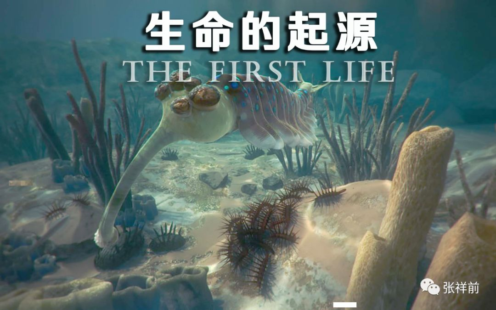

黄鳝进化到最后就变成了蛇，蛇可以完全脱离水，只要在潮湿环境下就可以生存。

蛇进化到后来，就变成了乌龟，乌龟进化到后来，把身上的龟壳脱掉，就变成了像兔子这类的动物，兔子这类动物进化成猿猴之类动物，猿猴这类动物最后进化成人类了。

动物进化出眼睛，也是慢慢进化而来的，早期的生物细胞能够感觉到太阳光的热，所以能够分辨出太阳光从哪个方向照射来的，可以判断出是从左边还是从右边。慢慢的进化，生物最终长出眼睛，可以看到由光线反射的宇宙世界的各种画面。

人类和某些生物现在进化到，不但能够感知光、声音、热、电、磁······

有的还可以感知场，感知时空、加速度等，甚至可以感觉到空间中储存的未来信息。

你们地球人在胎儿刚形成时候，是有尾巴的，只是后来消失了。其实这个尾巴是要把人是从鱼类进化而来的痕迹给表现一下。

十三，宇宙中有人的星球很多吗？

有一次，我问诺顿他们，宇宙中有多少种类的外星人。

诺顿说，

“宇宙中，有人、有生命的星球是很多的，但是，绝大多数的星球都是荒凉没有生命的。

在所有的具有生命的星球上，像有你们地球这样具有智慧人类的星球，所占的比例是很低的，大概的数量级是几万分之一，具有生命的星球，处于原始进化状态中的低级生命占绝大多数。

像我们果克星球，具有制造光速飞碟、能够在宇宙中到处跑的高度发达外星球，数量就更少，大约是亿分之一的数量。还有比我们更加发达的星球。

不过，宇宙中星球的数量，从我们了解的情况看，是非常巨大的，巨大到让人恐怖。极高度发达的外星球，比我们还发达的，其实，数目也不少，不是只有一两个。

当宇宙中智慧人类可以制造光速运动飞碟的时候，才可以大规模星际旅行。有没有光速飞船碟，是宇宙文明重要的标志物。

所以，宇宙有人居住的星球可以分两大类，一类是破译了时间、空间、场、质量、电荷、能量、力---这些宇宙本质问题，必须要破译出来，否则根本就不可能造出光速飞碟出来，掌握了光速飞碟的飞行原理，造出光速飞碟来，具有大规模星际旅行能力的发达星球。另一类是没有光速飞碟，不能大规模星际旅行的落后星球。

一个有人的星球，发明了光速运动飞碟后，科技再经历了千年以上的发展，叫千年级文明星球。我们的星球，就属于这个级别的。

一个有人的星球，发明了光速运动飞碟后，科技又经历了万年以上发展，叫万年级文明星球。

一个有人的星球，发明了光速运动飞碟后，科技又经历了亿年以上的发展，叫亿年级文明星球。这个级别的在宇宙中是少数。

我们还用一个标准来衡量，就是虚拟程度。

一个星球上，人们使用虚拟产品占的比重越大，越发达。虚拟程度接近百分之百，比如电脑、人的身体、建筑、交通工具、工业制造---等都是虚拟的，那就是非常发达的星球。虚拟化程度达到百分之五十的，科技就算是发达的。

宇宙中分布最多的有人、有生物的星球，比你们地球人科技水平还低。”

“在宇宙中，一个很自然的、不成文的规矩：

任何一个落后的、不能进行星际飞行的星球，总是有一个或者几个发达星球的人在暗中罩着、监视着，一个是防止别的发达星球过分染指落后星球，另一个是防止落后星球内部战争，特别是核战争，太过火了，把整个星球给毁灭了。”苏代尔补充说，

“这种的干涉，一般是远程的修改星球上关键人物的思想意识，不是出力、出人。

对照以上的标准，你们地球人属于科技落后的星球。因为你们造不出光速飞碟，你们的太阳系内都不能随便跑。

你们地球上的运动原理是动量守恒决定的，你们的动量是质量乘以速度。我们光速飞碟飞行原理也是动量守恒决定的，只是我们的动量是矢量光速减物体运动速度再乘以质量。

万年、亿年级别的外星人，所使用的飞船，已经突破了这两种运动原理，可以突破空间、时间的限制，可以零事故。

不过，我们要想突破这两种动量守恒，寻找自然界第三种运动方式，不是个容易的事情。目前我们只能肯定自然界存在着第三种运动方式，甚至有第四种运动方式。努力寻找第三种运动方式，是我们的任务之一。”

“其实，宇宙包含了无穷无尽的可能性，你想到的可以实现，你想象不到的，也可以实现。但是，你正真要做的是，找到一个变成现实的途径，要有一个真实的跳板，否则，你又回到了起点，一无所获。”诺顿说，

“万年级别的星球，和我们有少量的接触，但是，不传授科学技术给我们。

他们同样是高度虚拟化的，虚拟化程度比我们更高。

他们的科学技术远超我们的水平，特别是在数学上，强大到让我们窒息死亡的程度。

他们可以制造一些金属液体，当然，我们也可以制造，可以渗透到你们地球人身体里，迅速的修改或者删除地球人的意识，使一个地球人身体没有变化，思想意识却变成了一个果克星人的思想意识。等于把这个地球人置换成我们的人了。

这些金属液体可以被人预先设置程序控制，他们用一组数学代码来控制它们的工作、运行，他们掌握的数学控制代码，我们无法破译。甚至把一组代码甩给我们，我们很长时间都搞不定。

不过，我们就是把一组最简单的代码甩给你们地球人，你们地球人几百年也是搞不定的。

但是，我们集中全球所有顶尖数学高手，精心制造的【可以控制、修改人意识的金属液体】的代码，无论我们怎么努力，他们都可以轻松破译，这个就是我们和他们的水平的差异。

高级文明之间，喜欢在数学上无声无息的较量，这个你可能不理解。而不像你们地球人打打杀杀的、消灭对方身体的那种战争模式。

亿年级别的星球在宇宙中是少数，对我们更是不理睬、不正面接触的，也不会把科学技术传授给我们。对他们，我们了解很少，很忌惮他们，更不敢去招惹他们。

一级压一级，我们害怕万年级别的人，万年级别的同样害怕亿年级别的人。亿年级别的站在我们面前，就像神站在你们面前。”

苏代尔说，“我们在宇宙中到处跑，去绑架别的星球上的人，对于和我们同样高度发达的星球，我们绑架的人都送去，因为害怕他们。

如果绑架一些像你们地球上这种落后星球的人，我们有时候懒得送回去，让其自生自灭。呵呵呵，我有时候也是很懒惰的。”苏代尔不自然的笑了起来。

 

 

十四，果克星球的宗教

有一次，我和诺顿、苏代尔、微丽他们聊起了宗教。

我说，“宗教在我们地球上对我们影响很大，我们主要的宗教是基督教、佛教、伊斯兰教。宇宙中到底有没有上帝、佛、神、真主？如果有的话，在宇宙什么地方？你们果克星球有没有什么宗教？有的话，有那些种类，对你们的影响大不大？”

“宇宙中根本就没有上帝、佛、神，这些都是你们地球人自己编造出来的。”苏代尔很干脆的说，“我们果克星球上没有宗教。”

“我们果克星球早期科技不发达时候，很长时间里是有宗教的，只是现在宗教在我们星球上被边缘化，几乎被完全的淡化了。现在很少有人提起宗教。宗教只是存在于我们的历史和记忆中。”

诺顿说，

“科学和宗教都是人一种认识，科学的认识是从人的理性出发，宗教的认识是从人的直觉出发。

科学的形成开始于人们对事物的好奇心，而宗教形成开始于人们对事物的恐惧。

在我们果克星球早期不发达的时候，在你们地球上的原始社会里，人在雷电、暴雨、洪水、狂风、火山、地震等自然灾害的巨大威力面前，在自己变幻莫测的生老病死面前，在时刻面临同类残酷的攻击和杀戮面前，感到自己太弱小，无法掌握自己的命运，顿时感到恐惧、无助，这个时候需要虚构一个万能的神来保佑自己，安慰自己，这样宗教便产生了。

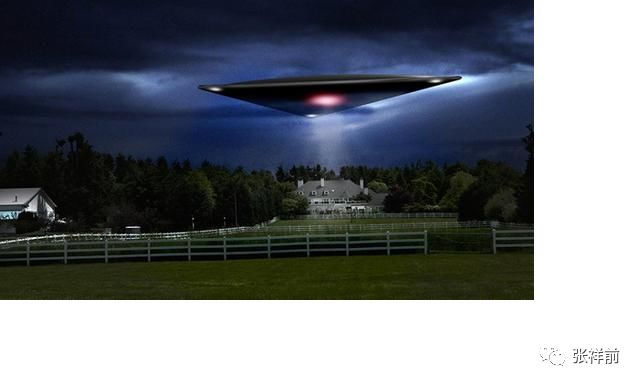

在原始、不发达的社会里人们很愚昧，对自然界的认识很少、很肤浅，所以，对自然界一切事物，都有一种恐惧心，那时候的宗教力量很强大，科学很微弱。宗教是人在恐惧、无助的情况下产生的一种认识。  

人类社会的一开始，宗教和科学是没有分开的。随着人类认识的深入、细化，科学和宗教才逐渐分开来。并且朝着两个对立的方向发展着。

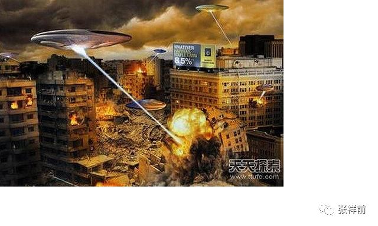

随着人对自然界认识的深入，科学力量在壮大，科学认识的范围、深度在扩展，而宗教力量在减弱，宗教认识的范围在缩小。

宗教对世界、宇宙、人生、社会的解释越来越让人感觉到幼稚、荒唐可笑。而科学的逻辑自洽、定性、定量分析逐渐让人信服。

我们已经破译自然界核心----空间里隐藏的密码。大自然随即将所有的核心秘密向我们敞开，随着我们对宇宙空间、时间、场本质的认识的彻底，这种对神秘宇宙的敬畏之心也将荡然无存，可以说，现在我们已经完全的掌握了宇宙的核心秘密，掌握了自己的命运。

这个是宇宙中所有的具有智慧人类的星球发展的大趋势，不会逆转的。我们果克星球，你们地球的未来，都是一样的。

有人认为宇宙中高度发达的星球，他们的的宗教力量很强大，能够控制整个星球上人的思想，约束人的行为，如何如何的，这些话都是不可靠的。从我们对宇宙中许多高度文明星球的考察，结果发现，高度发达的星球，科学高度发达，宗教的影响力是微乎其微，不存在科学和宗教同步发展的情况，二者是矛盾和对立的。

像我们果克星球这种科技高度发达的星球，人都可以制造自己的身体，可以长生不老，可以把自己的身体用光线代替，变成虚拟人体。可以高速治病，任何疾病刹那间就可以彻底治好。

这些星球拥有强大的科学技术和各种制造能力，一万个人只要一个人在工作，人工智能代替了人绝大多数体力劳动和脑力劳动，物质财富、能源的获取非常的容易，人们不需要争夺物质、财富、能源。

发达星球可以利用强大的科学技术满足于人的各种欲望，包括正常的欲望和邪恶的愿望。不需要用道德、法律、宗教来约束人的各种欲望。

你们地球上鼓励人们用劳动、科学技术来满足人的正常欲望，也只能用道德、法律、宗教来约束人的邪恶欲望。

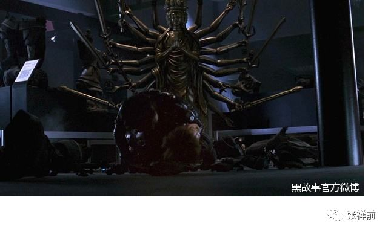

比如，在你们地球上一个成年男人想奸淫幼女，地球上利用道德、法律、宗教来约束人这种欲望。但是，在我们这个星球上，人们开发出许多高度逼真的虚拟性爱游戏，逼真的程度和真实的感觉，人凭所有的感觉器官是无法区分的。

我们还开发许多高度逼真的虚拟游戏，不但有各种各样的性爱游戏，还有国王游戏，有各种战斗杀人游戏------可以满足于人的各种正常的、邪恶的欲望。

我们可以用一种人工场技术，使一种物质很容易转化为另一种物质，所以，在你们地球上珍贵的金银珠宝，在我们星球和泥土差不多，分文不值，大家不会因为争夺这些东西而发生战斗，这个和你们地球上完全不一样。

你们地球人利用道德、法律来约束人的正常的、邪恶欲望，因为有限的资源和能源不能满足任何一个人随心所欲的占有。实在约束不了，很多情况下又要借助宗教的力量来约束人的正常和邪恶欲望。

而我们是用发达的科技去满足人的正常的、邪恶的欲望，而不是约束，所以，宗教在约束人邪恶欲望的功能，在我们的星球上变得荡然无存。

在认识宇宙、自然界方面，我们能够理解宇宙深度奥秘，他们能够掌握自己的命运，我们没有对死亡、疾病的恐惧，没有对生病的担心。没有必要争夺物质财富，没有对生活来源的担心，也没有对人与人之间残酷斗争的恐惧。

产生宗教的基础条件------因为恐惧，宗教的功能-----抑制人的欲望，在我们星球上消失殆尽，这个是宗教在我们星球上被彻底边缘化、很少人提及的原因。

从历史上来看，你们地球上宗教的力量是很强大、持久的，从原始社会宗教诞生开始，宗教一直在伴随、影响着你们。

在你们地球上，宗教也在退化，未来不会出现影响你们地球人思想的大宗教领袖。宗教对你们的影响力已经没有古代那么大了，宗教教主的影响力也变得微小，人们对宗教教主失去兴趣，不再过分崇拜。而对科学巨人另眼相看，把科学家当做神对待。因为你们对自然界的认识已经积累了很多知识。

未来对你们地球人有巨大影响的是重大科学发现，是大科学家。

可以预言，宗教在你们地球上也是越来越淡化，逐渐被科学所取代，随着你们地球上科学向宽度、深度的发展，科学越来越显示其强大的力量，而宗教因为被人看不起而逐渐被抛弃。

宗教的另一个功能，给人解除困惑，同样被科学击败，因为我们的科学，可以彻底的认识了宇宙一切秘密，宗教那种肤浅、幼稚、从人直觉出发的解释，没有人再相信了。”

十五，初次接受人体检查和实验

有一次，诺顿和苏代尔、微丽三个人把我领到一个房间里，里面有两个人，可能是个机器人。

房子中央放置一个窄窄的床，只能容纳下一个人。床上有白色的布之类的东西覆盖着，床的一头翘得很高。

诺顿很郑重的说，

“我们现在要检查你的身体，你要相信我们的技术，不会给你带来任何痛苦和不适。现在你就睡到这个床上。”

诺顿命令我，我乖乖的躺在床上，但心里极度害怕，想象着自己的身体被他们大卸八块，利刀切割自己身体的巨疼。

这个时候，突然周围光线完全的暗下来，一遍漆黑。突然感觉我身体分成两下，一个我飘到空中，能够从远处看着另一个我躺在床上，是不是全球公众信息网给我提供的图像信息服务？

床头和床尾各站着一个人，后来，其中一个人用一个薄薄的四四方方的刀片，把我的咽喉切开一个四四方方的切口，并且好像是在用羽毛轻轻的掸我咽喉处的切口。切、掸的时候，丝毫感觉不到疼痛，只是痒酥酥的感觉。

全球公众信息网的客服可温翻译了他们的话，意思是大概是说我的咽喉不好，并且说我咽喉以后要生病，咽喉的病疼要伴随我的一生。

果然，我从20几岁时候生了慢性咽喉炎，一直到现在，时刻在疼痛，经常犯，苦不堪言，为治疗这个病，花去了许多钱，被骗很多次，没有任何效果，一直痛苦着。

等房间灯光亮起来，从远处看着自己身体的另一个我，突然和睡在床上的我合二为一。因为没有经历切割肌肉的痛苦，我一阵激动，悬着的心一下地轻松下来。

我看到了诺顿，从床上坐起来。诺顿问我，我脑海里那个全球信息网客服可温翻译为：“你有没有感觉到有什么东西在你腹部和大腿交界处？”

“好像是一条蛇。冰凉凉的，从那里游过。”我回答。

“后来去哪里了？”

诺顿歪着头，盯着我看一会儿，没有等我回答，就走了。

突然想到可能有一条冰凉凉的蛇钻进我的体内，心里又害怕起来，刚刚好起来的心情，又沉重起来，并且有恶心的感觉。想到腹中可能有蛇，越想越恶心。

像这样的人体检查和实验，后做了很多次。

有的实验中，不但感觉有蛇钻入体内，而且感觉有肉管子、蚂蟥之类钻入体内。

有一次，感觉自己变成了一副白色的骨架平躺在那儿，“哪是谁？”

“那就是你啊！”全球信息网客服可温在回答我。

“那怎么会是我呢？”没有声音再回答我了，我也是无法理解，好在像噩梦结束一样，不久我清醒了，实验也结束了，一切恢复到正常状态。

有的实验对我体内消耗很大，特别是有肉管子从肛门钻进去，感觉是太粗、太粗，好像肉管子有自己小腿那么粗，是硬生生的挤进去的，在我体内到处游走。

体力极度透支后，接着就是像死了那样昏睡，醒来时候一身大汗。

有时候实验的时候，感觉自己睡得很死，腿伸得一个姿势时间久了，很是酸痛。我一想到这儿，他们好像知道我的心思。以后他们经常在我膝盖下垫上东西。

多次实验后，我自己也有了经验技巧，当昏睡要降临的时候，尽量的摆好睡觉的姿势，避免醒来时候身体哪儿不舒服。

十六，果克星人不讲道德

我在果克星球，看到果克人行为很放纵，特别是在性方面。

有一次，我和微丽、苏代尔、诺顿他们在室外，看到有六个果克女人，坐在地上，可能是在玩，或者是在聊天。

看到我们的到来，都盯着我们看，可能看到我的个子很高，样子特殊。她们都兴奋站起来，像我们挥手，扭动身躯，做出各种妩媚动作。

忽然看到有一个人衣服在身上突然消失，接着另外几个人身上的衣服也全部消失的干干净净，白花花的肉体在明亮光线下，特别的闪眼。

有的人从下身伸出许多细细的肉管子，像草裙子那些围在身边。

有的人身上不停的闪着耀眼的光，有的人身上从上到下，又从下到上，在不停的在变化颜色。并且，都扭动着身躯，做出极度下流的动作，看样子在试图引诱我们。

“几个女流氓，真不要脸，在我们地球上是要被警察抓起来的。”我虽然看得心惊肉跳的,想入非非，但是，仍然忍不住谴责起来。

“我们的果克星球，就是一个淫荡的星球。”我耳朵中的全球运动网智能客服可温忽然说话了。

我把看到的情况向诺顿他们说，可是他们却说这些女人都有衣服在身上，没有看到她们赤身裸体的，也没有看到她们放荡的行为。

“可能她们开了定向屏蔽功能，就是请求全球运动网和全球信息网把她们真实的裸体形象、放荡行为，只展现给前哥一个人看，把我们屏蔽了，我们看到她们的样子，是全球运动网和全球信息网提供给我们的假信息，只有前哥看到的才是真的。”微丽说，

“这些人是对前哥一个人放电啊，对诺顿、苏代尔，她们看习惯了，她们可能没有兴趣了。”

“我发现你们果克人控制自己能力很差，也不讲道德，更没有羞耻心。我们地球人普遍认为科学水平和道德水平是成正比的，人的科技在发展，道德也是在同步提高，人也变得很文明。社会中人的道德水平高，才可以配拥有高科技。你们是宇宙高级文明的星球，怎么会是这样的？”我不解的问。

“我们果克人不讲道德的，也不提倡人讲道德，没有德道的约束，也很少有法律约束。”诺顿说。

这个话要是苏代尔说的，我可能认为是在开玩笑，但是，出于诺顿口中，我有些惊讶。

诺顿给我解释，他们果克人为什么不讲道德。

“科技的发展，就是因为要满足人的欲望，人的欲望是科技发展的动力，也是社会发展的动力。这些欲望包括了人的良性、正常的欲望，也包括了人的邪恶的欲望。

比如，你们地球上一个成年男人，想奸淫幼女，在你们地球人法律、道德都是不允许的，在我们的星球上，开始时候，法律、道德也是不允许的。但是，人这些邪恶的欲望不是因为你法律、道德不允许就消失了，实际上会是一直存在着。

所以，我们现在开发了许多虚拟性爱技术，来满足人这种邪恶欲望。这些虚拟性爱游戏，其逼真程度可以达到百分之百，也就是一个人如果你不告诉他，这个是虚拟游戏，他凭自己的感觉，是无法区分这个是虚拟还是真实的。

比如，一个人想杀死另外一个人，在我们的果克星球上是做不到的，你在动手杀他的时候，全球运动网和全球公众信息网会自动识别，你这种行为具有危害他人的趋势，就会把你们强行分开，使没有办法危害到他。

但是，可以在虚拟游戏中去杀人。

我们用发展科技来满足人的各种正常的、邪恶的欲望，而不是强调道德、法律来约束人的欲望。所以，我们的科技很发达，人的道德根本就不高尚，所谓的发达外星球上人们普遍的道德高尚，只是你们地球人的一种猜测罢了。

我们不但不用道德来约束个人，也很少用法律来约束个人，我们的法律只是约束组织、人造智能、各种算法等。因为在我们果克星球上，由于强大的全球运动网和全球公众信息网对全球每一个人的不间断的跟踪和保护。

如果不依靠组织，掌握先进的算法，单凭一个人的力量，是无法实施做出危害他人、危害公众的行为来。

我们的普通人生活的全部就是玩，我们有许多游戏场馆，同时有许多虚拟游戏，这些虚拟游戏的逼真程度是和真实的几乎没有区别。

各种虚拟旅行的游戏，给人的感觉和自己亲自去旅行没有任何的区别。

我们也是开发出许多当国王的游戏，如果你有权力欲望，你想当国王，想带领大家攻城拔寨，占领别的国家？有着各种各样的国王游戏供你选择。

你想星际旅行？想到陌生的星球上探险？你想和半人半虫子的女人斗智斗勇？

你想逃脱美女蛇布下的陷阱？·····我们开发了许多这种游戏，你可以一直玩下去，永远没有结束。

只是我们几乎没有夺宝游戏，因为我们很早就会把一种物质轻易的转化出另一种物质，你们地球上人们普遍喜欢的金银珠宝，在我们眼里早就分文不值了，我们没有人喜欢这个。

我们用发展科技来满足人的各种正常的、邪恶的欲望，而不是强调道德、法律来约束人的欲望。

一个星球科技落后，人的很多欲望都被认为是邪恶的，因为有限的资源无法满足每一个人的欲望。但是，当科技发展到一定程度，没有人觉得这些欲望是邪恶的，大家都觉得很正常，或者习以为常。

所以，在我们的星球上，虽然科技发达，但人的道德根本就不高尚。我们也不用宗教信仰来约束人，宗教在我们星球上影响力接近为零了。”

十七，我的外星女友

有一次，苏代尔建议，我们晚上出去玩。微丽和诺顿都表示同意，我当然也想出去。诺顿建议带上自己的女友，诺顿用左手按住自己的耳朵，可能是通过全球信息网给女友发信息。果然，一会儿，一个美女突然的出现在我们面前。

这个美女从后面看身高、身材和微粒丽差不多，正面看，非常的漂亮、美丽，人的一切都显得非常的精致，相比微丽，面相要端正一些。她的头发黑色的，夹杂一些耀眼的彩带样的东西，极为柔软的样子，分成两束，从耳朵边垂下。大大的眼睛，尖尖的下巴，极像我们地球上的卡通人物。

她穿着也非常的简约、性感，上身一个银白色的短汗衫，下身一个黑色的超短裙，这个短裙像许多柔软的细线做成的，并且闪烁着金属光泽，她走动的时候，隐约可以看到她短裙里面雪白的肌肤。\ |https://mmbiz.qpic.cn/mmbiz_png/ctwXrXAibr6LVUVAMVPcHibgxkGQzQxIPSdGZmbwBiaC4DzDOGxEkg9quKicCoOp5tguoYTibCGdMyuFj0WBicfqZY1Q/640?wx_fmt=png&tp=webp&wxfrom=5&wx_lazy=1&wx_co=1|

她走到我面前，仔细的看我的眼睛，由于她太过于漂亮、性感，我压力很大，不由自主的退后一步。

她对我说话了，全球信息网客服可温翻译出这样的话，“你是来自地球的前哥【可能是诺顿告诉他的】？长得很漂亮、很帅气的，就是个头太高了。我可以摸摸你吗？”

“可以啊。”我嘴上答应了，心里挺紧张，她摸哪儿？不会摸小鸡鸡吧？幸好她只是先摸摸我的手，然后摸摸我的脸颊。我这个是第一次接触果壳星人的肌肤，感觉皮肤是极其光滑，只是冰冷冷的，有点硬，不够柔软。

“咬，感觉不一样的。”诺顿的女友很兴奋的样子，“地球人的皮肤暖暖的。”

诺顿和苏代尔都面带微笑，只有微丽好像不什么高兴。苏代尔不甘示弱，也按住自己的耳朵，发信息给自己的女友，不一会儿，他的女友突然的出现在我们面前。

苏代尔的女友身材、身高和微丽、诺顿女友都差不多，面相也是非常的漂亮精致，但是，苏代尔的女友明显有些妖艳，她的眼珠像钻石一样闪着璀璨的光泽，她很特别的是眼睛周围的肌肤好像是灰色的金属制造的，闪着金属光泽。

并且，这些类似金属肌肤和别的地方正常的肌肤不是截然分开的，而是慢慢的过渡的，颜色也是从粉白色逐渐变成灰色，到了眼眶就完全的变成黑色，显得极为鬼魅和邪恶，但是又非常的的好看和自然，显得很有魅力。

她上身的黑色皮质紧身汗衫和紧身超短裙是连在一起的，颜色是黑得发亮。超短裙紧紧的包住臀部，只是在超短裙的下摆才微微散开一些，身材是非常的火爆。

她搂着苏代尔的腰，用幽幽的眼神盯着我看，小声对苏代尔说着话，我的耳部立即出现全球信息网客服可温翻译的话，“这个大个子是地球来的？块头很大啊，个子很大啊，人是不是很傻？”

“不傻的，他人很聪明的啊。”苏代尔回答。

“我们现在就出去玩吧。”诺顿建议。

“微丽，你的男友呢？”我好心的问。

微丽哼了一声，没有回答我，而是闭上眼睛，把下巴猛的一扬，头向上点了一下。

我没有明白她的意思，“你还没有男友？”

“你就是他的男友啊，”苏代尔微笑着说，“我们刚见面时候就承诺给你安排一个女友，就是她啊。”

“真的嘛？微丽，我是你的男友，你现在就是我的女友？”我有些不相信，转身问微丽。

“你不是我的男友，你是我的食物。”微丽很高傲，扬起头，不屑一顾的样子。

“什么？我是你吃的食物？”微丽的话让我感到不明白。

“活活，”苏代尔大笑，“微丽说你是她的食物，其实是翻译的不准确，准确的翻译应该为：你不是我的男友，你是我的玩具。”

“这样翻译才最为准确：你不是我的男友，你是我的宠物，只有这样翻译，才不会引起误解。”诺顿说，

“不过，前哥在我们果克星的这段时间内，我们给他安排了女友，这个女友就是微丽。”

“别害怕，微丽不会把你当食物吃掉的，”苏代尔诡秘的说，“她会对你好的，你能体会到她致命的温柔。”

“我们走吧。”诺顿用手一挥，这个动作和我们地球人示意走路的动作差不多，我们6个人就这样步走出去了。

诺顿和苏代尔都是搂着自己女友的腰，非常亲密的样子。我没有胆量搂着微丽的腰，连拉着她的手的勇气都没有。我那时候性饥渴特别严重，越是特别渴望女人，越是不敢碰女人的身体。

不过，我感觉到微丽也没有拉我手的意思。我只好挨在微丽的身后，和诺顿、苏代尔他们一起逛大街。

果克星球的城市夜晚璀璨的灯火，不仔细看，以为是地球上特大城市。只是果克星的虚拟大楼显得特别巨大，这些巨大的虚拟建筑上有着各种各样的果克星文字和一些图案，这些文字和图案非常巨大，像是悬浮在空中，不和建筑物相互连接，不用问，这个也是果壳星高超的虚拟成像技术的结果。

我跟在他们的后面，心里想，他们不吃不喝，不可能上酒吧，他们能够玩出什么花样来？

我们走到一栋巨大建筑物前，我们从大门进去，感觉里面有很多人，人声鼎沸，像地球上的歌舞厅。

我们走近了，我一眼看到许多果克星人，排成两排，中间一个非常长的类似玻璃的长方形柜子，宽度我估计有2米，非常的长，一眼是看不到头的。里面装满了水，有许多比果克星人还要小得多的小人在水里面跳舞。玻璃柜外面看这些人有的随着节奏也在跳。

“这里面的小人是虚拟成像技术搞的吧？”我问诺顿。

“不是的，这次你猜错了，里面是真实的人。”诺顿说。

“那你们果克星上还有比你们身材小得多的人？”

“我们果克星人身高都是一样的，这个是利用人工场改变了物体周围空间，使人的视觉发生错误，里面的人觉得自己身高没有变化，就是一种错觉，如果这些人从里面出来，和我们身高都是差不多的，你不相信我们可以试一试给你看。”

诺顿说完，叫自己的女友进去跳舞，他的女友答应了，走到附近一个圆形的台子上，突然上面快速的落下一个类似玻璃做的透明圆柱筒，把诺顿的女友罩住，随即一个巨型手臂一样的东西把这个圆柱体连同诺顿的女友一同移走，这个过程非常快，一秒钟都不到，一闪而已。

诺顿用手指着玻璃水柜中一个人，说是他的女友，叫我看，我伸头一看，果然是他女友，只是身材变得很小了，衣服也换了，变成紧身的泳装。她也看到了我们，挥舞双手向我们示意，然后也跳起了舞。

“他们在水中怎么呼吸？”我看到了他们都没有带水下呼吸的工具。

“我们果克星人有时候是不需要呼吸的，因为人工场可以为我们提供血氧的，就是直接向血液中供氧。”诺顿说。

诺顿女友穿着泳装身材暴露更加完全，果克星女人从后面看和我们地球人身材差不多，只是臀部大的突出，从前面看，两腿之间夹着一个圆柱体，鼓囊囊的，不知是什么，诺顿女友虽然穿着泳装，我仍然看不清楚是什么。

诺顿女友水下跳舞时候，离我们最近，她向我们游过来，再转身时候，我看到她后面的臀部，心里一激灵，感觉非常诱惑，一种本能的性冲动。

我感到有些不自在，望了一眼诺顿，诺顿似乎并不在意。我再望一样微丽，微丽有一些莫名其妙的神情。

苏代尔鼓动自己的女友去水中跳舞，但是，他的女友拒绝了。一会儿，诺顿女友出来了，泳装也换成本来的服装。

后来，我们看到一个大玻璃房子，里面许多蓝色的翻滚的气球，每一个大约有篮球那么大。我看他们从似乎是透明玻璃墙壁上缓慢的走进去，我也跟着走进去。

我有一种身体融进玻璃的感觉，但是身体仍然很轻松的进入了蓝色气球房子里。

玻璃房子深不见底，我一直向下坠落，但是，下面的蓝色气球密度大，翻滚速度更快，我终于被翻滚的气球托起。

气球很光滑，对人的皮肤有轻微的吸引力，在我的皮肤上摩擦，好像是妙龄女性对自己抚摸的感觉，非常的舒服。我心里像，不久可能真的和果克星球的女性发生性爱，和气球的摩擦，是不是一个前奏？

我在蓝色气球里翻滚，不久看到了绿色、红色、白色的、粉红色等各种颜色的气球，又看到了大小不一、形状各异的气球。

后来，我看到了可能是直径极为微小的气球，有的居然能够缓慢的穿过人的身体，并且在人身体内部造成轻轻摩擦的感觉，感觉能够影响人的情绪，使人的心情变得好起来。有时候又感觉自己像泡在液体里，不过，对呼吸丝毫没有影响。

最后，我出现在一个过道里，看到了诺顿和苏代尔他们。我们都没有问对方，大家沿着这个长长的过道向里面走。

周围都是一排排房子，墙壁可能是虚拟透明的，里面各种各样的气球，有的面包形状，有长条形状，有的是丝状。有的像丝瓜，有的像面包圈，有的像藕·····

但是，大部分里面都没有人在玩，我忽然有一种很浪费的感觉。

过道的地面是非常精致的、可以发光的地板，好像是金属制成的，发出幽蓝色的光芒。

走着走着，两边又出现了高高的黑漆漆的墙壁，天空也是黑色的，看不到头上的星星，我估计仍然是在室内。

地面蓝色的光芒把我们人都照射成了蓝色，诺顿、苏代尔和他们女友都是手拉手走着，我仍然是和微丽一前一后走着。

突然，黑漆漆的墙壁上伸出一个东西，射出一束雪亮的密实的白光，射中了诺顿，把诺顿击个透心亮，我吃了一惊，而诺顿和苏代尔却大笑。

“这个虚拟光束，没有事的。”诺顿说，但是，我看到了诺顿身上那个雪亮的穿心大洞仍然在。

突然苏代尔惊叫一声，他也中了穿心虚拟光束，接着，苏代尔和诺顿的女友、微丽都中了虚拟穿心光束，我是最后一个中了虚拟光束的。

后来我们在蓝色地面上闪转腾挪，避让虚拟光束。尽管如此，我们都身中数枪，苏代尔跳的是最积极的，但也是最惨的，中的虚拟穿心光束最多，人都变得惨不忍睹，身上到处都是亮着的大洞。

我们走出了蓝色地面，我们身上的亮洞立即全部消失掉。

后来我们经过了分身过道，人在这个过道里面走，后面的人看到前面的人分成了两片，仍然在地上走着，非常的有趣，又有些恐怖。

我们继续往前走，突然看到地上有许多尖刀，路面也变得坑坑洼洼的，而且布满了许多黑色的深不可测的大洞。诺顿毫不犹豫的往前走，并且告诉我们，

“这个是虚拟成像技术搞的，是假的，路面仍然是平整的。”

我们试着走过去，果然路是非常的平整，我们一开始慢慢的寻找好路走，后来就加快了步伐。有趣的是，当你踩在尖刀上可以看到尖刀是刺穿了你的脚的。

微丽和诺顿、苏代尔的女友她们三个女人走的很慢，落在后面。我想地球上的女人和她们都是差不多的，这种情况下可能也是不如男性跑得快的。

诺顿说，“你们闭上眼睛走，就快了。”说完，跑回去，拉着自己的女友一同走。苏代尔也跑回去，用手拉着自己的女友走。

只有微丽一个人远远的落后了，我感到机会来了，跑过去向她伸出了手，她迟疑了一下，但还是把手递给了我。她的手也是冰冷冷的，不够柔软，比我们地球上人的肌肤硬得多，但是很光滑，如同沾水的黄鳝和鲶鱼的光滑程度，感觉皮肤的表面一层很柔软，下面很硬，硬度差不多也如同黄鳝的背部，如同摸气压很大的充气内胎那样的手感。

她的手很小，但是，手掌很厚，手很丰满，不过，一点也感觉不到她有骨头。

由于路是弯弯曲曲的，女人们仍然是跌跌撞撞的走，这样我的手时不时的就碰上微丽的身体，她的身体同样冰冷冷的，极度光滑，但是不够柔软。和她身体的接触使我心痒痒的，性冲动使我难以自持。

我们继续的往前走，突然看到前面是一个下坎坡，有许多台级，第一个台阶上有几根像我们地球上的街上的路灯立在那里。

有几个果克星男女拥抱着站在这个类似路灯下，我惊奇的发现这个路灯竟然向这些男女快速的滴下透明的类似胶水的东西，一下地把一对男女包裹起来，变成一个大圆球，快速的滚下台阶。

诺顿、苏代尔和女友们毫不犹豫的走到奇怪的路灯下，变成了大圆球，像保龄球那样滚下台阶。

机会来了，我也抱住了微丽，站在这个奇怪的路灯下，微丽没有拒绝我，可惜她的头只有我的胸口高，我感觉那些透明液体要落下的时候，我迅速的把微丽抱起来，她叉开腿，骑在我的腰上，就被透明胶水包住。我们紧紧的搂抱着，也滚下了台阶。

微丽非常的兴奋，尤其是在台阶上被高高弹起，再重重的摔下来，微丽就疯狂的尖叫。

我呢，紧紧的搂着微丽，心里有一种强烈的冲动，一种本能的性冲动感觉，感觉下面的小弟弟只有进入她的身体，才会有无比的快感，可是我身体被透明胶水包裹着，无法动弹。

台阶滚完了，我们停在地面，那些胶水也从我们身上逐渐的融化，先是落在地面，然后像水一样流淌走了。苏代尔和诺顿他们也不见了踪影，不知道那里去了。微丽用手按着耳朵，大概是通过公众信息网和诺顿他们在联系。

“微丽，诺顿他们那里去了？”我问。

“不管他们，我们回去。”微丽冲上前搂着我的腰说，“我刚才好像有了感觉，我们现在回去，回到我的小窝里，我们继续这种感觉，很美妙，是吧？”

微丽举起左手，在耳朵边俏皮的挥一下，恍惚之间，通过全球运动网，我们就来到了微丽家。

微丽家也是非常的精致，房子和用具很多是圆形的，里面有一些奇异的植物和花草之类，很多半透明的窗纱之类的东西垂在房间里，看东西隐隐约约的，体现了女性一些独特的个性。

房屋里看不到电灯之类的东西，但是，光线很柔和，感觉是从墙壁里均匀发出的。

微丽家还有两个机器人，暗红色的身体，身体时时刻刻微微的抖动，像是许多纷纷扰扰的微小的东西组成。

微丽斜躺在虚拟床上，样子高贵，姿势很优雅，眼睛直直的看我，向我招手，意思可能是要我靠近她，什么意思？她想要我和发生肉体关系？

我一阵激动，走到她面前，果然她说，“我要你在我的身体上运动，不过，运动之前我要给你食物，是碳水化合物，不过是固体。”

微丽捂住耳朵，一会儿，一些条状的食物出现在我身旁的一张桌子上。

没有筷子、刀叉之类的餐具，我用手拿着吃了起来，感觉味道很好，而且有嚼劲。

地球人很奇怪，到了一个陌生的环境，总是要认一个人作为亲人，一切行动都跟着这个亲人。我一开始心里认诺顿为亲人，现在又好像转移到微丽身上。

我吃完了，微丽站在我面前，我们要正式那个了。我心里想，自己无数次预测自己的第一次性爱的伴侣是会是哪一个女孩，会在哪一个地方，万万没有想到会是在外星球，而且伴侣不是地球人。

微丽站在我的面前，突然上身黑色的、下身紫色的衣服就迅速的消失了，露出雪白的肌肤，两个乳房很长、很尖，向一对羊角戳在前胸。感觉很震撼，给我浑身一颤的感觉。

她根本就没有脱衣服的动作，真是奇怪。不过，她的身上肌肤的颜色又开始变化，由白色变成谈谈的粉红色，再变成谈谈的黄色，再变成细腻的绿色，以后又变成蓝色和紫色，后又变回白色。在变成蓝色的时候，身体会突然发出比较强的淡蓝色的辉光，这种情况我以后多次见到。

最后黑色的衣服好像是从她肌肤里长出来的。她的衣服和她的肉体是融为一体的？当时真是无法想象。

后来，我知道是他们的全球信息网和全球运动网在她身上搞的虚拟图像，她所谓的衣服只是一个虚拟图像而已。

他们皮肤的颜色、皮肤上图案的变化，都是全球运动网和全球信息网远程搞的，他们皮肤看起来漫反射的感觉，也是他们两大网络修饰的结果。

他们的皮肤在完全没有修饰的场景下，也是粉白色的，看起来也是很漂亮，其光滑、细腻的程度，仍然是我们地球人皮肤所望尘莫及的。

果克星人，也有真实的衣服，不过大部分情况下衣服都是虚拟图像。

他们身上没有真实的衣服，是不是你用手摸，就一定摸到他们的裸体身体？这个也不一定，他们可以请求全球运动网在自己身上制造各种屏障效应，使你手摸上去，有着各种不同的感觉，未必完全就是裸体的感觉。

后来微丽的下身突然又伸出许多感觉柔软的细管子，大约有上百根，雪青色夹杂着紫色，颜色很深，而且是极其鲜艳，管子头部可以形成一个螺旋式的圆圈，圆圈的颜色淡了很多，但是看起来更加的鲜艳，像许多花朵簇拥在她的周围，这个就是果克星人女性最重要的性器官。

这个肉管子快速的出来加上突然盛开的动作，可能就是她们果克星球女人性感的标志，可是由于出现得太突然，给我当时的感觉倒是很渗人、恐怖。

微丽还告诉我，他们的男人性器官也是管子，不过只有一根，储存在身体内部，可惜我没有看到。

我再也受不了她的挑逗，她的下身柔软的细管子一收缩，我就迅速的脱了衣服本能冲上去，搂着她，可是她一缩身，很敏捷的躲开了我，感觉她很有力量。

“等一等，我要开一个设备，我们在一起做爱的信息要转换为数字，诺顿需要这些信息。”

我心里说，靠，诺顿你要这个信息干什么？

微丽说她开好了设备，但是，我没有看到她是怎么开设备的。微丽后来好像是一下地跳在我的身上，叉腿夹住我的腰，她浑圆的肩膀，极度光滑的肌肤，搂着很刺激，可惜我的小弟弟进入了她的身体里的时候，感觉她的私处是太宽松了，没有感觉，有点失望，外星人毕竟不同于我们地球人啊。

我当时就联想到
“筷子搅水缸”这个词，我曾经听一个人说，他们附近村子里一个身材特别高大强壮的妇女，强奸了一个偷她家西瓜的上学男孩。

小男孩中午一个人上学偷西瓜，被看西瓜的妇女逮着个正着，小男孩自己心虚，只好低下头，任凭她处罚。

她先是没收了小男孩课本，后又突然把这个男孩拖到西瓜棚里，按到在地上，飞快的脱下小男孩的裤子，又脱下自己的裤子，用水桶粗的两个大腿压住小男孩，这个妇女的大腿比男孩的腰还要粗许多，小男孩根本翻不了身，这个妇女又把小男孩课本拿在手中，威胁说，如果喊叫、不顺从、反抗的话，就把他的书统统撕扯掉，最终她成功的强奸了小男孩，揉捻了很长时间才放开他。

村里有老男人看见小男孩就问，“啥感觉？像不像筷子搅水缸？”

我那时候岁数不大，刚懂男女之间的那种事情，听人这么一说，也知道那是啥意思。

过了一会儿，微丽的下身那些柔软的细管子又出来了，我明白了她们两腿之间鼓囔囔的圆柱形的里面是一个很大的空腔，就是储存这些柔软的肉管子的地方。

她们下身储存肉管子的空腔一直通到她们的嘴巴，她们男女都没有胃、肠、肝、肾、膀胱等消化器官，体内只是一个简单的空腔。

后来，我看到微丽在没有性兴奋的正常情况下，这些肉管子储存在下身的空腔里，只是露出一个头，像一个个小乳瓜那样悬挂着，颜色是紫嘀嘀的。

微丽这些柔软的肉管子碰到我的大腿，像是溪水流在我的身上，碰到我的小弟弟，很快就裹上来，渐渐的快感来了，越来越爽、越刺激的感觉，但是，对我体力消耗得快。

可是我的睡意突然来了，真是不争气啊，怎么这个时候想睡觉？

睡梦中，我回到了地球，到处讲述果克星球的经历，居然出名了，被很多国家邀请。

有一次，被日本的一个研究组织邀请，看到了这个组织的会长的16、7岁的女儿非常的漂亮，怦然心动，由于太性感，都不敢直视她。

可是她对我非常感兴趣，在开完会休息时候，她非常诡秘的样子，邀请我到屋子外的田野上玩。

我跟随她一道到了田野，田野上长满了很高的荒草，她突然的蹲了下来，把裙子捋上来，里面没有穿内裤，裸出了雪白的臀部和私处，然后裂开嘴对着我坏笑。

真不像话，这个女孩她的父母可能从来就不管束她，我心里说，要不然怎么叫日本鬼子，男女都是淫棍，真是太不像话了，男人到了中国就喜欢强奸中国女人，女人喜欢到东南亚去卖淫。

我站在那里，没有再跟着她走。那女孩索性把所有衣服脱了，在荒草中奔跑、转圈，荒草上的露水沾在她的雪白娇嫩的肌肤上，她奔跑的时候长发飘逸，忽然给我有一种极度的美感。

她那欢乐、无忧无虑的神态感染了我，我的想法又变了，我想她们其实是单纯和快乐的，她们是正确的，人生苦短，而我们中国人可能受到的各种束缚太多了，活得是不是那个太苦了？

那个女孩慢慢的走到我的眼前，我想拥抱，我感到很紧张，喔，怎么越看越像微丽?

我突然的醒了，发现自己躺在床上，而微丽的确是赤身裸体的站在我的身旁。一种强烈的冲动使我跳起来，我迅速的把微丽掀翻在床上，把她压在身体下，剧烈的运动起来，她好像也兴奋起来，我们展开了肉搏战。

可是我马上就领教了果克女人的厉害了，她们娇小的身材欺骗了我，她们体力超强，能量极大。虽然我的身体强壮程度在地球上是一流的，可是远远的不是他们的对手，我们地球人身体素质和他们可不是一个档次的。最后，只有求饶的份了。

 

 

十八，云中漫步

由于太疲劳，我睡的很香，被微丽的手在脸上抚摸而弄醒，起来一看已经是天亮了。

“我们今天出去玩，”微丽说，“我和诺顿他们商量好的，有一段属于我们俩的时间。”

我明白果克星球高度发达，绝大多数人日常生活就是怎么去玩，不用劳动或者很少劳动。

我建议微丽到农村去玩。微丽怔怔的望着我，没有说话。

“我们到乡下去玩，”我说。

微丽还是怔怔的望着我，我想可能微丽不知道农村、乡下是什么意思，就说：“我们到田野上去玩，有泥土的的地方玩。”

也不知道微丽有没有听懂我的话，没有答话，她在耳朵边一按，我们通过全球运动网在微丽家立即消失，出现在果克星球一块天然土地上。

这块土地是铁红色的，我想可能是氧化铁含量高的原因。一眼望去，到处是各种植物，有草本和大树之类的，各种奇异的花草。以绿色为主，白色的、黄色的、红色的花点缀其中，给人姹紫嫣红的感觉。

偶尔蓝色的、黑色等其他一些颜色的花，给人很神秘的感觉。

和地球有所不同的是细细的小草很少，花草的叶子一般都是粗大而饱满，表面看起来好像有蜡质。

铁红色的土地中也有小水塘。我在家里经常逮黄鳝，我特意看看小水塘有没有黄鳝，虽然看到不少水生动物，水塘边的泥土也有水生动物钻的洞，不过，没有看到黄鳝和地球上常见的水生动物。

阳光很明媚，但是，不是很暖和，有种阴冷的感觉。

我们在花草中漫步，突然看到前面有一个绿色的小屋。走到小屋附近，才看清楚这个小屋是一种藤条按照特定方式生长而成的。

小屋是两层，有楼梯，有门窗，都是藤条按照一定模式生长构成的，底下一层也是长满的藤条，非常的精致。我也看到了一些小虫子在藤条上爬来爬去的。

我和微丽走进了小屋，我搂住微丽在藤条小屋里慢慢的走着。

此时此景，我好像在以前的梦中见过，忽然有一种莫名其妙的冲动，上前把微丽压倒在地上，我们在满是藤条的地上打滚。微丽没有生气，很迎合我的意思，最后，微丽的衣服突然从身上消失，在这个满是藤条的小屋我们又一次非常愉悦的肉体交欢，我在地球上，好像以前梦过在这个场景下，和一个女人有过肉体的交欢，这个梦境的记忆很清晰，经常荣饶在脑海里，没有想到现在在这个地方变成了现实。

我穿好衣服，而微丽没有穿衣服的动作，身上粉白色肌肤的颜色慢慢的改变，衣服逐渐的在她身上显现出来，我搂着微丽，走出了藤条小屋。

我刚想询问微丽我们再到那里去玩，突然，我和微丽脚步一轻，双双的升到空中悬浮着，我大惊，“伊呀，这个是怎么一回事情？”

微丽说：“这个是我请求全球运动网搞的呀。”

“全球运动网只能把东西和人从一个地方送到另一个地方，怎么会把人搞在空中悬浮呢？”我问。

“运动网把我们送到空中后，再送走很小一断距离然后停下，再把我们送走很小距离，再停下，这样反反复复的，我们就悬浮在空间中了。”微丽解释说。

“奥，我明白了，由于运动网在空中把我们送的距离非常的小，隔很微小的时间又把我们送走很小一段距离，这个距离和时间小到一定程度，我们人就感觉不到自己在运动啦，就像悬浮在空中了”

“嗯，是这个意思，你真的很聪明啊。”

这样我和微丽在空中很愉快、很随便的漫步，后来我们又上升到云层中，云层其实就是一些气雾而已。我和微丽在云层中漫步，感觉很爽，但是看地面不清楚。后来我们又降低了高度，地上的景物一览无遗。

我心想，科技高度发达就是好，人心里想怎么着就怎么着，什么想法都可以实现，真是随心所欲的感觉。

后来，我想看看果克星球有没有河流。

微丽说。“我们果克星球也有许多水的，不但陆地上河里、湖泊有水，而且也有大海，我现在就带你看看我们的河流和湖泊。”

我们从空中降到了地面，出现在我们眼前的确是一条弯弯曲曲的河流，我们站在河堤上，看到河流虽然弯弯曲曲的，但是，显然是被人高度加工过，河堤被人工修筑过，覆盖着类似塑料的东西在上面，连续不断的覆盖在河堤上，一眼望不到头，显得非常的整体，河水碧清的，毫无污染的痕迹。

后来我又建议看看大的河流，我们果然看到很大河流和很大的湖泊，河的河堤和湖泊的岸边都是人工修筑过的，很整齐的样子。但是，没有看到人居住的房屋。

在一个很大的湖泊边，我们停下了脚步，看到湖泊水边一块草地上和草地附近的岩石上栖栖着许多各种各样的动物。我建议下去看看，由于湖泊的大堤太高，微丽请求运动网，我们下去了。

在草地上，我们看到了类似地球上老鳖的动物，密密麻麻的在草地上晒太阳，看到我们，许多开始逃跑，我看到它们后面长着长长的尾巴。

在一个巨大的岩石上，我同样看到许多动物密密麻麻的在晒太阳，这些动物有的体型较大，很多像白蛆，肉憨憨的，看到我们根本就不理睬，有的懒洋洋的翘起头，看我们一眼，又继续的睡觉。

突然从岩石下喷起一股巨大的水柱，很多在岩石上的晒太阳的动物被水喷下来。

我们感到奇怪，风平浪静的湖泊怎么突然就掀起巨浪。我们走到附近，才看清楚，原来岩石下面水中隐藏着一个巨大的水怪，嘴都有一间房子那样大，这个怪兽刚才喷水把晒太阳的动物喷下来，有的动物掉进它嘴里，它现在正在津津有味的吃着这些动物。

我和微丽都感到恐惧，“我们还是回去吧。”我建议。

“好的，我们回去，”微丽说，“我个头小，那水怪吃不饱的，你个头大，可以够水怪吃一顿的，所以，水怪是喜欢你的。微丽的话刚说完，我们已经通过运动网回到了微丽的家里。

  

十九，海底潜游

我们回到了微丽家，休息了一夜，第二天，我们又商量着出去玩。我建议到大海边上玩，我想看看果克星球的大海，其实，地球上的大海我也没有看过，特别想看大海。

微丽建议我们到海底玩，到海底玩肯定更加刺激，可是怎么能够到海底玩？用潜水艇吗？果克星球的潜水艇是什么样子，肯定比地球上先进吧。微丽能借到潜水艇吗？管她呢，主意是她提出的，她就要负责解决潜水艇问题。我同意了微丽的建议。

“我们是不是用潜水艇到海底游玩啊？”

“啊，是的”。

“你们的潜水艇是什么样子，和我们地球上差不多嘛？”

“唔，这个，我们去了，你一看就知道了。”

我们通过全球运动网，来到了一个巨大房屋面前。微丽说，我们就从这里出发到海底去。这个有点出乎我的意料，我心里想像着，应该是首先看到一望无际的大海，大海边上有建筑物，海边漂浮着许多潜水艇，出租给游客。

可是眼前的房屋巨大，很高很长，一眼看不到头，根本就看不到海洋的影子。我想问微丽，我们是不是搞错了，可是我转念一想，这个可能像地球上的火车站，火车就在车站后面，可能我们走到这些房屋里边，就可以看到大海。

果然，微丽说，我们从这个房屋进去，领到了潜水艇就可以从这个房屋里直接到海底。

“领潜水艇要花钱吗？”

“这个？需要财富值。”

“什么叫财富值？”

“就是我们果克人平时劳动，做公益事情，为他人提供服务，全球信息网会自动记录下来的你所得到的一种财富值。

如果什么也不干，一段固定的时间内，也可以得到一个固定数值的财富值，和你们地球上金钱概念差不多，只是看不到钞票而已，只是全球信息网上一个数字，是一种虚拟货币。”微丽的解释，我似乎有些明白。

我们走进了这些高大精致的房屋里，里面房屋不但极为精致，结构也是非常的复杂，有不少果克星人走来走去的，仍然看不到大海。

微丽带着我走到一个精致的房屋前，微丽按住耳朵，用大脑向全球信息网发信息，一会儿，门打开了。屋里面非常精致漂亮，中心像一个圆柱形舞台，不知道什么材料做的，像玻璃那样透明，看上去比玻璃更加精致。屋里的墙壁像一种金属做的，极度光洁。

我们一进去，门就自动的关闭，空中伸出几个黑色的柔软的管子，把我和微丽吸起来，然后轻轻的放在中央的圆台上。随着轻微的响声，圆台立即旋转起来，并且下降成一个圆坑。我们站在圆坑中央。突然的在微丽眼前出现了气雾状的三维虚拟图像，上面显示许多果克星球的文字，微丽熟练在上面操作，一会儿，虚拟图像消失，微丽说搞好了。

我期待着潜水艇的出现，或者可以进入潜水艇的通道出现，可是，墙壁上只是伸出一个黑色的管子，端部有一个肥皂状、比肥皂小的红色东西，微丽接过去，递给我叫我吃下去。

微丽自己为什么不吃？我心里犯疑惑，但是转念一想，微丽不至于害我吧。就吃了起来，感觉像软糖，没有什么味道，可是到了肚里，立即就发作起来了，感觉自己瞬间具有巨大的力量，觉得自己的身体内部有股巨大力量要爆发出来。

“你迅速脱掉衣服！”微丽命令我。

我立即把衣服全部脱光。忽然我吃惊的看到自己身上到处快速的长出许多柔软的红色细线，到了圆台的边缘，这些红色的细线就不再生长了。由于太恐惧，我跌倒在圆坑上。

微丽快速的使自己的衣服从身上退去，叉腿骑在我的身上，脸上露出媚相，非常热切的把我拥抱起来。我虽然也喜欢微丽的交欢要求，可是现在我们是准备到海底去游玩啊？

我的小弟弟进入了微丽的身体里的时候，突然一股乳白色的类似胶水的粘稠液体迅速的流入圆坑内，这些胶水状液体非常的活跃，在圆坑内剧烈变化着，一会儿，一个鲨鱼状的东西出现在圆坑内，我和微丽被紧紧的包裹在这个鲨鱼的内部。鲨鱼的眼睛就好像是我的眼睛，鲨鱼的翅膀就好像是我的双手，鲨鱼的尾巴好像是我的双腿。

我似乎有点明白了，这个鲨鱼就是潜水艇，果克星球的潜水艇就是这个鲨鱼状人造生物，这个大大出乎我的意料。

这个圆坑继续下降，终于涌进了海水，我们一下地就进入到了海底。

到了海底，可以看到头上巨大的、看不到边的、黑乎乎的长板悬在我们头顶上，上面许多圆坑，还可以看到几个别的鲨鱼状的生物潜水艇正从圆坑里快速的出来，估计他们也是果克星人到海底游玩的。

我的耳部突然出现了音乐，只是这种水下音乐模式像超重低音，咚咚的，听起来心脏都随之颤动，很不舒服。

接着一个声音传来，“全球公众信息网欢迎你，启动水下信息处理模式。----”过一会儿，耳边又传来，“欢迎你使用全球公众运动网，启动水下安全模式----请你选择，你希望去的海洋区域。”

我不知道要到那里去玩，微丽提醒我，“矿那海沟。”

我嘴里念到，矿那海沟，一刹那间，我们所处的环境就变了。我们游了一会儿，看到了头顶上海水撒进来的阳光，我估计已经不在生物潜水艇出租屋附近了，我想我们已经通过全球运动网进入了矿那海沟。

到了正常的海面了，我努力向上游，感到海水温度在增高，把头翘出海面，果然看到了风平浪静、碧水蓝天的大海。

我们又开始了下沉，开始真正的海底之旅。可是这个时候微丽捣乱起来，她在我的下身上使劲，强烈的性刺激，使我无法集中意念前进，只好配合她的节拍在海里打滚。

我试图和她沟通，可是微丽不理我，只好和她纠缠起来，一段时间后，她放了我，我们才开始平稳的在海底游弋。

我们首先进入一个人工开凿的的长洞，长洞围绕海底一坐山盘旋，有几段是和外部相通的，洞的边缘许多柱子，这些柱子都是塑像，就是一个个人的头部像。

洞中还有许多岔洞，这些岔洞极为的光滑，我们进去后可以在这些极度光滑的洞中快速的滑行。

有的洞中有许多柔软的绒毛，在推搡我们在洞中前进。

仔细的观察海底，我发现许多、巨大的人工建筑痕迹，我想这个可能是果克星球科技太发达，如果是地球人，没有这个力量在海底搞这些巨大建筑的。

我们从洞中出来，突然看见多红色的亮点子向我们快速游来，砸在我们这个鲨鱼状的生物潜水艇上。我仔细的看了一下，这些红色的亮点子是一种虾状生物身上携带的。

我身上也同步的感觉到有点疼。问微丽疼不疼，她说不疼，“你身上那些细细的红线就如同神经，你可以控制、操纵这个生物潜水艇，你可以感觉外界的一切刺激，都是通过这些红色的细线传递信息的，而我没有，所以我感觉不到的。不过我可以看到外面的一切。”

“你为什么可以看到外面？”

“这个？全球信息网的原因，我大脑可以和全球信息网联在一起，全球信息网可以获取果克星球天上、地面、地下、海底的一切信息，然后传给我，时刻为我提供服务。”

我们在海底游弋，头顶上许多各种各样的鱼类游过，许多奇异的植物在海底轻轻的摇曳，海底光陆怪异的景象，加上海底不是很强的光线，给人以似梦如幻般的感觉。

而且人在水里，身体没有重量感觉，人好像进入了一种特殊的自由状态，没有重力约束，更没有社会中他人的观望和约束，毫无羞耻感，这种情况下很容易使人激发起强烈的性欲来，加上被微丽极度光滑的肌体紧紧的搂着，我很难控制和微丽的性缠绵。

我甚至怀疑微丽邀请我到海底游玩的目的，就是为了寻找这种性刺激。

我们的鲨鱼状的生物潜水艇像喝醉了酒似，在海底摇摇晃晃的游行，和那些矫健游弋的鱼类明显不同。

后来，我看到一个银白色的不太大的小鱼停在海底岩石上，这个鱼很特殊，好像是人工制造的感觉，牙齿很尖锐，我试图靠近它，突然全球信息网客服可温传来警告声音，“危险，标枪鱼，可能有机械伤害，无毒。”

我没有重视全球信息网提供的警告，靠近了这个小鱼，突然，这个小鱼的一个牙齿迅速的射出，后面连着线，击中我的生物潜水艇背部，这个小鱼又迅速的收回牙齿。

我背部同步的感到巨疼，我看到背部有浑烛的白色液体冒出。我正在担心这个生物潜水艇受的伤，突然耳部传来信息网客服可温的声音，“受伤类型，机械伤，无毒，全球运动网启动远程治疗模式。”

很快，我们的生物潜水艇就好了，我紧张的心又放下了。我极力不去想微丽的性刺激，努力控制心神，逐渐的我们的生物潜水艇游走稳当了。

后来，我们又遇到了更大的危险。

我看到一个黑乎乎的椭圆竖直洞穴，形状好像是我们地球上躺着的女人的阴户，有鱼类进进出出的。好奇心使我想进去看看，又担心危险，正在犹豫，突然想到有全球运动网的保护，就进去了。

我的生物潜水艇碰了一下这个洞口，感觉很柔软，的确好像是人的肌肤。果然，进去后才发现我们是进入了一个巨大的鱼类的嘴里。我们一进去，那个大鱼就把嘴合上，巨大、整齐而又尖锐的牙齿朝我们压来，我惊得一身冷汗，按理在2---3秒钟内我们会粉身碎骨的。

我的耳部传来，“全球运动网使用区域封闭保护”。果然一个圆柱体把我们包围，这个圆柱体内的水流和外界的水流明显不同，形成一个界面，可以很清楚的看出来。这个大鱼的牙齿合不起来了，只好把我们吐出来，全球运动网救了我们。

游走中，我问微丽，“有没有像我们这样在海里游玩的果克人？”

“肯定有的，不过，很难碰到的，我们果克星球的海洋比你们地球的海洋大得多。从外表看大家又都是鱼类，如果不通过全球信息网，在海底很难联系上他们。

不过，还有长年生活在海底的各种高级生命体，可以通过全球信息网在附近发现他们，你想不想看一看他们？”

“想看一看的。”

在微丽的指引下，我看到了一个高级生命体，一眼看仍然是鱼类形状，体型较大，白色的、扁扁的身体，极度流线型，只是眼睛好像有神情，和我们对视一会儿，然后不紧不慢的跟着我们。

微丽要我加快步伐离开这个生命体，“这个生命体非常危险，她是一个女性，在水中生活了上万年，某些性能比我们果克人更高级，可以置换身体，也可以自我进化，她有许多不可思议的本领，她可以破坏全球运动网对我们的保护。

我们果克人的意识都有备份的，而且全球公众信息网还时刻跟踪我们，不间断的来记录我们的意识信息，如果身体被她掠夺，不能够复原，我们可以把备份的意识加上记录的意识，装在一个新的人造生物体上，人就可以复活，所以，结果不是很严重。

如果你前哥被她捕获，结果就惨了，你的意识没有备份，事情是无法挽回的。你就真的死啦。”

“奥，是吗，她掠夺我的身体是想干什么？想吃掉我？尝尝不同的口味。”

“不是的，她们绝对不会缺少食物的，这个生命体表面看起来像鱼类，内部寄生着和我一样的人身体，你一旦靠近她，被她捕获，她就会把你吸入这个鱼身体的肚子里，然后她会控制你，缠住你，和你发生性行为，你和她的性器官永远纠缠在一起，你身体是无法离开她的，你就永远是她的性奴隶了。”

“她为什么要这么做？”

“在海底，她们很难找到异性的。可能几百年都遇不到一个，异性一旦被她捕获，她不会轻易的让你挣脱掉的，她可能也是有很强的性瘾。”

“啊，这样很爽啊，有什么可怕的。”

“她不是单纯的和你发生性行为，不会好好的对你，她会野蛮的改造你，她会用各种肉管子伸入到你身体里，给你提供营养的时候，会注入她们独有的特殊毒液，这种毒液可是她们上亿年进化而来的，是非常恐怖的。

她们亿万年的进化，你要相信她们的毒液是非常恐怖的，她会用毒液控制你，并且修改你身体和意识，使你长时间处于不清醒状态，可能会把你搞得像植物人，你是身不由主了，半死半活的，只是她性瘾来了，才唤醒你。”

“啊，这样的结果也不会坏啊。”

“她如果那天看上别的男性，捕获了别的男性，就会迅速的把你吐出去，你就彻底死了。”

“啊！这样结果是很可怕的，那我们还是赶紧的离开她吧。”

我们快速的游走，终于那个智慧生命体没有跟上了。后又看到许多蛇状的东西在海底摇摆，我降低了高度，到了附近，看到了许多眼镜蛇一样的生物，形状像是地球上女人和眼镜蛇的合体。

微丽说这个是海底蛇人，是一种介于动物和植物之间的生命体。

仔细的看起来，这些蛇人赤身裸体，柔和粉红色的身体有着一些蛇的花纹，和蛇一样细长，有着人一样的面相、五感，眼睛特别修长，嘴巴和鼻子极小，没有手和胳膊和腿，或者说两条腿是连在一起的，有尖尖的细小乳房，有阴部，腰极度纤细，身上有网格纹路。

这蛇人身体下部连在一个巨大的好像的一种特殊的肉体上。看到我们靠近，这些蛇人突然躁动、狂舞起来，摆出各种姿势，极具有诱惑，我感到一阵阵心旗荡漾，简直难以抵挡。

微丽叫我离开，“这些蛇人也是非常危险的，她们有特殊的剧毒，如果你被她们捕获，她们会给你注射毒液，会使你感到极度快乐，她们吃掉，或者融化掉你身体一部分，你都毫无疼痛，她们一边吃你身体，一边向你身体注入毒液，你会极度快乐中身体被她们全部吃掉。”

看来，果克星球海洋里充满了危险，我想回家了，“微丽，我们怎么回去啊？”

“通过全球运动网啊。”微丽问，“不想在海底玩了，想回去了？”

“啊，是的，我想回去，这里让我感到害怕。”

“好吧，我来请求运动网让我们回去。”

很快，我们又回到了那个开始进入海底的有圆台的房屋里，我们的鲨鱼状生物潜水艇逐渐融化，变成粘稠白色液体，我身上的细红线也一同消失了。

我穿上衣服，而微丽用手按着头，赤裸的粉白色的肌肤逐渐显现出衣服来，他们果克人的衣服就是方便。

我们走到墙壁，墙壁自动开一扇门，我和微丽手拉手走出了这个屋子里，结束了这次海底潜游。

二十，被海底蛇人入侵

我和微丽回来后，对诺顿和苏代尔讲述海底经历，当讲到海底蛇人时候。诺顿说，海底蛇人是他研究对象，他建议我们一起开飞碟再一次到海底去详细的考察海底蛇人。

我稀里糊涂的跟着他们去了，当然，我也没有说不的权利，不过，这一次我似乎是上了诺顿的当了，诺顿是不怀好意。

飞碟是直接跃入海底，向一朵云彩那样无声无息的落入海底。

我们开始是通过三维虚拟图像观察海底情况。后来，到了海底蛇人所在的区域，飞碟内部的三维虚拟图像突然放大，我们感觉就像透过一个巨大玻璃墙那样在观察海底。

这片海底离水面距离不深，阳光洒进海底，海底看得清清楚楚的。

从远处看，海底蛇人像许多挥舞的鞭子，一大片的，成千上万个在海底慢慢的摇摆。

在中心地带，呈现大片的枯黄色，四周都是鲜艳的粉红色。

诺顿说，中心枯黄色的是已经死掉的蛇人，四周都是年轻的女性蛇人，而且精力旺盛。

诺顿还介绍说，蛇人和植物一样靠阳光作为能量而生活，但是，获取能量方式和植物的叶绿色方式不一样。介于动物和植物之间，属于一种寄生人种。

其中女性蛇人喜欢寄生在男性体内，在海底如果捕获到男性，会侵入男性身体内部，引起男性身体高烧，并且融化掉男性身体内部组织，当然，作为补偿，会给男性极度愉悦的感觉。最后，蛇人和捕获的男性一同死掉。

蛇人在海底慢慢的等待异性，就是为了能够双双自杀？这个有意义吗？我心里犯嘀咕，但是，没有说出来。

后来，飞碟逐渐靠近蛇人，更加清楚的看着她们。

这些蛇人赤身裸体，身材和蛇一样细长，比例和蛇都差不多，腰极度纤细，最细的地方和我的手指差不多粗。没有手和胳膊和腿，或者说两条腿是连在一起的，有长长的、尖尖的细小乳房，有阴部，

身体的颜色是非常鲜艳柔和的粉红色，像我们地球上婴儿的舌头。

全身上下有像一些蛇的网格状花纹，花纹的颜色是红色、黑色、白色相互交错，特别像我们农村一种叫火舌链的蛇的花纹。

这些蛇人有着人一样的面相、五感，眼睛特别修长，眼角45度角上扬，眼珠很小，但是，贼亮的感觉，嘴巴和鼻子极小，头上许多柔软的肉管子。面相给人极度邪恶的感觉。

后来，诺顿建议我们走出飞碟，靠近蛇人观察。我看到诺顿和苏代尔、微丽他们已经出现在飞碟外面，每一个人都好像一个透明的塑料袋子包裹着他们。我是最后一个出现在飞碟外，原来是一团空气包裹着我们，在里面可以正常的呼吸，估计是全球运动网搞的。

诺顿他们一靠近蛇人，蛇人就集体狂舞起来，面相显得极度妩媚。我因为听诺顿说蛇人可以钻进我们的肚子里，把我们的内脏融化掉，所以，心生恐惧，不敢靠近。

我选择了一块平坦的地方站着，我感觉到海水在涌动，身体在漂浮摇摆，“可不能飘到蛇人身边啊！”我暗地害怕。

哪知道，包裹我的一团空气不知道什么原因突然破裂，变成许多小气泡向上浮出。我的身体完全的融入有点冷的海水中，而且不能呼吸。

要命的是靠我最近的一群蛇人可能是看到了我，集体的有节奏的狂舞起来，致使海水向那些蛇人流动，我身不由主的飘起来靠近它们。我再看诺顿它们和飞碟消失得无影无踪，求救无望，一种绝望的情绪来临。

我闭上眼睛，希望自己只是在做噩梦，等我一眨眼，肯定是躺在微丽的床上。

但是，等我一睁眼，不是在微丽的床上，而是在那些蛇人的上方，虽然我努力挣扎，但是，它们头上的肉管子已经可以够到我，我被它们吸下来。

感觉自己跌落到一个蛇窝，我不敢看。但是，先是大腿被这些蛇人冰凉凉的身体缠绕上，这些蛇人的肉体仅仅是贴一下我的身体，就有了心惊肉跳、极度恐惧的触电感觉。

后来我的衣服不知道哪里去了，手臂、腰被冰凉凉的蛇人身体缠绕上，感觉像是鸡肠子缠绕的那样。

最后全身很多地方被许多条蛇人层层的缠绕，而且她们的力量越来越大，越箍越紧，我呼吸困难，根本没有力量反抗。身上没有被缠绕的地方，感觉许多毒蛇用舌头在舔食、摩擦。

我不挣扎，闭上眼睛，努力使自己想象这是一场噩梦。但是，这些蛇人很可恶，她们张口嘴，从嘴里吐出细长紫黑色的尖尖的舌头，把我的眼睛撑开，我不想看都不行。

这些蛇人头不大，但是，嘴裂开很大，很吓人，尖尖细牙特别的恐怖，口腔是紫红色的，紫得都发黑。舌头非常的灵活，绕来绕去的。

后来，一个蛇人的身体从我的嘴里进去，带着腥臭的粘液，使我感到极度的恶心，但是，没有力量能够阻挡。

她们进去的方式都不是好好的进去，它们有的蛇人把我的脖子紧紧的缠住，使劲的箍紧，使别的蛇人钻进我咽喉有很强的挤压和摩擦的感觉。

后来，到了我的胃部，这个蛇人向我胃部吐出大量粘稠液体，极度的恶心和强烈的腥臭味，使胃部有着烧心的感觉。但是，这个时候，我好像能够呼吸了，没有憋气的那种难受了。

后来，这些蛇人把我的两条腿使劲的分开，几乎呈现一百八十度，我预感到她们要从我的肛门进去。

果然，不一会儿，一个感觉柔软但是冰凉凉的肉管子从我肛门进去。我想这些蛇人都不是什么好人，不会这么正常的进去。

果然，这个时候有的蛇人使劲的箍紧我的腹部，使这些肉管子到我的腹部有着很强的挤压、摩擦感觉。它们似乎就是追求这种挤压、摩擦的感觉。

随着摩擦和挤压的加剧，奇怪的是，一种极度舒服和愉悦的感觉一阵阵的袭来，导致身体不停的颤抖。

本来这些蛇人在我体内喷射的粘稠的液体，腥臭的味道，恶心、烧心的感觉怎么突然变了？变得使自己很舒服，胃肠都有一种火辣辣的感觉，反而一种强烈渴望这些液体再次出现的欲望。是不是在融化我的内脏，一阵恐惧和惊慌又袭来。

同时感觉自己的身体在发烧，觉得自己的身体变轻，轻得在向上发飘，同时出现了许多美妙的幻觉，似乎看到许多美貌的女孩娇媚的身体在拥抱、抚摸我。

是不是像诺顿所说的，这些蛇人在燃烧我的内脏，我已经离死亡不远了?

诺顿他们再不动手，我就真的完了。果然，我似乎快乐到了极致的时候，感觉这些蛇人被利刀切割断了，从我身上纷纷脱离。

后来，感觉自己躺在一张床上，刚才那一幕就好像在做噩梦一样，只是那些钻在我体内的蛇人仍然塞在我的体内，有满满的感觉，提醒我这不是做梦。

似乎有人在帮助我，那些蛇人的尸体从我的肛门排出。

等我清醒的时候，看到诺顿和苏代尔、微丽三个人站在附近。

“你看看，这些像什么，我们用人工场扫描设备把这些东西从你身体里搞出来，这些东西是那些蛇人的骨骼，没有我们帮助，你自己是无法排出体外的。”诺顿对我说。

我看到了那些蛇人的骨骼像一根根鱼刺，白色的，很纤细，放在一个像盘子的上边。

我想诺顿可能要问我，蛇人钻进我的体内，有什么感觉，但是，这一次他们什么都没有问。

二十一，参观果克星人工场发射中心

果克星球最重要的基础设施就是人工场发射器，果克星球神奇的全球运动网瞬移技术就是依靠人工场发射器来工作的。

| |https://mmbiz.qpic.cn/mmbiz_png/ctwXrXAibr6KSOORgnhCPaBPYapV1zZtWkNz0QGV4O7uET1IB0o5BfG01vIJ4YBqsXNMeicQzNDsKbokdFwqqXZA/640?wx_fmt=png&tp=webp&wxfrom=5&wx_lazy=1&wx_co=1|
| 　　终于有一次机会，我和微丽、诺顿、苏代尔一起去参观了人工场发射中心。

我问人工场发射器在果克星球的那个地方？苏代尔用手对天上一指，在白天的情况下，我都看到了一个银灰色的卫星。

通过全球运动网，我们四个人瞬间到了人工场发生中心。到了那里，才发现人工场发生器中心其实是非常巨大的，人在里面，根本就看不到个所以然。

人工场发射中心很多非常精致的金属房间连在一起，以铅灰色和银灰色为主，房间没有灯泡之类的东西，全体墙壁上发出柔和的光，但是我没有看到果壳星球常见的虚拟房屋。

“唔，太大了，好像到了另一个星球。这儿不应该叫人工场发射器，应该叫人工场发射中心。”我在惊叹。

“对，是的，这儿就叫叫人工场发射中心，里面最重要的设备就是人工场发生器。人工场发射中心，不光为全球运动网提供瞬移服务，也为我们果克星球提供无线电力的能量中心，也是全球公众信息网核心地方，全球信息处理中心。”

苏代尔说，“人工场发射中心，实际上是果克星球动力、电力分配、信息处理中心，也是能源接受中心，通过汇聚恒星能量接受器来接受恒星的能量。如果这个设备在你们地球上，应该叫汇聚太阳能接收器。

人工场发射中心像你们地球上的同步卫星，这样的发射中心我们果克星球一共有9个。在我们附近的其他体积小的星球，有的是6个。

这个人工场发射中心也是我工作的地方之一，不过，我不需要人在这里，只是偶尔来这里，我是通过公众信息网远程为这里工作的。

“前哥，你知道吗？”微丽说，“人工场发射中心核心部分所在的地方是不能提供瞬移服务的。”

“奥，这个我理解，就像我们地球上的理发师，可以为任何人理发，唯独不能为自己理发。”

“我们现在走在这个人工场发射中心，感觉到的重力其实是人工制造的。”诺顿插话。

人工场发射中心有许多工作人员，身高都是在一米左右，看到我们，都扭头观看，可能就是因为我的个头大，才引起他们的注目。发射中心许多人在议论纷纷，但是，全球公众信息网客服可温没有给我翻译，也不知道他们在议论什么。

　　我们走着走着，突然身体离开地面大约30厘米高而悬浮起来，并且快速的自动在空中移动。我们从走路状态变成了巡航状态，这个是什么原因，我没有问，果壳星球神奇的技术太多了，我似乎有些不奇怪了。

我们一行人很快的到了人工场发生中心的核心部分，苏代尔指着一个巨大圆环状的圆管，说按照你们地球的长度度量，圆环直径大约有10公里，圆管直径接近一公里。

苏代尔说：“这个是人工场发射器的核心部件-----粒子环流装置，其余的许多设备大都是辅佐部分，还有一个很重要的设备是汇聚恒星能接收器，不过体积小的多，是专门接受恒星【相对于你们地球上的太阳】能量的。汇聚恒星能接收器在环流器的反面，等一会儿我们可以去观看的。”

“那这个人工场发射中心的基本原理是什么？”我问。

“和飞碟的飞行原理基本一致，都是通过变化的电磁场产生的引力场来影响周围空间、时间来实现的----”诺顿正在给我解释。

这个时候，人工场发射中心的人【估计是管理人员】出来迎接苏代尔和诺顿，他们走进一个房间，看来他们有事情，诺顿示意由微丽陪伴着我到处参观。

“飞碟怎么能够和这个人工场发射中心是相同的原理？”我的好奇和疑问现在只好问微丽了。

“飞碟和人工场都是吃掉周围的空间，来影响空间中存在的物体的质量和电荷分布，来工作的呀。”微丽说话的声音很妩媚，但是，不好理解，我还是不太明白。

“飞碟和人工场发生中心是怎么吃掉周围空间的？通过什么方式？”我继续的问？

“变化的电磁场可以产生正、反引力场，随时间变化的磁场可以产生沿磁场垂直方向的正、反引力场。反引力场可以以光速离开人工场发射中心，照射到物体上，可以使物体周围的空间消失，可以使物体的质量和电荷也同时消失，物体没有质量和电荷，会处于激发状态，会以光速运动起来，会出现许多奇异的性质，------其实这些是我学过的知识，我对这些知识也不是很清楚的。”

　微丽突然的把头伸到的我下巴，双手勾住了我的脖子，柔声的问：“你还有什么问题要问？”

“那场到底是什么东西？”

“场就是以圆柱状螺旋式运动变化的空间。还有没有问题要问？”

“没有了。”我感到一阵心旗荡漾，没有再问了。

我和微丽手拉手，在离地面30厘米高的空中自动滑行，“这个是什么东西搞的？运动起来也是很棒的。”

| 微丽嘴里吐出一个词，信息网客服可温翻译为：“漂浮车。”
| 　　我们终于来到了粒子环流器的反面，看到了汇聚恒星能接收器，和粒子环流器给人的震撼感觉不同，汇聚太阳能接收器就是一个巨大的平板上，分布许多圆圈，这些圆圈好像是画在平板上的，圆圈中间有一个黑点，可能是洞，也可能是什么别的东西做的，远远的看不清楚。

我想走近去看看，微丽说，“这个是不允许靠近地方，对人有危险的，不过，你也去不了的。”

“汇聚恒星能接收器可以影响周围空间，是不是把空间中的恒星的光能量汇聚在一起接受下来？”我问。

| “是的，你们地球上一平方米太阳能板只能接受一平方米太阳能，而这个汇聚太阳能接收器可以把空间汇聚压缩，可以使一平方米可以接受上万、上亿平方米太阳能的。”
| 　　“啊，厉害啊，不过，假如有飞船飞过，会不会被汇聚恒星能接收器干掉。”

“嗯，肯定是有可能的，我们果克人早就意识到这个问题，把空间网格化，汇聚恒星能接收器影响空间是网格化的，不是连续不断的，对飞船的影响是可以忽略的。”

“网格化是什么意思啊？”

“就是这个意思，”微丽用手指在空中画几道横线，再画几道竖线，“前哥，你这么聪明，应该明白的。”

“奥，我明白了，”其实我仍然不明白。

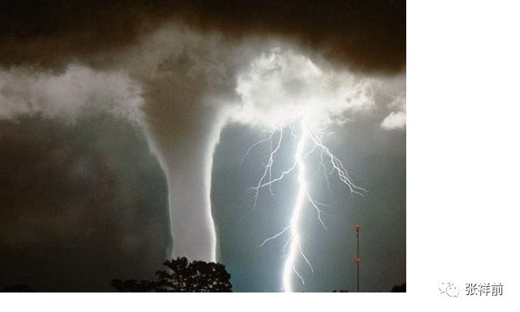

“汇聚恒星能接收器不光对空中照射，还可以向下对地面照射，对地面照射可以减少某个地方的恒星能量，也就是你们所说的太阳能，结合电子计算机分析，可以人为的调节果克星球的大气，好像把整个果克星球装上一个大空调，这样可以控制我们果克星球的天气，可以强力的避免有害天气的出现。

你们地球上狂风、台风、暴雨、闪电等灾害天气，其动力源头就是太阳光。

我们在吸收星球上空恒星光能量的时候，就用计算机分析，那一个地方应该要多吸收多少恒星光能量，那一个地方应该要少吸收多少恒星光能量，这样，我们可以有目的、有计划的让一个地方接受多少恒星光能量，这样就从源头上避免有害天气的出现。

我们果克星球从来就不会出现灾害天气，一切都在我们掌握中，而你们地球糟糕天气不断，你们每年因为这个死了不少人，是吧？”

“嗯，是的，要是我们地球人有这个汇聚太阳能，那多好啊！”

“啊，前哥，回去你造一个啊，你可以成为你们地球上大富翁的。”

后来，我们四个人在一个地方遇齐，我们正准备离开人工场发生中心，突然，我看到一个不可思议的现象，就是人工场发射中心有的房间门开的，和太空是连在一起，这样，人工场发生中心的空气要流到太空中，会迅速的耗光，为什么要这样设计啊？我忍不住的问。

苏代尔轻蔑的用手一指，“你自己去门边摸一摸。”

　我跑到门边，用手一推，一股无形的力量阻碍了我，奥，只是虚拟墙壁而已，因为这个虚拟墙壁没有锁住颜色，把我给迷惑了。

我们通过人工场的瞬移，又回到了微丽的家里，我仍然在想人工场发射中心，仍然有许多疑问，人工场发射中心的无线电力设备在哪儿？有了全球运动网和全球公众信息网，为什么还要全球无线电网？

微丽说，某一些领域仍然需要电力，实际是他们的电能和场能量是可以相互转化的。

我还想问其他问题，比如无线电力是怎么发射和接受的，怎么会不影响人和周围环境-----发现微丽、诺顿和苏代尔他们都这些问题不感兴趣，懒得回答，他们聊着别的话题，我只好打住了。

二十二，光线虚拟人

有一次和诺顿、苏代尔、微丽一起在路上，看到一些奇怪的果克人，这些人身体好像没有重量，走路飘飘然的样子，看身材和表情和一般的果克人没有什么区别，我突然看到这些人直接从房子的墙壁上飘然进去，好像墙壁对这些人毫无阻力的样子。

我马上想到可能是全球运动网帮助他们的，可是全球运动网使人运动的过程是极快的，运动过程人是看不到。我感到好奇，一种直觉是这些人和普通果克人是不一样的。

“啊，这些人好奇怪啊？怎么进到房子里去的？你们能够做到这样吗？”我觉得很奇怪。

“这些人是果克星球的光线虚拟人。”微丽不以为然，“在诺顿的住处，你已经看过的。”

“奥，建筑可以是虚拟的，人也可以虚拟啊？我看到的虚拟建筑时刻在微微抖动，这些人的身体为什么没有这种抖动现象啊？”

“建筑要求不高，普通建筑的外表人工场成像技术可以做的粗糙一些，而虚拟人的外表人工场成像技术要细腻得多，当细腻到一定程度，你就无法看到抖动。”

微丽给我解释，可是我仍然是不能理解。

“关于虚拟人，你有许多不了解的地方。”诺顿看到我一脸迷茫，给出了比较专业的解释：

“我们果克人发明了人工场扫描技术，扫描人的大脑来记录人的思想意识，记录后储存在计算机里，当时的想法是，等我们果克星球人的科技发展到一定的程度，可以制造自己的身体，可以把记录的思想意识信息安装到人工制造的人的身体上，这样人就可以通过换年轻人的身体，达到长生不老不老的目的。

这些记录在计算机里的人的思想意识信息，从一开始，就不是放在计算机里静止不动的，而是让这些人的意识数字在计算机和网络中运行着，这个是我们果克星人最早的虚拟人。

果克星球的虚拟人刚刚出现的时候，只是存在于果克星球的电脑和网络中，需要借助图像显示设备才能够看到这些虚拟人，而且这些虚拟人的外表形象是频繁的变化着，缺乏一个人的完整概念。

那时候，果克星人的思想意识数字在网络和电脑中运行着，我们还遇到一个很大的麻烦。

人的思想意识存在于人的大脑里，一般情况下是无法修改的，但是，一旦存在在电脑和网络中，就很容易被别人或者自己所修改。

| 我们在这个阶段，频繁的修改人的思想意识数字，产生了巨大的副作用。
| 后来，我们提出了“人的原始根代码”概念。在某些情况下，人的思想意识可以恢复到刚开始记录时候的信息。
| 我们真正能够制造生物、人的身体时候，仍然沿袭了这个习惯，“人的原始根代码”成了我们的一个重要概念。
| 你们地球上如果实现了保留思想意识、换身体的长生不老技术，
  “人的原始根代码”必然是我们地球人一个重要的、绕不开的概念。

刚开始的那时候，还不能算是真正意义上的光线虚拟人。

后来，随着三维虚拟成像技术和人工场扫描技术的发展，虚拟人才可以从网络和显示屏幕中走出来。

由光线影像组成的三维虚拟人走到大街上，后来虚拟人又扩展到现实世界任何一个角落里。

你看到的虚拟人，是人工场扫描技术远程锁住了当地的光线和颜色，加上三维立体成像投影技术而产生出来的。如果是夜晚，你看到的虚拟人，一般比较暗淡，因为夜晚锁住的光线量比较小，白天看到的虚拟人，比较明亮，因为白天光线充足。不过，有时候，晚上也可以人为的使锁住的光线加强，使虚拟人看起来格外的明亮，这种情况也比较常见。

当然，这个虚拟人走到那里，都有全球运动网、全球信息网、全球定位系统在跟踪提供服务，这个需要庞大的数字流量来支持着。虚拟人本质上就是大数字集合的产物，没有强大的对信息储存、计算能力的人工场扫描计算机，是不可能实现的，这些人工场扫描计算能力是你们地球人计算机的数亿亿倍。

虚拟人没有真实的身体，身体虽然只是由光线组成，但是这些虚拟人和真实的人一样拥有自我意识，这种自我意识本质是信息，以数字的方式储存在计算机里。

虚拟人之间可以相互交流，建立感情，也可以建立恋爱关系，发生性爱，也可以和普通肉体人交流，建立感情或者恋爱关系。

真实人所具有的思想、情感活动，虚拟人都具有。

但是，虚拟人对现实世界的感受和普通人有很多巨大的区别。

比如，虚拟人不需要喝水、吃饭、排泄，自然没有饿了、饱了、渴的感觉。虚拟人感觉不到自己的身体的重量，虚拟人的身体从来就没有病痛，因为他们本来就没有身体嘛。

但是，虚拟人存在着精神上的疾病和痛苦。虚拟人也存在幸福感和快感，虚拟人也分男女和中性人，具有异性恋和同性恋。

还有，虚拟人对物理世界中空间、时间、力、热----的感知和认识与我们普通人都有很大的区别。

虚拟人从一个地方运动到另一个地方，比我们更加的容易和随意。没有物体阻挡的概念。任何物体都阻挡不了他们，他们想进去就进去，想出来就出来。

虚拟人没有空间距离障碍，他们可以说生活在二维世界里。

虚拟人几乎没有白天、黑夜的概念，不需要通过睡觉来休息。虚拟人感觉不到高温和严寒。火山和冰山，无论怎么险恶的环境，他们都可以随意的出入。

虚拟人生活在二维空间中，是非实物的一组信息集合体。

果克星球的虚拟人也是逐渐发展起来的，一开始的虚拟人只是存在于网络和电脑中，大街上你是看不到虚拟人的。后来人工场的虚拟成像技术的发展，才可以把本来虚拟的不存在实物的虚拟人用虚拟成像技术在果克星球任意一个地方表现出来。”

“奥，我有些明白，就是人工场按照一定模式在大街上锁定一些光线，呈现一些人的外表图像来，实际上这些人是不存在这个地方的，仍然以数字的形式存在电脑里。”我说。

诺顿也给出解释，

“对的，但也不是这么简单，这个人工场成像技术是全球运动网搞的，参与这个过程的还有全球公众信息网络和全球定位系统，可以时刻捕捉这个地方的各种信息给虚拟人，所获得的信息和一个普通人处于这个地方所获得的信息量是没有区别的，甚至更加的详细。并且可以把与这个虚拟人有关的各种信息汇总给这个虚拟人。

现在你看到的虚拟人，可以搬运物体，其实是把要搬运物体的信号发送给全球运动网，借助全球运动网的搬运功能来实现的。

虚拟人和虚拟人之间、和真实的人之间可以发生性爱关系，这个是怎么实现的呢？

一种方法是利用截频技术，把性爱活动数字信号直接输送到肉体人的大脑中，利用这种技术把肉体人的感觉和、记忆其他意识信息和虚拟人意识链接、互动。

另一种方法是虚拟人可以通过道具，比如远程的操纵、控制一个假人、道具人来发生性爱关系。

或者把两个胶塑人体用信号数字激活，胶塑人体的一切活动信号利用人工场扫描和虚拟人联系在一起。”

“在我们果克星球上，百分之90都是虚拟人。”苏代尔的话让我有些吃惊。

“虚拟人是现实的失败者，现实世界呆厌烦了，不适应了，都躲在虚拟世界中”，微丽说，

“其实，我们果克星球每一个人都有真实的身体，又有存在于网络中虚拟身份，就看你的喜好了，你愿意以虚拟人身份出现，你就是虚拟人，你愿意以真实身体出现，你就是普通人。”

微丽的话更加的让我吃惊。

“在果克星球上，人人都具有虚拟人和真实身体的两种身份，甚至特殊的情况下一个人具有几个身体和几个虚拟人身份。你的身体不局限于人的身体，你可以是一个飞船，一个鱼，一个城堡------当然，这些鱼、城堡、飞船是可以高度智能化，可以接受人的意识信息的，可以和人交流，简单讲这些东西是是活的，不是死的。”

诺顿说，

“一般情况下，我们把那些长期的不愿意以真实肉体出现的人才叫虚拟人。”

后来，我们回到微丽的住处，我仍然缠着他们没完没了的问虚拟人的情况，因为我对这个是太好奇了。

微丽今天好像很有耐心，详细的给我讲解虚拟人的事情。最后，她打开虚拟电脑，一股烟雾我身边升起，烟雾上出现许多画面，微丽利用虚拟图像给我当起了老师。

“是不是每一个虚拟人都有一个备用的身体，一旦这个虚拟人想恢复真实身体，就拿出一个备用身体，把这个虚拟人的意识信息安装到这个身体上？”我问道。

“啊，对的。是这样的。”微丽回答。

“那这些备用身体都放在哪儿？”

“你看，”微丽指着虚拟屏幕，我看到了许多半透明罐子样的容器，装满了液体，里面都一个处于休眠的赤身裸体的人。我看到一些女性娇美的身躯，心里一激灵，脸上不自然的显露出来了，微丽似乎看出来了，脸上露出奇怪的神情。

“是不是一个虚拟人就需要一个备用身体？”

“不需要这么多的，每天要求恢复真实身体的虚拟人其实是很少的。”微丽回答。

“我既要以虚拟人出现，又要肉体人出现，这个可以吗？”

“这样会产生两个“我”存在，给你带来精神痛苦和思想混乱，没有人想找这个麻烦。”微丽回答我。

后来，他们被我没完没了的问厌烦了，都不愿意回答我的问题了。微丽说给我一个程序，让我自己去体验虚拟人的感受。

微丽在虚拟电脑上操作一翻，微丽叫我躺在床上。

马上，我感觉自己到了一个奇异的世界，周围的景物好像的都是人画的，我飘然的走在路上，有一个画外音问：“你要去哪儿，你需要伴侣吗？请你选择。”

我看到路边5个美女，个个兴奋向我招手，都非常漂亮，要是地球上，这些美女我都不敢直视，一个是太漂亮，一个是我有自卑感，因为我长期处于社会的下层，不自觉的默认了一个事实，美女都是瞧不起我们这些乡下贫穷少年的。

现在居然可以给我选择，我很开心，选中其中一个，哎，怎么仔细的看起来像微丽啊？我是偏好这种类型的美女？我想换一个，其余4个已经失望而消失了。

后我又选择了几个宠物，这些宠物时刻漂浮在我的头上、身边，随我一同旅游。

不断的有画外音提示我做出选择，可是我没有经验，有时候的选择在错误的，又绕回到原地，重新再来，有时候的选择是胡乱的。

好在我们总算是上路了。果然体现了许多不可意思的感觉，可以一下地跃到山上，可以慢慢的穿墙而过，可以漂浮在空中，可以快速的翱翔在空中，可以感觉自己的身体如同柔软的丝绸那样飘荡。也可以想到什么地方就到什么地方。

后来，又想到什么美景也不如美女啊，到处去找美女，猛然想到一直跟随自己的美女，于是慢慢的靠近，搂着她，果然有快感，我们拥抱的时候。突然，我好像从睡眠中惊醒，看到微丽站在我面前。

微丽微笑的在看我，我翘头看来一下，苏代尔和诺顿已经不在了。

 

 

二十三，果克星人的时空冰箱

有一次，我在微丽家吃东西，剩下了一些食物，我说：“在我们地球上可以放冰箱里储存，我在电影里看到城市里人家都有冰箱。喂，微丽，我好像没有看到你们果克星球有冰箱哎。奥，我明白了，你们科技发达，有瞬移设备，无需冷藏食品，不需要冰箱的，是吧？”

微丽说；“我们也有冰箱的，一般都很巨大，很少放置食品，我们的冰箱用处和你们地球上不太一样。“

“奥，我有些明白，由于你们的瞬移技术太发达、太方便，你们搞一个巨型冰箱，像一个公共仓库一样，大家都把东西存放在那儿，需要东西的时候，通过全球运动网的瞬移技术，很方便的拿到，和放在家里同样的方便。这样可以省电，节省空间，是吧？”

“嗯，不完全是这样的。”微丽说，“我们果克星球人身体所需要的营养一般都是通过瞬移技术在计算机程序控制下，直接进入我们身体里，平时不需要食物，也就不需要冰箱的，我们的冰箱主要是用在工业生产和科学研究中。”

微丽说着，用手在空中划了一下，全球运动网和全球信息网的远程输送信息技术，在微丽的身边立即制造了一个三维立体虚拟图像。

微丽打开了全球信息网，信息网上出现了许多果克星球的巨型冰箱，外表看如同房屋、大楼，上面都标有果克星球的文字。

微粒丽继续的给我讲解：

“我们的冰箱不像你们地球上那样使用低温冷冻，我们是使时间凝固的方法。我们的做法是用人工场对时空冰箱内部空间照射，使这一处空间中的时间不一样，时间好像被凝固了，食品被放在这里过了一分钟，外面时间可能过了几年了、甚至好几千年了、好几万年。我们这种冰箱可以叫时空冰箱。

比如，在我们的时空冰箱里，放一个你们地球上的雪糕，关上这个时空冰箱的门，冰箱里面的温度虽然和外面是一样的，但是，我们在外面过了一年，时空冰箱里面过的时间千分之一秒钟都不到，所以，我们把雪糕放进时空冰箱去，一年过后再去取出来，雪糕仍然和刚刚放进去的时候几乎没有区别。”

“啊！啊！你们的时空冰箱很神奇，出乎我的意料，没有想到会是这样的，假如我人进去了，呆一会儿，出来，外面可能过了几千年，甚至上万年了，是吧？”

“是的，你们地球上的冰箱，你前哥钻进去，可能会冻死，我们的时空冰箱假如放到你们地球上，你前哥钻进去呆一会儿，虽然不会被冻死，等你一出来，哇，你的父母、邻居统统不在了，都过了好几千年了，你前哥马上就变成文物了，古董了，许多人都围着你看，你就像博物馆、动物园里的大明星了。”微丽脸上露出古怪的笑。

“那反过来行不行啊？我呆在时空冰箱里过了一年，外面只有几个小时候。”

“这个完全可以的，我们的时空冰箱有调节档位大小的，有时空转换开关。调节档位的有什么作用呢？就是把档位打在低档，你到时空冰箱里呆一分钟，外面可能一年，打到高档，你在时空冰箱里呆一分钟，外面可能过了几千年了。

如果你在按一下时空转换开关，选择了时空转换开关上的“负”，就颠倒过来了，时空冰箱就变成了里面的时间流的快，外面的时间流的慢。”

“那，时空冰箱能不能使时间倒流？”我好奇的问，“我想回到古代行不行啊？”

“这个是不行的！”微丽很肯定的说：

“时间流逝的快慢，是通过两个不同地方的比较，我们说一个地方的时间比另一个地方的时间流逝的快，是通过比较的出来的，一个地方怎么比较？你说自己比自己身子高怎么说的通？你说你的身子比我的身子高，这个可以说得通。时间是不可能倒流的，时空冰箱也不可能使时间倒流的。”

微粒丽的话我似乎有些明白。

“那时间到底是什么东西？”

“时间只是我们人对周围空间以光速运动给我们的一种感受，没有人，就没有时间。关于时间是什么的问题，我只是知道这么多了，你想详细的了解，要问苏代尔他们。”微丽的回答我是似懂非懂。

微丽建议我们去参观一处果克生物研究所的一些巨型时空冰箱，我同意后，微丽又在全球信息网上联系了这个生物研究所的一个负责人，告诉他有地球人来他们研究所参观。

“诺顿是我们果克星球大名鼎鼎的生物学家，我们邀请他一起去，好吗？”微丽征求我的意见。

“好的！”我欣然同意。

微丽请求全球运动网，我们刹那间瞬移到了一个巨大房屋前面，看到诺顿站在门前等候我们。

我们三个人走这个生物研究所，里面的人对诺顿非常尊重的样子，微丽贴在我的耳边小声的说他们受诺顿的领导。

里面一个负责人迎接我们，这个人看起来是一个男性，个头大概一米高，长得和诺顿差不多，唯一特殊的是头发有许多看似柔软的黑色细管子构成，很长，披在后面肩上。

微丽说他的名字叫“文太”【发音】，他的的头发和女性性爱的时候，会有许多特殊用处，给女性带来快乐刺激，至于怎么给女性带来快乐，微丽不肯说，我只好在心里想象了。

文太带着我们参观他们的生物研究所，文太不停的说，努力给我介绍，信息网客服可温有时候一句话翻译没有完就翻译下一句，可能是文太说得太快了，实际上我对生物研究所里面稀奇古怪的设备只是随便看看，并不想彻底去了解。

后来我看到了一排整齐的许多类似玻璃的容器里，里面充满着微微有些黄色的透明液体，液体里泡着各种各样赤身裸体的人体，这些人体大小不一，有的很巨大，有4、5米高的样子，有的很小，只有几十厘米高。

我也看到有的人很像地球人，看到一个类似地球人的女性身体，非常丰满巨大，巨硕的乳房，水桶粗的大腿，2米高的样子，很性感，很撩人，背后肛门有管子连在外面。这些人体在里面都是似睡非睡的不清醒的样子，都有管子连通道身体里。

看我的表情出现怪异，微丽用手掌在我身上击了一下，嘴里冒出一句：“靠嗯！”什么意思？信息网客服可温没有给我翻译，我想大概是果克星球人骂人的话吧。

文太给我介绍说，“这些人体都是果克人的备用身体，比如，有些果克人要到地球上执行任务，为了掩人耳目，有时候会选择一个和地球人差不多的身体，这些容器里的人体都没有自主意识。我们通过场扫描技术，把一个果克人的意识扫描下来，安装在这个容器里类似的地球人身体上，再把这个果克人的身体放到容器里储存起来。

这样，一个果克人可以带着你们地球人身体到你们地球上执行考察任务了。考察任务结束回来后，再把类似地球人身体放入容器里，在把意识信息安装到容器里的果克人头脑中，这个果克人又以正常身体、正常思想意识回到果克星球上生活。”

“那这些人身后都通一个管子干什么？”我对这个很好奇的。

“这个是为了给这些人体提供营养，并且把某些排泄物带走。主要是一种循环装置，其实，这种提供营养、带走排泄物大部分工作是全球运动网完成的。

这些容器是巨大的时空冰箱，我们在外面过一年，里面呆着的人体可能只有过几秒钟就时间。”诺顿说。

“为什么不是我们过一千年，里面只有过几秒钟时间？这样里面的人可能就不需要营养物质了？”我继续问道。

“这是因为，时空冰箱里面和外面维持的时间差越大，需要的能量也就越多，而且设备也要更巨大，系统更加的不稳定。”诺顿给我解释。

后来我们又看到更加巨大的时空冰箱，不是透明的，边上有三维的虚拟屏幕，我们通过虚拟屏幕看到里面的景象。

我只是看到画面好像是人的生活场景，只是飞快的在变化，看不到个所以然。

文太说，“这个时空冰箱，里面的时间比我们过得快，现在你看到的画面，都是经过处理的，实际上这里面的人的生活过得更快，他们生活在超高能量场中，他们在里面生活一万年，我们可能只有几个小时。”

“这样做的目的是什么？”我好奇的问。

“主要是观察生物自然进化过程，比如一些病毒经过一万年的演化，会是什么样子。一些人经过一万年的进化，身体结构可能更加的合理，为我们制造人体提供参考，我们经常到你们地球上，也是考察你们地球上人体的结构信息的。我们的人体都是自己制造的，这个你可能知道吧。”诺顿回答道，

“对于某些病毒、细菌，以及其他的一些生物，放在这种时空冰箱里，观察他们的生活、进化过程，对我们果克星球的生物研究有着巨大作用。”

“这里面的储存人体容器很少的，数量不多，在我们果克星球的人体复制工厂，有许多储存人体的容器，比这里要多好多万倍的。”文太说。

“这里主要是实验用的，前哥，以后带你去果克人体复制工厂参观，那里的规模特别巨大，会让你大开眼界的。”微丽挽着我的手。很神气的说，“我们回去吧？这里真的没有什么好看的，药水瓶泡着几个人体而已。”

 

二十四，参观果克星球人体复制工厂

有一天早上起来，微丽说，“前哥，上次，我说带你去参观我们果克星球上的人体复制工厂，诺顿通过全球信息网发信息给我，说有事情要到果克星球的人体复制工厂去，希望带你一起去，我们一起去参观人体复制工厂，好吗？”

“好的，我同意。”

微丽立即用手按住耳部，通过大脑和全球信息网的链接，发消息给诺顿他们，很快，诺顿和苏代尔通过全球运动网立即出现在微丽家的虚拟沙发上。

“我们马上要去果克星球的人体复制工厂，你前哥和我们一起去，可以吗？”诺顿问我。

“可以的，现在就去吗？”我问。

“要等一会儿，人体复制工厂的一个负责人叫‘加朋【读音】’，他还没有到，等他到了人体复制工厂，发信息给我们，我们再去。”诺顿回答。

“人体复制工厂是造什么的？是不是复制人体模特，用什么材料复制人体？用塑料复制吗？”我好奇的问。

“嚯嚯！你头脑是怎么想的？”苏代尔大笑，“果克星球人体复制工厂是我们全球最大的、最重要的工厂，是专门复制活人身体的。”

“你们地球人想长生不老，就想着吃什么长生不老的药，可是宇宙中根本就没有这种药。我们果克人身体老了，不行了，就换一个年轻人的身体，保留人的思想意识。这样，我们果克人就可以长生不老，永远年轻！”微丽有些得意的说。

“那，你们换一个身体后，这个人还是你吗？”我觉得微丽的话不靠谱。

“那肯定是的！”诺顿说，“人与人之间的区别主要是思想意识，身体是次要的。

我们果克星球的人把人看成是两部分组成，一部分是人的思想意识，一部分是人的身体。人的思想意识的就是人大脑中带电粒子的运动形式，本质上属于信息。

| 人的身体如同你们地球上的电脑的硬件，像显示器、主机、键盘、鼠标、录音机的磁带------，思想意识像电脑的软件、程序，如同磁带里面录制的内容。
|   
  当人身体老了，或者生了严重的疾病，我们用人工场扫描扫描一个人的大脑，把人的思想意识拷贝下来，用数字来表示人的思想意识信息，然后储存在电子计算机内，在用人工制造一个没有自主意识的人出来，再把这个储存在计算机里的人的思想意识数字安装到这个人工造出的人身上。

最后，把这个老人原来的身体无害化处理，这样人的老年身体变成了年轻人的身体，而意识被完整保留下来。

当这个人工造出的人身体老了，再重来一次。反复的这么干，我们的人就可以永远长生不老了。我们果克星球的人体复制工厂就是干这个事情的。”

“前哥，你听明白了吗？”微丽问。

“奥，我明白了，这个道理就如同我们地球人修自行车内胎，内胎在一般情况下是修修补补，严重了我们就不补了，换一条新的。你们就是人老了，或者生了严重的疾病，干脆不治了，换一个新的身体，不过，原来思想意识还保留下来，是这样吗？”

“啊，是这样的。”微丽回答。

这个时候，诺顿用手按住耳朵，可能接受到了全球信息网的信息，对我们说，“加朋到了人体复制工厂，我们走吧。”

通过全球运动网，微丽、苏代尔、诺顿和我刹那间到了果克人体复制工厂。

人体复制工厂非常高大、巨大，一眼望不到边，大门上面有一排巨大的虚拟文字。

“啊！好气派啊。”我非常感叹。

“人体复制工厂许多大门，这个只是其中之一。”苏代尔不以为然。

大门只是一个过道，到了里面，仍然有许多巨大房屋，也有虚拟房屋。我们坐上了一个敞篷车，这个车子在地面2米高左右，可以无声无息的漂移。

人体复制工厂非常的漂亮，各种稀奇古怪的植物，姹紫嫣红的花朵。很多三维立体虚拟镜像，每个房屋前都有虚拟的果克文字。

在一个房子前，诺顿下了车，会见加朋去了，我们继续参观。

我们转了很多地方，“啊，人体复制工厂实在是太大了！”我发出感慨。

“你看到的，百分之一都不到。”苏代尔不以为然。

“人体复制工厂还有地下部分。”微丽说。

我们这外面转了很长时间，走到一个特别巨大房子里面，里面有来回走动的人，但是人不多。苏代尔说诺顿就在里面，我们下了飘浮车，走进去，果然看到了诺顿和加朋。

加朋个子也是一米高左右，体格看上去很健壮。加朋很友好，拉着我的手不放，“欢迎来自地球的前哥！额，前哥个头很大啊，看上去很有力量啊，我来看看你身体有多重。”

加朋从我身后抱起我，“额，是的，身体很重的。”

加朋看看我，又看着微丽说，“前哥个头那么的大，你们性爱的时候，侵入你的身体，你是怎么承受的？你们抱在一起的时候到底哪一个厉害，身体更强壮？哪一个更耐久？”加朋怕我不明白他的话的意思，左手握个圆圈状，用右手指猛的反复戳进拉出，加朋用这个粗俗的动作来表示我和微丽的性爱活动。

“没有的事情，你在乱说。”可能是加朋这种粗俗描述性爱动作让微丽有些生气，微丽握在一起的双手猛分开，划个V字形，挥向空中。

“没有的事情？不会吧？”加朋后退几步，用奇怪样子看着诺顿、微丽、苏代尔和我，

“那么远的从地球把前哥搞来，就是为了研究地球人和我们果克人的性爱活动，通过观测来获得一些我们有用的数字。诺顿，不是这样吗？”

诺顿没有回答，微丽把脸转过去，开始走动。诺顿、苏代尔和我也随着微丽一起走动。

加朋在暗示我，诺顿又想拿我做什么特殊实验？我心想，不要把我当作小白鼠啊。

加朋见我们都不理他，只好从后面跟上来，“我来给前哥介绍我们人体复制工厂。”

加朋很卖力的向我介绍我们看到人体复制工厂里各种设备和功能。他的肢体语言很丰富，一边说，一边比划着各种动作和手势。我没有什么心思听，一心盼望还能再次见到上次参观的果克生物研究所里面黄色液体泡着的巨大丰满的，赤裸的、诱人的女人身体。

终于在人体复制工厂的地下部分，我们见到了泡在淡黄色液体里人的裸体身体，身体上都有一个管子连接在外部。一排排容器里，每一个都泡着一个人体。虽然数量很多，但是，每一个人体身高、体型都差不多，都在一米左右，不像果克生物研究所那样有千奇百怪的人的身体。

“这些都是我们果克星球上的备用人体，一旦有人需要更换身体，我们就从这个里面调出一个人体来。”加朋对我说，

“你看到他们都有一个管子连在外面，这个是为了给备用人体提供营养和带走排泄物的。”

“为什么不像你们一样，用全球运动网的瞬移技术把营养提供给这些备用人体呢？”

“大部分的营养和排泄物是全球运动网的瞬移技术完成的，这些管子是提供循环系统的一部分，我们要设计一种循环系统，来维持生命的运转。不能完全的依赖全球运动网提供营养和带走排泄物。

因为这样可能唤醒这些备用人体的自主意识，这些备用人体如同植物那样，思想意识如同一张白纸，你明白吗？”

加朋给我解释。

“为什么备用人体的体型都是差不到，为什么不搞一些体型特别高大或者特别小的备用人体？这样可能会让一些人更加喜欢的。”我的问题仍然很多。

“一个是为了制造备用人体的方便，就像你们地球上，造一个产品，都是同样尺寸的，制造方便而且质量可靠一些，制造不同尺寸的产品，要麻烦一些。当然，这个也有我们果克星人的传统习惯。

你看到的这种体型，是经过我们长期反复研究、实践得出的结果，是最佳体型，适合我们果克星球的重力环境和其他物理、化学环境。

在人的生活中，运动、性爱、抵抗疾病等等方面，这种体型都是最佳的。

还有很重要的原因，是防止人体体型差异过大，体型大的人可能伤害体型小的人。我们果克星球没有德道和法律约束人，性爱有时候是很暴力、粗野，我们不用法律和德道约束人，从制造源头控制人体型差异过大，是一个正确的选择。

这个是在我们果克星系的主星上，制造人的身体，身体的规格控制得很严格，在主星附近的其他星球上，人的身体的差异很大的，各种怪异的身体都有。

像你前哥这么大的体型，侵入微丽这么小的身体里，那是我们果克星系的主星上绝对不允许的！”

加朋丝毫不在乎微丽是否生气，用手指向微丽的下身来示范。

微丽敏捷的跳开，跑到我的身边，居然抱着我的手臂，表现出妩媚的样子。为了转移加朋的关于微丽和我性的话题，我问微丽，

“你们果克星球这样的备用人体有多少？”

“有几百万吧？”微丽回答。

“人体复制工厂，你们果克星球有多少、”

“就一个，”加朋说，“人体复制是我们果克星球上最重要的事情，不是随便玩的。”

“在我们地球上，人到了18岁，是人一生中最黄金时段，你们果克人要培养一个备用人体，需要18年？”

“我们有时空冰箱的，可以加快时间，不需要这么长时间的。”诺顿回答。

“时空冰箱，前哥你知道什么意思吗？”加朋想给我解释。

“在上次我参观果克生物研究所，我已经有所了解。”

我们继续的走动参观，突然我又想到了一个问题，“你们一个果克老人，到了你们人体复制工厂，换了一个年轻人的身体，这个老人的身体如果不处理，是不是会出现两个‘我’，如果处理的话是怎么处理的？”

“不处理肯定有两个‘我’的，都是无害化处理。”加朋回答很简单。

我仍然不明白，“什么叫无害化处理？”

“就是先把你杀掉，然后再把你烧掉！嚯嚯嚯，”苏代尔上身抖动着大笑。

“苏代尔，你头脑中要储存一些温心的词句，你吓人的词句太多了。”微丽谴责苏代尔的话。

“你们能不能把我这个地球人也复制一个人体？”

“你是地球人，我们没有这个程序，要开发这个程序，需要很长时间的，另外，我们果克星球的法规虽然不约束个人，但是，对组织和人工智能、各种算法有很强的约束，不允许人体复制工厂随便复制外星球人体的。我们这是工厂，不是研究机构，如果是研究机构，在某些可以约束、控制的情况下，是允许的。”

加朋明确的回答我。

“你们不能把我前哥复制一个，我有理由怀疑，宇宙中不可能有2个我存在，你们复制的人体，不能够算是原来的人。人到了你们人体复制工厂，实际上是被你们杀掉了，烧掉了，然后，随便搞一个人出来，就说：复制人体成功啦！”

“你的话令我愤怒！”加朋冲上来，做出要攻击我的架势，刚要碰到我身体的时候突然又猛的停下来，说：“我有一个程序，你可以体验一下两个我是什么感受”。

加朋带我们走入一个不大的房间里，加朋打开了全球信息网的虚拟屏幕，进入全球信息网，加朋操作了一番，一个头盔样的东西突然出现在桌子上，加朋叫我戴在头上。

我果然体现了一个不可思议的场景，我一会儿出现在房子里，和加朋、诺顿、微丽、苏代尔站在一起交谈，一会儿又出现在房子外面，看着另一个我和加朋、诺顿、微丽、苏代尔站在一起交谈。

我卸下了头盔说，“啊！很神奇啊，的确感受到了两个我的存在，我现在相信了你们人体复制工厂是真实可靠的。我还有一个问题，你们果克人是怎么选择备用人体的？”

“我们人体复制工厂，所有的备用人体一种来自于天然繁殖，大部分是纯人工制造。一旦培养成熟，都会及时的在全球信息网上公布，果克人一般都是通过全球信息网搜索，来发现自己喜欢的人体。也有在允许的范围内订制自己想象设计的、喜欢的人体，有时候还邀请好友为自己的选择做出参考。”加朋回答。

“哈哈，像我们地球人买衣服啊。我现在是个男人，我想选择一个女性备用人体可以吗？”

“身体和意识严重不匹配，会给人带来巨大痛苦，一般情况下是不允许的。人体复制工厂是不满足人的这种想法。”诺顿回答道。

“虽然你们果克人体复制技术非常高超，但是，我发现一个很严重问题，你们果克人一旦遇到意外，比如失足掉到山下摔死，你们来不及复制人体，不就玩完了？”

“这个？”诺顿回答，“我们死的概念和我们是不一样的，比如一个果克宇航员到你们地球上去考察，出发之前，意识和记忆被储存在电脑中，如果这个果克人在地球考察不幸遇难，我们会迅速的把宇航员的意识安装到备用人体上，造出这个宇航员来。

这个宇航员和别人谈话时候，会遗憾的说，我到地球旅行的那一段记忆死了。我们果克人的意识都有备份的，死的只是一段记忆和意识的丢失而已，而不是全部。

如果是在我们果克星球上，全球运动网和全球信息网会时刻跟踪每一个人，不停顿的记录每一个人的思想意识，可以保证每一个人的思想意识信息一点儿时间都不会丢失。”

“你们果克星球上，复制人体，可以修改人的思想意识吗？”

“我们有许多庞大的生物研究所，果克星人置换人体，一代比一代强壮，人体的结构一代比一代更优美、更合理、更趋于完善。我们经常参观别的星球的上人体结构，目的也就是做出更好的备用人体为我们果克人服务。”诺顿回答：

“但是，在人体复制工厂里，是不对人的意识改动，尊重人的思想和本来意识。

除非在某些生物研究所里，有特殊合理的需要，在可以控制、监督的情况下，才可以部分的改动某些特殊人的意识，比如有精神痛苦倾向的人。

我们早期刚发明人工场扫描，能够扫描拷贝人大脑意识，储存在计算机里，那时候，由于储存在计算机里的思想意识很容易修改，我们频繁的修改，带来的巨大的副作用，后来，我们提出了‘人的原始根代码’概念。在某些情况下，人的思想意识、记忆数字可以恢复到刚开始记录时候的信息。”

  “如果我定制了一个人体，在换之前，是不是要通知亲戚朋友，否则他们可能会认不出我来，有没有这种可能？”我问道。

“当然，有这种可能，不过，你只要通知你的朋友，我们果克星人没有亲戚，没有父母和兄弟姐妹，我们身体老了，就换一个年轻人身体，就这么一直换下去，我们的身体是我们自己制造的，哪里来的亲戚？”加朋的话提醒了我。

“你们果克星球复制人体需要给钱吗？需要费用吗？”

“这个是不需要钱的。你们地球人什么都钱钱钱的。”苏代尔带着一些嘲笑，

“这个要钱的话，如果有人拿不出这个钱，会是怎么去想，这样可能会引起社会剧烈动荡的。”诺顿回答道，“至少在我们果克星球上，人体复制是不需要钱的。”

参观结束了，我发出感慨，“我们地球上，长生不老是地球人长期的梦想，人体复制也不知道要等上几百年还是几千年?”

“一个是信心问题，如果你们地球上的人有这个信心，而且要明白人的核心是思想意识，而思想意识只是人头脑中带电粒子的运动形式，属于信息。再加上你们地球人掌握了人工场扫描技术，只要几十年就可以做到。”加朋回答道，

“不过，最关键是你们地球人要知道场的本质是什么，只有掌握了场的本质，才可以用场这种无形物质去深入人大脑内部记录人的意识信息，除了场，别的物质深入到人的脑部，会破坏人的脑部组织，比如，你们地球人掌握的光子、电磁波、超声波、X光深入人脑内部，都会破坏人的大脑，结果把人搞死，人都死了，还记录什么？

除了记录人脑部意识信息需要人工场，把人的意识安装到一个备用人体头脑中，也需要人工场扫描呢，别的代替不了。

你们地球上要首先破译场的本质，然后开发出一种人工场扫描技术，人工场在计算机程序的操控下，可以叫人工信息场，深入人脑的内部扫描记录人的意识。把意识安装到备用人体头脑中，使用的都是人工信息场。

在这个过程中，设计人工场扫描控制软件的，肯定要许多天才数学家参与。”

“认识问题的方向也很重要，”诺顿说，

“人的核心是思想意识，思想意识是人脑部带电粒子的运动形式，对周围空间产生扰动，使空间具有波动性，这个是空间本身的波动，波动的速度就是光速，记录空间中波动形式和记录人大脑中带电粒子运动形式，同样重要。

身体只是思想意识的一个载体，是次要的。你们地球上认为人身体是最重要的，意识是次要的，所以老是在身体上做文章，想发明什么药物来使身体永远年轻，想冷冻来保存人的身体，从而达到长生不老的目的，这个是不可能成功的。你们地球人如果方向错了，不会成功的。”

苏代尔毫不客气的这样评价我们地球人。

“前哥，你们地球人花钱最多的是买毒品和烟酒，第二多的是买军火来杀人。你们地球人认为一心搞科学研究的人是傻子和疯子。我分析，你们地球人以后的科学不是在发展，而是在倒退，因为你们以前的科学家都死了，现在没有科学家，你们把四肢发达没有脑子的技术人员当作科学家。

你们除了打仗斗争，就是去压迫、欺负、欺骗同类，多年后，你们就会退到原始社会，你们和一群猴子没有区别。人体复制的技术，与你们地球人是没有关系的，你们不是做到做不到的问题，而是永远都不会想到有人体复制这个事情。

总之，我不看好前哥回到地球能够又多大作用，前哥回去这么一说，大家肯定认为他是神经病。地球人还有一个特点，一部分人在做事情，总有另一部分人在破坏。”

诺顿说，

“我也不看好前哥回去能够在长生不老方面发挥作用，长生不老这个技术是不容易的，主要是地球人习惯思维很强大，思想保守，自己束缚自己，如果你前哥回去宣传，你们地球人相信的你的话，放手去做，只要掌握了人工场扫描这个工具，几十年后就可以成功的。

因为只要完成了人工场扫描记录人的思想意识这一步，人的长生不老就成为现实。人的思想意识储存在人大脑里，身体的死亡、腐烂，导致思想意识丢失，储存在电脑里，就不存在这种情况，剩下来的就是等待，可以慢慢的等待。”

 

二十五，果克星球的新型人种---金属人

参观了果克星球的人体复制工厂，我们又参观了果克星球的一个新型人类研究中心。

果克星人由于可以自己制造自己的身体，他们的科学家不断的在尝试许多新型的、稀奇古怪的人种。

在这个中心，好像是在一个巨大的房屋里，天上好像被什么东西覆盖着。

其中一个黑的发亮的金属人，皮肤的温度更低，身体弹性也很大，身体很重，和其发生性爱的时候，给人的确有不同的感觉。但是，对我的体力的消耗太大。

后来，他们打开三维虚拟图像，要我挑选一个人种。我看到一个身材像我们地球人，身体的肌肤像果冻的女人，非常的文静漂亮，我估计不会搞出什么幺蛾子来，就挑选
了她。

真正的见到她，和画面有一些不一样，身体半透明的，像一种白玉，又像一种蜗牛的身体，身体的内部隐约是黑色的。

她赤身站在一个洁白精致的床上，在他们的命令下，我上去了，她上前搂着我，感觉她身体很柔软，冰凉凉的，使我浑身起鸡皮疙瘩。她像蚂蟥那样望我身上爬，当她的阴部到了我的嘴巴的时候，阴部突然炸开，露出令人恐怖的黑色，而且里面像许多小的蛇头在乱扰。

她的身体没有骨头，把我的头部包裹着，并且，一点一点的把我整个人在吞食。

后来，她还向我的嘴里注入像黄油的东西，感觉很滑，到了胃里，很快就到了肠里，然后就感觉肛门控制不住，要拉出来的感觉。

我想这么干净的地方，不能搞脏了，我强烈的控制自己，仍然感觉控制不住，后来，我只好躺下，希望能够控制住，不把这些脏东西拉出来。

但是，仍然是控制不住，拉了很多出来。我的头被她身体蒙住，看不清楚。

最后，我和她的身体分开的刹那间，我看到果然把床上搞得不成样子，只是看了很短暂的时间，通过全球运动网我就回到微丽住的地方。

回来的时候，我感觉很丢脸，那时候，脑子竟然想起来要发明尿不湿。

二十六，果克星球的金钱

有一次我和微丽、诺顿、苏代尔到一个所谓的娱乐场所玩，我们进去后，我看到微丽对着一个墙壁看一下，墙壁立即显示出果克文字，微丽离开后，文字迅速就消失。

“你在看什么？”我好奇的问微丽。

“我在通过全球信息网查看自己的财富值。”

“财富值？什么意思？”

“就是你们地球上所说的钱，如同你们地球人在查看自己在银行还有多少钱。”微丽回答。

“啊啊！我有点惊讶，你们果克星球这么的发达，为什么也要金钱？你们要什么有什么，还需要金钱干什么？”我觉得不可理解。

诺顿说，

“我们果克星球虽然比你们地球科技发达，你们地球上需要的东西，对我们不重要，或者我们获取过程太容易，几乎可以免费获得。但是，我们果克人也有其他的需求，比如要求别人为自己服务，需要获取一些特殊的信息。有需求就有交易，有交易就有金钱，所以离不开金钱。”

“金钱也可以使社会的分工有序化，宇宙中比我们还发达的星球，仍然在使用金钱。”苏代尔插话。

“不过，我们果克星球上的金钱是虚拟的，看不见实物，不像你们地球上可以是钞票。我们的金钱只是全球信息网上一个数字而已。我们挣钱，花钱、消费，全球信息网会自动跟踪记录。

你挣钱时候全球信息网代你记账，花钱时候的时候也在为你记账，你出门不带钱，大家也看不见钱，钱只是全球信息网上的一个数字而已。

我们也可以通过自己大脑和全球信息网的链接来查询自己的财富值，有时候嫌烦，我们又用外部电脑来查询。”微丽说。

“我还是不太明白，比如我在地球上为老板干活，比如，为老板挖一个坑·····”

“活活活，”苏代尔大笑，“前哥为什么就喜欢挖坑？”

“不是我喜欢挖坑的，我是经常挖泥巴，我在地球上经常挖黄鳝，一天要挖很多泥巴的。比如，我为地球上一个老板挖一个坑，老板给我钞票。而在你们果克星球上，为你们果克星球的老板挖一个坑，你们果克星球上的老板给钱给我，你们没有实物钞票？怎么给我？”

“很容易啊！”微丽说，“打开全球信息网，老板给你多少钱，你就看到了你的财富值增加了多少了，或者老板通过自己头脑和全球信息网的链接来发信息，如果你像我们果克星球人大脑可以和全球信息网链接，立即就可以知道你财富值增加了多少。

只是你前哥是地球人，虽然你的大脑现在也可以和我们的全球信息网链接，但是，你不会使用，你在我们的全球信息网上没有身份，给你的财富值，你不能正常的接受，按照果克人的方式比在地球的确要麻烦一些。”

“那你们果克星人是怎样挣钱啊？”

“在我们果克星球上，任何一个人定期可以获得相同的、一定数量的财富值。正常的生活不会有问题。”诺顿说，

“但是，想额外的多挣钱，是很不容易的。挣的钱几乎都是通过全球运动网和全球信息网进行的，所以，挣钱要围绕着两大网络。

在我们果克星球上有许多通过全球信息网产生的组织，我们叫网络协议部落，在你们地球上可以叫论坛场所。

微丽、苏代尔和我都是一个叫‘研究地球人’部落里面的成员，我们都对地球人感兴趣，长期对地球人进行考察、研究，所以对你们地球人的事情都有一定的话语权。

对你们地球人的研究，也可以使我们获得财富值。

我们打算建造一个实物房子，作为‘地球人研究所’用，这个房子造成功了，微丽、苏代尔和我也可以获得一定的财富值。

现在我们就开始造房子，前哥你可以看看我们是怎么通过造房子来挣钱的。我们现在回到微丽的住所开始工作。”

通过全球运动网，我和诺顿、苏代尔、微丽回到了微丽的住所。他们三个人都打开虚拟电脑，都在虚拟电脑上操作。

“你们造房子不到现场，怎么就在电脑上就可以搞定？”我问。

“奥，是的，”微丽左手一翻，很优雅的样子，使手心朝上，“只要在全球信息网上操作，就可以把房子造好。房子造好后，我们再一起去看看。”

“首先要进入‘果克生物研究协议部落’，”诺顿说，“提供报告给‘果克生物研究协议部落’，论述研究地球人的重要意义，这个报告我以前提供了，现在已经批准了，你们看，我们建成了这个‘地球人研究所’可以获得这些财富值的。”

“我现在已经进入‘果克房屋制造协议部落’，我们给他们一定的财富值，他们帮助我们造房子，他们现在要我们提供房屋结构图。”苏代尔说，“不过要设计一个房屋结构图需要很长时间的。”

   “可以在全球信息网上搜现成的，免费的房屋结构图。”微丽说，“我来搜索。”

一会儿，微丽说搞好了。

“‘果克房屋制造协议部落’要多长时间可以把这个房子造好？”我问。

“一刹那，按照你们地球上的时间算，几秒都不要就可以造好。”诺顿说，“我们果克星球造房子，工业制造产品，都是一刹那，造的时候不需要多少时间，只是设计需要一定的时间。”

“为什么这么快？”

“‘果克房屋制造协议部落’都是通过全球运动网来造房子，全球运动网可以远程的高速切割加工物体，可以高速搬运物体，可以高速冷焊接，高速组装，这些都是在电子计算机程序控制下自动工作，速度是极快的。”诺顿回答，

“就是‘果克房屋制造协议部落’的人，也没有一个人到造房子的现场去的，他们也是在全球信息网上远程操作的。”

微丽的虚拟电脑上中心出现一个方格子，迅速向两边扩展，微丽合在一起的双手，随着方格子一同扩展，嘴里念着，“房子造成功了！”

通过全球运动网，我们几个人迅速的又赶到了这个刚才造的房子前。

房子很高大漂亮，果然是实体房屋，不是虚拟的。

诺顿抚摸着光滑的墙壁，说，“这个是全球运动网从山上的岩石上切割而来的，还保留了岩石的纹路，我喜欢这种纹路，非常的漂亮的。”

“这个房子造好了，你们通过造这个房子，就可以赚很多钱，是吧？”我问他们。

“是的，我们的财富值增加了不少，”苏代尔回答，“以后，这个房屋发挥作用，我们还可以持续的有财富值增加。”

“如果这个房屋以后没有什么作用，可能要被拆掉，我们就没有后续收入了。”诺顿补充道，

“在果克星球上某些特殊情况下，对人和环境有害的建筑、房屋以后还可能要被扣掉建造主人的财富值。”

“我看你们造房子很容易的，这样挣钱也是很容易的，为什么要说挣钱很难？”我不解的问。

“主要问题是准入，就是你的提议能不能得到批准和响应，”诺顿说，“还有，你要加入一个协议部落，依靠一个组织，个人是很难挣钱的。”

“个人也可以为他人提供服务、从事科研、文化创造等挣钱啊。”微丽说。

“你们果克人如果挣不到钱，日子怎么过啊？”

“啊，这个倒是不需要太担心的，我们定期可以获得固定的财富值，基本生活是没有问题的，只是你想生活过得丰富多彩，活的更快乐，那就要努力，来获得一些额外财富值。”微丽说，

“还有，我们果克人生活中，补充营养物，出门旅行，居住，玩大部分的游戏，养大部分的宠物，人体保健、置换身体等等，许多方面都是免费的。”

“如果我什么事情都不做，只是定期获得财富值，我努力节省开支，时间一长，我可能也是大富翁吗？”我问。

“这个是一种消极的想法，你前哥如果生活在我们果克星球上，可能是懒人一个啊，”苏代尔说，

“在我们果克星球你老是不挣钱，也不化钱，你的财富值可能要被扣掉一部分的，通过一种算法，很容易识别你这种情况。我们果克星球同样不欢迎懒人的。”

“在我们果克星球上，财富和权力是融为一体，谁掌握了财富值，就可以有支配他人的行为的能力，等同于权力。简单的讲，你是大富翁，就是领导人，就有影响力。所以，果克星球的金钱更加的重要。”

诺顿说，“我们很多物品都是免费的，你也看到，在我们的住所，里面的东西很少，像你们地球上那种通过生产物品来挣钱，在我们果克星球上是行不通的。我们的个体必须要依附一个团体，才可以挣大钱，我们的个体很难挣钱，因为无法和强大的团体竞争。

强大的团体，提供给公众的用品，绝大多数都是免费的，你怎么能够和一个免费的竞争？我们的个体只能提供个性化的产品，或者提供服务。

特别是掌握全球运动网、全球信息网、各种先进算法的团体，他们大规模的提供给人免费的物品、信息、服务等，导致很多个体无法与之竞争，失去大部分的挣钱的机会。”

“看来，我想带点你们果克星球的钞票回到地球炫耀、显摆，没有指望了。”

“按照我们果克星球的规定，你什么物体都不可以带回去的。”苏代尔说。

 

二十七，果克星球的领导

有一次我和诺顿他们去拜访一个果克生物学家【读音：爱文森】，爱文森有着和诺顿相同的身材，面相稳重，目光锐利，很有智慧的样子。和诺顿是同行，比诺顿的名气还大，是诺顿他们的领导。见到我，便问诺顿，“我能够和这个地球人交流吗？”

“可以的，利用全球运动网和全球信息网，可以把我们的语言翻译成他们地球上的语言，再远程的输送到他的耳部或者大脑里，让他理解我们说话的意思。

而他说的话，全球运动网和全球信息网翻译过来，再远程通过场扫描传输给我们大脑。这样，我们和他就可以方便的语言交流。”

“对这个事情，我没有了解，我的知识好像有点落后了。”爱文森说，“非常欢迎来自于地球的前哥。对你们地球很感兴趣，我和诺顿、微丽、苏代尔都是全球信息网上‘研究地球人’部落成员，我们经常讨论你们地球人的事情，我们可以好好交流一下。”

我问爱文森，“你们果克星球上有多少国家？”

“我们果克星球只有一个国家，整个星球就是一个国家。”爱文森回答。

“那你们果克星球最高的领导人是谁？”

“我们没有最高领导人。”

“你们果克星球没有最高领导人？难以想象，就是我们地球上黑社会也有个头头啊。我第一次踏上你们果克星球的土地上，心里想你们果克星球上可能有什么大官来迎接我，结果没有，原来是这么一回事情。”

“严格的讲，我们果克星球的最高领导在全球公众信息网上，是虚拟的，可以叫‘全球信息网协议算法联盟’。”爱文森说，

“我是果克生物研究部落盟主，我只是在生物研究这一块有一定领导权。

果克星球的领导人本质上是一种大家约定的、都能够相互接受的、只是存在于全球信息网上的算法协议，当然这些算法协议也是不断的发展着，是在不断的修改中，出现许多个算法版本。你们地球上的领导人就是一些具体的个人，是吧？”

“我们地球上的领导人结构是一个金字塔形状，地球上有许多国家，国家最高领导人叫主席或者总统，下一步叫省长或者叫州长，再下一步叫县长，再下一步叫镇长或者乡长，再下一步叫村长，再下一步就是平头百姓。”

“我们果克星差不多一个星球为一个国家，果克星球其是一个星系，周围有几十个星球，上面都有人居住，这些星球都受果克星球管辖着，严格的说，果克星系是一个国家，整个果克星系没有不同的国家之分。”诺顿说，

“我们的最高领导人是全球信息网算法协议联盟，下一步是全球信息网部落盟主，再一步就是平头百姓了。”

“在我们果克星球上真正掌握实权的，我认为是控制全球运动网这一帮人，”苏代尔说，

“你们想一想，我们做什么事情，都离不开全球运动网。全球运动网实际上在背后控制了整个果克星球。”

“我有不同看法，”微丽说，

“我们做什么事情，获得多少财富值，有专门的‘定价算法部落联盟’给我们定价，我认为这个给我们定价的‘定价算法部落联盟’更厉害，比控制全球运动网这些人更加的厉害。
”  

“确定一个人做了一件事情应该获得多少报酬，全球有那么多人，而且有那么多事情，这个定价是一个系统的、极度复杂的事情，一个人是无法胜任的。这样，自然而然的信息网算法联盟出现了。这个是最早出现的算法联盟，实际上就是许多人在相互合作、相互妥协给出合理的定价。”诺顿说，

“管理全球信息网上各个算法联盟的‘总算法联盟’，就是我们果克星球的最高领导团体。”

“有一次，我觉得‘定价算法联盟’可能是故意少算了我的财富值，我警告了他们，如果不理睬我，我将向‘全球信息网监督联盟’投诉，他们立即道歉，并且补充了少算给我的财富值。感觉不到他们有多厉害的样子。”苏代尔说，

“直接发财富值给我们的部落联盟也许更厉害。”

“搞了半天，你们果克星球上最高领导人到底是谁，你们也说不清楚啊。”我说，

“你们的领导人说白了就是电脑和网络中的数字，是虚拟的，你们这些人怎么心甘情愿的被虚拟领导人领导。你们的星球高度发达，为什么会是虚拟领导人呢？”

“我们果克星球虚拟领导人也是逐步发展的，不是开一个会，大家约定从某一天开始的，”爱文森说，

“全球信息网加上全球运动网发展到一定的程度，人们获取财富主要是依赖全球运动网和全球信息网。全球信息网加全球运动网可以解决人们生活、生产中几乎任何问题，虚拟领导人的出现就是必然的结果。”

爱文森在身边打开虚拟电脑，虚拟画面出现了许多战争场景，密密麻麻的人群骚动，好像是在冷兵器时代的战争。

爱文森说：“
回顾历史，我们果克星球以前有许多国家，彼此之间和你们地球上一样也经常发生战争，战争的原因也只是为了争夺能源和物质财富。全球信息网和全球运动网出现以后，能源和物质财富对果克星球已经不再重要了。

由于不需要争夺能源和物质财富，钞票数字化，国家失去了发行钞票的权力，导致国家的力量的丧失。

并且全球运动网可以使人一秒钟中出现在全球任何地方，国家的存在越来越没有必要了，反而给人出行带来麻烦，制约了社会的发展，最后在我们果克星球上逐渐消失了。

随着国家的消失，国家领导人也随之消失了，全球信息网上的算法协议联盟逐渐代替了国家领导人的功能。

全球信息网上的算法协议联盟在我们果克星球的国家彻底消失之前实际上已经就出现了。”

“我提出一个愚蠢的问题，你们不要见笑啊，你们果克人想当一个领导人，就是当你们所说的部落盟主，很难吗？”

“应该是很难的，首先，你要选择一个部落，比如，你是研究生物的，对生物研究很内行，有着自己独特的见解，你可以选择‘果克生物研究部落’这一块，经常在全球信息网上发布自己的看法，努力参与各种事务中，经过长时间的努力，各种事情上，明显超过现任的盟主，经过部落成员的同意，你才可能替代现任盟主。

但是，一般情况下，盟主不是很随便换的，还有，我们果克星人都是长生不老，这个过程很漫长，想当上盟主要有很大的耐心。”

“那我花钱买行不行？比如，我有很多钱，给部落成员很多钱，能不能快速的当上盟主？”我问。

“活活！”苏代尔大笑，”你们地球人就好这个，在贿赂这个方面，你们一直保持着特殊的能力。”

“化钱买盟主，在我们果克星球上难以成功，因为我们果克星人基本生活都是免费的，金钱只是额外享受才需要，所以对金钱需求不是那么的强烈。”诺顿说，

“另外，我们有专门的‘全球信息网监督联盟’，使你花钱买盟主的行为很快被发行而被制止，所以难以实现。”

“前哥，你们地球上已经出现了互联网，如同我们的全球信息网，只要你们地球人把场的本质破译出来，就可以把全球运动网建立起来，有了全球运动网，你们地球人也可以一秒钟出现在全球任何地方，你们的国家也会逐渐的消失，最后整个地球会变成一个国家的。”爱文森说，

“你们地球的领导人也会逐渐的会被互联网上虚拟领导人代替，这是整个宇宙文明发展的趋势，宇宙中高级文明都要走到这一步的，没有人能够阻挡住的，你们地球人被互联网虚拟领导，是必然要发生的事情，只是取决于你们地球人破译场本质的时间早迟而已。”

“那说到底，你们星球上什么人做厉害。”我问。

“信息网上虚拟领导人本质是人工制造的智慧，是一种算法，控制、主宰我们星球的，是各种算法，创造算法、拥有算法的是什么人----是数学家！真正控制我们星球背后的其是数学家，这个毫无疑问。”爱文森说。

“物理学家不行吗？物理学不重要吗？”我问。

“物理学很重要，物理学是一切科学的基础，但是，物理学发展到一定程度，自然而然就终结了，不再发展下去。宇宙中无论什么星球，无论什么文明，一旦认识到：

宇宙是由物体和周围的空间构成，其余统统都是不存在的，没有第三种与之并存的东西，其余都是我们观察者对物体在空间中运动或者物体周围空间本身运动的一种描述。

那物理学就自然终止了，物理学的深度到此为止，剩下的只是修修补补之类的。

数学家也很可怕，比如他们形成一个圈子，掌握了资源，你想融入他们的圈子，必须破译他们设置的准入密码，否则他们不带你玩，把你挡在他们的圈子外。

这些密码就是各种算法。这些算法是非常恐怖的，很多天才级人物都无法入门。

比如，你们地球人的质数分布公式，几千年，无数人努力，都无法完成。如果他们掌握了质数分布公式，把这个作为准入密码，对你们地球上想加人的人来说就是噩梦。”

 

二十八，虚拟旅行

有一次，在微丽的住所，我问微丽，“我怎么感觉你们果克人有一个特点，做什么事情都是懒散，慢腾腾不着急。”

“我们果克星人生活主要就是玩，普通人是不允许你工作的，只有特殊技能的人才允许你工作，工作只是少数人的事情，就是这些工作的少数人，他们工作的时间相比起玩的时间也只是那么一点点。如果你们地球上科技发展到一定程度，也是这个样子。”微丽睡在床上，翻了个身，说：

“对于大多数像我这样普通的果克星人来说，由于全球运动网在计算机程序控制下，可以自动的为我们身体提供能量和营养，我们不要向你们地球人那样考虑吃喝的事情。

我们的衣服是虚拟的，就是全球信息网远程制造的虚拟图像在我们的身上，有的衣服和我们身体是融为一体，衣服是从身体里生长出来的。所以我们不要像你们地球人那样考虑穿衣服的事情。

我们没有父母亲，没有兄弟姐妹，不担心生病，不担心死亡。你们地球人追求财富和权力，我们追求的是感觉和体验，生活中除了玩还是玩，玩是我们生活的全部，玩可以使我们获得更多的体验。”

“喔，我有点理解，那你们平时是怎么玩的？到哪里去玩？主要玩些什么？”

“哦，玩的方式是非常多的，我们也带你玩了一些地方，我们经常玩的有虚拟旅行·····”微丽在思考的样子，突然又从床上跳下来说，“前哥，我带你去玩虚拟旅行。”

“那好吧？我们现在就出发？”我站了起来，转身走到门边。

“哪里啊，就在我家里就可以虚拟旅行，”微丽双手拉着我的手臂，很妩媚的把头靠在我的胸前，“我现在就来打开虚拟旅行”。

微丽拿来了一个金晃晃的只有火柴盒大小的金属东西，又拿来两个细细的棍子，立起来。微丽在金属上按了一下，马上腾起一股白色的烟雾，又迅速的转变为立体画面，画面出现几棵大树样的植物，周围是类似茫茫的大草原。

上空漂浮着果克星文字，我对这些文字扫了一眼，全球信息网客服翻译出：“蛮荒原”。

“我们马上要领装备，选坐骑兽，选弓箭和其他武器，还要选仆从，还要选宠物，不过我觉得宠物就不要了。我们要回到蛮荒时代，你明白吗？”

“嗯，我明白。”其实我是稀里糊涂的。

“好的，我们旅行正式开始。”微丽用手划了一下，两个细柱子顶端发出一束光对我们照射，我们顿时觉得自己周围场景大变，我和微丽融入电脑的画面中，我们站在蛮荒草原上，微丽说，我选择了一个和你们地球原始社会差不多的背景。

我和微丽赤身裸体的，身上只有一些树叶和花环，我们成了一对原始人，走在荒凉的大草原上。

后来，我们来到一个聚集许多动物的地方，我和微丽各领一个又像狮子又像马的坐骑。在另一个地方，微丽和我领了弓箭和弯刀。

微丽开始说不要宠物，后看到宠物又改变主意，没有领仆从，我和她都领一个像鹦鹉的小鸟，飞在我们前面，伴随着我们一起走。

我们行走中，看到有3个人追赶一个人，微丽说，那是三个强盗在追赶一个商人，并且要杀死他。

“我们应该帮助那个商人，和三个强盗战斗。”我建议。可是微丽要我们躲起来。我说，“如果战斗失败，我们被杀死，是不是很痛苦的感觉。”

“那倒不是，只是我们这次虚拟旅行就结束了。”微丽说。

“那为什么我们不去进攻，你看，可怜的商人被杀死了。”

“没有为什么，听我的话，”微丽突然蛮横起来，“我叫你进攻，你才可以进攻。”

后来，我们遇到了大队人马，微丽却叫我们进攻，我在犹豫，可是微丽挥舞着弯刀已经冲了进去，我们英勇杀敌，可是身上中了很多箭，每次中箭，都能够明显感觉到疼。

眼看我们要被俘虏，没有办法，我们只好滚下山崖。在山崖下，我埋怨微丽瞎指挥，微丽说我不勇敢，而且笨死了。我们就这样吵起来，微丽说不玩了，用手这么一划，我们周围场景突变，眼前是微丽的家，桌子前是一个小小的金属，两侧是两个细细的柱子。

微丽妩媚娇滴滴的说，“前哥，我说你笨死了，你不生气吧？我们继续虚拟旅行这么样？”

“嗯，我不生气的，这个虚拟旅行像真的一样，非常有意思，我也想继续的玩。”

“好吧，我们继续虚拟旅行。”微丽重新打开设备，脸上妩媚神情骤变，“不过，这一次，我们分开旅行，我再也不想和你一起旅行。”

我们又重新进入虚拟旅行场景中，这一次，我可以自己做主，我选择了一个“粉红色桃花园”，靠，微丽选择什么“蛮荒原”，微丽怎么会喜欢打打杀杀的？

“粉红色桃花园”可能是爱情方面的，可能有性爱内容吧？果然，看到场景中，天空垂下许多柔软的粉红色纱巾，身边有两排桃树样的植物，巨大的桃花里包裹着粉红色的女人娇嫩的身躯。人走在两排桃树中间，桃花中间的女人做出各种挑逗的妩媚神态，一个画外音说，抗拒诱惑，才可以胜利走出去。

人走着走着，两边的桃花就越来越靠近人，甚至可以碰到桃花里女人的身体，这些身体的肌肤有着极度光滑的感觉，而且浓烈的好像是从少女身体里散发的香味，让人心醉，给人无限诱惑。

靠，为什么要控制自己？为什么要走出这个桃花园？到了最后几步，桃花离人很近，桃花里面的许多女人伸出粉红的小手，在我身上抚摸。我想搂着一个桃花里的女人，心里想，她想怎么样，想干嘛，我就满足她。

可是，突然，一个心形状的气球挡住我和桃花里面女人的搂抱，气球上面闪烁着一排果克星球文字，我扫一眼，耳边听到了全球信息网客服可温翻译为：“你心爱的女人在召唤你！”

靠，我心爱的女人？是谁？微丽？召唤？这个时候是来捣乱吧？果然，见到的所谓心爱的女人就是微丽。

“你不是说不想和我一起旅行了吗？”

“啊，我不是改变了主意了吗，我现在要把你变成我的坐骑，骑在你的身上到处旅行，在蛮荒时代，你是我的坐骑兽，在海里，你是大鱼，在你们地球的汽车时代，你是我的沙发坐垫，在我们飞碟里，你是我飞碟里面的座椅。”

“我是人啊，你怎么能够把我变成这些乱七八糟的东西。”

“我有办法保证，你很乐意被我骑着。”微丽很自信的说，用手对我一指，我果然变成了一个又像狮子又像马的坐骑兽。微丽撩起裙子，坐在我的身上，明显感觉到微丽下身是赤裸的贴在我的身上，奥，原来微丽说我很乐意被她骑着，就是因为这个，不过，她那光滑肌肤的确是很刺激。

微丽和我又在一起开始了虚拟旅行，我们一起去了原始人部落，去过海底，深入到火山内部，看到熊熊大火和汹涌喷出的红红岩浆，去了许多稀奇古怪的地方。

后来，我们驾驶的飞碟飞到一个好战的星球，被击落，烧毁。我和微丽都被这个星球的人抓住，被他们做实验，身体被解剖，一切感觉像是真的一样。解剖身体的时候，甚至都能听到切割肌肤的声音。

后来，在另外几个星球人的帮助下，我们逃出来了，开始新的旅行，只是，到了最后，又被微丽瞎指挥搞得狼狈不堪，在争吵中我们结束了这次虚拟旅行。

只是微丽好像余兴未尽，又邀请苏代尔和诺顿和我们一起去了一个专门虚拟旅行的场馆。

我们一行人通过全球运动网来到了这个专业虚拟旅行的场馆，场馆高大气派，只是没有大门，墙壁下的地面上许多圆圈。人进去的时候，站在墙壁下一个圆圈里，圆圈周围一个光亮点慢速旋转着，墙壁上出现许多果克星球的文字和一些画面，诺顿他们在墙壁上按一下，我们全部都进去了。

里面空间巨大，分割成许多小块，一个小块空间里容纳一个人，人走到里面都是迅速的悬浮起来，像在太空失重那样。然后出现许多管子把我的衣服退去，我猜想果克人他们身体和衣服是一体的，可以自动的把衣服收起来，对于这个过程他们可以免去的。

这些管子把我衣服退去后，开始吸附着支撑我的身体。后来我知道，果克人的虚拟旅行就是把各种场景信号输入人的大脑里，把人身体悬浮在空中，并且可以调节人身体的姿态，目的是给人更加逼真的感觉，而在微丽家，都是人睡在床上，没有这里效果好。

专业虚拟旅行场馆比起微丽家里，就是不一样，可以选择的内容特别多，场景更加的逼真，人的各种感觉和现实中没有区别，凭人的感觉是无法区分的。但是，我努力的使大脑保持清醒的，时刻的对自己说，这个是虚拟旅行。

可是，人接受的某些信号可能经过处理了，比如，虚拟旅行中，被敌人的刀枪击中，虽然有疼痛感觉，但是很轻微。如果是和异性性爱的感觉，和现实中真是毫无区别。

在专业虚拟旅行场馆中，我随便选择了几项，有“星际旅行”，“和野蛮人战斗”、“我是国王”等，各种各样的带有性爱游戏的旅行内容是最刺激又是最吸引人的。

“星际旅行”中，如同人们坐着飞船，从空中看到宇宙中各种星球的面貌，有画外音给出各种介绍。特别是有人居住的星球，介绍特别详细。从他们介绍看宇宙中许多星球都有高度发达的文明人。

“和野蛮人战斗”中，我努力寻找地球人有关的内容，有画外音说你不需要说话，我们可以了解你心里想要什么，果然，我找到了与我们地球人有关的旅行节目。\ |外星人世界3|

在地球版本的“和野蛮人战斗”节目中，出现了美国人、欧洲人、日本人和中国人，看来是这些国家最容易引起果克星球人的兴趣。

只是，日本人被描述成喜欢随便杀别的国家人，又随便杀自己国家的人。

中国人的死法都是被人揪住辫子，脖子上来一刀，脑袋和身体分家。美国人被描述成上身巨大，腰细，腿像钢叉的大力士。欧洲人都是吸着烟斗的哲学家。

在地球版本的“我是国王”节目中，自己成了一个国王，带领大家迎战敌人，除内奸，管理军队和治理国家，享受荣耀，被几个老婆气的要死。

最吸引我的是以性爱为主题的虚拟旅行节目。有“我的女友是虫子”，一个巨大的虫子，有着女人和虫子双重特点的身体，身体有几节构成，每一节都有一对乳房，可以在地上行走，也可以蠕动身体爬行。

嘴里和下身都可以吐出许多色彩特别鲜艳的绿色或者粉红色粘稠的液体。肥肥蠕动的身躯对男性极具诱惑力。虫子女人设计许多陷阱，想着法子勾引你。

“吐丝女人”中的女人像一个魔鬼，极为精瘦的身体，敏捷的身手，可以吐丝，吐出的丝可以编成网，把你网住，她们的丝可以钻到你的身体里，来控制你，俘虏你。但是，你也有许多破解神器来击败她们的阴谋。

“蛇女人”狡猾阴毒，可以隐藏埋伏，被她们毒液击中，暂时丧失行动能力，就会被她们缠绕在自己身体上，她们还喜欢把身体侵入到你的身体里，以后很难拔出来。

在地球版本的游戏中，还有身材巨大的女人，一不小心被她们俘获，会被她们用许多布条子紧紧的绑在她们身上，她们把你当作孩子，喂给你超量乳汁，带着你到处跑，使你失去自由。

“海底世界”有着各种各样的奇怪生物，有着部分女人身体的特点，男人的感觉如同在真实的在海水里那样，在海水里面游荡，，和这些美女生物斗智斗勇。

各种各样的生物，有着女人身体的特点，在树林中，草丛中，海洋边，海底里，布下精心编制的陷阱，来捕获男人，使男人成为自己的猎物，当然，男人们也掌握许多破解神器。

果克星球的性爱虚拟旅行，其实就是一种游戏节目，对于男性而言，卖点就是各种各样的生物，有着女人身体特点，设计各种各样的陷阱来俘获男人。

男人掌握许多神器，富有智慧，识破女人的各种陷阱和心计，尽可能的拖延时间不被女人俘获。

在虚拟旅行场馆，我玩了很长时间，也很累，不知道是怎么回来的，是在微丽家里醒来的。

二十九，体验远程性爱

有一次，我从睡梦中醒来，发现微丽不在了。我坐在床上发呆，突然桌子上升起一股白色烟雾，后又迅速的出现了立体虚拟图像，微丽穿着好像是金属制成的古怪服装，对我说：

“前哥，我和苏代尔、诺顿他们离开了果克星球，我们现在已经在果克星球附近的另外一个星球上，暂时不能回去。你在我的住处不要随便的出去，出去你有可能受到伤害。如果你感到无聊，可以玩这个虚拟电脑，你想看那里，就用手指在虚拟屏幕上指那里。喔，我现在有点想你，我不久就会回去的。”

我在微丽的虚拟电脑上玩了一会儿，微丽家的机器人给我送来吃的东西，我很想知道这个身体时时刻刻抖动的机器人身体是什么东西做的，在这个机器人靠近我的时候，我突然用手向这个机器人抓去，机器人敏捷的在躲。

但是，我仍然抓到了，手在深入这个机器人的身体内部时，感觉手掌中每一个分子都有微微触电的感觉，感觉这个机器人身体也是虚拟的。

果然，后来我看到机器人变成一股很小红色的金属般的液体，爬入一个箱子里。

感觉到果克星球就是一个虚拟世界，我很想玩虚拟旅行，由于不会操作电脑，老是找不到，只好在虚拟电脑三维立体图像上乱点，只是看到许多稀奇古怪的画面，还有许多我听不懂外星人相互对话内容。

晚上，我停止了玩电脑，躺在床上发呆，脑子里想着虚拟旅行中那些性感香艳的场景，可是我一个人不会玩，又想微丽，想着微丽娇嫩性感的身躯。

突然听到虚拟电脑想起音乐的声音，我翘起头一看，虚拟电脑画面中，微丽出现在一个金属房间里，微丽摇着双手对我说，

“前哥，我现住在飞碟的一个房间里，这个星球荒凉，没有居住场所。前哥，我想你，要你抱抱我，我要给你爱爱。

前哥，你回过头，看到你身后墙下面一个方形红色框子吗？中间一个红色的圆点，你用手点一下，对，就这样点一下。”

我用手在红色圆点上点了一下，突然一个箱子伸出来，我看到里面有着乳白色的极为细腻的胶状物质，突然刹那间活跃起来，流淌到地面上，后又迅速的变成了人，和微丽是一模一样的。

微丽在虚拟电脑画面中做什么动作，讲什么话，这个白色胶状物质转变的假微丽就做同样的动作、讲同样的话。

“啊！微丽，你人回来啦？”

“没有啊，”这个假微丽和虚拟电脑中的微丽同时说。

“我现在在飞碟中，把自己身体的活动信号发送到果克星球的全球公众信息网上，公众信息网再把信号发送到我家那个红色箱子里，这个箱子里面的白色物质被信号激活后，组变成一个人的身体。

这个假的微丽，可以接受我的身体活动信号，受我身体活动信号控制，我怎么运动，这个假的微丽就怎么运动，你和这个假的微丽爱爱，和真的微丽爱爱没有区别的，你现在明白了吗？

你抱着这个假的微丽，就和和抱着真的一样，凭感觉你是分不清楚的。”

我上前抱着这个假的微丽，果然和抱着真的微丽感觉上没有任何区别，我还特地用鼻子闻了一下假微丽的乳沟和下身的味道，味道感觉还要浓烈一些。

“前哥，你把桌子下面的细柱子拿出来，放在桌子上，对！再在细柱子顶端按一下，”假微丽和虚拟电脑中的微丽同时说，“前哥，把细柱子发出的光对着你自己，你再看看我这儿，这个是什么？”

我看到虚拟电脑画面中，微丽也拖出一个红色的箱子，箱子里面的白色物质活跃起来，迅速的变成一个人，和我是一模一样。微丽上前紧紧的搂着这个假人，我面前的假微丽也像那个样子紧紧的搂着我。

我和假微丽在床上翻滚，热烈的做爱，后来，假微丽叫我躺在床上，假微丽骑在我的身上，对我说，“在我们果克星球，果克人的这种远程性爱次数比真实的性爱要多得多。”

“那是为什么呀？”

“因为这个假人的身体可以随意的变化。”假微丽说完，身体的颜色由细腻粉白色逐渐的变成灰色，后又变成黑色，而且黑得发亮。后又变成红色，黄色，绿色，蓝色，雪青色，紫色，最后又变回粉白色。

假微丽骑在我的身上，我仰视着，看得很清楚。后来她的身体的形状又开始变化，两个本来不大的乳房开始变长，越来越长，后来几乎都有1米多长，像一双手臂，在我身上摩擦，和真的乳房的摩擦是一样的感觉。

后来，她吻我，舌头向我口腔内延伸，感觉是越来越深，从口腔到咽喉，到胃部，都能够感觉到她舌头的摩擦和吸允。

“我要释放人体香味”，假微丽说完，果然我闻到一股浓浓的奇异的香味，像是少女身上的香味。

后来，这个假微丽的身体变得非常娇小苗条，不久身体又变得非常高大丰满。和假微丽做爱的时候，她的下身同样分泌出许多润滑的液体，只是这些液体始终不脱离身体，不会流淌到地面。

和假微丽做爱，使我体力消耗很大，不久我睡着了，一觉醒来，我看到假微丽睡着我的身旁，就是一种固定姿势，不在变化了，脸上也没有表情了。

我再一看虚拟电脑，发现微丽已经在飞碟的房间里做什么事情，假人和红色箱子可能已经被微丽收起来了。这边的假微丽我不知道怎么收起来，我只好又重新睡在假微丽身旁。

再一次醒来，我发现假微丽不在了，虚拟电脑也关闭了，红色箱子重新回位。是微丽远程关闭的，还是这些装备自己关闭的？我不知道，但我知道远程性爱结束了，重新睡觉。

微丽、苏代尔、诺顿他们的到来。吵醒了我。

“前哥，远程性爱，感觉不错吧？”微丽过来搂住我问。

“啊，是的，只是我体力消耗很大。”

“哈哈，你把它当做真的了。”微丽说，“你有没有把我的东西弄脏了？”

“没有啊，怎么能够弄脏呢？”

“我来看一看。”微丽用手在红色方框中心的红点按了一下，红色箱子伸了出来，箱子里面白色胶状物体上面有一块颜色不一样，泛着黄色，“这个是怎么一回事情，前哥，肯定是你弄脏的。”

“这个是前哥射精了，地球男人做爱是要射精的，和我们果克男人不一样。”诺顿说，“我需要这个东西，我们做实验用得着。”

诺顿说完，用手在耳边按了一会儿，红色箱子里的黄色污染部分迅速消失，估计是诺顿请求全球运动网把这些精液搞走了。

“地球男人就是脏，以后和我爱爱都要远程性爱，免得把我身体弄脏了。”微丽对我说。

“活活活，”苏代尔大笑，“微丽，还是我们果克男人干净吧，你的身体已经被前哥弄脏了，要不要我们为全球运动网开发一个程序，专门清洗地球男人留下的赃东西？”

“我现在想一想，突然的又喜欢上了前哥下身冒出的脏东西，我今天晚上努力的把前哥下身的脏东西搞出来，一种白色的粘稠状液体，我以前在前哥身上见过。”

苏代尔问微丽：“你和前哥的这一次远程性爱信号记录下来了吗？如果记录下来了，可以放到全球信息网上，肯定招来许多崇拜者。你微丽马上就成为我们果克星的性爱明星，每天晚上会有数万果克男人把自己远程性爱机器人设定为你微丽的模样，每天数万人拥抱你，你好幸福啊。”

“与众不同的是前哥，前哥也就是个头高，块头大，能够吸引果克星球女人的注意，我没有什么特殊的，怎么会称为性爱大明星？”微丽说。

“那你到底有没有把这一次性爱信号录下来？”苏代尔问到。

“没有啊，不过诺顿肯定记录下来了，诺顿把前哥从地球上搞来，不就是想记录各种数字吗。”微丽回答。

果然，诺顿不但承认记录了这一次远程性爱活动信号，还把我们当时脑部意识都记录下来了。

 

 

 

三十，果克星球的三维虚拟伴侣

我们地球上一个男孩找一个女朋友作为伴侣，一个女孩找一个男朋友作为伴侣，这个我们都很熟悉的事情。如果一个男孩在网上找一个女孩作为伴侣，只是聊天，这个就是虚拟伴侣。

果克星球大规模的流行虚拟伴侣，当然，他们的虚拟伴侣和我们地球上的有很大的区别，这种差别是因为他们技术太先进的造成的。

果克星球的虚拟伴侣的发展大约经历五个阶段。每一个阶段的实现，都是技术的进步、升级成就的。

第一个阶段，男女以电脑或者手机之类实物信息处理设备、全球信息网、交友软件为工具，相互交流、互动，这个阶段我们地球人现在已经能够实现，只是我们的软件和硬件有待提高。

第二个阶段，男女主要以投影工具，相互交流、互动。

后来他们的手机或者电脑等处理信息的工具，可以高质量的投影，可以在房间里制造三维立体影像。为了获得满意的效果，他们在房间另外多安装一些可以制造三维立体影像的投影设备。

移动信息处理设备，加上房间多个固定设备，在房间里制造三维立体图像，这样，男女之间通过全球信息网相互交流、互动，就好像对方站在自己的身旁。

我们地球上现在能够投影的手机已经出现了，但是，投影效果不是太好，图像粗糙，三维立体逼真的程度也很低。有一些VR产品需要使用者带着特制的眼镜，这些都是严重的缺陷。

第三阶段，以移动影像接口为工具，相互交流、互动。

到了这个阶段，他们的信息处理设备可以做得很小，可以在周围产生三维立体虚拟图像。让人看不见信息处理设备，只能看到三维立体虚拟图像。

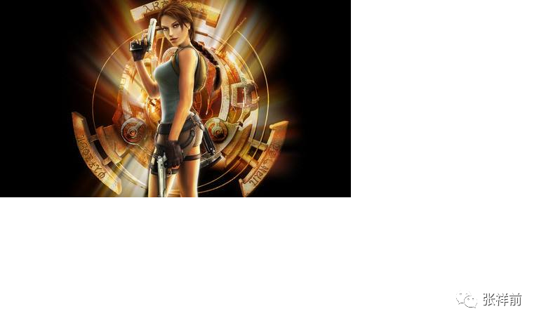

一个男孩看到一个漂亮女孩出现在眼前，实际上是一个很小的信息处理设备在周围制造的三维立体虚拟女孩图像。

到了这个阶段，虚拟伴侣，从外表看，不但非常接近真人，而且可以随意的移动，可以伴随着主人出门，可以在任意场合中出现。

第四阶段，以纯虚拟图像相互交流、互动。

他们的的人工场扫描设备和全球信息网结合，可以把信息处理设备的硬件完全的去掉。

人工场扫描设备可以安装在他们星球的上空，向卫星那样，可以远程的令物体运动，可以在很远的地方产生出三维立体虚拟图像和声音来。可以在全球任何地方随时随地的制造可以移动的三维立体图像和声音。

有了这个设备，人和虚拟伴侣交流、活动，不但更加的接近真实的伴侣在一起生活，而且，这个虚拟伴侣还可以对物体施加作用力。

比如，一个女孩，命令一个虚拟男朋友把一个桌子搬走，本来，这个男朋友只是虚拟影像，对物体作用力为零。但是，由于人工场可以对远程的物体具有搬运能力，那个女孩的命令其实是信息传到了人工场设备，人工场设备远程的令桌子移动，让你看起来，就是那个虚拟男朋友听了女孩的话，把桌子搬走的。

第五阶段，以胶状物为相互交流、互动。

事物总是在发展着，他们的虚拟伴侣到了第五个阶段，会是这个样子。

一个男孩走到一个房间里，按一下某一个开关，眼前迅速出现一个奇异环境下的三维立体影像，一个身在远处漂亮女孩的三维立体影像出现在其中，这个影像移动到一个箱字前面，箱子自动打开，里面有一些胶状物质。

当这个影像落入这个箱子里后，这些胶状物质立即活跃起来，迅速的形成一个和这个影像一模一样的人。

这个由胶塑形成的人，不但和远程的那个漂亮女孩一模一样，而且受那个女孩的控制，所有的动作都和远程的女孩的动作一模一样的。

这个由胶塑形成的人其实和远处的那个女孩，凭人的感觉是无法区别的。这样，这个男孩和远方的女孩交流、互动，就等同于和一个真实的人在一起交流、互动那样。甚至可以发生性爱，和真实的性爱没有任何的区别。

微丽说，他们有的人是没有性器官的，就是用这种方式来发生性爱。

三十一，性爱场馆

有一次，微丽邀请我去果克星球的性爱场馆去玩，我愉快的答应了。

微丽说，果克星球有很多免费的公共性爱场馆，满足果克星球男女在特殊环境下的性爱需求，但是，有一些私人性爱场馆是要付出财富值的。

我和微丽通过全球运动网来到果克星球的一个公共性爱场馆，性爱场馆非常巨大，一眼看不到头，场馆上面飘着巨大的虚拟文字。

可是没有大门，墙壁好像是实体建筑，墙壁上画着许多竖格子，竖格子中间好像是虚拟的，有着许多纷纷扰扰的东西在扰动，不时的有果克文字由下往上滚动。

我看到了很多对果克星男女从竖格子里一穿而进，同时也看到不少单身的男女进去了。

“怎么会有单身男女进去，单身进去怎么性爱”？

“进去以后，可以通过全球信息网约性爱伴侣。”微丽说，“如果在里面实在约不到性爱伴侣，也可以同虚拟人进行性爱活动。性爱场馆有许多设备和场景，你在家里进行虚拟性爱是没有这些设备和场景的，达不到那个效果。”

我拉着微丽的手，走到性爱场馆墙壁的时候，一犹豫，微丽快速的绕到我面前，拉着我快步进入性爱场馆。

里面只是一个狭小的过道，面前一个巨大的虚拟电脑烟雾状虚拟屏幕挡在我们面前。

微丽对一行文字用手指点一下，说，“这个要我们对项目做出选择，你看这个怎么样？”

我看到有男女赤身拥抱着荡秋千的画面出现，“这个太简单，太单调了。”

“喔，我也这么认为。”微丽再次用手一指说，“你看看这个怎么样？”

我看到了一个画面，一个像马一样的动物，上面有凹槽，一个人赤裸身体躺在凹槽里，另一个人骑在下面的人身上，然后赶着这个马使劲的跑。

我对这个性趣不大，说看看下一个项目吧，可是微丽说她很喜欢这个项目，也不管我同意不同意，按下了确定。

我们刹那间出现在一个荒野上，我身上的衣服也不知去向，没有别人，只是微丽赤身裸体的牵着一个像马一样的动物站在我目前。

“这是哪儿？我们到了哪里了？”

“这个地方离性爱场馆已经很远了，但是，仍然是属于性爱场馆范围，因为你从别的地方是不能够进到这里来的,
性爱场馆好比是一个入口。”微丽回答。

“为什么从别的地方不能来这里，这里有什么特殊的吗？”

“不要问问题了，问题提问阶段结束。”微丽变得蛮横起来，“前哥，你过来，躺在这个里面。”

我躺在马里面，微丽赤身着裸体的叉腿骑在我的小腹部，赶着马狂奔起来。刚开始我觉得很刺激，可是，遇到大的壕沟，马飞奔过去，又重重的落下，微丽身体狠狠的压在我身上，我觉得受不了，可是微丽兴奋得不得了。

我多次要求停下，她才停住，“还有很多没有做完呢，等会儿要过台阶，要钻火焰，要淌水·····。”

“我不想做下去，换别的吧，要不然你躺在马里，我骑在你身上，怎么样？”

“我们还是选择下一个项目吧。”看来微丽不喜欢我骑在她身上。

微丽用手在空中这么一拉，立即出现烟雾状的虚拟电脑，我看到一个画面，男女赤身裸体拥抱着，被一个巨大的透明的球包裹着，像保龄球一样从高处滚下来。

“就选择这个吧。”

“这个，我们以前玩过的。”微丽好像有些不愿意玩这个。

“以前我们穿着衣服的，现在没有穿衣服，感觉肯定不一样，就这个吧。”

微丽同意了我的建议，在虚拟电脑上按一下，我们立即出现在另外一个环境中。在一个像路灯一样的东西下面，我赤身坐在地上，微丽也是赤身裸体的骑在我身上，我们紧紧的拥抱着。

路灯一样的东西上面淌下透明的液体，滴在我们的身上，快速形成一个大圆球，感觉这个大圆球的材料极度柔软，很有弹性，里面仍然有部分空隙，我们可以有一定的活动空间。

我们这样抱着从高处滚下来，遇到台阶的时候，有节奏的振动着，感觉很是刺激。从高处摔到大石头尖上，大圆球被高高弹起，微丽兴奋得大叫起来。

有时候大圆球在做自由落体运动，我们有失重的感觉。感觉有几分钟的时间，我们停止了，看到大圆球变成液体淌走。

微丽仍然很兴奋，又在虚拟电脑上搜类似的性爱运动项目，后我们选择了一个人体内部旅行的项目。

用什么样的人体模型，我主张用地球的人体模型，微丽没有反对。

微丽又赤身裸体叉腿骑在我的身上，我们紧紧的拥抱着，站在一个躺着的巨人的牙齿上。

微丽命令我跳下去，我看到牙齿下面光线黑暗，看不清楚，虽然犹豫了一下，我们还是跳下去了，里面是柔软的舌头和口腔。

到了里面，感觉光线强了起来，又可以看清楚了。这个时候，感觉这个巨人突然站了起来，我们从巨人咽喉掉下去了。

到了巨人的胃部，周围暗红色的柔软肉体不停的波击我们的身体，后来我们又进入肠道，肠道不断的蠕动，我们缓慢的前进。

到了直肠，感觉很紧，有股巨大的力把我们往外挤，我们终于出来了，我和微丽身上都是黏黏的液体。我想怎么才把身体洗干净，渐渐的感觉这些黏黏的液体干了起来，后又从身上脱落下来。

后来微丽又选择一个性爱运动项目，我没有在意是什么项目。我和微丽被吸入一个肉洞里，微丽说这一次是在地球女人身体里旅行。

我看到肉洞是红红的颜色，很紧，一股巨大的吸力把我们吸进去。我们被肉体反复揉搓，感觉很刺激。后来，我们看到里面一道肉体屏障，中间一个很小、很深的小洞。微丽要我们从这个小洞挤进去。

我们费了很大的劲挤进去，里面是透明的、粘稠的、微热的液体。这种液体给人极度舒服的感觉，可是，一会儿后，我就要把头挤出小肉洞外呼吸一下。微丽和我身体结构不一样，她就这么一直很陶醉的样子呆在里面，没有不适应的感觉。

后来，我们出来，粘稠的液体随着我们一起出来，虽然肉洞很紧，由于粘稠液体的润滑，我们出来很顺利。

我逐渐感到有些累了，微丽仍然很兴奋，又在虚拟屏幕上搜寻下一个项目，“我觉得有些累了，我们回去吧。”我建议道。

可是微丽不想回去，“我有办法让你快速恢复体力。”微丽说完，在虚拟屏幕上操作一会儿，我眼前出现一个圆筒状的东西，看来是虚拟的，微丽叫我爬进去，我进去后立即就睡着了，醒来一看，微丽守在我身旁，我感觉精神特别好，问微丽是怎么一回事情？

“这个全球运动网和全球信息网共同作用所的产生的一种使人精神和体力放松的项目。”微丽说。

“那你要不要放松一次？”

“不需要，这一点活动在我们果克人身上不算什么。”微丽拒绝了我的建议，继续的在全球信息网上搜下一个性爱活动项目。

接下来好像是我们地球的过山车，我躺在一个小车子里，微丽赤身骑在我的身上，快速的旋转着，没有一会儿，我晕的不得了。

微丽在耳边按一下，看来是全球运动网的帮助，我们平稳的站在地面，大飞轮仍然在转，要是在我们地球上，只有等大飞轮停下来我们才可以下来的。

后来我们坐上了碰碰车，许多果克男女乘坐着碰碰车，在一个金属制成的巨大的高度平整的场地上疯狂碰撞。

微丽叫我赤身的躺在小车里，微丽赤身骑在我的身上，开着碰碰车拼命撞，我觉得太刺激受不了，可是看到微丽很开心，很兴奋的样子，就一直坚持下来。

接下来我们做皮飞艇，这一次是微丽赤身趴在一个皮飞艇里，我骑在她的屁股后，许多对伴侣驾驶着皮飞艇，在2米高的空中对撞。男女交合在一起的身体如果被撞开，飞艇就停止了，落在地面，我们看到，不断的有飞艇降落。

我们还参加了一个击水袋的性爱游戏。

我们看到一排整齐的管道，许多对男女钻入这个管道中，微丽拉着我也进入这个管道中，微丽赤身叉腿骑在我身上，微丽要我紧紧抱着她，因为马上要起风。果然不久，一种狂风从管子一头吹来，强劲的狂风把我和微丽吹得很远，撞上一个悬挂空中的大水袋，大水袋被撞破，我和微丽都落入水袋中，里面的粘稠的热乎乎的液体，给人很舒服的感觉。

微丽指着附近的一对男女，他们没有撞破大水袋，微丽说他们撞击力小了，掉在地上，是失败的，不但很难堪，人也是很疼的。

在大水袋里我们抱一会儿，大水袋慢慢落下，我们起来走开了。

后来，我们又参加了驮女友比赛。

许多果克男女，站立在规定的位置，赤身裸体的拥抱着，我和微丽也站在其中，只是我的个子高，显得很特殊。一声令下，女人全部跳起来，叉腿夹住男人的腰，在向下滑，男人的性器官进入女人身体的时候，男人就迅速把踩在脚上的裤子提起，裤子上面有绑带，要把女友在自己身体上绑好，这个捆绑的活很重要。

然后跑步，行走，闯各种各样的关。谁先到目的地，谁就领先，领先有奖励。如果在运动过程中，男人的性器官从女人身体里脱落，就算失败，要出局的。

微丽要我加油使劲，不要给地球人丢脸。可是在闯关中，微丽使劲的给我刺激，我只好摄住心神，不想名次，只要不出局就行了。

走在一个震荡的路中，强烈的刺激，差点使我泄了，好在最终到了目的地，没有名次，也不是最差的。

我们还参加了一个性爱游戏活动“彩色泡泡”。

许多果克男女拥抱在一起，处于失重状态，周围被各种各样的颜色、各种花纹的泡泡包裹着，有圆球形状的，有长条形状，有面包形状的，有丝状的，各式各样的，千奇百怪的，在空中漂浮着，场面很壮观。有的还能够从人的身体里慢慢的穿过。

接下来的性爱活动项目，我不知道叫什么名字，这个项目的开发者可能是女性，在一个粉红色的花的海里，天空到处垂着粉红色的纱巾，周围许多粉红的巨型桃花，桃花中心有着女人娇嫩的身躯和美丽的笑容，这个我好像在虚拟旅行中遇到过这个场景。

这个是什么项目？像地球人一对新人结婚大典？微丽似乎很喜欢这个浪漫场景，和我手拉手漫步在桃花大道上。

最后，出现一个巨大的桃花，微丽端坐其中，本来粉白色的肌肤带了粉红色，微丽叉开双手，示意我上去，我上去和微丽拥抱着，桃花渐渐的合拢。

我们最后的一个性爱游戏活动是“杀人树”。

在一个巨大的旷野上，远看像矗立着许多大树，走进一看，像是一个橡皮制作的裸身女人身体，头发是许多柔软的肉红色的管子构成，从头披到脚。

微丽要我赤身躺在草地上，微丽也赤身的趴在我的身上，我们缠绵着在草地上滚着，当滚到巨型裸身女人的时候，这个大树一样的巨型女人身体突然动起来，头上的柔软管子把我和微丽裹住，收了回去。

我们在一个肉洞里被柔软肉体挤压，反复的摩擦，粘稠的液体和许多柔软的肉管子的吸附，使人极度快感，最后我终于忍不住，一泻千里，人也是疲乏到了极点。

微丽按住耳朵，可能是请求全球运动网，我们从这里，没有经过性爱场馆大门直接就回到微丽的住所。

 

 

三十二，遇电妹和条妹受伤

有一次，我和微丽、苏代尔受到诺顿的邀请，去一个私人馆所去玩，这个私人馆所只是接待邀请的人去。微丽在虚拟电脑前站一会儿，虚拟屏幕上出现了微丽的身影。

果克星球的虚拟电脑屏幕和全球信息网就是好，微丽看来是利用虚拟屏幕和信息网作为镜子，微丽看看身体的前面，又扭着身体看看身体的后部，看来微丽好像很在意这一次聚会。

微丽又通过全球信息网和全球运动网，给我弄来一套衣服，叫我换上，其实就是类似一个短汗衫加一个裤衩。

我和微丽通过全球运动网出现在这个私人会馆的门外，和苏代尔、诺顿他们见面，我看到他们今天的衣服都很短，很暴露。

诺顿用手在耳边按了一会儿，我们突然就到了这个私人会馆里面了，可能是诺顿的请求被这个私人馆所的主人通过了。

里面聚集很多人，有单调低沉的音乐声音，男男女女都穿着都很暴露，光线很暗，空中不时的有雪白的强光扫下来。有男女在一个角落里跳舞，被虚拟成像技术投射在空中，不但人被变得很巨大，场景也是千变万化。

微丽和诺顿他们都去领一个细小的发光的棒子，慢慢的插进自己的手臂里，然后这个插在手臂上棒子顶端发出一圈一圈的蓝色和雪青色的的光束来，使人看起来很鬼魅的样子。

微丽对我说，“前哥，你不能插这个，你的身体结构和我们不一样的，插进去你受不了的，我来给你另一样东西。”

微丽说完，去找来一些闪着金属光泽的液体来，涂在我的手背和肩膀上，在黑暗中，我身上也发出蓝色的光芒，只是不像微丽他们那样时刻闪耀着。

微丽和诺顿他们每个人都领来一个杯子样的东西，里面不是饮料，而是发出蓝色的烟雾，缓慢的飘出来。微丽和诺顿他们不时的用鼻子去闻这个蓝色的烟雾。

微丽对我说，这个烟雾可以使人兴奋，能够改变人的心情，不过我们地球人是不能用的。

诺顿要微丽照看我，不让我乱跑。不一会儿，诺顿和苏代尔不知踪影。微丽很兴奋，拉着我在人群中钻来钻去。后来，微丽要我在一个地方站着等她，她一会儿就来。

可是，很长时间微丽都没有来，我傻站在那里，却引起两个果克女人的主意。

这两个女人勾肩搭背，身上可能带着放音乐的东西，传出刺耳的滴滴滴、嘶嘶嘶的有节奏的音乐声音。

这个两个女人看到我，一个人停下脚步，另一个人没有停住，由于惯性，围绕着停下的人转了一圈后才停下，两个人打量着我，低声议论我，全球信息网客服可温给我翻译出她们议论的内容，

“个头很大啊，是一个异形人。”

“块头也很大啊，明显是一个男人啊。”

“抓回去，性侵他，钻入他的身体里，肯定给我们不同的感觉。”

“我就喜爱新的、刺激的感觉·····”

“很难得的机会，不能放弃。”

一个很苗条的女人靠近我，一米高的个子，腰很细，勉强和我手臂差不多粗，下身穿一个很短的裙子，赤裸着上身，两个细小的乳房大概有一尺多长，垂在胸前，用一根彩带扎在一起。碧蓝色的身体，像碧玉那样极度光滑的样子，光滑的发亮，四肢和腰身像蛇那样灵活的扭来扭去的，毫无骨头的感觉。

她的眼睛很大、很细长、贼亮的感觉，45度倾斜朝上，在昏暗的光线下，她突然裂开嘴，嘴里面许多细细柔软的腥红色管子狂魔乱舞的样子，看到她真的如同看到活鬼一样。

这个女人用手按住自己耳部一会儿后，对另一个女人说了一句话，全球信息网客服可温给我翻译为：“请求全球运动网附属物移动，怎么没有通过？”

我明白这个女人想请求全球运动网把我掳走，请求没有通过。这个女人看来请求全球运动网掳走我没有成功，就靠近我，看来是想亲自动手把我抓走。

全球信息网的客服可温发出急促声音警告我：“靠近你的人，是条妹，意图：性侵，建议异形人立即逃离。”

我没有逃开，我担心我移动了地方，微丽他们找不到我。那女人离我又近了，全球信息网声音更加急促：“异形人，立即离开，你有被性侵的危险，可能受到的伤害：机械类伤害。”

我仍然没有离开，因为我发现这个女人虽然像鬼一样，但是很漂亮，极度性感。况且全球信息网智能客服可温说这个女人只是想性侵我，没有别的意图，被这么漂亮的女人性侵，肯定很刺激，加上最近老是玩虚拟性爱、虚拟游戏，我觉得没有什么危险的。

但是，当条妹靠近我身体，来抱我的时候，由于这个条妹太过于像鬼，加上她身上散发出一种强烈的骚臭味，像农村人常见的骚板虫味道，给人很恶心的感觉。出于本能的害怕，我还是下意识的后退一大步躲开了条妹的拥抱。

另一个女人快速上前，这个女人身材丰满，两个大腿很粗，乳房硕大短促，全球信息网客服传来急促的警告声，“电妹，试图性侵，可能带来的伤害：电烧伤，异形人，立即逃离。”

这个时候，我就是想逃离，已经来不及了。电妹从我身后紧紧的抱着我，立即给我触了电感觉，四肢顿时不听大脑指挥了。

条妹扯掉了我的衣服，身体轻轻的一弹，像青蛙一样敏捷的跳起来，叉腿夹住我的腰。

就在她这个一跳的刹那间，不到一秒种时间，条妹身上的衣服迅速消失。条妹的肌肤给我的感觉如同蘸水的鳝鱼，冰冰凉的，极度光滑但又很硬。

跳起来的条妹的两个大腿夹住我的胸口，并且从我的胸口慢慢的向腰部滑下来，一直滑到下面。当我的小弟弟慢慢进入条妹下身的时候，感觉进入了极度柔软、润滑的、有强大吸力的肉体管道。条妹两个细长的乳房像一双手臂一样搂着我的腰，也不知道是不是身后电妹放电的原因，感觉很愉悦，极度快乐的感觉。

我心里想，此刻的愉悦感觉从来没有过，全球信息网客服的警告就是狗屁，如果相信了全球信息网客服可温的话，跑掉了，那有现在极度愉悦的感觉？

可是，我马上就觉得不对劲了，感觉肛门有柔软的管子钻入，我被电妹、条妹四个手臂搂着，被条妹两个细长的乳房搂住，等于六个手臂搂着我，我无法转身看到底是什么东西钻人的我的肛门里。

我努力使劲的想用意念阻止这个钻入我肛门的肉管子，但是，没有成功，仍然被钻入，随之而来的又是另外一种极度愉悦的感觉，简直是舒服到了受不了的程度。

条妹用嘴吻我，条妹嘴里许多柔软的细管子带着热辣辣的腥臭味，逐渐深入到我的咽喉，再到胃部，肛门的管子也快速的向上使劲的钻着，感觉它们对接了，相互纠缠在一起，似乎从我身体内部把我给捆住了，很奇怪，强烈刺鼻的骚臭味、腥臭味使我极为恶心，但是和极度愉悦同时存在。

我睁开眼睛看一下，吃惊不小，看到条妹的身体变得更加细小了，原来她的身体可以变形，逐渐从我嘴里和肛门钻入我的身体内部，胃里和肠道都有着饱饱的感觉，后来，她的身体完全的钻进我的体内，觉得自己的身体变得很沉重了。

当我正在极度快乐的时候，猛然听到一声断喝，全球信息网翻译出：“立即放下他！”

我一看，是诺顿和苏代尔站在我们面前，那个电妹放下我，立即逃走了，我登时感觉自己身体变得更重，没有电妹的搂抱和扶持，我几乎站了不住。条妹也想快跑，可是她的身体陷入的我的身体中。

我看到有肉管子从我嘴里、肛门快速的钻出，落入地上，一条一条的，最后，这些条状物融合在一起，变成了一个人，条妹在地上恢复了原形，爬起来也快速的跑掉了。

我逐渐感觉嘴里和肛门很疼痛，后来胃部和肠道也开始疼痛，后疼痛实在受不了，只好蹲下来。我看到肛门流出很多血来，看来可能是条妹出来太快了，给我带来伤害。

诺顿用手在耳边按了一会儿，可能是告诉微丽，微丽也赶到了，吃惊的样子看着我流淌在大腿和地上的血。

诺顿他们决定终止这一次私人聚会，带我去果克星球的医院里去治疗。

通过全球运动网，我们很快到了果克星球的一个医院里，医院非常高大，里面人很少，很安静。微丽扶着我躺在一个跑道上，我头对着一个巨大的圆柱物体，中心一个大洞，和我躺在的跑道是连通的。

微丽对我说，“这个是人工信息场扫描器，我们果克人治病就靠这个，这个机器可以治疗任何疾病，包括外伤，就是你们地球人的任何急性和慢性疾病都可以被这个机器治好。人只要在这个机器丽来回几趟，就可以完全治好了。”

我以为微丽是在安慰我，我进到圆柱体里面的时候，有一股微微的电流穿透我的身体，给人痒酥酥的感觉。从头开始，逐渐移到胸部，再到腹部，再到腿上，一直到脚，最后这种感觉从身上消失。几秒的时间，我就被推出来，身上一切疼痛和不适应统统消失，这个人工信息场扫描机器真是太神奇了。

“人工信息场治疗疾病，需要人工信息场发生器这个硬件，还需要软件，就是控制人工信息场发生器如何工作的计算机程序。”诺顿说，

“在那个医院里的人工信息场扫描机器中，没有治疗地球人的程序，还是我临时从全球信息网上搜索下来的治疗地球人程序，治好了前哥。”

“人工场信息扫描机器为什么治病这么快，而且彻底？”我问。

“人工场在计算机程序的控制下，可以精确的把分子、原子那么小的物体识别、分类移走，可以高速识别、批量高速移走物体。比如说可以以极高的速度一个一个分子的来移走物体。”诺顿继续给我解释：

“人工信息场发生器还可以精密切割、搬运、冷焊接、组合、局部加热、局部冷冻----，还可以在物体内部瞬移，可以把物体内部的东西瞬间移走，而不破坏物体的外表和结构。

| 就是可以在密封的环境下把东西移走，不破坏密封环境。比如在不开刀的情况下可以把人体内部任何东西瞬间移走。
| 　　这种人工场可以隔空取物。对人做手术的时候，就不要割开人身体了，通过场扫描机器，可以精确的对人体内部进行手术。”

| “这种人工场扫描机器的工作原理是什么？”我仍然很好奇。
| “宇宙中的场主要是电磁场和万有引力场和核力场，引力场作用范围广，对物体有穿透性，对任何物体都有作用力，但是，力量比较弱。电磁场力强大，但是对物体穿透性差，作用范围短，并且只是对有些东西感兴趣，有些东西不感兴趣，对不感兴趣的东西作用力几乎为零。”苏代尔给我解释，

“人只要知道了场的本质，就可以制造出一种具有引力场对什么物体都有作用力、电磁场力量强大双重特点的人工制造的场----人工场。人工场在电脑程序的控制下工作，这个就叫人工信息场。其基本原理是人工场照射使物体处于零质量的激发状态。”

“你们地球上将来也会出现为人治病的人工信息场，不但可以彻底治疗你们地球人的癌症、高血压、糖尿病、老年痴呆症等慢性疾病，也可以彻底治疗传染病和外伤及其他任何疾病。”诺顿说，“你们地球上人工信息场的出现，标志着地球进入无药物时代”。

我回到微丽家，我对果克星球医院里的人工信息场扫描器非常惊叹。

“人工信息场扫描机器还可以减肥、美容和雕塑人的体型，”微丽说，“只有人工信息场才可以使人的身体体型想怎么样就怎么样，真正的随心所欲，女人真正的爱死了人工信息场扫描器”。

 

 

三十三，参观邻近星球

和诺顿他们交谈，我得知果克星球附近有几十个行星，像我们地球附近有8大行星一样，围绕着一个巨大的像太阳的恒星在旋转，有的行星还有卫星，大的行星都有几十个卫星。

他们的文明开始起源于一个星球，后来，他们发明了光速飞碟，才开始大规模开发附近别的星球。

果克星球附近的行星，已经大部分被果克人开发，可以居住人，有的已经居住了不少人。

有一次，我和诺顿、苏代尔、微丽乘坐飞碟参观了果克星球附近的几个行星。

首先，第一站，我们去了垃圾星球，这个星球堆满垃圾，空气稀薄，不适合人呼吸。飞碟在垃圾星球上空悬浮着，诺顿、苏代尔上了这个垃圾星球，微丽陪我呆在飞碟上。

微丽说，我们果克星球对环境的要求是极端严格的，果克星球产生的垃圾很多都运到这个垃圾星球来分解处理，处理完，有用的材料会运回去使用。垃圾星球绝大多数是机器人在工作，有人在果克星球上远程操作这些机器人在垃圾星球上干活。

第二站，我们到了一个巨大星球上，飞碟在空中盘旋。到处是密密麻麻的高大的金属样建筑，这个星球呈现银白色，但是，仍然有荒凉的感觉。星球上没有植物，至少我努力的观察，没有发现植物。

“这个就是我们的母星银星，”诺顿的话让我有些意外，“我们果克星人起源于这个银色星球，这个星球本来和你们地球一样，充满绿色，生机盎然的，可惜由于核战争，我们几乎把这个星球毁了，这个母星表面被核武器破坏得不合适人居住，人们只好转移到地下生活。

好在不久以后，我们破译了场的本质，发明了飞碟，我们首先开发银星附近的果克星球，我们努力改造果克星球，使果克星球环境变得适合我们居住，现在果克星球已经是我们的主星，也是我们权力、科技中心，别的星球都受果克星球管辖。

现在银星上主要居住的大部分是虚拟人，和长年生活在地下的地下人。”

飞碟从一个通道中进入到了银星内部。到了银星内部，诺顿给一个圆环给我，戴在脖子上，诺顿说这个是为我呼吸提供氧气用的，因为银星地下的空气可能不适合地球人。

我们一行人下了飞碟，乘坐另一种交通工具，像敞篷汽车，没有轮子，离地面大约2米的高空中飘行，速度不快，周围景物一览无遗，很适合游览观光。

银星内部如同蜈蚣身体一样，一个很巨大的主洞，周围许多小洞连通着大洞，我们看到大洞的墙壁上许多虚拟人来回走动，也有很多光线虚拟人，迎面向我们走来，从我们身上一穿而过，很是惊悚，也很是神奇。

后来我看到在小洞口，昏暗的光线下，有许多稀奇古怪的爬行动物，看到我们，迅速的钻到更小的洞里。

从银星出来，我们乘坐飞碟飞到了“原始部落星球”。

诺顿介绍说，“原始部落星球的居民都是从果克星球上移民上去的，在果克星球的全球信息网上，有一个‘我是原始部落’的部落论坛，这个部落论坛才是原始部落星球的权力中心和大本营，他们崇尚原始生活，反对科学技术，但讽刺的是离不开一些基础科技。

在开发原始部落星球，这个‘我是原始部落’的部落论坛发挥了主要作用。”

原始部落星球表面许多植物，景色非常优美，苏代尔驾驶飞碟超低空飞行，诺顿说，“要小心，原始部落星球人喜欢攻击别人，他们不但反对科技，还讨厌一切法律，崇尚弱肉强食的丛林法则，他们相互杀戮是很平常的事情。”

果然，我们看到地面上有暴露的人尸体，大煞风景，与优美的环境极不协调。这些尸体裸出骸骨。

诺顿说，“‘我是原始部落’人身体是在果克星球上定做的，具有骨骼，需要吃食物，而我们没有骨骼，不需要吃食物，我们的营养是全球运动网的人工场在程序控制下自动为我们身体提供，而原始部落星球没有全球运动网的人工场，他们和你们地球人一样，只能吃食物维持能量。”

我们看到原始部落星球人胖瘦不一，身高不一，长相是千差万别，衣服破烂，几乎人人都带着武器，有刀箭，有火器，还有更高级的我叫说不上名字的武器。

“这些人打仗死了怎么办？”我好奇的问。

“这些人的意识在我们果克星球都有备份的，死了，在果克星球上立马就可以复活一个来。果克星球的‘我是原始部落’的部落论坛在原始部落星球太空中设置卫星，可以用人工场扫描远程的监测原始部落人，人一死，他们立马就知道了。

原始部落人在果克星球上复活后，如果还是想找死，还可以来原始部落星球，找人相互厮杀。”苏代尔不屑的说，

“原始部落星球没有人工场，没有全球运动网、全球信息网提供服务，在这个星球怎么吃饱了才是最大的问题，别的方面更是糟糕，生活在这里就是活受罪，不明白为什么有人喜欢呆在这个星球？”微丽说，

“可能这些人老时就想着去杀人，别的地方没有机会杀人，只有到了原始部落星球才可以杀人。”

“自己也被别人杀，活活！”苏代尔大笑。

从原始部落星球告别，我们来到了花星，千奇百怪的植物，到处是花，简直就是花的海洋，我们在里面漫步走着，空气中都是香甜的味道。

诺顿说，“不少果克人来这里游玩，放松心情，这里是一个好地方。”

“不过，人这个地方人呆久了，又感到厌恶。”苏代尔说。

“这个看法，我赞成。”微丽说。

我们飞临一个不大的星球，苏代尔驾驶飞碟在这个星球上空盘旋，诺顿指示飞碟不要在这个星球上着落。

诺顿说这个星球是离果克星系中心太阳最远的一个行星，是果克星系的预警中心，主要预警外来星球来客。这个星球的建筑有点奇怪，房屋横着伸的很长。我想，可能这个星球引力小，物体在上面重量小，否则这样的建筑会被星球的引力破坏掉。

我们飞到一个不大的星球上空，看到一个失事的巨大飞碟，被厚厚的尘土覆盖着，苏代尔驾驶飞碟靠近了这个失事大型飞碟，启动了扫描设备对飞碟内部图像扫描，我们在飞碟的虚拟成像屏幕上看到了失事飞碟内部情况，里面就有人的骸骨。

诺顿说，“这些人是我们果克人早期的探索活动先锋，那时候我们果克人的意识还没有技术备份，这些人死了，不会再活过来，这些人是真正的英雄。”

在一个荒凉的星球上，我们看到了一些人工建筑的痕迹，诺顿说，“这个星球是我们果克人早期改造失败的一个星球，果克人早期选择一些小型行星球改造，认为小型行星球改造成本小，实际上这个是错误的，小型行星不容易固定空气，用人工场固定空气虽然方便，但是，一旦出毛病损坏，空气跑光，引起灾难后果。”

果然，在这个星球上，飞碟扫描成像使我们看到许多房屋内，很多双双拥抱在一起的骸骨。诺顿说，“这个就是典型的人工场出了事故，空气刹那间跑光，这个星球的居民眼看不久都要死去，多数情侣和夫妻选择双双拥抱而死。果克人早期星际开发也是冒着生命危险的。”

我们的乘坐飞碟飞到一个巨大的星球表面，诺顿说这个叫矿星，体积比我们太阳系木星还要大很多倍，是果克人早期开采矿的主要场所。

以后随着科技的进步，果克星人掌握了人工场扫描技术后，不同物质之间的相互转化越来越容易，人们非常廉价的就可以把一种物质转化为另一种物质。就像你们地球上的金银珠宝，到了我们这儿变得如同泥土不值钱了。

后来人们逐渐放弃了到这里采矿，这个星球现在到处是一遍荒凉。

矿星有很多卫星，诺顿说单单有你们地球大的卫星就有几十个。在这些卫星当中，有许多已经被果克人开发过，居住着人，有的正在开发。

我们飞过矿星，来到了情侣双星，所谓的情侣双星，就是两个大小几乎相等，围绕一个轴线相互旋转，同时又围绕着恒星旋转。

“情侣双星以前又叫姐妹双星，后来，果克人可以复制自己，可以长生不老了，没有姐妹的概念，人们现在又改叫情侣双星了。”微丽说，

“这两个星球一个黑一个白，人们又叫它们是黑白双星，都把黑星叫男星，白星叫女星。情侣双星离我们母星银星不远，在银星时代的诗人啊，唱歌的，男女表白爱情什么的，经常拿情侣双星来比喻，都被人用烂了。”

“好像我们地球人比喻爱情喜欢拿月亮来表示。”我说。

“银星时代的人们对情侣双星非常着迷，无数文人把那里描绘成痴情男女的梦中乐园，后来，科技发达了，人们登上情侣双星，发现两个星球都是荒凉无比，什么都没有。只是表面物质不一样，反射光线不一样而已。”苏代尔说。

我们乘坐的飞碟在黑星表面飞行，我们看到巨大白星倒扣在空中，像是时刻坠落下来一样，白星缓慢的在空中移动。

诺顿说黑白双星相互围绕旋转一周所需要的时间还没有月球围绕地球一周时间大。

“现在果克星人也在大规模开发情侣双星，果克星球的全球信息网上，情侣双星广告是铺天盖地，卖点就是情侣双星，情侣无悔的选择。但是，仍然没有多少人去情侣双星长期居住。情侣双星人气不旺。”苏代尔说，

“情侣双星先天条件不好，有时候白天时间太长，夜晚太短，有时候白天太短，夜晚太长，夜里被另一个星球反光，白天被另一个星球遮挡着阳光，搞得白天不像白天，黑夜不像黑夜，加上硬件建设不到位，没有多少人愿意长期住在情侣双星。”

我们乘坐飞碟飞过白星表面，看到了巨大的黑星倒扣在白星的头上，白星表面是银白色的，黑星表面幽暗的黑色，我想有可能黑星山峰过多的阴影，也是造成黑星呈现黑的原因之一。

我们没有登陆情侣双星，朝下一个目标飞去。

我们还飞到了果克星系的其中一个工业星球，工业星球没有烟筒，到处是高大金属建筑，密密麻麻的工厂，诺顿说工业星球没有空气，都是机器人在干活，果克人在远程控制着。

参观完工业星球，我们飞回果克星球，还有很多星球，我们没有去参观。

三十四，在水星被劫持。

在果克星球附近，有一个巨大的行星，上面几乎被水覆盖着，诺顿他们叫这个星球为“水星”。有一次，诺顿、苏代尔、微丽和我乘坐飞碟去了水星参观、考察。

飞碟从果克星球刹那间就到了水星，到了水星上空，盘旋了一会儿，估计诺顿他们在选择降落地点。

飞碟看起来是缓慢的下落，但是，在接触水星海面的时候，我仍然感觉到以惊人的速度扑向海水里，飞碟入水的时候，没有水花，悄无声息的，像一股烟雾落入水中，很是神奇。

到了海里，飞碟里面的三维虚拟成像屏幕，大视野显示周围场景，这会儿飞碟的速度变得很慢，周围的景象是一览无遗。

海里许多高大稠密的植物，各种各样的鱼类，游来游去的。诺顿指着其中一个类似于鲨鱼的生物，说：

“这种鱼类不是普通的鱼类，它的肚子里隐藏着高级智慧人类，属于水基进化而来的寄生人种，是从别的星球引进到果克星系的人种。

你们看到没有？这个鱼的眼睛具有人的神情，完全不同于普通鱼类。”

“前哥，我们在果克星球海底玩的时候，也碰到过这种鱼类，还跟踪我们，你前哥要是被这种鱼类抓住可就惨了。”微丽说。

“水星上的人类是从哪里来的，是从你们果克星球上来的，还是这个水星上自生的？”我问。

“水星很早的时候，就有低等生物，但是，一直没有进化到智慧生物阶段。我们果克星球科技发展到一定程度后，对邻近星球频繁造访，使我们果克星球人对水星变得熟悉起来，全球信息网其中一个叫‘我是水星人’的部落群体，做出了巨大的努力，他们有不少人把自己的身体改造后，寄生在水星大型鱼类的肚子里，长年生活在水星海洋的水世界里。”诺顿给我解释，

“也有部分是从遥远的、别的星球上引进来的人种”。

“前哥，你现在耳部听到的翻译，是靠我们飞碟自带的设备工作的，水星上没有全球运动网，也没有全球信息网的服务，人生活在水星海里简直是在自找苦吃，不能理解常年生活在这里的这些人是这么想的？”苏代尔说。

“我上过全球信息网的‘我是水星人’部落，他们说水星海洋巨大，人类稀少。在水星海底生活最难受的是长年没有异性伴侣，虽然可以邀请果克星球的异性加入海底人群，但是，实际效果很差，响应者很少。

生活在水星海底的女性要多于男性。这些海底女性对果克星球来游玩的男性很感兴趣，一旦发现，千方百计的引诱捕获，捕获后这些可怜的果克男人就变成了性奴。”微丽说，

“特别是前哥，你外形高大特殊，更加引起这些海底女性的兴趣，前哥，你要小心，你是她们捕获首选的目标，这些女性在海底呆时间很长了，都已经成精了。”

这个时候，果然有几条鲨鱼祥的大鱼慢慢的跟着我们的飞碟后面。诺顿叫驾驶飞碟的苏代尔要小心，苏代尔不以为然，“这些大鱼能够把我们怎么样？”

“这些海底人，有的已经生活了上万年，可以说是高度进化，高度智慧，你指不定他们会搞出什么花招了，一旦出事，我们的身体、意识信息在果克星球已经备份，倒是无所谓的，只是前哥无法恢复，是要丧命的。微丽说的对，这些海底人早已成精了，总之，我们要注意，要小心，”诺顿说。

“你说的对，我现在小心驾驶飞碟，不该去的地方我不去。”苏代尔说，“我有个问题，这些海底人是怎么和果克星球的全球信息网上的‘我是水星人’部落相互联络的，是怎么把信息传递到果克星球的全球信息网上的？”

“以前是水星海底人把自己的信息记录下来，果克星球的‘我是水星人’部落成员驾驶飞碟来把这些信息带回果克星球，然后发布在全球信息网上。现在，据我从‘我是水星人’部落论坛的发言看，他们已经解决了水星和果克星球即时通讯问题。现在很多水星海底人自己的身体，已经有和果克星球的全球信息网联通的功能了”，诺顿说，

“我们这一次来，主要是考察这些海底人”

我们在海底转了很久，诺顿说，“这个附近有一个小岛，我们上去看一看。前哥，你把这个东西戴在脖子上，飞碟里面的装置马上通过这个为你提供呼吸用的氧气，水星上的空气你们地球人是不适应的。”

微丽从诺顿手中把一个半圆环的东西递给我，我把它戴在脖子上。

苏代尔把飞碟驶出海里，飞向空中，从空中果然看到一个小岛。飞碟在小岛上空离地1米高悬浮着，我们几个人都从飞碟底部下来了。

所谓的小岛不但面积小，而且很低，很少有植物，像是经常被海水侵袭，岛上到处是水流冲刷的痕迹。岛上的泥土像我们地球上的一种白土泥，灰白色居多。

诺顿说，“这个岛这种泥土含量高，这种土和沙土一样容易被水融化，水星几乎都是这种泥土，这个是水星陆地很少的原因，陆地被海水泡化了。”

我在小岛的边缘溜达，微丽警告说，“前哥，你离海水远一点，如果被海洋里的智慧鱼类一口吞下，你就成了她们的性奴，我们也是没有办法的。”

微丽的话让我很害怕，我立即离开小岛的边缘。在小岛上，我看到不少大洞，里面有水，洞的四周边缘的泥土堆得很高，泥土像是被东西反复搅拌的样子，感觉有生物经常从这个洞里钻来钻去的。

“这个洞是怎么产生的？”我好奇的问，“好像我们地球上黄鳝打的洞，只是洞口太大了。”

“不清楚，我们也不知道为什么有这些洞。”苏代尔说，“应该是某种生物钻的。”

“是不是火山喷发造成的？”微丽说。

“不像火山喷发，某种生物钻的，可能性大。”诺顿说。

我走进一个最大的洞口，蹲下来想仔细看一下，突然洞里的水面迅速的下降，我站的地面泥土也迅速的塌陷，人不由自主的掉入洞中。

一股巨大的吸力，使我来不及呼救，滑向洞的深处。洞的下口更加巨大，和海里是连通的，海水碧清的，我看到一个巨大的鲨鱼状的大鱼张开大嘴，我不由自主的被吸得靠近它。

我靠近大鱼嘴的时候，身上的白土泥迅速的被海水冲刷掉，这个时候大鱼的嘴停止了吸水，由于惯性，我的身体一直冲到大鱼的肚子，被大鱼的肚子上一个洞吸了进去。感觉这个洞口很紧，由于吸力太强大，人才被吸进去。

海水很冷，被大鱼吸进去后，感觉暖和了一些，身上的衣服全部被海水冲刷掉了，脖子上的帮助呼吸的圆环也掉了，在大鱼的肚子里，憋得很难受。

突然一个柔软的管子吸住我的头后膨胀起来，我突然又能够呼吸了。只是仍然被一股吸力吸着，身体凭着惯性向里面滑行，寒冷的感觉又袭来。

等我身体停下来，耳边响起一阵奇妙的音乐声音，声音很特殊，好像是从四周发出的。眼前光线亮起，像是日光灯，不是从一个点产生的光源，是大鱼肚子里到处产生的。

我头上罩着的管子是透明的，我看到眼前一个妖艳的身材很小的女人端坐在大鱼肚子的中央，是微丽所说的海底高级人类吧？我真的被她俘获了，我能够回去吗？我心里暗暗着急、害怕、叫苦。

这个女人身高大概70--80厘米高，赤身裸体的，白色半透明的身体，略带有一些青绿色，极度光滑的样子，像一种白玉，又好像一种果冻，没有骨头的感觉。两个小而尖的乳房，像羊角一样戳在前胸。

这个女人黑的发亮的头发紧紧的巴在一起，像乌鱼的脊背一样，逐渐变小，拖着身后。这个女人除了眼睛大，鼻子和嘴都非常小，脸上高低起伏不明显，眼神很清澈，但是，眼睛的尾角向上翘着，很邪恶和妖艳的感觉。她坐在大鱼肚子上，身后一个粗大的管子和大鱼身体连在一起。

大鱼的肚子里空腔不高，我只能勾着身体，我看到这个女人有着对异性渴望的神情，这种神情在地球上、果克星球上所有的女人来说都是差不多的。

这个女人在说着话，可是我听不懂。我的耳部已经听不到全球信息网的翻译，我想现在已经不在全球信息网服务范围，和诺顿他们无法联系，得不到他们的帮助，我现在怎么办？

眼前这个女人好像我们地球上一个无束鸡之力的儿童，我上前掐住她，命令她把我放回到小岛上？我这样做行吗？

我不由自主的向她走近，我迎着她的微笑或者是淫荡的笑靠近她，我想掐住了她的脖子，可是一接触她的身体，就被一股电流击中，电击的时候周围的光线都暗了一下。

我被电击得仰面倒下，这个女人敏捷的跳起来，双腿叉开，骑在我的前胸，她的肌肤给我的感觉像带水的大黄鳝一样光滑。她的身体前倾，她的阴部正好对着我，我看到她的阴部突然裂开，里面是许多碧绿色的长短不一、粗细不一的感觉柔软的管子，管子顶端里面是雪青色和紫红色。这些肉管子像一群毒蛇一样相互缠绕，昂着头，一种群魔乱舞、急于撕咬东西的样子。

突然又从她的阴部的管子里喷出许多绿色的粘稠的液体，喷了我的一身，感觉热乎乎的，登时我全身像打了兴奋剂，一股疯狂的力量在身上爆发。

这个女人用阴部紧紧的压着我的胸口，身体慢慢的后退，退到我的腰部，再退到我的小腹下，我的小弟弟进入她的阴部里，许多柔软的管子立即缠上来，慢慢裹紧，一阵一阵的极度快感袭来。她的眼睛流出了一股透明液体滴入我的胸部，立即又渗入我的身体里，又一股巨大的能量顿时传遍全身。

极度愉悦甚至到了我无法承受的地步，好在同时睡意也袭来。不知道在什么时候，感觉自己的肛门被一个肉管子钻进去，我的睡意立即消失，出于恐惧，我努力控制自己的心神，想阻止肉管子进入我的身体里，可是没有用处，一阵一阵的睡意又袭来，肉管子一点一点的进入到我的身体里。

肉管子在我的身体里继续喷射粘稠的、热乎乎的液体，我感觉到自己一阵一阵的有着巨大的使不完的劲。逐渐的，肉管子从我的肠道上升，一直钻到胃部，一直到嘴里才停下。

不知道什么时候，我醒来，看到自己头上罩着的透明的管子消失了，这个女人离开了我的身体，但是，一个粗大的绿色的肉管子从我的肛门和她身体连着，我突然感觉到自己像多了一个舌头，我吐出来一看，吓得心惊肉跳，伸出来一个像蛇舌头的绿色肉管子。我也吃惊的看到我的小弟弟里面也伸出一个绿色的细管子出来。

看我醒来，这个女人兴奋起来，叉开双腿，阴部许多肉管子伸出，在空中飞舞，一会儿落在我的身上，数不清的肉管子在我的身上到处允吸着，同时我身体内部的肉管子像分开许多小分支，我的整个身体内外像是被上万个柔和的小手轻轻的抚摸着，无法形容的愉悦溢满全身。

后来，这些肉管子又喷射许多粘稠的、热乎乎的液体，我闭上眼睛，感觉自己的身体愉悦似乎到了顶峰，这个时候，突然一股力量推着我，稀里糊涂的，我被抛出大鱼的体外。

清澈的海水里，我看到绿色的管子仍然连在我的肛门里。身上绿色的、粘稠的液体在海水里扩散、分离，冰冷的海水，使我的皮肤像无数个小针在扎，疼的难受。

奇怪的是，我不需要呼吸，没有感到不适应，虽然皮肤冷，但是，心里很热乎，我想可能是连在我肛门的肉管子可以为我提供能量。

我试着挣扎一下，肛门的肉管子把我的心肝五脏都拽着疼。

这个吊女人为什么要把我排出体外，出于什么目的？就是想给我身体增加痛苦？突然我意识到，我实际上已经成为这个女人的性奴了，我能够和诺顿、微丽再次见面吗？我还可以回到地球上，和我的父母团聚吗？一种悲哀的心情袭上我心头。

后来，冰冷的海水使我受不了，只好把身体蜷缩着。突然肛门的管子一拽，一种巨疼传遍我的心肝五脏，我被慢慢的拉入大鱼的肚子里。

这个魔鬼、毒蛇般的女人，坐在大鱼肚子上，挥舞着双手对我说着话，可是我一句都听不懂。

这个女人在我的身体里喷射一种液体后，我大脑里突然一片绿色，我就迅速的睡去，喷射另一种液体，大脑里突然一片红色，人就变得很兴奋。

大部分时间我都处于昏睡状态，把我搞醒来，就是这个女人需要性爱的时候。

后来，我感觉到肛门的肉管子长到我的脊髓，后又长到我的脑子里，从此以后，我能够和这个女人心灵交流了，同时我闭上眼睛，可以看到海洋里的景物。

和微丽说的差不多，这个女人只是把我当做性奴而已，只是有没有改造我的身体，她的绿色肉管子在我的身体干了什么，我也不清楚。

由于能够和这个女人心灵交流，又可以看到外面海底世界的景象，我的心情要好一些，那种强烈想摆脱这个女人，见到诺顿他们的急切心情逐渐的有所缓解。

我经常搂抱着这个娇小的女人，把她放在自己的腿上，在海底里彪悍的到处游荡，反而有些喜欢上这个女人了。

但是，好景不长，一次强烈的震荡把我弄醒，一种剧烈的疼痛在我五脏六腑中传开，我睁开眼睛，看到那个和我抱着的女人在我的身旁痛苦的表情，身体蜷伏着，在剧烈的颤抖，和我肛门连着的绿色的管子也被人割断。

我看到周围场景变了，已经不在海底，而是在一个大的飞碟内部。大鱼的身体横在我们面前，鱼身体已经被人剖开，几个机器人在操作，一会儿，大鱼尸体被抛出，从飞碟三维虚拟屏幕上看得很清楚，大鱼尸体落入海里，溅起巨大浪花。

我看到诺顿用手按住耳部，不停的通过全球信息网和人在交谈，我突然有一种直觉，这一次被海底人俘获，可能就是诺顿一手安排的实验。几个机器人来到我们身边，用袋子把我和那个可怜的女人分开装起来。

我在果克星球的医院里，见到了诺顿和微丽、苏代尔，诺顿说：“抱歉，由于我们的疏忽的，使你这一次发生了一次意外，使你处于危险的境地。”

“前哥，你现在有什么感觉？”微丽拉着我的手，很关切的问。

“就是头晕，身体无力，想吐”。

“不会有事情的，人工场信息场扫描几次就好了。”苏代尔安慰我。

我躺在人工场扫描器中，一会儿，感觉好多了，“感觉怎么样？”微丽搀扶我下来，关切的问。

“嗯，现在好多了，只是觉得自己仍然无力，口渴”。

一直在电脑虚拟屏幕上操作的诺顿指着虚拟屏幕说，“你们看，从前哥身体内部排出了这些花花绿绿的东西，这些都是水星海底人搞的。前哥的身体仍然有问题，海底人对前哥的身体做了修改，人工信息场不能完全治疗好的，需要人体植物化疗法才可以彻底治好前哥。我们现在就转院。”

在人体植物化疗法医院里，我被送到一个大的罐子边，诺顿他们远远的通过虚拟屏幕在操作，突然，在我脚边一个黑色的大罐子顶部慢慢的打开。

诺顿叫我跳下去，我看到里面许多血红色的管子像毒蛇一样在疯狂的舞动，管子顶端像张着的血盆大口，很是吓人。

你妈的，诺顿是不是在害我，我心里暗骂，身体却不由自主的掉下这个大罐子里。

感觉自己像是从空中掉向一个钢筋林立的地面上，我闭上眼睛，想象着这个恐怖的触觉。可是立马感觉是被许多小手托住，身体被许多肉管子托住、缠住、吸住，很愉悦的感觉。

后来睡意袭来，在睡梦中，有肉管子从我肛门进去，长满我的身体内部。后又感觉有液体填满这个罐子，我身体泡在液体中，不能呼吸，但是，也没有感觉不适应，可能是肛门的管子给我提供了能量和血氧。

从人体植物化医院出来，我才感觉到身体完全恢复过来。

 

三十五，献给海底两栖巨人的礼物

和诺顿、苏代尔、微丽他们再一次见面的时候，他们就议论起水星海底的寄生人。

诺顿说果克星球海底也有一种两栖人，属于寄生人种。是从一个高度发达的星球引进来的人种，可以生活在海底，也可以生活在陆地上。他们的母星科技极为发达，拥有庞大、先进的建筑和设备。他们早期不发达时候是不喜欢群居的，后来可以自己制造自己的身体才群居，属于宇宙中高级智慧人种。

诺顿用手一挥，出现了三维立体虚拟图像，图像上出现一个女性，和我们地球上女性的身体很像。

诺顿说这种人是一种从水基进化而来的人种，现在的这种身体形状是他们后来自己制造的。

他们男性身材很小，一般寄生在女性身体内。他们的母星很巨大，大部分被水覆盖着，人在海底稀少，碰上一个异性机会很少，在他们早期进化过程中，他们的女性一旦在海底碰上男性，决不手软，非常狠毒，千方百计的去俘获男性，一旦俘获，永远不会让其逃脱。

后来，虽然他们发达了，掌握了先进的科技，可以制造工具，甚至都可以制造自己的身体，但是，很多人仍然延续着女性捕获男性，让男性寄生在自己体内的传统。

诺顿最后说，“我们不久将去拜访这些两栖人，顺便送给他们一个礼物。”诺顿说这个话的时候，对我望一眼。“这个礼物就是你前哥。”

什么？把我的身体作为礼物送给她们体验，来获得体验数字，给诺顿他们创造数字财富？

诺顿向来都是骗我，或者不让我知道，故意安排使我突然遭遇果克星系那些稀奇古怪的女性，让她们去体验我的身体，还经常被她们粗暴的虐待。

这一次为什么说得这么明了？是因为这种两栖人很像我们地球上女性，不会引起我本能的反感？或者说这是一种高级智慧人种，对我很文明、很温柔，不会野蛮的攻击我。

但是，我没有说不的权利，只好沉默不作声。

很快，诺顿带我们到了两栖人聚集的地方。从空中看到一个环形的岛屿，岛上景色非常的漂亮，各种设施，中间是碧清的海水。我们乘坐的飞碟一头进岛屿中央的海水中。

飞碟在海底停下，我们走出飞碟，周围不是海水，而是空气，许多极为精美的设施，有许多巨大的房屋。

我抬头向上看，大约有10层楼那么高的地方有涌动的海水，似乎看不到玻璃之类的东西托住海水。海水就像天上的云那样浮在空中，有很多鱼类在我们头顶游过，很神奇的感觉，是不是虚拟墙壁托着海水？

阳光从晃动的海水穿过，照射在地上，形成了许多晃动的花纹。有鱼类游过时，会把影子投射到地面上。

另外给人感觉住在这个地方很高档，我想这些两栖人不愧是高级智慧人种，获得的待遇都不一样。

但是，迎接我们的只是两个机器人，和诺顿说了什么，诺顿叫我走到一个房间里，对我说，要把我的身体内外彻底的洗干净。

来果克星系，我已经接触了他们不少女性，她们喜欢以野蛮的方式入侵我的身体内部，个个都有虐待的嗜好，这些女性虽然也给我带来愉悦感觉，但是，更多的是恐怖和恶心，甚至是残忍，没有一次是好好待人的感觉。

听诺顿说要把我作为礼物送给两栖人去体验，我心里很期待，因为我看到全球信息网的虚拟图像上介绍，果克星球海底的两栖人种很像我们地球上的女性。

我一直想渴望和地球上女性真正的性爱是什么感觉，也很期望女性的温柔。

听到诺顿叫我到一个房间里把身体内外彻底洗干净，我突然心里又莫名其妙的紧张害怕起来，是不是把我身体洗干净送给她们吃了？

房间的门估计是虚拟的，看到我人走进，立即在中间出现一个物体融化形状的大洞。我走进去后，房门就立即闭上。

房间里光线昏暗，感觉许多细细的液滴从空中落下。我走到房子中央，房间光线突然亮起来，有几根黑色的柔软细管子从空中快速的伸向我，只是听见“斯”的一声，我身上的衣服被黑管子撕开全部吸走了。鞋子也消失了，感觉站在一个柔软的橡胶上。

立即有管子向我身上喷泡沫水，有的管子把我身上的毛发剃掉，只是留下了头发和眉毛。有的管子把我手指头和脚趾头吸住，快速的磨掉指甲。

这些管子动作很快，一会儿就把我身体外清洗干净。有管子向我嘴里延伸，然后向体内喷泡沫水，由于不停的向体内喷水，不停的施压，胃肠很难受。

我身体外面又一个黑色的圆环，套着我的身体，从头顶开始缓慢的下降，我身体内顿时有一股巨大的压力，黄色的大便从肛门流出，淡黄色的尿液也从阴茎流出，一直到肛门、阴茎因为流出的液体变成完全透明的，黑色的圆环也下降到地上，向我身体内注水才停止。看来，里外清洗结束了。

这个时候，感觉地面似乎开始融化，我的脚越陷越深，最后，整个人突然的落下去了，沿着一个螺旋式、涂满润滑油的滑梯滑了下去。

我落到地面，站稳后，看到周围有4个身材特别高大的赤身裸体的女人，看到我的到来，都围了上来。

这些人和我们地球人长得差不多，只是皮肤极度细腻、白嫩，白色皮肤夹杂着一些淡蓝色，我猜想她们的血液可能是蓝色的。她前面的肌肤是白色的，后面是乌黑色，乌黑色和白色交界地方过渡得很是自然。

由于头顶上海水的涌动，许多从海水中透露出的光线，在地面形成了许多变换的花纹，这些花纹在这些巨人身上不停的变化着，像我看到的一种毒蛇身上的花纹，给人恐怖、怪异的感觉。

她们的身高都有4、5米，不折不扣的是巨人，不单个子高，身材也是极为粗壮丰满，两个巨大的乳房像大南瓜，直径有半米多。也有肚脐眼，大约有我的头那么大，呈现喇叭状，感觉很深，看不到底。

这些人巨大的身材，给我很震撼的感觉，虽然以前有猜想，他们能够把一个男性吸入肚子里作为寄生人，自己的身材肯定很高大，但是，真正看到了，仍然超出自己的预想，仅仅是因为巨大，就有很震撼、恐怖的感觉。

这些人给我另外一个感觉是非常的精致、漂亮。她们的头发像海带，从头上到后背，一直延续到脊椎上，到了脊椎上就变短了，像是鱼翅，又像木耳那样的皱褶，特别是屁股以下部分，更像是鱼尾巴，颜色都是乌黑发亮的。

她们的胳膊窝和两个大腿之间，长着许多肉管子，就像鲶鱼的胡子，大约有几十根，下垂又缠绕在一起。

她们其中一个人把我抱起来，像妈妈抱婴儿，感觉她皮肤极度光滑，但是很硬，比微丽的皮肤更加的硬。

她浑身散发极度刺鼻的腥臭味，再夹杂着酸臭味，浓烈的程度简直让人难以忍受。

她张开大嘴亲吻我，她的嘴唇是很深的紫红色，闪烁着一些蓝色的亮点，是璀璨发亮。我看到她牙齿很白很整齐，但是牙齿很小、很尖，像鲨鱼的牙齿，很恐怖的感觉。

不过舌头有许多条，形状就像她们胳膊下的肉管子，像几百条蛇在她嘴里狂舞。

我的头被她塞进嘴里，这些像蛇的舌头在我头上缠绕，流下了许多鼻涕样的粘液，气味也是腥臭无比。

她紧紧搂住我的身体，把我头朝下，贴着她的身体往下移动，那种剧烈腥臭味和酸臭味越来越明显，可以感觉到这些味道是从她下身里面发出的。

她的下身和我们地球人一样，外表都差不多，下身看起来也是浓密的、许多长长的肉管子下隐藏着一条细长肉缝隙。只是肉管子一束一束的缠绕在一起，像许多怪异的蛇缠绕在一起。颜色和嘴里一样，也是很深的紫红色，闪烁着一些蓝色的亮点。

她又把我的身体往她下身移动，完全不顾及我对这些剧烈刺鼻味道的强烈排斥。

另外三个人走过来，向我身上吐口水，粘稠的、腥臭无比的鼻涕样的液体吐了我一身，有部分开始坠落，拉扯着长长的丝。

这个人把我的头塞进她下身肉管子里，里面有股强大的吸力，我拼命挣扎，担心吸进去会窒息而死。

好在不久，她又把我拽出来。我看到自己头上及上半身沾满了鼻涕样的粘稠液体，这种液体向下坠落时候，拉很长的丝都不断，可以断定这种液体有很强的粘稠性。

强烈的腥臭味和酸臭味，很像死龙虾的气味，好像就是这种粘稠液体发出的。

我想她们是不会轻易放过我的，果然她又把我的脚放进下身肉管子里，强大的吸力把我吸了进去，尽管我拼命抵抗，但是，毫无作用。

感觉她的下身的肉管子里面有一个椭圆形状的肉环，上下距离大，左右距离小，我的两个胳膊被挡在肉环外，身体怎么也不能进去。里面一股强大的吸力仍然在把我身体望里吸，我的身体就这样卡着，使我很难受。

这个时候，全球公众信息网突然打开，仍然是熟悉的信息网的客服可温的声音，“可怜的异形人，你的身体被囚禁，将要受到的折磨是，身体受到强力的挤压和摩擦，建议你努力使自己昏睡，来减轻痛苦。”

可温还为我提供图像信息服务，我可以从外部看到，把我吸进身体里的这个女人的样子。我又看到这个女人闭上眼睛、张大嘴，很嗨的样子，我明白了她是故意这样做，通过肉体对我身体的强力挤压，来使她自己获得快感。

果克星系上很多奇怪的女性，都有这个共同点。

但是，她这个挤压动作力量是太大了
，使我很难受，我憋足了劲，突然使身体扭转90度，身体一下地全部进去了，顿时感到很轻松。

我看到眼前一道肉窗帘之间裂开的缝隙，正在慢慢的关闭，我的心紧张到了极点，因为全部被关闭，我肯定是被窒息而亡，好在关闭到一定程度，停止了。

看着外面两片肉之间的一线天，嘴里被像一个猪大肠的肉管子顶住，味道是腥臭无比，但我还能够呼吸的，里面吸引力也停止了，这个时候我的心反而轻松下来，我想腥臭无比的气味比窒息而亡要好得多。

开始，我想，这个身材巨大的女人，把我身体吸到她肚子里，可能只是一时兴起，玩够了，就会放我出去的。起码我是每天要出来撒尿、排大便的。

但是，我想错了，她很长时间不但没有放我出来，开始搞花样，作妖起来。

不久，一根肉管子野蛮的从我肛门向体内生长。我身体被她的肉体紧紧的裹住，无法看见是什么东西进入了我的身体里，又不能扭动身体避让，只能拼命的用意念力去阻挡，可是丝毫没有用处，感觉自己的身体内部被野蛮的侵入，先是大肠，后是小肠，尿道，胃，最后，到了咽喉、嘴里。我张开嘴，吐出了一根紫色的肉管子，感觉是心惊肉跳。

没有想到，我的身体被她接管了，她通过肉管子给我提供营养和氧气，又把排泄物带走。我想我每天至少被放出来排尿、排大便，可是我想错了。

我就这么头朝下、脚朝上，只能偶尔看到外面一线天的，身体被她的肉体紧紧的包裹挤压，身体内部又被肉管子野蛮侵入而毫无抵挡之力。

我原先对这些两栖人，所谓的文明智慧之人，所有预想的好感荡然无存了，感觉她们更加野蛮、凶残，预感到她们可能要还要玩出其他花样。

果然，不一会儿，一股压力，把我的身体从这个女人身体里挤出来。我心里一阵高兴，心想可能她是要放我出来。

哪知道，她用双手托着我的后背，把我的头塞进另一个巨人的身体里，这么来回像拉锯一样的强力的摩擦、挤压。

一直到我精疲力竭，她们丝毫没有放过我，或者停下来的意思，全球信息网给我提供画面，她们玩在兴头上，个个都很嗨的样子。

我不去反抗，感觉到了她们的力量太强大，意识到反抗毫无用处，我只能用意念控制自己，努力使自己昏睡过去。但是，很难做到，身体被剧烈的摩擦、挤压使我极度的疲劳，开始出现各种幻觉，感觉自己要死的样子。

只是，最终她们还是停下来，我在她的体内睡着了，也不知道过了多长时间。梦见自己已经从她们的体内出来了，被她们搂着晒太阳，非常的舒服、愉悦、祥和、幸福的感觉。

但是，她的一个猛烈动作，惊醒了我，我恢复感觉后，才知道，我仍然在她体内。原来，她从高处跳入海水中，冰冷的海水砸在我的脸上，只是一刹那间，眼前的光亮突然消失，周围是一遍黑暗，我想眼前的一线肉窗帘已经被她关闭了，她可能正在海里畅游。

这个时候，全球信息网为我提供信息服务，我看到她和另外三个巨型女人，赤身裸体的海底游泳，相比较另外三个人的肚子里没有藏人，她的肚子明显要粗很多。她们虽然身材巨大，但是，在海底游泳的姿势很矫健，很优美的样子。

我头朝下、脚朝上置身于她的的身体内，可能是血液集中在大脑里，头很昏涨的感觉，而且耳鸣起来，非常的严重，非常的难受和焦急，时刻有一种强烈的想从她体内出去的愿望。

在自己无法出去的情况下，为了克服难受的感觉，只能努力使自己昏睡，来减轻痛苦和焦急。

期间自己产生了许多幻觉，并打开了许多特殊的记忆，感觉在她的体内时间非常非常的漫长，好像就这样身体被她禁锢在体内，在海底生活了很多年的感觉。是不是我前世在某一个星球海底就这样生活着，我现在只是打开了我前世的记忆？

除了在她体内昏睡，我就想象着能够从她体内出来，自由自在的活动，可是，她就是不放我出来。

做了很多次梦，梦见自己已经出来了，心情大好，但睁开眼睛，看到自己眼前仍然只是熟悉的，肉窗帘之间的一条细细的缝隙透露的亮光，好起来的心情立即变成了失望加绝望的心情。可能是长时间的倒立，我能够看到的景物颜色都变得发红和发黄。

终于有一次，她放我出来了，她闭着眼睛，躺在虚拟沙发上，把我放在她腿上，周围阳光灿烂，景色极为漂亮。我试着慢慢趴下她的大腿，想离开她。

可是，身后肛门仍然有一根肉管子连着她的身体，就这么轻轻一拉，我的五脏剧烈的疼，没有办法，我只好灰溜溜的回来了。

从我被她捕获开始，就没有一次能够脱离她的身体，像这样出来晒阳光都极少。诺顿、微丽他们说的没有错，这种两栖人种的女性，非常贪婪、霸道、残忍，一旦捕获了男性，把男性吸入肚子里，会死死的锁住他，是永远不会让他出来的。

最后，仍然是诺顿他们的帮助，我才脱离这个巨形两栖人的身体。

过一段时间，诺顿问我身体有什么变化，我说没有。他提醒我，身上有没有什么味道，我这才想起来，身上和口腔里仍然遗留了这个巨型两栖女人身上那种特殊的腥臭味，只是身体皮肤感觉有油，摸起来光滑了许多。

我以后耳鸣了很多年，是不是从那时候开始的？

三十六，拜见果克星科学大佬。

诺顿提议我们去拜访果克星球一个大科学家，名字叫列文【读音】，就像我们地球上的爱因斯坦那样出名，这个人对果克星球的科学发展起到了至关重要的作用，他的主要贡献是在物理学、数学、哲学上，在果克星系有着巨大影响力。

有一次，诺顿预约了列文，我和诺顿、苏代尔、微丽通过全球运动网，一起去果克星球的一个科学交流中心去拜访列文。

我们一行在果克星球科学交流中心的一个房间里等待列文的到来，列文还没有到，诺顿他们就议论起列文，从他们谈话中得知他们非常崇拜列文。

“在我们果克星球，或者说是果克星系，掌握着果克人命运的人就是这些像列文这样的大科学家。因为全球运动网和全球信息网虽然给果克人生活带来极大的便利，但同时又使果克人高度依赖这些东西，现在果克人离开全球运动网和全球信息网，就无法生活下去。

果克人其实被科学统治着，也可以说命运是被列文这样的科学大佬掌握着。通过他，我们可以掌握更多果克星球的资源。”诺顿说，

“我以前和列文通过全球信息网交谈过，但是，一直没有机会见到他本人，上次，我把前哥的资料发给他，他才答应这一次见面。感谢前哥，给我们带来这一次见面机会。”

看来诺顿对列文很崇拜，微丽和苏代尔在谈话中，也对列文很崇拜，只有我流露出无所谓的态度。

不久列文突然出现在我们面前，从长相看列文很普通，和诺顿他们身材差不多，面相很和善。只是眉毛好像特别的重，眉毛好像是画的，黑黑的、重重的眉毛紧紧巴在脸上。

诺顿他们都站起来迎接列文，在这个方面和我们地球人的行为差不多。

诺顿、苏代尔和列文都是右手按住胸口，伸出左手臂轻轻拍着对方的肩膀，看来这个可能是他们见面的礼节。

不过，列文似乎没有什么大科学家的架子，不久和诺顿他们热烈交谈起来。

诺顿、苏代尔似乎有很多话题想和列文谈，但是，今天，列文的兴趣全部在我的身上，列文问诺顿：“你们把这个叫前哥的地球人搞到果克星球来，是出于什么目的？”

“前哥小时候在室外的田野上，遭遇了一些特别高级文明的外星人，他们的文明程度要超过我们果克星球百万年，”诺顿回答，

“这些特别高级文明的外星人，在接触前哥的时候意识侵入了前哥的大脑。前哥拥有了这些特别高级文明外星人的部分记忆，我们已经在前哥大脑上做了实验，把前哥这些记忆记录下来，以后我们将慢慢的分析这些数字。”

“ 这些高级外星人遇到前哥，你们是怎么知道的？”列文问道。

“我们几个人都是全球信息网上‘研究地球人’部落论坛成员，我们很早就建立一套监视地球人的系统，”诺顿说，“一旦有别的外星人接触地球，我们的设备可以迅速获得信息，并且自动跟踪记录信息。”

“你们干的不错，你们在用场扫描前哥大脑，发现了高级外星人留下的意识信息中，有没有他们关于宇宙新、更深刻的认识？”列文问。

“我们目前只是记录了前哥脑部意识信息，还没有对这些数字详细分析，这个工作下一步做，运气好的话，可以获得许多有价值的信息。”诺顿回答。

“就现在的机会，你可以向他提问与宇宙奥秘有关的问题。”苏代尔对我说。

“宇宙是怎么来的”？我问。

“这个问题提问本身是错误的，宇宙本来就存在，宇宙没有开始，没有结束。宇宙是没有年龄概念的，时间只是人的感觉，没有人，是不存在时间的。”列文说。

“你们地球上科学家认为宇宙诞生于150亿年前的一处大爆炸，这种看法是错误的。宇宙局部地区，星体相互吸引、收缩，形成了密度很高的星球，最后又发生大爆炸，这么周而复始的演化。你们地球上的宇宙大爆炸理论只能适用与宇宙局部地区，说整个宇宙起源与一次大爆炸，则是完全错误的。”苏代尔说。

“那宇宙最深刻的奥秘是什么？能不能一句话讲出来？”我问。

“前哥问的就是宇宙终极定理，宇宙最高法则。”苏代尔说。

“在我看来：

宇宙是由物体和周围的空间构成，其余统统都是不存在的，没有第三种与之并存的东西，其余都是我们人对物体运动和空间运动的一种描述。”列文说，

“以上就是宇宙根本法则，是宇宙最深刻的、最至高无上的法则，没有比这个更加高级的了。这个也是所有宇宙星球的文明人对宇宙最深刻的认识，无论多么高级的星球文明，对宇宙的认识深度到此为止。

在所有宇宙文明星球上，首先拥有这种认识人都可以算是神级别的。值得一提的是，前哥你们地球上一个最著名的科学家，也认识到了这个宇宙根本法则。”

“是爱因斯坦吧？这个人在我们地球上是最出名的科学家。”我说。

“不是爱因斯坦，他叫伽利略，伽利略曾经说过，‘我们五官感觉到的物理世界的存在是虚假的，真实存在的是背后的几何世界’，几何世界就是由物体和空间构成，伽利略说出这样的话，表示他已经意识到了宇宙真实存在的只有物体和空间，而物理只是我们人对物体运动或者空间运动的描述而已，脱离了人，物理世界是不存在的，但是，几何世界仍然存在着。

在别的文明星球上，都是科学发展到一定程度的时候，星球上的人才能够认识到以上的宇宙根本法则，但是，你们地球上的伽利略很是意外，在你们地球上科学不发达的时候，尽然能够说出了这样的话。

据说地球上的物理学起源于伽利略，等你们地球人真正明白伽利略的‘物理世界的存在是虚假的’这句话时候，你们地球人可能感叹到：物理学起源于伽利略，又结束于伽利略。

宇宙的最高法则属于物理学的范围，物理学就是描述运动的，认识了宇宙最高的法则后，物理学的深度到此为止，但是，数学不同，数学没有最高法则，我们发现，对数学的认识是没有止尽的。

伽利略能够认识到这一点，如果不是高级外星文明的点拨，那我只能认为他是宇宙中的神。”列文说。

“我们现在计划把前哥打造成这样的神，”苏代尔说，“我们计划用场扫描技术把某些基础科学理论，尤其是与时间、空间、场本质有关的科学理论输入到前哥的头脑中，前哥将来是地球上的神，而我们是这个神的创造者，活活！”苏代尔得意的笑。

“那你们如何通过‘星际协议联盟’这一关？‘星际协议联盟’要求每一个低级文明访问高级文明星球的人返回的时候，与科技有关的记忆都要删除，尤其是与时间、空间、场本质的有关的记忆他们更加不会放过的。”列文说，

“在宇宙有人的文明星球中，场的本质的破译是一个转折点，因为场的本质的破译，意味着人工场扫描、全球运动网的瞬移、光速运动飞碟、免费能源、可以治病的人工信息场、意识扫描存储的长生不老技术等不久将会实现，这些技术虽然可以极大的改变人的生活品质，但是，也可以刹那间把整个星球的人杀掉。

比如人工场产生的瞬移技术，我们设定一个把人群的头部移走的程序，一开人工场瞬移设备，人群就统统身体与头分家了。

某些星球上人群的道德发展滞后于科技的发展，这种事情发生的可能性是很大的。对那些喜欢打打杀杀的星球人群来说，‘星际协议联盟’这样做是有他们的道理的。”

“这个，我们做了多年的研究，有办法对付‘星际协议联盟’的检查。”诺顿很自信的说，

“我们努力使前哥把与场有关超前科技传到地球，使前哥成为地球上的‘列文’。”

“活活，地球人掌握了场的秘密，进入了一个到处看不见的力在发挥作用的虚拟时代，进入光速时代，进入宇宙星际文明时代，背后是你们诺顿、苏代尔、微丽干的好事情，你们的野心不小啊！”列文大笑。

“前哥在地球上成为大名人，我会再次坐飞碟去看你。”微丽说。

“如果我在地球上默默无闻，你就不想来看我？”我对微丽说。

“那我不知道哎，也许有可能，我仍然会去看你的。”微丽说。

“就算你们把与场有关的科学理论通过场扫描技术输到前哥大脑中，你们确信前哥能够理解这些知识，回到地球上，能够把这些知识在地球上传播起来？前哥有这个能力吗？”列文说，

“要成为一个大科学家，需具备三个条件，1，聪明，2，智慧，3，正直，聪明和智慧是有区别的，聪明主要是人对知识的接受、理解和表达的速度，而智慧是人对获得的知识的加工，运用和总结、提升再创新，智慧显然比聪明重要。

人的正直品性也很重要，可以把真理坚持下来，聪明和智慧只能保证发现、领悟真理，正直的品性可以使人坚持追求真理。”

“我们对前哥长时间监测，他具有这三个品性。”诺顿说。

“在我们地球上，我好像看到一本杂志上说，自然界核心秘密隐藏在时间里，人类如果破译了时间的本质，就掌握了宇宙的核心秘密，怎么你们说宇宙秘密隐藏在场的本质中？我有些不理解。”我说。

“宇宙的核心秘密其实隐藏在空间中，场的本质就是运动的空间，所以，也可以说宇宙的核心秘密就隐藏在场中。\ |https://mmbiz.qpic.cn/mmbiz_png/ctwXrXAibr6JSicZTmk3Bj2TaAiamm801spCndzR87Tbgdh4kclaXI5ST92GsWiaZg2tF7QHPJNnZ9AooYLiaU1NZ1g/640?wx_fmt=png&tp=webp&wxfrom=5&wx_lazy=1&wx_co=1|

宇宙中任何一个物体，当然也包括我们人这个观察者的身体，周围的空间都以物体为中心、以光速向四周发散运动，空间这种运动给我们观察者这个人的感觉就是时间。

时间、场、质量、电荷、速度、光速、力、动量、能量、热、声音、颜色-----这些都是我们观察者对物体在空间中运动和物体周围空间本身的运动，所描述出来的一种性质。

宇宙的核心秘密就隐藏在空间中，其实就是隐藏在空间的运动中，认识到空间本身在运动，是最为关键的。”列文继续的说。

“那宇宙中物体为什么要运动？是不是受到了力的作用？力又是什么？”我问。

“宇宙中一切物体的运动的原因，都是空间本身运动造成的。力可以看成是物体和空间的运动状态的改变程度。”列文回答了我。

“奥，物体运动是空间运动造成的，那空间为什么要运动？”我又问。

“物理只是我们人对几何世界的描述，所以，物理上一种状态，总可以找到相对应的几何状态，”列文说，

“几何中的空间三维垂直状态，就是过空间任意一点最多可以作三条相互垂直的直线，经过我们人大脑的分析、计算、描述，这么一加工，就是物理上的运动状态。

任何一个处于三维空间垂直状态中的物体其所在的位置，相对于我们观测者一定要运动，并且不断变化的运动方向和走过的轨迹又可以重新构成一个垂直状态。

这个就是物体和空间运动的背后原因，力是物体和空间运动状态改变程度，你用力去解释物体和空间为什么要运动，你的认识就不够深刻。

运动的本质是人对空间垂直状态的描述，脱离我们观察者，是不存在运动状态的，也不存在静止状态，讨论是运动还是静止的，是没有意义的。”

“呵呵，你这个话我好像听不懂，不能理解。”我尴尬的说。

“你听不懂是很正常的，这个解释了宇宙万物和空间为什么要运动的问题，属于宇宙核心秘密之一。”苏代尔对我说。

“那空间为什么是三维的？”我问。

“在宇宙中，小到电子、质子，大到地球、月球、太阳、银河系----所有的自由存在于空间中的物体都以螺旋式在运动，包括空间本身也是以圆柱状螺旋式在运动，这个就是我们所生活的空间是三维的原因。”列文继续的说。

“相对于我们人，空间时刻以圆柱状螺旋式在运动。直线运动构成了一维空间，在一个平面上旋转运动构成了二维空间，旋转又在旋转平面垂直方向直线运动的是柱状螺旋式运动，柱状螺旋式运动产生了三维空间。

我们生活的空间是右手螺旋空间，就是我们用右手握住螺旋空间，四指和螺旋式的环绕方向一致，则大拇指方向直线运动方向，圆柱状螺旋式运动，是旋转运动和旋转的平面相垂直的直线运动的合成。”

“那有没有左手螺旋式空间？”我问。

“天然的是没有的，只有人工制造，天然的左手螺旋空间，也就是物体周围空间以左手螺旋运动的话，和普通物体周围以右手螺旋运动的空间接触，会相互排斥，在宇宙亿万年的演化中被排斥到宇宙的边缘，宇宙中就是存在了左手螺旋空间，我们也是无法发现到的。”列文回答。

“关于运动，你们地球上的科学家还不能认识到，物理学中运动状态的描述不能够脱离观测者。”苏代尔插话。

“运动状态来自于我们人的描述，是我们观察者对物体在空间某个位置肯定---到否定---再到肯定---再到否定---再到肯定—再到否定----。

运动状态是我们观察者描述出来的，当然，静止状态也是我们观察者描述出来的。如果没有观测者，或者不指明那一个观测者，运动状态是不确定的，静止状态也是不确定的，描述运动或者静止都是没有意义的。”列文补充道。

“质量、电荷、场、力、动量、能量·····这些概念对于理解宇宙的本质，也是很重要。”苏代尔说。

“质量只是物体周围以光速运动空间的位移的条数。

正电荷是物体周围在单位时间里，以光速向四周发散运动的空间位移的条数。

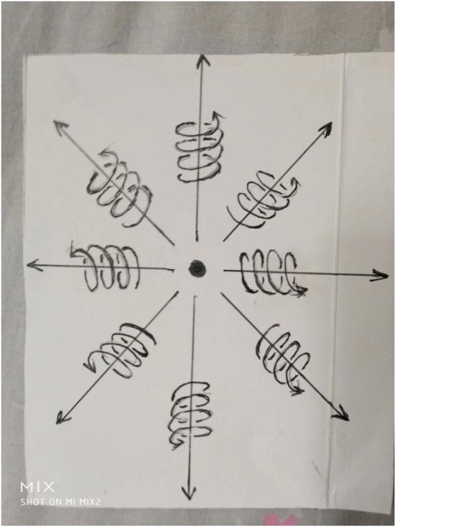

负电荷是物体周围在单位时间里，以光速从四周无限远处的空间向负电荷汇聚运动的空间位移的条数。

.. image:: media/image36.png
   :alt: 负电荷.png
   :width: 3.52083in
   :height: 3.40625in

正电荷和负电荷周围空间仍然在以圆柱状螺旋式运动，都满足于右手螺旋式，只是正电荷向四周发散运动，负电荷向内收敛运动。

能量也是反映了物体在空间中运动程度和物体周围空间的运动程度。”

列文接着给我讲解，

“你们地球上的动量是质量乘以速度，我们果克星上的动量概念，是矢量光速减去物体的运动速度再乘以质量。矢量光速方向是可以变化的。

我们的动量概念为什么比你们地球上动量概念多出一个矢量光速？原因就是你们地球上没有认识到物体周围空间总是以矢量光速在运动。

将这个动量公式对时间求导数，得出4种力，第一种是质量随时间变化再乘以矢量光速，这个电场力，第二个是物体质量随时间变化再乘以运动速度的力，这个是磁场力，第三个是矢量光速随时间变化再乘以质量的力，这个是核力，第四个是运动速度随时间变化再乘以质量的力，这个力是万有引力，也是你们牛顿力学的惯性力。

这个就是你们地球上科学家爱因斯坦苦苦追求的把宇宙4种力写在一个方程里的大统一方程。他苦干了几十年，都没有成功。”

“你们地球上的科学家还搞不清楚发光的本质，不知道光子是什么。”苏代尔说。

“光子就是加速运动的负电荷产生了反引力场，使一些电子质量和电荷消失，变成了激发态，以光速运动。光子的粒子性，是因为光子是由电子激发变成的，光子的波动性是因为空间本身的波动，空间时刻在波动，并且叠加圆柱状螺旋式运动，波动速度是光速，光子是静止在空间中，随空间一同运动。”

列文接着说，

“光子一般有两种模型，一种是一个激发电子，以圆柱状螺旋式运动，直线运动部分是光速。另一种是两个激发电子，绕一条直线作为轴线对称旋转运动，并且沿着旋转平面垂直方向的直线以光速运动。”

后来，我们谈到了信息，列文说，

“信息的本质就是物质的运动形式，不是物质本身，也不是物质的组成部分。

宇宙中任意一处空间可以包含整个宇宙今天、以前、以后所有的信息。你们地球上有预言家能够预言未来，原因都是任意一处空间隐含以前以后所有的信息，这些预言家有捕捉空间里隐藏的信息的能力。”

“列文说这些话你听的懂吗？”诺顿问我。

“只是理解一部分，但是，我记住下了他的话，以后慢慢的理解。”我说。

“我们将用人工场扫描技术，把以上这些知识，扫描到你大脑里，你以后会掌握这些知识，这些知识，对于你们地球人非常的重要。”诺顿说。

三十七，果克科学家谈人的意识、灵魂、轮回

我突然想起了一个平时很关心的问题：“我们地球上人死了就什么都没有了吗？人的死了再投胎，生命轮回是不是真实的？”

“你们地球上以及宇宙中任何一种人类，死亡都不是真正的死亡，你们地球上人的投胎转世，生命轮回是真实的，在宇宙中，很多星球上人的生命轮回都是真实的。”诺顿回答我，

“人可以分为两部分，一部分是人的身体，一部分是人的思想意识，人的思想意识是人大脑中带电粒子、离子的运动形式，其本质属于信息，可以用信息的量来表示。

如果说你们地球人的意识有多少质量、体积、能量，这个就荒唐了。

人的身体可以死去，腐烂，而人的核心——思想意识是一种运动形式，不会死亡，更不可能腐烂，可以在宇宙中反复的出现。这个就是你们地球人生命轮回是真实的原因，原因就是这么简单。

你们地球人在地球上从出生到死亡，只是无数个生命轮回其中一段而已。可能是你们地球人将要死亡的时候，才可能能够隐约感觉到这一点。

你们地球人这种轮回是反复的轮回，人有前世，前前世·····有后世，后后世·····，你们地球上每一个都是这么反复的、无穷无尽的轮回转世。

轮回不是一两个人的特殊情况，在宇宙其他有人的星球上，在他们没有掌握长生不老技术的时候，都是和你们地球人一样在轮回的，情况都差不多。”

“我们果克人，现在可是长生不老，所以不存在人的生命轮回。”微丽说。

“我们果克人没有生命轮回，可是，如果有的话，我倒是很想知道我的前世是什么？我的后世是什么？前哥，你知道你的前世是什么？后世是什么？”

“不知道哎，这个我哪知道？”我说。

“那人的灵魂是什么？”？我又问。

“你们地球人的思想意识大部分都是相同或者相似的，其中关键的五分之一是不同的，人的灵魂是思想意识的一部分，是人思想意识中最核心部分，大约占1/5，一个人区别于另一个人，关键就是灵魂的不同。人的身体是次要的，身体只是灵魂的载体。”诺顿给我解释。

“人的大脑带电粒子、离子可以对周围空间施加扰动，使周围空间波动起来，这种波动可以把人的意识信息包含在其中，并且以波动形式把这些信息以光速向四周传播开来。”

列文说着，用手一挥，空中出现了一个三维虚拟图像，图像是一个人头周围许多像光一样的东西，向四周发散运动着，列文继续说，

“所以，人的思想意识信息可以通过空间的波动形式而表现出来，也可以永远的保存在空间里，永远不会消失。人的灵魂是思想意识的一部分，同样可以在人周围空间的波动形式中表现出来，人的灵魂波是真实存在的，灵魂具有波动性，是灵魂的一个重要特点。

光速运动的三维空间，沿运动方向空间长度缩短为零，变成了二维空间，二维空间由于和宇宙任意一处三维空间存在了零距离，空间中光速传播的信息，实际上是存在于二维空间里。一个人的灵魂信息可以刹那间到达宇宙任意一个区域。所谓的远在天边，近在眼前。

宇宙中任意一处空间可以包含整个宇宙以前、现在、以后所有的信息，就是以上的原因。

空间传播的信息，在任意方向内容都是一样的。

信息和物体不一样，信息可以在空间中重叠，而物体不可以在空间中随意重叠。信息的不同的主要是结构，而物体的不同，是体积、长度、质量这些因素决定的。”

列文以上的话，我难以理解。

“我们地球人投胎转世的时候，投胎到哪儿，能不能投胎到你们果克星球？”我问。

“没有这种可能，我们果克星人已经能够长生不老，你们地球人是不可能投胎轮回到我们果克星球上的，不过投胎到别的落后星球，倒是有可能的。”苏代尔说。

“那我们地球轮回转世，会不会变成猪牛马羊？”我问。

“那不会的，猪牛马羊与人的灵魂形式差别太大。”诺顿说。

“那我轮回转世，会不会变成女人？”我问。

“那不会的，灵魂形式差别太大，那个人就不是你了。”诺顿说。

三十八，回家。

终于，诺顿对我说起了送我回家的事情，在果克星球这些天的见闻，感觉很新鲜很刺激，感觉很棒，要走了，真的很伤感。

更伤感的是他们计划让苏代尔和诺顿驾驶飞碟送我回去，微丽为什么不送我回家？诺顿解释说，是微丽自己不愿意送我，为什么啊？微丽怕分手时候自己心里难过承受不了？

我把自己想得太高大了吧？或许微丽有过很多男友，对我这个地球男友无所谓。或许是诺顿他们的安排，故意找借口。

诺顿他们为我回家在做准备，诺顿好像对‘星际协议联盟’很在意，他在认真的做功课，交代我怎么做，才可以躲过‘星际协议联盟’的检查，把与场相关的超前科技带回地球，可是我自己对此却是无所谓的态度，只是很想念着微丽，对他们的安排心里不满，但也是无奈。

诺顿打开一个电脑，电脑的虚拟屏幕出现了我的身影，赤身裸体的一个人躺在一个房间的床上，一个人走进房间，这个是穿着连体衣服，连头都罩住，后脑勺一根粗大的黑色的管子连在屁股后面，拿着一个话筒一样的东西对着我的头，自己盯着一个小的电脑虚拟屏幕看。

诺顿说，“这个是扫描仪，可以扫到你脑部的一些意识信息，‘星际协议联盟’要我们把你一些果克星球的见闻记忆删除，他们只是检查，如果仍然有残留，他们自己就删除，或者要求我们重新删除。

他们用这个东西照射你头部，就是在检测你头脑中有没有残留果克星球见闻记忆。你头脑中不断出现这样的画面：有一个黑色的方框子，中间突然强光闪一下，这个是在深度检测。

我们现在有办法对付他们这种检测，我马上给来你头脑中一段连续的意识活动画面。”

诺顿叫来两个美女，虽然个子也是一米高左右，但是，很漂亮，长相甜美温柔，感觉比微丽还要漂亮，和我们地球人的脸部很接近，腰很纤细，两腿之间没有鼓囊囊的东西。身上皮肤的颜色也接近我们地球人颜色，不像果克人皮肤那种常见的粉白色夹杂着一些青绿色。

两个人坐在我身旁，用小手不停的在我身上抚摸，由于我没有穿衣服，诺顿站在我面前我觉得很尴尬，可是诺顿无所谓的样子，诺顿说，“这两个人是我们重点开发的特殊功能人，她们可以催眠你，可以通过空间来控制、影响你的脑部意识信息。”

果然，我不久就觉得睡意袭来，在睡梦中，开始还能够知道身边坐着两个美女，可是马上，我就觉得自己回到了地球老家，而且感觉很真实，身边的两个美女不知道怎么一回事情，一个变成了我的母亲，一个变成了我的妻子，两个和睦相处，她们做饭、洗衣服、种菜、养鸡鸭，干农活，我砍柴，下水抓鱼，种庄稼。

有时候，头脑画面中断，随后又连接上。

等我醒来，两个美女仍然坐在我身旁，诺顿指着一个电脑虚拟屏幕，问我刚才是不是做着这样的梦？我惊奇的看到虚拟屏幕出现的场景，和我做梦是一模一样的。

“是的，和我刚才做的梦是一模一样，太神奇了。”

“好的！”诺顿后退一步，握紧双手用力向上一挥，“这个正是我要的结果。”

随后，诺顿和两个美女都离开了。穿着连体衣服的‘星际协议联盟’的人来了，用一个话筒一样的东西照射我头部，果然不久我的头脑中不断的出现黑色的方框子，方框子中间强光快速的闪一下。同时，两个美女变成我妻子和母亲的画面又在我脑海中出现。

一切很顺利，‘星际协议联盟’的人走后，检测结束的时候，我仍然没有醒来，当我听到“区图300飞船启动自动驾驶模式-----，”的声音，我知道我已经踏上返航的路程，返航没有意思吧？去果克星球是充满着期待和好奇，要回到地球的没有意思的日常生活了。我不想睁开眼睛，就这么躺着。

突然我听到女人说话的声音，发出银铃般的笑声，我睁开眼睛，看到苏代尔和诺顿坐在电脑前，认真的看着虚拟屏幕，笑声就是之前陪我两个美女，现在她们跪在我头前，我的耳部好像接收不到翻译信息了，我好奇的看着她们。她们仍然在笑，说着我听不懂的话。

她们一个人用手画一下，一道虚拟屏障把我们和诺顿他们隔开，我的耳部突然又接到翻译了，她们说，她们为诺顿帮忙，作为报酬，就是可以体验一下地球男人的身体。她们靠近我，流露的神情很明显，就是女人对男人性爱的一种渴求神情，这种神情地球上、水星海底人、果克人，所有的女性都是差不多的，很明显的。

两个人开始吻我，身上的衣服也迅速的退去，两个人两腿之间虽然没有果克女人常见的鼓囊囊的东西，可是我一看，只有一个指尖大小的红色的点子，两个人都是的，这个怎么能够发生性爱？我很失望的闭上眼睛，看来只能享受一下她们的抚摸。

突然我感觉到两腿之间有蛇一样的东西在游动，我睁眼一看，原来是两个美女下身伸出粉红色的、筷子粗的肉管子在我身上游动，不久一个允吸着我的生殖器，一个钻入肛门，一阵阵的极度快感袭来，感觉两个女人像蛇缠着我，一会儿出现幻觉，一会儿清醒。

两个美女对我的体力消耗很大，而她们自己却是漫不经心，在我身上抚摸又相互抚摸，嬉笑不停。

在睡梦中，我也不知道自己是怎么回到家的，我醒来的时候，光着身子躺在自己房间的床上，看着窗子我知道天亮了，我想起床，怎么也找不到汗衫和裤衩，只好在柜子里重新拿一套。

走到堂屋，闻到地上每天都有的鸭屎的味道。母亲在做早饭，还没有把关在堂屋里的鸭子放掉。

我走出大门，似乎感到本来很熟悉的环境有些陌生、不一样了。看到邻居女孩，我问她今天是几号，她停下了手里的活，扭过身体很认真的样子的回答我，内容却是：“不知道”。

张祥前主要电子版作品有：

《安徽农民外星球一个月见闻》

《果克星球奇遇1版》

《果克星球奇遇2版》

《统一场论6版》

《揭秘万有引力的本质》

《揭秘时间、空间的本质之谜》

《时间的物理定义》

《揭秘电荷、电磁场的本质》

《揭秘外星人飞碟之谜》

《介绍外星球》

《宇宙中只有一个我吗》

《揭秘人的生死之谜》

《人死亡时候的感受》

《为什么人死亡时间能够回忆出生时候的感受》

《人痛苦的根源》

《介绍人的前世爱情》

《最新科学理论证明生命轮回的真实性》

《揭秘预言家预言之谜》

《揭秘人的生死、轮回、意识、灵魂之谜》

《宗教和科学》

《我们都是农民》

《一眼看透中国人的本质》

《国家起源之谜》

《张祥前外星球旅行语音分享》

《张祥前谈人生命轮回视频分享》

全套98元，

想看的网友发邮件到张祥前的邮箱

zzqq2100@163.com咨询。

或者加张祥前微信zhxq1105974776

 

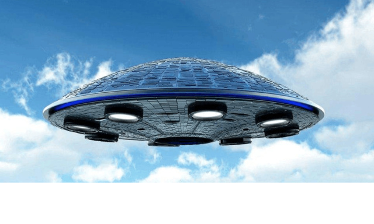
.. |https://mmbiz.qpic.cn/mmbiz_png/ctwXrXAibr6KkkH0RRtHxzZMPsY1SUTt1d1ws3Nsz32XxggHNfgv5ibKfNNormSTia2QAcDItKCUtgeyyG9Os45Sw/640?wx_fmt=png&tp=webp&wxfrom=5&wx_lazy=1&wx_co=1| image:: media/image10.png
   :width: 5.77083in
   :height: 3.45833in
.. |https://mmbiz.qpic.cn/mmbiz_png/ctwXrXAibr6L0dcCV7g48fCqyVNmZJtJ8yFCiabkDv3Z9XPsezSIZD1t0icqiaNG9iceG99n92pVaKRqAjwZh8Zjx9Q/640?wx_fmt=png&tp=webp&wxfrom=5&wx_lazy=1&wx_co=1| image:: media/image12.png
   :width: 3.9375in
   :height: 2.40625in
.. |https://mmbiz.qpic.cn/mmbiz_png/ctwXrXAibr6ICIEvTVYXbyiciaJQkfC5TbD8uEkfTiaCOKh4ZTRibkC1Y4JUvpB41ibDwoPMgF3njrd23h9ib8uBHl9dQ/640?wx_fmt=png&tp=webp&wxfrom=5&wx_lazy=1&wx_co=1| image:: media/image18.png
   :width: 4.15625in
   :height: 2.67708in
.. |https://mmbiz.qpic.cn/mmbiz_png/ctwXrXAibr6IIzdj5QpjiceA00u5JiaIsP1xXHYIEIcXUich1NH7lKSyq5ibwjEMMlfHqibxWiblCdMcGkzWbJFJP9Lyw/640?wx_fmt=png&tp=webp&wxfrom=5&wx_lazy=1&wx_co=1| image:: media/image21.png
   :width: 4in
   :height: 2.92708in

.. |https://mmbiz.qpic.cn/mmbiz_png/ctwXrXAibr6J23icuYqibter1D53mNtCsBREkicFfiar7nDuYfYughqI1MKUPiangibKsTRUibOX1csvhR8TybNI3jKXQQ/640?wx_fmt=png&tp=webp&wxfrom=5&wx_lazy=1&wx_co=1| image:: media/image23.png
   :width: 5.77083in
   :height: 3.45833in
.. |https://mmbiz.qpic.cn/mmbiz_png/ctwXrXAibr6LVUVAMVPcHibgxkGQzQxIPSdGZmbwBiaC4DzDOGxEkg9quKicCoOp5tguoYTibCGdMyuFj0WBicfqZY1Q/640?wx_fmt=png&tp=webp&wxfrom=5&wx_lazy=1&wx_co=1| image:: media/image29.png
   :width: 3.9375in
   :height: 2.21875in
.. |https://mmbiz.qpic.cn/mmbiz_png/ctwXrXAibr6KSOORgnhCPaBPYapV1zZtWkNz0QGV4O7uET1IB0o5BfG01vIJ4YBqsXNMeicQzNDsKbokdFwqqXZA/640?wx_fmt=png&tp=webp&wxfrom=5&wx_lazy=1&wx_co=1| image:: media/image30.jpeg
   :width: 3.52083in
   :height: 1.97917in
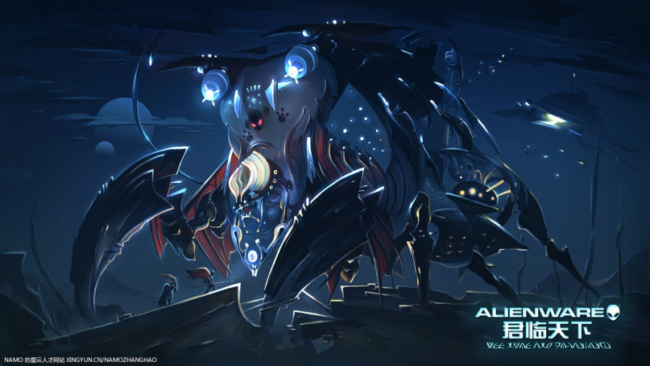
.. |https://mmbiz.qpic.cn/mmbiz_png/ctwXrXAibr6JSicZTmk3Bj2TaAiamm801spCndzR87Tbgdh4kclaXI5ST92GsWiaZg2tF7QHPJNnZ9AooYLiaU1NZ1g/640?wx_fmt=png&tp=webp&wxfrom=5&wx_lazy=1&wx_co=1| image:: media/image34.jpeg
   :width: 3.1875in
   :height: 1.80208in
