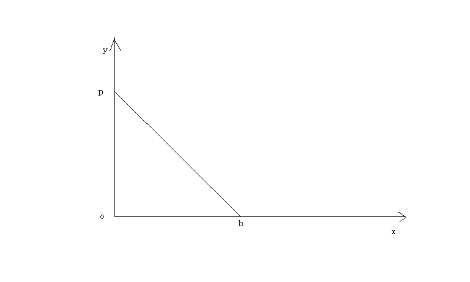

用时间的物理定义解释洛伦茨变换中的光速不变
===================================

作者张祥前交流微信zhxq1105974776

电话18714815159

狭义相对论中的光速不变是指：

   光源在静止时候所发出的光，相对于我们观察者是每秒30万公里。

当这个光源相对于我们观察者以某一个速度沿着某一个方向匀速直线运动的时候，其发出的光相对于我们观察者仍然是每秒30万公里。

洛伦茨变换是狭义相对论的核心和基础，而光速不变是洛伦茨变换的主要依据。

光速为什么不变？相对论没有回答，相对论只是把光速不变作为一个事实，展开推理，然后对牛顿力学进行修改。

本文认为，光速不变与时间的本质紧密的联系在一起，你一旦知道了时间的本质，就立即明白光速为什么不变。

下面我们通过一个假设，来给时间下一个物理定义，通过时间的物理定义来解释光速为什么不变。

首先我们给出相对论中洛伦茨变换的推导过程。

设有两个直角惯性坐标系s系和s'系，任意一事件发生的地点在s系、s'系中的时空坐标分别为（x，y，z，t）、（x'，y'，z'，t'）。

在洛伦茨变换中y = y'，z = z'，为了简单所见，我们现在主要考虑x, t,和x',
t'之间的变换。

在下图中，x轴和x'相互重合，在t'= t =0时刻，s系的原点o
点和s’的原点o’点相互重合在一起。随后，o’点相对于o点以速率v沿x轴正方向运动。

.. image:: media/image1.png
   :alt: C:\Users\Administrator\Pictures\统一场论导出洛伦茨变换.png
   :width: 5.76806in
   :height: 3.45483in

我们来求出由两个坐标系测出的在某时刻发生在x轴上P点的一个事件（例如一次爆炸）的两套坐标值之间的关系。

在s'系中测量，发生在P点的爆炸的空间、时间的坐标分别为x',
t'，也就是说爆炸是发生在t'时刻，发生的地点是在x'轴上离原点o'距离为x'处。

在s系中测量，发生在P点的爆炸的空间、时间的坐标分别为x,
t，也就是说爆炸是发生在t时刻，发生的地点是在x轴上离原点o距离为x处。

在上图中，可以直观的看出

x'= x –vt

x = x'+ vt'

按照伽利略相对性原理的思想，时间、空间长度的测量与观测者的运动速度没有关系，上式就可以成立。

但是，相对论认为时间、空间长度的测量与观测者的相互运动速度有关，随着速度的变化而变化，所以上边两式要分别乘上一个系数k和k'才能够成立。

x'= k(x –vt) (1)

x = k'(x'+ vt') (2)

由于s系相对于s'系是匀速直线运动，因而我们应该合理的认为x' 和(x –vt) ，x
和(x'+
vt')之间的关系应该是线性的，满足于简单的正比关系，所以k和k'应该是常数。

相对论的相对性原理认为，物理定律在所有的惯性参考系中都是相同或者平等的，不同惯性系的物理方程形式是相同的，所以k和k'应该相等。

对于k的值，洛伦茨变换用的就是光速不变求出的。

设想由原点o、o'在重合时刻发出一束沿x轴正方向前进的光，光速为c。

设该光束的波前【我们假定光是波，如果认为光是粒子，波前就应该改为光子，我们这里不讨论光到底是粒子还是波的问题，这个问题百度
统一场论6版
有介绍】坐标为（x，y，z，t)、(x'，y'，z'，t')，以波前达到某一个地点【比如P点】这一事件作为我们考察的对象。

如果光速c在s系和s'系是相同的，就有

x = ct (3)

x’= ct' (4)

由（1）,(2), (3), (4)式联合可以求出洛伦茨变换和逆变换：

x'= (x –vt) 1/√（1- v²/c²） (5)

x = (x'+ vt') 1/√（1- v²/c²） (6)

t'= (t–vx/c²)1/√（1- v²/c²） (7)

t= (t'+ vx'/c²)1/√（1- v²/c²） (8)

y = y' (9)

z = z' (10)

下面我们用假设的时间物理定义，来解释（3）式和（4）式中的光速不变。

本文假设：

宇宙任何一个物体【包括我们观察者的身体】周围空间都以物体为中心、以光速c向四周均匀发散运动。

空间这种运动给我们观测者造成的感觉就是时间。

由于空间时刻以光速在运动，可以认为光是静止于空间中，被空间光速运动带着向外跑的。

我们习惯了粒子在空间中的运动，空间本身的运动我们如何去描述？

我们可以把三维空间分割成许多小块，每一个小块叫几何点。我们通过描述这些几何点的运动，就可以描述出空间本身的运动。

借助于几何点概念，可以认为：

时间t与观测者o点周围一个几何点p以光速c移动的距离r成正比。所以有方程：

r = c t （11）

以上方程可以叫时空同一化方程，意思是时间和空间是同一个起源，时间的本质就是我们对光速运动空间的描述而产生出的一个物理量。

所以，脱离我们观察者，时间是不存在的，但是，空间却仍然存在着，空间的存在是基本的，时间只是人描述出来的。

由于空间本身时刻以光速c在运动，光是静止在空间中随空间一同运动。

如果没有光在空间中，空间仍然以光速c在运动，所以我们可以把以上提到的光的波前【或者光子】换成几何点p。

设想在t'= t = 0时刻，o
和o'点相互重合，此时我们考察一个几何点p从o和o'出发，以光速沿着x轴正方向匀速直线运动，过一段时间后到达P点所在的位置。

对于几何点p从o和o’点出发达到P点这件事情。

s系中的观测者认为，这个几何点以光速c = x/t
走了x这么远的路程，用了t这么长时间。

而在s'中的观测者认为，这个几何点走了x'这么远的路程，用了t'这么长时间。

我们的问题是：

s’系中的观察者认为几何点p的速度x'/t'是多少，x'/t'是不是等于光速c？

时间的物理定义告诉我们：

时间与观测者周围空间中一个几何点以光速走过的距离成正比。

所以，s'系中的时间t'比s系中的时间t，等于s'系中的几何点走过的路程x'比s系中几何点走过的路程x，也就是：

t’/t = x’/ x

将上式作一个变换，

x/ t = x'/t'

由于x/ t 和 x'/t' 都是位移比时间，并且x/ t = c，所以

x/ t = x'/t' = 速率 = c

所以，以上说明了一定会有一个与时间密切相关的特殊速率【我们用c来表示】，在相互运动的两个观测者看来，c的值是相等的。

如果以上的时间物理定义是正确的，就能够证明（3）式和（4）式中的光速c是相等的。

下面我们再来考虑，一束沿x轴垂直方向运动的光的光速不变情况。

设想有一个物体一直静止在o点，我们以o点为原点建立一个二维直角坐标系oxy 。

观测者甲相对于o点静止，当然相对于直角坐标系oxy 也是静止的。

而观测者乙相对观测者甲以速度v沿x轴正方向作匀速直线运动，如下图所示：

设想在0时刻，观察者甲、乙和o点相互重合在一起，此时甲乙两个观测者看到一束光从o点出发，以光速c沿y轴匀速直线运动。

或者我们把光束换成几何点p，几何点p在0时刻从o点出发，以光速c沿y轴匀速直线运动。

我们需要注意到：

甲乙二人选择一个沿x轴相垂直方向【也就是y轴】从o点出发的几何点p来考察。

p所走过的路程中，沿x轴垂直方向的路程将与甲、乙二人的相对运动无关，甲乙二人认为这个路程是相等的。

这一切狭义相对论用火车钻山洞的假想试验给出了证明。

设想有一个山洞，外面停一辆火车，车厢高度与洞顶高度相等，现在使火车匀速的开进山洞，运动的火车的高度是否发生变化？

假设火车的高度由于运动变小了，这样，站在地面的观测者认为火车由于运动，高度变小，山洞由于不运动，高度不变，火车肯定顺利的开进山洞。

但是，在火车里面的观测者认为，火车是静止的，因而火车高度不变，山洞是运动的，山洞的高度会降低，火车无法通过山洞，这就发生了矛盾。

但是，火车能否开进山洞是一个确定的物理事实，不应该与观测者的选择有关，唯一合理的看法是：

匀速直线运动不能够改变运动垂直方向上的空间长度。

以上的几何点p过了一段时间后，到达上图中y轴上的p点处。

这样观测者甲认为在时间为t’内，几何点p点离开自己，到达y轴上的p点，走了op这么远的路程。

而观测者乙认为自己在时间为t内从 o点出发到达b点, 并且认为几何点p离开自己，在时间为t内走了pb
这么远的路程。

根据前面的时间的物理定义，观测者所测得的时间与它周围空间中某个几何点所走过的路程成正比。

这样说来，则下式成立：

bp/op= t/t’  (12)

    将上式变形为：

    bp/t = op/t’ (13)

  
这样，观测者甲认为自己周围空间中的几何点p在t’这段时间内以一个恒定的速率【等于op/t’】走了op这么远的路程,。

而观测者乙认为这个几何点p以恒定的速率【等于bp/t】走了bp这么远的路程,
虽然比甲测得路程要长，但相应地所用时间也延长了-----因为观测者测量的时间与他周围空间中某一个几何点走过的路程成正比，所以该几何点的速率在甲乙二人看来是个不变的常数。

也就是： bp/t = op/t’

根据前面的观点，o点相对于观测者静止的时候，o点和观察者也可以看成是同一个点，o点周围空间中几何点会以光速c离开o点向外运动，而观测者甲相对于o点静止，这样，可以有：

    op/ t’ = c

由  bp/t = op/t’ 得出：

bp/t = op/t’= c

   
以上的常数c就是光速，这就解释了光速为什么会相对于观测者甲和乙数值不变。

 
  以上所描述的同一事件(就是一个几何点从o点出发到达p点这件事), 观察者甲认为用了时间t’,而观察者乙认为用了时间t, 由于t大于t’，这在形式上符合相对论中观点：

   
运动的观察者（相对于物体o点而言，如果没有物体，时间和运动的描述都没有意义）所测得的时间延长。但在数量上和相对论是否一致呢?  我们再来详细的分析一下。

     由于：bp/t = op/t’= c

     [√（op² + v ²t² )]/ t = c

     op² + v ²t² = c²t²

     op² = c²t²(1－v²/c²)

   （ct’）² = c²t²（1－v²/c²）

     t’² = t²（1－v²/c²）

     t’  = t √（1－ v²/c²）

     从以上分析来看, 运动的观测者的时间t的延长在数量上和相对论是一样的。

可能有人认为光线可以向任意方向跑啊，那空间岂不是也向任意方向跑吗？描述物体的运动需有参照物，空间的运动是参照谁呢？

 空间的运动是参照物体的，我们描述空间的运动都是指某个物体周围空间是如何运动的。特殊情况下，没有物体，我们描述空间的运动是相对我们人的身体。没有任何物体的情况下，单纯的描述空间的运动是没有意义的。

以上通过坐标参考系来解释，相对运动的两个观察者测量同一束光的光速为什么不变。

我们还有一个问题：就一个参考系来讲，为什么光速也是是常数？

这个可以这样理解，时间的本质就是我们观测者周围以光速运动的空间：

光速运动的空间 = 时间。

我们观察者把光速运动空间叫了另一个名字----时间。时间实际上和光速运动空间是同一个东西，是我们叫出了两个名字。

为什么叫了两个名字？主要原因是人类从自己的感觉来认识时间的，还不能够深入的认识到时间的本质就是光速运动的空间。

光速不变还可以这样理解。

光速c = r/t是一个分式，从数学中我们知道，分式有分子和分母组成。

光速中的分子——空间位移r和光速中的分母——时间t其实是同一个东西。是我们人因为不认识时间的本质就是光速运动的空间，把光速运动的空间叫了一个名字----“时间”。

人为的把一个东西叫成两个名字。

比如，张飞，又名张翼德，虽然是两个名字，但是，指的是同一个人。

所以，光速的分子——空间位移r如果有什么变化【比如光源的运动引起r的变化】，光速的分母——时间t一定会同步变化【因为r和t本来就是一个东西】。这样导致光速的数值c
= r / t始终不变，这个就是光速不变的原因。

比如说，我们看到了张飞胖了，体重增加了5斤，我们马上就可以断定张翼德体重肯定的增加5斤，因为两个名字指的是同一个人。

张飞和张翼德的体重在增加，但是，张飞的体重和张翼德的体重的比值始终不变。

当光源相对于我们以速度v运动的时候，引起了光速的分子——空间位移r的变化，一定会引起光速的分母——时间t同步变化。

因为光速的分子——空间位移r和光速的分母——时间t本质上是同一个东西，是我们人叫成两个名字，如同张飞和张翼德。

从以上可以推理出，光源相对于我们观察者无论是匀速还是加速运动，光速的分子和分母一定同步变化，这样导致光速始终不变。

这个表明广义相对论基本正确，因为广义相对论基础之一是两个相互加速运动观察者测量同一束光的光速是一样的。
