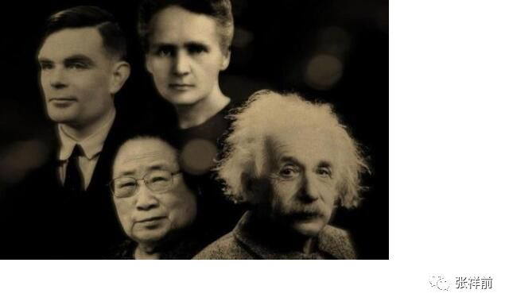

时间、空间的本质与物理定义
===================================

目录：

#. 时间的本质和物理定义

#. 回答网友关于时间的本质问题

三，我们所生活的空间为什么是三维的？

四，两种方法证明空间具有波动性

一，时间的本质和物理定义

作者张祥前交流微信zhxq1105974776

时间的本质到底是什么？千百年来许多科学家和哲学家喋喋不休的说了无数遍，也没有一个定论。这篇文章给大家一个全新的、精确的解释。为了获得可靠、精确的结果，这篇文章使用数学分析，来定性、定量的分析时间的本质。

 首先我们提出以下基本认识。

对于生活在这个自然界中，我们所观察到的各种东西和各种现象那可真是五花八门、形形色色复杂到了极点。但是仔细一分析，可以把他们分为两大类，一类为物、一类为事。

像我们眼前的一座山、一棵树、一个人、一条河……这些都是物；人的思想，河水的流动，树的生长……这些都是事，是“物”相对于我们观测者运动所表现出的一种性质。

   
宇宙是由物体和它周围空间构成的，不存在第三种与之并存的东西，宇宙中只有物体和空间这两件东西是“物”，其余的都是“事”。

一切物理现象都是“事”，是相对于我们观察者，物体在空间中运动和空间本身运动，经过我们观察者描述出来的。

时间也只是一种现象，时间也应该属于" 事"
的范畴，因而我们不能像物质点那样把它看作是一个具体存在的东西，也不能够把它看成是物的组成部分，时间来源于物体相对于我们观察者运动给我们观察者的一种感觉，它是不能脱离我们人而独立地存在着。一句话，时间也只是人的一种感觉而已。

时间这个物理概念也可以这样认为：

时间是某某物体在它周围空间运动引起我们人的一种感觉。为了精确的定义时间，现在我们只要搞清楚两个问题，第一个问题：什么东西在空间运动引起我们有时间的感觉；

    第二问题是：这个东西是以什么方式在它周围空间运动的。

　　什么物体在它周围空间运动才使我们观测者具有时间的感觉？这个物体是我们赖以生活的地球吗？当宇航员登上月球他们仍然具有时间的感觉。这个物体同样的道理不会是恒星和太阳。

   
也许会有人认为：会不会是很多物体共同影响我们观测者，才使我们有了时间的感觉，仔细地分析一下，这个看法也是靠不住的，让我们做个假想实验，答案将一目了然。

   
设想：现在用宇宙飞船把一个人从地球上接走，送到某处空间区域里，在这处空间区域里，没有一个物体，别的星球离这儿都非常非常遥远。宇宙飞船把这个人送到这里丢下后立即返回，而在这种情况下，我们可以设想这个人仍然具有时间的感觉，在他心中时间仍然是一分一秒地走。

根据我们前面的看法，他获得时间的感觉起因是某某物体在空间位置中以某种方式运动变化，而在这种情况下，这个物体只有这个人的身体而已。因此，唯一合理的看法则是：

    时间是观测者对自身在空间位置中以某种方式不断变化运动的一种感受。 

   这个有关时间的物理定义如果的确是正确的话，可能人们仍然有许多疑问。

| 一、在人类没有出现之前的时间如何理解？
| 　　人在地球上生活也不过只有一百多万年历史，单地球形成至今就有四十六亿年，那么在人出现之前早就有了时间，如果认为时间是人的一种感受，这段时间在没有人的情况下存在着，那怎能说是人的感受呢？

　　时间的过去和未来同样都是以现在作为参照系来定义的，换句话，只要有现在，便就有过去和未来。如果地球上从来没有人的话，那也就无所谓过去和未来。因为没有了人，又哪来的"
没有人之前" 或" 没有人之后" 的时间。

时间的先后、现在如同地理位置的东西南北，任何地方的东西南北都不是绝对的，都是相对于我们人来说的，想想看没有我们人，哪来的东西南北？哪来的上下左右？哪来的先后？

|   　二、时间会不会是猪、牛之类动物的感受
| 　　对于我这个有关时间的物理定义，有人问：时间会不会是猪、牛之类动物的感受，如果是又怎能精确定义为人对自身在空间位置上变动的一种感受，或者干脆称为猪对自身在空间位置中变动的一种感受，如果不是原因是什么？仅仅是因为猪大脑不及人大脑聪明？

其实，时间的定义广义的可理解为：能够对运动感知的物体对自身在空间位置变动的一种感受，人把这种感受用时间这个词来表达出来，而猪也许只会用"
哼哼" 这个词来表达这种感受。

| 三、时间如何同一个运动的物体相联系
| 　　我们描述一个物体在空间中运动，最简单我们需要了解某段时间在空间中移动了多远。在我们不清楚时间是什么尚不显露问题，一旦确认时间只是人的一种感受，我们的问题自然而然地讲出来了；

   
这个运动的物体能够和我们这种感受联系得上吗？退一步问：我们不在这个场合，这个物体的运动就不能描述吗？或者说没有一个确定的运动形式吗？

   
在物理学中强调的是效果。有一个物体在观测者我们看来是静止的，则完全能够把这个物体和我们合二为一看则是一个物体（尽管我们人有血有肉、头脑发达、化学性质同这个物体可能千差万别），对于我们描述一个物体相对于另一个物体来说完全可以的。

 这样的话，在描述一个物体在空间位置变动时，有观测者在场时，观测者会说它某段时间内该物体走了多远，观测者不在场时，观测者总会寻找一个参照性的物体，暗暗地把自己与之等同起来，认为这个参照物体与观测者合二为一。

   
实际上大家也是这么做的，我们描述一个物体运动总要指出它相对于我们观测者的位置如何如何变化·····或者相对于我们认为静止的物体（观测者把它同自己合二为一、看作一个物体）如何如何变化。

    四、时间的公共尺度问题。

　　时间可能是张三对自身在空间位置变动的一种感受，也可能是李四对自身在空间位置变动的一种感受，单地球就这么多人，大家怎么会有一个公共的测量时间的尺度？

　　所有的运动的观测者、感知者对自身在空间位置上变动的感受理所当然会在头脑中记录下来，然后把它同地球的转动、太阳的运动、铯原子的振动、脉搏的跳动……等其中的某种运动等同起来，大家最后约定把自身在时间位置上变动与其中某一种运动等同起来，这样便有了一个公共的测量时间的尺度。

    五、如何看待" 时间只是个过程"

　　有的人认为：客观冷静地分析" 时间只是个过程"
，这个判断不会出错，则反过来证明，时间是人的感受的观点是错误的。观测者在空间位置不断地变化当然也是个过程，认为时间是个过程当然不会出错，这种时间的看法对于时间的本质上认识只是不清晰、不够深罢了，并不是两种观点相互抵触。

    六、认为时间是人的一种感觉会不会是一种唯心主义观点？

　　如果认为时间是人大脑里想象出来的，与所有的物体和空间都不相干，这才是真正的唯心主义观点。从以上有关时间的定义可知，时间是人对自身在空间位置中变动的一种感受，它显然与人这个物体有关，并且是在空间（当然也是实实在在地存在着）里变化，描述一个实实在在的物体在客观存在着的空间中运动，怎能简单地认为是唯心主义呢？

　　七、如何重新看待相对论中关于描述单一物体在空间中运动是没有意义的。

　　相对论认为：描述物体在空间位置中运动变化必须相对另一个物体才具有物理意义，描述单一物体在空间中运动是没有物理意义的。而在以上的时间定义中，明确指出时间的概念的获得源自于观测者一个人在空间中运动，这二者显然矛盾，那么，究竟需要修改那一种思想呢？

    
在笔者看来，要描述某个物体在空间中变化具有物理意义，必须指明相对于某个观测者而言的。描述物体在空间中运动只有相对于某个确定的观测者才具有物理意义。描述一个物体相对于另一个物体的位置变化未必就一定有物理意义。

在上一节曾提到过：一切物理现象只不过是物质点在它周围空间运动的一种表现而已，点在它周围空间运动引起了观测者的感觉，观测者对其加以分析，总结便形成了物理概念。一句话，描述物体在空间位置中变化，只有相对于一个明确观测者才具有物理意义，在没有观测者或不指明哪一观测的情况下，描述物体在空间位置中运动都毫无意义。

   
我们在描述地球上的物体（比如人造卫星）常以地球作为参照物，实际上我们观测者把自己所处的位置与地面所处的位置等同起来，换句话来说，我们人与地球合二为一看成为一个物体，在问题（三）中我们就讨论过这个问题。

|    
  有关运动的牛顿力学相对性原理以及相对论的相对性原理都不够彻底，更彻底的运动相对性原理应该是：
|   
  描述物体在空间位置中的运动变化只有相对于某一个确定的观测者才具有物理意义。

| 　　八、观测者为什么一定会在空间位置中变动？
| 　　按照以上有关时间的物理定义，如果处于空间某处的观测者不在空间位置变动，那么这个观测者将不具有时间的感觉。现实世界中从来未发生过那个人没有时间的感觉，这从反面说明处在任何一处空间区域里观测者的位置总是要变化。至于为什么一定要变化，以及如何变化在我其他文章中以有详细的描述。在这里我简单地讲一下：

　　在物理学中运动状态和几何中的垂直状态是等价的，一个物质点处于垂直状态中其位置一定会变化。

|     九、观察者是以什么方式在空间中运动的？
| 　　这个问题的论证非常复杂，在文章后面有详细的描述。

|     十、观察者能否感觉到自己在空间中运动的？
| 　　我们知道一个人坐在一个匀速运动的船里面，他是感觉不到自己在运动的。

　　但是人对加速度是有感觉的，比如人在运动的电梯里，在刚起飞的飞机里，上面说的观察者是以螺旋式在空间中运动变化的，人们虽然觉得时间是在匀速变化、流逝，但实际上不是观察者在空间中以匀速直线运动获得的。

　　我们知道人有听、嗅、味、色、触五大感觉。空气的震动传到我们的耳朵，我们有了听觉，嗅觉是我们通过鼻子获得的，味觉是我们通过舌头获得的，光照射到我们的眼睛，我们有了颜色的感觉。触觉是物体直接撞击我们皮肤的结果，热也可以说是触觉的一种。

　　对于一些人不明白的的感觉，人们统称为第六感觉，人们往往对第六感觉很神秘。我认为还有一种加速度感觉也是很常见的一种感觉。

　　在一个上升或者下降的电梯里，在一个起飞或者降落的飞机里，在一个刚启动或者要停止的汽车里，人们对速度的变化（也就是加速度）感觉是很明显的。这种感觉和以上的五种感觉明显对不上号，它属于人的另外一种感觉。

人生活在地球上对重力的感觉肯定是对加速度感觉的一样的。人对重力的感觉常常不以为然，宇航员一旦到了太空，处于失重状态，人对于重力感觉的差异的体会可就太深刻了。

　　人的听、嗅、味、色觉本质上应该都是触觉，前面我们讨论过一切物理现象都是物质点在空间运动所形成的。空气中分子作用我们的耳朵使我们有声音的感觉。嗅觉和味觉也是分子作用于我们的鼻子和舌头。

颜色的感觉是光刺激了我们眼球的结果，而光实际上也是一些微小的粒子。但是人对加速度的感觉与这些是不同的，它是人自己在空间中加速运动形成的。

　　人身体可以说是由各种组织构成的，而各种组织又是由分子构成的，这些分子由分子之间的相互作用力而构成一个整体，人在做加速度运动时，影响了这些分子之间的作用力，这个应该是人对加速度感觉的根本原因。

　　人对时间的感觉与对加速度的感觉有相似的地方。本质上都是我们自己身体在空间中运动引起我们自己的一种感觉，虽然我们暂时不了解，但我们不能够就说不存在。

　　我们还可以做个试验，把一个人蒙上眼睛，用一个金属棒缓慢的贴近这个人的耳朵，你问他是左耳朵还是右耳朵，一般人回答正确的概率是非常高的，人的这种感觉明显不同于前面的六种感觉。有关人的感觉，我们知道的并不多，所以有的人用这个来攻击我的有关时间的物理定义是不可取的。

    
以上有关时间的物理定义如果确是正确的话,不说明我们对时间认识已经完成，而只是对时间的真实面目认识的第一步，因为在这以前绝大多数人都认为时间是一种客观存在的东西，是宇宙的组成部分。从以上的分析来看，这种看法是根本上错误的。

　　回顾一下历史，牛顿力学认为时间自行流逝，于我们观测者无关.相对论力学认为时间于我们观测者的运动有关。在这里我们进一步指出，时间不仅于我们观测者的运动有关，而且就是我们观测者自己在空间中运动所造成的。

|     
  时间的本质和光速不变是紧密的联系在一起的，下面，我们利用时间的物理定义来导出光速不变。
|    
  一提到光速不变，我们马上就想到了洛伦茨变换，洛伦茨变换是狭义相对论的基础，而洛伦茨变换中光速不变是主要依据。

|     首先我们来给出洛伦茨变换的推导过程。
|    
  设有两个直角惯性坐标系S系和S'系，任意一事件在S系、S'系中的时空坐标分别为

（x，y，z，t）、（x'，y'，z'，t'）。

  　在洛伦茨变换中y= y'，z= z'，为了简单所见，我们现在只考虑x, t,和x',
t'之间的变换。

    设想，x轴和x'相互重合，在t'= t =0时刻，O
和O'点相互重合在一起，S'系的原点O'相对S系的原点O以速率v沿x轴正方向运动。　　

我们来求出由两个坐标系测出的在某时刻发生在x轴上P点的一个事件（例如一次爆炸）的两套坐标值之间的关系。

    在S'系中测量，发生在P点的爆炸的空间、时间的坐标分别为x',
t'，也就是说爆炸发生在t'时刻，发生的地点是在x'轴上离原点O'距离为x'处。

    在S系中测量，发生在P点的爆炸的空间、时间的坐标分别为x,
t，也就是说爆炸发生在t时刻，发生的地点是在x轴上离原点O距离为x处。

在牛顿力学中的伽利略变换直观的看出。

x'= x –vt (1)

x = x'+ vt' (2)

   
按照伽利略相对性原理的思想，时间、空间长度的测量于观测者的运动没有关系，上式可以成立。但是，相对论认为时间、空间长度的测量于观测者的相互运动速度有关。

| 以上时间的物理定义明确告诉我们，时间是观察者的运动造成的，肯定与观察者运动相关，所以（1）式和（2）式要分别乘上一个系数k和k'才能够成立。
|     x'= k(x –vt)

x = k'(x'+vt')

由于S系相对于S'系是匀速直线运动，因而我们应该合理的认为x' 和(x –vt) ，x
和(x'+ vt')之间的关系应该是线性的，所以k和k'应该是常数。

    
相对论的相对性原理认为物理定律在所有的惯性参考系中都是相同的。也就是说，不同惯性系的物理方程形式是相同的。所以k和k'应该相等。

|     对于k的值，洛伦茨变换用的是光速不变求出的。
|    
  设想由原点O（O'）在重合时刻发出一束沿x轴正方向的光，设该光束的波前坐标为（x，y，z，t)、(x'，y'，z'，t')，以波前这一事件作为对象。由于光速c在S系和S'系是相同的，有

    x =ct (3)

    x’= ct' (4)

|     由（1）,(2),(3),(4)式联合可以求出洛伦茨变换：
|   x'= (x –vt) 1/√（1- v2/c2） (5)

    x =(x'+ vt') 1/√（1- v2/c2） (6)

  t'= (t–vx/c2)1/√（1- v2/c2） (7)

  t= (t'+ vx'/c2)1/√（1- v2/c2） 8)

    y =y' (9)

    z =z' (10)

    下面我们用时间的物理定义来解释（3）式和（4）式的所谓光速不变。

    光速不变的实质反映了时空同一性，即时间的本质就是空间运动变化造成的。

   
我们提出这种基本看法，宇宙中任何一个物体（当然包括任何一个观测者）周围空间都以光速c辐射式的向外运动，空间这种运动给观测者造成的感觉就是时间。

   
观察者在空间中运动与观察者周围空间的运动，本质上应该是一回事情。因而可以认为时间于观测周围空间以光速离开观测者运动的距离成正比。而光是静止于空间中被空间这种运动带着向外跑的。

   
我们习惯了粒子在空间中的运动，现在有一个问题，空间本身的运动我们如何去描述？

   
一条直线，我们可以看则是由无数个点构成，一个平面我们也可以看则是由无数个点构成，同样道理，我们可以把三维空间看则是由许多个点构成，称之为几何点。描述这些几何点的运动，就可以描述出空间的运动。对于时间，可以认为：

    时间于观测周围空间中几何点以光速c离开观测者走过的距离成正比。

    在以上的S系和S'中，设想在t'= t=0时刻，O
和O'点相互重合，一个几何点从O 和O'出发，过一段时间到达P点。

   
对于几何点从O点出发达到P点这件事情，S系中的观测者认为，这个几何点走了x这么远的路程，用了t这么长时间，而在S'中的观测者认为，这个几何点走了x'这么远的路程，用了t'这么长时间。

　　由于时间于观测周围空间中几何点以光速c走过的距离成正比，所以，S'系中的时间t'比S系中的时间t等于S'系中的几何点走过的路程x'比S系中几何点走过的路程x，也就是

    x/x' = t/t'

    将上式作一个变换，

    x/ t= x'/t'

    由于x/ t 和 x'/t' 都是位移比时间，所以

    x/ t= x'/t' = 速率 = c

   
这个就证明了（3）式和（4）式中的光速c应该是相等的，这个也说明了有一个于时间密切相关的速率c，在相互运动观测者看来c的值是相等的。

   
我们还有一个问题：就一个参考系来讲，为什么光速是常数？这个可以这样理解，时间完全的等价于观测者周围空间的运动，也就是

    运动的空间 = 时间。

    为了在物理上使“运动的空间 =
时间”成立时量纲不发生混乱，我们需要在时间前面乘上不随时间、运动空间变化的

一个常数---光速，

    运动的空间 = 光速乘以时间

   
两个相互运动的观测者发现同一束光的光速是相同的（就是光速不变性），原因是空间以光速运动，光是静止于空间中被空间运动带着向外跑的，两个观测者都发现对方的产生时间的运动空间的位移（光速中的分子）变化了，而时间（光速中的分母）随之同步变化，结果光速仍然不变。

|    
  光速反映了时空同一性，光速比起发光现象更能够表现出自然界的本质规律。光速和时间一样，是我们为了描述空间的运动而人为抽象出的一个概念
|    
  可能人们还有一个疑问？观测者周围空间有许多几何点，为什么一个几何点的运动就可以表示时间？

   
这个应该这样理解，时间反映了空间运动的一种性质，我们观测者通过描述空间中许多几何点的其中一个，就可以把空间具有时间这种变化的性质给表现来，这个也表明了，时间不能够脱离观测者而独立存在。

    下面我们再来考虑两个几何点相互垂直运动的时空情况。

   
设想有一个物质点O点，两个观察者甲和乙，在某一个时刻相对静止，并且位置和O点重合。甲和乙都以光速穿越空间运动。

   
打个比方，空间的运动如同一条以光速流动的河水，甲乙二人像随水流运动的小船，如果其中有一个观察者乙以水流速度逆流而行，在另外一个观察者甲看来乙相对于河岸是静止的。

   
现在把河水换成空间，如果其中有一个观察者乙相对于甲以光速穿越空间运动，在另外一个观察者甲看来乙的时间是静止的，这个看法和相对论是一样的。

　　设想从某个时刻开始，乙和甲分开，乙以光速随河水流动又以速度v朝岸边行驶，甲继续随河水流动，这样在时间为t内，甲走了

　　A = C t

　　t是甲的时间。

　　而乙走了

　　B = √【（vT）2 + （A）2】

   
T是乙的时间。由于时间与观察者自己在空间中以光速走过的路程成正比，这样甲的时间t和乙的时间T相比较

　　A/ t = C =B/T

　　经过运算，可以得出：

　　t =T√【1－（v/c）2】

　观察者甲和乙在空间中以光速c运动，乙相对于甲多走了vT这么远的路程，但是时间相应的又增加了，这个光速的分子位移B增大了，分母时间T也相应的增大了，结果导致穿越空间的光速c不变。

　　两个相互匀速运动的观察者如果认为哪一个相对于O点在运动，运动观察者的时间要大于静止观察者的时间，这样得出的结果和相对论的结果是一样的。

二，回答网友关于时间的本质问题

作者张祥前交流微信zhxq1105974776

最近，网友王飞发邮件给我，说：

你好，

在知乎上看了你对时间本质的讨论，感觉很有意思。

我基本同意你关于时间本质的观点，但是还是有一些问题不太清楚，或者不太同意。

1. 既然时间是空间本身的运动，那空间的本质又是什么？运动的空间，感觉上有点像“以太”的概念。

2. 同意时间是人的一种感觉，不太同意时间只是人的感觉。

你也说了，猪也能感受时间，只不过不会说，只会“哼哼”罢了。所以，时间不是人的专属，也不是生物的专属，而是一切物质的专属。

感觉时间的本质应该是物质间的相互作用。

假如人只是一个物质点（也就是说不存在人身体本身的运动变化过程），如果没有其他物体与人有任何交往互动，也就没有了时间的概念（就是想也想象不出来）。

其他物质点与人交往互动的过程中，才让人产生时间感觉。

 

3. 有一点不太清楚，当一个物体以一定速度远离观察者的时候，可以匹配上相对论的时间变慢，那么当一个物体以一定速度接近观察者的时候，时间如何变化呢？是快还是变慢（这一点也是我对狭义相对论不理解的地方）？

 

仍然感谢你的分享，希望多多探讨。

王飞

 

张祥前的回答。

  
   关于时间的本质问题，是属于我创立的统一场论【百度统一场论6版可以搜到】中一部分。

 
    统一场论基本原理是：宇宙是由物体和空间组成，不存在第三种与之并存的东西，其余统统不存在，其余都是我们观察者对物体在空间中运动或者物体周围空间运动的描述。

  
  我们把认识的对象称为事物，像我们眼前的一颗树，一条河是物【或者叫物体】，树的生长，河水的流动叫事【或者叫事情】。

  
  宇宙中，只有空间和物体是物【或者叫物质】，空间和物体运动都是事【或者叫事情】。物体运动或者物体周围空间相对于我们观察者运动，经过我们观察者描述出：时间、场、光速、质量、电荷、力、动量、能量、热、、声音······等物理概念。

统一场论给时间下的物理定义是：

宇宙任何一个物体【包括我们观察者的身体】周围空间都以光速向四周发散运动，空间这种运动给我们观察者的感觉就是时间。

以上时间的物理定义告诉我们，时间的本质是我们观察者对光速运动空间的描述。

一旦我们认识了时间的本质，就可以对王飞的问题做出正确的回答。

王飞的问题是：

1,
既然时间是空间本身的运动，那空间的本质又是什么。运动的空间，感觉上有点像“以太”的概念。

张祥前的回答：

时间的本质是我们对自己周围空间以光速运动的描述。空间是和物体最基本的东西，所以，你不能够问空间是由什么组成的。

你问空间是什么东西构成-------这个前提条件就是空间不是基本的-----一旦我们知道空间是基本的-----你问空间是由什么更基本的东西构成-----这个提问本身有问题。

空间是客观存在的，如果没有观察者，空间仍然是存在的，但是，没有观察者的话，时间是不存在的，因为时间是我们观察者描述出来的。

.. image:: media/image2.jpeg
   :alt: https://mmbiz.qpic.cn/mmbiz_png/ctwXrXAibr6ILl99UWvic7HN0pDy6zw82ia9Sj7BtTwLW4V9BUm8oNUkIup6pgYtNh7fhafQWJ1sUKkltOdnDUibhA/640?wx_fmt=png&tp=webp&wxfrom=5&wx_lazy=1&wx_co=1
   :width: 5.77083in
   :height: 3.61458in

空间和物体这两个是最基本的，组成了宇宙大厦，以太根本就不存在，以太是人杜撰出来的。

所以，我们不能问：空间和物体是由什么东西构成---因为空间和物体是最基本的东西，别的----时间、场、光速、质量、电荷、力、动量、能量、热、声音······都可以认为是由空间和物体构成的-----统一场论中认为都是物体在空间中、物体周围空间本身相对于我们观察者运动形成的。

在统一场论中，认为空间和物体是不能够相互转化的。如果能够相互转化，我们就不能认为构成宇宙最基本东西是空间和物体。

    

 2. 同意时间是人的一种感觉，不太同意时间只是人的感觉。

你也说了，猪也能感受时间，只不过不会说，只会“哼哼”罢了。所以，时间不是人的专属，也不是生物的专属，而是一切物质的专属。

感觉时间的本质应该是物质间的相互作用。

假如人只是一个物质点（也就是说不存在人身体本身的运动变化过程），如果没有其他物体与人有任何交往互动，也就没有了时间的概念（就是想也想象不出来）。

其他物质点与人交往互动的过程中，才让人产生时间感觉。

 

张祥前的回答：

时间的定义，广义的可以是：时间是观察者【能够对运动感知者】周围空间以光速向四周发散运动给观察者的感觉。

我们人是观察者其中一种，我们人用时间这个词把人周围空间光速运动给人的感觉给描述出来。

所以，我们说时间是我们人这个观察者对自己周围空间光速运动描述的结果。

猪也能够感觉到自己周围空间的光速、发散运动【前面指出了宇宙任何物体周围空间总是以物体为中心向四周发散运动】，只是猪可能不是用时间这个词来描述自己这种感觉。

 但是，我们不能断定说“时间是我们观察者对自己周围空间光速、发散运动给自己的感觉”就是错误的判断。

 

王飞说，时间的存在还必须要存在其他物体【或者质点】，和我们人的身体在相互作用中，才能够体现出时间概念。

这个看法是错误的，时间的存在需要人这个观察者，需要空间的存在，需要运动【就是我们人这个观察者和周围空间的相对运动】这三个条件，这三个条件缺少一个都不行。但是，不需要存在另外一个物体，这里只是需要存在我们观察者一个物体。

王飞之所以存在这个错误的判断，是他没有想到物体【包括人的身体】周围空间本身时刻在以光速向四周发散运动。

对于一个静止物体，一般人无法和运动联系在一起，而这个时候时间要和运动联系在一起，所以，这个情况下，很多人虚构了除观察者外，还存在着另一个物体，和观察者在相互作用而导致了运动现象的发生。

 

3. 有一点不太清楚，当一个物体以一定速度远离观察者的时候，可以匹配上相对论的时间变慢，那么当一个物体以一定速度接近观察者的时候时间如何变化呢？（这一点也是我对狭义相对论不理解的地方）

张祥前的回答：

 在相对论中，时间是物体运动速度的函数。对某一个事情经历的时间的测量，与这个事情发生的地点的【相对于我们观察者】运动速度是相关的【而牛顿力学认为是不相干的，这个是牛顿力学和相对论不同之处】。

这个时间随速度变化，与速度的大小有关，与远离我们还是离开我们观察者，是没有关系的。远离我们观察者、或者接近我们观察者，产生的时间变慢效应是一样的。

 

三，我们生活的空间为什么是三维的？

在我们所生活的宇宙空间中，过一点可以作三条相互垂直的线段，我们一般称为三维空间。

| 为什么恰恰是三条，不是四条，不是二条？这个是什么原因呢？这个里面是否隐藏了什么特别的、重要的秘密？
|     传统理论是无法解释这个问题的，只有统一场论【百度统一场论6版】可以做出解释。

    统一场论认为，空间的三维是空间本身以柱状螺旋式运动造成的。

   
空间的维数与空间本身的的运动有关，我们可以设想，空间直线运动产生的是一维空间，空间曲线运动和圆周运动产生的是二维空间，空间螺旋式运动，在旋转平面的垂直方向延伸，就是柱状螺旋式运动，产生了三维空间。

   
我们对物体在空间中运动习以为常，说到空间本身的运动，让我们感到奇怪，空间本身为什么要运动？

   
物体在空间中的运动，人们认为物体运动是物体具有运动的惯性，或者是受到了力的作用。至于物体为什么有惯性，力的本质是是什么？人们其实也是搞不清楚的。

     物体和空间本身的远动，与我们观察者的描述有关。

    
宇宙中只有空间和物体是真实存在的，宇宙大千世界纷纷杂杂的，都是由空间和物体这两个基础东西构成，不存在第三种与之并存的东西。

   
空间和物体是几何概念，我们人对这两个几何概念进行描述，产生了许多物理概念，比如，运动，时间、场、光速、质量、电荷、力、动量、能量、热、声音、光-----都是我们人对物体在空间中运动【或者物体周围空间本身的运动】的一种描述，都是一种性质，不是真实存在的一个东西。

   
可以说，任意一个物理状态，都会对应着一个几何状态。在物理学中的运动状态，对应着几何中什么状态呢？

   
物理学中我们描述的运动状态等价于几何中的垂直状态。几何中的垂直状态，经过我们人这么一描述，就是物理上的运动状态。

   
 为了描述三维空间本身的运动变化，我们可以把三维空间无限分割成许多个小块，每一小块叫空间几何点，通过描述空间几何点的运动就可以描述空间本身的运动。

    对于三维空间，物理上的运动状态等价于几何的垂直状态，可以是这样的：

   
三维空间的垂直状态，等价于物理上的运动状态。观察者周围任意一个空间几何点，处在三维垂直状态中就一定要运动，并且，几何点运动所走过的路程和不断变化的运动方向又可以重新构成一个三维垂直状态。

   
这个可以叫垂直原理，这个原理揭示了空间为什么要运动，以及会以什么方式运动。

    我们再来对垂直原理展开分析。

   
几何点只要处于三维垂直状态中，就一定要运动，这个原因是垂直状态和运动状态是等价的，看到的不同状态是因为我们人的认识而已。

   
 几何点的运动方向不断的变化，几何点肯定不是以直线运动，而是曲线运动。几何点只有以椭圆和圆周运动，所走过的路程可以作两条相互垂直的切线，可以构成垂直状态。由于空间的均匀性，没有哪一个地方特殊，我们应该合理的认为几何点走圆周运动，因为椭圆的两个切线一个长，一个短，在这里没有理由一个长一个短。

   
 在我们所生活的现实空间中，是三维的，因而我们一个合理的认为，几何点的运动不会局限在圆周平面上，应该合理的认为是在圆周平面上的垂直方向延伸，这个就是柱状螺旋式运动，柱状螺旋式可以作三条相互垂直的切线。

   
以上通过垂直原理，解释了空间本身为什么要以柱状螺旋式运动，垂直原理也解释了宇宙中的物体为什么要运动。

   
你仔细的观察，会发现自然界中一切物体，小到电子、质子，大到太阳、银河系，都是以螺旋式运动，物体以螺旋式在运动背后的根本原因是空间本身是在以螺旋式运动。

    螺旋式运动产生了三维空间，三维空间也可以分解成螺旋式运动形式。

   
我们应当认识到，空间的运动有我们人为认识的因素在里面，如果宇宙中没有人，空间的运动状态是不存在的，当然，空间的静止状态也是不存在的。

   
 对于物体在空间中的运动，也有我们人的认识成分在里面，物体在空间中的运动本质就是人对物体所在空间位置不断的肯定----否定---再肯定---再否定---。

没有人去描述，不存在物体在空间中运动状态，也不存在物体的静止状态。

   
 有人说，人在地球上生活才几百万年，而地球年龄46亿年，在人出现在地球上之前，地球已经运行了几十亿年，地球在没有人的情况下运动，怎么说运动是人的描述。

   
 其实，你仔细的想一想，没有人，就不存在没有人之前和没有人之后。之前和之后是靠人来定义的。就像地球上的东西南北，是靠人来定义的，没有人就不存在东西南北了。同样，没有人不存在没有人之前和没有人之后。

   
 对于地球的运动状态，没有人的描述，就是不确定，不存在所谓的运动状态也不存在静止状态。

   
 现在的弦论认为空间是11维，相对论认为三维空间加一维时间，称为四维时空。

   
 弦论基本上是胡扯八道，我们在这里不予评论。对于相对论四维时空观，是对时间的错误理解。时空就三维，三维空间中任意一维相对于我们观察者以光速运动就可以叫时间。

   
有趣的是，物体相对于我们以光速运动，物体所在的三维空间，在我们看来，沿运动方向的一维空间为零，由三维变成了2维。有道是，空间的维来自于运动，消失于运动。

   
空间时刻以柱状螺旋式在运动，一个空间几何点和另外一个空间几何点绝对没有区别，空间的柱状螺旋式运动和波动可以相互并存。空间的波动速度就是光速。而一般情况下，柱状螺旋式运动和波动有根本区别的。

   
场的本质就是空间本身的运动，重力场是空间波动的根源，电磁场是波动的传播，波动速度为光速。

   
宇宙空间可以无限压缩，或者说宇宙任意一处空间可以存储整个宇宙的信息。空间还有许多不可思议的性质，这里不再一一描述，有兴趣的百度搜统一场论6版可以看到详细的。

   
人类对时间空间本质的探索，对人类认识宇宙意义深远，是人类在触及宇宙的核心秘密。

四，两种方法证明空间具有波动性

| 认识到时间的本质，使我们掌握了时空同一化方程，就是从一个时空同一化方程出发可以导出牛顿力学、相对论、麦克斯韦方程、量子力学等所有基础物理公式。
|      这里通过这个时空同一化方程R=Ct= x i+ y j + z k
| 来导出时空波动方程，空间的运动具有波动性，波动的速度解释光速。

      统一场论基本原理是：

| 宇宙由空间和物体组成，其余统统不存在，其余都是我们观察者对物体运动和物体周围空间本身运动的描述。
| 统一场论基本假设：

宇宙中任何物体【包括我们观察者的身体】在相对于我们静止的情况下，周围空间都以光速度C辐射式运动，物体具有质量和电荷都是物体周围空间运动造成的，空间这种运动给观察者的感觉就是时间。

统一场论中给时间下的物理定义是：

| 宇宙中任何物体【包括观察者之间的身体】周围空间以光速辐射式运动，空间这种运动给我们观察者的感觉就是时间，时间只是我们人对自身在空间位置中变动的一种感受。
| 由于时空同一方程来自于三维螺旋时空方程，下面我们来首先来介绍统一场论中的三维螺旋时空方程。
| 设想在某处空间区域里存在着一个质点o点，相对于我们观测者静止，我们以o点为原点，建立一个三维直角坐标系x,y,z
| o点周围空间中任意一个几何点【为了描述空间本身的运动，我们把空间分割成许多小块，每一个小块叫空间几何点，通过描述几何点的运动就可以描述空间本身的运动】p在时刻t'从o点出发，经过一段时间t后，在t”时刻到达p点所在的位置x,y,z，也就是p点在t”时刻的空间坐标为x，y，z是时间t的函数，随时间而变化，由o点指向p点的失径为R
  。

R(t) =(x,y,z,t)

统一场论中的时间物理定义认为时间与观察者【或者是相对于观察者静止的物体】周围几何点以光速度C【统一场论认为光速可以为矢量，用大写字母C（数量为c
）表示，光速作为矢量方向可以变化】运动走过的路程成正比，因此有下式：

R(t) = Ct = x i+ y j + z k

i,j,k分别是沿x轴、y轴、z轴的单位矢量，这个方程可以叫时空同一化方程，反映了时间的本质是空间光速运动形成的。

将上式两边平方，结果为：

r² = c²t²= x²+ y² + z²

| r是矢量R的数量。以上方程在相对论中也出现过，相对论中被认为是四维时空距离，真实情况是时间的本质就是以光速运动的空间，借助几何点的概念，可以认为时间与观察者周围空间某一个几何点以光速走过的路程成正比。。
| 统一场论认为p点真实走过的轨迹是柱状螺旋式。只是在o点相对于我们观测者静止情况下，周围空间的运动是均匀的，许多类似p点的几何点旋转运动累加起来，由于相互抵消而为零。这个如同稳定磁场的散度为零。

但是，如果我们只考虑一个单一几何点p点的运动，其螺旋式应该在方程中体现出来。

如果认为时间是几何点沿z轴运动产生的，也就是认为时间轴在z轴上，其数学表达式应该为【几何点p在0时刻从o点出发的情况下】：

x = h cosωt

y = h sinωt

z = c t

| 以上的三维螺旋时空方程也可以用以下矢量方程表示，
| R= h cosωt i+ hsinωt j + ct k

式中h是o点到p点的矢径R在xoy平面上的投影长度，ω是p点绕o点沿xoy平面旋转运动的角速度，c是常数光速。由于o点相对于我们观察者是静止的，它周围空间的运动应该是均匀的，而且没有哪一个方向是特殊的，因而ω、h应该是常数。

如果认为时间轴在x轴上，R在zoy平面上的投影长度仍然是h，其数学表达式应该为：

x = c t

y = h sinωt

z = h cosωt

| 如果就是认为时间轴在y轴上，R在zox平面上的投影长度仍然是h，其数学表达式应该为：
| y = c t

x = h sinωt

z = h cosωt

| 以上可以叫三维螺旋时空方程，统一场论认为，宇宙的一切奥妙都是以上方程决定的，大到银河系、星球，小到电子、质子、中子的运动，以及物体为什么有质量、为什么有电荷，一直到人的思维等等······，都与这个方程有关。
| 对于以上的三维螺旋时空方程，我们需要注意以下几点：
| 1， o点周围有无穷多个几何点，p点只是其中一个。
| 2，式R = h cosωti+ h sinωt j + ct k中，当h = O时候，R = ctk
| 不表示o点周围只有一条R= ct
  k这样的矢量，而是有许多条类似这样的矢量呈辐射式均匀的分布在o点周围，坐标轴只是我们描述空间的一种数学工具，不会影响运动空间的分布。

3，空间的柱状螺旋式运动是直线运动和旋转运动两种形式的叠加。也可以认为直线运动是以上提到的柱状螺旋式运动中h
=
O的一种特例。我们还要意识到o点周围有多少几何点辐射式的以光速离开o点运动，就有多少几何点围绕o点旋转运动，也就是说几何点的运动一般情况下应该是连续的。

在场论中，散度描述了空间的直线运动形式，旋度描述了空间的旋转运动形式。

4，由于一个几何点和另外一个几何点绝对的没有区别，许多几何点沿一条直线相继的旋转运动，可以认为产生了波动形式，波动的速度就是光速，而且波动的传播方向和旋转平面相垂直，很显然是横波。

| 我们知道，柱状螺旋式运动和波动(这里指横波)有很大的区别，但是，对于空间这种特殊的物质形式两种运动形式却可以相互并存，因为两个空间几何点之间绝对的没有区别。
| 5，将以上的式R = h cosωti + h sinωt j + ct k

对时间t求导，似乎出现了超光速，我们要明白，以上的质点o点相对于我们观察者静止的情况下，周围空间几何点的旋转运动由于相互抵消而消失，所以，式中的

h cosωti+ h sinωt j

实际结果等于零，只有单独考察一个几何点运动情况下不为零，但这个不是真实的，这个情况如同稳定磁场的散度为零。

三维螺旋时空方程R= h cosωti + h sinωt j + ct k中h cosωti+ h sinωt j =
0，或者h cosωti= h sinωt j=0，则转化为时空同一化方程R
=Ct的形式，实际上三维螺旋时空方程包含了时空同一化方程。

    
统一场论认定了引力场是空间以柱状螺旋式运动所表现出的一种性质，质点外的空间几何点的矢量位移随空间位置变化、又随时间变化可以反映出引力场场强A，物理量【这里是质点外的空间几何点的位移量】随空间位置变化又随时间变化，可以认为是波动过程。

     
我们知道，波动和柱状螺旋式运动有很大的区别，波动是振动形式在媒质中的传播，而不像螺旋式运动是质点在空间中移动。但是对于空间这个特殊的东西，两种运动却可以兼容。

     
一个几何点运动不会有波动效应，但是，一群几何点情况就不一样了。由于空间中一个几何点和另外一个几何点绝对没有区别，因而可以断定，空间的柱状螺旋式运动里面包含了波动形式。

下面我们由前面的时空同一化方程R(t) = Ct = x i+ y j + z k
来推导出时空的波动方程，

设想宇宙空间某一处存在一个质点o，相对于我们观察者静止，根据前面的时间物理定义和时空同一化方程，o点和观察者的时间t可以用o点周围一个几何点p的位移R(t)
= Ct = x i+ y j + z k 来表示。

我们将R对时间t求导数，有结果：

dR/dt = C

将上式两边平方，有结果：

dR·dR/dt² = c ² 

c是矢量光速C的数量。

| 我们现在来考虑另一个几何点p’,
  p’点在0周围运动，我们用L表示其位移，L随时间t变化，是时间t的函数，由R和t的关系可以断定L又是R的函数。
| 我们将几何点p’点的位移L对对空间位移R两次求导数，有结果：

∂²L/ (dR·dR) = ∂²L/ c ² ∂t²

∂²L/ ∂r² = ∂²L/ c ² ∂t²

| 以上波动方程也可以用散度表示为▽²L = ∂²L/c²∂t²
| ∂²L/∂x² + ∂²L/∂y² +∂²L/∂z² = ∂²L/c² ∂t²

r是矢量R的数量。以上微分号d已经改为偏微分号∂。

对偏微分方程∂²L/∂t²=c²∂²L/ ∂r²求解，通解为：

L(r,t) = f(t - r/c)+g(t + r/c) 

| f和g表示两个独立的函数，方程 L(r,t) = f(t -
  r/c)可以认为是几何点从物质点o出发向外行进的波，而方程 L(r,t) = f(t +
  r/c)传统认为在物理上是不存在的，被认为是从无限远处汇聚到o点的波，对于普通介质，似乎是没有这种物理意义的，但是，对于空间这种特殊的介质，却有物理意义的。这个实际上可以解释负电荷的来源，这个以后详细再讲。
| 以上方程也包含了以o点为中心向四面八方直线运动形式，和从四面八方直线汇聚到o点的运动。
| 方程∂²L/∂t²=c²∂²L/ ∂r²有两个特解L = a cosω（t–r/c）和L= a
  sinω（t–r/c）满足这个方程。

| 上面的波动速度c是光速，时空的波动是横波。
| 统一场论认为引力场是这个空间波动的根源，质量是空间相对于我们观察者运动所表现出的一种性质，电磁场是波动的传播，传播的速度就是光速。
| 物体周围时间、空间的存在是一个波动过程，波动的速度就是光速，空间几何点的位移随时间变化和随空间位置的变化可以反映出物体周围万有引力场分布情况。
| 物体周围的万有引力场的本质也可以认为是空间相对于我们观察者波动所表现出的一种性质。
