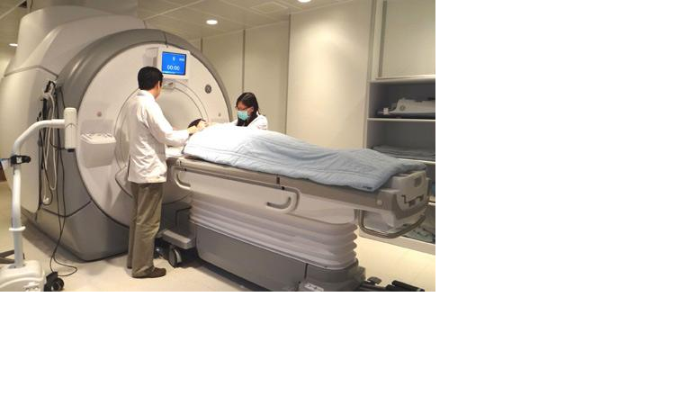
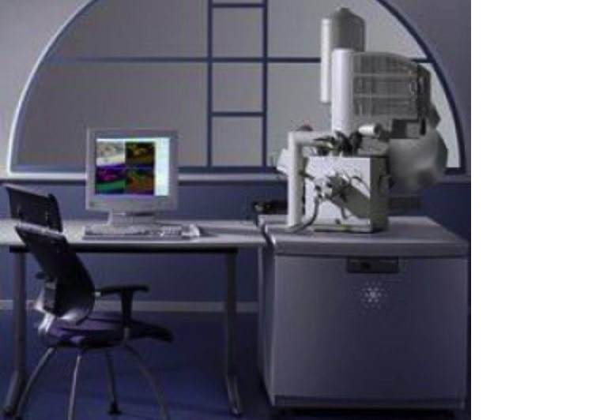
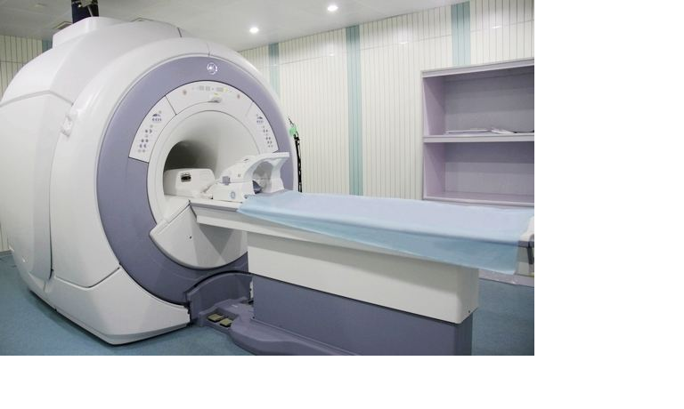
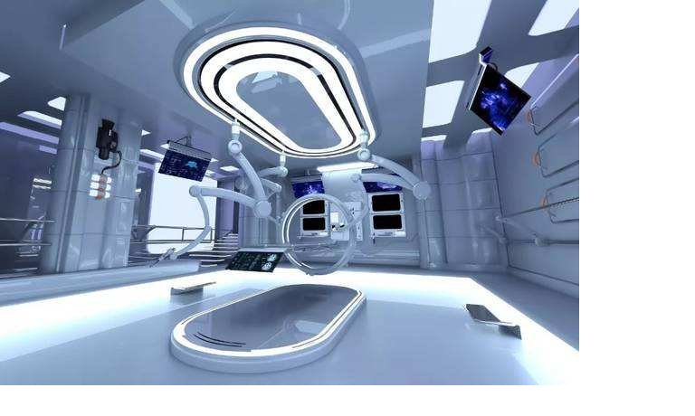
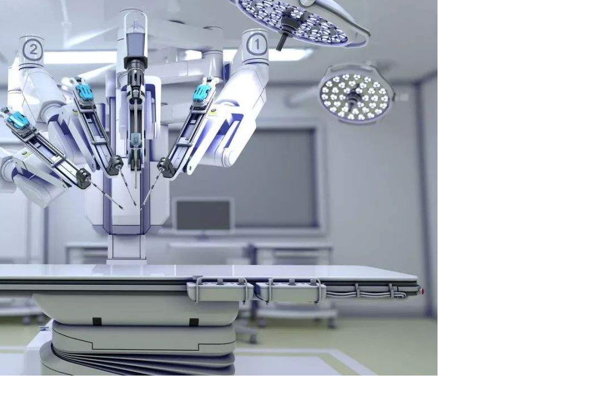

介绍外星人的人工信息场扫描治病方法
===================================

作者张祥前交流微信zhxq1105974776

我是安徽庐江县的一个农民，1985年到一个高度发达的星球上旅行了一个月时间。这里给大家介绍一下这个星球上主要的治病方法-----人工信息场扫描技术。

这个可以为我们地球人的治病方法提供参考，如果运气好，本人有幸被社会重视的话，至少使地球人少在黑暗中摸索几百年。

外星人的身体主要分两种，一种是由光线组成的、没有肉体的虚拟人，这些虚拟人因为没有身体，所以，不存在肉体上的疾病，但是，存在着一些特殊的精神类疾病，类似于一种电脑病毒。

外星人另一种是肉体人，和我们地球人一样，一开始也是进化而来的，只是后来他们科技发展到一定程度的时候，才可以制造自己的身体。他们的肉体身体，即使是自己制造的，尽管各种先进科技设计、保障，仍然是要生病的。\ |核磁共振.png|

在他们还不会自己制造自己身体的时候，他们的人也是脊椎动物，也是血液循环，和我们地球人非常的相似，所以他们那时候的治病方法可以为我们们地球人提供参考。

他们已经可以达到长生不老的目标，不过，他们的长生不老方法是，把人的思想意识用一种人工场装置扫描下来，用数字表示，然后安装在一个他们自己制造的人身上，他们有能力制造一种没有自我意识的人的身体。

外星人的长生不老并不是吃了什么仙丹，也不是冷冻保存身体。就是换人的身体，保留思想意识，因为一个人的核心是思想意识，而身体是次要的。

他们一直到现在，有些疾病仍然不能够彻底治好，也就是说，在某种情况下彻底治好一个人的病难于造出一个人来，这个可能很多地球人都不相信。

人工信息场扫描技术可以根治癌症、高血压、糖尿病、老年痴呆等各种疾病，也可以根治其他任何疾病，还包括传染病和外伤，也是治疗精神类疾病的主要手段。也可以减肥、美容和塑造人的体型，改善人的体质等。\ |信息场扫描.png|

它具有两大特点是：一是快【彻底治愈一种疾病甚至可以控制在一秒之内】，二是彻底。

人工信息场扫描技术治疗疾病，需要人工信息场扫描发生器这个硬件，还需要软件，就是控制人工信息场扫描发生器如何工作的计算机程序。软件是围绕硬件设计的。

人工信息场扫描发生器是什么？是什么工作原理？

外星人的人工信息场扫描发生器如同一个房屋那样巨大，中间是一个滚筒，为人治病的时候，病人躺在里面接受人工信息场360度无死角的逐点扫描。\ |核磁共振2.png|

人工信息场向外发射一种无形物质---人工场，那么人工场到底是什么呢？

我们知道，自然界的场主要是电磁场和万有引力场【又叫引力场】和核力场，引力场作用范围广，对物体有穿透性，对任何物体都有作用力，但是，力量比较弱。

电磁场力强大，但是对物体穿透性差，作用范围短，并且只是对有些东西感兴趣，有些东西不感兴趣，对不感兴趣的东西作用力几乎为零。

人类一旦破译了场的本质【百度统一场论6版，介绍了场的本质】，就可以制造出一种具有引力场通吃【就是对什么物体都有作用力】、电磁场力量强大双重特点的人工制造的场----人工场。人工场在电子计算机程序的控制下工作，这个就叫人工信息场。

人工信息场发生器具有以下功能：可以精密切割、搬运、冷焊接、组合、局部加热、局部冷冻----，可以改变物体所处局部空间的时空状态，可以使物体激发起来，处于零质量激发状态。

物体一旦处于零质量激发状态或者接近于零的准激发状态，就可以以光速运动，还可以两个刚体无损坏穿越对方，比如可以使人穿墙而过，并且人和水泥钢筋墙都完好无损。

人工信息场还可以在物体内部瞬移，可以把物体内部的东西以光速瞬间移走，而不破坏物体的外表和结构。就是可以在密封的环境下把东西移走，不破坏密封环境。比如在不开刀的情况下可以把人体内部任何东西瞬间移走。

这种人工场可以隔空取物。对人做手术的时候，就不要开肠破肚了，通过计算机控制场扫描机器，可以精确的对人体内部进行手术。其基本原理是人工场照射使物体处于零质量的激发状态【或者接近为零的准激发状态】。

人工场在计算机程序的控制下，可以精确的把分子、原子那么小的物体识别、分类移走。\ |治病是场扫描.png|

可以高速识别、批量高速移走物体。比如说可以以极高的速度【可以达到光速】一个一个分子的来移走物体。

对于人工信息场发生器治病的软件，人们可以相应的开发出胃癌的治疗程序，肝癌的治疗程序、鼻咽癌的治疗程序，----也可以开发出高血压、糖尿病、关节炎、老年痴呆症等慢性病的治疗程序。治好这些病人，只要花一些电费而已。

人工信息场可以对人体内部进行及其精确的三维立体逐点扫描，可以帮助人们诊断疾病，开发出治疗各种疾病的软件。

比如，一个胃癌病人进入人工场扫描装置里面，人工信息场输入病人患有胃癌信息，人工场扫描装置启动胃癌治疗程序，首先扫描人体内部，确定人的胃癌癌细胞的位置。

然后启动程序：清除这个人体内所有胃癌癌细胞。

刹那间，人体内所有胃癌癌细胞被清除，人就迅速康复。

我们知道，一个人癌症从开始到结束，要十几年、甚至几十年时间，如果再有癌细胞出现，用人工信息场再一次扫描一次就可以了。

早期这个星球上的人工信息场为人治病就是这样的，不过，清除癌细胞后，还要启动一个程序，就是修复因为癌细胞对人体的伤害。

无论是清除癌细胞还是修复癌细胞对人体的伤害，都是一秒种不到，所以，人工信息场治病的高效一开始就震撼了这个星球上所有的人。

开始，对人体不同的疾病，这个星球人开发出不同的治疗程序，有高血压、高血糖、高血脂的治疗程序，有各种癌症的治疗程序，有老年痴呆、各种传染病、外伤等各种治疗程序。

一般是病人主叙说自己那里不舒服，人工信息场自动扫描，自动判断，自动启动程序治疗，

发展到以后，病人都不需要说话了，人工信息场高速扫描人体，就可以自己发现问题，自己处理问题。

他们现在的星球每一个人都有两大网络自动跟踪服务，一个是全球公众信息网，相当于我们地球的互联网。另一个是全球公众运动网，这个我们地球没有，全球公众运动网可以实现人员和不大的物品在全球范围内高速搬运。

这个星球上早期人工信息场为病人治病的时候，医生就在附近通过计算机虚拟屏幕【没有实物的、由场扫描技术实现】来观察人工信息场对人体扫描获取的人体信息，观察人工信息场对人体治病情况，必要时候做出终止、干预或者改变治疗方案。\ |治病的场扫描1.png|

他们经过反复改进，现在统统没有这个不要了，全程交给了人工信息场扫描装置。

他们用人工信息场治病，有趣的是从治疗胆结石、肾结石开始的。

他们早期发明了人工信息场扫描技术，对人体进行扫描，
只要在计算机屏幕上把人体内的胆结石、肾结石画一个圈子，计算机出现问话：

是不是要清除画圈内物体？

你只要点是就可以了，刹那间人体内结石就没有了。

由于这样的程序最简单的，
所以人工信息场早期为人治病，主要就是治疗各种结石，清除人体血液中及其他地方的垃圾，清除各种血栓，清除人体异物、良性肿瘤等。

所以，人工信息场大规模为人治病从此拉开序幕。

有一段时间里，这个星球人对未来治病方法是摇摆不定，有人赞成人工信息场为未来治病主流方向，有人反对。

但是，正是在治疗各种结石中，人工信息场显示出强大的力量，高速、干净、彻底。这样刺激了这个星球的科学家，大家疯狂的投入力量研发人工信息场治病技术。

很快，人们研制了驱逐人体传染病的各种细菌、病毒的程序，计算机上按一下，人体内细菌、病毒一秒种不到就清除了，强大的治疗效果震撼了这个星球每一个人，没有人再怀疑人工信息场的强大力量。

不久，像高血糖、高血压、老年痴呆等这些疾病的治疗程序也逐渐完善，这个星球真正的进入了无药物时代。

早期，这个星球上人工信息场对人体内部局部地区输送营养物质，来达到快速治愈病人的目的。但是，随着这个星球的科技高速发达，治病追求更快速度，一切疾病治疗的时间都控制在一秒内，这些输送营养物质到人体内部的事情就逐渐没有了。

现在，这个星球上人们是时刻可以在在人工信息场扫描下接受检查，早早发现人体的疾病苗头。

人工信息场扫尾工程是治疗人的各种精神疾病，彻底解决了这些问题，这个星球上人工信息场治病的研发告一段落。

这个星球人工信息场治病的研发过程，投入的金钱是天文数字。没有惊人付出就没有惊人回报。

我们地球人提出各种治病的新方案，很多都是想花微小代价获得理想效果，特别是中国人的中医，总是想在自然界找一些动物、植物制成药，就想包治百病，都是在自己骗自己，实际都是行不通的设想。

单纯的吃药最终也是走到了尽头，你把自然界所有物质随意组合，很多疾病仍然无能为力。

美国的计算化学，开创了寻找有效药物的先河，找到了许多有效的新药，但是，进一步开发新药困难重重。

地球人现在必须要转变思路。

人工信息场这种治病原理，决定了人工信息场发射器设备庞大复杂，造价高昂。所需要的软件也是非常复杂，开发费用更是高昂。

但是，对病人治疗起来却很简单，病人躺在人工信息场发生器中，如同核磁共振那样庞大的机器中间，人工信息场扫描器连续的对病人照射一段时间，若干次后，病人不受痛苦就康复了。所花的成本也就是电费而已。

虽然人工信息场发生器设备造价高昂，软件开发费用高昂，需要全世界许多科学家的合作努力，但是一旦设备造出来，软件开发成功，对病人治病的效率极高，而且是彻底治愈病人，可以说，人工信息场治病是人类划时代的进步。\ |人工场扫描.png|

那时候，由于治病速度太快，又非常彻底，一个国家只要几个医院就足够了。

人工信息场治病的本质就是把人体各部分信息化、数字化，标准化，使用计算机程序为人治病。这个如同人类掌握了一把极其微小、精确、可以高速运转的手术刀。这个也是我们地球人未来治病方式的必然趋势。

人类对干细胞的研究，对基因的研究，对人身体奥秘的探索，在人工场治病时代，体现在控制人工场计算机软件上，可以帮助人们设计更加有效的治病程序，不能说这种探索没有用处。

但是，对于癌症、传染病之类，的确人类不需要特别清楚这些疾病起源的本质，就可以利用人工场强大的清除能力，刹那间把癌细胞、细菌、病毒清除出人身体外，从而达到治愈的目的。

其实，当今人类在癌症面前束手无策，就应该意识到，必须要转变观念，药物手段对癌症效果微弱，也可以说，就是把自然界所有物质随意的组合，也可能找不到对癌症非常有效的药物。

人类现在不自觉的已经在使用天然的人工信息场了，那就是气功，气功对人治病原理和以上是类似的。只是人类对其本质不清楚，气功手段仍然是微弱的，一旦人类搞清楚这一切，征服癌症、高血压之类强大的武器----人工信息场扫描才会出现。

人工信息场不但是征服癌症的强大武器，也是征服像高血压、心脏病、慢性肾炎、糖尿病、老年呆症症------这些慢性衰退性疾病以及传染病、其他疾病的强有力武器。

就是外伤，用人工信息场照射，也可以大大的缩短伤口愈合时间。对于美容和减肥，雕塑体型，有了人工信息场发生器，人们才可以真正的随心所欲。

人工场扫描技术还可以改善人的体质，使80岁的人具有20岁人的体质。

人工信息场最终发展的结果是什么？----是人脑和电脑、互联网的对接。

一旦人脑和互联网对接起来，可以高速的向人大脑输入信息，方便人的学习，提高人学习知识的速度和质量，现代有的人一生中学习的时间甚至超过了劳动的时间。

人工信息场还可以改变人的不良情绪和性格，可以快速彻底的治愈某些人的精神疾病和精神痛苦。可以读取人大脑中的思想意识。

一旦可以读取人大脑中意识，就可以复制、储层人的思想意识，这一点很重要，只要能够向人脑输入信息，能够把人的思想意识从人大脑中读取出来数字化，储层在电脑中，等到人类的科技发展到一定程度，就可以把一个人的完整意识输入到某一个人造生物体上，人就可以复活，这样人类就可以长生不老。

其实人的核心是思想意识，人的身体是次要的，只是一个载体而已。

但是，用什么东西向人大脑输入、读取信息？电流肯定不行，因为电流能够破坏人的大脑结构。X光也是不行的，电磁波和普通光都有破坏性，像电磁波、光子、射线、超声波等，深入到人身体和大脑内部，都会不同程度的破坏人体组织。都不能够在无损害的情况下深入人的大脑内部记录信息。

由于缺乏理想的工具，人脑和电脑的对接目前人类只是设想，还没有到实质研发阶段。但是，随着统一场论的出现，人类掌握了人工场这种工具，人类和电脑的对接可以变成现实。

统一场论揭开了场的本质之谜，场是人脑和电脑对接最理想的也是唯一的工具。

自然界中场是无形物质，可以深入到任何物体的内部，并且可以对物体几乎是不产生任何影响。场可以深入到人的大脑中，在对人脑毫无影响的情况下准确扫描记录人的思想意识信息，反过来场也可以把信息输入、安装在人的大脑中，而且丝毫不影响人的大脑功能。

我们地球上怎么能够开发出人工信息场扫描装置？

第一步，揭开电磁场和引力场的本质，指出电磁场和引力场满足什么数学关系。

这个工作我已经完成了。

第二步，实验验证变化电磁场产生正、反引力场。

第三步，开发人工信息场扫描装置的硬件。

第四步，开发出伺候人工信息场扫描的软件。

完成以上步骤，人工信息场扫描技术就可以为人类治病和服务了。

人工场扫描科技属于基础科学的突破，人工场是一种基础动力源头，可以取代电的应用。人工场扫描还可以在信息、交通、宇航、能源、建筑、工业制造等领域发挥强大作用。

但是，基础科学的突破是不容易的，现在如果有一个人宣传自己造出一个什么惊人的产品，可以解决什么重大问题，-----这个基本上是不可能的，现在重大、惊人的，改变人类历史的科学成果，必须要许多人、多学科的合作，单打独斗的时代过去了。

网上有很多人说：

“你张祥前你自己凭一个人力量造出人工信息场为人治病，我们就相信你。”

“你自己就生了肺结核、糖尿病，你说人工信息场治病那么神奇，为什么不用人工信息场为你自己治病？”

这些傻B言论，如同说，爱因斯坦，你一个人造出原子弹我们就相信你的相对论。

张祥前所起的作用是：知道人类未来治病的方向，知道怎么制造人工场这种硬件。在还没有造出这个人工信息场扫描硬件，怎么为人治病？如果我已经有了人工场扫描这个设备，我就可以为人治病了，我用得着在网上宣传吗？

那些什么都不用，说凭自己一张嘴、一双手就可以为人治百病，那是大神、大仙，不是科学。

科学只是一种通用方法，一旦被人掌握了，人人都可以用，而且对每一个人都适用。

