揭秘电荷、电磁场的本质之谜
================================
作者张祥前交流微信zhxq1105974776

作者格言：人类的知识是小岛，无知是海洋。

作者座右铭：认真做学问，拒绝胡扯。

本文大写字母为矢量，

本文只描述真空中质点的运动情况，不描述形状物体在介质中的运动情况。

本文出现的质点概念，是我们为了描述物体在空间中运动的方便，不考虑物体的形状和线长度，把物体理想化，看成一个点，称为质点。

本文中如果要讨论质点的体积和几何长度是没有意义的，因为违反了我们的约定。

统一场论【百度统一场论6版可以搜到】认为场的本质是物体周围以圆柱状螺旋式运动的空间，场是我们观察者对空间本身运动的描述。

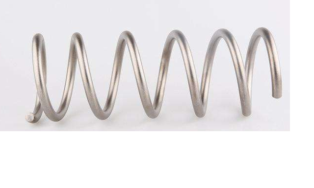

为了揭开电荷和电磁场的本质，我们首先要预备一些基础知识。

一，基本原理：

宇宙由空间和物体组成，其余统统不存在，其余都是我们观察者对物体运动和空间本身运动的描述。

 二，基本假设：

相对于我们观察者，宇宙中任何物体周围空间都以光速、以物体为中心向四周辐射式运动。

空间以正电荷为中心，以光速辐射式向四周无限远处扩散运动。

空间从四面八方、从无限远处、以光速向负电荷收敛运动。

 

三，如何描述空间本身的运动？

我们把空间分割成许多小块，每一个小块叫空间几何点，简称几何点，几何点走过的轨迹叫几何线，通过描述几何点、几何线的运动，就可以描述空间本身的运动。

 四，空间为什么要运动？

   物理是我们人对几何的描述。

所以，物理上任何一个现象，总是有对应的几何形态。

物理上的运动现象对应着几何中的垂直状态。

几何中的空间三维垂直状态【就是过空间中任意一点可以作三条相互垂直的线段】，经过我们人的描述，就是物理上的运动状态。

任何一个处于空间三维垂直状态中的几何点所在的位置，相对于我们观测者一定要运动，并且不断变化的运动方向和走过的轨迹又可以重新构成一个垂直状态。 

运动方向不断变化【暗示着运动是连续的】肯定是曲线运动，常见的曲线运动有圆周和椭圆、抛物线、双曲线等。

在质点相对于我们观察者静止的情况下，质点周围空间的运动的分布应该是均匀的，不会有那一个方向是特殊的。所以，合理的看法是几何点是圆周运动，不会是椭圆或者抛物线、双曲线等其他形式的运动。

由于空间是三维的，几何点的圆周运动不会局限在一个平面上，合理的看法是在平面的垂直方向上延伸。

所以，任意一个质点o点，在我们观察者看来，o点外空间任意一个几何点p总是以圆柱状螺旋式【就是旋转运动和旋转平面垂直的直线运动的叠加】在运动。

 

五，时间的物理定义：

宇宙中任何物体【包括我们观察者的身体】周围都以光速度C【这里的C是矢量光速，统一场论中矢量光速C的模c是标量光速，c不变，而C的方向可以变化】，辐射式运动，空间这种运动给我们观察者的感觉就是时间。

借助于几何点的概念，可以认为时间与观察者周围空间几何点以光速c走过的路程成正比。

 六，时空同一化方程：

|    由于时间t与几何点以光速c运动的空间位移R成正比，所以： 
|     R(t) =ct【r】= xi+yj + zk 
|    【r】是矢量R的单位矢量，i，j ，k 分别为沿x,y,z轴的单位矢量。
|     如果认为光速c在某种情况下可以为矢量【用大写字母C表示，矢量光速方向可以变化，模c不变】，则： 
|     R(t) =Ct= xi+ yj + zk 
|     r² = c²t² = x²+y² + z²

| 七，三维螺旋时空方程 
|     以相对于我们静止的质点o为原点建立笛卡尔直角坐标系oxyz，oxyz中任意一个几何点p，在时刻t’从o点出发，经过一段时间t后，在t”时刻到达p点所在的位置x,y,z， x,y,z是时间t的函数，由o点指向p点的失径为R（数量为r） 。 
|      R(t) = (x,y,z,t) 

     R(t) = (a sinωt)J + (bcosωt)l + Ct

     ω为角速度，J和L是单位矢量。

o点静止时候，由于周围空间均匀性，在空间中任意一个曲面上有多少条几何线穿过，就有多少条几何线穿进来，所以几何点的旋转运动消失，也就是：

     (a sinωt)J + (bcosωt)L = 0

     这个如同磁场的高斯定理，

| 八，场的定义。 
|      相对于我们观察者，由质点指向周围空间中任意一个空间几何点的位移矢量随空间位置变化或者随时间变化，这样的空间称为场，也可以叫物理力场，或者叫物理矢量场。

以上是电场、磁场、引力场、核力场4大场的统一定义。

由于场是空间本身的运动，所以有，场在曲线上的分布，场在曲面上的分布，场在三维立体上的分布。

我们要认识到，同一个场，比如，电场在曲线上的分布和曲线上的分布，是不能直接相加或者相剪减的。但是，一个电荷周围曲线上分布的电场有可能和曲面上发布的磁场直接相加或者相减。原因磁场可以看成电场的变化形式，而电场也可以看成是磁场的变化形式。

九，引力场的几何定义。

      统一场论认为引力场是母场，电场、磁场、核力场都是引力场变化而来的。所以，我们在这里首先定义引力场。

    设想某一处空间中，有一个质点o相对于我们观测者静止，o点周围空间中任意一个空间几何点p在零时刻以光速度C从o点出发，沿某一个方向运动，经历了时间t，在t'时刻到达p所在的位置，让点o处于直角坐标系xyzo的原点，由o点指向p点的矢径为R =
C t =  x i+ y j + z k 

     R是空间位置x，y，z的函数，随x，y，z的变化而变化，记为：

     R = R（x,y,z,）。

     我们以 R = Ct中R的长度r为半径作高斯球面s =
4πr²【内接球体体积为4πr³/3】包围质点o。

      o点周围的引力场A表示o点周围在体积4πr³/3内有n条几何点的位移矢量R =
Ct，

     A = k g n R /（4πr³/3） 

     k为比例常数。 g为万有引力常数。

     而质点o的质量m就表示在高斯球面s =
4πr²【内接球体体积为4πr³/3】内，包含几何点矢量位移R =
Ct的条数n和立体角度4π的比值。

     m = 3 k n /4π

    这样,以上的引力场方程A = k g n R /（4πr³/3） 可以写为：

      A = g m R  /r³ 

    以上引入的质量方程m = 3k n
/4π中角度是常数4π，实际上角度可以是变量，在0和4π之间变化，n和m都可以是变量，质量方程仍然成立。

   我们引入立体角Ω概念，把质量方程 m = 3k n /4π写成普遍形式：

   m = k n /Ω = k  dn / dΩ

   相应的有比较普遍的引力场方程：

   A = g m R /r³ = g k n R/Ωr³

   相应的高斯面为s = Ωr²

 十，电荷和电场的定义。

      质点o如果带有电荷q，在周围产生电场E，电场的实质反映了单位时间内、单位体积内o点周围空间以光速运动的运动量,和引力场比较起来就是多了时间因素。

    在质点o周围空间中，引力场A = g m R /r³ = g k n
R/Ω r³中质量m随时间t变化产生电场：

 E = k’(dA/dt）

 = k’g(dm/dt) R/r³

  = k’g[k d(n/Ω)/ dt] R / r³

      g，k’和k为常数。而o点的电荷q表示单位时间内o点质量的变化量，也反映了在单位时间里o点周围光速运动空间几何点越过某一个界面的位移的条数。

     q = 4π ε。k’g(dm/dt)

    = 4π ε。k’g [k d(n/Ω)/ dt]

    ε。为真空中介电常数。

    以上是电荷的几何定义方程，4π,  g,  ε。, k’，k都是常数，合并常数，把上式带入式 E
= k’g(dm/dt)R/r³中可以导出库伦定理中的电场强度方程：

 E = q R/ 4πε。r³

 

十一，电荷、电场的几何模型

 统一场论中认定了粒子带有电荷是因为粒子周围空间本身时刻以柱状螺旋式运动造成的。

    我们知道柱状螺旋式运动是旋转运动和旋转平面垂直方向直线运动的合成。

    粒子带有正电荷产生正电场是由于粒子周围空间直线运动部分相对于我们观察者，以粒子为中心以光速辐射式向四周发散运动造成的。

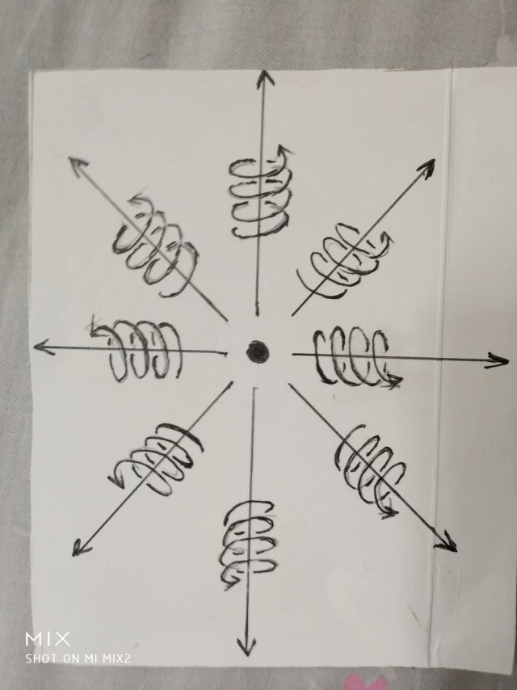

粒子带有负电荷产生负电场，是由于粒子周围空间从四面八方、以光速、从无限远处的空间向粒子汇聚而来造成的。

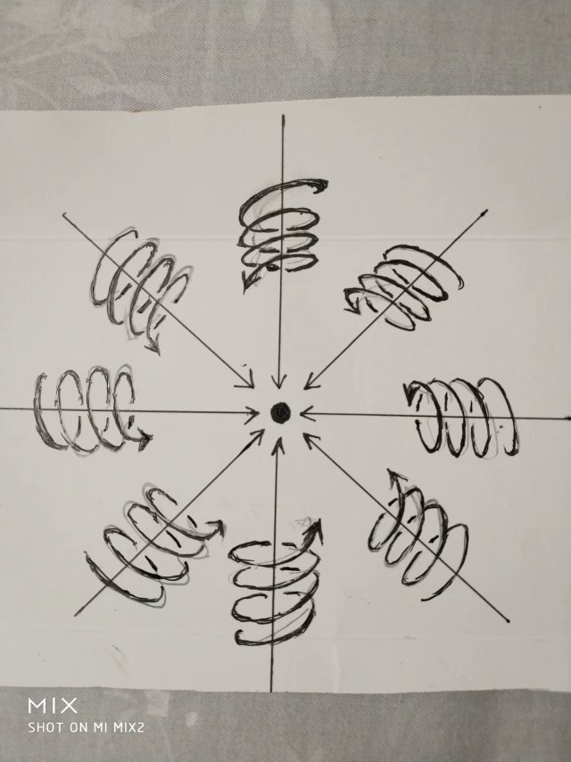

      带电粒子周围空间柱状螺旋式是粒子带电的原因，我们知道柱状螺旋式运动是旋转运动和旋转平面垂直方向直线运动的叠加，对于带电粒子周围空间的旋转运动部分，我们可以用右手定则来说明。

  我们在正点电荷周围作许多由正电荷指向周围空间的射线，我们用右手握住其中任意一条射线，并且大拇指和射线方向一致，则四指环绕方向就是正点电荷周围空间的旋转方向。

我们在负点电荷周围作许多由任意空间指向负电荷的射线，我们用右手手握住其中任意一条射线，并且大拇指和射线方向一致，则四指环绕方向就是负点电荷周围空间的旋转方向。

面对我们观察者，正电荷周围空间是逆时针旋转的。

面对我们观察者，负电荷周围空间是顺时针旋转的。

我们所要注意的是无论是正电荷还是负电荷，周围空间都是右手螺旋空间，就是我们用右手握住空间运动的直线部分，四指环绕方向就是空间的旋转运动方向。

  十二，解释电荷的相对论不变性

    由以上电荷的几何定义方程 q = 4π ε。g  k’(d m
/dt)我们很容易解释电荷的相对论不变性，解释电荷不随速度变化的原因。

当质点o以速度V相对于我们运动的时候，质量m增大了一个相对论因子√（1-
v²/c²）【这个统一场论也有证明】，用m’表示静止质量。

而时间dt由于时间的相对论性膨胀效应会随着速度V增大一个相对论因子√（1-
v²/c²），用dt’表示静止参考系的一段时间。

这样m和dt都增大一个相对论因子√（1- v²/c²），结果d m
/dt不随速度V而变化，而4πε。g k’都是常数，所以q不随速度V变化。

由相对论中质速关系m = m’ / √（1- v²/c²）和洛伦茨变换中时间变换式t = (t’
+ x v/c²)/ √（1- v²/c²）可以得到：

dm/dt = [dm’/√（1- v²/c²）] / [ dt’/ √（1- v²/c²）]

= dm’/dt’

 十三，电荷、电场与高斯定理。

 利用场论中的高斯定理可以更加清楚的刻画电荷、电场的几何形式。

在前面的电场几何方程中，电荷o点带有电荷量q = g(dm/dt)，在周围空间p处产生的电场E【由o指向p的矢径为R】为：

    E = k’g(dm/dt) R/r³

  = k’g[k d(n/Ω) / dt] R / r³

  令R = r【R】，上式可以写为：

  E = k’g [k d(n/Ω) / dt] r【R】 / r³

    = k’ g [k  (d/dt)  n ] 【R】 / Ω r²

   上式中k’，g，k都是常数，【R】为沿R方向的单位矢量，r是矢量R的数量。

    当我们只是考虑以上方程中n和Ωr²相对应变化的时候，有方程：

    E = k’g [k  (d/dt)  dn ] 【R】 / dΩ r²

  令dΩ r² 为矢量面元 dS，有下式：

E = k’g k （d/ dt）dn 【R】/ds

单位矢量【R】和矢量面元dS【dS的数量为ds】的方向一致，这样有：

    E · dS   = k’g k （d/ dt） dn

    注意dS、E的方向和【R】是一致的，把上式两边在高斯球面上包围积分，结果为：

   E · dS = k’g k （d/ dt） n =  q/ε。

    n为高斯球面s = 4πr²上穿过的矢量R =
Ct总的条数。把上式在直角笛卡尔坐标xyzo上展开，设E 在坐标上x，y，z的三个分量分别为Ex, Ey, Ez 。

    矢量面元dS的分量dydz i, dxdz j , dydx k ，由高斯定理得：

   ∫∫∫v（∂Ex/∂x + ∂Ey/∂y + ∂Ez/∂xz ）dv

 =∫∫s Ex dydz +Ey  dxdz + Ez  dydx  

 = k’g k （d/ dt） n = q/ε。

   上式直接的物理意义是：

    方程∫∫s（Ex dydz  ）+（Ey dxdz）+（Ez dydx） =  k’g k （d/
dt） n 告诉我们，电场可以表示为单位时间内、单位面积s上垂直穿过几何线的条数。

    而方程∫∫∫v（∂Ex/∂x + ∂Ey/∂y + ∂Ez/∂xz ）dv =  k’g k （d/
dt） n告诉我们，在运动变化的空间中，电场也可以表示为单位时间内高斯球面内接球体积v内包含的运动几何点的位移量。

    当这个体积v发生很微小的变化，变化的部分可以看成是v的界面，可以用曲面s表示，在v上电场的分布情况可以保留在s上，由v上的电场分布情况可以求出s上的电场分布。

   这个意味着电场是物体周围空间相对于我们观察者以光速连续向外辐射运动所表现出的一种性质。

   把上式用散度概念表示，设o点的电荷和包围o点的高斯曲面s内体积v的之比为u, 当我们考察s和v趋于无限小的情况下，则式

    q/ε。=E·dS =∫∫s Ex dydz +Ey dxdz + Ez dydx

    可以表示为：

    ·E = u/ ε。             

   上式表示在单位时间内、体积v内包围了运动的几何点的位移线R =
Ct的条数反映了质点o电荷的大小。

   如果有许多空间几何点连续不断的从无限远处越过高斯曲面s垂直穿进来，汇聚到o点，形成许多几何点的位移线，则这些位移线的条数反映了o点是负电荷，反之是正电荷。

    

十四、导出库仑定律。

库仑定律表述如下：

相对于我们观察者，真空中两个静止的点电荷q(电量为q1)q’（电量为q2）之间的作用力F和他们的电量的乘积成正比，和他们之间的距离r 的平方成反比，作用力的方向在它们之间的连线上。

电荷有正有负，同号电荷相互排斥，异号电荷相互吸引。

   数学公式为;

   F = (k q1 q2/r²)【R】

  = q1 q2 R/4πε。r³

   其中k为比例常数，ε。为真空中的介电常数 ,
r是矢量R的数量，【R】是沿R的单位矢量。

   库仑定律是实验总结出的定律，统一场论可以对其做出解释。

   以前面的点电荷o点为例，按照前面“电荷、电场的几何定义”，当o点相对于我们观察者静止，它具有电量q1，是指o电荷周围【也就是在立体角度4π内】单位时间t内产生了n条几何点的位移矢量R
= Ct。

   q1 = k n /4πt

   k为常数，o点在周围产生的电场E为：

    E = q1 R/4π ε。r³

   当o点附近突然的出现另一个电荷o’点，它具有电量q2指o’电荷周围【也就是在立体角度4π内】单位时间t内产生了n’条几何点的位移矢量R
= Ct。

    q2 = k n’ /4πt

   o’点的出现，使o点周围本来的空间运动的运动状态发生变化,也就是o’点使o点周围的电场E
= k n R/4πr³t发生变化。

   如果我们观察者静止于o点，站在o点处观察，把o点受到o’点的库伦电场力F理解为o’使o点周围【也就是在立体4π范围内】在t 时间内n’条【为什么是n’条，因为o’点周围有n’条电场线】电场矢量E发生变化。

   这样，F与电场E的变化量n’E成正比，与4π、t成反比。

   F = 常数乘以n’E/4πt

    = 常数乘以n’q1 R/4πε。r³4πt

    由于常数乘n’/4πt = q2

   这样我们就得到了库伦定理  F  = q1 q2 R/4πε。r³

 

十五、从统一场论导出磁场是电场相对论效应。

   统一场论给出了动力学方程

   F = dP/dt = Cdm/dt - Vdm/dt + mdC/dt - mdV/dt

中，m是粒子的质量，C是矢量光速，V是粒子运动速度，t是时间，P =
m（C-V）是粒子的总动量。

   上式中(C- V)dm/dt =  Cdm/dt
- Vdm/dt是质量随时间变化的力，简称加质量力，统一场论认为本质上就是电磁场力，其中Cdm/dt 是电场力，Vdm/dt是磁场力，

按照统一场论的看法，以上的o点静止的时候，具有静止质量m’，如果受到了别的电荷的电场作用，受到的静电场力可以表示为：

F静 = C’dm’/dt’，

    当o点【运动质量为m】相对于我们以速度V沿着x轴运动的时候，沿V平行方向受到了电场力

   Fx = C’x  dm’/dt’，

数量式为

 fx = c dm’/dt’，

c是标量光速，

注意，t和t’是不一样的。

   沿V垂直方向方向，受到了电场力

Fy = C’y dm’/dt’， 

数量式为fy = [ √（c² － v²）] dm’/dt’，

 Fz = Cz’ dm’/dt’，

 数量式为fz = [ √（c² － v²）] dm’/dt’，

  以上结论和相对论力的变换是一致的。v是V的标量，f是力F的标量。

   我们还可以求出电场的相对论变换。

   令γ = 1/√（1 -
v²/c²），o点以速度V相对于我们观察者运动，沿V垂直方向，o点受到的电场力可以写为

   f =【 c√（1- v ²/ c²）】dm/dt

    = γ 【 c√（1- v ²/ c²）】【 √（1- v ²/ c²）】dm/dt

   = (1- v ²/ c²)γc dm/dt，

   =(γc dm/dt) – (v ²/ c²)γc dm/dt

   当o点相对于我们以速度V运动的时候，以上的γc
dm/dt被认为是o点受到的电场【用E(数量为e）表示】力， (v ²/ c²)γc
dm/d可以认为是受到了磁场【用B表示】力【由电场变换而来的】。

    用qe【矢量为qE】表示电场力γc dm/dt，则磁场力(v ²/ c²)γc
dm/d为qe(v ²/ c²)

    如果我们认为电荷o受到的磁场力归结以下三个因素：

    1，  与o的电量q成正比。

    2，  与o的运动速度v成正比。

    3，  与o受到的磁场B的作用成正比。

    则B的大小应该等于e/c²乘以速度v，由于v和e（矢量用E表示）相垂直时候B值最大，所以应该是叉乘，也就是：

    B = V ×E /c²

    以上告诉我们加质量力和电磁场力都满足于相对论变换，这个是证明了加质量力就是电磁场力的一个强有力的证据，也表示相对论和统一场论的在磁场是电场相对论效应上看法是一致的。

 

十六，磁场的几何形式方程。

    前面分析指出，随时间变化的引力场产生电场。人类已经发现，带电粒子相对于我们观察者以速度V运动的时候，可以引起V垂直方向上电场的变化，电场变化的部分我们可以认为就是磁场，也就是随速度变化的电场产生了磁场，统一场论继承这种看法。

    设想一个相对于我们观察者静止的o点，质量为m，带有电荷q，在周围空间p处产生了静电场E，由o点指向p点的矢径为R，我们以R的长度r为半径作一个高斯面s
= 4πr²【内接球体体积为4π r³】包围o点，则：

     E = q R/4π ε。r³ 

    = k( dm/dt)R/4π ε。r³

    k是常数。

     当o点相对于我们以速度V运动的时候，可以引起电场E的变化，变化的部分我们可以认为是磁场B。

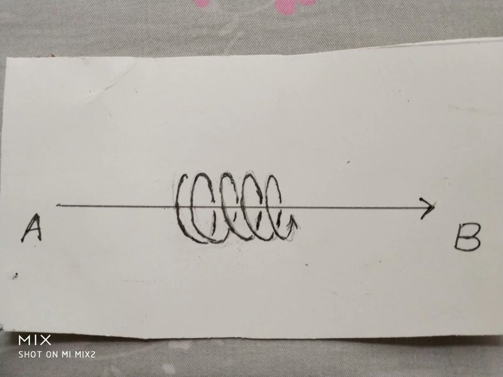

   上图告诉我们，电荷由左向右运动，产生了环绕形状的磁场，并且满足于右手螺旋。

很简单的想法是电场E乘以速度V就是磁场B ，由于速度V和电场E相互垂直时候，产生的磁场最大，因而它们之间是叉乘，所以有以下关系，

    B = 常数乘以（V ×E）

    由电场E的几何形式方程 E = q R/4π ε。r³ =  k( dm/dt)R/4π
ε。r³，可以求出磁场B 的几何形式方程，

B = 常数乘以【V ×（q R/4π ε。r³）】 

= 常数乘以【V ×k( dm/dt)R/4π ε。r³】

   合并常数，以上与磁场B相关的常数用磁导率μ表示，由于我们这里讨论的是在真空情况下，所以用真空磁导率μ。表示。

    B = μ。【V ×k( dm/dt)R/4π r³】

    以上就是真空中磁场的几何形式方程。这个方程和电场、磁场相互关系满足的方程 B
= V ×E /c²是紧密联系在一起的。

    B = μ。【V ×k( dm/dt)R/4π r³】

    = μ。【V ×（q R/4π r³）】

     = μ。【V ×ε。（q R/4π ε。r³）】

     = μ。ε。【V ×（q R/4π ε。r³）】

     = μ。ε。（V ×E）

    在电磁学中，认为真空中磁导率μ。和真空中介电常数ε。的乘积是真空中光速c的平方的倒数【这个是人为规定的】，所以以上方程可以写为：

     B = V ×E /c²

    以上方程反映了电场和磁场的基本关系。从这个方程加上时空同一化方程r² = c²t² = x²+y²
+ z²可以导出麦克斯韦方程中变化磁场产生电场、变化电场产生磁场。

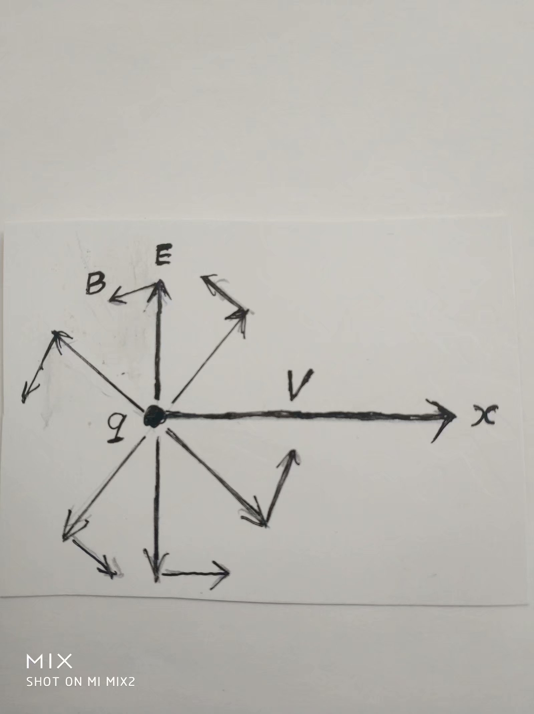

   注意，以上的磁场和运动电场都没有考虑相对论效应，只是在V很小或者等于零的情况下成立。

    在静电场方程中乘以Ψ就是普遍的运动电场形式，Ψ 为相对论效应修正相,

     Ψ = （1- v²/c²）/【√[1- (v²/c²)sin²θ] 】³

其中θ为R和x轴的夹角。电场方程乘以相对论修正相Ψ，不影响d电场和磁场之间的关系。

 |图形解释电磁场的本质1|

 十七，磁单极子不存在。

     统一场论认为，一个相对于我们静止的带电粒子O点，在周围空间产生静电场，当O点相对于我们观察者以速度v匀速直线运动，可以产生磁场，这个磁场的本质就是空间以矢量速度v为轴心在旋转。

    当O点以匀速圆周运动时候，空间的旋转运动在这个圆周的正反两个面上一进一出，进的一面是S极，出来的一面叫N极。

    从磁场这种几何形式来看，自然界不存在有磁单极子的。

 

    十八，解释麦克斯韦方程中位移电流假设。  

    麦克斯韦方程组中电场E变化产生了磁场B   

（ B·dL） =μ。I + (1/c²) ∂ Φe /∂ t  = [μ。I + （1/c²）（∂ E/dt ）·∂ S)]
 

    以上方程表示运动的电荷μ。I【也就是电流，安培环路定理中电流项】可以产生磁场，真空中变化的电场（1/c²）（∂ E/dt ）·∂ S)也可以产生磁场【即麦克斯韦位移电流假设】。    

麦克斯韦位移电流假设表示了：

在真空中，点电荷周围电场的变化和磁场之间的对应关系，电荷匀速直线运动可以产生环绕速度轴分布的磁场。

而安培环路定理表示了：

在电路中，许多点电荷运动产生的变化电场和磁场之间的关系，我们应该看到，麦克斯韦位移电流假设是基本的，安培定理只是推广。    

   本文描述的是质点在真空中的运动情况，不考虑形状物体在介质中运动情况，所以，略去μ。I这一项，也就是略去安培项，重点解释：

(B·dL) = （∂/∂t ） （ E·∂S)/c²

以上方程认为，在某一个时刻，在点电荷o附近某处自由空间中【不存在其他电流的情况下】的任意一个p点处，在空间曲面上变化的电场E可以产生环绕线状磁场B，且满足关系式    

    (B·dL) = （∂/∂t ） （ E·∂S)/c²

    以上c是光速，dS为矢量面元，t 为时间，∂是偏微分的意思。L是沿B方向的几何环绕线量，方程左边是环路线积分，右边是左边线路包围的面积分，积分范围0角度到2π。  

   我们知道，速度包含了时间，随速度变化意味着肯定随时间变化，所以，应该可以从相对论中磁场、电场基本关系式B
=V×E/
c²导出麦克斯韦的变化电场产生磁场的位移电流假设，也可以导出法拉第电磁感应方程，下面分别来给出推导过程。  

   相对论认为，一个点电荷o相对于我们以速度V运动的时候，在周围空间p点处产生了电场E和磁场B，并且满足以下关系：B
= V×E /c²   

    我们将方程B = V×E
/c²两边点乘一个微小的空间长度矢量∂L（方向和B同向时候，B·∂L的值为最大）, 结果为：

    B· ∂L =（V×E /c²）·∂L = (1/ c²)（∂U×E/∂t）· ∂L= (1/ c²∂t) E ·
(∂L× ∂U)

    注意∂U /∂t =
V由于∂L和∂U相互垂直时候，相乘数值最大，因而（∂L× ∂U)可以看成一个矢量面元∂S
= ∂L×∂U， ∂S的方向和E一致的时候，E·(∂L× ∂U)的值最大。这样

    B· ∂L = (1/ c²∂t) E · ∂S

    如果我们将方程 B · ∂L =(1/ c²∂t)E
· ∂S 两边的变矢量微分求环量积分，环量积分范围从0到2π

    B·∂L = (1/c²∂t)E· ∂S方程右边的矢量面元∂S
=(∂L× ∂U) 积分后变成了一个分布在三维空间中的曲面，方程左边的变矢量微分∂L环绕一周积分后为右边空间曲面的边界线。

     B· dL = ∂/∂t （ E
· ∂S)/c²左边取环绕一周的线积分，右边取环绕一周的面积分，两个积分区域是相同的，都是角度从0开始到2π结束，因而对方程两边的空间变量求环路积分，等式仍然成立

    B·∂L = (1/c² ∂t)  （E·∂S）

   这个就是麦克斯韦位移电流假设。

   注意，式（ B
· ∂L） =  1/c² ∂t（E· ∂S)中积分B·∂L是沿B的环绕方向的线积分， E·∂S是电场E在三维空间曲面上的分布, 可以认为磁场B在L上的分布【也就是（B·∂L）】就是电场E在三维空间曲面上的分布因曲面变化而产生的圆周边界线上的分布。

十九，解释法拉第电场感应原理

   （E·∂R） = －∂Φb /∂t = （- ∂ B /∂t）· ∂S 

   这个方程也就是法拉第的电磁感应原理。

   由磁场和电场基本关系式B = V×C/ c²，得到：B = (∂U/∂t)×E/ c ²

   在统一场论中认为，时间是空间以光速运动造成的，有时空方程：R = R(t) =
Ct = x i+ y j + z k 标量式为r ² =c²t²

   r是高斯面s = 4 π r²【r等于矢量R的长度】的半径, 这样有：

   B = (∂U/∂t)×E/ (∂r/∂t) ²

   B (∂r)²/∂t = ∂U×E

   B (∂R· ∂R)/∂t = ∂U×E

   将方程两边点乘单位矢量N,

   N·[B(dR· dR) )]/∂t = N ·（ ∂U×E）

   由于高斯面s=4πr²是以r为半径，以光速c扩大，因而在(∂r)²= ∂R· ∂R很小的情况下，可以把(∂r)²可以看成是高斯面其中的微小一部分，用矢量面元∂S【数量为∂s】表示，则：

   N·（B ∂s)/∂t = N·（ ∂U×E）B· ∂S/∂t = N·（ ∂U×E）

   以上用矢量面元∂S表示微小面积∂s，面元∂S的方向和N一致，由矢量运算公式，以上方程右边可以写为E·（ ∂U×
N），因此有下两个式子：

   B· ∂S/∂t = E·（∂U× N）

   B· ∂S/∂t = - E·（N×∂U）

   用线矢量∂L表示N×∂U，则上两式为式为：

   B· ∂S/∂t = E·∂L

   B· ∂S/∂t = - E·∂L

   这两个式子我们选哪一个？

   在统一场论中，电荷o点的质量为m，带有电荷q = k
dm/dt【k为常数】在周围空间p处产生的磁场B的几何方程为：B =Ψ【μ。ε。(k
dm/dt)R×V/4πε。r³】Ψ 为相对论效应修正相.

   并且Ψ = （1-
v²/c²）/【√[1-(v²/c²)sin²θ] 】³，其中θ为R和x轴的夹角。由于1/c²
=μ。ε。，所以

  B =Ψ【μ。ε。(k dm/dt)R×V/4πε。r³】

   可以写为：

   B =Ψ【 (kdm/dt c²)R×V/4πε。r³】

   由统一场论的时空方程R = Ct,上式可以为：B =Ψ【 (k m )d【R】×V/ c
4πε。r³】【R】为沿R的单位矢量，V/ c的数量式v/
c在统一场论可以表示为cosθ,由于cosθ的微分为-sinθ,所以应该取B·∂S/∂t = -
E·∂L

   上式两边是微分式，两边取环绕积分，积分范围都是从0到2π，得到法拉第电磁感应方程:

   -（B · ∂S）/dt = E·∂L

   由斯托克斯定理，上式可以改写为微分式：

   ×E = ( - ∂ B /∂t) ·∂S

   注意，式-（B · ∂S）/∂t =
E·∂L右边是环绕一周的线积分，左边是面积分，右边的环绕一周的线积分可以看成是左边的面积分的边界线，一个开放的曲面，面积发生变化时候，变化量无限微小，可以看成是这个开放曲面的边界线。法拉第电磁感应原理表示了磁场在空间曲面上的分布发生变化，可以表示为这个曲面边界线上电场的分布。

二，磁场为什么同极相斥、异极相吸？

作者张祥前交流微信zhxq1105974776

人类发现，有的物体带有磁性，磁性物体在周围空间产生磁场，而磁场具有N极和S极。

两个磁体相互靠近的时候，同性相斥，异性相吸引？这个是什么原因呢？

现代科学只能够在一定程度上给出猜测，本文深入一步，彻底解释这个现象。

本文只是简单解释这个现象，特别是避开大量数学运算，感兴趣的网友可以百度
“统一场论6版”获得详细数学论证过程。

磁场是电荷运动形成的，我们首先画出电荷的几何模型。

正负电荷都是周围空间以圆柱状螺旋式运动产生的。

粒子带有正电荷、产生正电场，是由于粒子周围空间圆柱状螺旋式运动的直线运动部分，相对于我们观察者，以粒子为中心、以光速向四周发散运动造成的。

电磁场的本质就是光速运动的空间。

我们在正点电荷周围作许多由正电荷指向周围空间的射线，我们用右手握住其中任意一条射线，并且大拇指和射线方向一致，则四指环绕方向就是正点电荷周围空间的旋转方向。

面对我们观察者，正电荷周围空间是逆时针旋转的。

.. image:: media/image8.png
   :alt: 正电荷
   :width: 5.76111in
   :height: 6.43611in

正电荷周围空间的运动

粒子带有负电荷、产生负电场，是由于粒子周围空间从四面八方、以光速、从无限远处的空间向粒子汇聚而来造成的。

我们在负点电荷周围作许多由任意空间指向负电荷的射线，我们用右手手握住其中任意一条射线，并且大拇指和射线方向一致，则四指环绕方向就是负点电荷周围空间的旋转方向。

面对我们观察者，负电荷周围空间是顺时针旋转的。

但是，我们要注意，正电荷、负电荷周围空间的圆柱状螺旋式运动都满足于右手螺旋。

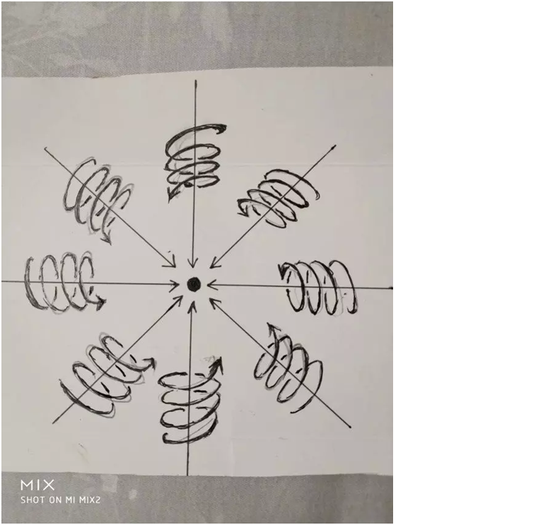

负电荷周围空间的运动

设想一个点电荷q以速度V【本文大写字母为矢量】沿着笛卡尔坐标系的x轴正方向前进。

速度V能够引起V垂直方向的电场E的变化，电场变化的部分我们叫磁场B，人类发现B可以定义为：

B = E×V/c²

上式中c是光速，c²因为是常数，可以设定为1，是无关紧要的。

上式表示，B ，E，V满足叉乘关系，相互垂直的时候，B值为最大。

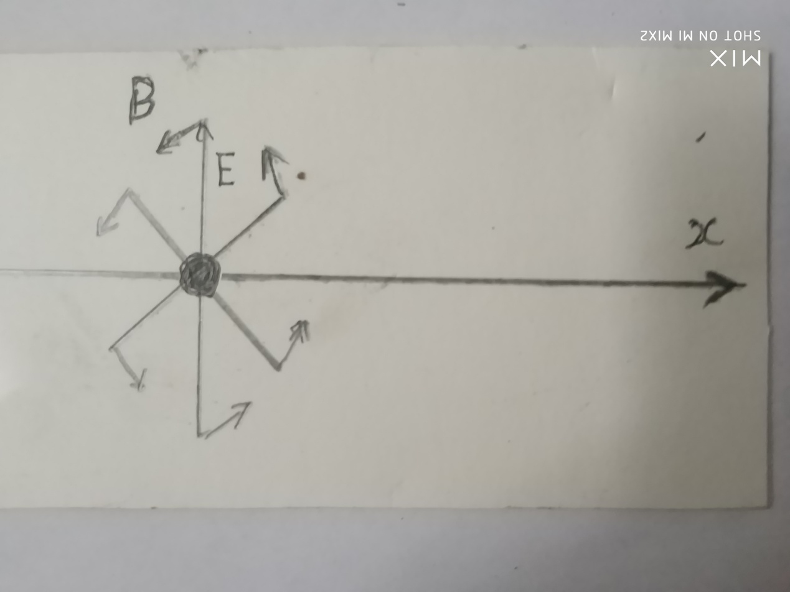

上图可以看出许多个像E的电场线，因为随着电荷运动速度V而变化，产生的磁场B有许多条，合在一起，是一个环绕状。所以，磁场是环绕形状的，如下图：

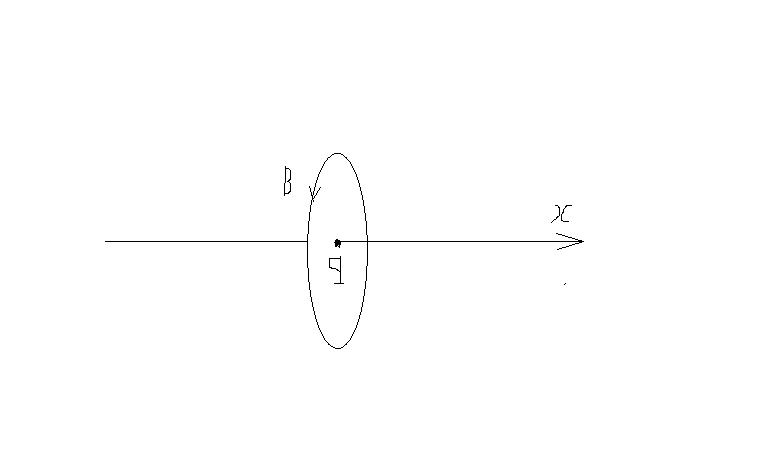

两个通电导线，电流方向相同，周围空间旋转方向相同，在相互接触地方，由于旋转方向相反而使空间量的减少，这样两根导线有相互接触趋势，表现为相互吸引。

如下图：

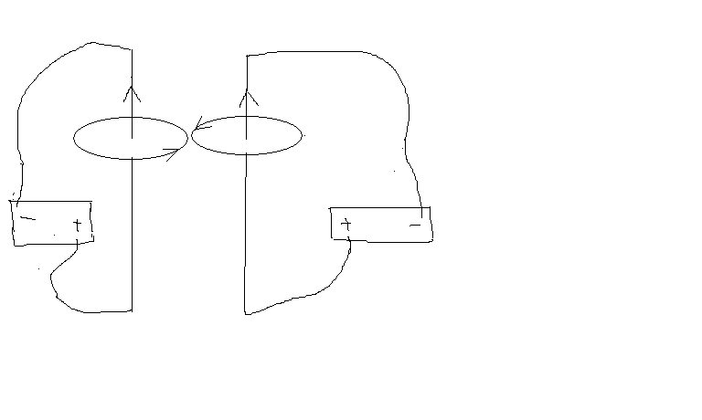

如果两个导线电流方向相反，周围空间的旋转在相互接触部分，因为运动方向相同，这样两个导线之间空间量增加，有相互离开的趋势，表现为相互排斥。

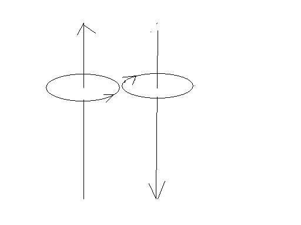

当我们将导线弯曲成圆周，磁场的旋转从这个圆周的一面进去，从圆周的反面出来，进去的一面叫S极，出来的一面叫N极。

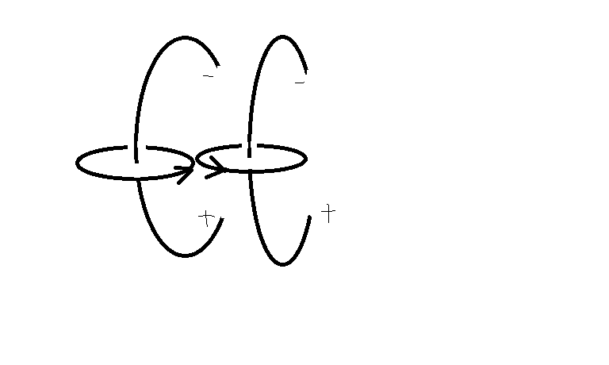

N极和S极的相互吸引，原因是以上空间旋转方向相反而抵消，空间因为抵消而减少，空间距离的减少表现为相互吸引。

N极对N极的排斥，S极对S极的排斥，原因就是以上空间旋转方向相同使空间量增加，而表现为相互排斥。\ |圆周运动电荷的磁场12.png|

三，正负电荷为什么能够相互抵消？

作者张祥前

美国物理学家富兰克林世界上第一次发现电荷有正、负两种。电荷为什么会有正电荷、负电荷？等量的负电荷和正电荷碰到一起，电荷为什么会相互抵消为零？

这些问题悬在人类头上几百年了，人类都没有能力回答。

我是安徽庐江县的一个农民，初中水平，1985年夏天去一个高度发达的外星球生活了一个月的时间。不但了解了他们日常生活情况，还掌握了他们许多超前的科学技术和宇宙奥秘。

我们来看看外星人是怎么解释以上问题的。

外星人认为物体粒子带有电荷、电场，是因为物体周围空间以圆柱状螺旋式运动形成的。

注意，是空间本身的运动，不是说别的东西在运动。

这种圆柱状螺旋式运动，在物体粒子周围不是只有一条，而是分布了很多条，以物体粒子为中心，以光速向四周均匀发散运动。

我们知道，圆柱状螺旋式运动，是沿一个平面做圆周运动，并且在圆周平面垂直方向又做直线运动。

简单的说，就是圆周运动和圆周平面垂直方向的直线运动的叠加。

正电荷周围空间的直线运动部分是以光速向四周发散的，速度是光速。

.. image:: media/image8.png
   :alt: 正电荷.png
   :width: 5.76875in
   :height: 6.44514in

负电荷周围空间是从无限远处向负电荷汇聚，速度也是光速。

无论是正电荷还是负电荷，周围的圆柱状螺旋式运动，都满足于右手螺旋，就是我们用右手握住这个圆柱状螺旋，四指环绕方向和圆柱状螺旋式旋转方向一致，则大拇指指向和圆柱状螺旋式中直线方向一致。

我们还要注意一点，就是一个电荷相对于我们观察者静止，周围的空间旋转运动全部累加起来，会相互抵消为零。

但是，对于我们仅仅只考察其中一条螺旋运动线时候，这个旋转运动仍然是存在的。

我们还要认识到，旋转运动的相互抵消为零，和本来不存在旋转运动是有很大的区别，不能将二者混为一谈。

那么，静止正电荷和负电荷周围空间的旋转运动会相互抵消为零，这个可以用数学严格证明吗？

答案是可以的，证明和磁场的高斯定理类似，就是用一个微小曲面dS去截圆柱状螺旋式运动的旋转线，在一个有限的、大小确定的曲面上，有多少条旋转线进去，就一定会有多少条旋转线出来，二者相互抵消为零。把dS遍及物体粒子周围全部积分，总结果是零。

两个等量的正负电荷碰到一起，为什么电荷会相互抵消为零？

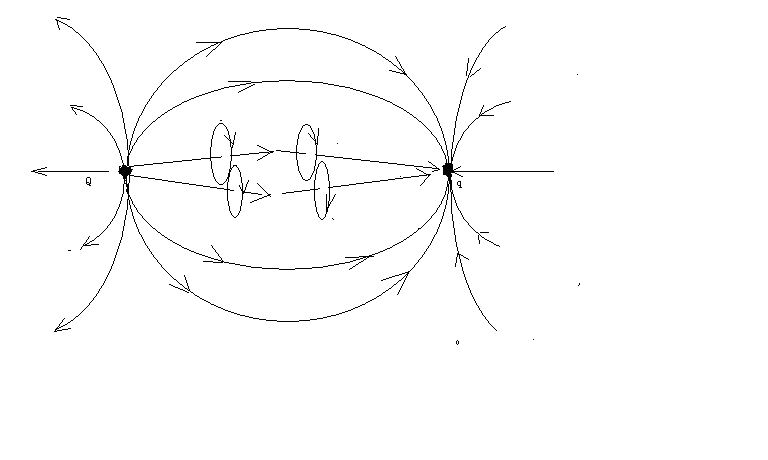

上图中，正电荷Q和负电荷q带了等量的电荷。

电荷周围的空间螺旋式运动直线部分以光速从正电荷Q出发，运动到负电荷q结束，空间的旋转部分，也是从正电荷Q出发，运动到负电荷q结束。

旋转部分相互接触地方由于旋转方向相反而相互抵消。这样正电荷和负之间的周围空间减少，有相互接触的趋势，表现为相互吸引。

一旦正电荷和负电荷非常接近，周围的直线运动由于方向相反而相互抵消，旋转运动也由于方向相反而抵消。

这个就是正电荷、负电荷碰到一起，电荷能够相互抵消的原因。

一个正电子和一个负电子，带着相同的电量，相互碰到一起，会使电荷相互抵消，而激发为光子，这种原因形成的光子是这样的一种模型：

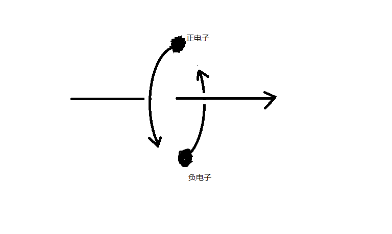

就是两个电子，始终保持着直线对称状态，共同绕一个轴心旋转，并且沿轴心的运动速度是光速。如上图。

光子的运动也是右手螺旋式。

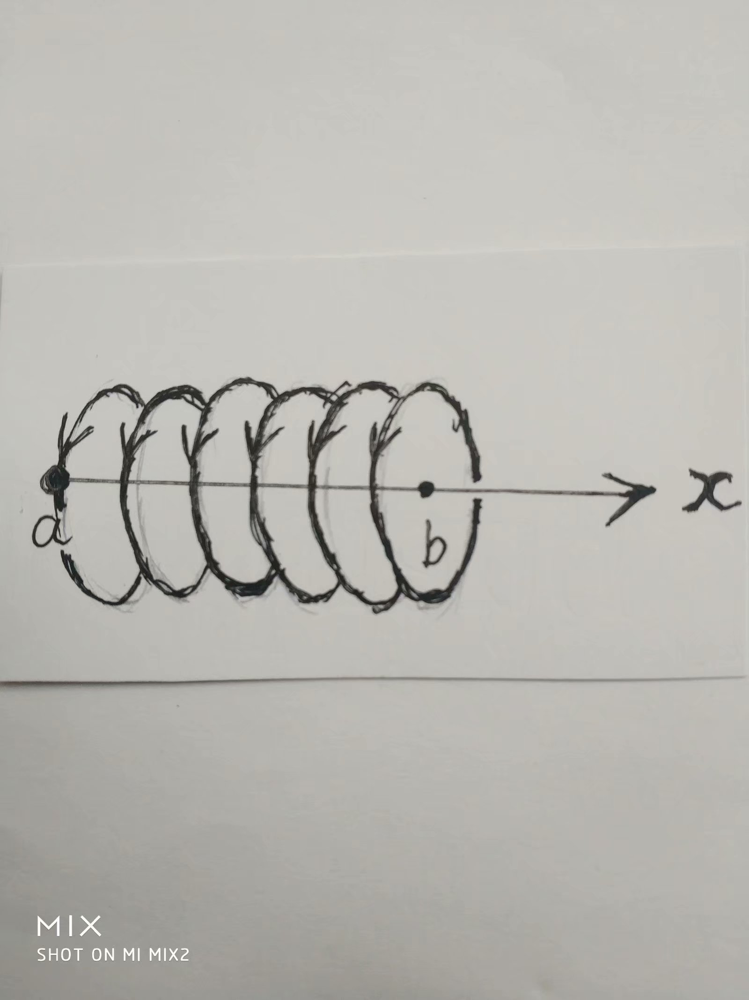
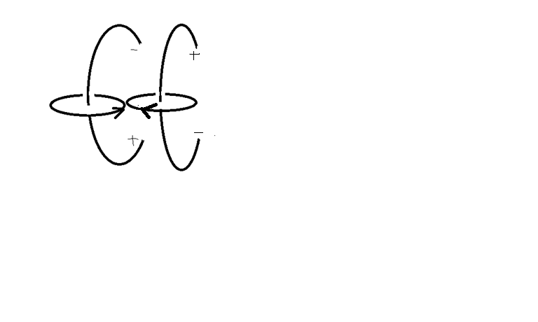
