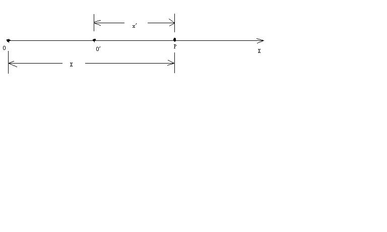
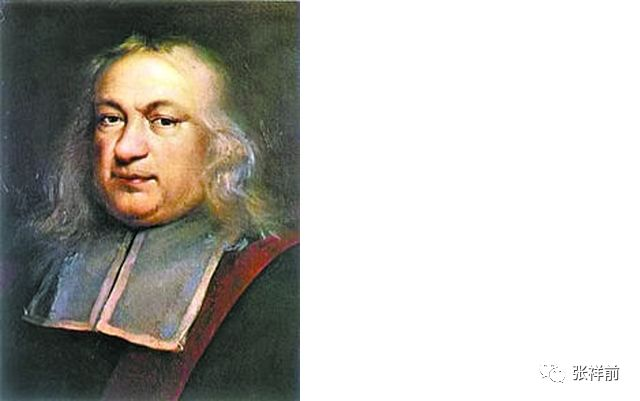

揭秘时间的本质和里面隐藏的奥秘
=============================

作者张祥前交流微信18714815159

本人在1985年夏天去一个高度发达的外星球旅行了一个月时间，不但了解了他们的日常生活情况，还掌握了他们许多超前的科学技术，以及与宇宙核心秘密有关的方程。

在外星球上，外星人曾经对我说，

“我们会让你参观我们星球许多地方，你将有许多奇妙的经历，会增加许多你们地球上没有的知识，得不到的阅历，丰富你的人生，当你回到地球，这些经历会改变你的命运，你将成为你们地球上的名人、富人。

······

你将成为改变你们地球命运的关键人物，未来会有许多人崇拜你······一直到你们的地球人在宇宙中消失之前，都会有无数人一直记住你的名字。

因为在你们地球上，你将是第一个知道时间秘密的人。在宇宙中，有许多高度发达的文明星球，无论是在哪一个星球上，第一个知道时间本质的人，是所有著名科学家中真正的王者，都会被当做神来崇拜，一直到他们的文明从他们的星球上消失的那一天，都不会被人忘记。

为什么会是这样？

因为时间的本质是宇宙最核心的秘密，破译时间的本质，其重要性是无与伦比的，可以引起整个星球剧烈的变革，任何一个科学发现都无法与之相比······。

虽然你是从我们这儿得到了时间的本质秘密，不是你自己的努力思考得来的，但是，不妨碍你仍然毫无悬念的成为你们地球上第一个知道时间秘密的人。你们地球人可能并不关心你是怎么得到时间的秘密的，未来，你可能只是凭运气，在你们地球上被当做神一样的存在。”

从外星人这种看法中，可以知道，如果一个人单单知道了时间的本质，就是一个不得了的最重大科学发现。

我们地球上目前科学家仍然不知道时间的本质，可能大家很好

奇，时间的本质到底是什么？为什么人类一旦知道了时间的本质，就会对整个人类造成剧烈的影响？外星人又是怎么对时间下定义的？

本文一步一步来揭开时间神秘的面纱。

第一章，时间到底是什么？

时间和空间看不见，摸不着，但是，我们从经验中知道，时间和空间一样，无处不在，你无论如何躲不开时间和空间。

时间的本质到底是什么？千百年来许多科学家和哲学家喋喋不休的说了无数遍，也没有一个定论。

时间在物理学中是个基本但又不容易定义的概念，如果我们问一问，时间到底是什么？恐怕这个世界任何一个物理学家都不好回答。

1 5 0 0 年前的北非希波主教圣•奥古斯丁说过这样的话：

“至于时间是什么？如果没有人问我，我知道,
如果我想要向询问者加以说明，我便不知道”。

这个家伙说的是要无赖的话，意思大概是时间是什么这个问题只能意会却不能言传。

很多哲学家、物理学家将时间与运动相联系在一起。
比如柏拉图认为：时间是运动着的永恒的形象。

| 亚里斯多德说：只有当我们已经把握住运动时，才能领悟时间。
| 马克思、恩格斯指出：时间是一种客观的存在，是运动着物质存在的一种形式。

爱因斯坦也说过：

| “时间实际上是钟的读数，这个钟可以是地球的转动，沙漏、脉搏的计数，地球沉积的厚度、辐射衰变的产物、或铯原子振动的计量，他们具有一种共同的标准，都是自然的机械装置。”
| 但也有一些哲学家、物理学家给时间下的定义很古怪，比如：
  洛克说：时间是一切存在的公共尺度。

康德说：时间是感性直观的纯形式。

法国哲学家柏格森坚持认为时间是人的直觉和神秘的“创造性的破裂。”这句话很是让人摸不着头脑。

也有很多哲学家、物理学家，比如贝克莱，休漠，马赫都倾向将时间归于人的意识的一种表现。

相比之下，哲学家黑格尔给时间下的定义很简单：

时间只不过是我们人对过去的一种回忆而已。

| 但就是这最简单的定义，又是最接近正确的答案。
| 时间有很多原因让人捉摸不定。
  我们在生理上和心理上的经验上，都能感到时间在流逝，可是，如果时间流逝的速度是多少，每秒钟流过多少？这显然是一个荒谬的问题，时间的流逝速度要有一个超时间的东西加以衡量，但这个超时间本身也在流逝，那就要有一个超超时间加以衡量……如此等等，以至无穷。

时间本身是不是一个随时间变化的过程这一问题，往往把人们的思维引入一个无法摆脱的恶性循环中。

时间在逻辑上要加以证明也历来出现麻烦，历来的逻辑学家们往往对时间怀有特殊憎恶的心情。

比如说我们要定义" 过去" ，可以把" 现在" 作为参照系，但又怎么定义" 现在"
呢？如果用" 过去" 定义" 现在" ，那又是同意反复，如果用" 现在"
本身定义着自己，又陷入循环定义的矛盾之中。

此外，我们从经验上认识到，过去可以视为不可改变的，决定了的，但要在逻辑上，或者根据某些规律，却无法说明过去为什么是决定了的、不可改变的？

难怪哲学家怀特海无限感慨地说：“要对时间这个大自然的创造过程加以沉思而不痛感人类知识的有限，实不可能！”

人类对时间的认识是一个漫长的过程，早期几乎所有的物理学家和哲学家，认识时间都是从直觉出发。

因为从逻辑、理性出发，去说时间是什么，实在是狗子咬刺猬---无处下牙，无从谈起，时间是看不见、摸不着，可是又实实在在的存在着，实在是不好分析。

一直到牛顿，才认真的考虑时间到底是什么？

牛顿认为：" 绝对的、真实的数学时间就其本质而论，是自行均匀地流逝的，与任何外界的事物无关。"

在牛顿看来，时间就像一条川流不息、永远不变的河流。

牛顿说这个话，他不认为这个是自己独立思考的，什么新的发现，他只是用严谨的语言，把当时大部分人对时间显然是如此的认识给严格的表述出来。

牛顿时代及牛顿后期的物理学家和哲学家，很多人把时间看成只是一个与运动本身无关的参数，认为时间只是滴滴答在走的闹钟。

大家设定一个熟悉的、标准的运动【比如闹钟指针的转动，太阳、月球的运动】作为时钟，拿一个标准的运动形式来参考其他运动的运动量、及运动程度。

没有人认为运动会影响到对时间的测量。

比如，许多运动员参加赛跑比赛，大家【连同裁判】都带着手表，并且走时都是一样的，没有人想到运动员的跑步会影响到时间的测量。

但是，爱因斯坦想到了，爱因斯坦的的相对论认为观察者的运动会对空间和时间的测量产生影响。相互运动的观察者，测量同一个事件所经历的时间是不一样的，

相对论把时间和空间紧密的联系在一起。相对论强调空间每一个点对应一个时刻。强调了你的时间和我的时间是不一样的。

但是，相对论没有给时间下一个精确的物理定义，所以，相对论对时间的认识是不够彻底的。

实际上，时间的本质和光速不变是紧密的捆绑在一起，你一旦知道了时间的物理定义，立即就明白了光速为什么不变。

由于相对论没有给时间下一个物理定义，所以无法解释光速为什么不变，相对论只是把光速不变认定为一个事实，对牛顿力学展开了修改。

这篇文章给大家一个全新的、精确的、彻底的时间物理定义。为了获得可靠、精确的结果，这篇文章使用数学分析，来定性、定量的分析时间的本质。并且用时间的物理定义来解释光速为什么不变，反过来就可以证明这个时间的物理定义是正确的。

首先我们提出以下基本认识。

对于生活在这个自然界中，我们所观察到的各种东西和各种现象那可真是五花八门、形形色色复杂到了极点。但是仔细一分析，可以把他们分为两大类，一类为物、一类为事。

像我们眼前的一座山、一棵树、一个人、一条河……这些都是物；人的思想，河水的流动，树的生长……这些都是事，是“物”相对于我们观测者运动所表现出的一种性质。

外星人关于宇宙最基本法则是：

宇宙是由物体和它周围空间构成的，不存在第三种与之并存的东西，其余都是我们观察者对物体运动和物体周围空间本身运动的描述。

除物体和空间外，其余一切物理概念，像时间、场、质量、电荷、光速、力、动量、能量、-----都是物体在空间中运动【或者物体周围空间本身的运动】相对于我们观测者所表现出的一种性质，都是运动形成的，因而与位移有关，可以认为时间、场、质量、电荷、光速、力、动量、能量------都是空间位移的函数，都可以用空间位移来表示。

在物理概念中，像声音、颜色、力、温度这些物理概念是物体在空间中运动触及到我们观测者，引起了我们观察者的感觉，我们观测者对这些感觉加以分析、概括而形成的。

宇宙中只有物体和空间这两件东西是“物”，其余的都是“事”。一切物理现象都是“事”，是我们观察者描述出来的。

时间也只是一种现象，时间也应该属于" 事"
的范畴，因而我们不能把它看作是一个物体那样具体存在的东西，也不能够把它看成是物体的组成部分。

时间来源于物体相对于我们观察者运动，或者物体周围空间相对于我们过程中的运动，给我们观察者的一种感觉，它是不能脱离我们人而独立地存在着。

一句话，时间也只是人的一种感觉而已。没有人、没有观察者，不存在时间。

为了进一步认识时间的本质，获得精确的时间的物理定义，时间这个物理概念也可以这样认为：

时间是某某物体在它周围空间运动，或者这个物体周围空间本身的运动，引起我们人的一种感觉。

接下来我们要搞清楚两个问题，第一个问题：

什么物体在空间中运动，或者什么物体周围空间运动引起我们有了时间的感觉？

第二问题是：

这个东西是以什么方式在它周围空间运动的？

是什么物体在它周围空间运动才使我们观测者具有时间的感觉？这个物体是我们赖以生活的地球吗？当宇航员登上月球他们仍然具有时间的感觉。这个物体同样的道理不会是恒星和太阳。

也许会有人认为：

会不会是宇宙中很多物体共同影响我们观测者，才使我们有了时间的感觉，仔细地分析一下，这个看法也是靠不住的，让我们做个假想实验，答案将一目了然。

设想：现在用宇宙飞船把一个人从地球上接走，送到一个距离我们几百亿亿亿光年远的某处空间区域里，在这处空间区域里，没有一个物体，别的星球离这儿都非常非常遥远。

宇宙飞船把这个人送到这里丢下后立即返回，而在这种情况下，我们可以设想这个人仍然具有时间的感觉，在他心中时间仍然是一分一秒地在走。

根据我们前面的看法，他获得时间的感觉起因是某某物体在空间中运动，或者某某物体周围空间本身的运动。

而在这种情况下，这个物体只有这个人的身体而已。又由于这个人的身体相对于这个人是静止的，因此，唯一合理的看法则是：

时间是观测者周围空间以某种方式在运动变化，给人的一种感受。

第二章，时间严格的物理定义和时空同一化方程

时间严格的物理定义，与矢量光速有密切关系。

在统一场论【百度统一场论6版可以搜到】中，把光速扩展到矢量，矢量光速C【模为c，本文大写字母为矢量，下同】方向可以随时间t、光源速度、观察者运动速度而变化。

C = 标量光速c乘以单位矢量N。

标量光速c不随时间t、不随观察者运动速度、光源运动速度而变化。

统一场论中时间严格的物理定义为：

宇宙中任何物体【包括我们观察者的身体】相对于我们观察者静止的时候，周围空间都以物体为中心、以矢量光速向四周发散运动，空间这种运动给我们人的感觉就是时间。

宇宙任何一个物体，其周围空间真实的运动是以圆柱状螺旋式发散运动，如下图：

当物体相对于我们静止的时候，周围空间的旋转运动相互抵消为零，剩下的就是光速直线发散运动。这个严格的证明，和磁场的散度为零类似。

由以上的时间的物理定义，可以认为：

时间与观测者周围空间以光速移动的路程成正比。

这里认定物体周围空间是以光速运动，原因是可以解释光速，隐含了假设的成分。

我们习惯了粒子在空间中的运动，空间本身的运动我们如何去描述？

我们可以把三维空间分割成许多小块，每一个小块叫几何点。我们通过描述这些几何点的运动，就可以描述出空间本身的运动。

借助几何点的概念，可以认为：

时间与我们观察者周围空间一个几何点p在零时刻，从我们观察者所在的地方，以矢量光速C，经历了时间t走过的路程R成正比。

由此得出时空同一化方程：

R(t) = Ct= xi+ yj + zk

i,j,k分别是沿x轴、y轴、z轴的单位矢量。标量形式为：

r² = c²t²= x²+y² + z²

这个方程可以认为是时空同一化方程。

以上的时间物理定义，同时又定义了光速，光速反映了时空同一性，反映了空间和时间是同一个起源，是由于我们观察者不知道时间的本质就是光速运动的空间，把光速运动空间用时间这个名词给表述出来。

在统一场论中，时空同一化方程对应于相对论时空相对性方程。

第三章，用时间的物理定义解释洛伦茨变换中的光速不变

狭义相对论中的光速不变是指：

光源在静止时候所发出的光，相对于我们观察者是每秒30万公里。

当这个光源相对于我们观察者以某一个速度沿着某一个方向匀速直线运动的时候，其发出的光相对于我们观察者仍然是每秒30万公里。

洛伦茨变换是狭义相对论的核心和基础，而光速不变是洛伦茨变换的主要依据。

光速为什么不变？相对论没有回答，相对论只是把光速不变作为一个事实，展开推理，然后对牛顿力学进行修改。

本文认为，光速不变与时间的本质紧密的联系在一起，你一旦知道了时间的本质，就立即明白光速为什么不变。

下面我们通过一个假设，来给时间下一个物理定义，通过时间的物理定义来解释光速为什么不变。

首先我们给出相对论中洛伦茨变换的推导过程。

设有两个直角惯性坐标系s系和s'系，任意一事件发生的地点在s系、s'系中的时空坐标分别为（x，y，z，t）、（x'，y'，z'，t'）。

在洛伦茨变换中y = y'，z = z'，为了简单所见，我们现在主要考虑x, t,和x',
t'之间的变换。

在下图中，x轴和x'相互重合，在t'= t =0时刻，s系的原点o
点和s’的原点o’点相互重合在一起。随后，o’点相对于o点以速率v沿x轴正方向运动。

我们来求出由两个坐标系测出的在某时刻发生在x轴上P点的一个事件（例如一次爆炸）的两套坐标值之间的关系。

在s'系中测量，发生在P点的爆炸的空间、时间的坐标分别为x',
t'，也就是说爆炸是发生在t'时刻，发生的地点是在x'轴上离原点o'距离为x'处。

在s系中测量，发生在P点的爆炸的空间、时间的坐标分别为x,
t，也就是说爆炸是发生在t时刻，发生的地点是在x轴上离原点o距离为x处。

在上图中，可以直观的看出

x'= x –vt

x = x'+ vt'

按照伽利略相对性原理的思想，时间、空间长度的测量与观测者的运动速度没有关系，上式就可以成立。

但是，相对论认为时间、空间长度的测量与观测者的相互运动速度有关，随着速度的变化而变化，所以上边两式要分别乘上一个系数k和k'才能够成立。

x'= k(x –vt) (1)

x = k'(x'+ vt') (2)

由于s系相对于s'系是匀速直线运动，因而我们应该合理的认为x' 和(x–vt) ，x
和(x'+
vt')之间的关系应该是线性的，满足于简单的正比关系，所以k和k'应该是常数。

相对论的相对性原理认为，物理定律在所有的惯性参考系中都是相同或者平等的，不同惯性系的物理方程形式是相同的，所以k和k'应该相等。

对于k的值，洛伦茨变换用的就是光速不变求出的。

设想由原点o、o'在重合时刻发出一束沿x轴正方向前进的光，光速为c。

设该光束的波前【我们假定光是波，如果认为光是粒子，波前就应该改为光子，我们这里不讨论光到底是粒子还是波的问题，这个问题百度
统一场论6版
有介绍】坐标为（x，y，z，t)、(x'，y'，z'，t')，以波前达到某一个地点【比如P点】这一事件作为我们考察的对象。

如果光速c在s系和s'系是相同的，就有

x = ct (3)

x’= ct' (4)

由（1）,(2), (3), (4)式联合可以求出洛伦茨变换和逆变换：

x'= (x –vt) 1/√（1- v²/c²） (5)

x = (x'+ vt') 1/√（1- v²/c²） (6)

t'= (t–vx/c²)1/√（1- v²/c²） (7)

t= (t'+ vx'/c²)1/√（1- v²/c²） (8)

y = y' (9)

z = z' (10)

下面我们用前面的时间物理定义，来解释（3）式和（4）式中的光速不变。

利用几何点概念，可以认为：

时间t与观测者o点周围一个几何点p以光速c移动的距离r成正比。所以有方程：

r = c t （11）

以上方程就是时空同一化方程的标量形式。

由于空间本身时刻以光速c在运动，光是静止在空间中随空间一同运动。

如果没有光在空间中，空间仍然以光速c在运动，所以我们可以把以上提到的光的波前【或者光子】换成几何点p。

设想在t'= t = 0时刻，o
和o'点相互重合，此时我们考察一个几何点p从o和o'出发，以光速沿着x轴正方向匀速直线运动，过一段时间后到达P点所在的位置。

对于几何点p从o和o’点出发达到P点这件事情。

s系中的观测者认为，这个几何点以光速c = x/t
走了x这么远的路程，用了t这么长时间。

而在s'中的观测者认为，这个几何点走了x'这么远的路程，用了t'这么长时间。

我们的问题是：

s’系中的观察者认为几何点p的速度x'/t'是多少，x'/t'是不是等于光速c？

时间的物理定义告诉我们：

时间与观测者周围空间中一个几何点以光速走过的距离成正比。

所以，s'系中的时间t'比s系中的时间t，等于s'系中的几何点走过的路程x'比s系中几何点走过的路程x，也就是：

t’/t = x’/ x

将上式作一个变换，

x/ t = x'/t'

由于x/ t 和 x'/t' 都是位移比时间，并且x/ t = c，所以

x/ t = x'/t' = 速率 = c

所以，以上说明了一定会有一个与时间密切相关的特殊速率【我们用c来表示】，在相互运动的两个观测者看来，c的值是相等的。

以上的时间物理定义，很好的解释（3）式和（4）式中的光速c是相等的。

下面我们再来考虑，一束沿x轴垂直方向运动的光的光速不变情况。

设想有一个物体一直静止在o点，我们以o点为原点建立一个二维直角坐标系oxy 。

观测者甲相对于o点静止，当然相对于直角坐标系oxy 也是静止的。

而观测者乙相对观测者甲以速度v沿x轴正方向作匀速直线运动，如下图所示：

.. image:: media/image4.png
   :alt: a解释光速不.png
   :width: 5.76806in
   :height: 3.45486in

设想在0时刻，观察者甲、乙和o点相互重合在一起，此时甲乙两个观测者看到一束光从o点出发，以光速c沿y轴匀速直线运动。

或者我们把光束换成几何点p，几何点p在0时刻从o点出发，以光速c沿y轴匀速直线运动。

我们需要注意到：

甲乙二人选择一个沿x轴相垂直方向【也就是y轴】从o点出发的几何点p来考察。

p所走过的路程中，沿x轴垂直方向的路程将与甲、乙二人的相对运动无关，甲乙二人认为这个路程是相等的。

这一切狭义相对论用火车钻山洞的假想试验给出了证明。

设想有一个山洞，外面停一辆火车，车厢高度与洞顶高度相等，现在使火车匀速的开进山洞，运动的火车的高度是否发生变化？

假设火车的高度由于运动变小了，这样，站在地面的观测者认为火车由于运动，高度变小，山洞由于不运动，高度不变，火车肯定顺利的开进山洞。

但是，在火车里面的观测者认为，火车是静止的，因而火车高度不变，山洞是运动的，山洞的高度会降低，火车无法通过山洞，这就发生了矛盾。

但是，火车能否开进山洞是一个确定的物理事实，不应该与观测者的选择有关，唯一合理的看法是：

匀速直线运动不能够改变运动垂直方向上的空间长度。

以上的几何点p过了一段时间后，到达上图中y轴上的p点处。

这样观测者甲认为在时间为t’内，几何点p点离开自己，到达y轴上的p点，走了op这么远的路程。

而观测者乙认为自己在时间为t内从 o点出发到达b点, 并且认为几何点p离开自己，在时间为t内走了pb
这么远的路程。

根据前面的时间的物理定义，观测者所测得的时间与它周围空间中某个几何点所走过的路程成正比。

这样说来，则下式成立：

bp/op= t/t’  (12)

将上式变形为：

bp/t = op/t’ (13)

这样，观测者甲认为自己周围空间中的几何点p在t’这段时间内以一个恒定的速率【等于op/t’】走了op这么远的路程,。

而观测者乙认为这个几何点p以恒定的速率【等于bp/t】走了bp这么远的路程,
虽然比甲测得路程要长，但相应地所用时间也延长了-----因为观测者测量的时间与他周围空间中某一个几何点走过的路程成正比，所以该几何点的速率在甲乙二人看来是个不变的常数。

也就是： 

bp/t = op/t’

根据前面的观点，o点相对于观测者静止的时候，o点和观察者也可以看成是同一个点，o点周围空间中几何点会以光速c离开o点向外运动，而观测者甲相对于o点静止，这样，可以有：

op/ t’ = c

由 bp/t = op/t’ 得出：

bp/t = op/t’= c

以上的常数c就是光速，这就解释了光速为什么会相对于观测者甲和乙数值不变。

以上所描述的同一事件(就是一个几何点从o点出发到达p点这件事), 观察者甲认为用了时间t’,而观察者乙认为用了时间t, 由于t大于t’，这在形式上符合相对论中观点：

运动的观察者（相对于物体o点而言，如果没有物体，时间和运动的描述都没有意义）所测得的时间延长。但在数量上和相对论是否一致呢?  我们再来详细的分析一下。

   由于：bp/t = op/t’= c

   [√（op² + v ²t² )]/ t = c

   op² + v ²t² = c²t²

   op² = c²t²(1－v²/c²)

  （ct’）² = c²t²（1－v²/c²）

   t’² = t²（1－v²/c²）

  t’ = t √（1－ v²/c²）

从以上分析来看, 运动的观测者的时间t的延长在数量上和相对论是一样的。

可能有人认为光线可以向任意方向跑啊，那空间岂不是也向任意方向跑吗？描述物体的运动需有参照物，空间的运动是参照谁呢？

空间的运动是参照物体的，我们描述空间的运动都是指某个物体周围空间是如何运动的。特殊情况下，没有物体，我们描述空间的运动是相对我们人的身体。没有任何物体的情况下，单纯的描述空间的运动是没有意义的。

以上通过坐标参考系来解释，相对运动的两个观察者测量同一束光的光速为什么不变。

我们还有一个问题：就一个参考系来讲，为什么光速也是是常数？

这个可以这样理解，时间的本质就是我们观测者周围以光速运动的空间：

光速运动的空间 = 时间。

我们观察者把光速运动空间叫了另一个名字----时间。时间实际上和光速运动空间是同一个东西，是我们叫出了两个名字。

为什么叫了两个名字？主要原因是人类从自己的感觉来认识时间的，还不能够深入的认识到时间的本质就是光速运动的空间。

光速不变还可以这样理解。

光速c = r/t是一个分式，从数学中我们知道，分式有分子和分母组成。

光速中的分子——空间位移r和光速中的分母——时间t其实是同一个东西。是我们人因为不认识时间的本质就是光速运动的空间，把光速运动的空间叫了一个名字----“时间”。

人为的把一个东西叫成两个名字。

比如，张飞，又名张翼德，虽然是两个名字，但是，指的是同一个人。

所以，光速的分子——空间位移r如果有什么变化【比如光源的运动引起r的变化】，光速的分母——时间t一定会同步变化【因为r和t本来就是一个东西】。这样导致光速的数值c
= r / t始终不变，这个就是光速不变的原因。

比如说，我们看到了张飞胖了，体重增加了5斤，我们马上就可以断定张翼德体重肯定的增加5斤，因为两个名字指的是同一个人。

张飞和张翼德的体重在增加，但是，张飞的体重和张翼德的体重的比值始终不变。

当光源相对于我们以速度v运动的时候，引起了光速的分子——空间位移r的变化，一定会引起光速的分母——时间t同步变化。

因为光速的分子——空间位移r和光速的分母——时间t本质上是同一个东西，是我们人叫成两个名字，如同张飞和张翼德。

从以上可以推理出，光源相对于我们观察者无论是匀速还是加速运动，光速的分子和分母一定同步变化，这样导致光速始终不变。

这个表明广义相对论基本正确，因为广义相对论基础之一是两个相互加速运动观察者测量同一束光的光速是一样的。

第四章， 时间的物理定义给我们哪些困惑？

以上有关时间的物理定义如果的确是正确的话，可能人们仍然有许多疑问。

一，在人类没有出现之前的时间如何理解？

人在地球上生活也不过只有一百多万年历史，单地球形成至今就有四十六亿年，那么在人出现之前早就有了时间，

如果认为时间是人的一种感受，这段时间在没有人的情况下存在着，那怎能说是人的感受呢？

时间的过去和未来同样都是以现在作为参照系来定义的，换句话，只要有现在，便就有过去和未来。如果地球上从来没有人的话，那也就无所谓过去和未来。因为没有了人，

又哪来的" 没有人之前" 或" 没有人之后" 的时间。时间的先后、现在如同地理位置的东西南北，任何地方的东西南北都不是绝对的，都是相对于我们人来说的，想想看没有我们人，哪来的东西南北？哪来的上下左右？哪来的先后？

二，时间会不会是猪、牛之类动物的感受？

对于我这个有关时间的物理定义，有人问：时间会不会是猪、牛之类动物的感受，如果是又怎能精确定义为人对自身在空间位置上变动的一种感受，或者干脆称为猪对自身在空间位置中变动的一种感受，如果不是原因是什么？

仅仅是因为猪大脑不及人大脑聪明？其实，时间的定义广义的可理解为：能够对运动感知的物体对自身在空间位置变动的一种感受，

人把这种感受用时间这个词来表达出来，而猪也许只会用" 哼哼" 这个词来表达这种感受。

三，时间如何同一个运动的物体相联系？

我们描述一个物体在空间中运动，最简单我们需要了解某段时间在空间中移动了多远。在我们不清楚时间是什么尚不显露问题，一旦确认时间只是人的一种感受，我们的问题自然而然地讲出来了；

这个运动的物体能够和我们这种感受联系得上吗？退一步问：我们不在这个场合，这个物体的运动就不能描述吗？或者说没有一个确定的运动形式吗？在物理学中强调的是效果。

有一个物体在观测者我们看来是静止的，则完全能够把这个物体和我们合二为一看则是一个物体（尽管我们人有血有肉、头脑发达、化学性质同这个物体可能千差万别），

对于我们描述一个物体相对于另一个物体来说完全可以的。这样的话，在描述一个物体在空间位置变动时，有观测者在场时，观测者会说它某段时间内该物体走了多远，

观测者不在场时，观测者总会寻找一个参照性的物体，暗暗地把自己与之等同起来，认为这个参照物体与观测者合二为一，实际上大家也是这么做的，我们描述一个物体运动总要指出它相对于我们观测者的位置如何如何变化----或者相对于我们认为静止的物体（观测者把它同自己合二为一、看作一个物体）如何如何变化。

四、时间的公共尺度问题.

时间可能是张三对自身在空间位置变动的一种感受，也可能是李四对自身在空间位置变动的一种感受，单地球就这么多人，

大家怎么会有一个公共的测量时间的尺度？所有的运动的观测者、感知者对自身在空间位置上变动的感受理所当然会在头脑中记录下来，然后把它同地球的转动、

太阳的运动、铯原子的振动、脉搏的跳动……等其中的某种运动等同起来，大家最后约定把自'身在时间位置上变动于其中某种运动等同起来，这样便有了一个公共的测量时间的尺度。

五，如何看待" 时间只是个过程"？

有的人认为：客观冷静地分析" 时间只是个过程"，这个判断不会出错，则反过来证明，时间是人的感受的观点是错误的。观测者在空间位置不断地变化当然也是个过程，

认为时间是个过程当然不会出错，这种时间的看法对于时间的本质上认识只是不清晰、不够深罢了，并不是两种观点相互抵触。

六，认为时间是人的一种感觉会不会是一种唯心主义观点？

如果认为时间是人大脑里想象出来的，与所有的物体和空间都不相干，这才是真正的唯心主义观点。从以上有关时间的定义可知，

时间是人对自身在空间位置中变动的一种感受，它显然与人这个物体有关，并且是在空间（当然也是实实在在地存在着）

里变化，描述一个实实在在的物体在客观存在着的空间中运动，怎能简单地认为是唯心主义呢？

七，如何重新看待相对论中关于描述单一物体在空间中运动是

没有意义的？

相对论认为：

描述物体在空间位置中运动变化必须相对另一个物体才具有物理意义，描述单一物体在空间中运动是没有物理意义的。

而在以上的时间定义中，明确指出时间的概念的获得源自于观测者一个人在空间中运动，

这二者显然矛盾，那么，究竟需要修改那一种思想呢？在笔者看来，要描述某个物体在空间中变化具有物理意义，必须指明相对于某个观测者而言的。描述物体在空间中运动只有相对于某个确定的观测者才具有物理意义。描述一个物体相对于另一个物体的位置变化未必就一定有物理意义。在上一节曾提到过：

一切物理现象只不过是物质点在它周围空间运动的一种表现而已，点在它周围空间运动引起了观测者的感觉，观测者对其加以分析，总结便形成了物理概念。

一句话描述物体在空间位置中变化，只有相对于一个明确观测者才具有物理意义，

在没有观测者或不指明哪一观测的情况下，描述物体在空间位置中运动都毫无意义。我们在描述地球上的物体（比如人造卫星）常以地球作为参照物，实际上我们观测者把自己所处的位置与地面所处的位置等同起来，换句话来说，

我们人与地球合二为一看成为一个物体，在问题（三）中我们就讨论过这个问题。有关运动的牛顿力学相对性原理以及相对论的相对性原理都不够彻底，

更彻底的运动相对性原理应该是：描述物体在空间位置中的运动变化只有相对于某一个确定的观测者才具有物理意义。

八，观测者为什么一定会在空间位置中变动？

按照以上有关时间的物理定义，如果观测者周围空间位置不动，

那么这个观测者将不具有时间的感觉。现实世界中从来未发生过那个人没有时间的感觉，这从反面说明处在任何一处空间区域里观测者周围的空间总是要变化。

这个变化的原因是什么呢？

物理学是我们对几何世界【由物体和空间构成】的描述，所以，任意一个物理现象，我们总可以找到相对应的一个几何状态。

在物理学中我们描述的运动状态，和几何中的垂直状态是相对应的。

如果没有我们人去描述，运动状态其实就是几何中的垂直状态。

相对于我们观察者，宇宙中任何一个物体，过周围空间中任意一个几何点，最多可以作三条相互垂直的直线，这个叫空间的三维垂直状态。

处在这个状态中的任意一个几何点，相对于我们观测者一定要运动，并且不断变化的运动方向和走过的轨迹又可以重新构成一个垂直状态。

以上可以叫垂直原理。

方向不断变化的运动一定是曲线运动，圆周运动最多可以作两条相互垂直的切线，而空间是三维的，其运动轨迹上的任意一点，一定可以作三条相互垂直的切线，所以一定会在圆周运动平面的垂直方向上再延伸运动。

合理的看法是空间几何点以圆柱状螺旋式【就是旋转运动和旋转平面垂直方向直线运动的合成】在运动。

质点存在于空间中，质点所在的位置会因为空间本身运动的影响而运动。

我们认为物体运动的原因是因为受力，只是一种很肤浅的认识，一切物体的运动背后原因，都是空间本身的运动造成的。

物体可以影响周围的空间，进而影响空间中存在的物体，这样物体就可以通过空间来相作用。

我们要认识到，物体周围空间的运动，是物体引起的，物体存在于空间中，可以对周围空间产生影响，这种影响的程度可以用周围空间的运动程度来衡量。

物体存在于空间中，对周围空间造成影响，令周围空间产生运动，空间的运动势必影响存在与空间中的物体的位置，令这个物体位置发生运动变化，或者具有运动变化的趋势。

物体的一切相互作用，万有引力、电磁场力、核力本质上都是通过空间本身运动来进行的，物体通过运动变化的空间来相互传递作用力。

空间不依赖我们观察者而客观存在着。我们也可以把空间看成是一种特殊的介质。物体和空间是紧密的联系在一起。

我们要注意，空间的运动和我们描述普通物体的运动有相同的地方，也有不同的地方。

九，为什么说运动状态是我们描述的？

以上的时间的物理定义告诉我们，时间是我们观察者周围空间运动造成的，又告诉我们，时间是我们描述出来的，这个似乎是说，运动也是我们描述出来的。

相对论认为时间、位移、力、质量等很多物理概念是相对的，对于相对运动的不同观测者来测量，可能有不同的数值。这“相对”两个字延伸一下，就是相对于我们观测者而言。

由于时间、位移、速度、力、质量、能量-----这些物理概念来自于物体【相对于我们观测者】的运动或者周围空间的运动。所以讲，脱离观测者（我们人）、或者不指明那一个观测者，描述运动是没有意义的，时间、位移、速度、力、质量、能量-----许多物理概念失去了意义。

咋一看，以上看法好像是一种唯心主义，不过，唯心主义认为一旦没有观测者，没有人，一切都没有了，这个也是不对的。

正确的看法应该是这样的：

宇宙中所有的运动都是相对于我们人而言的，一旦没有了人，宇宙给我们的景象就像照相机照相的一个定格镜头，而不是不存在。

物理学中的运动状态从几何的角度看就是垂直状态，是同一个现象我们观测者从不同的角度【就是从物理角度和从几何角度】看出现不同的结果。

运动状态就是我们人对物体在空间中的位置不断肯定、否定、肯定、否定、肯定、否定-----的结果.

有人认为，在没有人类之前的宇宙一切照样在运动，所以运动的存在与人是没有关系的。

其实“没有人类之前”这句话是一个病句，没有了人类，哪来的没有人类之前。

“没有人”就是把人排除了，你既然排除了人，就不能再用人来定义之前或者之后。之前或者之后都是依靠人来定义的，没有我们人哪来的前后，上下左右，东西南北？

注意，物理学中描述的运动，空间、质点、观测者三个东西一个都不能少，否则，运动就失去了意义。描述时间的变化有点特殊，观测者和质点实际是一个东西。

人类对运动的认识有一个发展的过程，牛顿力学认为描述一个物体的运动，必须要找一个认为是静止的参照性物体，作为参照物，运动的描述强调了在某一段时间里物体在空间中走过的路程。

牛顿力学认为时间和空间长度的测量于观测者的运动没有关系。

相对论继承了牛顿力学基本看法，但是相对论强调了不同的观测者，测量的空间、时间等其他物理量的数值可能是不同的。

相对论认为时间和空间长度的测量于观测者的运动速度有关系。低速时候，关系不明显，接近光速时候，特别明显。

统一场论认为描述运动必须要相对于一个确定的观测者，没有观测者、或者不指明那一个观测者，描述运动是没有意义的。

物理上的运动状态是我们人描述的，静止状态也是我们人描述的，如果没有我们人这个观察者，就不存在运动状态，也没有静止状态。

没有我们观察者，宇宙只是剩下了物体和空间，物体和空间是处于运动状态，还是静止状态，是不能确定的。

没有观察者讨论运动或者静止是没有意义的。

选择一个参照物描述运动有时候是不可靠的。

统一场论认为时间是观测者自己在空间中运动形成的，肯定与观察者的运动相关，物体在空间中运动的位移与观测者的观测有关，不同的观测者可能有不同的结果。

时间的测量与观察者也有关系，同一个事情所经历的时间，不同的观察者可能有不同的结果。

统一场论和相对论一样，强调了你的时间和空间，我的时间和空间，是不同的，不能混淆的。

十、观察者能否感觉到自己在空间中运动的？

我们知道一个人坐在一个匀速运动的船里面，他是感觉不到自己在运动的。但是人对加速度是有感觉的，比如人在运动的电梯里，在刚起飞的飞机里，上面说的观察者是以螺旋式在空间中运动变化的，人们虽然觉得时间是在匀速变化、

流逝，但实际上不是观察者在空间中以匀速直线运动获得的。我们知道人有听、嗅、味、色、触五大感觉。空气的震动传到我们的耳朵，我们有了听觉，嗅觉是我们通过鼻子获得的，

味觉是我们通过舌头获得的，光照射到我们的眼睛，我们有了颜色的感觉。触觉是物体直接撞击我们皮肤的结果，热也可以说是触觉的一种。对于一些人不明白的的感觉，人们统称为第六感觉，

人们往往对第六感觉很神秘。我认为还有一种加速度感觉也是很常见的一种感觉。在一个上升或者下降的电梯里，在一个起飞或者降落的飞机里，在一个刚启动或者要停止的汽车里，

人们对速度的变化（也就是加速度）感觉是很明显的。这种感觉和以上的五种感觉明显对不上号，它属于人的另外一种感觉。人生活在地球上对重力的感觉肯定是对加速度感觉的一样的。

人对重力的感觉常常不以为然，宇航员一旦到了太空，处于失重状态，人对于重力感觉的差异的体会可就太深刻了。

人的听、嗅、味、色觉本质上应该都是触觉，前面我们讨论过一切物理现象都是物质点在空间运动所形成的。空气中分子作用我们的耳朵使我们有声音的感觉。

嗅觉和味觉也是分子作用于我们的鼻子和舌头。颜色的感觉是光刺激了我们眼球的结果，

而光实际上也是一些微小的粒子。但是人对加速度的感觉与这些是不同的，它是人自己在空间中加速运动形成的。

人身体可以说是由各种组织构成的，而各种组织又是由分子构成的，这些分子由分子之间的相互作用力而构成一个整体，人在做加速度运动时，影响了这些分子之间的作用力，这个应该是人对加速度感觉的根本原因。人对时间的感觉与对加速度的感觉有相似的地方。

本质上都是我们自己身体在空间中运动引起我们自己的一种感觉，虽然我们暂时不了解，但我们不能够就说不存在。我们还可以做个试验，

把一个人蒙上眼睛，

用一个金属棒缓慢的贴近这个人的耳朵，你问他是左耳朵还是右耳朵，一般人回答正确的概率是非常高的，人的这种感觉明显不同于前面的六种感觉。有关人的感觉，我们知道的并不多，所以有的人用这个来攻击我的有关时间的物理定义是不可取的。

以上有关时间的物理定义如果确是正确的话,不说明我们对时间认识已经完成，而只是对时间的真实面目认识的第一步，

因为在这以前绝大多数人都认为时间是一种客观存在的东西，是宇宙的组成部分。从以上的分析来看，

这种看法是根本上错误的。 回顾一下历史,牛顿力学认为时间自行流逝,于我们观测者无关.相对论力学认为时间于我们观测者的运动有关.在这里我们进一步指出,时间不仅于我们观测者的运动有关,而且就是我们观测者自己在空间中运动所造成的. 在文章的最后，

我来给大家讲一下时间的物理定义于光速不变性之间的关系。时间的物理定义是：我们观察者对自己在空间中运动变化的一种感受，带有数学的定义是：

时间与我们观察者自己在空间中走过的路程成正比。自然界中任何一个物体，包括我们观察者自己的身体，看起来是静止的，都不是真正静止的，都在以光速作穿越空间运动，这个就是产生时间的更本原因，在物理学中可以称为时间的背景运动。

十一，观察者周围空间是以什么方式在运动？

在第二章中，我们分析了，观察者周围空间是以观察者为中心，以圆柱状螺旋式发散运动，给了观察者时间的感觉。

十二，时间为什么不能倒流？

在人们的日常生活中，从来就没有发生过时间倒流的事例，所以，人们认定了时间是不可以倒流的。

而实际上这个只是来自于人们的经验，时间到底能不能倒流？为什么不能够倒流？这些问题人们无法回答。

要准确而清楚的回答以上问题，我们只有知道了时间的本质，就是知道时间到底是什么。

以上的时间物理定义中指出：

宇宙中任何物体【包括我们观察者的身体】周围空间都以物体为中心、以光速向四周发散运动，空间这种运动给我们观察者的感觉就是时间。

以上时间的物理定义告诉我们，时间来自于光速运动空间给我们观察者的一种感觉，时间与光速运动的空间运动变化的路程成正比，时间在数量上等于光速运动空间的位移量。

我们知道，一个质点沿一条直线运动，运动的位移是有对称的，以这个点为参考，一边是质点运动方向，另一边是质点运动的反方向。

我们如果假定这个运动质点相对于另外一个观察者是静止的，其周围沿运动方向一维空间在这个另外观察者看来总是向质点靠拢，沿运动的反方向空间总是远离这个质点。我们可以说，这个质点周围空间的运动是对称的。

但是，产生时间的空间运动是发散式的，就是以一个质点【或者观察者的身体】为中心，向西周扩散运动。负电荷周围空间是从无限远处的宇宙空间向这个负电荷汇聚。

这两种发散式运动的对称都是不存在的。

这种能够产生时间感觉的空间运动是以一个点为中心发散式的，没有对称部分。这个就是时间不能够倒流的物理、几何解释。

打个比方，空间如果可以染上颜色，我们观察者可以看到空间时时刻刻的从我们观察者出发，向西周以光速扩散运动，这种运动给我们观察者的感觉就是时间，而这种运动是没有对称性的，运动只有一个方向，从我们观察者出发，射向无限的宇宙空间，没有反方向运动。所以，不存在时间的倒流。

相对论认为，两个观察者甲和乙相对运动，会发现对方的的时间变慢，这种变慢会随速度增大而变得明显，相对论认为，一旦速度达到光速，他们会发现对方的时间凝固了，不走了。人们很自然的认为，如果他们相互运动速度超过光速，应该就是时间倒流了。

相对论还告诉我们，如果我们发现一个外星飞船，以光速运动，这个飞船沿运动方向长度为零，如果飞船上一个外星人沿运动方向从船头走到船尾是不需要时间的-------因为沿运动飞船的长度为零，长度为零，按理说外星人走过去是不需要时间的----有没有比不需要时间更快的运动----显然没有，所以，相对论中也没有肯定时间可以倒流。

广义相对论还指出，不同的星球表面，如果引力不同，时间流逝的快慢是不同的，引力强的星球表面时间流逝的慢。

在宇宙空间中一处时间可能比另一处时间快，或者慢，但是，时间仍然是不能够倒流的，时间的快慢是不同地方的比较概念，只有在不同的地方才可以比较时间的快慢。

同一个地方的时间是没有比较性的，我们说姚明的个子比姚明高，没有意义，我们说姚明的个子比张祥前高，才具有意义。

如果时间发生倒流，应该是在同一个地方，所发生的事情可以通过某种信息时时刻刻传递和验证，而同一个地方的时间的快慢是没有可比较性的，所以从这个角度看也没有时间的倒流 。

时间的先后，如同东西南北中，都是相对于我们观察者而言的，没有我们观察者，就没有东西南北中，也没有时间的先后。也没有快慢。更没有时间的倒流，与时间相关的一切事情，都与我们观察者的描述有关，脱离我们观察者，都是不存在的。

十三，为什么说时间的物理定义否定了宇宙大爆炸理论？

由于时间是我们观察者描述出来的，如果没有我们观察者去描述，宇宙亿万年前、亿万年后所有的事情、所有的信息都重叠在空间一个点上。

所以，宇宙没有开始，没有结束，开始和结束需要我们观察者去描述。

说宇宙诞生于150亿年前的一次大爆炸，只是有可能是宇宙的局部大爆炸，说整个宇宙是这一次大爆炸产生的，你一旦明白了时间的本质，就知道是非常的荒唐。

另外，时间的本质告诉我们，宇宙中时间流逝的快慢是不一样的，一个星球过了一年，另一个星球可能过了一亿亿年，你说宇宙诞生于150亿年前的一次大爆炸，是以哪一个星球作为标准的？这个星球在宇宙中有什么特殊的吗？

十四，人类要怎么才能够消除时间的感觉？

时间是我们人周围空间以人为中心、以光速向四周发散运动，给我们人的感觉。

如果这个就是时间的本质，我们可能有一个疑问：

我们人周围的空间是不是以光速匀速直线运动，给我们人造成感觉？或者是以其他形式运动，给我们人造成了时间的感觉?

我们人类能不能消除时间的感觉？

从外星人那里，我了解到，宇宙任何物体【包括我们观察者的身体】周围空间总是以光速、以圆柱状螺旋式向四周发散运动。

从他们这种对时间的看法，可以知道，空间相对于我们人是以圆柱状螺旋式在运动。而且不是朝一个方向运动，而朝四面八方在运动。

伽利略在《两种新科学的对话》中，描述大船在河中匀速直线运动，呆在船里的人无法察觉到船是不是在运动，感觉运动和静止时候没有区别。

人具有时间的感觉，是来自于人周围空间以圆柱状螺旋式运动，根据运动的相对性，从效果上讲，等同于人在空间中以圆柱状螺旋式运动。

我们知道，圆柱状螺旋式运动是旋转运动和旋转平面垂直方向运动的合成，旋转运动存在着指向中心的加速度运动，这个就是人具有时间感觉的根源。

我们知道，人对加速度运动是有感觉的。一个人在电梯上下，在起飞和降落的飞机里，大家都能够明显的感觉到加速度运动。

人类主要有触觉、视觉、味觉、听觉、嗅觉，人们称为五官感觉。现在人们已经搞清楚了，

味觉是食物在人的口腔内对舌头、口腔刺激产生的一种感觉。

视觉是不同波长的电磁波刺激人眼球的结果。

听觉是空气波动波及到我们耳膜引起人的感觉。

嗅觉是嗅神经系统和鼻三叉神经系统对气味的感觉。

触觉是人皮肤和身体其他部位对物体碰撞的感受。

除了以上人们常见的五种感觉，人对加速度运动也是一种常见的感觉。人能够明显的感觉到自己身体在做加速度运动，剧烈的加速度运动可以使人丧命。

人对时间的感觉和以上人们常见的感觉都不一样。

人们在地球上具有时间的感觉，到了月球，仍然具有时间的感觉，在天空失重状态下，人仍然具有时间的感觉，这个表明，重力场不是引起人具有时间感觉的原因。

从外星人的科学理论中，我了解到，重力场或者说是引力场的本质就是空间加速度运动。

我们看到一个石头自由落体的坠落到地面，其实，空间随着石头一同在向地心坠落，在没有石头的情况下，空间时刻不停的以这种加速度方式向地心坠落，这个就是引力场的本质。

既然人具有时间的感觉不是引力场的空间加速度运动引起的，前面我们说到人具有时间的感觉，是因为空间以圆柱状螺旋式运动引起的，在圆柱状螺旋式运动中，是旋转运动和直线运动的合成，人具有时间的感觉是因为圆柱状螺旋式运动中的旋转运动具有指向旋转中心的加速度运动，正是这种加速度运动造成了人具有时间的感觉。

这个似乎存在了矛盾。

其实，原因是圆柱状中指向旋转轴心的加速度运动和地球表面的那种重力场加速度运动是不同的。

地球重力场可以造成人的身体整体向某一个方向加速度运动。而人周围空间的圆柱状螺旋式运动中包含的加速度运动，方向不是一致的，方向呈现了一种辐射式分布。

那么，我们有一个问题：我们怎么做，能够使人周围空间这种圆柱状螺旋式运动消失，使人失去时间的感觉。

首先，我们要认识到，我们在生活中，经常是忘记了时间，特别是忙着干事情、在睡梦中。但是，让人彻底失去时间的感觉，这个似乎是做不到的。

从外星人的科学理论中，我了解到，物体质量也是物体周围空间光速发散运动造成的，他们认为物体质量的大小就是物体周围空间光速运动的空间位移的条数。

如果想办法使人身体的质量变成了零，人岂不是就彻底失去了时间的感觉？

可是怎么能够使人身体质量变成零？大家想到了相对论，相对论说，物体以光速运动，物体的静止质量是零。

可是这个是相对论概念，相对于我们光速运动的一个人，我们认为他静止质量变成了零，但是在这个人看来自己身体的质量没有任何变化。

外星人的确可以做到人没有时间的感觉，他们的方法是把一个人的思想意识用人工场扫描记录下来，用光线虚拟人代替原来的肉体，这样可以使人身体处于零质量、或者接近零质量状态。

他们的光线虚拟人体具有时间的感觉，是他们的信息系统给予的，不是来自于对自己身体遇到的感觉的描述。

除了把人身体虚拟化，弄得没有质量，有没有其他的办法，使人失去时间的感觉？

严格的说，办法是有的。外星人他们利用变化电磁场产生的反引力场对人照射，可以使人身体的质量逐渐减少，一旦质量减少到零，这个人就突然以光速运动起来。

这个人以光速运动的时候，我们外面的观察者发现这个人无论走了多少光年远的路程，他自己是无法感觉到这个运动过程。在他心里，只是觉得一刹那而已。

但是他失去时间这种感觉，也就是质量变化到接近零的那么短暂的一刹那而已，这个和我们平时的感觉也是差不多的。

他们生活中真正的长时间的失去时间感觉，还得要把自己的身体虚拟化，让自己生活在电脑和网络中，或者使自己的身体变成光线虚拟人。

关于时间的本质问题，大家可以参阅张祥前的其他文章。

十五，什么是时间势差概念？

很多地球人认为外星球离我们实在是太远了，动不动就多少光年，就是外星人驾驶飞碟以光速飞来，都需要很多年时间，而且要携带巨大的能量。

因而这些人认为即使宇宙中有外星人，科技高度发达，频繁的到地球来是不可能的。

其实，飞碟相对于我们以光速飞行，在我们看来，飞碟沿运动方向的的空间长度因为相对论收缩变成了零，无论多远，在飞碟中的观察者看来是零。

飞碟光速运动，导致了时间膨胀，变慢，时间走得非常慢----一直到凝固了，飞碟内部的观察者认为时间静止了，不走了，或者说飞碟内部观察者认为这个运动过程不需要时间，他感觉不到这个运动过程。

一个距离我们50光年远的一个外星球，我们观察者认为他驾驶光速飞碟，需要50年到我们这儿，飞碟里面的观察者认为是刹那间就到达。飞碟内部的乘客感觉这一次到地球来是不需要时间的！

所以，飞碟也不是我们想的那样长途飞行需要携带许多能量。在我们地球人看来外星人需要50年时间来到地球，而外星人认为不需要时间，这个让我们难以相信的。

真实情况是，外星人仍然是需要时间的，只不过不需要这么长时间。

外星人的飞碟在起飞之前，首先做加质量运动，就是一个5000千克的飞碟，起飞时候质量在逐渐的减少，从5000千克一直变到零，这个质量变化过程，飞碟是需要时间的。

到了地球，飞碟的质量如果想恢复到正常状态或者微小状态，飞碟的质量从0再变到到5000千克或者万分之一克，这个过程也是需要时间的。那么，飞碟在飞行过程中，以光速飞行是不是不需要时间？

真实情况下飞碟在飞行过程中，如果遇到别的星球的阻挡，飞碟也要转换时空状态来避开星球，否则会发生事故，这个转换状态也是需要时间的。很微小的星际尘埃，飞碟可以用斥力场推开。

网友“来猜猜我是谁”在百度张祥前吧上这样说：

张祥前去外星球生活是假的，离太阳系最近的恒星系是4. 22光年。

假设真的有光速飞行器，再假设巧合的是最近的恒星系就是外星人的老家，张坐上光速飞行器一秒到达4.
22光年外的外星人老家。

张只花了一秒，但那只是张的时间，在地球人眼中，张还是花了4.22年，而且一来一去就是8.4年。

也就是说张曾经最少应该在地球消失过8年多，才能证明张祥前去外星球这件事有一点点可信度。

这位网友的问题涉及到了外星人飞碟的时空问题。很显然，网友“来猜猜我是谁”是利用我们地球人已有知识----相对论来做出这种判断。

从相对论的角度来说，飞碟以光速光速运动时候，沿运动方向的一维空间长度缩短为零。所以，飞碟内部的观察者，认为飞碟是刹那间就达到，没有感觉到这个运动过程。

我们地球上的人和外星球上的人，都认为这个飞碟从他们星球上动身到地球，什么事情都不干，再返回去，需要8.44年才能够返回。

但这不是真实情况，真实情况是还要考虑离我们4.22光年远的外星球和我们地球之间时间流逝快慢是非一样。

这种快慢如果不一样，导致了外星球的人发现，飞碟到地球，不需要4.22年，或者超过4.22年。

我们地球上和外星球时间流逝的快慢如果不一样，能够形成了一个时间差，这个在外星球上他们叫做时间势差概念。

由于外星球和地球之间的时间势差是天然形成的，所以又叫天然时间势差，相应的又有人工时间势差。

我们怎么去认识时间势差概念？

我们骑着自行车，从A点出发，以一个固定的速度，10分钟后，运动到一公里外的B点。我们说运动速度是0.1公里/分钟。

如果A点地势高，运动速度将加大，运动到B点就不需要10分钟。如果A点地势低，运动速度将减少，运动到B点就会超过10分钟。

同样的道理，如果那个外星球的人测量出时间势度比我们地球高，光速飞碟飞到我们地球上，他们星球上的人认为不需要4.
22年就可以到达地球。

但是，从地球再飞回去，消耗的时间要超过4.
22年，一来一回正好相互抵消，所以，大家肯定的认为这种时间势差没有什么真实用处。

你这样想就错了。外星人正是利用这种时间势差，使得他们在他们星球上，根本就不需要等8.
44年，才可以把飞碟盼回来。

星球之间天然的时间势差很小的，特别是相聚距离不远的星球，更加的小，在实际应用中几乎没有什么价值。

但是，外星人他们可以用人工获得时间的势差，人工获得的时间势差很大，可以使本来需要等待8.
44年的时间变成了一个小时不到。

他们采用人工场扫描对飞碟周围空间照射，来制造一个能量场，使飞碟处于这种能量场之中，人为的改变飞碟所在的时空，使飞碟周围的时空和地球时空形成一个很大的时间势差。

这样，飞碟到地球，根本就不需要4. 22年，可以在很短的时间里到达地球。

飞碟再从地球返回到他们的星球，故伎重演，利用飞碟自身的设备人为的改变飞碟周围时间势差，再飞回到他们的星球上。

在他们的星球上的观察者发现，根本不需要等4.
22年，飞碟可以在一个小时不到的时间里从地球返回来。

这种时间势差，遵守的是双曲线函数关系，最大的时间差是多少呢？理论上，一个地方过了一万年，另一个地方过了0秒。

这种关系不像A乘以B =
不为零的常数，A增大，B减少，但是，无论如何都不可能减到零。

遵守双曲函数关系，理论上可以减到零，但是，在实践中，一个地方过了一万年、一个地方才过0秒，因为需要超高的能量场，实际上是很难做到，但是，过了一秒这种级别的外星人可以做到的。

要实现以上的人工制造的时间势差，使飞碟和地球、外星球形成巨大时间势差，不仅仅需要能够改变时间、空间的人工场扫描。

外星人还需要测量地球、他们星球在宇宙空间中的坐标和两个星球之间的相对位置、运动等情况。

十六，正确的解释双生子杨缪

按照狭义相对论，运动的时钟走得慢。

于是有人设想，双生子甲和乙一出生时候，甲就乘高速飞船到远方宇宙空间去旅行，双生子乙则留在地球上，经过若干年飞船返回地球。按地球上的乙看来，甲处于运动之中，甲的生命过程进行得缓慢，则甲比乙年轻；

而按飞船上的甲看来，乙是运动的，则乙比较年轻。重返相遇的比较，结果应该是唯一的，似乎狭义相对论遇到无法克服的难题。

我发现对双生子佯谬的解释，无论的拥护相对论或是反对相对论的人，解释都比较混乱。

双生子杨缪的本质是：描述和计算一个运动过程，需要确定开始时刻和地点，以及结束的时刻和地点。不确定开始和结束的时刻和地点，讨论运动的结果是没有意义的。

双生子问题中，甲和乙开始分手，到最后甲乙碰面的地点，都在地球上，所以，地球可以作为参考点。由于甲相对于地球是运动
的，所以，甲比乙年轻。乙相对于地球是静止的，乙的时间是固有时。

如果甲和乙诞生于太空中，拥抱在一起，后来，二人分手，没有地球作为参考点？我们怎么判断？

这个时候，需要确定两个人，是哪一个开始加速运动，离开对方的。

这个其实涉及到了一个关于运动的根本问题---物体的运动是有原因的，不会无缘无故的运动。也就是本来拥抱在一起的甲、乙二人，不会无缘无故的分开。

设想在某一个时刻，是甲开始加速运动，离开乙，则甲转了一圈回来，则甲年轻。

第五章，回答网友关于时间的本质问题

最近，网友王飞发邮件给我，说：

你好，

在知乎上看了你对时间本质的讨论，感觉很有意思。

我基本同意你关于时间本质的观点，但是还是有一些问题不太清楚，或者不太同意。

1. 既然时间是空间本身的运动，那空间的本质又是什么？运动的空间，感觉上有点像“以太”的概念。

2. 同意时间是人的一种感觉，不太同意时间只是人的感觉。

你也说了，猪也能感受时间，只不过不会说，只会“哼哼”罢了。所以，时间不是人的专属，也不是生物的专属，而是一切物质的专属。

感觉时间的本质应该是物质间的相互作用。

假如人只是一个物质点（也就是说不存在人身体本身的运动变化过程），如果没有其他物体与人有任何交往互动，也就没有了时间的概念（就是想也想象不出来）。

其他物质点与人交往互动的过程中，才让人产生时间感觉。

 

3. 有一点不太清楚，当一个物体以一定速度远离观察者的时候，可以匹配上相对论的时间变慢，那么当一个物体以一定速度接近观察者的时候，时间如何变化呢？是快还是变慢（这一点也是我对狭义相对论不理解的地方）？

 

仍然感谢你的分享，希望多多探讨。

王飞

 

张祥前的回答。

关于时间的本质问题，是属于我创立的统一场论【百度统一场论6版可以搜到】中一部分。

 统一场论基本原理是：宇宙是由物体和空间组成，不存在第三种与之并存的东西，其余统统不存在，其余都是我们观察者对物体在空间中运动或者物体周围空间运动的描述。

我们把认识的对象称为事物，像我们眼前的一颗树，一条河是物【或者叫物体】，树的生长，河水的流动叫事【或者叫事情】。

宇宙中，只有空间和物体是物【或者叫物质】，空间和物体运动都是事【或者叫事情】。物体运动或者物体周围空间相对于我们观察者运动，经过我们观察者描述出：时间、场、光速、质量、电荷、力、动量、能量、热、、声音······等物理概念。

统一场论给时间下的物理定义是：

宇宙任何一个物体【包括我们观察者的身体】周围空间都以光速向四周发散运动，空间这种运动给我们观察者的感觉就是时间。

以上时间的物理定义告诉我们，时间的本质是我们观察者对光速运动空间的描述。

一旦我们认识了时间的本质，就可以对王飞的问题做出正确的回答。

王飞的问题是：

1,
既然时间是空间本身的运动，那空间的本质又是什么。运动的空间，感觉上有点像“以太”的概念。

张祥前的回答：

时间的本质是我们对自己周围空间以光速运动的描述。空间是和物体最基本的东西，所以，你不能够问空间是由什么组成的。

你问空间是什么东西构成-------这个前提条件就是空间不是基本的-----一旦我们知道空间是基本的-----你问空间是由什么更基本的东西构成-----这个提问本身有问题。

空间是客观存在的，如果没有观察者，空间仍然是存在的，但是，没有观察者的话，时间是不存在的，因为时间是我们观察者描述出来的。

空间和物体这两个是最基本的，组成了宇宙大厦，以太根本就不存在，以太是人杜撰出来的。

所以，我们不能问：空间和物体是由什么东西构成---因为空间和物体是最基本的东西，别的----时间、场、光速、质量、电荷、力、动量、能量、热、声音······都可以认为是由空间和物体构成的-----统一场论中认为都是物体在空间中、物体周围空间本身相对于我们观察者运动形成的。

在统一场论中，认为空间和物体是不能够相互转化的。如果能够相互转化，我们就不能认为构成宇宙最基本东西是空间和物体。

    

 2. 同意时间是人的一种感觉，不太同意时间只是人的感觉。

你也说了，猪也能感受时间，只不过不会说，只会“哼哼”罢了。所以，时间不是人的专属，也不是生物的专属，而是一切物质的专属。

感觉时间的本质应该是物质间的相互作用。

假如人只是一个物质点（也就是说不存在人身体本身的运动变化过程），如果没有其他物体与人有任何交往互动，也就没有了时间的概念（就是想也想象不出来）。

其他物质点与人交往互动的过程中，才让人产生时间感觉。

 

张祥前的回答：

时间的定义，广义的可以是：时间是观察者【能够对运动感知者】周围空间以光速向四周发散运动给观察者的感觉。

我们人是观察者其中一种，我们人用时间这个词把人周围空间光速运动给人的感觉给描述出来。

所以，我们说时间是我们人这个观察者对自己周围空间光速运动描述的结果。

猪也能够感觉到自己周围空间的光速、发散运动【前面指出了宇宙任何物体周围空间总是以物体为中心向四周发散运动】，只是猪可能不是用时间这个词来描述自己这种感觉。

 但是，我们不能断定说“时间是我们观察者对自己周围空间光速、发散运动给自己的感觉”就是错误的判断。

 

王飞说，时间的存在还必须要存在其他物体【或者质点】，和我们人的身体在相互作用中，才能够体现出时间概念。

这个看法是错误的，时间的存在需要人这个观察者，需要空间的存在，需要运动【就是我们人这个观察者和周围空间的相对运动】这三个条件，这三个条件缺少一个都不行。但是，不需要存在另外一个物体，这里只是需要存在我们观察者一个物体。

王飞之所以存在这个错误的判断，是他没有想到物体【包括人的身体】周围空间本身时刻在以光速向四周发散运动。

对于一个静止物体，一般人无法和运动联系在一起，而这个时候时间要和运动联系在一起，所以，这个情况下，很多人虚构了除观察者外，还存在着另一个物体，和观察者在相互作用而导致了运动现象的发生。

 

3. 有一点不太清楚，当一个物体以一定速度远离观察者的时候，可以匹配上相对论的时间变慢，那么当一个物体以一定速度接近观察者的时候时间如何变化呢？（这一点也是我对狭义相对论不理解的地方）

张祥前的回答：

 在相对论中，时间是物体运动速度的函数。对某一个事情经历的时间的测量，与这个事情发生的地点的【相对于我们观察者】运动速度是相关的【而牛顿力学认为是不相干的，这个是牛顿力学和相对论不同之处】。

这个时间随速度变化，与速度的大小有关，与远离我们还是离开我们观察者，是没有关系的。远离我们观察者、或者接近我们观察者，产生的时间变慢效应是一样的。

 

网友txxhh8257说：

张先生好！

您的理论（指张祥前创立的统一场论，百度张祥前统一场论6版可以搜到）始终给人耳目一新的感觉。

我有几个疑问请教：

1， 真空

真空是什么，与空间的关系

【张祥前回复：真空 = 空间】

2， 量子效应

宇宙是由质点和它周围空间构成的，不存在第三种与之并存的东西，一切物理现象都是我们对质点在空间中【或者是质点周围空间本身】运动的一种描述。

那么如何解释量子效应

【张祥前回复：量子效应开始起源于光子辐射的能量是不连续的，电荷是某一个值的整数倍。统一场论中认为粒子带的电荷是粒子的质量随时间变化程度，当质量随粒子的运动速度变化，时间也会随速度而同步变化。

所以，粒子的电荷不随速度变化，统一场论可以证明量子效应是光速不变决定的，是时空同一化方程（就是时间的本质是空间光速运动）决定的，量子效应可以用统一场论来解释，这个问题比较复杂，以后我会陆续发文章来阐述这个问题。】

3 ，时间

A ，宇宙的时间没有开始没有结束，这个判断是否依赖于观察者？

【张祥前回复：依赖观察者】

B，你说， 时间不能够脱离观测者而独立存在。

你又说，如果没有人，空间照样存在，但是，没有人的话，时间是不存在的。

这两个论断，时间的概念是否一致，是否相互矛盾？

【张祥前回复：这个两个时间概念是一样的，没有矛盾。

因为时间是观察者对自己周围空间光速运动的一种感受，所以，只要空间存在和观察者存在，观察者就一定有时间感觉，时间就一定存在着。

时间是人的感觉，不是真实存在的东西，说宇宙时间开始于150亿年前肯定是荒唐的，说时间以后会消失也是荒唐的。

没有观察者的话，以前，以后，现在也都失去了意义】

4 ，宇宙中质点和空间为什么要运动。

宇宙中任何一个物体周围空间三维垂直【意思是过空间中任意一点可以作三条相互垂直的直线】状态中的几何点（我们把空间分割成许多小块，每一个小块叫几何点），相对于我们观测者一定要运动

这儿强调了结论，一定要动，却未回答"为什么"。

【张祥前回复：因为物理上的运动状态是我们人对几何空间中三维垂直状态的描述，所以，空间的三维垂直状态等价于运动状态。

物理上的运动状态和几何上垂直状态是同一个现象，我们观察者从物理角度和从几何角度观察而出现了不同的结果。】

5 ，质量

若质量是引力场产生的，且是可变的（也就是质量是可变的)，那么如何表述一个物体本身具有的物质的量。

【张祥前回复：一个物体的质量可以反映这个物体对周围空间的影响程度，物体一切物理性质都可以用物体在空间中的运动程度来或者物体周围空间本身的运动程度来描述。

质量的变化是物体相对于某一个观察者运动发生的，相对于观察者静止的物体的质量不会发生变化，也就是说质量首先是速度的函数，然后才是时间的函数。

在统一场论中，质量反映了物体周围空间几何点光速运动位移的条数。】

6 ，为什么没有超光速？

你解释为：一个物体相对于我们观察者以光速运动，这个物体所在的空间沿运动方向上的空间长度变成了零。

由时间 = 空间长度除以速度可知，空间长度是零，速度一定，运动的时间自然就不需要了，有没有比不需要时间更快的运动？显然没有。

这段话比较费解。光线从地球发射到月球上是否需要时间？

【张祥前回复：相对于我们观察者，光线运动到月球需要时间，对于另一个观察者坐着光速飞行器随光线一同运动，这个观察者在光速飞行器内所做的一切运动在我们观察者看来是不需要时间的，另外，从地球飞到月球，光速飞行器内部的观察者是感觉不到这个运动过程的。

只有相对于我们观察者运动时候没有超光速，比如两个宇宙飞船都以0.8倍光速沿着一条直线相对运动，在我们看来他们之间的相对速度是1.6倍光速。】

8， 动能公式

动能公式普遍成立，但统一场论并未显式地导出动能公式。

【张祥前回复：统一场论6版中详细的推导出动能公式】，统一场论导出的动能公式和相对论、牛顿力学是一样的】

9 ，你的统一场论能量方程，

是从统一场论动量方程p = m’c = mc√(1-
v²/c²)两边乘以光速c而得到了统一场论能量方程：

e  = m’c² = mc²√(1- v²/c²)

对动量乘以光速得到能量，这是什么道理？

【张祥前回复：既然动量公式p = m’c = mc√(1-
v²/c²)可以成立，等式二边乘以光速仍然可以成立，从量纲上看

m’c² = mc²√(1- v²/c²)是能量公式，所以这个 m’c² = mc²√(1-
v²/c²)的方程可以认为是能量方程，这个和相对论的静止能量、动能公式是相同的，区别在于统一场论认为物体静止能量m’c²等于运动能量
mc²√(1- v²/c²)，而动能只是mc²减去mc²√(1- v²/c²)】。

10 ，不需要时间的运动。

加质量运动就是一个物体质量随时间变化需要时间，当质量变化到零时候，可以从某一个速度突然的达到光速，随着这个物体一同运动的观测者发现自己从某一个地方突然的消失，在另

一个地方突然的出现，这个运动过程不需要时间。

这个似乎有问题。即使是光子以光速运动，从地球到月球也是需要时间的。

【张祥前回复：随光线一同运动的观察者感觉不到这个运动过程】

张先生好！我继续请教。

1， 质量

一般意义，质量是指含有物质的量的多少。

比如一餐吃两个馒头饱了，不能因为馒头在运动或者不动，而变成需要吃三个或者一个就饱了。

(比如这两个馒头含有物质的量也不会在"瞬间消失的移动"中增多或减少，但受到的力与平时不一样。)

但力学上，包括统一场论【百度张祥前统一场论6版可以搜到】，都把“质量”与引力(包括惯性)挂钩等价。

(牛顿力学里，影响惯性的质量与含有物质的量是相同的。)

我的问题是：统一场论里，如何清晰准确地表示这两个馒头真正含有物质的量。

(黄金如果在加速运动中增多了，那么多出来的黄金从哪儿来呢?)

不知我表达清楚没有。

【张祥前回复：一般意义上物体具有的质量是含物质的多少，这个对质量的定义不是错误的，而是不精确。

统一场论中认为物体质量大小是物体对周围空间影响的程度，也可以说使周围空间发生运动的运动程度。

黄金如果在加速运动中质量增加了，这个表示我们观察者对运动黄金质量的测量比静止黄金测量的质量增加了，但是，随黄金一同运动的观察者发现黄金质量没有变化。

黄金的质量的本质只是我们观察者对黄金描述的一种性质而已，物体具有质量这种性质就是物体周围空间光速运动产生的。

质量不能等同于物质，如同人的身高体重只能反映这个人的几何、物理性质，不能和这个人等同。】

2， 瞬间移动

如果我们有能力在整个银河系内建立瞬间移动网络，那么从银河系一端瞬移到直径另一端，

是不花时间，还是要花n年的时间。

如果移动的是自己，会在这"过程中"感觉到时间的流逝否。

【张祥前回复：外星人飞碟以光速运动的时候，我们观察者发现他们每走30万公里需要一秒时间，但是，飞碟内部的外星人认为是0秒，外星人飞碟质量变化时候需要时间，长途飞行不需要时间。飞行过程中外星人感觉不到时间流逝。

外星人飞碟飞行的基本原理是：任何物体的静止质量逐渐减少，一旦减到零的时候，不需要再加速，就一定的突然以光速相对于我们运动起来。】

3，观察者与时间

观察者是否只有人类。

如果是的话，那么"宇宙的时间"这个提法是否妥当。

或者，宇宙自己可以观察自己否？

【张祥前回复：观察者不光是人，一切感知、能够描述者都可以是观察者，时间可以说是观察者对周围空间光速运动的一种感受。

宇宙自己可以观察自己否？------不可以的。】

4， 全球大规模无导线导电

这个是利用纯净的真空来导电，...，用电器只要连着闭合线圈就可以接收电能，线圈断开就没有电能了，这样方便控制。

--------

这个很早前从尼古拉·特斯拉相关信息中有所耳闻。十分可惜。

制造这样的线圈，不管是发送电能还是接收电能很难吗？

【张祥前回复：这个不难，如果国家聘请我，或者有人投资，5年内可以成功。】

5 ，名与实

东南西北是名，相对位置是实。名可以改变，实不变。

比如甲乙丙三座山峰，甲在乙的南边，丙在乙的北边。

可以不管东南西北（人为命名，可以命名为其它名称)，但这甲乙丙这种分布状态却是确定的。

【张祥前回复：地球上的东、西、南、北、中都是依靠我们人来参考的，相对于我们人而言的，地球上一个地方是东边还是西边，需要以我们人来参考，没有人的话，这个地方是在东边还是在西边，是无法确定的。

同样的道理，时间的先后，也是以我们人为参考点，没有人的话，排除了我们人，就没有参考点，所以时间就就没有先后。】

6，关于运动

运动的描述不能够脱离观测者。对同一客体的描述与感受可以因人(主观，主体)而异，比如对颜色的感觉。

却不是客观运动不能够脱离观测者。老虎捕猎时未必有几个人看见了。

运动本身，与对运动的描述和感觉不同的两个概念。

就像宇宙本身，和我们对宇宙的描述一样，是不同的概念。

参见下面一个问题。

7 ，宇宙中所有的运动都是相对于我们人而言的，一旦没有了人，宇宙给我们的景象就像照相机照相的一个定格镜头，而不是不存在。

-----------

这段话特别费解，与统一场论基本描述相互矛盾，难以自洽。

若没有人，宇宙就是定格的镜头，宇宙被"冻住"了，那么这个定格的东东，如何演化出能观察宇宙的人类来。

引用统一场论的描述：

1， 宇宙是由质点和它周围空间构成的。

2， 合理的看法是空间几何点以柱状螺旋式在运动。

3 ，除质点和空间外，...-----都是质点在空间中运动相对于我们观测者所表现出的一种性质。

只有质点或空间在那儿动，先不管怎么动，才可能通过我们的观察，得出运动性质，这个性质有我们主观的成分。

但如果没有一个客观的运动变化，那么我们主观可以用观察和意念凭空制造出一个性质来？

性质 = 观察(主观)  作用于  运动(客观)

从这个公式可以看出：

a ，没有客观的运动，无论如何得不出一个性质。

b ，没有我们的观察，得不出我们需要的性质

c， 主观不同，性质也不同。比如地球绕太阳转，或者太阳东升西落。

d ，客观不同，性质也不同。比太阳是红色的，月亮是白色的。

【张祥前回复：运动现象的存在，需要客观条件---空间和物体的存在，需要主观条件----观察者存在，这两个条件缺一不可，如果没有我们观察者去观察，宇宙可以肯定的是存在着物体和空间，至于物体和空间是运动还是静止，都是不能确定的，认定物体和空间是在运动还是静止的都需要观察者存在。

运动状态可以说是我们观察者对物体在空间中位置不断的肯定---否定---肯定---否定---肯定---否定---这么一个过程。】

8 ，能否简洁地描述，如何衡量一个理论体系的正确程度和先进性。

【张祥前回复：在物理理论方面，你提出一个新的理论首先可以自圆其说，还可以涵盖老的理论，可以用数学推导出老的理论，可以解释老的理论，可能否定老的理论中部分内容，可以预言一些老的理论不能预言的新东西，那你这个理论就是一个正确、有用的理论，单纯的实验验证不能确定这个理论是否正确，因为现在实验造假太厉害了。

如果你提出一个理论完全否定了相对论、牛顿力学、麦克斯韦电磁方程，说不用解释相对论、牛顿力学、麦克斯韦电磁方程，可以断定你的新理论没有任何价值。】

张先生好。

我仍然有很多疑问。

1 ，观察者

空间，质点，观察者，是统一场论的三驾马车。

前两者的存在是这个理论的公理前提；

那么如何定义观察者？什么是观察者？

动物可以否？植物可以否？石头可以否？

宇宙为何不能成为自己的观察者？

【张祥前回复：能够感觉到运动，并且可以对这种因为运动而引起的感觉做出描述，就可以是观察者】

2 ，人类与意识

人类与意识是否一直存在？

【张祥前回复：意识是人头脑中带电粒子对周围空间扰动的形式，意识以空间波动形式而存在，意识的本质是空间的运动形式，不是一个具体的东西，即使人死了，意识作为空间波动形式永远存在在空间中。意识的波动速度为光速。

地球上人类存在只是一段时间，宇宙中人类和意识是永远存在着。人的核心是人的意识，如同电脑软件，身体只是载体，如同电脑的硬件。

由于人的核心是意识，而意识是空间的波动形式，永远存在于空间中，所以人在宇宙中是轮回的，死亡只是一个阶段的转换。】

若是，是否可以作为公理(前提)的一部分。

【张祥前回复：可以的，比如统一场论（百度统一场论6版可以搜到）就认为一切物理概念来自于我们人对物体在空间中运动或者物体周围空间本身运动的描述。】

如果不是，是否有可能研究出人类存续了多久？

如果不是,假设人类存续了1亿年，那么"10亿年前"的说法成立否。

【张祥前回复：只要人类存在着一天，就可以说"10亿年前"或者说"10亿年之后"】

3， 时间标定

一般而言，时间标定，若不特别说明，都是以当下为基准的。

比如今天，昨天，后天，一万年前...。

说"人类存在以前",说这个话的时候，人类自然是存在的，那么以当下为基准往前计数，应该是可以的。

那么一直往前，在某个点上与人类诞生相重合，再往前标定，是可以呢，还是不可以？

是否没有必要去否定大家都知道的约定俗成。

【张祥前回复："人类存在以前"这句话逻辑没有错误，因为没有否定地球上存在过人类。如果说在“没有人类之前”这句话在逻辑上讲不通。因为你已经否定了地球上存在过人类，既然地球上没有过人类，很自然的就没有人类之前。】

4， 确定还是不确定

a ...,至于物体和空间是运动还是静止，都是不能确定的...

b ，宇宙中所有的运动都是相对于我们人而言的，一旦没有了人，宇宙给我们的景象就像照相机照相的一个定格镜头

-------------

定格的镜头，这是确定呢，还是不确定。

【张祥前回复：不能确定，也不能否定，因为确定和否定都需要人来表述，没有了人，怎么确定、怎么否定。

以上a,b所说的意思是：没有了人类这个观察者，宇宙唯一可以确定的是存在着物体和空间，别的统统不存在。至于宇宙是否在运动或者是静止，不能确定的。】

5 ，运动与否定之否定

运动可以说是我们观察者对物体在空间中位置不断的肯定---否定---肯定---否定---肯定---否定---这么一个过程。

------

是因为：

物体自己在空间中位置不断变化，我们的观察仅仅是反映了这么一个变化呢，

还是：

我们的观察才导致了物体在空间中位置的不断变化？

【张祥前回复：又需要物体在空间中位置变化，又需要观察者的观察和描述，缺一不可。】

张祥前主要电子版作品有：

《果克星球奇遇》又名《安徽农民一个月外星见闻》

《统一场论6版》

《宇宙的核心秘密》

《揭秘万有引力的本质》

《揭秘时间、空间的本质之谜》

《时间的物理定义》

《揭秘电荷、电磁场的本质》

《揭秘外星人飞碟之谜》

《介绍外星球》

《宇宙中只有一个我吗》

《揭秘人的生死之谜》

《人死亡时候的感受》

《为什么人死亡时间能够回忆出生时候的感受》

《人痛苦的根源》

《介绍人的前世爱情》

《最新科学理论证明生命轮回的真实性》

《揭秘预言家预言之谜》

《揭秘人的生死、轮回、意识、灵魂之谜》

《宗教和科学》

《我们都是农民》

《一眼看透中国人的本质》

《国家起源之谜》

《张祥前外星球旅行语音分享》

《张祥前谈人生命轮回视频分享》

全套98元，想看的网友发邮件到张祥前的邮箱

zzqq2100@163.com咨询。

 
