统一场论六版
===================================

作者张祥前

交流微信zhxq1105974776电话18714815159

住址：安徽庐江县同大镇二龙新街111号

`邮箱zzqq2100@183.com <mailto:邮箱zzqq2100@183.com>`__

目录：

前言。

一，宇宙的构成和统一场论基本原理。

二，物质的定义

三，物理世界存在的虚假性

四，物理概念是怎么产生的？

五，基本物理概念和导出物理概念。

六，基本物理概念的分类。

七，如何描述空间本身的运动？

八，宇宙中物体和空间为什么要运动？

九，螺旋运动规律。

十，平行原理。

十一，几何对称性等价于物理守恒性。

十二，空间的连续和不连续

十三，运动的描述不能够脱离观测者。

十四，空间为什么是三维的？

十五，统一场论基本假设。

十六，时间的物理定义。

十七，空间可以无限存储信息

十八，时空同一化方程。

十九，三维圆柱状螺旋时空。

二十，认识光速的本质，解释光速不变。

二十一，推导出相对论的时空间隔不变性。

二十二，统一场论中的速度在惯性系中的变换。

二十三，宇宙中4大场的笼统定义。

二十四，引力场的一种定义方程。

二十五，质量的定义方程。

二十六，从统一场论到处相对论的质速关系。

二十七，引力场与高斯定理。

二十八，统一沉沦动量公式

二十九，把宇宙4种场写在一个方程里。

三十，统一场论的动力学方程。

三十一，解释牛顿三大定理。

三十二，证明惯性质量等价与引力质量。

三十三，解释开普勒定理。

三十四，解释万有引力的本质。

三十五，推导出万有引力公式。

三十六，引力场与时空的波动方程。

三十七，统一场论真空静态引力场方程。

三十八，物体质量的叠加。

三十九，电场和电荷的定义方程。

四十， 解释电荷的相对论不变性。

四十一，电荷、电场与高斯定理。

四十二，推导出库伦定理。

四十三，从统一场论导出磁场是电场的相对论效应。

四十四，磁场的几何形式方程。

四十五，磁单极子不存在。

四十六， 核力场和核力的定义方程。

四十七，统一场论能量的定义。

四十八，随时间变化的引力场产生电场。

四十九，随时间变化的电磁场产生引力场。

五十， 导出毕奥---萨伐尔定理。

五十一，解释麦克斯韦方程中位移电流假设。

五十二，解释法拉第电磁感应原理。

五十三，光子模型。

五十四，统一场论的主要应用。

前言：

统一场论最早是爱因斯坦提出的，他化了40多年时间，希望把电磁场和引力场统一起来，但没有成功。

人类目前发现了自然界有弱力、电磁场力、万有引力、核力4种不同形式的力，其中电场力和磁场力人类已经统一了，核力目前人类对此认识很不完善。弱力在主流科学家看来也被统一在电磁场力中。

本文认为弱力是电磁场力和核力的合力，不是基本力。

电磁场力和万有引力、核力的统一，简单的讲，就是把电磁场力和万有引力、核力写在一个数学公式，以及用数学公式写出电磁场和万有引力场【简称引力场】、核力场之间的关系。

由于场涉及到了时间、空间、运动、力、场、光速、速度、质量、电荷、能量、动量-----这些物理学的本质问题，所以统一场论的完成对人类具有重大意义，但也具有极大的难度。

注意：

本文在没特别注明的情况下，大写字母为矢量。

本文只描述最简单、最基本的质点在真空中运动情况，不描述形状物体在介质中的运动情况。

文中出现的质点概念，是我们为了方便描述物体粒子的运动，不考虑物体粒子的形状和线长度，把物体理想化，看成一个点。如果要讨论质点的体积和几何长度在本文中是没有意义的，因为违反了我们的约定。

统一场论把质点的一切性质归咎于质点在空间中的运动【或者质点周围空间本身的运动】，讨论质点内部情况是没有意义的。

统一场论主要是描述物体【或者说质点】周围空间本身的运动，因而统一场论也可以叫空间运动学。

统一场论的基本假设是物体周围空间光速运动，然后以这个假设为基础，展开了对牛顿力学、相对论、麦克斯韦方程的解释、修改、扩展认识。

一，宇宙的构成和统一场论基本原理。

宇宙是由物体【或者叫质点】和它周围空间构成的，不存在第三种与之并存的东西，一切物理现象都是我们对质点和质点周围空间运动的一种描述。

空间和质点不能相互转化,宇宙是二元的，不是一元的。

至于宇宙为什么是由质点和空间构成，空间和质点是不是由更基本的东西构成，质点和空间为什么不能够相互转化？这些问题统一场论无法回答，统一场论只是认定了这个事实，并且以这个事实为理论基础，展开推理。

统一场论的主要任务是解释时间、位移、质量、电荷、引力场、电磁场、核力场、能量、光速、速度、动量、万有引力、电磁力、核力---这些基本物理概念的本质，以及它们之间的关系。

二，物质的定义：

不依赖我们观察者而客观存在的东西就是物质。 

由于宇宙中不依赖观察者仍然存在的东西只有物体和空间，所以，物质由物体和空间组成。

宇宙中只有物体和空间不依赖观察者而真实、独立存在，其余都是人的描述而已，脱离我们观察者统统不存在。

像我们眼前的一棵树、一条河是“物”，树的生长、河水的流动是“事”。

宇宙中，物体和空间是“物”，其余的像时间、位移、质量、电荷、场、能量、光速、速度、动量、力、温度、声音----都是“事”，是“物”相对于我们观测者运动时，经我们人描述出的一种性质。

这个基本原理否定了场是一种特殊的物质，场要么是物质粒子，要么是空间。统一场论认定场的本质就是运动变化的空间。

从这个基本原理出发，还可以推断暗物质、暗能量、上帝粒子、引力子、以太、弦论中的弦、膜----统统不存在，都是人们杜撰的。

宇宙大爆炸理论是错误的，宇宙空间是无限的，时间只是人对空间运动而产生的一种感觉，时间是观察者描述出来的一个物理量。

只要有观察者存在，空间存在，宇宙的时间就一直存在着，宇宙的没有开始也没有结束。

宇宙的空间、年龄是无穷大的，宇宙大爆炸理论是错误的。

三，物理世界存在的虚假性。

几何世界【由物体和空间构成】是客观存在的，物理只是我们观察者对几何世界的描述。物理世界的存在是虚假的，脱离我们观察者物理世界是不存在的，但是，仍然存在着几何世界。

四，物理概念是怎么产生的？

除质点和空间外，其余一切物理概念，像时间、场、质量、电荷、光速、力、动量、能量、-----都是质点在空间中运动【或者质点周围空间本身的运动】相对于我们观测者所表现出的一种性质，都是质点在空间中运动（或者质点周围空间本身的运动）形成的，因而与位移有关，可以认为时间、场、质量、电荷、光速、力、动量、能量------都是空间位移的函数，都可以用空间位移来表示。

在物理概念中，像声音、颜色、力、温度这些物理概念是质点在空间中运动触及到我们观测者，引起了我们观察者的感觉，我们观测者对这些感觉加以分析、概括而形成的。

但是，时间和场有点特殊，时间是我们观测者自己的身体在空间中运动引起的，场是空间本身的运动形成的。

五，基本物理概念和导出物理概念。

物理概念中有的是基本的，有些物理概念是这些基本概念导出的。比如时间和位移是基本的，速度是由时间和位移所导出的。

还有比位移和时间更基本的物理概念，由于宇宙由物体粒子【也就是物质点】和空间组成，所以质点和空间是最基本的物理概念，是构成宇宙大厦的基本砖瓦，不能定义，而别的物理概念都可以用质点和空间来定义。

下面是表示这些物理概念从高级、基本的到低级的示意图。

物质点、空间→时间、位移、场→速度、光速→质量、电荷→动量→力→能量、功→温度、光、声音、颜色等等。

六，基本物理概念的分类

基本物理量分两大类，一类是标量，一类是矢量，其中标量就是可以用数字表示，而矢量可以用数字加方向表示。

标量可以分为正负标量和没有正负之分的纯粹正标量。

七，如何描述空间本身的运动？

统一场论认为空间本身时刻在运动着。那我们如何定性定量的描述空间本身的运动？

我们把空间分割成许多小块，每一小块称之为空间几何点，简称几何点，或者叫空间点。几何点运动所走过的路线叫几何线。描述这些几何点的运动，就可以描述出空间本身的运动。

流体力学和波动方程的数学方法同样适用于描述空间本身的运动，实际上我们是把空间看成是类似流体的一种特殊介质。而统一场论也认定了空间是客观存在的，空间的存在不依赖于我们人的感觉，如果没有人，空间照样存在，但是，没有人的话，时间是不存在的。

八，宇宙中质点和空间为什么要运动？

物理学是我们对几何世界【由物体和空间构成】的描述，所以，任意一个物理现象，我们总可以找到相对应的一个几何状态。

在物理学中我们描述的运动状态，和几何中的垂直状态是相对应的。

如果没有我们人去描述，运动状态其实就是几何中的垂直状态。

相对于我们观察者，宇宙中任何一个物体，过周围空间中任意一个几何点，最多可以作三条相互垂直的直线，这个叫空间的三维垂直状态。

处在这个状态中的任意一个几何点，相对于我们观测者一定要运动，并且不断变化的运动方向和走过的轨迹又可以重新构成一个垂直状态。

以上可以叫垂直原理。

方向不断变化的运动一定是曲线运动，圆周运动最多可以作两条相互垂直的切线，而空间是三维的，其运动轨迹上的任意一点，一定可以作三条相互垂直的切线，所以一定会在圆周运动平面的垂直方向上再延伸运动。

合理的看法是空间几何点以圆柱状螺旋式【就是旋转运动和旋转平面垂直方向直线运动的合成】在运动。\ |圆柱状螺旋式运动3.png|

质点存在于空间中，质点所在的位置会因为空间本身运动的影响而运动。

我们认为物体运动的原因是因为受力，只是一种很肤浅的认识，一切物体的运动背后原因，都是空间本身的运动造成的。

物体可以影响周围的空间，进而影响空间中存在的物体，这样物体就可以通过空间来相作用。

我们要认识到，物体周围空间的运动，是物体引起的，物体存在于空间中，可以对周围空间产生影响，这种影响的程度可以用周围空间的运动程度来衡量。

物体存在与空间中，对周围空间造成影响，令周围空间产生运动，空间的运动势必影响存在与空间中的物体的位置，令这个物体位置发生运动变化，或者具有运动变化的趋势。

物体的一切相互作用，万有引力、电磁场力、核力本质上都是通过空间本身运动来进行的，物体通过运动变化的空间来相互传递作用力。

空间不依赖我们观察者而客观存在着。我们也可以把空间看成是一种特殊的介质。物体和空间是紧密的联系在一起。

我们要注意，空间的运动和我们描述普通物体的运动有相同的地方，也有不同的地方。

注意：

统一场论所描述的空间运动都是指质点周围的空间，如果没有物质点，单纯的描述空间的运动是没有意义的。

因为描述运动需要确定时间开始时刻和空间位置的初始状态，单纯的空间没有时间开始时刻和空间位置的初始状态。

确定时间开始时刻和空间位置的初始状态需要依靠质点和我们观察者共同来确定。

空间本身的运动起源于质点，结束于质点，没有质点或者没有观察者，描述单纯的空间的运动是没有意义的.

九，螺旋运动规律。

宇宙中所有的自由存在于空间中的质点都以螺旋式在运动，包括空间本身也是以圆柱状螺旋式在运动。宇宙中小到电子、光子、质子，大到地球、月球、太阳、银河系----无一例外都是以螺旋式在运动。

螺旋运动规律是宇宙核心规律之一。

十，平行原理。

物理学中描述的平行状态对应数学中的正比性质。

两个物理量，如果可以用线段来表示，相互平行的话，一定成正比关系。

十一，几何对称性等价于物理守恒性。

物理学中描述的守恒性等价于几何中的对称性。

一个守恒物理量，如果能够用线段来表示，在几何坐标上是线对称的，如果可以用面积来表示，在几何坐标上是平面对称的，如果可以用体积来表示，在几何坐标上是立体对称的。

十二，空间的连续和不连续

我们人类接触到的空间，对空间的认识，都认为空间是连续的。我们人类处理空间的数学体系，很多都默认空间是连续的。

但是，在某些情况下，空间可以表现为不连续。比如，物体以光速相对于我们观察者运动，所在的空间相对于我们观察者可以表现为不连续。

这个与相对论、量子力学有关，但是，这是另外一个广阔的研究领域，要人类许多年、许多人努力才可以搞清楚的，这里不再详细论述。

十三，运动的描述不能够脱离观测者。

相对论认为时间、位移、力、质量等很多物理概念是相对的，对于相对运动的不同观测者来测量，可能有不同的数值。这“相对”两个字延伸一下，就是相对于我们观测者而言。

由于时间、位移、速度、力、质量、能量-----这些物理概念来自于质点【相对于我们观测者】的运动或者周围空间的运动。所以讲，脱离观测者（我们人）、或者不指明那一个观测者，描述运动是没有意义的，时间、位移、速度、力、质量、能量-----许多物理概念失去了意义。

咋一看，以上看法好像是一种唯心主义，不过，唯心主义认为一旦没有观测者，没有人，一切都没有了，这个也是不对的。

正确的看法应该是这样的：

宇宙中所有的运动都是相对于我们人而言的，一旦没有了人，宇宙给我们的景象就像照相机照相的一个定格镜头，而不是不存在。

物理学中的运动状态从几何的角度看就是垂直状态，是同一个现象我们观测者从不同的角度【就是从物理角度和从几何角度】看出现不同的结果。

运动状态就是我们人对物体在空间中的位置不断肯定、否定、肯定、否定、肯定、否定-----的结果.

有人认为，在没有人类之前的宇宙一切照样在运动，所以运动的存在与人是没有关系的。

其实“没有人类之前”这句话是一个病句，没有了人类，哪来的没有人类之前。

“没有人”就是把人排除了，你既然排除了人，就不能再用人来定义之前或者之后。之前或者之后都是依靠人来定义的，没有我们人哪来的前后，上下左右，东西南北？

注意，物理学中描述的运动，空间、质点、观测者三个东西一个都不能少，否则，运动就失去了意义。描述时间的变化有点特殊，观测者和质点实际是一个东西。

人类对运动的认识有一个发展的过程，牛顿力学认为描述一个物体的运动，必须要找一个认为是静止的参照性物体，作为参照物，运动的描述强调了在某一段时间里物体在空间中走过的路程。

牛顿力学认为时间和空间长度的测量于观测者的运动没有关系。

相对论继承了牛顿力学基本看法，但是相对论强调了不同的观测者，测量的空间、时间等其他物理量的数值可能是不同的。

相对论认为时间和空间长度的测量于观测者的运动速度有关系。低速时候，关系不明显，接近光速时候，特别明显。

统一场论认为描述运动必须要相对于一个确定的观测者，没有观测者、或者不指明那一个观测者，描述运动是没有意义的。

物理上的运动状态是我们人描述的，静止状态也是我们人描述的，如果没有我们人这个观察者，就不存在运动状态，也没有静止状态。宇宙只是剩下了物体和空间，物体和空间是处于运动状态，还是静止状态，是不能确定的。

没有观察者讨论运动或者静止是没有意义的。

选择一个参照物描述运动有时候是不可靠的。

统一场论认为时间是观测者自己在空间中运动形成的，肯定与观察者的运动相关，物体在空间中运动的位移与观测者的观测有关，不同的观测者可能有不同的结果。

时间的测量与观察者也有关系，同一个事情所经历的时间，不同的观察者可能有不同的结果。

统一场论和相对论一样，强调了你的时间和空间，我的时间和空间，是不同的，不能混淆的。

十四，空间为什么是三维的？

我们知道，沿空间中任意一点最多可以作三条相互垂直的有向直线，称为三维空间。为什么恰巧是三条，不是二条，也不是四条？

一维空间决定了质点以直线运动，二维空间决定了质点以圆周或者曲线运动，三维空间决定了质点沿一个平面旋转运动，并且又在旋转平面垂直方向延伸运动【就是以圆柱状螺旋式运动】。

或者说空间直线运动产生的是一维空间，空间曲线运动产生的是二维空间，空间圆柱状螺旋式运动产生的是三维空间。

这两钟看法是我们人对同一个现象从不同角度理解而出现的。

我们所生活的空间是右手螺旋空间，也就是右手大拇指指向空间的直线运动方向，右手四指头环绕方向就是空间的环绕运动方向。

至于宇宙中有没有左手螺旋空间，从逻辑上分析是没有的，假设有左手螺旋空间，会受到普遍的右手螺旋式空间的排斥，亿万年后，会被排斥到宇宙无穷远处，就是有，我们也是无法发现。

两个右手螺旋式空间相互碰撞，旋转相互接触地方空间会减少，表现为相互吸引，而左手螺旋空间和右手螺旋空间相遇，会相互排斥【详细的参阅以下的解释万有引力的本质】。\ |地球和太阳周围的空间.png|

但是，这个问题仍然有待理论和实践去探讨。不排除人类未来可以人为的制造左手螺旋空间。

十五， 统一场论基本假设：

宇宙中任何物体【包括我们观察者的身体】相对于我们观察者静止时候，周围空间都以物体为中心、以光速度C【统一场论认为光速可以为矢量，用大写字母C（数量或模、或标量为c
，c不变）表示，矢量光速C方向可以变化】向四周发散式运动。

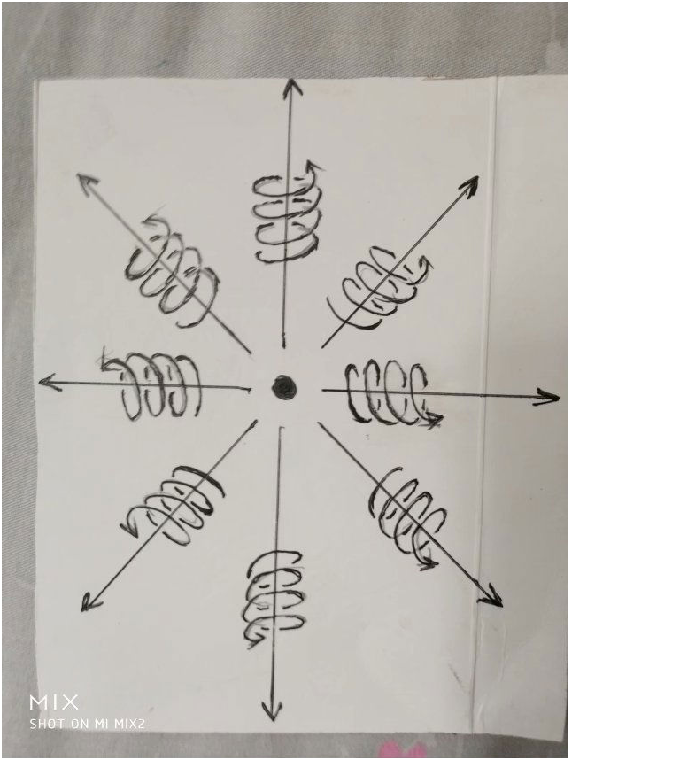

十六，时间的物理定义。

前面指出，一切物理概念都是质点在空间中或者质点周围空间本身相对于我们观察者运动，经过我们观察者的描述而形成的。

很多物理概念首先来自于质点在空间中运动给我们人的一种感觉。

时间也可以认为某某东西在空间中运动给我们人的一种感觉，什么东西在空间中运动给了我们人具有时间的感觉？

我们把一个人用宇宙飞船送到几百亿亿亿光年远的一个空间区域里，把这个人丢下来后，飞船立即飞回来。

这个空间区域里别的星球离得都非常非常的遥远，可以设想，这个人仍然有时间的感觉？是什么质点运动使这个人有了时间的感觉？这个情况下，仅有这个人的身体而已。

正确合理的看法是：

时间是我们观测者对自己身体在空间中运动的一种感受。

结合以上的统一场论基本假设，我们可以给出时间的物理定义：

宇宙中任何物体【包括我们观察者的身体】周围空间都以物体为中心、以矢量光速度C向四周发散运动，空间这种运动给我们观察者的感觉就是时间。

有人认为，在没有人类之前的宇宙照样有时间，所以，认为时间是人的感觉的观点是错误的。

其实“在没有人类之前”这句话是一个病句，没有了人，哪来的没有人类之前？

这个逻辑错误在：你第一步“在没有人---”已经排除了人，第二步又用人来定义“之前”。你既然把人排除了，就不能够再用人来定义。

没有我们人哪来的前后、先后、上下左右、东西南北？

“时间”恰恰是人对自己身体周围空间的运动的描述而产生出来的一个物理概念。

十七，空间可以无限存储信息。

信息的定义：信息是物质【由物体和空间组成】的运动形式。

宇宙中任何物体粒子储存或者携带的信息总是有限的。

宇宙中任意一处空间可以储存整个宇宙以前的、现在的、未来的所有信息。换句话，任意一块空间可以无限存储信息。

或者说：宇宙任意一处有限空间区域里，都可以存储无穷多的信息。

用逻辑证明如下：

物体周围空间以光速向四周发散运动，可以把这个物体的一切信息带到周围空间里。由于光速运动的三维空间，沿运动方向的空间因为光速运动导致长度缩短为零，变成了二维空间。

所以，光速运动空间可以把物体所有的信息刹那间带到宇宙任意一处空间里，而不是大家所想的那样是以光速一步一步的传播。

物体的一切信息实际存储在二维空间里。由于二维空间是零体积，可以和宇宙任意一处三维空间保持着零距离，所以，二维空间中存储的信息，可以弥漫在宇宙任意一处空间里。

反过来，我们也可以说，宇宙任意一处空间隐含了整个宇宙以前的、现在的、未来的所有信息。

为什么也包含了未来的信息？

因为时间是我们观察者的感觉，如果没有我们观察者，宇宙中亿万年前和亿万年后，所有的信息都可以存在于空间的一个点上。

宇宙除了时间、空间的无限性，还有包含的信息的无限性。

宇宙包含信息的无限性，可以用另外一句话描述：宇宙包含了无限的可能性，宇宙的反复演化，要把一切的可能性给表现出来。

十八，时空同一化方程

以上的时间物理定义，同时又定义了光速，光速反映了时空同一性，即时间的本质就是我们对光速运动空间描述出来的。

我们把光速扩展到矢量，矢量光速C【模为c】方向可以随时间t、光源速度、观察者运动速度而变化。

C = 标量光速c乘以单位矢量N。

标量光速c不随时间t、不随观察者运动速度、光源运动速度而变化。

由以上的时间的物理定义，可以认为：

时间与观测者周围空间以光速移动的路程成正比。

借助几何点的概念，可以认为：

时间是我们观测者周围空间以观察者为中心、以矢量光速C向四周发散运动给我们人的感觉。

与我们观察者周围空间一个几何点p在零时刻，从我们观察者所在的地方，以矢量光速C，经历了时间t走过的路程R成正比。

由此得出时空同一化方程：

R(t) = Ct= xi+ yj + zk

i,j,k分别是沿x轴、y轴、z轴的单位矢量。标量形式为：

r² = c²t²= x²+y² + z²

这个方程可以认为是时空同一化方程，反映了空间和时间是同一个起源，对应于相对论时空相对性方程。

十九，三维圆柱状螺旋时空方程

以上提到：宇宙中所有的质点包括空间本身都是以螺旋式在运动，螺旋运动规律是自然界最基本的规律之一。

统一场论认为空间本身也是以圆柱状螺旋式在运动，下面我们来建立统一场论中的三维圆柱状螺旋时空方程，来替代相对论中四维时空方程。

设想在某处空间区域里存在着一个质点o点，相对于我们观测者静止，我们以o点为原点，建立一个三维笛卡尔直角坐标系x,y,z

o点周围空间中任意一个几何点p在时刻t'=
0，从o点出发，经过一段时间t后，在t”时刻到达p点所在的位置x,y,z 。

也就是p点在t”时刻的空间位置坐标为x，y，z，由o点指向p点的空间位移失径我们用R表示。

按照以上的垂直原理，R随着空间位置x,y,z和时间t变化而变化，所以有：

R(t) =(x,y,z,t)

给出了R(t) 和(x,y,z,t)的具体关系，是以上的时空同一化方程

R(t) = Ct = x i+ y j + z k

标量形式：r² = c²t² = x²+ y² + z²

r是矢量R的数量。

以上方程在相对论中也出现过，相对论中被认为是四维时空距离，真实情况是时间的本质就是以光速运动的空间。

统一场论认为三维空间其中任意的一维，只要以光速相对于我们观测者运动，我们就可以把这一维空间叫做时间，所以时空只有三维。

空间的存在是基本的，时间就是我们观察者对光速运动空间描述产生出来的一个物理量，时间的量等价与光速运动的空间位移量。

相对论显然没有认识到这一点，相对论不知道时间的本质，把时间看成另外一维，和三维空间并列为四维时空，没有认识到空间是基本的，时间是人描述出来的，没有人是不存在时间的，但是仍然存在着空间，这个明显是相对论的缺陷。

统一场论认为p点真实走过的轨迹是圆柱状螺旋式。只是在o点相对于我们观测者静止情况下，周围空间的运动是均匀的，许多类似p点的几何点旋转运动累加起来，由于相互抵消而为零。这个如同稳定磁场的散度为零，可以用场论高斯定理严格证明。

但是，如果我们只考虑一个单一几何点p点的运动，其螺旋式应该在方程中体现出来，如果时间t是几何点沿z轴运动产生的，也就是认为时间轴在z轴上，其数学表达式应该为【几何点p在0时刻从o点出发的情况下】：

x = h cosωt

y = h sinωt

z = c t

以上的三维螺旋时空方程也可以用以下矢量方程表示，

R = h cosωt i+ hsinωt j + ct k

式中h是o点到p点的矢径R在xoy平面上的投影长度，ω是p点绕o点沿xoy平面旋转运动的角速度，c是常数光速。

由于o点相对于我们观察者是静止的，它周围空间的运动应该是均匀的，而且没有哪一个方向是特殊的，因而ω、h应该是常数。

如果认为时间轴在x轴上，R在zoy平面上的投影长度仍然是h，其数学表达式应该为：

x = c t

y = h sinωt

z = h cosωt

如果就是认为时间轴在y轴上，R在zox平面上的投影长度仍然是h，其数学表达式应该为：

y = c t

x = h sinωt

z = h cosωt

以上可以叫三维螺旋时空方程，统一场论认为，宇宙的一切奥妙都是以上方程决定的，大到银河系、星球，小到电子、质子、中子的运动，以及物体为什么有质量、为什么有电荷，一直到人的思维等等······，都与这个方程有关。

三维螺旋时空方程中，旋转运动和直线运动有什么关系呢？

沿坐标x,y轴方向的空间旋转位移矢量X,
Y和沿坐标z轴方向的空间直线位移矢量Z应该满足以下叉乘关系：

X×Y = Z

Y×X = - Z

上式X,Y是旋转量，如果X×Y = Z表示右手螺旋关系，则Y×X = -
Z则表示左手螺旋关系。

式X×Y = Z和Y×X= - Z很重要，反映了空间的旋转运动和直线运动之间的联系。

这个两个公式来源于前面的“平行原理”，
“平行原理”指出，两个物理量如果可以用线段表示的，相互平行的话，一定是正比关系。

在式X×Y =
Z中，可以把X×Y看成一个矢量面积，面积的大小等于X×Y的数量，方向和X，Y相互垂直，和Z相平行，按照平行原理，矢量面积X×Y和Z成正比，当然，在某种情况下，也可以令比例常数为1，写成X×Y
= Z 。

对于以上的三维螺旋时空方程，我们需要注意以下几点：

1， o点周围有许多个几何点，p点只是其中一个。

2，式R = h cosωti+ h sinωt j + ct k中，当h = 0时候，R = ct k

不表示o点周围只有一条R = ct k这样的矢量，而是有许多条类似这样的矢量呈辐射式均匀的分布在o点周围，坐标轴只是我们描述空间的一种数学工具，不会影响运动空间的分布。

3，空间的柱状螺旋式运动是直线运动和旋转运动两种基本形式的叠加。也可以认为直线运动是以上提到的圆柱状螺旋式运动中h
= 0的一种特例。

我们还要意识到o点周围有多少几何点发散式的以光速离开o点运动，就有多少几何点围绕o点旋转运动，正常情况下几何点的运动应该是连续的，不会无缘无故的中断。

在场论中，散度描述了空间的直线运动形式，旋度描述了空间的旋转运动形式。

4，由于一个几何点和另外一个几何点绝对的没有区别，许多几何点沿一条直线相继的旋转运动，可以认为空间产生了波动形式，波动的速度就是光速，而且空间波动的传播方向和旋转平面相垂直，很显然空间波动是横波。

我们知道，柱状螺旋式运动和波动(这里指横波)有很大的区别，但是，对于空间这种特殊的物质形式，两种运动形式却可以相互并存，因为两个空间几何点之间绝对的没有区别。

后面，我们将详细的讨论空间的波动性。

5，将以上的式

R = h cosωti + h sinωt j + ct k

对时间t求导，似乎出现了超光速，我们要明白，以上的质点o点相对于我们观察者静止的情况下，周围空间几何点的旋转运动累加起来由于相互抵消而消失，所以，式中的

h cosωti+ h
sinωt j 实际结果等于零，只有单独考察一个几何点运动情况下不为零，但这个超光速不是真实的。这个情况如同稳定磁场的散度为零。

6，以上的“时间的本质和物理定义”中给时间下的物理定义是：时间只是我们人对自身在空间位置中变动的一种感受。

结合以上的三维螺旋时空方程，可以认为时间是空间相对于我们观察者以矢量光速直线运动形成的。

借助几何点的概念，可以认为：时间是几何点相对于观察者以矢量光速直线运动形成的，进一步推理有：

时间与观察者周围某一个几何点以光矢量速走过的直线路程成正比。

二十，认识光速的本质，解释光速不变。

1. 光速的本质

物理学的深入发展，光速概念的重要性越来越受到人们的重视，光速与时间、空间、场、质量、电荷、动量、力、能量----这些基本物理概念变得同等重要。

人们一提到光速不由自主的就想到了发光，实际上光速比发光现象更能够反映自然界的本质规律。

统一场论中，认定光速反映了时空同一性，即空间是基本的，空间的运动形成了时间，时间就是就是我们观察者对空间以光速运动的描述。时间和空间是同一个本源，是光速把二者联系起来。

认定光速是一个常量，意味着空间延长、时间相应的延长，空间缩短时间相应缩短，这就是时空同一性。

以上的方程 R(t) = Ct = x i+ y j + z k 就是时空同一化方程，

原子中的电子生活在小空间范围内，运动速度极快，运动周期极短。而太阳系内，行星在大范围空间里运动，速度小，周期长，这一切的背后都是时空同一性造成的。

统一场论的时空同一性和相对论的时空相对性表面上看是矛盾的，但本质是一致的，时空同一性方程是基本的，从时空同一性可以导出时空相对性方程，下一章我们将给出推导过程。

2，解释与光速相关的相对论效应。

我们首先来谈谈光速为什么是宇宙中最高速度的问题。

相对论中认为，光速是宇宙中最高的速度。相对论主要是根据数学公式做出的判断，因为物体的运动速度如果超过光速，物理量将出现虚数而失去意义。其实从逻辑上推理光速是宇宙最高速度也是很简单的。

设想，设想一架外星人的飞船长10米，以光速相对于我们运动，我们发现飞船程度缩短为零，飞船内部时间凝固不走了。飞船内部的一切运动在我们看来都是静止的，

如果飞船超光速相对于我们运动，难道会出现飞船比长度为零还要短的情况？出现比时间凝固还慢的情况出现？还要出现比静止更慢的运动？显然没有。

相对论认为，物体以光速运动，沿运动方向的空间长度为零，一个物体长度为零，体积也为零，体积为零，按理是不存在的，相对论这个结论让很多人不能够接受。

统一场论对此有很好的解释。统一场论认为，一切物理量都是观察者对物体、空间描述出来，物体的体积变成了零，可能的原因是观察者观察的原因，这样我们就好理解了。

相对论认为，一个物体以光速运动，物体上所发生的的一切过程时间都是无穷大，时间凝固了，无穷大的时间我们难以接受，统一场论认为时间是观察者对自己在空间中运动形成的，时间只是人的感觉，只是人的观测，这样我们就容易理解了。

相对论认为，物体以接近光速运动，质量变得无穷大了，无穷大的质量我们是难以接受的。

统一场论认为，物体的质量反映出物体周围一定体积内运动空间的运动量，当这个物体以接近光速运动时候，这个体积由于相对论性的空间收缩性，将变得接近为零，由于质量是我们观察者观察出的物理量，所以，物体的质量为无穷大我们就容易理解了。

3，矢量光速和光源速度之间的关系

光速能不能看成矢量，相对论中没有深入讨论，按照相对论，光速与光源的运动速度无关，与观测者的选择无关，与时间无关，与空间位置无关，纯粹一个常数。

所以，相对论倾向认为光速不能够看成矢量，换句话，在相对论中讨论光速的矢量性是没有意义的。

统一场论提出了与之不同的观点，认为光速在某些情况下可以表现为矢量，其方向和光源的运动速度有函数关系。

统一场论为了区分，把矢量光速叫光速度，用大写C表示，C大小【也就是模c】不变，但是方向可以变化。光速速率叫光速率，又叫标量光速，用小写字母c表示，c不变。沿直角坐标x轴或者y轴或者z轴的光速度叫光速，属于矢量光速，也可以变化。

我们把光速扩展到矢量，当光源以速度V【标量为v】相对于我们观察者运动的时候，可以引起矢量光速C的变化。

我们来求出矢量光速C【标量为c】和光源运动速度V、C和V之间的角度b三者满足的关系：

在下图中：\ |矢量光速和光源速度的关系.png|

s系的原点o和s’系的原点o’在时刻等于零的时候，相互重合在一起，并且x轴和x’轴相互重合在一起，后来，相互以匀速度V沿着x【或者x’】轴匀速直线运动。

一个质点一直静止在s’系的原点o’上，s系和s’系的观察者考察一个从几何点p.

s’系的观察者认为p点在零时刻从这个质点出发，经过了时间t’，走到了p点后来所在的位置上，以矢量光速C’走了o’p
= C’t’这么远的路程。

s系的观察者认为p点在时间t内以矢量光速C走了op = Ct这么远的路程 。

在上图中可以看出：

\| Vt\| /\| C t \| = sinβ = v/c

消除t，可以得到：

\| V\| /\| C \| = sinβ = v/c

令C和V之间的角度为b，有：

cosb =\| V\| /\| C \| = v/c

由上式可以导出sin b = √（1- v²/ c²），这个实际上是相对论因子产生的原因。

在相对论中，只有标量光速，标量光速是常数，不随光源和观察者的运动速度变化，所以，在相对论中没有讨论光源运动速度和光速之间的函数关系。

当我们把光速扩展到矢量时候，光源运动速度V可以引起V垂直方向的矢量光速C的变化。在上图中，当V趋近于零时候，V和C是相互垂直的。

在满足标量光速不变的前提下，当光源以速度V沿着x轴正方向运动的时候，可以引起V垂直方向的矢量光速C方向发生偏转，偏转的角度β和V[标量为v]、C[标量为c]满足于以下三角函数关系：

sin β= v/c

矢量光速C的方向β变化范围在0到90度，而光源运动速度V的范围在0到光速c之间。

4，用时间的物理定义解释相对论中的光速不变。

相对论以光速不变为基础而建立起来的，但是，相对论没有解释光速为什么不变，相对论只是把光速不变作为事实依据，展开了对牛顿力学的扩展、修改。

相对论中光速不变是指：

光源静止或者以速度v运动时候，光源发出的光的速度c相对于我们观察者始终不变。

如果你知道时间的物理定义，你就立即知道了光速为什么不变。

宇宙中任何物体【包括我们观察者的身体】周围空间以物体为中心点、以光速c向四周发散运动，而光是静止于空间中被空间这种运动带着向外跑的，空间这种运动给观察者的感觉就是时间。

这样说来，时间的量t与光速c运动空间的位移量r成正比，也就是：

r = c t

光速c = r/t是一个分式，从数学中我们知道，分式就是分子除以分母。

光速中的分子----空间位移r和光速中的分母-----时间t是一个东西，是我们人为的把一个东西叫成两个名字。

比如，张飞，又名张翼德，虽然是两个名字，但是，指的是同一个人。

所以，光速的分子------空间位移r如果有什么变动，光速的分母------时间t一定会同步变化【因为r和t本来是同一个东西，是我们观察者叫成了两个名字】，这样光速的数值c
= r / t始终不变，这个就是光速不变的原因。

比如说，我们看到了张飞胖了，体重增加了5斤，我们马上就可以断定张翼德体重肯定的增加5斤，因为两个名字指的是同一个人。

张飞和张翼德的体重在增加，但是，张飞的体重和张翼德的体重的比值始终不变。

当光源相对于我们以速度v运动的时候，引起了光速的分子----空间位移r的变化，一定会引起光速的分母------时间t同步变化。

因为光速的分子---空间位移r和光速的分母---时间t本质上是同一个东西，是我们人叫成两个名字，如同我们把张飞又叫了另一个名字----张翼德。

当光源相对于我们以任意方式运动的时候，引起了光速的分子----空间位移r的变化，一定会引起光速的分母------时间t同步变化。

从以上可以推理出，光源相对于我们观察者无论是匀速还是加速运动，光速始终不变。这个表明广义相对论基本正确。

5，对洛伦茨变换中光速不变的解释。

洛伦茨变换是狭义相对论的基础，而洛伦茨变换中光速不变是主要依据，光速为什么不变？相对论没有深入解释，而是把光速不变作为依据，展开对牛顿力学的修改。

我们这里结合以上对光速的认识，用统一场论来给出解释。

首先我们给出洛伦茨变换的推导过程。

设有两个笛卡尔直角惯性坐标系s系和s'系，任意一事件在s系、s'系中的时空坐标分别为（x，y，z，t）、（x'，y'，z'，t'）。

在洛伦茨变换中y= y'，z= z'，为了简单所见，我们现在只考虑x, t,和x',
t'之间的变换。

在下图中，x轴和x'相互重合。在t'= t
=0时刻，o和o'点相互重合在一起， s'系的原点o'相对s系的原点o以速率v沿x轴正方向运动。

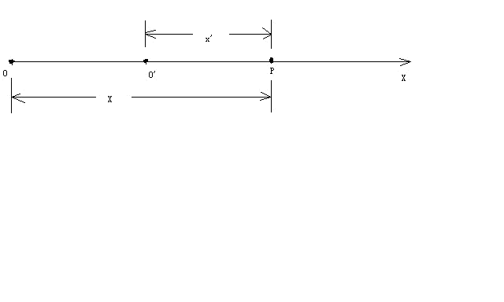

我们来求出由两个坐标系测出的在某时刻发生在x轴上p点的一个事件（例如一次爆炸）的两套坐标值之间的关系。

在s'系中测量，发生在p点的爆炸的空间、时间的坐标分别为x',
t'，也就是说爆炸发生在t'时刻，发生的地点是在x'轴上离原点o'距离为x'处。

在s系中测量，发生在p点的爆炸的空间、时间的坐标分别为x,
t，也就是说爆炸发生在t时刻，发生的地点是在x轴上离原点o距离为x处。

在上图中，可以直观的看出

x'= x- vt (1)

x = x'+ vt’(2)

按照伽利略相对性原理的思想，时间、空间长度的测量与观测者的运动速度v没有关系，上式可以成立。

但是，相对论认为时间、空间长度的测量与观测者的相互运动速度v有关，所以（1）式和（2）式要分别乘上一个系数k和k'才能够成立。

x'= k(x–vt) (3)

x = k'(x'+ vt') (4)

由于s系相对于s'系是匀速直线运动，因而我们应该合理的认为x' 和(x–vt) ，x 和(x'+
vt')之间的关系应该是线性的，所以k和k'应该是常数。

相对论的相对性原理认为物理定律在所有的惯性参考系中都是相同的。也就是说，不同惯性系的物理方程形式是相同的。所以k和k'应该相等。

对于k的值，洛伦茨变换用的是光速不变求出的。

设想由原点o（o'）在重合时刻发出一束沿x轴正方向的光，设该光束的波前坐标在s系中为（x，y，z，t)，在s'系中为(x'，y'，z'，t')，以波前这一事件作为考察对象。

由于光速c在s系和s'系是相同的，有

x = ct  (5)

x'= ct' (6)

由（3）,(4) ,(5) ,(6)式联合可以求出洛伦茨变换：

x'= (x –vt) 1/√（1- v²/c²） (7)

x = (x'+ vt') 1/√（1- v²/c²）(8)

t'= (t–vx/c²)1/√（1- v²/c²）(9)

t= (t'+ vx'/c²)1/√（1- v²/c²） (10)

y'= y  (11)

z = z' （12）

下面我们用统一场论对以上的光速不变x = ct, x'= ct'给出解释。

在以上的s系和s'中，设想在t'= t=
0时刻，o 和o'点相重合时候，一个几何点p以光速c从o 和o'出发，过一段时间到达p点。

对于几何点从o点出发达到p点这件事情，s系中的观测者认为，这个几何点走了路程x，用了时间t，而在s'中的观测者认为，这个几何点走了路程x'，用了时间t'。

由于时间与观测周围空间中几何点以光速走过的距离成正比（见前面的“三维螺旋时空方程”），所以有以下关系成立：

x/ x' = t/t'

由上式可以推理出x/ t = x'/t'

由于x/
t和x'/t'都是位移比时间，并且是几何点以光速c在运动，量纲是速率，所以

x/ t = x'/t' = 速率 = 光速c，

这个就证明了（5）式和（6）式中的光速c应该是相等的，这也说明了有一个与时间密切相关的速率c，在相互运动观测者看来c的值是相等的。

6，解释一个参考系为什么光速不变。

我们还有一个问题：就一个参考系来讲，为什么光速也是常数？这一点可以这样理解，时间完全的等价于观测者周围空间的运动，也就是

运动的空间 = 时间。

为了在物理上使“运动的空间 = 时间”成立时量纲不发生混乱，我们需要在时间前面乘上不随时间、运动空间变化的一个常数---光速，

运动的空间 = 光速乘以时间

对于两个相互运动的参考系来说，两个相互运动的观测者发现同一束光的光速是相同的（就是光速不随观察者、不随光源的运动而变化），原因是空间以光速运动，光是静止于空间中被空间这种运动带着向外跑的。

两个观测者都发现产生时间的运动空间的位移（光速中的分子）变化了，而时间（光速中的分母）一定随之同步变化【原因就是光速运动空间和时间是同一个东西，是我们观察者把光速运动空间叫了另外一个名字：时间】结果光速(数学上是一个方式，分子----几何点的位移和分母----时间同步变化，这个分式的值不变）仍然不变。

7，用两个几何点相互垂直运动来解释光速不变

可能有人认为光线可以向任意方向跑啊，那空间岂不是也向任意方向跑吗？描述任何运动需有参照物，空间的运动是参照谁呢？

空间的运动是参照物体的，我们描述空间的运动都是指某个物体周围空间是如何运动的。特殊情况下，没有物体，我们描述空间的运动是相对我们人的身体。没有任何物体的情况下，单纯的描述空间的运动是没有意义的。

下面我们再来考虑，一束沿x轴垂直方向运动的光的光速不变情况。

设想有一个物质点o处于某处空间区域里，我们以 o点为原点作一个二维直角坐标系oxy ，观测者甲相对于o点静止，当然相对于直角坐标系oxy 也是静止的。

而观测者乙相对观测者甲以速度为v沿x轴作匀速直线运动，如下图所示：

.. image:: media/image6.png
   :alt: 统一场论6版
   :width: 5.8in
   :height: 3.48in

设想在0时刻，观察者甲、乙和o点相互重合在一起，此时甲乙两个观测者选择这样一个几何点p来观测，该几何点在甲、乙、o点重合时刻【也就是零时刻】从o点出发，运动方向沿y轴，和x轴垂直。

甲、乙二人选择一个沿x轴相垂直方向【也就是y轴】从o点出发的几何点，所走过的路程将与甲、乙二人的运动无关，甲乙二人认为这个路程是相等的。这一切狭义相对论用火车钻山洞的假想试验给出了证明：

设想有一个山洞，外面停一辆火车，车厢高度与洞顶高度相等，现在使火车匀速的开进山洞，运动的火车的高度是否发生变化？假设火车的高度由于运动变小了，这样，站在地面的观测者认为火车由于运动，高度变小，山洞由于不运动，高度不变，火车肯定顺利的开进山洞。

但是，在火车里面的观测者认为，火车是静止的，因而火车高度不变，山洞是运动的，山洞的高度会降低，火车无法通过山洞，这就发生了矛盾。

但是，火车能否开进山洞是一个确定的物理事实，不应该与观测者的选择有关，唯一合理的观点是：匀速直线运动不能够改变运动垂直方向上的空间长度。

以上的几何点过了一段时间后到达y轴上的p点。这样观测者甲认为在时间为t’内几何点p走了op这么远的路程，而观测者乙在时间为t内从 o点出发到达b点, 并且肯定认为该几何点走了bp这么远的路程。

根据前面的时间的物理定义，观测者所测得的时间与它周围空间中某个几何点所走过的路程成正比。

这样说来，则下式成立：

bp/op = t/t’ (11)

将上式变形为：

bp/t = op/t’  (12)

这样，观测者甲认为自己周围空间这个几何点p在t’这段时间内以一个恒定的速率走了op这么远的路程, 而观测者乙认为这个几何点走了bp这么远的路程,虽然比甲测得路程要长，但相应地所用时间也延长了-----因为观测者测量的时间与他周围空间中某一个几何点走过的路程成正比，所以该几何点的速率在甲乙二人看来是个不变的常数.

根据前面的观点，o点相对于观测者静止的时候，o点和观察者也可以看成是同一个点，o点周围空间中几何点会以光速c离开o点向外运动，而观测者甲相对于o点静止，这样，可以认为

op/ t’ = c

以上的常数c就是光速，这就解释了光速为什么会相对于观测者甲和乙数值不变。

以上所描述的同一事件(就是一个几何点从o点出发到达p点这件事), 观察者甲认为用了时间t’,而观察者乙认为用了时间t, 由于t大于t’，这在形式上符合相对论中观点：

运动的观察者（相对于物质点o而言，如果没有物质点，时间和运动的描述没有意义）所测得的时间延长。但在数量上和相对论是否一致呢? 我们再来详细的分析一下。

由于：bp/t = op/t’=c(常数光速)

(√ op² + v ²t² )/ t = c

op² + v ²t² = c²t²

op² = c²t²(1－v²/c²)

（ct’）² = c²t²（1－v²/c²）

t’² = t²（1－v²/c²）

t’= t √（1-v²/c²）

从以上分析来看,运动的观测者的时间延长在数量上和相对论是一样的。

可能人们还有一个疑问？观测者周围空间有许多几何点，为什么一个几何点的运动就可以表示时间？

这个应该这样理解，时间反映了空间运动的一种性质，我们观测者通过描述空间中许多几何点的其中一个，就可以把空间具有时间这种变化的性质给表现来，这个也表明了，时间不能够脱离观测者而独立存在。

二十一，推导出相对论的时空间隔不变性。

现在设想有两个观察者分别在s系和s’系里，s系相对于s’系以速度V沿着x轴正方向运动。

s系的时空坐标我们记为（x,y,z,t）, s’系的时空坐标我们记为（x’, y’, z’,
t’）。

设想在时刻t = t’=
0，s系和s’系的原点o点和o’点重合在一起。一个几何点p在时刻0开始，从o点和o’点出发，经过一段时间到达p点现在所处的位置。

将式R(t) = Ct = x i+ y j + z k 对自身点乘，结果为：

r²= c²t² = x²+ y²+ z²

r是矢量R的数量。r反映了在s系里，观察者测量p点相对于原点的移动距离。以上方程在相对论中也出现过，相对论中被认为是四维时空距离。

同样的道理，可以导出在s’系里，观察者测量p点相对于o’点的移动距离:

r’² = c²t’²= x’²+ y’² + z’²

由 r² = c²t²= x²+ y² + z² 可以导出：

c²t²- x²+ y² + z² = 0

由r’² = c²t’²= x’²+ y’² + z’²可以导出：

c²t’²- x’²+ y’² + z’² = 0

由以上方程可以得出时空间隔在相对匀速直线运动的两个惯性系里是不变的。

二十二，统一场论中的速度在惯性系中的变换

统一场论给出了一个物体总的运动速度为U =
C-V，V为物体相对于我们的运动速度，C是物体周围空间的矢量光速运动，当V =
0时候，静止物体周围空间仍然具有光速运动。

物体以速度V相对于我们运动，只是周围空间光速C发散运动和速度V的合成运动。

设想一个质点o，相对于惯性系s’静止，s’相对于另一个惯性系s沿x轴正方向以速度V匀速直线运动。

我们设想s系和s’系在0时刻，原点o和o’点重合在一起，一个几何点p从原点出发，经过一段时间后，到达p点现在所处的位置。

在s系里，用方程

R(t) = Ct = x i+ y j + zk

可以描述p点的位移。

在s’系里，用方程

R’(t’)= C’t’ = x ’I’+ y’ j’ +z ’k’

可以描述p点的位移。

注意，矢量光速C和C’是不一样的。

利用以上《解释洛伦茨变换中的光速不变》中的式

x'= (x –vt) 1/√（1- v²/c²），

以及（9）式y = y’、（10）式z = z’式， 可以导出：

x ’I’=  (x i –vt) /√（1- v²/c²）

y ’j’= y j

z ’k’= z k

s系里的时间t和s’系里的时间t’满足以下关系:

t = (t'+ vx'/c²)/√（1- v²/c²）

由以上可以导出：静止物体周围空间运动速度和运动物体周围空间运动速度的变换。

在静系s’里，将方程

R’(t’)= C’t’ = x ’I’+ y’ j’ +z ’k’

对时间t’求导数， 可以导出几何点p点在s’系里的运动速度C’为：

【1/dt’】R’(t’) =【1/dt’】 C’t’

=【1/dt’】[ x ’I’+ y’ j’ + z ’k’ ]

C’ = C’x ’+ C’y’ + C’z’

C’x ’, C’y’ , C’z’分别为矢量光速C’在s’系里x’，y’，z’轴上的分量。

在动系s里，将方程

R(t)= Ct = x I+ y j + z k

对时间t求导数， 可以导出几何点p点在s系里的运动速度C为：

【1/dt】R(t)=【1/dt】 Ct

=【1/dt】[ x I+ y j + z k]

C = Cx + Cy+ Cz

Cx , Cy, Cz分别为矢量光速C在s系里x，y，z轴上的分量。

借助于时间t和时间t’满足的关系式

t = (t'+ vx'/c²)/√（1- v²/c²），

可以导出C的三个分量和C’的三个分量满足的关系为：

C’x ’= Cx – v/1- (Cx v/c²)

C’y’ = Cy [√（1-v²/c²）]/ 1- (Cx  v/c²)

C’z’ = Cz [√（1-v²/c²）]/ 1- (Cx  v/c²)

上式中v是矢量速度V的标量形式。

二十三，宇宙4大场的笼统定义。

在数学中场的定义为：

若空间中（或空间的某一部分），每一个点对应一个确定的量，则称这样的空间为场，当空间中每一点所对应的量为数量时，则该空间为数量场，当空间中每一个点所对应的量是一个矢量时，则称这样的空间为矢量场。

从数学中场的定义可知，场是用空间的点函数来表示的，反之，若给出空间中某一个点函数，就给出了一个场。

在前面我们做了大量的分析，把万有引力场（简称引力场）、电磁场以及核力场与空间本身的运动联系了起来，认定物理上4大场【引力场、电场、磁场、核力场】的本质就是以圆柱状螺旋式运动的空间。

由此，我们在这里把物理4大场给出一个统一的定义，在后面，我们再分别给出引力场、核力场、电场、磁场精确的定义。

物理4大场的统一定义为：

相对于我们观察者，质点o周围空间Ψ中任意一个几何点p，由o点指向p点的位移矢量R，随空间位置(x,y,z)变化或者随时间t变化，这样的空间Ψ称为物理场，也可以叫物理力场。

简单一句话，物理4大场本质就是运动变化的空间，这个也符合我们前面的统一场论基本原理----一切物理现象都是质点在空间中（或者质点周围空间本身）相对于我们观察者运动造成的。

从以上的定义可以知道，物理4大场都是矢量场，不同的场只是我们观察者从不同的角度观测螺旋运动空间而具有不同的运动程度。

注意，场是质点周围空间相对于我们观测者运动程度所表现出的一种性质，空间、质点、观测者三个东西一个都不能少，否则，场就失去了意义。

二十四，引力场和质量的定义方程。

| 设想有一个质点o相对于我们观测者静止，周围空间中任意一个空间几何点p，在零时刻以矢量光速度C从o点出发，沿某一个方向运动，经历了时间t，在t'时刻到达p所在的位置。让点o处于直角坐标系xyz的原点，由o点指向p点的矢径R由前面的时空同一化方程给出：
|   R = C t = x i+ y j + zk 
|   R是空间位置x，y，z和时间t的函数，随x，y，z，t的变化而变化，记为：
|   R = R（x,y,z，t）。
|   我们以 R = Ct中R的标量长度r为半径，作高斯球面s =4πr²包围质点o。
|   o点周围在高斯球面s = 4πr²上有n条几何点的位移矢量R =
  Ct均匀的、垂直的穿过，o点在周围p点处产生的引力场A【数量为a】为：

A = - n[R/r]/ 4πr²

a = n/- 4πr²

上式负号 - 表示引力场A和几何点的位移R的方向正好相反，
r是矢量位移R的标量长度，R/r是矢量R的单位矢量。

我们把高斯球面s =
4πr²分割成许多小块，我们选择其中的一小块面积Δs，我们考察发现Δs上有Δn条几何点的位移矢量R=
Ct垂直的穿过，这样引力场A可以写为：

A = - Δn[R/r]/Δs

这个式子的物理意义告诉我们，高斯球面s =
4πr²其中一小块面积Δs上，垂直穿过矢量位移R的密度反映了该处的引力场强度。

为什么上式中用R的单位矢量R/r，而不用矢量R，是因为我们在高斯面s上只能考察矢量R的方向和条数，而不能考察矢量R的长度，所以Δn
R/Δs这个式子是没有物理意义的。

由于o相对于我们是静止的，周围空间的运动、分布是均匀的，我们应该合理的认为在这种情况下，空间是连续的，无限可分，所以，以上的式中的n可以取无穷大。

按照这种思想，我们假定式A =
-Δn[R/r]/Δs中R/r是常数，只有Δn和Δs之间相对应变化，这样可以由上式导出引力场方程的一种微分形式：

A = - dn[R/r]/ds

上式的d是微分符号。

如果我们假定Δn是常数，特别是我们把Δn设定为常数1，只考虑Δs和[R/r]之间相对应变化，这样我们有了引力场方程的另一种微分形式：

A = - n d[R/r]/ds = - d[R/r]/ds

由引力场的定义方程A = - n[R/r]/ 4πr²还可以导出：

A = - n R/ 4πr³

我们再来分析上式的物理意义。

这个式子反映了什么样的物理意义？是不是说，在高斯球面s =
4πr²内接球体积内包含了n条几何点总的矢量位移nR，二者的比值就是o点周围的引力场强度A？

可是高斯球面s = 4πr²内接球体积是（4πr³/3），而不是式A = - n
R/4πr³中的4πr³，如何看待这个矛盾？

这个原因是我们不能把nR看成是o点周围运动空间总的运动量，nR表示n条矢量位移R的相互叠加。由于o点周围的R的方向不一样，是以o点为中心，向四周均匀的发散式分布，n条R相互叠加的结果必然是零。

只有当n =
1或者很小的时候，n条R的方向一致或者接近一致，nR的叠加才具有物理意义。

为了进一步说明问题，我们把场论的高斯散度方程：

∯（A·dS ）= ∫∫∫（▽·A）dv

用到以上的引力场方程A = - n R/ 4πr³中。

上式中∯是高斯球面积分，A是矢量引力场，dS是矢量面元，是高斯球面s =
4πr²上的一小块，∫∫∫是球体积分，▽是微分算符，dv= dxdydz,
是o点周围空间中一小块体积。

▽·A表示引力场A的散度。

式∯（A·dS ）=
∫∫∫（▽·A）dv左边是面积分，右边是面积分包围的体积分，积分区域都是0到4π。

上式的物理意义是：方程左边穿过高斯球面s的几何点位移的总条数n，和方程右边高斯球面内接球体积∫∫∫dv所包含几何点位移的总条数n是相等的。

在o点静止的时候，我们用高斯球面s和几何点的运动量

nR来考察引力场A的话，我们把以上的引力场方程

A = -n[R/r]/ 4πr²【标量形式a = n / - 4πr²】带到高斯散度方程∯（A·dS ）=
∫∫∫（▽·A）dv中的左边。注意ds是矢量面元dS的的标量形式。

把引力场方程A = - n
R/4πr³带到高斯散度方程右边，我们来看一看，高斯散度方程是否仍然成立？

我们第一步是把高斯散度方程

∯（A·dS ）= ∫∫∫ （▽·A）dv

的左边改成标量形式 ∯a ds

我们把引力场标量方程a = n/- 4πr²带入以上方程的左边，再把引力场方程A = -
n R/4πr³带到以上高斯散度方程的右边，这样有：

∯（n/-4πr²）ds = ∫∫∫ [▽·（- n R/4πr³）]dv

-  ∯（n/4πr²）ds = - ∫∫∫[▽·（n R/4πr³）]dv

n =（ n /4πr³）∫∫∫ [▽·R]dv

=（n /4πr³）∫∫∫ 3 dv

=（3 n /4πr³）∫∫∫dv

=（3 n /4πr³）(4πr³/3)

= n

以上结果告诉我们，引力场方程可以写成

A = -n[R/r]/ 4πr²【标量形式a = n/- 4πr²】和A = - n
R/4πr³，两种形式是等价的，表示的物理意义都是高斯球面上穿过几何点位移条数的密度反映了引力场的强度。

我们再来看一看我们给出的引力场定义方程和质量之间的关系。

质量这个概念最早是牛顿力学提出了，牛顿第二定理提出了惯性质量的概念，万有引力定理定义给出了引力质量的概念。惯性质量反映了物体不容易被加速的程度，而引力质量是加速别的物体的能力。

我们很自然的认为，物体具有的引力质量与周围产生的引力场密切相关。

我们以上提出的引力场定义方程A = - n
R/4πr³中，应该包含了牛顿万有引力定理中的引力质量。

我们用以上o点的例子来分析，牛顿万有引力定理给出o点在周围空间p处产生引力场A和o点质量m之间的关系为：

A = - g m R / r³

上式g是万有引力常数，由o点指向p点的矢径为R，r是矢量R的数量。

我们把牛顿引力场方程A = - g m R / r³和我们给出的引力场定义方程A = - n
R/4πr³相比较，明显可以得出引力质量的定义方程：

m = n /4π g

我们再来分析以上的质量定义方程的物理意义，上式中g是常数，我们不需要考虑。

可以明显的看出，o点的质量表示在o点周围分布的矢量位移R的条数n与立体角度4π的比值。

这个质量定义方程m = n /4π g可以写为普遍的微分形式：

| 我们把立体角度4π换成一个可以变化的量，用立体角Ω【Ω的值在0和4π之间】表示。这样可以导出质量的微分方程和积分方程式。
|    m = dn / gdΩ               

g m ∮ dΩ = ∮dn

g m 4π = n

m = n /4π g

∮是包围o点的立体角度积分，积分范围是从0到4π。

根据以上的分析，我们可以给出o点静止的时候引力场A的散度：

▽·A = n/∫∫∫dv = n/∫∫∫dxdydz

按照牛顿力学，o点静止的时候引力场A的散度为：

▽·A = 4π g m/∫∫∫dxdydz

注意，当o点运动的时候，以上两个散度方程需要修改。

人类已经认识到静止质点在周围产生的引力场旋度为零：

▽× A = 0

二十六，从质量定义方程导出相对论质速关系。

相对论用动量守恒和相对论速度变换公式，可以导出相对论质速关系----质量随物体运动速度增大而增大。下面我们用质量的定义方程直接来导出质速关系。

设想一个质量为m’的质点o，一直静止在s’系的坐标原点o’上。

s系相对于s’系以匀速度V【标量为v】沿x轴正方向运动，并且s系的x轴和s’系的x’轴相互重合。

在s系里的观察者看来o点的质量为m，我们用以上的质量几何定义方程g m ∮dΩ
= ∮dn

来求出m和m’之间满足的数学关系。

当o点运动的时候，我们应该合理的认为，不会引起几何点矢量位移R的条数n的变化，只是有可能引起立体角度Ω的变化，所以，我们只要求出运动速度V和Ω之间满足的关系，就可以求出m’和m之间的关系。

立体角Ω的定义为：

在以o点为球心、半径r =
1的球面s上，分割一小块Δs，以Δs为底面，以o点为顶点，构成一个锥体h，则Δs等于圆锥体h的立体角。

锥体h的立体角Ω大小为椎体的底面积Δs与球的半径r平方之比，当Δs无限的小，变成了ds，有：

dΩ = ds/r²

当r = 1时候，上式变成了dΩ = ds。

以上是用椎体的底面积来定义立体角，现在我们把以上的立体角定义推广，用椎体的体积来定义立体角。

在以o点为球心、半径r =
1的球面s上，分割一小块Δs，以Δs为底面，以o点为顶点，构成一个锥体h，则椎体h的体积Δv等于圆锥体h的立体角。

锥体h的立体角Ω大小为椎体的体积Δv与球的半径r立方之比，当Δv无限的小，变成了dv，有：

dΩ = dv/r³

当r = 1时候，上式变成了dΩ = dv。

有了以上的准备知识，我们来考虑以上的o点在s’系里，静止时候质量

m’ = ∮dn/g∮dΩ’

我们用一个半径为1的单位球体积dv’替代上式中的dΩ’，

m’ = ∮dn/g∮dv’

相应的在s系里，o点以速度V运动的时候，质量

m = ∮dn/g∮dv

注意，n在s’系和s系里是一样的，也就是o点的运动速度V不能改变几何点位移的条数n。

我们只要求出dv’= dx’dy’dz’和dv = dxdydz之间的关系，就可以求出m和
m’之间的关系。

根据相对论中的洛伦茨变换【这种变换统一场论证明是正确的】：

x’ = （x - vt ）/[√（1- v²/c²）]

y’ = y

z’ = z

t’ = (t - v x/c²)/[√（1- v²/c²）]

得出微分式：

dx’ = dx/[√（1- v²/c²）]

dy’ = dy

dz’ = dz

由此得出：

m’ = ∮dn/g∮dv’ = ∮dn/g∮dx’dy’dz’

m = ∮dn/g∮dv = ∮dn/g∮dxdydz

由∮dx’dy’dz’ = ∮dxdydz/[√（1- v²/c²）]

可以导出：

m’ = m√（1- v²/c²）

当o点以速度V运动的时候，质量增大了一个相对论因子√（1-
v²/c²），这个结果和相对论是一致的。

二十七，引力场与高斯定理。

借助场论高斯定理，我们可以用散度更清楚的刻画质量和引力场的几何性质。

以上的引力场方程A = k g n R/Ω r³中，由于R的数量为r，因而方程可以写为：

A = k g n r【R】/Ω r³ = k g n 【R】/Ω r²

【R】为沿矢量R的单位矢量，我们考虑n和Ω相对应变化，有微分式：

A = k g dn 【R】/ r²dΩ

令r²dΩ =
ds，单位矢量【R】 和矢量面元dS【dS的数量为ds】的方向一致，这样有下式：

A· dS = k g dn

把上式两边在高斯球面上积分，结果为：

∯（A·dS ）= k g n

n为高斯球面s = 4πr²上穿过的矢量R =
Ct总的条数。把上式在直角坐标xyzo上展开。设A 在坐标上的分量为Ax,Ay,Az 。

矢量面元dS的分量dydz i, dxdz j , dydx k ，由高斯定理得：

∫∫∫v （∂Ax/∂x + ∂Ay/∂y + ∂Az/∂xz ）dv

=∫∫s Ax dydz +Ay dxdz + Az dydx = k g n

上式直接的物理意义是：

方程∫∫s（Ax dydz  ）+（Ay dxdz）+（Az dydx） =  k g
n 告诉我们，引力场可以表示为单位面积s上垂直穿过几何线的条数。

而方程∫∫∫v（∂Ax/∂x + ∂Ay/∂y + ∂Az/∂xz ）dv = k g
n告诉我们，在运动变化的空间中，引力场也可以表示为高斯球面内接球体积v内包含的运动几何点位移的条数。

当这个体积v发生很微小的变化，变化的部分可以看成是v的界面，可以用曲面s表示，在v上引力场的分布情况可以保留在s上，由v上的引力场分布情况可以求出s上的引力场分布。

这个意味着引力场是物体周围空间相对于我们观察者以光速连续向外辐射运动所表现出的一种性质。

把上式用散度概念表示，设o点的质量m和包围o点的高斯曲面s内体积v的之比为u, 当我们考察s和v趋于无限小的情况下，则式

4π g m  = ∫A·dS

=∫∫s Ax dydz +Ay dxdz + Az dydx

可以表示为：

▽·A = 4πg u

上式表示在体积v内包围了运动的几何点的位移线R =
Ct的条数反映了质点o质量的大小。

如果有许多空间几何点连续不断的从无限远处越过高斯曲面s垂直穿进来，汇聚到o点，形成许多几何点的位移线，则这些位移线的条数能不能反映o点具有负质量的大小？统一场论有没有预言了负质量的概念？

如果是这样的话，负电荷应该带负质量，但这个与事实不符合，人们发现负电荷电子的质量仍然是正质量，最可能的事实是，物体周围空间许多几何点的加速度指向物体，这样的物体带正质量。

如果物体周围有许多几何点的加速度和指向物体的方向正好相反，则这样的物体可以为负质量，我们知道，物体周围空间无论是逆时针旋转还是顺时针旋转，加速度都是指向物体，所以，宇宙中天然的负质量物体是不存在的，只有变化的电磁场和核力场可能产生反引力场，使物体带上负质量。

质量和引力场都反映了物体周围空间光速运动的运动情况，首先有一个前提条件，静止物体周围空间的直线运动都是光速运动，如果静止物体周围空间直线运动以各种不同的速度运动，那我们以物体周围空间运动几何点的条数来考察空间的运动量，来定义物体的质量就没有意义了。

二十八，统一场论动量公式

1,静止物体周围空间的运动量。

我们考察一个物体o点，周围空间总是以圆柱状螺旋式在向外发散运动。

前面的三维螺旋时空方程告诉我们，空间的圆柱状螺旋式运动是由空间旋转运动位移Vt加旋转平面垂直方向的直线运动位移Ct的合成。

由于质点o静止时候周围空间运动的均匀性，旋转运动位移Vt会相互抵消为零，只是剩下了以矢量光速C的直线运动【如下图】。

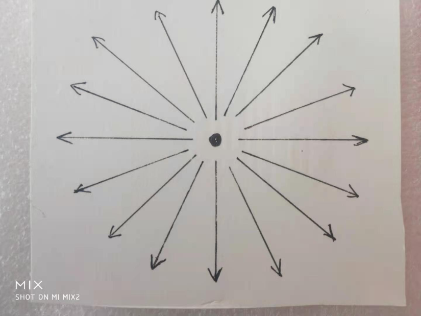

严格的证明和磁场的高斯定理类似。

设有一个物体o点，相对于我们观察者静止，其周围空间总共有n条几何点的位移R
= Ct，因而其总的运动量：

L  =  n R= n Ct

2，物体的静止动量定义

以上的o点相对于我们观察者静止，将周围空间几何点总的运动量L = nR =
nCt对立体角度Ω求偏导数，这里假定只有n随Ω变化。有：

∂L/ ∂Ω = [∂n/∂Ω]R = [∂n/∂Ω]Ct = m Ct

将上式对时间t求偏导数，这里只是考察Ct随时间t变化，而质量m不随时间变化，所得到的结果就是o点静止动量:

P静 = m C

o点的静止动量反映了o点周围立体角度4π内有n条几何点的矢量光速C。

我们虽然用o点周围空间某一个点p的运动程度来考察o点的静止动量，但是，o点周围空间总运动量L
=  n R = n
Ct只是随立体角度Ω、时间t的变化而变化，不随【和我们观察者之间的】空间距离而变化，也不随p点和o点之间距离的变化而变化。

所以，我们测量一个物体o点静止动量的大小，不需要考虑o点离我们观察者有多远，也不需要考虑o点和周围一个考察点p之间距离。

当o点运动的时候，情况是类似的。

3,运动物体周围空间的运动量

我们第一步指出静止物体周围空间运动量，然后求出相对于这个物体匀速直线运动运动的另外一个观察者，测量出这个物体周围的空间运动量，这样可以求出运动物体周围的空间运动量。

在下图中，惯性参考系s’的原点o’点和s系的原点o在时刻为零的时候，相互重合在一起。

s’系相对于s系以匀速度V沿x轴或者x’轴正方向【x轴和x’轴相互重合】直线运动。

以上的物体o点，始终静止于s’系的原点o’处。

并且，s系的观察者始终处于s系里的原点o处；s’系的观察者始终处于s’系的原点o’处。

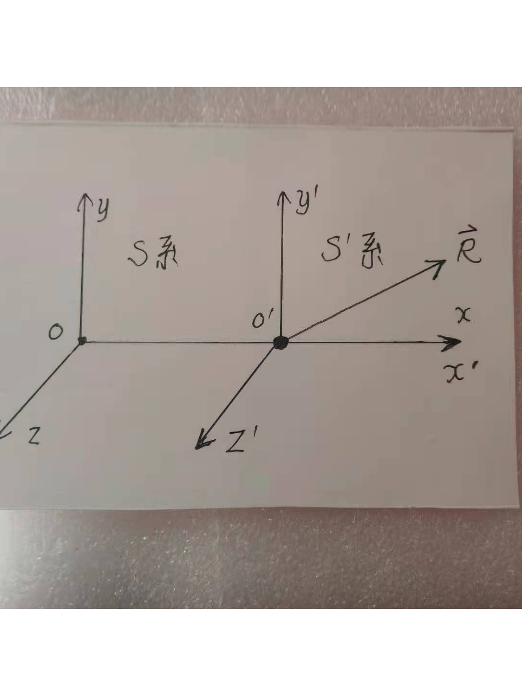

在s’系里观察，物体o点周围空间的一个几何点p，在0时刻从o’点出发，经过一段时间t’后，运动到p点现在所在的位置。

t’是s’系里的时间，为了区分，以后用t表示s系里的时间，用C和C’分别表示s系、s’系里几何点的矢量光速。

由o’点指向p点的几何点位移矢量为

R’ = C’t’= cN’t’。

p点处于R’的端点处，在上图中没有标出。

R’是几何点p在s’系里的光速运动位移。我们用R来表示s系里里几何点p的光速运动位移。

由于两个相互运动观察者测量同一束光的标量速度c是一样的【这个详细的证明百度统一场论6版】。

这样，在s系里观察者认为，几何点p相对于s系的观察者所在的原点o，其运动位移：

R = Ct= c N t

N是单位矢量。

在s系里观察者认为，几何点p相对于物体o点，其运动位移R –
Vt，因为o点以速度V相对于s系里观察者在运动。

将R –
Vt对时间t求导数，得到：是s系里，几何点p相对于物体o点的运动速度为：C - V

注意，p点相对于原点o的运动速度和相对于物体o点的运动速度之间的区别。

4，运动物体的动量

上面告诉我们，物体o点以速度V运动的时候，周围空间一个几何点p相对于物体o点速度为C
– V，假定物体o点周围在立体角度n/4π内有n条C – V，

这样物体o点以速度V运动的时候，具有运动动量：

P动  =  n/4π（C – V），

由质量的定义方程m = n/4π.上式可以改为：

P动 = m（C – V）

相对论力学、牛顿力学认为物体周围空间的光速运动不存在，也就是C =
0，所以，牛顿力学、相对论的动量方程是P动 = m
V，也可以说相对论、牛顿力学的动量公式只是上式的一个分量。

这个动量公式只是把牛顿、相对论动量公式扩展了，包含了物体静止时候周围空间的光速运动。

5，物体运动时候的动量和静止时候的数量是相等的

将运动动量公式P动 =  m（C – V）两边平方，结果为：

p² = m²（c ²– 2C·V + v²）

p为运动动量P的标量。

由第五节的式cosβ = v/c和C·V = v c cosβ = v²，可以把式p² = m²（c ²– 2C·V
+v²）改写为：

p² = m²（c ²– v²）

p = mc√（1-v²/c²）

我们应该合理的认识到，一个物体的静止动量m’C’和运动动量m（C-
V）的数量是相等的，不同的只是方向。

\| m’C’\| =  \| m（C - V） \|

将上式两边平方，结果为：

如果物体运动时候的动量mc√（1 - v²/c²）和静止时候的动量m’c数量相等，

m’ ² c² = m²c²（1 - v²/c²）

两边开发，得：

m’c = mc√（1 - v²/c²）

上式两边同时除以标量光速c，就是相对论的质速关系方程m’ = m√（1 -
v²/c²）。

二十九，把宇宙4种场写在一个方程里。

1，场的三种形式

由于场的实质是【相对于我们观察者】空间本身运动的运动量关于空间位置或者时间的导数，我们可以说在某一个立体范围内空间的运动量是多少，在某一个曲面上空间的运动量是多少，某一个曲线上空间运动的运动量是多少。这样，相应的场有三种形式：

场在三维立体上的分布。

场在二维曲面上的分布。

场在一维曲线上的分布。

借助场论高斯定理，我们可以用散度来描述场在立体上的分布和曲面上的分布之间的关系。

借助场论的斯托克斯定理，可以用旋度描述场在曲面上的分布和场在曲线上的分布之间的关系。

借助场论的梯度定理，可以描述出标量场中物理量在某一个曲线上的分布。

2，宇宙4大场的精确定义

在这一节里，我们利用4种相互作用力来定义4种场。

3，把宇宙4种场写在一个方程里

当以上的o点相对于我们以速度V运动的时候，由质点o指向周围空间中任意一个几何点p的位移矢量R
= Ct -
Vt随空间位置(x,y,z)变化或者随时间t变化，这样的空间称为场，也可以叫物理力场。

o点周围空间总共有n条R = Ct – Vt随时间t变化，假定n不随t变化，结果为n(C –
V)。

当n(C – V)随包围o点的空间体积v变化，变化程度就是物理上的4种场：

M =d[n(C – V)]/dv

= C dn/dv – Vdn/dv + ndC/dv – ndV/dv

o点周围空间运动量n(C t–
Vt)随时间t变化，又随包围o点的体积v变化，变化的程度就是o点在周围空间产生的4种场，也就是说，o点可以在周围产生电场、磁场、核力场、万有引力场。

但是，在实际中，电荷静止了，周围磁场就没有了，物体内部电荷正负相互抵消了，电磁场都没有了。

以上的万有引力ndV/dv中的V是物体的运动速度，如果V=
0,万有引力场就不存在了吗？

这种万有引力场可以看成是变化电磁场产生的，和o点静止时候产生的万有引力场可以相互叠加。下一节，我们来给出o点静止时候产生的万有引力场。

以上公式，是我们把4种场写在一个公式里，想表现出4种场之间的关系。

实际上同样一个场，有不同的形式，可以用不同的方法来定义，可以用不同的数学形式来描述。

可以用空间运动量随时间变化来表示，同样可以用空间运动量随空间位置变化来表示。因为时间只是我们对光速运动空间的描述，时间的本质上就是运动空间。

我们在具体计算的时候，只要用时空同一化方程来换算就可以了。

三十，统一场论动力学方程。

1，力的笼统定义：

力是物体【或者质点】在空间中相对于我们观察者运动【或者物体周围空间本身运动】的运动状态在某一个空间范围【或者某一个时间内】的改变量。

力分惯性力和相互作用力。牛顿力学中有惯性力和万有引力，物体的惯性力与施力物体距离无关，与观察者的距离无关。而万有引力属于相互作用里，与距离有关。这一节我们还要把牛顿力学的惯性力推广到电磁力和核力。

2，把宇宙4种惯性力写在一个方程里

我们用物体o点周围空间的某一个几何点p的运动程度来描述o点的动量P动 = m（C
–
V）。o点的动量与o点到p点之间的距离无关，与观察者的距离无关，与惯性力有相似的性质。

我们沿用牛顿力学的思想----惯性力是动量对时间的导数，可以认为动量P动 = 
m（C – V）随时间t发生变化的变化程度，就是宇宙4种惯性力。

F = dP/dt = Cdm/dt - Vdm/dt + mdC/dt - mdV/dt

(C-V)dm/dt为加质量力，m（dC – dV）/dt是加速度力。

Cdm/dt
是电场力，Vdm/dt是磁场力，mdV/dt牛顿第二定理中的惯性力，也是万有引力，mdC/dt
是核力。

mdC/dt 这项力统一场论认为是核力，理由有：

原子能爆炸的能量可以用质能方程E = m
c²计算，因而沿核力方向计算位移和核力的乘积的积分应该有mc²相同和相似的形式，而mdC/dt 具备了这种条件。

统一场论动力学方程应该包含核力，因为统一场论认为一切相互作用都来自于物质点在空间中的运动。

加质量力( C-
V)dm/dt造成的运动也可以称为加质量运动。加质量运动是一种不连续的运动，光在照射到玻璃上被反射回来速度的变化是不需要时间的，是不连续的，光是一种加质量运动。

加质量运动就是一个物体质量随时间变化需要时间，当质量变化到零时候，可以从某一个速度突然的达到光速，随着这个物体一同运动的观测者发现自己从某一个地方突然的消失，在另一个地方突然的出现，这个运动过程不需要时间。

质量的变化有一种不连续特性。量子力学中电磁波辐射的能量不连续的原因是：光子在变成光子之前需要一个固定的使质量变成零的能量。

在速度V沿x轴正方向情况下，统一场论动力学方程

F = dP/dt = cdm/dt - Vdm/dt + mdc/dt - mdV/dt用坐标表示为，

Fx = vdm/dt + m dv/dt

Fy = √（c²-v²）dm/dt - m dv/dt{v/√（c²-v²）}

Fz = 0

如果认定空间是静止的，那么式

Fy = √（c²-v²）dm/dt - m dv/dt{v/√c²-v²）}

中的c = 0，这样又回到了相对论和经典力学的动力学公式

Fx = vdm/dt + m dv/dt

Fy = 0

Fz = 0

3，把宇宙4种相互作用力写在一个方程里

在笛卡尔直角坐标系x’y’z’中，物体o点一直静止在坐标原点o’上，另一个物体p点一直静止在y’轴上。

惯性坐标系x,y,z相对于x’y’z’系以速度V沿x轴正方向匀速直线运动。

我们观察者静止在坐标系x,y,z的原点o上。按照前面对场的分析，在我们看来，o点在p点产生了引力场、电场、磁场、核力场，相应的p点受到了o点的引力、电场力、磁场力、核力合在一起的力F的作用。

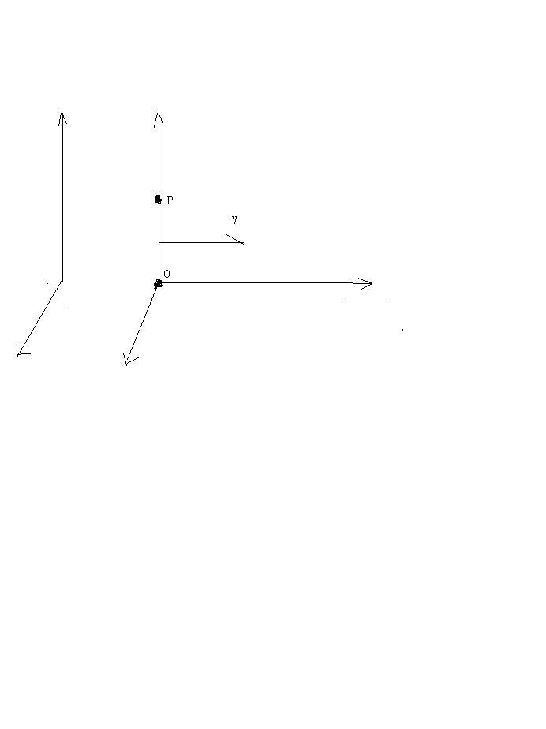

我们把o点到p点的失径看成是前面的时空方程中R，以R的长度r为半径，作高斯球面s包围o点。

o点周围4π角度里有n条空间运动速度C-V,
p点周围4π角度里有n’条空间运动速度C-V。

o点在p点的空间运动程度（n/4π）（C-V）/v【v是包围o点的高斯球面内的体积】，必然受到p点周围空间的运动程度（n’/4π）（C-V）的影响，而发生变化。

相对于我们观察者，o点对p点的作用力可以通过p点受到的惯性力来体现出来。

而p点的惯性力与角度4π内包含（C-V）的条数n’成正比，与p点周围空间运动状态的改变成正比。

所以，我们可以认为，o点受到p点的场作用力F，与o点在p点处的空间运动程度【就是o点在p点处产生的4种场的合场】随时间t变化成正比。

还与p点周围4π角度上含（C-V）的条数n’的比值n’/4π成正比。

F = [C (dn /dv )/dt](∮dn’/∮dΩ)( ∮T)

–[V(dn/dv )/dt ] (∮dn’/∮dΩ)( ∮T)

+ [n (dC/dt)/dv ] (∮dn’/∮dΩ)

– [n(dV/dt)/dv] (∮dn’/∮dΩ)

上式中∮dn’/∮dΩ表示p点周围有n’条C-V, ∮T表示角度从零到4π的变化周期为T。

[C (dn /dv )/dt](∮dn’/∮dΩ)( ∮T)是电场力，

–[V(dn/dv )/dt ] (∮dn’/∮dΩ)( ∮T)是磁场力

+ [n (dC/dt)/dv ] (∮dn’/∮dΩ)是核力

– [n(dV/dt)/dv] (∮dn’/∮dΩ)是万有引力。

三十一，解释牛顿三大定理。

动量概念最早来自于牛顿力学，牛顿力学包括三大定理和万有引力定理。

牛顿力学三大定理表述为：

1，任何物体【或者质点】试图保持匀速直线运动状态或者静止状态，直到有外力改变为止。

2，物体受到的作用力使物体加速运动时，所产生的加速度与受到的作用力成正比，与这个物体的质量成反比，且加速度方向和作用力方向一致。

3，一个物体对另一个物体施加作用力总是受到另一个物体大小相等方向相反的反作用力。

牛顿力学按照现代的看法应该是相对于某一个观察者的情况下才成立。

牛顿把物体的质量m和运动速度V定义为动量P = mV ,

仔细的分析一下，牛顿力学核心就是动量概念，我们现在用动量概念把牛顿三大定理重新表述一遍。

1，相对于某一个观察者，空间中任何一个质量为m的质点都有一个确定的动量mV，V为这个质点沿某一个方向直线运动的速度，也包括速度为零【动量肯定同时为零】的静止状态。

2，质点受到了外力的作用，会使动量发生变化，动量P 随时间t的变化率就是外力F =
dP/t = d（mV）/dt = m A

3，质点的动量是守恒的，在一个孤立的系统中，质点相互作用时，一个质点获得的动量总是另一个质点失去的，而总的动量是不变的。

在牛顿力学中认为质量m是不变量，而相对论认为质量是可以变化的，但是，相对论继承了牛顿力学的其他一些看法。

相对论的动量公式和牛顿力学形式是一样的，只是相对论中质量m是变量。

统一场论揭开质量的本质，因而可以彻底解释牛顿力学。

按照统一场论的看法，牛顿三大定理可以理解为：

1，相对于我们观察者，任何一个物体周围空间本身都以光速辐射式运动，单位体积内光速运动空间的运动量就是这个物体的质量。

2，力是改变物体运动、空间本身运动的运动状态的原因。

力定义为：力是物体在空间中运动【或者物体周围空间本身运动】的运动状态在某一个空间范围【或者某一个时间内】的改变量。

3，动量是物体在空间中的运动量和物体周围空间本身运动的运动量的合成，是一个守恒量，不同的观察者看到动量的形式不一样，而总的动量的数量不变，与观察者的观察无关。

三十二，证明惯性质量等价于引力质量

牛顿力学认为，惯性质量反映了物体不容易被加速的程度，而引力质量反映了加速别的物体的能力。

在以上的o点相对于我们观察者静止情况下，附近有一个质量为m’的o’点，受到o点的引力F的作用，会使o’点有一个指向o点加速度- A，并且

F = - m’A

牛顿在没有给出解释的情况下，把式F = - m’A中的惯性质量m’和式F = - (g m
m’/r²)【R】中的引力质量m’等同起来，有了下式：

A = - （g m /r²）【R】

r是R的数量，【R】沿R的单位矢量。这个就是人们常说的惯性质量等价于引力质量。下面我们来给出证明。

由前面的时空方程R =
Ct，将R对时间求导，结果是光速度C，如果光速是标量，再次对时间t求导结果是零。在统一场论中认为光速可以为矢量，光速作为矢量方向是可以变化的，再次求导结果不是零。

在这里，我们考虑的是引力场方程A = k g n
R/Ωr³中R的方向变化，而R的数量r不变。

方程A= k g n R/Ωr³可以写为A= k g n R/r Ωr²，我们在高斯面s
= Ωr²上适当的分割出一小块面积d（Ωr²） =
ds，恰巧只有一条几何点的矢量位移R = Ct 垂直穿过，这样n =1, 有方程：

A= k g  dn R/ r  d(Ωr²）=  k g  dR / r  d(Ωr²）

A 【r  d(Ωr²）】= k g  dR

a (r dS） = k g  dR

上式中a为引力场A的数量，dS为矢量面元，方向和R一致。

设R和矢量面元dS与高斯面s
=Ωr²的角度为θ，我们这里考虑的是R的方向变化，所以R和dS都是θ的函数，随θ的变化而变化，这样有方程：

a 【r dS（θ）】 = k g  dR（θ）

将上式左边的变量dS和右边的变量R同时对变量θ求微分，结果为：

a 【r  d(dS）】 = k g  d²R

上式也可以写为：

A = k g  d²R/ r d(ds） = k g  d²R/ r  d(dΩr²）

令dΩr² =
ds为矢量面元dS的数量，dS的方向和R一致，我们其实现在考虑的是r为一个固定值，在r的端点，也就是以上所说的空间p点，dR和dS之间相对应变化，这样引力场方程为：

A = k g  d²R / r  d(d s)

由于高斯面s =Ωr²，时空方程中r²= c²t²，所以

由A = kg  d²R / r d(dΩr²)可以导出A = k g  d²R /r dΩ c²t² = kg  d²R /
rΩ c² dt²

由于这里的立体角度Ω和r是固定量， k,
g，c是常数。所以上式合并常数后，在p点处的几何点的加速度d²R /
dt²可以等价于这里的引力场。这个表明惯性质量等价于引力质量。

三十三，解释开普勒定理

我们知道牛顿的万有引力定理是从开普勒定理中结合牛顿力学中的一些认识而推导出来的。我们在这里首先解释开普勒定理。

在以上的“三维螺旋时空方程”指出，相对于我们观察者静止的物体周围空间的运动是两种基本运动形式的叠加，是旋转运动和旋转平面垂直方向上直线运动的叠加。

为了解释开普勒定理，我们在这里把引力场和旋转运动空间联系起来。

设想在某一个时刻t’，几何点p（坐标为x,y）绕物质点o点（限制在xy平面内）旋转运动，由o点指向p点的矢径R，从时刻t’开始，到时刻t”，扫过的矢量面积为W,方向沿z轴，按照前面的“三维螺旋时空方程”W和z成正比关系，也就是：

W ∝ z

在时刻 t’, 我们观察一个几何点p从o点出发，以光速度C沿z轴匀速直线运动，按照前面的“时间的物理定义”，时间t与几何点P以光速C沿z轴走过的路程成正比，也就是：

z  = Ct

这样式W ∝ z可以改写为：

W ∝Ct，

由于C的数量为常数，C的方向明确在z轴上，有：

W ∝t，

上式表示由o点指向p点的矢量R扫过的面积和时间t成正比。把o点看成是太阳，几何点p看成是行星，式W ∝t表示由太阳指向行星的矢径扫过的面积和时间成正比，这个正是开普勒第二定理。

由上面的《引力场与高斯定理》，指出质点o周围引力场A可以表示为矢量面元dS 穿过几何点位移的条数，∮A·dS =
k n = 4πG m，G为万有引力常数。

由于包围o点的高斯面为s
= 4πr² ，r是由o点指向p点的矢径R的数量。引力场A可以表示为d²R/dt²，而dS环绕一周的积分结果和r平方成正比，所以由∮A·dS  =
4πG m可以导出：

r³/t²∝m

在牛顿力学范围内，物质点o点的质量m是一个常数，把时间t用周期T表示，有：

r³/T²∝常数

以上就是开普勒第三定理。

下面我们来解释开普勒第一定理：行星在一个平面上以椭圆轨道绕太阳旋转运动，太阳在其中一个焦点上。

按照统一场论的看法，相对于太阳静止的观察者认为，太阳周围的任意一个几何点p（和太阳的距离为r）会以一个适合的速度V（和R相垂直）绕太阳旋转运动，几何点的运动是均匀的，而且走过的轨道是一个正圆。

现在我们设想一个行星处于p点的位置，会不会一定和p点一样以匀速率以正圆形式绕太阳旋转运动呢？

这个还要考虑行星的初始状态，如果这个处于p点的行星本来有一个合适的运动速度v，以匀速率v绕太阳旋转运动，走过的轨道肯定是一个正圆。

如果处于p点的行星本来有一个速度-v（和R相垂直）绕太阳旋转运动，在太阳上（相对于太阳静止）的观察者认为，这个行星将以加速度-v²/r自由的落到太阳上。

如果处于p点的行星本来有一个小于v的速度（和R相垂直）绕太阳旋转运动，在太阳上（相对于太阳静止）的观察者认为，这个行星将以抛物线运动形式落到太阳上。

如果处于p点的行星本来有一个略大于v的速度（和R相垂直）绕太阳旋转运动，在太阳上（相对于太阳静止）的观察者认为，这个行星将以椭圆形式在一个平面内绕太阳旋转运动。

如果处于p点的行星本来有一个远远大于v的速度（和R相垂直）绕太阳旋转运动，在太阳上（相对于太阳静止）的观察者认为，这个行星将以双曲线离开太阳运动。

三十四，解释万有引力的本质。

万有引力给人类最困惑的问题是，宇宙中任意两个物体之间的引力是怎么产生的，又是怎么把引力传给对方的。

其实，万有引力的本质很简单。

举一个例子，一个汽车迎面向你驶来，驾驶员觉得自己是静止的，肯定认为你是迎面向汽车运动。如果一个汽车加速的向你驶来，驾驶员觉得自己是静止的，肯定认为你在加速地向汽车运动。究竟是你在运动还是汽车在运动，不重要，关键的、有意义的是汽车和人之间的空间在变化。

万有引力本质就是质点之间的空间运动变化，相对于我们观察者所表现出的一种性质.

两个质点之间的空间的运动变化和两个质点之间的相对运动本质上应该是一回事情。

人类被万有引力这个“力”字蒙住了眼睛，老是想力是什么东西，力到底是什么？越想越糊涂!

一个女孩从我面前走过，我说这个女孩很漂亮，一把小刀，我说很锋利，漂亮是我们对女孩描述出的一种性质，锋利是我们对小刀描述出的一种性质。力就是我们对物体之间相对运动描述的一种性质，力不是一个具体存在的东西，两个物体有相对加速运动趋势，我们就可以说他们之间受到了作用力。

设想一下，如果在中国，一个人手里拿一个小球，在某一个时刻，这个人把小球放下，小球从静止状态加速撞向地球，按照前面的看法，也可以说小球始终是静止的，是地球撞上了小球。

也许有人反驳，我们同时在我们对称的国家----巴西国家放一个小球，岂不是小球要加速地飞向空中？

这个反驳其实是需要一个前提：空间是静止和不动的，一切物体像鱼儿那样在静止的空间海洋里运动，空间的存在与质点的运动是不相干的。

关键的关键是：空间本身是时时刻刻在运动、变化的，空间和质点的运动是紧密的联系在一起的，至于空间为什么会运动，请参阅前面的《垂直原理》。

三十五，导出万有引力公式。

我们观察者站在地球上，相对于地球静止，在地球附近空中，放置一个物体，这个物体没有受到别的力的作用，纯粹只是受到地球的万有引力的作用，从静止状态开始做自由落体运动。

我们把这个物体设定为p点，用m表示这个物体的质量，地球设定为o点，用m’表示地球质量。

按照我们前面对牛顿三大定理的解释，p点受到o点的引力F可以表示为：

F = - m A

在前面的惯性质量等价于引力质量证明中，我们知道地球在p点产生的引力场A和p点的加速度是等价的，这样：

A = g m’R/r³

上式中g为万有引力常数，R是由o点指向p点的位置矢量，r为o点到p点之间的距离。

由式F = - m A和A = g m’R/r³导出万有引力公式：

F = - g m m’R/r³

由于万有引力指向观察者，所以为负值，以上告诉我们，万有引力的本质来自于相对运动，相互作用力本质也是一种惯性力。

我们把地球周围引力场A = g
m’R/r³看成是地球周围空间的运动程度，地球周围如果突然出现了另外一个质点p，质点p周围空间也会有地球周围空间同样的运动，这样，会引起地球周围引力场A
= g m’R/r³发生变化。

我们把地球受到p点的引力F理解为p点的质量m【m
正比于n/4π】使地球周围引力场发生变化的变化程度，

变化程度肯定是在角度为4π范围内，改变了n条A = g m’R/r³，所以，

F = - 常数乘以n/4π g（ m’R/r³） = - g m m’R/r³

三十六， 引力场与时空的波动性。

前面我们认定了引力场是物体周围空间以柱状螺旋式运动所表现出的一种性质，质点外的空间几何点的矢量位移随空间位置变化、又随时间变化可以反映出引力场场强A，物理量【这里是质点外的空间几何点的位移量】随空间位置变化又随时间变化，可以认为具有波动过程。

我们知道，波动和柱状螺旋式运动有很大的区别，波动是振动形式在媒质中的传播，而不像螺旋式运动是质点在空间中移动。但是对于空间这个特殊的东西，两种运动却可以兼容。

一个几何点运动不会有波动效应，但是，一群几何点情况就不一样了。由于空间中一个几何点和另外一个几何点绝对没有区别，因而可以断定，空间的柱状螺旋式运动里面包含了波动形式。

下面我们由前面的时空同一化方程R(t) = Ct = x i+ y j + z
k 来推导出时空的波动方程，并且指出引力场和时空波动之间的关系。

设想宇宙空间某一处存在一个质点o，相对于我们观察者静止，根据前面的时间物理定义和时空同一化方程，o点和观察者的时间t可以用o点周围一个几何点p的位移R(t)  =
Ct = x i+ y j + z k 来表示。

我们将R对时间t求导数，有结果：

dR/dt = C

将上式两边平方，有结果：

dR·dR/dt² = c ²

c是矢量光速C的数量。

我们现在来考虑另外一个几何点p',  p'点在0周围运动，我们用L表示其位移，L随时间t变化，是时间t的函数，由R和t的关系可以断定L又是R的函数。

我们将几何点p'点的位移L对对空间位移R两次求导数，有结果：

∂²L/ (dR·dR) = ∂²L/  c ² ∂t²

∂²L/ ∂r² = ∂²L/  c ² ∂t²

这个波动方程也可以用散度表示为▽²L = ∂²L/c²∂t²

∂²L/∂x² + ∂²L/∂y² +∂²L/∂z² = ∂²L/c² ∂t²

r是矢量R的数量。以上微分号d已经改为偏微分号∂。

对偏微分方程 ∂²L/∂t²=c²∂²L/ ∂r²求解，通解为：

L(r,t) = f(t - r/c)+g(t + r/c)

f和g表示两个独立的函数，方程 L(r,t) = f(t -
r/c)可以认为是几何点从物质点o出发向外行进的波，而方程 L(r,t) = f(t +
r/c)传统认为在物理上是不存在的，被认为是从无限远处汇聚到o点的波，对于普通介质，似乎是没有这种物理意义的，但是，对于空间这种特殊的介质，却有物理意义的。这个实际上可以解释负电荷的来源，这个以后详细再讲。

以上方程也包含了以o点为中心向四面八方直线运动形式，和从四面八方直线汇聚到o点的运动。

方程 ∂²L/∂t²=c²∂²L/ ∂r²有两个特解L = a cosω（t–r/c）和L= a
sinω（t–r/c）满足这个方程。

上面的波动速度c是光速，时空的波动是横波。

统一场论认为引力场是这个空间波动的根源，质量是空间相对于我们观察者运动所表现出的一种性质，电磁场是波动的传播，传播的速度就是光速。

物体周围时间、空间的存在是一个波动过程，波动的速度就是光速，空间几何点的位移随时间变化和随空间位置的变化可以反映出物体周围万有引力场分布情况。

物体周围的万有引力场的本质也可以认为是空间相对于我们观察者波动所表现出的一种性质。

三十七,  统一场论真空静态引力场方程。

由以上分析，我们提出一个有别于广义相对论的静止质点周围引力场场方程。

由前面提出的引力场定义方程，借助场论中的高斯定理，可以把万有引力场用散度概念表示，设o点的质量m和一个包围o点的曲面s= 4πr²内体积v的之比为u, 当我们考察s和v趋于无限小的情况下，则万有引力场方程A
= k n R/ Ωr³可以表示为：

▽·A =  4πg u                 （1）

g为万有引力常数，上式表示在体积v内包围了运动几何点矢量的条数的多少反映了质点o的质量大小。

对于o点周围空间【不包括o点】中任意一个几何点p，引力场的散度为0，

▽·A = 0        （2）

还有，引力场【包括o点】的旋度也是0，

▽×A = 0        （3）

以上（2）、（3）方程刻画了相对于观察者静止的质点周围引力场的基本性质，方程（1）描述了场和静止场源之间的关系，这个三个方程可以取代爱因斯坦的引力场方程，完全揭示了万有引力和引力场的一切基本性质，从这三个方程出发，可以推导出万有引力定理。

三十八，物体质量的叠加。

以地球和月球为例，统一场论认为，物体周围空间的运动有旋转运动和直线运动两种形式，如果把引力场和旋转运动联系起来，地球和月球周围空间的逆时针旋转情况（就是几何点的运动周期和运动半径）可以反映出地球和月球的质量。

地球和月球之间的空间都以逆时针旋转，相互接触的地方，方向相反，要抵消一部分空间，地球和月球之间的空间有减少趋势，表现为地球和月球相互吸引。

当月球向地球靠近，最后如果落在地球上，和地球合二为一变成一个星球，周围的逆时针旋转空间的运动将叠加，这个就是物体质量能够叠加的几何解释。

四十，电场和电荷的定义方程。

质点o如果带有电荷q，在周围产生电场E，电场的实质反映了单位时间内、单位体积内o点周围空间以光速度C运动的运动量,和引力场比较起来就是多了时间因素。

在质点o周围空间中，引力场A = g m R /r³ = g k n
R/Ω r³中质量m随时间t变化产生电场：

E = k’(dA/dt）= k’g(dm/dt) R/r³ = k’g[k d(n/Ω)/ dt] R / r³

k’为常数。而o点的电荷q表示单位时间内o点质量的变化量，反映了在单位时间里o点周围光速运动空间几何点越过某一个界面的位移的条数。

q  = 4πε。k’g(dm/dt) = 4πε。k’g [k d(n/Ω)/ dt]

ε。为介电常数。

以上是电荷的几何定义方程，4π, g,ε。,k’都是常数，合并常数，把上式带入式 E
= k’g(dm/dt)R/r³中可以导出库伦定理中的电场强度方程：

E = q R/ 4πε。r³

统一场论中认定了粒子带有电荷是因为粒子周围空间本身时刻以圆柱状螺旋式运动造成的。

我们知道圆柱状螺旋式运动可以分解为旋转运动和旋转平面垂直方向直线运动。

粒子带有正电荷在周围产生正电场，是由于粒子周围空间直线运动部分相对于我们观察者，以粒子为中心、以光速向四周发散运动，旋转部分是逆时针旋转，所造成的。满足右手螺旋。

粒子带有负电荷在周围产生负电场，是由于粒子周围空间直线运动部分相对于我们观察者，以光速从无限远处的空间向粒子汇聚而来，旋转部分也是逆时针，所造成的。同样满足右手螺旋。

.. image:: media/image10.png
   :alt: 负电荷.png
   :width: 4.48063in
   :height: 4.33477in

带电粒子周围空间柱状螺旋式是粒子带电的原因，我们知道柱状螺旋式运动是旋转运动和旋转平面垂直方向直线运动的叠加，对于带电粒子周围空间的旋转运动部分，我们可以用右手定则来说明。

我们在正点电荷周围作许多由正电荷指向周围空间的射线，我们用右手握住其中任意一条射线，并且大拇指和射线方向一致，则四指环绕方向就是正点电荷周围空间的旋转方向。

我们在负点电荷周围作许多由任意空间指向负电荷的射线，我们用右手手握住其中任意一条射线，并且大拇指和射线方向一致，则四指环绕方向就是负点电荷周围空间的旋转方向。

面对我们观察者，正电荷周围空间是逆时针旋转的。

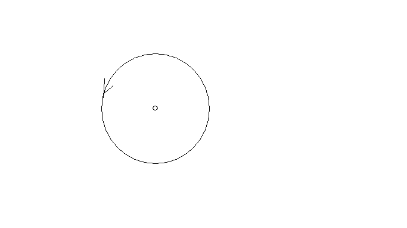

面对我们观察者，负电荷周围空间是顺时针旋转的。

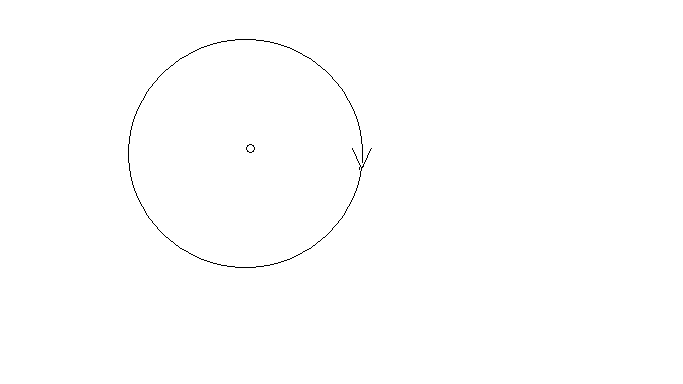

四十三，电场的两种形式。

上面指出，在质点o周围空间中，引力场A = g m R /r³ = g k n
R/Ω r³中质量m随时间t变化产生电场：

E = k’(dA/dt）= k’g(dm/dt) R/r³ = k’g[k d(n/Ω)/ dt] R / r³

在这一节中我们拓宽对电场的认识。认为引力场A = g m R /r³
随时间t变化产生电场：

E = k’(dA/dt）

= k’g(k dm/ dt])R / r³ + k’g m (dR/dt)/r³

=  k’g(k dm/ dt) R / r³ + k’g m C / r³

以上方程明显看出电场有两种形式。下面我们将看到，电场的两种形式，和我们掌握的电场性质都是吻合的。

四十，解释电荷的相对论不变性

由以上电荷的几何定义方程 ：q  = 4πε。g  k’(d m
/dt)我们很容易解释电荷的相对论不变性，解释电荷不随速度变化的原因。

当质点o以速度V相对于我们运动的时候，质量m增大了一个相对论因子√（1-
v²/c²），用m’表示运动质量，而时间dt由于时间的相对论性膨胀效应会随着速度V增大一个相对论因子√（1-
v²/c²），也就是：

d m' = d m √（1- v²/c²）

用dt’表示运动参考系一段时间，这样m和dt都增大一个相对论因子√（1-
v²/c²），结果d m /dt不随速度V而变化，而4πε。g
k’都是常数，所以q不随速度V变化。数学表示为：

dm/dt = d【m’[√（1- v²/c²）]】/dt’ [√（1- v²/c²）]

= [√（1- v²/c²）] dm’/dt’ [√（1- v²/c²）]

= dm’/dt’

四十一，电荷、电场与高斯定理。

利用高斯定理可以更加清楚的刻画电荷、电场的几何形式。前面的电场几何方程中，电荷o点带有电荷量q，在周围空间p处产生的电场E【由o指向p的矢径为R】为：

E = k’(dA/dt）= k’g(dm/dt) R/r³

= k’g[k d(n/Ω) / dt] R / r³

我们现在考虑E ，k’，g，[k d(n/Ω) / dt]不变，R和r³之间的变化情况。

E = k’g[k d(n/Ω)/ dt] dr【R】/ 3r²

E = k’g k （d/ dt） (n/Ω)dr【R】/ 3r²

【R】为沿R方向的单位矢量，r是矢量R的数量。注意：以上的沿R方向单位矢量【R】不随r变化。

当我们再考虑方程E = k’g k （d/ dt）(n/Ω)dr【R】/
3r²中n和Ω相对变化的时候，有方程：

E = k’g k （d/ dt）dn dr【R】/dΩ 3r²

令3dΩ r² =
dS，单位矢量【R】 和矢量面元dS【dS的数量为ds】的方向一致，这样有下式：

E = k’g k （d/ dt）dn dr【R】/ds

现在我们再考虑另一种情况，高斯面s =
4πr²中r不变，我们把dr设定为常数1，在仅仅是dn和dS之间的相对变化的情况下，上式也可以写为：

E· dS   = k’g k （d/ dt） dn

注意dS、E的方向和【R】一致，把上式两边在高斯球面上积分，结果为：

E·dS = k’g k （d/ dt） n =  q/ε。

n为高斯球面s = 4πr²上穿过的矢量R =
Ct总的条数。把上式在直角坐标xyzo上展开。设E 在坐标上的分量为Ex,Ey,Ez 。

矢量面元dS的分量dydz i, dxdz j , dydx k ，由高斯定理得：

∫∫∫v（∂Ex/∂x + ∂Ey/∂y + ∂Ez/∂xz ）dv

=∫∫s Ex dydz +Ey  dxdz + Ez  dydx  = k’g k （d/ dt） n = q/ε。

上式直接的物理意义是：

方程∫∫s（Ex dydz  ）+（Ey dxdz）+（Ez dydx） =  k’g k （d/
dt） n 告诉我们，电场可以表示为单位时间内、单位面积s上垂直穿过几何线的条数。

而方程∫∫∫v（∂Ex/∂x + ∂Ey/∂y + ∂Ez/∂xz ）dv =  k’g k （d/
dt） n告诉我们，在运动变化的空间中，电场也可以表示为单位时间内高斯球面内接球体积v内包含的运动几何点位移的条数。

当这个体积v发生很微小的变化，变化的部分可以看成是v的界面，可以用曲面s表示，在v上电场的分布情况可以保留在s上，由v上的电场分布情况可以求出s上的电场分布。

这个意味着电场是物体周围空间相对于我们观察者以光速连续向外辐射运动所表现出的一种性质。

把上式用散度概念表示，设o点的电荷和包围o点的高斯曲面s内体积v的之比为u’, 当我们考察s和v趋于无限小的情况下，则式

q/ε。=E·dS =∫∫s Ex dydz +Ey dxdz + Ez dydx

可以表示为：

·E = u’/ ε。

上式表示在单位时间内、体积v内包围了运动的几何点的位移线R =
Ct的条数反映了质点o电荷的大小。

如果有许多空间几何点连续不断的从无限远处越过高斯曲面s垂直穿进来，汇聚到o点，形成许多几何点的位移线，则这些位移线的条数反映了o点是负电荷，反之是正电荷。

在我们观察者面前，两个点电荷，周围空间逆时针旋转的是正电荷，周围空间顺时针旋转的是负电荷。

四十二，推导出库仑定律。

库仑定律表述如下：相对于我们观察者，真空中两个静止的点电荷q(电量为q1)q’（电量为q2）之间的作用力F和他们的电量的乘积成正比，和他们之间的距离r 的平方成反比，作用力的方向在它们之间的连线上。电荷有正有负，同号电荷相互排斥，异号电荷相互吸引。

数学公式为;

F = (k q1 q2/r²)【R】= q1 q2 R/4πε。r³

其中k为比例常数，ε。为真空中的介电常数 ,
r是矢量R的数量，【R】是沿R的单位矢量。

库仑定律是实验总结出的定律，统一场论可以对其做出解释。

以前面的点电荷o点为例，按照前面“电荷、电场的定义”，当o点相对于我们观察者静止，它具有电量q1，是指o电荷周围【也就是在角度4π内】单位时间t内产生了n条几何点的位移矢量R
= Ct。

q1 = k n /4πt

k为常数，o点在周围产生的电场E为：

E = q1 R/4πε。r³

当o点附近突然的出现另一个电荷o’点，它具有电量q2指o’电荷周围【也就是在角度4π内】单位时间t内产生了n’条几何点的位移矢量R
= Ct。

q2 = k n’ /4πt

o’点的出现，使o点周围本来的空间运动的运动状态发生变化,也就是o’点使o点周围的电场E
= k n R/4πr³t发生变化。

如果我们观察者静止于o点，站在o点处观察，把o点受到o’点的库伦电场力F理解为o’使o点周围【也就是在4π范围内】在t 时间内n’条【为什么是n’条，因为o’点周围有n’条电场线】电场矢量E发生变化。这样，F与电场E的变化量n’E成正比，与4π、

t成反比。

F = 常数乘以n’E/4πt

= 常数乘以n’q1 R/4πε。r³4πt

由于常数乘n’/4πt = q2

这样我们就得到了库伦定理  F  = q1 q2 R/4πε。r³

四十三，从统一场论导出磁场是电场相对论效应。

在以上的统一场论动力学方程

F = dP/dt = Cdm/dt - Vdm/dt + mdC/dt - mdV/dt

中，(C- V)dm/dt =  Cdm/dt
- Vdm/dt是质量随时间变化的力，简称加质量力，统一场论认为是电磁力，其中Cdm/dt 是电场力，Vdm/dt是磁场力，

按照统一场论的看法，以上的o点静止的时候，具有质量为m’，如果受到了别的电荷的电场作用，受到的静电场力为 F静 =
Cdm’/dt’，

当o点相对于我们以速度V运动的时候，具有质量为m，沿V平行方向受到了电场力F
= Cdm/dt，注意，t和t’是不一样的。

沿V垂直方向方向，受到了电场力

f =【 c√（1- v ²/ c²）】dm/dt，

以上结论和相对论是一致的。v是V的标量，f是力F的标量。

我们还可以求出电场变换。

令γ = 1/√（1 -
v²/c²），o点以速度V相对于我们观察者运动，沿V垂直方向，o点受到的电场力可以写为

F =【 c√（1- v ²/ c²）】dm/dt

=γ 【 c√（1- v ²/ c²）】【 √（1- v ²/ c²）】dm/dt

= (1- v ²/ c²)γc dm/dt，

=(γc dm/dt) – (v ²/ c²)γc dm/dt

当o点相对于我们以速度V运动的时候，以上的γc
dm/dt被认为是o点受到的电场【用E表示】力， (v ²/ c²)γc
dm/d可以认为是受到的磁场【用B表示】力。

用qE表示电场力γc dm/dt，则磁场力(v ²/ c²)γc dm/d为

qE(v ²/ c²)

如果我们认为电荷o受到的磁场力归结以下三个因素：

1，  与o的电量q成正比。

2，  与o的运动速度v成正比。

3，  与o受到的磁场B的作用成正比。

则B的大小应该等于E/c²乘以速度v，由于v和E相垂直时候B值最大，所以应该是叉乘，也就是：

B = V ×E /c²

以上告诉我们加质量力和电磁场力都满足于相对论变换，这个是证明了加质量力就是电磁场力的一个强有力的证据，也表示相对论和统一场论的在磁场是电场相对论效应上看法是一致的。

四十四，磁场的几何形式方程。

前面分析指出，随时间变化的引力场产生电场。人类已经发现，带电粒子相对于我们观察者以速度V运动的时候，可以引起V垂直方向上电场的变化，电场变化的部分我们可以认为就是磁场，也就是随速度变化的电场产生了磁场，统一场论继承这种看法。

设想一个相对于我们观察者静止的o点，质量为m，带有电荷q，在周围空间p处产生了静电场E，由o点指向p点的矢径为R，我们以R的长度r为半径作一个高斯面s
= 4πr²【内接球体体积为4π r³】包围o点，则：

E = q R/4π ε。r³ = k( dm/dt)R/4π ε。r³

k是常数。

当o点相对于我们以速度V运动的时候，可以引起电场E的变化，变化的部分我们可以认为是磁场B，很简单的想法是电场E乘以速度V就是磁场B ，由于速度V和电场E相互垂直时候，产生的磁场最大，因而它们之间是叉乘，所以有以下关系，

B = 常数乘以（V ×E）

由电场E的几何形式方程 E = q R/4π ε。r³ =  k( dm/dt)R/4π
ε。r³，可以求出磁场B 的几何形式方程，

B = 常数乘以【V ×（q R/4π ε。r³）】 = 常数乘以【V ×k( dm/dt)R/4π ε。r³】

合并常数，以上与磁场B相关的常数用磁导率μ表示，由于我们这里讨论的是在真空情况下，所以用真空磁导率μ。表示。

B = μ。【V ×k( dm/dt)R/4π r³】

以上就是真空中磁场的几何形式方程。这个方程和电场、磁场相互关系满足的方程 B
= V ×E /c²是紧密联系在一起的。

B =μ。【V ×k( dm/dt)R/4π r³】

= μ。【V ×（q R/4π r³）】

= μ。【V ×ε。（q R/4π ε。r³）】

= μ。ε。【V ×（q R/4π ε。r³）】

= μ。ε。（V ×E）

在电磁学中，认为真空中磁导率μ。和介电常数ε。的乘积是真空中光速c的平方的倒数【这个是人为规定的】，所以以上方程可以写为：

B = V ×E /c²

以上方程反映了电场和磁场的基本关系。从这个方程加上时空同一化方程r² =
c²t²可以导出麦克斯韦方程中变化磁场产生电场、变化电场产生磁场。

注意，以上的磁场和运动电场都没有考虑相对论效应，只是在V很小或者等于零的情况下成立。

在静电场方程中乘以Ψ就是电场的普遍形式，Ψ 为相对论效应修正相,

Ψ = （1- v²/c²）/【√[1-
(v²/c²)sin²θ] 】³，其中θ为R和x轴的夹角。电场方程乘以相对论修正相Ψ，不影响电场和磁场之间的关系。

四十五，磁单极子不存在。

统一场论认为，一个相对于我们静止的带电粒子O点，在周围空间产生静电场，当O点相对于我们观察者以速度v匀速直线运动，可以产生磁场，这个磁场的本质就是空间以矢量速度v为轴心在旋转。当O点以匀速圆周运动时候，空间的旋转运动在这个圆周的正反两个面上一进一出，进的一面是S极，出来的一面叫N极。

从磁场这种几何形式来看，自然界不存在有磁单极子的。

四十六，核力场和核力定义方程。

所有的场都是引力场变化而来的。核力场和电磁场一样也可以认为是引力场的变化而产生的。

电场是引力场中的质量随时间变化而产生的，核力场所不同的是引力场几何点的位移随时间变化而产生的。

引力场A = g m R /r³ = g k n R/Ω r³中R = Ct随时间t变化，产生核力场

D = g m (dR/dt) /r³ = g m C /r³= g k n C/Ω r³

相对于观察者，物质点o周围空间p处在一小块体积Ω r³上穿过几何点的光速度C的条数为1， C和Ω r³的比值反映了o点在p处产生的核力场强。

统一场论给出了核力方程是：

F =  m’ m( dC/dt)/ r³

一个质量为m相对于我们静止的粒子o点，附近一个质量为m’的粒子o点，它们之间有核相互作用力F，与他们的质量的乘积成正比，与他们之间的距离的立方成反比。

核力来自于原子核内的质子和中子，而质子和中子总是在运动中，所以，以上公式不能直接使用，需要推广在运动粒子上才可以使用。

四十七，统一场论能量方程：

1，能量的定义：

能量是质点在空间中【或者质点周围空间本身】相对于我们观察者在某个空间范围内【由于时空同一化，也可以说在某一个时间段内】运动的运动量。

空间、物质点、观测者、运动四个条件一个都不能少，否则，能量就失去了意义。

单独存在的空间，没有包含物体在里面是没有能量的，没有观察者，或者没有指明哪一个观察者，能量就不能确定。

2，统一场论能量方程

将统一场论动量方程的标量形式m’c = mc√（1 -
v²/c²）两边乘以标量光速c，就是统一场论能量方程：

m’c² = mc²√（1 - v²/c²）

m’c²为o点静止能量，

o点相对于我们以速度v运动能量mc²√（1 - v²/c²）和静止能量m’c²是相等的。

（m - m’）c² = Ek,

其中Ek≈（1/2）mv²为牛顿力学的动能。

m’c²为o点的静止能量，这个和相对论的看法一致，mc²√(1-
v²/c²)为o点以速度v运动的时候的能量，这个和相对论的看法稍稍不同，相对论认为o点以速度运动的时候能量为mc²，这样相对论认为o点静止时候的能量m’c²和以速度v运动的时候能量mc²是不一样的。

而统一场论认为o点以速度v运动的时候能量mc²√(1-
v²/c²)和静止能量m’c²是相等的，统一场论这种看法表明质点能量的量必须相对于一个确定的观察者才有意义。

而o点静止的观察者发现o点能量为m’c²，而o点以速度v运动的观察者发现o点能量为mc²√(1-
v²/c²)，无论哪一个观察者都不可能观察到o点能量为mc²。

统一场论强调了不同的观测者，看到了能量有不同的表现形式，而总的能量的数量与观测者无关，这种观点应该比相对论的观点要合理一些。

我们可以设想，一个质量为m的火车相对于我们地面的观测者以匀速度V【V的数量为v】直线运动，地面的观测者认为这个火车有动能mv²/2
，而火车上的观测者认为火车的速度为零，因而动能为零。所以讲，现代物理学认为动能相对于不同的参考系是不守恒的，一个物体具有的动能在不同的观测者看来是不一样的。

但是，统一场论有着不同的看法。统一场论认为一个物体具有能量在相互运动的观测者看来数量是一样的，能量对于不同的参考系仍然是守恒的。不同的观察者看到的只是粒子运动形式有所不同，而粒子总的能量是不变的。

3，统一场论能量方程和经典力学动能公式的关系。

经典力学认为，一个质量为m的质点o点相对于我们观测者以速度V【数量为v】运动时候，在我们观测者看来，具有动能 Ek
= 1/2 mv²。

将统一场论能量方程

e = mc²√(1- v²/c²)中√(1- v²/c²)用级数展开为

1- v²/2c²·····

略去后面的高次项，

e ≈ mc²- mv²/2

由e = m’c²可知mv²/2≈ mc²- m’c²
=c²（m- m’），这个表明经典动能是物体以速度v运动的时候引起静止质量发生变化的变化量。

一个相对于我们观测者静止的质点质量为m’，相对论认为有一个静止能量E =
m’c²，意思是指这个质点周围n条几何点的光速的平方，n的大小取决质量m’。

4，统一场论中动量和动能之间的关系。

统一场论的静止动量P’ = m’C

运动动量为P = m（C- V），标量式为p = mc√（1-v²/c²）

统一场论认为质点的静止动量的数量和运动动量是相等的。

p = mc√（1-v²/c²）= m’c

m’为物体o点静止质量，m是o点以速度V【标量为v】运动时候的质量。

统一场论给出的能量方程认为质点o静止时候具有能量m’c
²，以速度v运动的时候具有能量mc²－Ek，并且：

mc² － Ek = m’c ²

其中Ek ≈（1/2）m v² 为o点的动能。

利用以上公式，可以求出动能Ek 和动量 p之间的关系，

把式mc² － Ek = m’c ²中m’c ²用p²= m’²c² 换掉，有：

mc² － Ek = p²/m’

对于光子，静止质量m’= 0，式mc² － Ek = m’c²中的

m’c ² = 0

由此导出光子的动能Ek = mc²

统一场论能量方程m’c² = mc²√（1 -
v²/c²）除以光速c，得到了统一场论的动量方程mc√（1-v²/c²）=
m’c，按照这种思想，我们把光子的能量方程e =
mc²除以光速c得到光子的动量方程：

p = mc

矢量式为P = mC

光子的动量p和能量e满足以下关系：

P = e/c

可以看出统一场论给出的能量公式和相对论有相同部分，也有不同部分。

四十八，随时间变化的引力场产生电场。

电场和引力场都是物质粒子周围空间运动形成的。物质粒子周围空间运动的位移量是空间位置的函数，将几何点位移量对空间位置求导反映出的特性就是引力场。

物质粒子周围空间运动的位移量既是空间位置的函数，又是时间的函数，反映出的特性就是电场。

我们知道，物理量（这里指运动空间的位移量）既是空间位置的函数，又是时间的函数，肯定是一个波动过程，这个表明电场就具有波动性。

电磁场和引力场合作一起就是柱状螺旋式和波动叠加的运动空间，引力场是波动的根源，电磁场是波动的传播。空间本身具有波动性，波动的速度就是光速。

当一个物质粒子相对于我们静止，周围空间就具有了波动性。当这个物质粒子相对于我们加速运动，导致周围空间的运动形式发生扭曲，这个扭曲形式仍然以波动形式（波动速度为光速）向外传播，麦克斯韦方程组反映了这一点。

电荷和质量比起来就是含有了时间因素，空间几何点的位移随空间位置变化的变化率反映了引力场的大小，直线运动的几何点的位移方向反映了引力场方向。

空间几何点的位移随空间位置变化又随时间变化，变化率反映了电场的大小和方向，电场中，几何点的位移既是空间位置的函数又是时间的函数。

知道了质量、引力场和电荷、电场的本质，就可以很容易知道电场和引力场满足的一种基本关系：

在质点o周围空间中，随时间t变化的引力场A = g m R /r³ = g k n
R/Ωr³可以产生电场：

E = k’(dA/dt）= k’g(dm/dt) R/r³

质量m随时间t变化就是电荷q，

q  = 4πε。k’g(dm/dt)

也可以用散度表示为：

∂/∂t ·A = k·E

k为常数。

四十九，变化电磁场产生引力场

随时间变化的磁场产生引力场

统一场论核心是：随时间变化的引力场可以产生电磁场，随时间变化的电磁场也可以产生引力场。

这里介绍的是：随时间变化的磁场产生引力场情况。

相对论和电磁学认为，一个相对于我们观测者静止的点电荷o,在周围空间某处p点产生了静电场E, 当o点相对于我们观测者以速度V运动，o点在p处还产生了磁场B，p处的合场为E + V×B.其中E和B满足以下关系：

B = V×E/c²

传统的看法是物质点周围的空间与物质点是不相干的，统一场论把物质点周围空间与物质点的运动状态联系在一起。

统一场论认为，当以上的o点相对于我们观察者以速度V运动时候，我们观察者认为p处也有一个速度V 。p点在统一场论中被看成是几何点，当o点相对于我们以加速度A运动时候，p点也具有一个加速度A。这个加速度在统一场论中是几何点的加速度，而统一场论认为几何点的加速度就是引力场，由此认定p点的加速度A就是引力场。

当o点相对于我们加速运动，找到了p点的加速度A和电磁场E、B的关系，就找到了加速变化的电磁场和引力场之间的关系。

为此，我们将式B = V×E/c² 对时间t求导，有下式：

dB/dt = dV/dt ×E/c² + V×（d E / dt ）/c²

认定A是加速运动电荷o在p处产生一种由随时间变化的电磁场转化的引力场。

如果在这种情况下，电场E不随时间变化，或者说我们只考虑B 和V 随时间变化时相互对应关系，上式可以写为：

∂ B /∂t = A×E/c²

用语言描述上式是：随时间变化的磁场可以产生和磁场环绕的平面相垂直方向的引力场。这样，加速运动点电荷o在周围空间p处的引力场A’等于

A’ = A- A静

上式告诉我们，加速运动点电荷o周围空间p处的引力场A’ 包括：o静止本来就有万有引力场 -A 静和随时间变化的磁场产生的引力场A两部分。

o在p处产生的磁场B、引力场 A、电场E的关系dB/dt =  A×E/c²
如下图所示填写图片摘要（选填）

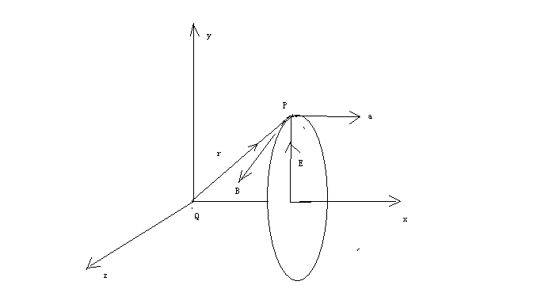

我们需要注意的是，由电磁场变化而产生的引力场是关于平面对称的，而万有引力产生的引力场是关于点对称的，这个是二者主要的区别，这个也是电磁场力产生的重引力力不能够直接和万有引力产生的引力场力相互作用的原因。

电磁场和引力场之间的关系，万变不离其宗，都是物质粒子周围空间相对于我们观测者不同的运动形式之间的关系。一句话，电磁场和引力场都是变化空间的不同形式。

现在我们来讨论一下任何利用变化电磁场产生引力场问题。

统一场论预言了：

1，穿过有限曲面的磁场发生变化的时候，产生磁场垂直方向的、沿曲面边缘线分布的环绕线性电场和引力场。并且，这个时候，在空间一点上，变化磁场、产生的电场、引力场三者相互垂直。

2，加速运动的负点电荷产生与加速度方向一致的连续分布的反引力场，并且产生了产生了加速度方向垂直的、对称分布的反引力场。

这种对称分布的反引力场可以抵消物体因万有引力而产生的引力场，进而使物体的质量消失。

3，匀速直线运动的点电荷，在运动速度垂直方向的平面上，产生了平面分布的引力场。

我们有个疑问，自然界有没有天然存在的反引力场物体？答案是没有的，设想我们太阳系附近有反引力场物体，这些物体和太阳、地球及其他星体相互排斥作用，若干年后，这些反引力物体会被挤出太阳系，这样的结果是宇宙中反引力物体将和普通引力场物体生活在不同的空间区域，各过各的日子，互不相干。

1，加速运动点电荷的变化电场产生引力场

设想一个相对于我们观测者静止的点电荷o,带有电量为q的正电荷，在o点周围空间中一个几何点d处，产生了
静电场E

当o点相对于我们以加速度a加速运动，几何点d相应的会有一个加速度a ，按照前面引力场定义，几何点d所在的位置，会产生引力场
–a【矢量形式用A表示】。

我们来求出电场E、E的变化形式Eθ和引力场-a之间的关系。

现在设想点电荷o相对于我们观测者一直静止在笛卡尔坐标系的原点，从时刻t =
0开始以加速度A【数量为a】沿x轴正方向作直线加速度运动。

在时刻t =τ时，o点的速度达到了v =
aτ,以后就以速度v继续作匀速直线运动。如下图所示：

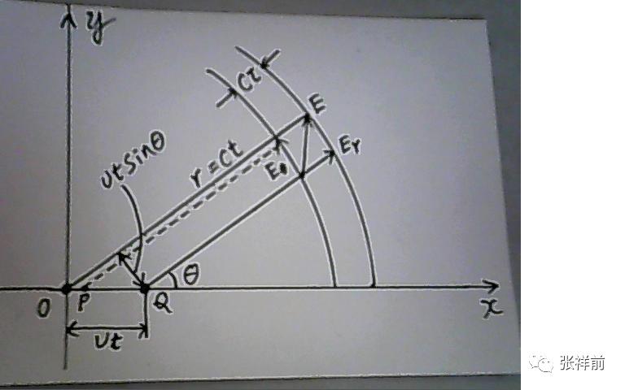

为了简单起见，我们考虑的是v远远小于光速c，下面我们考虑在任意时刻t(t远大于τ)时电荷o周围的电场分布情况。

在0-τ这一段时间内，由于电荷o的加速运动，它周围的电场线会发生扭曲，并且这个扭曲状态会以光速c向外延伸，统一场论明确的指出，电场线就是电荷周围以光速运动的几何点的运动。

以上的扭曲状态以光速向外运动，这个就像一个向四周匀速喷水的水龙头，一旦水龙头抖动一下，引起水流发生扭曲，这个扭曲状态肯定的以水流的速度向外延伸。

在t=τ时候，点电荷o停止了加速，处于x轴上的p点，由加速运动电荷o引起的电场的扭曲状态以光速c向外延伸，在上图中可以看到扭曲状态厚度为cτ，夹在两个球面之间。

这两个球面其中的后一个球面，在t时刻已向四周传播了c（t-τ）这么远的距离，结果是以p点为中心，直径为c（t-τ）的球面。

这两个球面其中的前一个球面，在t时刻已向四周传播了ct这么远的距离，结果是以o点为中心，直径为ct的球面。

由于从时刻t=τ开始，电荷o作匀速运动，所以在这球面内的分布的电场应该是作匀速直线运动的电荷的电场。

根据我们前面的设定，电荷o的运动速度v远远的小于光速c,,所以这球面内的电场在任意时刻都近似为静电场。

在时刻t,这一电场的电场线是从此时刻o点所在位置Q引出的沿半径方向的直线。

由于t远大于τ，c远大于v，所以ct远大于1/2vτ(即从o点到p点的距离)。因此，扭曲状态的前、后沿的两个球面几乎是同心圆。

随着时间的推移，以上的扭曲状态的半径（ct）不断的扩大，以光速向外延伸、传播。

我们从电荷、电场定义方程知道，电场线发生扭曲，不会改变电场线的条数，所以在扭曲状态的前后两侧面的电场线的条数是相等的。

在v远小于c时候，这个扭曲的电场线可以当直线来看待。

我们选用与x轴成θ 角的那一条电场线来分析。

由于从o点到p点的距离op比r =
ct要小得多，我们可以把o点和p点看作为一点(，也就是op接近于零)。

而oQ =vτ/2+v(t-τ) ≈ vt

扭曲区内的电场E可以分成两个分量Er【径向电场，本来就存在，其数量为er，】和Eθ【横向电场，可以看成是Er的变化形式】。

由上图可以看出

Eθ/er= vtsinθ/cτ= atsinθ/c = a r sinθ/c²

由于引力场可以用-a表示，我们用矢量A来表示引力场，所以有：

Eθ/er= -A×R/c²

上式中由o点指向几何点d的位置r =ct改用矢量R来表示。

上式也可以写为：

Eθ/er= R×A/c²

以上电场Eθ垂直与电磁场的传播方向（这里是Er的方向），并且只有在扭曲状态中存在，所以，它就是o电荷加速运动时候所产生的横向电场。Eθ可以看成是电荷因为加速运动引起了Er的变化。

上式给出了电荷o静止时候本来就存在的电场Er、加速运动引起Er的变化形式Eθ、加速运动电荷o产生的引力场A三者之间的关系。

2，加速运动点电荷的变化磁场产生引力场

按照麦克斯韦方程，电场在真空中变化，必然产生变化的磁场。

统一场论、相对论都认为，电荷o以速度V运动的时候，电场E和磁场B满足一种基本关系：

B = E ×V/ c²

因为电荷加速运动而变化产生的横向电场Eθ和变化产生的横向磁场Bθ所满足的关系，没有跳出B
= E ×V/ c²

只是这个时候，运动速度V不是电荷的运动速度，而是加速电荷产生横向电场和横向磁场的传播速度，这个传播速度也就是电磁波【电磁波的本质就是加速电荷产生横向电场和垂直方向上的横向磁场】的传播速度，也就是矢量光速C。

所以有式：

Bθ = C×Eθ / c²

c Bθ = Eθ

上式和式Eθ/er = R×A/c² 【注意，er是Er的数量】比较，我们有：

Bθ/er= R×A/c³

上式表示了电荷本来存在的电场Er【数量为er】因为电荷直线加速运动而变化，所产生的引力场A、变化磁场Bθ三者之间的关系。

以上描述了电荷加速运动，引起电场变化，产生了变化磁场和引力场，并且给出了加速变化电场、加速变化磁场、引力场三者相互关系【包含了方向】。

五十，导出毕奥---萨伐尔定理

恒定的电流在其周围产生的磁场，其规律可以用毕奥---萨伐尔定理描述。

毕奥---萨伐尔定理表述如下：在一段导线中，有恒定的电流流过，dL表示这个导线中很小的一段，用i表示这一小段电流的电流强度。idL称为电流元，反映了这一段导线中截流子运动情况。

电流元在周围空间某处p点产生的磁场dB由下式决定：

dB = μ。idL×R/ 4 π r ³

= μ。idL×【R】/ 4 π r²

式中μ。为真空中磁导率，R【数量为r】为从电流元指向P点的矢径。【R】为沿R方向的单位矢量。

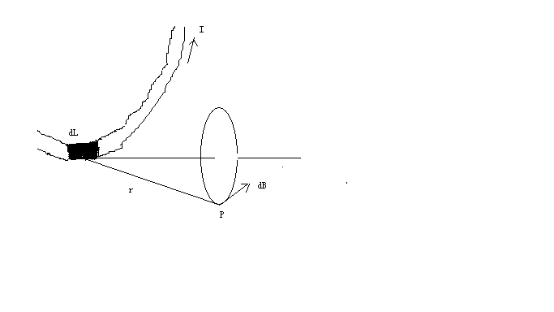

以上毕奥—萨伐尔定理是从实验中总结出来的规律，反映了运动电荷在周围空间产生的磁场情况。我们知道，磁场是电场的相对论效应，相对于我们观察者静止的电荷在周围空间产生静电场，一旦电荷相对于我们观察者以某一个速度运动，又会在周围空间产生磁场，应该可以用相对论导出毕奥---萨伐尔定理，下面来给出导出过程。

首先我们用式dB =μ。i dL×【R】/ 4π r²导出匀速运动点电荷的磁场。

在上图中的电流元，设它的截面为s，其中截流子数密度为n，每个截流子的电荷都是q，并且都以漂移速度V 运动，V的运动方向和dL的方向一致，整个电流元i
dL在P点产生的磁场可以认为是这些以同样速度V运动的截流子在p点产生的磁场的叠加，由于电流强度i
= n q s V, 而且此电流元内公有n s
dL个截流子，所以，每一个截流子在p点产生的磁场B（忽略不同的截流子到p点的矢径的差异）就应该是：

B = μ。n q s V i dL×e【R】/ 4π r² n s dL

由于V和dL方向相同，所以有：

B = μ。q V×【R】/ 4 π r²

由相对论我们知道，一个以速度V相对于我们观察者匀速运动的点电荷，产生的磁场B和电场E、光速c满足以下关系：

B = V×E/c²

我们确定了式B =
V×E/c²中电场E的分布，就可以做出判断，为此，我们利用库伦定理，

E = q 【R】/4 π ε。r²

由式E = q 【R】/4 π ε 。r²和式B = V×E/c²可以导出式

B = μ。q V×【R】/ 4 π r²

注意ε。μ。=1/ c²

我们知道，库伦定理导出的电场分布只适于静止电荷，不适于运动电荷，但是，导线中的截流子（就是导线中自由移动的电子）一般速度是很小的，只有0.0001米/秒，和光速c比起来简直是太小了，是可以忽略的。

磁场的安培环路定理可以从毕奥----萨伐尔定理导出来，而麦克斯韦的位移电流假说也反映了随时间变化的电场可以产生磁场，这一切和相对论中随速度变化的电场产生磁场本质都是一回事情。

一个物理量随速度变化，就意味着一定会随时间变化。把安培环路定理、毕奥----萨伐尔定理、麦克斯韦位移电流假说、相对论中磁场是电场的相对论效应综合起来考虑，更加深我们对自然界统一于时空、统一于运动的认识。

五十一，解释麦克斯韦方程中位移电流假设。

麦克斯韦方程组中电场E变化产生了磁场B

∮（ B·dL） =μ。I + (1/c²) ∂ Φe /∂ t

= ∯[μ。I + （1/c²）（∂ E/dt ）·∂ S)]

以上方程表示运动的电荷μ。I【也就是电流，安培环路定理中电流项】可以产生磁场，变化的电场（1/c²）（∂ E/dt
）·∂ S)也可以产生磁场【即麦克斯韦位移电流假设】。

麦克斯韦位移电流假设表示了在真空中，点电荷周围电场的变化和磁场之间的关系，而安培环路定理表示了许多点电荷运动产生的变化电场和磁场之间的关系，我们应该看到，麦克斯韦位移电流假设是基本的，安培定理只是推广。

本文描述的是质点在真空中的运动情况，不考虑形状物体在介质中运动情况，所以，略去μ。I这一项，重点解释∮(B·dL)
= （∂/∂t ） ∯（ E·∂S)/c²

以上方程认为，在某一个时刻，在点电荷o附近某处自由空间中的p点，不存在其他电流的情况下，在空间曲面上变化的电场E可以产生环绕线状磁场B，且满足关系式

∮(B·dL) = （∂/∂t ） ∯（ E·∂S)/c²

以上c是光速，dS为矢量面元，t
为时间，∂是偏微分的意思。L是沿B方向的几何环绕线量，方程左边是环路线积分，右边是左边线路包围的面积分，积分范围0角度到2π。

我们知道，速度包含了时间，随速度变化意味着肯定随时间变化，所以，应该可以从相对论中磁场、电场基本关系式B
=V×E/
c²导出麦克斯韦的变化电场产生磁场的位移电流假设，也可以导出法拉第电磁感应方程，下面分别来给出推导过程。

相对论认为，一个点电荷o相对于我们以速度V运动的时候，在周围空间p点处产生了电场E和磁场B，并且满足以下关系：B
= V×E /c²

我们将方程B = V×E
/c²两边点乘一个微小的空间长度矢量∂L（方向和B同向时候，B·∂L的值为最大）,
结果为：

B· ∂L =（V×E /c²）·∂L = (1/ c²)（∂U×E/∂t）· ∂L= (1/ c²∂t) E · (∂L× ∂U)

注意∂U /∂t =
V由于∂L和∂U相互垂直时候，相乘数值最大，因而（∂L× ∂U)可以看成一个矢量面元∂S
= ∂L×∂U， ∂S的方向和E一致的时候，E·(∂L× ∂U)的值最大。这样

B· ∂L = (1/ c²∂t) E · ∂S

如果我们将方程 B · ∂L =(1/ c²∂t)E · ∂S
两边的变矢量微分求环量积分，环量积分范围从0到2π

B·∂L = (1/c²∂t)E· ∂S方程右边的矢量面元∂S =(∂L× ∂U)
积分后变成了一个分布在三维空间中的曲面，方程左边的变矢量微分∂L环绕一周积分后为右边空间曲面的边界线。

∮ B· dL = ∂/∂t∯ （ E
· ∂S)/c²左边取环绕一周的线积分，右边取环绕一周的面积分，两个积分区域是相同的，都是角度从0开始到2π结束，因而对方程两边的空间变量求环路积分，等式仍然成立

∮ B·∂L = (1/c² ∂t) ∯ （E·∂S）

这个就是麦克斯韦位移电流假设。

注意，式∮（ B · ∂L）
=  1/c² ∂t∯（E· ∂S)中积分∮B·∂L是沿B的环绕方向的线积分，∯ E·∂S是电场E在三维空间曲面上的分布,
可以认为磁场B在L上的分布【也就是∮（B·∂L）】就是电场E在三维空间曲面上的分布因曲面变化而产生的圆周边界线上的分布。

五十二 ，解释法拉第电磁感应原理

∮（E·∂R） = －∯∂Φb /∂t = ∯（- ∂ B /∂t）· ∂S

这个方程也就是法拉第的电磁感应原理。

由磁场和电场基本关系式B = V×C/ c²，得到：

B = (∂U/∂t)×E/ c ²

在统一场论中认为，时间是空间以光速运动造成的，有时空方程：R = R(t) = Ct
= x i+ y j + z k 标量式为r ² =c²t²

r是高斯面s = 4 π r²【r等于矢量R的长度】的半径, 这样有：

B = (∂U/∂t)×E/ (∂r/∂t) ²

B (∂r)²/∂t = ∂U×E

B (∂R· ∂R)/∂t = ∂U×E

将方程两边点乘单位矢量N,

N·[B(dR· dR) )]/∂t = N ·（ ∂U×E）

由于高斯面s=4πr²是以r为半径，以光速c扩大，因而在(∂r)²= ∂R· ∂R很小的情况下，可以把(∂r)²可以看成是高斯面其中的微小一部分，用矢量面元∂S【数量为∂s】表示，则：

N·（B ∂s)/∂t = N·（ ∂U×E）B· ∂S/∂t = N·（ ∂U×E）

以上用矢量面元∂S表示微小面积∂s，面元∂S的方向和N一致，由矢量运算公式，以上方程右边可以写为E·（ ∂U×
N），因此有下两个式子：

B· ∂S/∂t = E·（∂U× N）

B· ∂S/∂t = - E·（N×∂U）

用线矢量∂L表示N×∂U，则上两式为式为：

B· ∂S/∂t = E·∂L

B· ∂S/∂t = - E·∂L

这两个式子我们选哪一个？

在统一场论中，电荷o点的质量为m，带有电荷q = k
dm/dt【k为常数】在周围空间p处产生的磁场B的几何方程为：B =Ψ【μ。ε。(k
dm/dt)R×V/4πε。r³】Ψ 为相对论效应修正相.

并且Ψ = （1- v²/c²）/【√[1-(v²/c²)sin²θ]
】³，其中θ为R和x轴的夹角。由于1/c² =μ。ε。，所以

B =Ψ【μ。ε。(k dm/dt)R×V/4πε。r³】

可以写为：

B =Ψ【 (kdm/dt c²)R×V/4πε。r³】

由统一场论的时空方程R = Ct,上式可以为：B =Ψ【 (k m )d【R】×V/ c
4πε。r³】【R】为沿R的单位矢量，V/ c的数量式v/
c在统一场论可以表示为cosθ,由于cosθ的微分为-sinθ,所以应该取B·∂S/∂t = -
E·∂L

上式两边是微分式，两边取环绕积分，积分范围都是从0到2π，得到法拉第电磁感应方程:

-（B · ∂S）/dt = E·∂L

由斯托克斯定理，上式可以改写为微分式：

▽×E = ( - ∂ B /∂t) ·∂S

注意，式-（B · ∂S）/∂t =
E·∂L右边是环绕一周的线积分，左边是面积分，右边的环绕一周的线积分可以看成是左边的面积分的边界线，一个开放的曲面，面积发生变化时候，变化量无限微小，可以看成是这个开放曲面的边界线。

法拉第电磁感应原理表示了磁场在空间曲面上的分布发生变化，可以表示为这个曲面边界线上电场的分布。

五十三，光子模型。

相对于我们观测者加速运动的电荷会在周围空间产生加速变化的电磁场，加速变化的电磁场使某些电子周围的力场和电磁特性消失后，再将这些电子带着以光速辐射式向外运动，这个就是电磁波，又称光。

光子模型一种是由单个电子相对于我们观察者以螺旋式远离我们运动，并且旋转的中心是条直线，在这个直线方向速度是光速。

第二种是两个电子绕一条直线旋转，同时又沿着这条直线平行方向以光速运动，结果是以螺旋式远离我们观察者运动，并且这两个电子在中心这条直线的垂直方向是对称的。

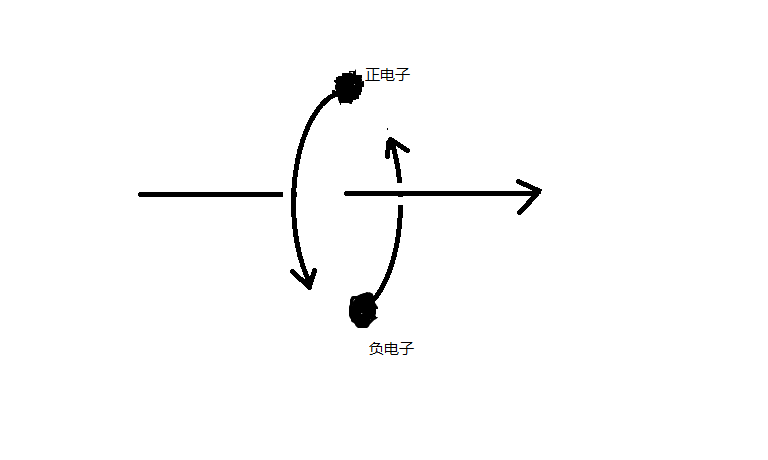

光子的动量为P = m C，

m是光子运动质量，C是矢量光速。光子静止动量和静止质量都为零。

光子的能量为e = m c²

电子受到了加质量力（C-V）dm/dt的作用后，处于静止质量为零的激发状态，这个就是光子，光子相对于观察者以光速运动。

宇宙中任何物体粒子周围空间以粒子为中心，以光速发散运动，光子周围空间光速运动形式，光子静止在空间中随空间一同运动。

光子的波动性是空间本身的波动，空间时刻波动，波动速度就是光速。

五十四，统一场论的主要应用。

1、造出可以光速飞行的飞碟来。

自然界有两种截然不同的运动方式，一种是普通的速度随时间变化的加速度运动。一种是质量随时间变化的运动，比如发光。外星人的飞碟其实就是利用质量随时间变化的运动原理。

2、人工场

场本质的破译，使人类可以造出一种特殊的人工场，这种人工场可以使人穿墙而过，而且人和墙都完好无损。人工场可以使冷焊大规模使用，使造房子、工程、工业制造的速度百倍的提高，费用百倍的降低，可以在人类生产、生活、医疗----的各个方面创造神话。

3、人工信息场扫描。

人工场在电子计算机程序控制下工作，叫人工信息场。

人工信息场可以对人体冷焊接、激发、加热，可以高速切割、搬运等功能，可以对分子和原子精确的、批量的操作。

人工信息场还可以在人体内部手术，而不影响外部，手术的时候不要开肠破肚的就可以在人体内部移走物体。

人工信息场这些不可思议的能力，以及和电子计算机完美结合可以使人类彻底治疗癌症、高血压、糖尿病、老年痴呆症-----等各种慢性疾病，可以使人类进入无药物时代。

人工信息场减肥、整容、雕塑人体型的效果神奇到不可思议，而且人毫无痛苦，

4，瞬间消失运动----全球运动网

统一场论理论预言了一种不连续的瞬间消失运动----加质量运动，全球运动网利用这种不连续的瞬间消失运动原理而建立。全球运动网可以使人员和商品在一秒钟之内出现在全球任何一个地方，包括在密封的房间同样做到。

5、全球大规模无导线导电

这个是利用纯净的真空来导电，能量耗散低，对环境几乎没有影响，用电器只要连着闭合线圈就可以接收电能，线圈断开就没有电能了，这样方便控制。

6、汇聚太阳能接收器

可以在一平方米上接受上万平方米太阳能，解决人类能源危机，而且能源廉价，几乎可是免费的。

汇聚太阳能接收器还可以人为的减少某一个地方的太阳能，结合电子计算机分析，来强力的控制、调节天气，避免有害天气的出现。

7，无限压缩空间储存、传输信息技术。

宇宙任意一处空间可以存储整个宇宙信息，空间可以无限压缩，无限压缩空间储存、传输信息技术，是人类信息技术的升级。

8、虚拟建筑。

利用人工场对空间施加影响，比如影响一个平面，这个平面可以对运动经过的物体产生阻挡力，再用

人工场锁住光线，使这个平面染上颜色，这样，就可以产生一个虚拟平面，这个虚拟平面可以当做一堵水泥墙，利用这个虚拟墙就可以组成各种虚拟建筑。

9，时空冰箱。

我们把食物储存在时空冰箱里，虽然里面的温度和外面的一致，但是这种时空冰箱在人工场的照射下，我们在外面已经过了一年，里面的时间才过了一秒，所以，这种冰箱保存食物的保鲜程度是普通冰箱望尘莫及的。

10，意识读取、存储的场扫描技术。

人的意识和思维是人大脑中运动的带电粒子的运动造成的，会对空间施加扰动效应。

统一场论理论揭开了这种扰动的本质和形式。

在人的大脑里，用场这种无形物质深入到脑内部，扫描记录这些空间扰动效应，可以读取、记录人的意识和记忆，从而进一步的把人的意识信息拷贝下来，储存在电子计算机中，待以后人类科技发展到一定程度，再把这些意识信息安装在某一个生物体上，为人长生不老的扫清技术障碍。

这种场扫描技术也可以改变教育模式，可以高速向人大脑输送死记硬背之类的知识，使人学习时间大大缩短。也为人脑和电脑、互联网的对接提供了可能。

张祥前主要作品有

纸质书《果克星球奇遇》（56元）

以下是电子版（98元）

《安徽农民外星球一个月见闻》

《果克星球奇遇1版》

《果克星球奇遇2版》

《统一场论6版》

《揭秘万有引力的本质》

《揭秘时间、空间的本质之谜》

《时间的物理定义》

《揭秘电荷、电磁场的本质》

《揭秘外星人飞碟之谜》

《介绍外星球》

《宇宙中只有一个我吗》

《揭秘人的生死之谜》

《人死亡时候的感受》

《为什么人死亡时间能够回忆出生时候的感受》

《人痛苦的根源》

《介绍人的前世爱情》

《最新科学理论证明生命轮回的真实性》

《揭秘预言家预言之谜》

《揭秘人的生死、轮回、意识、灵魂之谜》

《宗教和科学》

《我们都是农民》

《一眼看透中国人的本质》

《国家起源之谜》

《张祥前外星球旅行语音分享》

《张祥前谈人生命轮回视频分享》

想看的网友发邮件到张祥前的邮箱zzqq2100@163.com咨询。

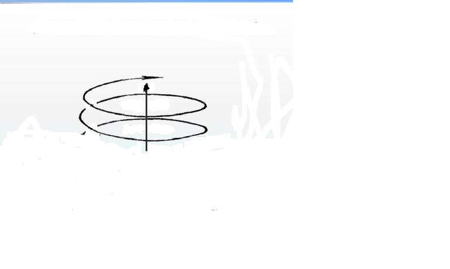
.. |地球和太阳周围的空间.png| image:: media/image2.png
   :width: 5.76806in
   :height: 3.45486in
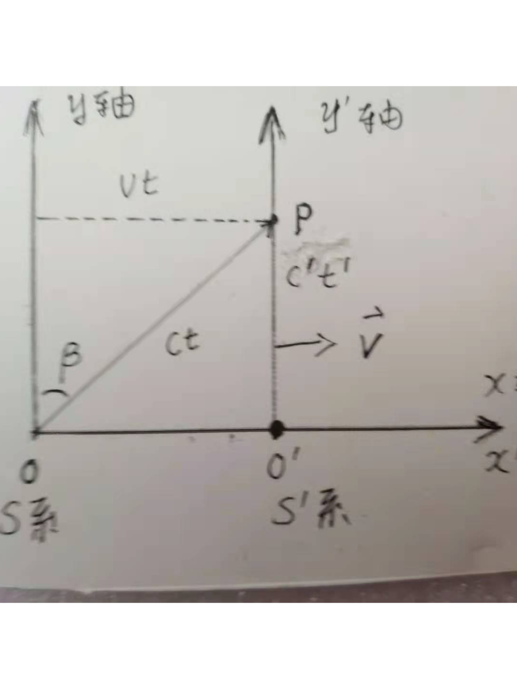
