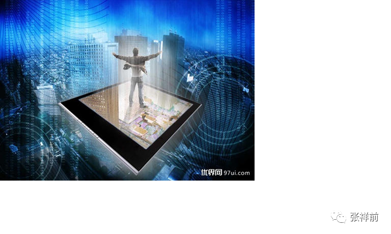

宇宙的全息、子信息概念
===================================

作者张祥前交流微信zhxq1105974776

我们用放大镜观察人体组织，特别是人的血液，看起来是许多独立的细胞组成，并且这些血液中的细胞是在到处跑，不是局限在某一个地方。

我们有一个疑问：这些细胞是不是个个都具有独立的生命意识，就像一个个独立的小生命体，人体内部是不是有一个总司令，在时刻指挥这些细胞按照一定的方式在干活、有序的运动。如果没有，细胞怎么这么听话，协调一致的在工作？

有人说，“这不是废话吗，如果细胞都胡乱运行，人身体岂不是完蛋了吗”？

我们应该认识到，以上问题对人类认识生命的本质很重要。

一个靠谱的看法是，细胞相互之间可以传递信息。人体内部的指挥系统，可以把信息传递给每一个细胞，有可以接受每一个细胞反馈过来的信息。

目前生物学发现，细胞间的信息传递通过很小的信号分子进行。信号分子由特定细胞发出，由靶细胞接收。

这种信息传递系统运作的距离可长可短。

蛋白质、脂肪酸衍生物、气体都可以作为信号传递介质。人体局部发出信号，利用一氧化氮气体传递，可以使人体血压降低。

人体内部远距离传递信号的是激素，通过循环系统从产生的地方运送至靶细胞。

当人们追根求源的时候，会发现，细胞之间传递信号问题，本质就是物理中的电磁力传递问题。传递信号的所有介质，通过放大，最后发现都是不连续的，之间都隔着空间距离，它们是如何通过空间来传递信息的？

这些问题和电荷之间为什么能够通过空间来传递信息、作用力的问题是一样的。

只有当人类搞清楚电荷相互之间作用的本质，才可以彻底的了解细胞之间是如何传递信息的。

本人创立的统一场论【百度统一场论6版可以搜到】指出，宇宙中任何物体周围空间都以圆柱状螺旋式在向四周发散运动，电磁、万有引力、核力一切相互作用都是通过空间来进行的，都是圆柱状螺旋式运动状态的改变形式。

统一场论如果被人类重视，可以使人类对生命的认识跃升到一个新的高度。

人类只是认识到人体的营养、能量的传递、分配过程，是远远不够的，人类还必须要认识到，人体内部的信息是如何产生、传递的，特别是除神经传递信息外的另外传递信息的方式。才可以全面的了解人生命的本质。

限于文章的篇幅，这里简单谈谈与人体信息传递相关的全息和子信息概念。

我们经常有一个疑问：

人为什么有5个手指、5个脚趾？

原来，人从精子和卵子结合开始，进行细胞分裂，每分裂一次，都要把原来细胞里携带的信息带到新的细胞里。

这样，人体局部区域都带有人体整体信息。这个就是人体全息概念。人身体任意一部分都包含着一个人整体的全部信息。这个就是人体全息、子信息的概念。

人的大拇指对应着人的脑袋，其余四指对应着人的四肢。

很有意思的是，宇宙同样具有全息、子信息的概念。

统一场论一个观点是，宇宙中任意一处空间可以存储整个宇宙所有的信息，包括宇宙以前、现在、过去所有的信息。

换句话，宇宙空间不但可以存储信息，而且任意一处空间可以存储无穷大的信息。

我们还要认识到，空间本身具有储存、传输信息的能力，但是，不具备制造信息的能力，制造、产生信息的是物体。

空间为什么有这么强大的存储信息的能力？

首先我们要搞清楚信息是什么？信息不是物质，也不是物质的组成部分，信息是物质相对于我们观察者存在和运动形式。

宇宙中的物质由空间和物体组成，其余统统不存在，其余只是我们观察者对物体运动和空间本身运动的描述。

目前为止，人类只是知道物体粒子的运动，不了解空间本身在运动，所以，人类利用微小的物体粒子运动来记录存储信息、输送信息。这个物体粒子越小处理信息就越厉害，但是，毕竟再小物体粒子仍然是有体积的，空间可以无限分割，所以，空间储存信息的能力是任何物体粒子望尘莫及的。

统一场论的出现，可以使人们利用真空来处理信息，会使人类处理信息的能力发生质的飞跃。

用空间处理信息是人类最终极的手段，没有更高级别的了。

那么，空间能够储存、传输信息的基本原理是什么？

统一场论认为宇宙中任何一个相对于我们静止的物体，周围空间都以光速向四周发散运动，空间这种运动可以把这个物体的一切外部、内部的信息以光速带到周围空间里。

当三维空间以光速运动的时候，沿运动方向一维空间长度由于相对论的长度缩短效应，将缩短为零，三维空间缩短为二维空间。

由于二维空间和宇宙任意一处三维空间存在着零距离，这样导致了携带物体信息的二维空间可以把物体所有的信息均匀的带到宇宙任意一处宇宙空间里。

宇宙所有的物体累加起来仍然如此。所以，反过来说，宇宙任意一处空间就包含了宇宙所有的信息。既然是所有的信息，就肯定包括了现在、以前、以后所有的信息。

换句话说，空间可以无限压缩，无限存储信息。或者说空间存储信息的能力是无穷大的。

宇宙任意一处空间，可以包含这个宇宙所有的信息，这个就是宇宙的全息、子信息概念。

打给比方，你的一个朋友从北京打电话给身在广州的你，你朋友的手机发出的信息，以光速传到了广州，被你接受。同样的信息，同时又传到了东京、合肥、上海、南京、武汉·····

如果从你是别的地方来接受信息，和你在广州接受信息都是一样的，也就是信息完整的均匀的分布在周围空间里。

信息的分布和物体能源分布很不一样，物体和能源总量是固定的，一个人分多了，另一个人就分少了。

所以说，信息可以共享，而物体和能量是不能共享的，就是这个道理。

二维空间存在着信息，有人能够捕捉到二维空间中的现在、以前、以后的信息，并且对未来做出预言，或者能够通过二维空间来传递信息。

统一场论中指出了宇宙中的万有引力、电磁场力、核力相互作用都是通过空间来进行的。空间不但能够传递物体之间的相互作用力，还可以传递信息。

人的意识就是人大脑中带电粒子对周围空间的扰动，这种扰动引起空间的波动，波动速度就是光速。

人类的预感，预言家对未来的预言，这些都与空间存储的信息有关，因为空间不但可以存储过去的信息，还可以存储没有发生的信息。有些人天生就具有捕捉空间信息的能力，类似于手机接收信息的共振原理，算是一种特异功能。

空间有许多奇异的性质，当然最核心、最基础的秘密是在以柱状螺旋式运动。自然界核心秘密隐藏在空间中，人类对空间的认识还刚刚开始，空间里隐藏的无穷无尽的奥秘，等待我们去揭开。

